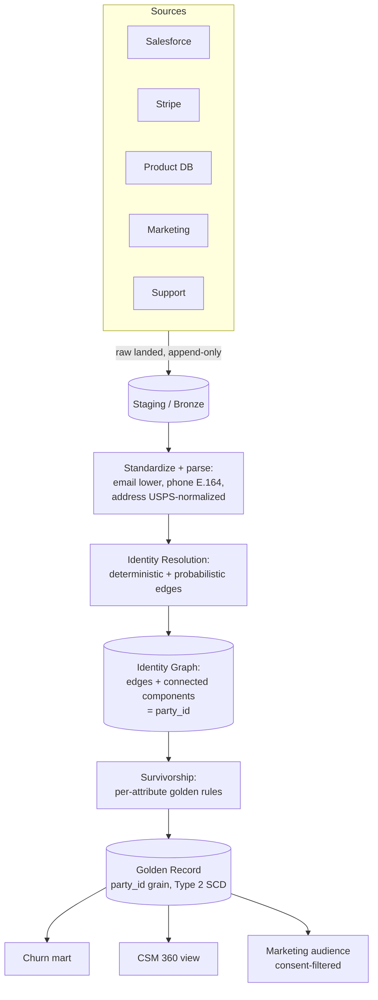

# Customer 360

> Chapter from the **Data Engineering Playbook** — data-modeling.

## About This Chapter

**What this is.** Customer 360 is the problem of combining multiple systems — each of which thinks it is the authoritative source for customer data — into one trustworthy customer view. This chapter treats that problem as three layers: an identity graph (figuring out who is who), a golden record (one resolved set of attributes per customer), and profile marts (query-ready views for each downstream consumer). The chapter focuses on identity resolution, survivorship, and consent work, which is the bulk of the actual engineering effort.

**Who it's for.** Mid-level data engineers, data/ML engineers, platform/architecture leads, and engineers preparing for senior/staff data-engineering interviews.

**What you'll take away.** By the end you'll be able to:
- Separate the identity graph, golden record, and consumer marts, and resolve identity as connected components (groups of records that all belong to the same person) over deterministic and probabilistic edges (connections between records).
- Keep probabilistic merges reversible, cap runaway components, and hold `party_id` stable across re-resolution through the stable/grow/split/merge cases.
- Encode per-attribute survivorship — including consent by most-restrictive — and model consent and GDPR/CCPA erasure as deterministic operations in the schema.
- Apply bitemporal modeling (tracking both when something was true and when you learned it), blocking before matching, lineage to source rows, and reconciliation back to source totals.

---

Customer 360 is the problem of producing one trustworthy view of a customer out of N systems that each believe they are the system of record. It is 20% modeling and 80% identity resolution, consent enforcement, and reconciliation. The schema is the easy part.

## TL;DR

- A Customer 360 is three layers, not one table: an **identity graph** (who is who), a **golden record** (the resolved, survivorship-decided attributes), and **profile marts** (denormalized, query-shaped views per consumer). Conflating them is the most common design failure.
- Identity resolution is a graph connected-components problem. A connected component is a set of records that are all linked together, directly or transitively. Edges (connections between records) come in two types: deterministic edges (shared SSN, verified email — high confidence) and probabilistic edges (fuzzy name + address — scored similarity). Probabilistic merges must be **reversible**, because they will be wrong and a wrong merge leaks one customer's data into another's profile.
- The golden record is survivorship over multiple source systems. Survivorship means choosing which source's value "wins" for each attribute. Encode the survivorship rule per attribute (recency, source trust rank, completeness), not globally. `email` and `mailing_address` rarely want the same rule.
- Consent and purpose limitation (restricting how data can be used based on what customers agreed to) are columns and row filters in the model, not a downstream afterthought. GDPR/CCPA erasure must be expressible as a deterministic delete across the graph, the golden record, and every mart.
- History matters: a Customer 360 is a Type 2 SCD (Slowly Changing Dimension — a pattern that preserves historical versions of a row instead of overwriting them) at heart. "What did we believe about this customer on 2026-03-01?" is a real audit question you will be asked.
- Lineage from every golden attribute back to its source row is non-negotiable. When sales disputes a churn score, you need to point at the exact contributing records in under a minute.

## Why this matters in production

Concrete scenario from a SaaS + e-commerce business. The customer exists in:

- **Salesforce** (sales-entered, free-text, duplicates galore)
- **Stripe** (billing, keyed by `cus_xxx`, email is canonical here)
- **The product app** (Postgres, keyed by internal `user_id`, has the auth email)
- **A marketing platform** (Braze/Iterable, keyed by its own ID, has consent flags)
- **Support** (Zendesk, keyed by email, often a *different* email — the personal one)

A churn model wants "lifetime revenue, last login, open support tickets, marketing-email opt-in" per human. None of these systems share a key. The product user signed up with `alex@gmail.com`, pays via a corporate card under `a.kim@acme.com`, and opened a ticket from `alexkim88@yahoo.com`. To the five systems this is five customers. To the business it is one person — Alex Kim — and if you bill the wrong one, suppress the wrong marketing consent, or attribute revenue to the wrong account, you have a compliance and a trust incident, not a data-quality ticket.

Customer 360 is the system that resolves these five into one, decides which `email` survives, tracks that this resolution happened (and can be undone), and serves the result to the churn model, the CSMs (Customer Success Managers), and the GDPR erasure pipeline — each with a different shape and a different consent scope.

## How it works

Three layers, each with a distinct grain (the level of detail one row represents) and a distinct failure mode.



### The grains

| Layer | Grain | Keyed by | What it answers |
|---|---|---|---|
| Source-aligned staging | one row per source record | natural source key | "what did system X send" |
| Identity graph | one edge per match decision | `(src_a, src_b, rule)` | "why do we think these are the same person" |
| Golden record | one row per resolved party (Type 2) | `party_id` | "what do we believe is true, and as of when" |
| Profile mart | one row per party, denormalized | `party_id` | "the answer a specific consumer needs" |

### Identity resolution as graph connected components

Think of identity resolution as a graph problem: each source record is a node, and a connection (edge) between two nodes means "these two records are probably the same person." After all edges are drawn, every **connected component** — meaning each isolated cluster of linked nodes — becomes one party and gets one stable `party_id`.

Edges come in two flavors:

- **Deterministic**: exact match on a high-trust identifier. Verified email after confirmation, government ID, Stripe customer ID shared across an order and a subscription. Confidence ≈ 1.0.
- **Probabilistic**: a similarity score over a feature vector (a set of fields used as matching signals) — Jaro-Winkler (a string similarity algorithm) on name, geo-distance on address, soundex (a phonetic encoding) on last name, edit distance on phone. You compute a match score and threshold it:

```
score(a, b) = Σ wᵢ · simᵢ(a, b)        # weighted feature similarity
edge(a, b) if score(a, b) ≥ τ_high      # auto-merge
review(a, b) if τ_low ≤ score < τ_high  # human / steward queue
no edge if score < τ_low
```

The dangerous property: connected components are **transitive**. If A↔B and B↔C are both edges, A, B, and C collapse into one party even if A and C share nothing. One bad probabilistic edge can chain-merge two real humans. This is why probabilistic edges are stored as data you can delete, and why you cap component size and quarantine suspiciously large components (a 4,000-record "person" is a bug — usually `info@`, `noreply@`, or a shared kiosk login acting as a hub node — a single record with many connections that incorrectly pulls unrelated records together).

### Survivorship (the golden record)

Once a component is determined to be one party, you must collapse its member records' attributes into one golden value per attribute. Survivorship means picking which source wins for each field. The survivorship rule is **per attribute**, encoded as data:

| Attribute | Survivorship rule | Why |
|---|---|---|
| `email` | source trust rank: app(auth) > stripe > salesforce > support | auth email is verified |
| `legal_name` | most complete, tie-break newest | free-text Salesforce wins when populated |
| `mailing_address` | most recent verified (USPS-normalized) | people move |
| `phone` | most frequent non-null across sources | typos are random, truth repeats |
| `marketing_consent` | most restrictive across all sources | safety: opt-out anywhere = opt-out everywhere |

That last row is the one engineers get wrong. Consent does not "survive" by recency — it survives by **most restrictive**. If any source says opt-out, the golden record is opt-out, full stop.

## Deep dive

### Stable IDs across re-resolution

`party_id` must be stable across daily re-runs. If you assign IDs by a hash of the component members, the ID changes whenever the component gains or loses a record — and every downstream mart, ML feature store, and exported audience breaks its join. Instead:

1. Maintain a persistent `party_id` ledger keyed on a canonical anchor (for example, the oldest verified email in the component, or a minted UUID pinned to the component on first sight).
2. On re-resolution, **match new components to existing party_ids** by overlap of member source keys, not by recomputing from scratch.
3. Handle the four transition cases explicitly:
   - **Stable**: same members → same `party_id`.
   - **Grow**: new record joins a component → keep `party_id`, add lineage edge.
   - **Split**: a bad merge is reversed → one component becomes two; the larger keeps the `party_id`, the smaller mints a new one, and you emit a `party_split` event so consumers can re-key.
   - **Merge**: two previously separate parties are now linked → one `party_id` wins (oldest), the other is tombstoned (marked as retired with a forwarding pointer) with a `merged_into` pointer that you **never** physically delete (downstream foreign keys — references from other tables — still reference it).

The tombstone-with-pointer pattern is the same survivorship discipline you'd apply to a Type 2 dimension: you never lose the old key, you redirect it.

### Reversible probabilistic merges

Store every edge with its rule, score, and timestamp. When a steward rejects a merge (or a customer complaint surfaces a wrong merge), you delete the offending edge(s) and re-run connected components on just that neighborhood — not the whole graph. This is why the graph is a first-class table, not an in-memory step. A merge you cannot reverse is a data leak you cannot remediate.

### Consent as a row filter, not a flag you hope people check

Model consent as a typed dimension: `(party_id, purpose, channel, status, effective_ts, source)`. Purpose here means the intended use of the data — `marketing | analytics | personalization | sharing_3p`. The marketing audience mart is `golden ⨝ consent WHERE purpose='marketing' AND channel='email' AND status='granted'`. The filter lives in the model so no downstream consumer can accidentally email an opted-out party. For erasure (GDPR Article 17 / CCPA — laws that give customers the right to have their personal data deleted), erasure must be a single deterministic operation: given a `party_id`, overwrite PII (Personally Identifiable Information) columns with tombstone values across the graph, golden record (all SCD versions), and every mart, while preserving the `party_id` skeleton and aggregate facts so financial reconciliation still ties out. With Iceberg (an open table format for large datasets), this is a copy-on-write `MERGE` plus a snapshot-expiry sweep so the old PII does not linger in historical files.

### Why bitemporality shows up here

Bitemporal modeling means tracking two separate time axes on each record. You have: when something was **true in the world** (`valid_from`/`valid_to`) and when **you learned it** (`recorded_from`/`recorded_to`). Auditors and disputes ask "what did we believe on date X" — that is the *recorded* axis. Marketing asks "where did they live in Q3" — that is the *valid* axis. A single Type 2 SCD only gives you one axis. For regulated customer data, model both; otherwise a late-arriving address correction silently rewrites history and your "as-of" reports stop reproducing.

### Late-arriving and out-of-order source updates

Sources do not arrive in order. Stripe webhooks retry, Salesforce backfills overnight, CDC (Change Data Capture — a technique that streams database changes in near real time) streams hiccup. Key every source record on its own **source event time**, not ingest time, and make survivorship deterministic given the full set of versions present — never "last writer wins by arrival." Otherwise the same input set produces different golden records depending on race conditions, and your pipeline is non-idempotent (meaning repeated runs with the same input give different results). Reconciliation will catch this but you want it correct by construction.

## Worked example

Identity resolution + survivorship in PySpark over Iceberg. Deterministic blocking first (to avoid an O(n²) cross join — comparing every record against every other record, which becomes impossibly slow at scale), then connected components via GraphFrames, then per-attribute survivorship.

```python
from pyspark.sql import functions as F, Window
from graphframes import GraphFrame

# 1. Standardize. Every comparison happens on normalized values, never raw.
std = (spark.read.table("bronze.customer_records")
    .withColumn("email_norm", F.lower(F.trim("email")))
    .withColumn("phone_e164", F.regexp_replace("phone", r"[^\d+]", ""))
    .withColumn("name_key", F.soundex(F.col("last_name")))
    .withColumn("rec_id", F.concat_ws(":", "source_system", "source_key")))

# 2. Deterministic edges: blocking key = exact verified email.
#    Self-join WITHIN a block, not across the whole table.
det_edges = (std.alias("a").join(std.alias("b"),
        (F.col("a.email_norm") == F.col("b.email_norm")) &
        (F.col("a.rec_id") < F.col("b.rec_id")) &      # dedupe + no self-loops
        (F.col("a.email_norm").isNotNull()))
    .select(F.col("a.rec_id").alias("src"),
            F.col("b.rec_id").alias("dst"),
            F.lit("det_email").alias("rule"),
            F.lit(1.0).alias("score")))

# 3. Probabilistic edges: block on soundex(last_name) to shrink candidates,
#    then score. Only emit edges above the auto-merge threshold.
TAU_HIGH = 0.92
cand = (std.alias("a").join(std.alias("b"),
        (F.col("a.name_key") == F.col("b.name_key")) &
        (F.col("a.rec_id") < F.col("b.rec_id"))))
prob_edges = (cand
    .withColumn("name_sim", F.expr("jaro_winkler(a.full_name, b.full_name)"))
    .withColumn("addr_sim", F.expr("jaccard(a.addr_tokens, b.addr_tokens)"))
    .withColumn("score", 0.6 * F.col("name_sim") + 0.4 * F.col("addr_sim"))
    .filter(F.col("score") >= TAU_HIGH)
    .select(F.col("a.rec_id").alias("src"), F.col("b.rec_id").alias("dst"),
            F.lit("prob_name_addr").alias("rule"), "score"))

edges = det_edges.unionByName(prob_edges)
edges.writeTo("silver.identity_edges").overwritePartitions()   # graph is durable + reversible

# 4. Connected components -> party_id. Cap runaway components.
vertices = std.select(F.col("rec_id").alias("id"))
spark.sparkContext.setCheckpointDir("s3://lake/_cc_checkpoints/")
comp = GraphFrame(vertices, edges).connectedComponents()       # 'component' col

sizes = comp.groupBy("component").count()
quarantine = sizes.filter(F.col("count") > 500)                # hub-node smell
comp = comp.join(quarantine.select("component"), "component", "left_anti")

# 5. Map raw component id -> STABLE party_id via the persistent ledger
#    (join on overlapping member rec_ids; mint UUID only for genuinely new comps).
party = resolve_stable_party_ids(comp, ledger="gold.party_id_ledger")

# 6. Survivorship: per-attribute rule. Email = source trust rank.
src_rank = F.create_map(*sum([[F.lit(k), F.lit(v)] for k, v in
    {"app": 1, "stripe": 2, "salesforce": 3, "support": 4}.items()], []))
enriched = std.join(party, "rec_id").withColumn("rank", src_rank[F.col("source_system")])

w_email = Window.partitionBy("party_id").orderBy(F.col("rank").asc())
golden_email = (enriched.filter(F.col("email_norm").isNotNull())
    .withColumn("rn", F.row_number().over(w_email))
    .filter("rn = 1").select("party_id", F.col("email_norm").alias("golden_email")))

# marketing_consent = MOST RESTRICTIVE (opt-out anywhere wins)
golden_consent = (enriched.groupBy("party_id")
    .agg(F.min(F.when(F.col("marketing_consent") == "granted", 1).otherwise(0))
          .alias("consent_flag"))   # min => any single 0 (denied) wins
    .withColumn("marketing_consent",
                F.when(F.col("consent_flag") == 1, "granted").otherwise("denied")))
```

The Iceberg `MERGE` that maintains the Type 2 golden record on each run, closing changed versions and inserting new ones:

```sql
MERGE INTO gold.customer_golden t
USING staged_golden s
  ON  t.party_id = s.party_id
  AND t.is_current = true
WHEN MATCHED AND t.attr_hash <> s.attr_hash THEN
  UPDATE SET t.is_current = false,
             t.recorded_to = s.batch_ts          -- close the old belief
WHEN NOT MATCHED THEN
  INSERT (party_id, golden_email, mailing_address, marketing_consent,
          attr_hash, recorded_from, recorded_to, is_current)
  VALUES (s.party_id, s.golden_email, s.mailing_address, s.marketing_consent,
          s.attr_hash, s.batch_ts, TIMESTAMP '9999-12-31', true);
-- second pass INSERTs the new current version for the rows just closed
```

## Production patterns

- **Blocking before matching.** Never run a full self-join for entity resolution — a 50M-record source is 2.5 × 10¹⁵ pairs. Block on a coarse key (soundex of last name, email domain, ZIP-3) so you only compare records that could plausibly match. Blocking recall (how many true matches your blocking key keeps eligible) is the real lever on match quality; tune it before you tune the scorer.
- **Steward review queue for the gray zone.** Edges between `τ_low` and `τ_high` go to a human queue. Stewards' accept/reject decisions become new deterministic edges (positive) or **blocking edges** (negative — "never merge these two"). Negative edges are gold; they encode hard-won knowledge that two similar people are genuinely different.
- **Emit identity-change events.** When a party splits or merges, publish a `party.merged` / `party.split` event to Kafka (a distributed event-streaming platform) so the feature store, the CRM sync, and exported audiences re-key. Design these as keyed compacted-topic events — compacted topics in Kafka retain only the latest event per key, so consumers always have the current mapping without replaying the full history. Silent re-keying corrupts every downstream that cached the old `party_id`.
- **Consent-filtered marts, never consent-filtered queries.** The opt-in filter lives in the marketing mart definition. Consumers query the mart; they cannot query the golden record directly for marketing purposes. This makes "we accidentally emailed opt-outs" a structurally impossible class of bug rather than a code-review hope.
- **Reconcile golden record vs sources every run.** Row counts, revenue totals, and active-customer counts must tie back to the source systems. A Customer 360 that doesn't reconcile to Stripe's revenue is a liability, not an asset.
- **Lineage to source rows on every golden attribute.** Store `golden_email_source_rec_id` alongside `golden_email`. When someone disputes a value you click through to the exact contributing record. Lineage is a column, not a separate system you'll wire up "later."

## Anti-patterns & failure modes

| Anti-pattern | Symptom you'll observe | Fix |
|---|---|---|
| Hashing component members into `party_id` | Downstream joins silently drop rows after every run; ML features go null | Persistent `party_id` ledger; match new components to existing IDs by member overlap |
| Global "most recent wins" survivorship | A stale Salesforce backfill overwrites a verified app email; opt-outs get flipped to opt-in | Per-attribute rules; consent = most-restrictive |
| Probabilistic merges with no reverse | A wrong merge leaks customer A's orders into customer B's profile; you can't undo it | Edges as durable rows; reverse by deleting edges + local re-resolution |
| No component-size cap | `noreply@company.com` chains 12,000 records into one "person" | Quarantine oversized components; treat shared/role emails as non-identifying |
| Last-writer-wins on arrival order | Same inputs produce different golden records run to run; reconciliation flaps | Key on source event time; make survivorship deterministic over the full version set |
| Consent enforced in the BI tool | An analyst exports an audience that includes opted-out parties | Filter in the mart definition; deny direct golden-record access for marketing |
| Single time axis | "As-of last quarter" reports change after a late address correction | Bitemporal model: separate valid-time from recorded-time |
| Identity resolution coupled to the nightly batch only | A merge fix takes 24h; support can't unblock a customer | Allow targeted, on-demand local re-resolution of one neighborhood |

## Decision guidance

| Situation | Approach |
|---|---|
| 2–3 sources, all share a clean key (e.g., verified email everywhere) | Skip the graph. Deterministic join into a Type 2 golden record is enough. |
| Many sources, no shared key, free-text PII | Full identity graph + probabilistic ER (entity resolution — the process of matching records that refer to the same real-world entity) + steward queue. This chapter. |
| Heavy regulatory / financial audit needs | Bitemporal golden record; consider Data Vault for the raw layer (hub = party, satellites = source-versioned attributes) feeding the 360. |
| Real-time personalization (sub-second lookups) | Batch-resolve the graph; serve the golden record + features from a low-latency KV store (key-value store — a fast lookup database) keyed by `party_id`. Don't resolve identity at request time. |
| You can buy it | An MDM/CDP (Master Data Management / Customer Data Platform — commercial products that handle identity resolution and customer data consolidation) is reasonable for marketing-only use. You will still own consent, lineage, and reconciliation. Don't outsource those. |

Relationship to the rest of data modeling: the golden record is the conformed customer **dimension** (a reference table that other fact tables join to) that your star schemas join to. Customer 360 is *how that dimension gets built* when the customer doesn't arrive with a clean key. SCD discipline governs how it changes over time.

## Interview & architecture-review talking points

- "I separate identity (the graph), truth (the golden record), and access (the marts). Most failed Customer 360s collapse these into one wide table and then can't reverse a bad merge or enforce consent cleanly."
- "Identity resolution is connected components over deterministic and probabilistic edges. The transitivity of components is the risk — one bad edge chain-merges two humans — so every probabilistic edge is reversible and components are size-capped."
- "Survivorship is per-attribute and encoded as data. The non-obvious rule: consent survives by *most restrictive*, never by recency. Opt-out anywhere means opt-out everywhere."
- "`party_id` stability across re-resolution is the requirement that breaks naive designs. I maintain a persistent ledger and handle stable/grow/split/merge as explicit cases, with merge tombstones that redirect rather than delete."
- "Consent and erasure are modeled, not bolted on. The marketing audience is a consent-filtered mart so emailing an opt-out is structurally impossible, and GDPR erasure is one deterministic operation across graph, golden record, and marts — with Iceberg snapshot expiry so old PII doesn't survive in history."
- "Everything reconciles back to source-system totals every run, and every golden attribute carries lineage to the contributing source record. If I can't tie revenue back to Stripe and click through to the source row, the 360 isn't trustworthy."

## Further reading

- Slowly Changing Dimensions — the Type 2 / bitemporal machinery behind the golden record.
- Data Vault — hub-and-satellite raw layer that feeds source-versioned attributes into a 360.
- Star Schema — the golden record is the conformed customer dimension consumers join to.
- Data Quality — Reconciliation — tying golden record totals back to source systems.
- Kafka — Event Design — emitting `party.merged` / `party.split` identity-change events.
- Lakehouse — Iceberg — copy-on-write MERGE and snapshot expiry for compliant erasure.
- Fellegi & Sunter, *A Theory for Record Linkage* (1969) — the probabilistic matching foundation everyone still uses.
- *The Data Warehouse Toolkit*, Kimball & Ross — conformed dimensions and survivorship in dimensional modeling.
