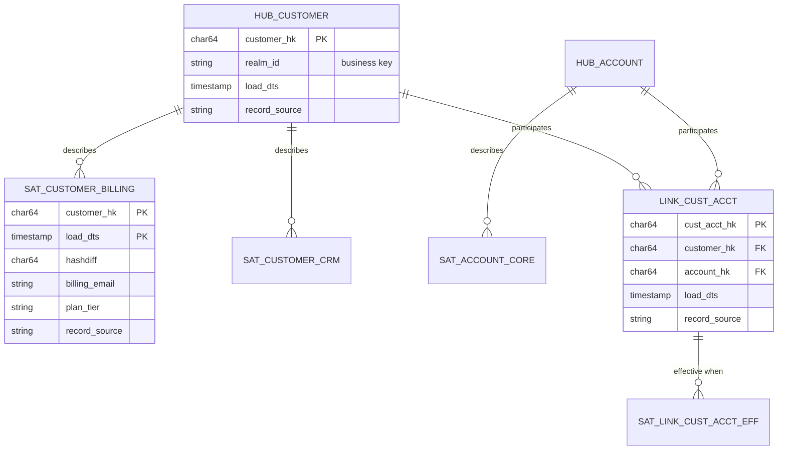

# Data Vault 2.0

> Chapter from the **Data Engineering Playbook** — data-modeling.

## About This Chapter

**What this is.** Data Vault 2.0 is a way of organizing your data warehouse's integration layer (the layer that combines data from multiple sources before it reaches reports or dashboards). It breaks that layer into three types of insert-only tables: Hubs (which store business keys — the real-world identifiers your business uses, like a customer ID), Links (which store relationships between those keys), and Satellites (which store descriptive attributes that change over time). This chapter covers the hash-key and hashdiff mechanics that let every source load in parallel, the modeling discipline that makes a vault work, and the performance costs you pay for it on a modern lakehouse.

**Who it's for.** Mid-level data engineers, senior/staff data engineers, data/ML engineers, platform/architecture leads, and engineers preparing for senior/staff data-engineering interviews.

**What you'll take away.** By the end you'll be able to:
- Model Hubs, Links, and Satellites and use deterministic hash keys (surrogate keys computed by hashing a business key, so any loader can generate the same key without a central lookup) to remove load-time dependencies between tables.
- Split satellites by rate of change, source, and classification, and handle effectivity satellites, driving keys, ghost records, and bi-temporal load-vs-applied time.
- Implement append + MERGE-on-hashdiff (insert a new row only when content has changed) loaders on Iceberg and build PIT (point-in-time) tables that turn expensive as-of subqueries into cheap equi-joins.
- Judge when a vault earns its 3-5x table fan-out versus when a star schema or one-big-table is the right call.

---

## TL;DR

- Data Vault decomposes the warehouse into three immutable, insert-only structures: **Hubs** (business keys), **Links** (relationships between keys), and **Satellites** (time-variant descriptive context). The split is what lets you load every source in parallel without coordination and without ever rewriting history.
- The model is built for **auditability and load concurrency**, not for query ergonomics. You do not report off the raw vault — you build star schemas / dimensional marts on top of it. Treat the vault as the integration layer, not the serving layer.
- The hash-key design (HK = `sha256(business_key)`) is the load-time trick that removes inter-table dependencies: every loader can compute its own surrogate keys deterministically and write in any order, even out of sequence.
- Satellites split by **rate of change and source system**, not by entity. A customer's address, marketing consent, and risk score belong in three different satellites because they change at different cadences and you want to avoid re-hashing 40 columns to detect that one changed.
- On a lakehouse (Iceberg/Delta), the insert-only approach maps cleanly to append + `MERGE`-on-hashdiff, but you pay for it in small-file proliferation and a fan-out of tables. Budget for compaction and expect 3-5x more physical tables than a dimensional model.
- Use it when you have **many overlapping sources, hard audit/regulatory requirements, and a slowly-stabilizing model**. Do not reach for it on a single-source pipeline or a startup that rewrites its schema quarterly.

## Why this matters in production

Picture the integration problem at a large company: customer identity arrives from the sign-up service, the billing platform, the payroll product, and a CRM. Each emits a different "customer" with different keys, different update frequencies, and different SLAs. The CRM arrives late by hours; billing is near-real-time off Kafka; payroll batches nightly.

In a classic dimensional model you'd merge these into one conformed `dim_customer`. That merge becomes a single chokepoint: every source has to agree on the surrogate key, loads serialize, and any schema change to one source forces a regression test of the whole dimension. When a source adds a column or a new system shows up, you're doing surgery on a table that 200 reports depend on.

Data Vault attacks this by **never merging at load time**. Each source loads its own satellites against a shared hub. The customer business key (say, `realm_id`) anchors a single `hub_customer`; billing writes `sat_customer_billing`, CRM writes `sat_customer_crm`, payroll writes `sat_customer_payroll`. They never touch each other's rows. A new source = a new satellite, additive, no regression on existing loads. An audit asking "what did we know about this customer's address on 2025-03-14 and where did it come from?" is a point-in-time query, not a forensic reconstruction, because nothing was ever overwritten.

The cost is real: you've traded a handful of fat dimension tables for dozens of skinny vault tables, and you've pushed all the query complexity downstream into the marts. That trade is worth it precisely when integration churn and audit are your dominant pains — and a liability when they aren't.

## How it works

Three core entity types, plus a couple of specializations:

| Entity | Holds | Grain | Mutability |
|---|---|---|---|
| **Hub** | A unique business key + its hash key | One row per distinct business key, ever | Insert-only |
| **Link** | A relationship: the hash keys of 2+ hubs | One row per distinct combination of keys | Insert-only |
| **Satellite** | Descriptive attributes for a hub or link, over time | One row per (parent HK, load timestamp) | Insert-only, time-variant |
| Effectivity Satellite | Tracks when a *relationship* is active (driving-key logic) | One row per link state change | Insert-only |
| PIT / Bridge | Query-acceleration tables built *from* the vault | Snapshot per business date | Rebuildable |

The four standard columns on every raw-vault row:

- `*_hk` — the hash key, `sha256(upper(trim(business_key)))`, the surrogate.
- `load_dts` — load timestamp, set by the loader, the time-variant axis on satellites.
- `record_source` — provenance string (where the data came from), e.g. `billing.kafka.customer_v3`.
- `hashdiff` (satellites only) — `sha256` over all descriptive columns, used to detect whether anything changed without comparing column-by-column.



### The hash-key insight

The reason loads can run in any order is that the hub hash key is a **pure function of the business key** — given the same input, it always produces the same output. The billing loader and the CRM loader, running on separate Spark jobs at different times, both compute `customer_hk = sha256(upper(trim(realm_id)))` and get the same value. Neither needs to look up a sequence number from a central table or wait for the other job. A satellite can even be written before its hub row exists (referential integrity — the guarantee that every foreign key points to a valid parent — is "eventually consistent" within the load window), and the hub `MERGE` simply de-duplicates on the same key. This is what eliminates the load serialization that dimensional models suffer from.

### Change detection via hashdiff

A satellite gets a new row only when the descriptive content changes. Instead of comparing each column individually — `WHERE a.col1 <> b.col1 OR a.col2 <> b.col2 OR ... (n columns)` — which is verbose, fragile when values are NULL, and slow — you compute one `hashdiff` over the concatenated, normalized payload and compare a single 64-character string:

```
hashdiff = sha256(
  coalesce(upper(trim(billing_email)),'^^') || '||' ||
  coalesce(upper(trim(plan_tier)),'^^')
)
```

If the incoming `hashdiff` differs from the latest stored `hashdiff` for that `customer_hk`, insert a new satellite row. Otherwise it's a no-op (do nothing). The `||` delimiter and the `^^` null-token matter: without them the values `('ab', null)` and `('a', 'b')` would hash to the same result, creating a false "no change" signal.

## Deep dive

This is where teams get it wrong. The mechanics are simple; the modeling discipline is not.

### 1. Satellite splitting — the decision that makes or breaks the vault

The naive move is one satellite per hub. Don't. Split satellites by **(rate of change × source system × classification)**:

- **Rate of change.** A customer's `last_login_ts` changes daily; their `legal_name` changes once a decade. Put them in the same satellite and every login forces a re-hash and a new row carrying the unchanged name. You bloat the table and your hashdiff churns constantly. Separate fast-moving and slow-moving attributes.
- **Source system.** Never combine attributes from two sources in one satellite — you lose clean provenance (the record of where data came from) and you couple two loaders together. One source, one satellite is the default.
- **Classification.** PII (personally identifiable information), payment data, and consent flags often have different retention and access rules. Splitting them lets you apply column-masking and retention at the table level instead of managing column-level access controls everywhere.

A practical heuristic: if two columns don't change together more than ~80% of the time, they probably want different satellites.

### 2. The driving-key / effectivity-satellite trap

Links are insert-only and capture *that* a relationship existed, never *that it ended*. So how do you model "this account moved from customer A to customer B"? You add an **effectivity satellite** on the link. The subtlety is the **driving key**: the side of the relationship that's stable (i.e., the entity that "owns" the relationship at any point in time). For "an account has one owning customer at a time," the account is the driving key. The effectivity satellite is closed out (a new row is written with the prior `load_dts` and a logical end flag) when a new link row appears for the same driving key. Get the driving key wrong and you either never close relationships (causing unbounded row growth) or you close the wrong ones (you'll see accounts flicker between owners). Symptom in prod: a point-in-time join returns two "active" owners for one account.

### 3. Same-as / hierarchical links

Two specializations people forget:

- **Same-as link (SAL):** maps multiple business keys that turn out to be the same real-world entity (master-data resolution — for example, a `realm_id` and a legacy `customer_no` that represent the same person). You keep both hubs intact and express the equivalence in a link, rather than destructively merging keys you might later need to un-merge.
- **Hierarchical link:** a self-referencing link on one hub (for example, an org chart or an account-of-account structure). It's a normal link with two foreign keys pointing to the same hub.

### 4. NULL business keys and the ghost-record

Links and PIT joins break when a key is NULL. Standard practice: insert a **ghost/zero record** (a placeholder row with a sentinel key) into every hub — `customer_hk = sha256('')` or a sentinel of 64 zeros — so downstream left joins against a missing key resolve to a real row instead of silently dropping it. Forget this and your dimensional marts will quietly lose fact rows whose key hadn't arrived yet.

### 5. Load timestamp vs. applied timestamp — two different times

`load_dts` is when *you* loaded the row into the warehouse. The business event time (`effective_from`) is a different concept — it belongs in the satellite payload as a separate column. Conflating them is a classic bug: you end up reordering history by ingestion order instead of the actual order events happened. For late-arriving data (data that shows up in your pipeline hours or days after the event occurred) you need bi-temporal awareness — `load_dts` for audit ("when did the warehouse learn this") and `applied_ts` for business reporting ("when was this true"). PIT tables should snapshot on the business date, not the load date.

### 6. On a lakehouse: append-only meets MERGE

Pure insert-only is the ideal, but on Iceberg/Delta you implement the "insert if changed" pattern with `MERGE INTO ... WHEN NOT MATCHED THEN INSERT`. Three operational realities:

- **Small files.** Each micro-batch appends a few rows per satellite across dozens of satellites. You will generate thousands of files smaller than 1 MB per hour. Schedule Iceberg `rewrite_data_files` (target 256-512 MB) and `rewrite_manifests`; on Delta run `OPTIMIZE`. See the sibling Iceberg chapter for compaction tuning.
- **MERGE cost.** A satellite `MERGE` keyed on `(hk)` that only needs to match the *current* row needs a pre-filtered target (a view of just the latest row per hash key) or it will scan the whole table. Partition satellites by `load_dts` date and use Iceberg hidden partitioning so the merge only touches recent partitions.
- **Hash collisions.** A hash collision is when two different inputs produce the same hash output. SHA-256 collision risk is negligible (~10⁻⁶⁰ at trillions of keys). MD5, still common in legacy DV tooling, is *not* safe at scale — switch to SHA-256. The storage difference (32 vs 16 bytes per key) is noise next to the payload size.

## Worked example

End-to-end PySpark loaders for a hub, a link, and a hashdiff-driven satellite onto Iceberg. This is the shape of a real raw-vault loader.

```python
from pyspark.sql import functions as F

HASH = lambda *cols: F.sha2(F.concat_ws("||", *[
    F.coalesce(F.upper(F.trim(c.cast("string"))), F.lit("^^")) for c in cols
]), 256)

src = (spark.read.format("kafka")  # billing customer stream, already deserialized upstream
       .load("billing.customer_v3")
       .select("realm_id", "billing_email", "plan_tier", "event_ts"))

staged = (src
    .withColumn("customer_hk", HASH(F.col("realm_id")))
    .withColumn("hashdiff",    HASH(F.col("billing_email"), F.col("plan_tier")))
    .withColumn("load_dts",    F.current_timestamp())
    .withColumn("record_source", F.lit("billing.kafka.customer_v3")))

# --- HUB: insert business keys we've never seen ---
spark.sql("""
  MERGE INTO dv.hub_customer t
  USING staged_hub s
    ON t.customer_hk = s.customer_hk
  WHEN NOT MATCHED THEN INSERT
    (customer_hk, realm_id, load_dts, record_source)
    VALUES (s.customer_hk, s.realm_id, s.load_dts, s.record_source)
""")  # staged_hub = staged.select(hk, realm_id, load_dts, record_source).dropDuplicates(["customer_hk"])

# --- SATELLITE: insert only when hashdiff differs from the latest stored row ---
spark.sql("""
  WITH latest AS (
    SELECT customer_hk, hashdiff,
           ROW_NUMBER() OVER (PARTITION BY customer_hk ORDER BY load_dts DESC) rn
    FROM   dv.sat_customer_billing
  ),
  current_state AS (SELECT customer_hk, hashdiff FROM latest WHERE rn = 1)
  MERGE INTO dv.sat_customer_billing t
  USING (
    SELECT s.* FROM staged_sat s
    LEFT JOIN current_state c ON s.customer_hk = c.customer_hk
    WHERE c.hashdiff IS NULL          -- brand-new key
       OR c.hashdiff <> s.hashdiff    -- changed content
  ) src
    ON 1 = 0                          -- force INSERT path; satellites are append-only
  WHEN NOT MATCHED THEN INSERT
    (customer_hk, load_dts, hashdiff, billing_email, plan_tier, record_source)
    VALUES (src.customer_hk, src.load_dts, src.hashdiff,
            src.billing_email, src.plan_tier, src.record_source)
""")
```

Building a PIT table to accelerate marts — one row per customer per snapshot date, pointing at the satellite row that was current then:

```sql
CREATE OR REPLACE TABLE dv.pit_customer USING iceberg
PARTITIONED BY (snapshot_date) AS
SELECT
  h.customer_hk,
  d.snapshot_date,
  -- the load_dts of the billing-sat row in effect on snapshot_date
  (SELECT MAX(s.load_dts) FROM dv.sat_customer_billing s
   WHERE s.customer_hk = h.customer_hk
     AND s.load_dts <= d.snapshot_date)  AS billing_load_dts,
  (SELECT MAX(s.load_dts) FROM dv.sat_customer_crm s
   WHERE s.customer_hk = h.customer_hk
     AND s.load_dts <= d.snapshot_date)  AS crm_load_dts
FROM dv.hub_customer h
CROSS JOIN (SELECT explode(sequence(
              date'2026-01-01', date'2026-06-18', interval 1 day)) AS snapshot_date) d;
```

A mart then equi-joins `pit_customer` to each satellite on `(customer_hk, *_load_dts)` — turning what would be n correlated as-of subqueries (expensive queries that ask "what was the value at this point in time?") into n cheap equi-joins (simple equality matches). That's the whole point of the PIT.

## Production patterns

- **Two-tier vault: raw + business.** The raw vault is a faithful, un-opinionated copy of sources (no business rules applied). The **business vault** adds computed satellites, bridge tables, and applied business rules. Keep them separate so you can rebuild business logic without re-ingesting raw data — and so audit always has the untouched raw layer to point to.
- **Hash everything at the staging boundary, once.** Compute all `*_hk` and `hashdiff` values in the staging job and carry them downstream. Re-hashing in multiple jobs invites drift (one job trims whitespace, another doesn't) and silent split-brain (the same business key produces two different hash keys in two different places).
- **Standardize the normalization function.** Publish one shared `HASH()` UDF (user-defined function) or macro — using upper, trim, `^^` null token, and `||` delimiter — and forbid ad-hoc hashing elsewhere. A single inconsistent loader poisons key matching permanently, and you can't detect it from the data alone.
- **Partition satellites by `load_dts` date; partition hubs not at all** (hubs are small and key-lookup dominated). Keeping satellites partitioned by date ensures MERGE operations only scan recent partitions on the high-churn tables.
- **Automate the boilerplate.** Data Vault is template-heavy — hub/link/satellite loaders are 90% identical. Generate them from metadata using a templating tool (dbtvault, AutomateDV, or a homegrown Jinja template). Hand-writing 200 loaders is how you get the inconsistent-hashing bug above.
- **Serve dimensional marts, not the vault.** Build star schemas on top for BI. See the sibling star-schema and SCD-types chapters — the satellite is effectively a Type-2 history table (one that tracks all historical values over time) that you flatten on read.

## Anti-patterns & failure modes

| Anti-pattern | Symptom you'll observe | Fix |
|---|---|---|
| One fat satellite per hub | Satellite row count explodes; every fast attribute change rewrites slow attributes; hashdiff churns hourly | Split by rate-of-change and source |
| Hashing with MD5 at billions of keys | Rare phantom merges — two distinct keys map to one HK; counts quietly wrong | Switch to SHA-256; backfill |
| Inconsistent normalization across loaders | Same business key produces two HKs; duplicate hubs; broken links | Single shared `HASH()` macro, enforced in CI |
| `load_dts` used as business event time | History reorders by ingestion; late data jumps to "latest" | Separate `load_dts` (audit) from `applied_ts` (business); PIT on business date |
| No ghost record in hubs | Fact rows with not-yet-arrived keys silently dropped in mart left joins | Insert zero-key ghost row in every hub |
| Reporting directly off raw vault | Analyst queries do 6-table as-of joins; p95 dashboard latency in tens of seconds | Build PIT/bridge tables and dimensional marts |
| No compaction on lakehouse | Thousands of <1 MB files/hour; MERGE planning time dominates runtime; metadata bloat | Scheduled `rewrite_data_files` + `rewrite_manifests` / `OPTIMIZE` |
| Wrong driving key on effectivity sat | One account shows two active owners at a point in time | Re-identify the stable side of the relationship; rebuild effectivity sat |

## Decision guidance

| Situation | Choose | Why |
|---|---|---|
| Many overlapping sources, heavy integration churn, audit/regulatory mandate | **Data Vault** (raw + business vault), marts on top | Parallel loads, additive source onboarding, full lineage |
| Single source, stable schema, BI is the only consumer | **Dimensional / star schema** directly | Vault overhead (3-5x tables, downstream complexity) buys you nothing here |
| Operational app store, low-latency point reads | **3NF / normalized OLTP** (a normalized relational model optimized for writes and lookups) | Vault is an analytical integration pattern, not a serving store |
| Need history on a few dimensions only | **SCD Type 2** (slowly changing dimension Type 2 — a pattern that tracks row history with effective dates) in a star schema | Don't adopt full DV just to track history |
| Fast-moving startup, schema rewritten quarterly | **Wide tables / one-big-table on lakehouse** | DV's payoff is amortized over years of model stability you don't have yet |
| Cross-domain unified customer view | **Vault for integration, then a `customer_360` mart** | See the sibling customer-360 chapter |

Rule of thumb: Data Vault earns its keep when **integration complexity and auditability** dominate, and the model is stabilizing over years. If your pain is query performance or BI ergonomics, the vault is the wrong layer to be optimizing — fix the marts.

## Interview & architecture-review talking points

- "Data Vault optimizes for **load concurrency and auditability**, deliberately at the expense of query ergonomics. We never report off the raw vault — it's the integration layer; we serve dimensional marts on top." This framing alone separates people who've run a vault from people who've read about one.
- On *why* loads parallelize: "Hash keys are pure functions of business keys, so every loader computes its own surrogates deterministically and writes in any order. There's no central sequence table to serialize on." That's the core mechanical insight.
- On satellite design: "We split satellites by rate of change and source so a daily-changing attribute doesn't force a rewrite of a decade-stable one, and so each source has clean, decoupled provenance." Mention the ~80%-change-together heuristic.
- On the lakehouse adaptation: "Insert-only becomes append + MERGE-on-hashdiff on Iceberg. The real operational tax is small files and MERGE planning time, so we partition satellites by load date and schedule compaction — budget for it up front, don't discover it in an incident."
- On when *not* to use it: be ready to say no. "Single source, stable schema — I'd go straight to a star schema. DV's 3-5x table fan-out and downstream join complexity is a liability without integration churn to justify it." Showing the off-switch is what reads as principal-level.
- Be ready to whiteboard the effectivity-satellite + driving-key for a transferable relationship — it's the question that distinguishes textbook knowledge from real modeling.

## Further reading

- Sibling chapters: star-schema, snowflake-schema, scd-types, customer-360 (within this playbook)
- Lakehouse mechanics this chapter leans on: the Iceberg and Delta chapters (within this playbook)
- Data quality on a vault: the reconciliation chapter (within this playbook)
- Dan Linstedt & Michael Olschimke, *Building a Scalable Data Warehouse with Data Vault 2.0* (Morgan Kaufmann, 2015) — the canonical reference, including the hash-key and hashdiff conventions.
- AutomateDV (formerly dbtvault) — the widely used open-source templating layer for DV loaders; search for it by name.
