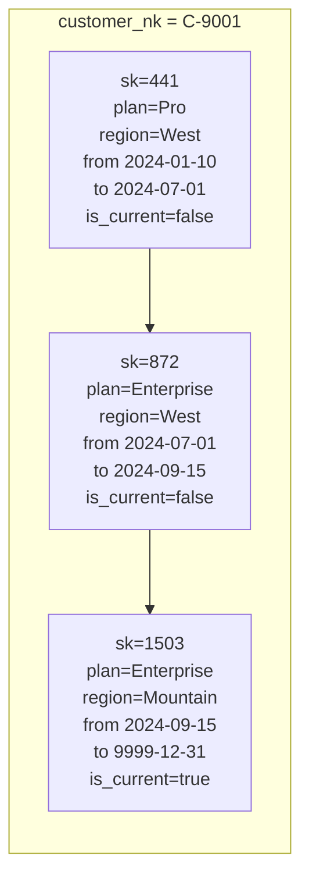

# Slowly Changing Dimensions (SCD Types)

> Chapter from the **Data Engineering Playbook** — data-modeling.

## About This Chapter

**What this is.** Slowly Changing Dimensions (SCDs) are the per-attribute strategies (Types 0-6) for deciding what a pipeline does when a dimension's source value changes. A dimension is a table that describes an entity — a customer, a product, a sales region. When data in that entity changes, the SCD type tells you whether to overwrite the old value, keep both old and new, or ignore the change entirely. This chapter focuses on Type 2 — versioned history, validity windows (time ranges showing when a row was "active"), and the merge mechanics that make "what was true on the order date" reproducible to the cent.

**Who it's for.** Mid-level data engineers, analytics engineers, platform/architecture leads, and engineers preparing for senior/staff data-engineering interviews.

**What you'll take away.** By the end you'll be able to:
- Choose an SCD type per attribute rather than per table, and combine Type 0/1/2/3 in one dimension.
- Implement a correct Type 2 chain with half-open intervals (explained below), a `9999-12-31` sentinel (a far-future placeholder date meaning "still active"), exactly-one-current invariant (only one row per entity is the current version), and a deterministic hash surrogate key (a stable ID generated from a hash function, not a database auto-increment).
- Make the load idempotent (safe to re-run multiple times with the same result) and out-of-order-safe with a source ordering key, hash-diff on the right columns, and an interval-rebuild path for late arrivals.
- Ship the close-then-insert Iceberg merge with post-merge assertions, and account for compaction (file maintenance) on this insert-heavy workload.

---

A slowly changing dimension is the data model's answer to a deceptively simple business question: *what did this customer's address, plan tier, or sales region look like on the day the order was placed?* Get the SCD strategy wrong and your revenue-by-region report silently rewrites history every night. Get it right and you can re-run any quarter's close and reproduce the number to the cent.

## TL;DR

- SCD is not a feature you turn on — it's a per-attribute decision. The same dimension table usually mixes Type 1, Type 2, and Type 3 columns, and treating the whole table as "Type 2" is the most common modeling mistake I see.
- Type 2 is the workhorse for analytics that must reproduce historical state. Its correctness lives entirely in three plumbing columns most people get wrong: `effective_from`, `effective_to`, and `is_current`, plus a deterministic surrogate key (a stable, computed ID for each row version).
- On a lakehouse (a data platform like Iceberg, Delta Lake, or Hudi that combines storage and query capabilities), the merge mechanics dominate cost and correctness. A naive `MERGE` that rewrites the whole dimension every run is the difference between a 4-minute and a 90-minute job at 200M rows.
- Late-arriving and out-of-order source changes break Type 2 in subtle ways: overlapping validity windows, lost history, and "current" flags that point at two rows. You need a deterministic ordering key (one that always produces the same order for the same inputs), not `processing_time`.
- Hash-diff (computing a hash of a row's tracked columns to detect changes) is how you decide *whether a change happened at all*. Hashing the wrong columns causes either missed history (under-hashing) or a new version every load (over-hashing on a volatile `updated_at`).
- The grain question — "do we version on every attribute change or only material ones?" — is a governance decision with a real storage and query cost, not a default.

## Why this matters in production

Picture a SaaS billing model. A customer signs up on `plan = 'Pro'` in a US region, upgrades to `Enterprise` six months later, and the sales territory gets re-drawn in Q3 moving them from `West` to `Mountain`. Finance runs a quarterly revenue-by-territory report. The order facts are immutable (they never change) — an invoice for $1,200 was issued on a specific date. But which territory does that $1,200 belong to?

If `dim_customer` is Type 1 (overwrite-in-place), every order this customer ever made now rolls up to `Mountain`, including the ones placed while they were in `West`. Your Q1 and Q2 territory reports change every time someone edits a customer record. Auditors hate this. So does the VP of Sales whose Q1 number moved three months after the books closed.

The fix is to version the dimension and join facts to the dimension *as it was on the order date*:

```sql
SELECT t.territory, SUM(f.amount)
FROM fct_order f
JOIN dim_customer t
  ON  f.customer_nk = t.customer_nk
  AND f.order_date >= t.effective_from
  AND f.order_date <  t.effective_to     -- half-open interval, see Deep dive
GROUP BY t.territory;
```

That `BETWEEN`-style join against validity windows is the entire payoff of Type 2. Everything else in this chapter is making that join correct, fast, and reproducible. This pairs directly with the star-schema chapter: facts carry surrogate keys (`customer_sk`) that resolve to the *version-correct* dimension row at fact-load time, so the join above is usually pre-baked into the fact.

## How it works

The SCD "types" are a catalogue of strategies for one attribute when its source value changes. They are independent and composable — you can apply different types to different columns in the same table.

| Type | What happens on change | History kept | Query cost | Typical use |
|------|------------------------|--------------|------------|-------------|
| 0 | Reject the change (immutable) | N/A — frozen | none | Date of birth, original signup date |
| 1 | Overwrite in place | none | cheapest | Corrections, typo fixes, non-analytical attributes |
| 2 | Insert new row, close old row | full row-level | join on validity window | Anything you must reproduce historically |
| 3 | Add `prior_value` column | one step back | trivial | "Previous region" alongside current |
| 4 | Current row in main table, history in a separate table | full, split | two tables | Hot/cold split when current-state reads dominate |
| 6 | Type 1 + 2 + 3 combined (1+2+3=6) | full + fast current | moderate | When you need both "as-was" and "as-is" on one row |

Type 2 is the one with real mechanics. Each natural key (the business identifier for an entity, like a customer ID from the source system) becomes a *chain* of rows, each row valid for a contiguous time interval:



Three invariants (rules that must always hold true) make the chain valid, and the entire job of an SCD2 pipeline is to preserve them:

1. **No gaps, no overlaps.** For a given natural key, the intervals tile the timeline. `row[n].effective_to == row[n+1].effective_from` exactly.
2. **Exactly one current row** per natural key (`is_current = true`), and it is the one with the open-ended `effective_to`.
3. **Surrogate key is stable and unique.** A fact loaded against version 441 must always resolve to version 441, forever.

The change-detection logic is a set comparison between the incoming snapshot/delta and the current rows:

```
for each natural_key in source:
    incoming_hash = sha2(concat_ws('|', tracked_col_1, ..., tracked_col_n))
    if natural_key not in dim:                  -> INSERT new current row
    elif incoming_hash == current_row.row_hash: -> NO-OP (no change)
    else:                                        -> CLOSE current row, INSERT new current row
for each natural_key in dim but not in source:
    if source is a full snapshot:               -> optionally CLOSE (logical delete)
```

That `row_hash` is the load-bearing optimization. Comparing a single 64-bit/256-bit hash (a compact fingerprint of the row's tracked columns) beats column-by-column `IS DISTINCT FROM` chains on wide dimensions, and it's what makes the merge predicate cheap.

## Deep dive

This is where engineers get cut.

### Half-open intervals, always

An interval describes the time range when a row was active. Use `[effective_from, effective_to)` — closed on the left (the start date is included), open on the right (the end date is excluded). The previous row's `effective_to` equals the next row's `effective_from`. The alternative — closed-closed with `effective_to` set to "the day before the next row starts" — forces you to subtract a day (or a microsecond) and immediately breaks at fine time grains, around daylight saving time transitions, and at midnight boundaries. With half-open, the fact join is unambiguous:

```sql
AND f.event_ts >= d.effective_from
AND f.event_ts <  d.effective_to
```

No row can match two versions, and no event falls between versions. Set the open end to a real sentinel like `TIMESTAMP '9999-12-31 00:00:00'`, **not** `NULL`. `NULL` poisons the `<` comparison (a comparison against NULL returns "unknown" in SQL, so the row drops out of the join) and you lose all current-version facts silently. This single bug — `effective_to IS NULL` for current rows joined with `<` — is the most common "my latest data disappeared from the report" incident.

### The ordering key is not processing time

Type 2 must apply changes in *business-event order*, not the order your pipeline happened to read them. If two changes for the same customer land in the same micro-batch — or worse, arrive out of order because of a Kafka rebalance (when Kafka reassigns partitions to consumers, which can reorder message delivery) or a backfill — ordering by `current_timestamp()` or ingestion time produces overlapping windows or lost intermediate versions.

You need a monotonic, source-supplied ordering key (a sequence number from the source system that always increases): a CDC log sequence number (LSN/SCN — a position marker in a database's transaction log, used by Change Data Capture tools to track every row-level change), a Debezium `source.lsn`/`ts_ms` (fields produced by Debezium, an open-source CDC tool), or a database `updated_at` you *trust*. When two versions share the same business timestamp, break ties deterministically (e.g., by LSN) so re-runs are idempotent.

### Late-arriving dimension changes

A change for `effective_from = 2024-03-01` arrives in June, after later versions already exist. You cannot just close the current row and append. You must *insert into the middle* of the chain: split the version that was active on 2024-03-01, set its `effective_to` to the new change's `effective_from`, insert the new version, and re-point the following row's `effective_from`. Most teams discover they never built this path until an auditor finds a gap. If late arrivals are common, model the dimension as an *interval rebuild* per affected natural key (recompute the whole chain for that key from the full change history) rather than an incremental close-and-append — it's slower but bulletproof and idempotent.

### Hash the right columns

`row_hash` must cover exactly the **tracked** attributes — the ones whose change should mint a new version. Two failure shapes:

- **Over-hashing:** including a volatile column (one that changes frequently and has no analytical meaning) like `last_login_at` or `updated_at` in the hash. Every load produces a "change," your dimension explodes with versions that carry no analytical meaning, and storage/query cost balloons. I've seen a 5M-row customer dimension grow to 400M rows in a month from a single `last_seen` column in the hash.
- **Under-hashing:** forgetting a tracked column. The change is silently dropped; history is wrong and there's no error to catch it. Reconciliation against source (comparing your dimension's history to the original source system) is the only way you'll find it.

Normalize before hashing: trim whitespace, coalesce nulls to a fixed token (`COALESCE(region, '<null>')`), and pin column order. `sha2(concat_ws('|', ...), 256)` with a consistent separator avoids the classic collision where `('ab','c')` and `('a','bc')` hash identically.

### Surrogate key generation

Do not use `monotonically_increasing_id()` in Spark for surrogate keys — it's not stable across re-runs and encodes partition IDs (internal Spark partition numbers that change between runs). Use one of:
- A hash surrogate: `sha2` of `natural_key || effective_from` — deterministic, re-run-safe, no central sequence. My default on a lakehouse.
- An identity column (Delta `GENERATED ALWAYS AS IDENTITY`, Iceberg sequence) when you need compact integer keys and a single writer.

The hash surrogate's superpower is idempotency: re-running a failed batch produces the identical key, so a fact already joined to it stays valid.

## Worked example

A PySpark SCD Type 2 merge into an Iceberg table, driven by a daily snapshot. This is the shape I'd ship, including the close-old / insert-new union pattern that a single `MERGE` cannot express directly.

```python
from pyspark.sql import functions as F

TRACKED = ["plan", "region", "billing_country", "account_status"]
HIGH_DATE = F.to_timestamp(F.lit("9999-12-31 00:00:00"))

# 1. Stage the source snapshot and compute the row hash over tracked cols only.
src = (
    spark.table("staging.customer_snapshot")
    .withColumn(
        "row_hash",
        F.sha2(F.concat_ws("|", *[F.coalesce(F.col(c).cast("string"), F.lit("<null>"))
                                   for c in TRACKED]), 256),
    )
    .withColumn("effective_from", F.col("source_updated_at"))  # business time, not now()
)

dim = spark.table("dwh.dim_customer")
current = dim.filter("is_current = true")

# 2. Find natural keys whose tracked attributes actually changed.
joined = src.alias("s").join(
    current.alias("c"), "customer_nk", "left"
)
changed = joined.filter(
    "c.customer_nk IS NULL OR s.row_hash <> c.row_hash"
)

# 3a. New current versions (new keys + changed keys).
new_versions = changed.select(
    "s.customer_nk",
    F.sha2(F.concat_ws("|", "s.customer_nk", "s.effective_from"), 256).alias("customer_sk"),
    *[F.col(f"s.{c}").alias(c) for c in TRACKED],
    F.col("s.row_hash"),
    F.col("s.effective_from"),
    HIGH_DATE.alias("effective_to"),
    F.lit(True).alias("is_current"),
)

# 3b. Close the superseded current rows (set effective_to + flip flag).
to_close = changed.filter("c.customer_nk IS NOT NULL").select(
    F.col("c.customer_sk"),
    F.col("s.effective_from").alias("new_effective_to"),
)

new_versions.createOrReplaceTempView("new_versions")
to_close.createOrReplaceTempView("to_close")
```

```sql
-- Close superseded rows: half-open interval, flip is_current.
MERGE INTO dwh.dim_customer d
USING to_close c
  ON d.customer_sk = c.customer_sk
WHEN MATCHED THEN UPDATE SET
  d.effective_to = c.new_effective_to,
  d.is_current   = false;

-- Append the new current versions.
INSERT INTO dwh.dim_customer
SELECT customer_nk, customer_sk, plan, region, billing_country,
       account_status, row_hash, effective_from, effective_to, is_current
FROM new_versions;
```

Why two statements instead of one `MERGE`? A single `MERGE` cannot both `UPDATE` the old row and `INSERT` a new one for the same matched key in one pass (each target row matches at most one action in a MERGE statement). The close-then-insert split is the standard, correct decomposition. Run them in one transaction where the engine supports it; on Iceberg, wrap with a snapshot and validate invariants before commit.

A post-merge assertion (a validation check that runs after the merge to catch data quality issues before they reach a report) I gate every run on — it catches overlap/duplicate-current bugs before they reach a report:

```sql
-- Must return zero rows.
SELECT customer_nk, COUNT(*) AS open_versions
FROM dwh.dim_customer
WHERE is_current = true
GROUP BY customer_nk
HAVING COUNT(*) > 1;
```

## Production patterns

- **Pre-resolve surrogate keys at fact-load time.** Don't make BI tools do the validity-window join. When loading `fct_order`, look up the version-correct `customer_sk` for the order's event time and store it on the fact. The fact-to-dim join then becomes a plain equi-join (a simple equality join, like `ON fact.customer_sk = dim.customer_sk`) on `customer_sk` — fast, and immune to later dimension edits. This is the link back to the star-schema chapter.
- **Compaction matters more than the merge.** SCD2 is an insert-heavy, small-file-generating workload. On Iceberg, schedule `rewrite_data_files` and expire snapshots (maintenance operations that consolidate small files and remove old table versions to keep query performance healthy); otherwise the validity-window join degrades as the dimension fragments into thousands of small files.
- **Mixed-type columns in one table.** Mark each column's SCD type in the model doc and DDL comments. Phone number = Type 1 (correction), region = Type 2 (analytical), original-signup-date = Type 0. The merge logic only hashes the Type 2 set; Type 1 columns are overwritten on the current row even when no new version is minted.
- **Effective-dating from CDC, not snapshots, when you can.** Snapshots (full copies of the source table taken at an interval) lose intra-day changes and can't tell a real change from a re-stated value. A Debezium CDC (Change Data Capture) stream gives you `effective_from` straight from the transaction log and the ordering key for free.
- **Snapshot the high-date as a constant.** Pin `9999-12-31` everywhere (one config). Mismatched sentinels (`9999-12-31` vs `2999-12-31`) across pipelines cause joins that silently miss rows at the boundary.

## Anti-patterns & failure modes

| Anti-pattern | Symptom you observe | Fix |
|---|---|---|
| `effective_to IS NULL` for current rows, joined with `<` | Latest-version facts vanish from reports; counts drop ~by current cohort | Use `9999-12-31` sentinel; never `NULL` in a window-bounding column |
| Ordering by `current_timestamp()` / ingestion time | Overlapping validity windows; two `is_current=true` rows | Order by source LSN/business timestamp with deterministic tie-break |
| Volatile column in `row_hash` (e.g. `last_login`) | Dimension row count explodes; versions per key in the hundreds | Hash only tracked analytical columns; exclude activity timestamps |
| Forgotten tracked column (under-hashing) | History silently wrong; no error | Driven from an explicit `TRACKED` list; reconcile against source |
| Single `MERGE` trying to close + insert | Either old row never closes, or new row never inserts | Decompose into close (UPDATE) + append (INSERT) in one txn |
| Treating the whole table as Type 2 | Storage bloat, slow scans, versions on cosmetic edits | Per-column SCD typing; most columns are Type 1 |
| No late-arrival path | Gaps/overlaps appear months later; auditor finds them | Interval rebuild per affected key from full change history |
| `monotonically_increasing_id()` surrogate | Re-run mints new keys; facts orphaned | Deterministic hash surrogate (`sha2(nk || effective_from)`) |

The two that cause the loudest incidents: the `NULL` `effective_to` (data "disappears") and the volatile-hash explosion (cost and latency creep until a job blows past its SLA). Both are invisible in unit tests on toy data and only surface at production volume.

## Decision guidance

Choose per attribute, not per table.

| Question | Lean Type 1 | Lean Type 2 |
|---|---|---|
| Must you reproduce a historical report exactly? | No | **Yes** |
| Is the change a correction vs a real business event? | Correction | Business event |
| Do downstream facts need point-in-time joins? | No | **Yes** |
| Is the attribute cosmetic / operational (phone, email)? | **Yes** | No |
| Is query simplicity for current-state more important than history? | **Yes** | Type 4 (split current/history) |

When **not** to use SCD2 at all:
- The attribute is genuinely immutable → Type 0.
- You have an append-only event log and can reconstruct any historical state by replaying events → you may not need a versioned dimension; derive state at query time. Compare with the data-vault chapter, whose satellites (the data-vault term for historical attribute tables tied to a hub entity) are effectively SCD2 by construction with stricter load auditability.
- You need only "current and previous" → Type 3 is one column, not a chain.

Type 2 vs Data Vault satellites: a satellite *is* a Type 2 table with a hashdiff and load-date, formalized. If you're already on a Vault-style raw layer, your Type 2 marts are projections of satellites, not a separate mechanism.

## Interview & architecture-review talking points

- "SCD type is a per-column decision. I'd version `region` and `plan` as Type 2 because finance reproduces territory and revenue history, overwrite `phone` as Type 1, and freeze `signup_date` as Type 0. Treating the whole dimension as Type 2 is a cost and correctness mistake."
- "Correctness of Type 2 reduces to three invariants — tiled non-overlapping intervals, exactly one current row per key, stable surrogate keys — and I gate every load on assertions for all three. The duplicate-current-row check is a `HAVING COUNT(*) > 1` that must return zero."
- "I use half-open `[from, to)` intervals with a `9999-12-31` sentinel, never `NULL`, because `NULL` in a `<` predicate drops current-version facts silently."
- "Ordering is by source LSN/business timestamp, not processing time, so the pipeline is idempotent and handles out-of-order CDC. Late-arriving changes trigger an interval rebuild for the affected key, not a blind append."
- "I pre-resolve surrogate keys onto facts at load time so BI never does a range join and dimension edits can't retroactively change closed periods."
- "On a lakehouse this is an insert-heavy workload; compaction and snapshot expiry are part of the SCD design, not an afterthought, because small-file fragmentation degrades the validity-window join."

## Further reading

- star-schema chapter — how surrogate keys connect facts to version-correct dimensions.
- data-vault chapter — satellites as formalized, hashdiff-driven Type 2.
- snowflake-schema chapter — normalization tradeoffs that interact with dimension versioning.
- iceberg chapter — merge mechanics, compaction, and snapshot expiry for SCD workloads.
- reconciliation chapter — catching under-hashing and dropped history against source.
- event-driven-systems and offsets chapters — out-of-order delivery and the monotonic ordering key.
- Kimball & Ross, *The Data Warehouse Toolkit* (3rd ed.), Ch. 5 — the canonical SCD type taxonomy.
