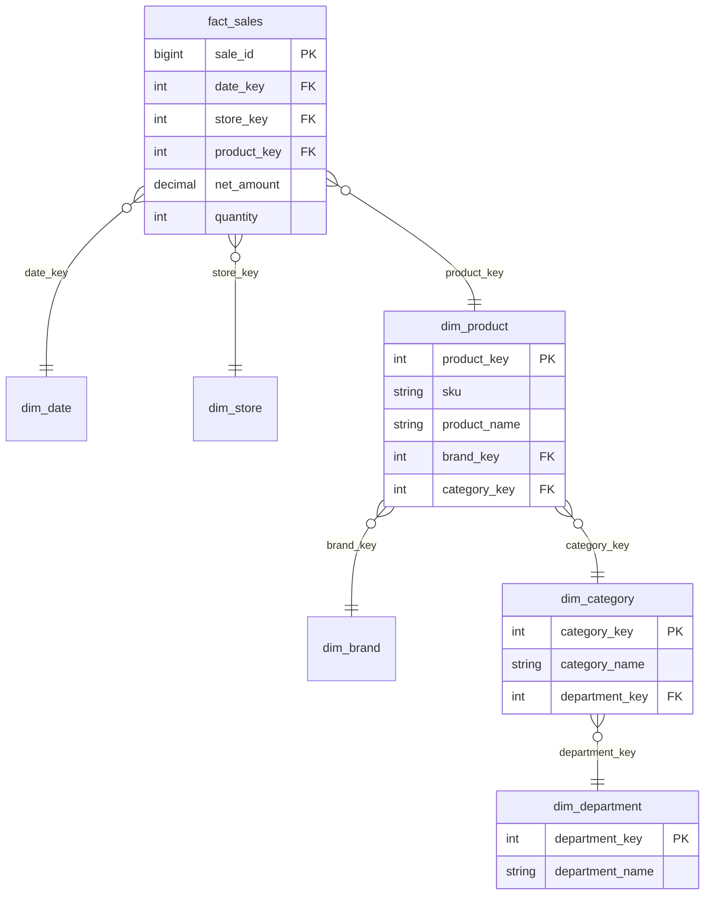

# Snowflake Schema

> Chapter from the **Data Engineering Playbook** — data-modeling.

## About This Chapter

**What this is.** A snowflake schema is a star schema where one or more dimension tables are broken out into chains of smaller, related tables — a process called normalization (organizing data to remove redundancy). This chapter is about deciding, per dimension and per engine, when normalizing one more level actually pays — and what it costs the people querying it.

**Who it's for.** Mid-level data engineers, analytics engineers, platform/architecture leads, and engineers preparing for senior/staff data-engineering interviews.

**What you'll take away.** By the end you'll be able to:
- Argue for snowflaking based on governance (ownership and access control), update isolation (changing one table without touching others), and conformance (sharing one dimension across many fact tables) — not the weak storage-savings case on a columnar engine.
- Apply the starflake middle ground — flatten by default, snowflake only large, multi-owned, volatile, or widely-shared dimensions.
- Avoid the SCD2-on-multiple-levels temporal-range-join trap (explained in the Deep Dive) by resolving point-in-time keys at load and snapshotting them into the fact.
- Separate physical from logical: keep normalized storage but expose flat views so BI tools see one clean join path and never fan-trap (accidentally double-count a measure by joining along two one-to-many paths).

---

A snowflake schema is a star schema where one or more dimensions are normalized into a chain (or tree) of related tables instead of a single wide table. The fact table still sits at the center, but the dimension "points" of the star branch into sub-dimensions: `fact_sales → dim_product → dim_brand → dim_category`. The name comes from the resulting entity-relationship diagram, which looks like a snowflake crystal rather than a clean radial star.

The interesting question is almost never "star vs snowflake" as a religious choice. It is: *for this specific dimension, on this specific engine, what does normalizing one more level actually buy me, and what does it cost the people writing queries against it?*

## TL;DR

- Snowflaking = splitting a dimension into normalized child tables based on functional dependencies (where one attribute determines another, e.g. `product → category → department`). You trade storage and update simplicity for join depth at read time.
- On a columnar MPP (Massively Parallel Processing) engine like Snowflake, BigQuery, or Redshift, or a lakehouse (Spark + Iceberg), the storage savings from snowflaking a dimension are usually **negligible** — dictionary encoding (a built-in compression technique that stores repeated strings once) already collapses repeated strings. The real reasons to snowflake are *governance, update isolation, and conformance*, not bytes.
- The cost is real and measurable: every extra normalization level is an extra join, an extra hop the optimizer must reorder, and one more place a BI tool's auto-generated SQL can pick the wrong join path.
- The defensible middle ground is the **hybrid (starflake)** model: keep most dimensions flat, snowflake only the few that are genuinely large, volatile, or shared across many facts (e.g. a 50M-row `dim_member` whose org hierarchy churns daily).
- Snowflaking interacts badly with SCD Type 2 (slowly changing dimension history tracking) history: if both parent and child dimensions are versioned, you get a combinatorial explosion of effective-dated joins. Decide *which level owns history* before you normalize.
- Most "snowflake vs star" debates dissolve once you separate the physical model (what you store) from the logical model (what analysts query). Materialized flat views over a snowflaked physical store often give you both.

## Why this matters in production

Concrete scenario. You own a `fact_sales` table at ~8B rows for a retail analytics platform. The product dimension is `dim_product` at ~2.4M SKUs (Stock Keeping Units — unique product identifiers). Merchandising restructures the category hierarchy roughly twice a quarter — categories get renamed, merged, re-parented. Marketing owns the brand attributes; merchandising owns the category tree; the SKU master comes from the PIM (Product Information Management) system.

If `dim_product` is one flat table, every category re-parent is an `UPDATE` touching millions of rows across the wide dimension, three different teams write to the same table, and an SCD2 versioning of a single category rename forks history for every SKU under it. You also can't grant column-level ownership cleanly: the brand team and the category team are coupled in one object.

Snowflake the volatile, multi-owned parts out:

```
fact_sales
  └── dim_product (SKU grain, owned by PIM)
        ├── dim_brand    (brand grain, owned by Marketing)
        └── dim_category (category grain, owned by Merchandising)
              └── dim_department (department grain)
```

Now a category rename is a single-row update in `dim_category`. SCD2 history lives at the category grain (the level where categories live), not exploded across 2.4M SKUs. Ownership maps cleanly to tables. The cost: queries that group by category now traverse `fact → dim_product → dim_category`, two joins where flat needed zero.

That tradeoff — **update isolation and ownership clarity at the price of read-time joins** — is the whole chapter. Everything else is figuring out when the trade is worth it.

## How it works

Snowflaking is normalization applied selectively to dimensions. You take a dimension that contains transitive functional dependencies (chains of attribute relationships where A determines B, and B determines C, but A does not directly determine C) and split it on those dependencies until each table is in (at least) third normal form (3NF — a database design standard where every non-key column depends only on the table's primary key, not on other non-key columns) for its grain (the level of detail a table represents).

A dependency like `sku → category_id → category_name → department_id → department_name` means `department_name` does not depend on the SKU directly — it depends on it *through* category and department. In a flat star dimension you accept that redundancy (every SKU row repeats its department name). Snowflaking removes it by giving each level its own table keyed by its own surrogate (a generated numeric key that never changes, used instead of a natural business key).



**Query mechanics.** To roll sales up to department, the engine must resolve the chain:

```sql
SELECT d.department_name, SUM(f.net_amount)
FROM fact_sales f
JOIN dim_product    p ON f.product_key   = p.product_key
JOIN dim_category   c ON p.category_key  = c.category_key
JOIN dim_department d ON c.department_key = d.department_key
GROUP BY d.department_name;
```

Three joins where a flat dimension needed one. On a cost-based optimizer (the query engine component that picks the best execution plan by estimating costs) this means a larger join-order search space and more chances to mis-estimate intermediate cardinality (the number of rows at each step). The dimension tables are tiny relative to the 8B-row fact, so the joins are broadcast/hash joins (techniques where small tables are copied to each compute node) against small build sides — cheap *if* the optimizer recognizes the star/snowflake shape.

**Storage math.** The naive argument for snowflaking is dedup (deduplication). Suppose `department_name` averages 18 bytes and there are 2.4M SKUs across 40 departments. Flat storage of that one column: `2.4M × 18 ≈ 43 MB` raw. Snowflaked: `40 × 18 ≈ 720 bytes` plus a 4-byte FK per SKU = `~10 MB`. On a row store this 4× saving is real. On a columnar store with dictionary encoding, the flat column is stored as 40 dictionary entries + 2.4M small dictionary codes — i.e. it already costs roughly what the snowflaked version costs. **Columnar encoding does for free most of what snowflaking does manually.** That is why "save storage" is a weak argument on modern engines and you should reach for the real reasons: governance, update locality, conformance.

## Deep dive

This is where engineers get it wrong. The mistakes are subtle and they all come from treating snowflaking as a storage optimization rather than a modeling and ownership decision.

### 1. Where does SCD history live?

SCD Type 2 (Slowly Changing Dimension Type 2) is a technique for tracking historical changes by adding new rows with effective date ranges rather than overwriting old values. If you snowflake `dim_product → dim_category` and both are SCD Type 2, you have to decide which table owns version history for a category attribute. Putting effective dates on *both* tables creates a temporal join nightmare: to reconstruct "what was the category name for this SKU on the sale date" you need:

```sql
JOIN dim_product   p ON f.product_key = p.product_key
                    AND f.sale_date BETWEEN p.eff_start AND p.eff_end
JOIN dim_category  c ON p.category_key = c.category_key
                    AND f.sale_date BETWEEN c.eff_start AND c.eff_end
```

Two range joins (joins that match rows based on a value falling within a range, rather than an exact key match). Range joins do not broadcast cleanly and they blow up the optimizer's cardinality estimates. The fix: **history lives at exactly one grain per attribute.** Either the fact carries a point-in-time `category_key` snapshot resolved at load time (preferred — the "fact-resolves-the-version" pattern, where you look up the correct version of a dimension row during ETL so analysts never have to), or you snapshot the whole product hierarchy into a flat SCD2 `dim_product` and don't snowflake the versioned parts at all. Snowflaking and Type-2 history are in tension; resolve it explicitly.

### 2. The BI-tool join-path trap

When you snowflake, you give BI semantic layers (tools like Looker, Power BI, Tableau, or dbt's `metricflow` that sit between analysts and the database to define metrics and join logic) more than one way to traverse from fact to a leaf attribute. If `dim_product` joins to both `dim_category` and `dim_brand`, and `dim_category` joins to `dim_department`, a naive query generator can produce a join that fans out through the wrong path, or — worse — produce a **fan trap** (a modeling error where joining two one-to-many relationships inflates aggregate measures by double-counting rows): joining one-to-many at two levels and double-counting the additive measure. Symptom: `SUM(net_amount)` is suddenly inflated by a clean integer multiple and nobody knows why. The flat star is much harder to misuse this way because there's exactly one path. If you snowflake, you must pin join paths in the semantic layer explicitly (Looker `explore`/`join` graphs, dbt relationships) rather than letting the tool infer them.

### 3. Optimizer dependence

Snowflaked queries are only fast if the optimizer:
- recognizes the snowflake as a join tree of small dimensions around a large fact, and
- has accurate statistics on every table in the chain.

On Spark you want `spark.sql.cbo.enabled=true`, `spark.sql.cbo.joinReorder.enabled=true`, and fresh `ANALYZE TABLE ... COMPUTE STATISTICS FOR COLUMNS` on the join keys, plus Adaptive Query Execution (AQE — a Spark feature that adjusts the query plan at runtime based on actual data sizes, `spark.sql.adaptive.enabled=true`) to recover from bad estimates at runtime. Without column stats, the planner often picks a sort-merge join (a slower join strategy that requires sorting both inputs) for what should be a broadcast, and the deeper the snowflake chain the more compounding the error. A flat star degrades more gracefully because there's only one join to mis-plan.

### 4. Surrogate keys must chain

Each level needs its own stable surrogate key (an auto-generated integer that is assigned once and never changes), and child FKs (foreign keys — columns that reference the primary key of another table) must point at surrogates, not natural keys (business-meaningful identifiers like a product name or category code). If `dim_product.category_key` stored the natural `category_name`, a category rename breaks the FK and forces a cascade. Snowflaking only buys update isolation if the join keys are immutable surrogates and the *attributes* are what change. This is the single most common implementation bug: people snowflake on natural keys and then wonder why a rename still touches the fact-adjacent table.

### 5. Conformance is the strongest real argument

If `dim_category` is shared by `fact_sales`, `fact_returns`, and `fact_inventory`, snowflaking it out makes it a genuine **conformed dimension** (a dimension table shared across multiple fact tables so that reports using different facts produce consistent results): one table, one definition of the category hierarchy, used by three facts. That is architecturally cleaner than three flat product dimensions each carrying their own (eventually divergent) copy of the category tree. Conformance — not storage — is the argument that survives a principal-level review.

## Worked example

A starflake build on Spark + Iceberg. We keep `dim_store` and `dim_date` flat (small, stable), and snowflake only `dim_product` because category is multi-owned and volatile.

```sql
-- Snowflaked dimension tables (Iceberg, partitioned only where it pays off)
CREATE TABLE retail.dim_department (
    department_key   INT,
    department_name  STRING,
    eff_start        DATE,
    eff_end          DATE,
    is_current       BOOLEAN
) USING iceberg;

CREATE TABLE retail.dim_category (
    category_key     INT,
    category_name    STRING,
    department_key   INT,          -- FK -> dim_department (surrogate, immutable)
    eff_start        DATE,
    eff_end          DATE,
    is_current       BOOLEAN
) USING iceberg;

CREATE TABLE retail.dim_product (
    product_key      INT,
    sku              STRING,
    product_name     STRING,
    brand_key        INT,          -- FK -> dim_brand
    category_key     INT,          -- FK -> dim_category (current category)
    eff_start        DATE,
    eff_end          DATE,
    is_current       BOOLEAN
) USING iceberg;
```

Resolve the point-in-time version **at load time** so analysts never write temporal range joins. The fact stores the surrogate keys valid on the event date:

```python
from pyspark.sql import functions as F

spark.conf.set("spark.sql.adaptive.enabled", "true")
spark.conf.set("spark.sql.cbo.enabled", "true")
spark.conf.set("spark.sql.cbo.joinReorder.enabled", "true")

sales = spark.read.table("retail.stg_sales")          # natural keys + sale_date
prod  = spark.read.table("retail.dim_product")

# pick the product version effective on the sale date (SCD2 resolution)
resolved = (
    sales.join(
        prod,
        (sales.sku == prod.sku)
        & (sales.sale_date >= prod.eff_start)
        & (sales.sale_date <  prod.eff_end),
        "left",
    )
    .select(
        sales["*"],
        prod.product_key,
        prod.category_key,   # snapshot the category valid at sale time
        prod.brand_key,
    )
)

(
    resolved
    .select("sale_id", "date_key", "store_key",
            "product_key", "category_key", "brand_key",
            "net_amount", "quantity")
    .writeTo("retail.fact_sales")
    .append()
)
```

Because the fact carries `category_key` resolved at load, the analytical query is a clean broadcast join tree — no range predicates at query time:

```sql
-- AQE will broadcast all dims (each < 10 MB) against the 8B-row fact
SELECT d.department_name,
       c.category_name,
       SUM(f.net_amount) AS revenue
FROM retail.fact_sales f
JOIN retail.dim_category   c ON f.category_key   = c.category_key
JOIN retail.dim_department d ON c.department_key = d.department_key
GROUP BY d.department_name, c.category_name;
```

And expose a **flat view** so BI tools see a star, not a snowflake — physical normalization, logical denormalization:

```sql
CREATE VIEW retail.dim_product_flat AS
SELECT p.product_key, p.sku, p.product_name,
       b.brand_name,
       c.category_name,
       d.department_name
FROM retail.dim_product    p
JOIN retail.dim_brand      b ON p.brand_key     = b.brand_key
JOIN retail.dim_category   c ON p.category_key  = c.category_key
JOIN retail.dim_department d ON c.department_key = d.department_key
WHERE p.is_current AND c.is_current AND d.is_current;
```

This is the pattern that ends most star-vs-snowflake arguments: normalized storage (clean ownership, single conformed hierarchy, isolated updates) plus a denormalized read surface (one join path for analysts and BI tools).

## Production patterns

- **Starflake, not pure snowflake.** Flatten by default. Snowflake a dimension only when it meets at least two of: >10M rows, multi-team ownership, high attribute churn, or shared across three or more facts. Pure textbook snowflake (every dimension normalized) is almost never the right physical model on a columnar engine.
- **Flat views over a snowflaked physical store.** Materialize or define views that present each snowflaked dimension as a single wide table for consumers. Keep the normalized tables for writers and governance.
- **Resolve SCD versions at load, snapshot keys into the fact.** Push temporal complexity to ETL so the query layer never needs range joins across snowflaked levels.
- **Pin join paths in the semantic layer.** In Looker/dbt/Power BI, declare the exact fact→dim→subdim graph and the cardinality of each relationship so the tool can't generate a fan-trap query.
- **Compute and refresh column stats on every join key.** Snowflake performance is optimizer-dependent; stale stats hurt deep chains disproportionately. Schedule `ANALYZE TABLE` after each dimension load.
- **One owner per snowflaked level.** The governance payoff only materializes if `dim_category` has a single owning team and a clear contract. If three teams still write to it, you snowflaked the storage but not the responsibility.

## Anti-patterns & failure modes

| Anti-pattern | Symptom you observe | Fix |
|---|---|---|
| Snowflaking to "save storage" on a columnar/lakehouse engine | Storage barely drops; query latency rises from added joins | Don't. Dictionary encoding already deduped. Snowflake only for governance/conformance |
| SCD2 on both parent and child snowflaked tables | Reports need `BETWEEN eff_start AND eff_end` on every level; range joins; runaway query plans | Own history at one grain; resolve point-in-time keys at load and snapshot into the fact |
| Snowflaking on natural keys | A category rename still cascades into product/fact-adjacent tables | Chain immutable surrogate keys; let attributes change, never join keys |
| Letting the BI tool infer join paths | `SUM` inflated by a clean integer factor (fan trap); double-counted revenue | Pin explicit join graphs and relationship cardinalities in the semantic layer |
| Deep chains with no column stats | Optimizer picks sort-merge instead of broadcast; query 10–50× slower than expected | `ANALYZE TABLE ... FOR COLUMNS`, enable CBO + AQE, verify broadcast in the plan |
| Over-snowflaking small, stable dims (date, store) | Pointless 3-table joins for a 365-row date dim | Keep small/stable dimensions flat. Snowflake earns its keep only at scale + churn |
| Exposing the raw snowflake to analysts | Tribal knowledge of join order; copy-pasted 5-join queries; inconsistent results | Provide flat views/semantic models; never make humans navigate the normalization |

## Decision guidance

| Situation | Use flat (star) | Snowflake the dimension | Consider Data Vault |
|---|---|---|---|
| Small, stable dimension (date, store, region) | Yes | No | No |
| Large dimension, single owner, low churn | Yes | Rarely | No |
| Large dimension, multi-team ownership, volatile hierarchy | No | **Yes** | If lineage/audit also required |
| Hierarchy shared/conformed across many facts | Maybe | **Yes** (conformed sub-dim) | No |
| Heavy SCD2 history on the hierarchy | Flatten + SCD2 | Only with PIT keys resolved at load | Yes, if full bitemporal needed |
| Source-system agility / heavy schema change | No | No | **Yes** |

Rule of thumb: **star is the default; snowflake is a targeted exception for specific dimensions; Data Vault is for the raw integration layer, not the serving layer.** A snowflake schema is a serving-layer choice, and it should be invisible to analysts behind flat views.

## Interview & architecture-review talking points

- "Snowflaking is not a storage optimization on a columnar engine — dictionary encoding already does that. I snowflake for *update isolation, single-owner governance, and conformed shared hierarchies*. If someone proposes it to save bytes, I push back."
- "I separate physical from logical. The physical store can be normalized for ownership and update locality; the read surface is a flat view so BI tools and analysts see a clean star with one join path."
- "The trap I watch for in review is SCD2 on multiple snowflaked levels — that forces temporal range joins. I resolve point-in-time versions at load time and snapshot surrogate keys into the fact, so the query layer never range-joins across the chain."
- "Snowflake performance is optimizer-dependent. I require fresh column stats on join keys, CBO and AQE enabled, and I verify the dimensions actually broadcast in the physical plan before I sign off."
- "I'd quantify it: deeper chains add joins and enlarge the optimizer's search space, raising the probability of a fan trap or a mis-planned join. I only accept that cost where the dimension is genuinely large, multi-owned, or shared."
- "For the raw integration layer with heavy source churn I'd reach for Data Vault, not a snowflake. Snowflake is a dimensional-serving decision."

## Further reading

- Sibling chapters: Star Schema · SCD Types · Data Vault · Customer 360
- Ralph Kimball & Margy Ross, *The Data Warehouse Toolkit* (3rd ed.) — Ch. 20 on snowflaking, outriggers, and when normalization of dimensions is justified.
- Apache Spark SQL docs — Cost-Based Optimizer and Adaptive Query Execution (`spark.sql.cbo.*`, `spark.sql.adaptive.*`), the configs that determine whether your snowflake joins broadcast.
