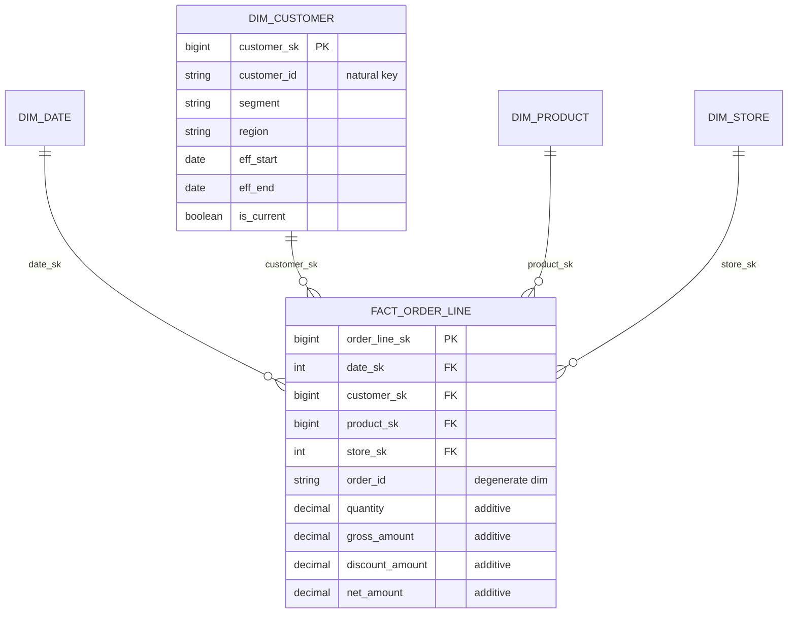

# Star Schema

> Chapter from the Data Engineering Playbook — data-modeling.

## About This Chapter

**What this is.** The star schema is a way to organize a data warehouse: one central table of measurements (called a fact table) at a declared grain (the exact level of detail each row represents), surrounded by lookup tables called dimensions that are joined using surrogate keys (generated IDs that are independent of the source system). This chapter shows how to get the grain, keys, additivity, and merge logic right so the model holds up at billions of rows on a lakehouse.

**Who it's for.** Mid-level data engineers, analytics engineers, platform/architecture leads, and engineers preparing for senior/staff data-engineering interviews.

**What you'll take away.** By the end you'll be able to:
- Write a grain statement and classify every measure as additive, semi-additive, or non-additive so aggregations stay correct.
- Use surrogate keys and as-of binding (storing which dimension version was active at the time of the event) to make Type 2 history and source-key churn survivable, and detect fan-out joins (where a join accidentally multiplies rows) with a row-count assertion.
- Handle late-arriving facts and early-arriving dimensions with inferred members and special keys instead of NULL foreign keys.
- Replace RDBMS indexes with lakehouse physics: broadcast dimensions (sending small tables to every node), partition the fact by date, cluster on the next foreign keys, and let AQE (Adaptive Query Execution — Spark's built-in optimizer) absorb data skew.

---

The star schema is the most boring, durable idea in analytics, and that's exactly why it survives every wave of warehouse technology. Teradata, Redshift, BigQuery, Snowflake, and now Iceberg-on-Spark lakehouses all reward the same shape: a narrow set of fat dimensions surrounding a tall, skinny fact. This chapter is about getting the grain, the keys, and the merge logic right so the model holds up when the fact table crosses 50 billion rows and twelve teams are joining against your dimensions.

## TL;DR

- A star schema is one fact table (events/measurements at a fixed grain) joined to several denormalized (non-normalized, pre-flattened) dimension tables via surrogate keys. The discipline is in the grain statement, not the diagram.
- **Grain is the contract.** "One row per order line item per fulfillment event" is a grain. "Orders" is not. Every measure and every dimension must be true at that grain or the model is broken.
- Use **surrogate keys** (monotonic integers or hashes, not the original source IDs) on dimensions. This is what makes SCD Type 2 (Slowly Changing Dimension Type 2 — a technique that keeps full history by creating a new row for each change) history and source-system key churn survivable.
- On a lakehouse the join pattern shifts: you stop optimizing for B-tree index lookups and start optimizing for **broadcast joins, partition pruning, and Z-ordering/clustering** on the foreign keys that filter the most.
- The two failures that actually hurt in production are **grain leakage** (double-counting from a fan-out join) and **late/early-arriving dimension rows** breaking the foreign key to primary key relationship. Both are solvable, neither is automatic.
- Conformed dimensions (shared dimension tables used consistently across multiple fact tables and data marts) are an organizational artifact, not a technical one. The hard part is one team owning `dim_customer` while five teams consume it.

## Why this matters in production

You inherit a "revenue dashboard" that takes 90 seconds to load and disagrees with finance by 3%. You open the query and find a 600-line CTE (Common Table Expression — a named subquery inside a SQL statement) joining seven normalized OLTP-shaped tables, with `SELECT DISTINCT` sprinkled in three places to "fix" duplicate rows. The `DISTINCT` is the tell: someone hit a fan-out join, the numbers doubled, and instead of fixing the grain they masked it. The 3% discrepancy is the rows where `DISTINCT` collapsed legitimately-different lines that happened to have identical measures.

This is the problem the star schema solves. By forcing you to declare a grain up front and pushing all descriptive context into conformed dimensions, you get:

- **Queries that are obvious.** `fact_orders JOIN dim_customer JOIN dim_date JOIN dim_product` — an analyst can read it. No 600-line CTE.
- **Additive measures you can trust.** When the grain is one row per order line, `SUM(net_amount)` is correct by construction. No `DISTINCT` gymnastics.
- **Stable contracts under churn.** The source CRM migrates from a 9-digit customer ID to a UUID. Because consumers join on the surrogate key `customer_sk`, nothing downstream breaks. The natural key change lives entirely inside the dimension load.

A concrete scenario from a billing pipeline: ~2 billion invoice-line facts per quarter, a `dim_customer` of ~40M rows with Type 2 history, and a `dim_product` of ~200K rows. Analysts run "revenue by customer segment by month." With a normalized schema that's a 6-table join with two of them at fact-scale. With a star schema it's one fact table broadcast-joined against three small dimensions, AQE coalesces the partitions, and the query that took 90 seconds returns in 4.

## How it works

A star schema separates **measurements** (numeric, additive, high-volume — the fact) from **context** (textual, descriptive, low-volume — the dimensions). The fact holds foreign keys to each dimension plus its measures. Each dimension holds a surrogate primary key, the natural key(s) from the source, and the descriptive attributes.



### The grain decision drives everything

Pick the lowest grain you can afford to store. Lower grain = more rows but maximum flexibility; you can always roll up, you can never drill down past your grain. Once chosen, **every fact column must be functionally determined by the grain** — meaning its value must be fixed and unique for each grain row. A column that varies within a grain row (e.g. a per-shipment carrier on a per-order-line fact) belongs in a different fact or a dimension.

### Additivity classification

Every measure falls into one of three buckets, and getting this wrong is how dashboards lie:

| Type | Definition | Example | Safe aggregation |
|------|-----------|---------|------------------|
| Additive | Sums correctly across **all** dimensions | `net_amount`, `quantity` | `SUM` across any combination |
| Semi-additive | Sums across some dimensions but **not time** | `account_balance`, `inventory_on_hand` | `SUM` across product/store, but `LAST`/`AVG` across date |
| Non-additive | Never sums | `unit_price`, `margin_pct`, ratios | Recompute from additive components; never `SUM` |

The non-additive trap: storing `margin_pct` and letting someone `AVG()` it. The average of percentages is not the percentage of the totals. Store the additive numerator and denominator (`margin_amount`, `net_amount`) and compute the ratio at query time.

### Surrogate key generation

A surrogate key is a meaningless integer (or hash) that uniquely identifies a dimension **row version**, decoupled from the source's natural key (the original ID from the source system like a CRM or ERP). With Type 2 dimensions the same `customer_id` maps to many `customer_sk` values over time — one per version. The fact captures the `customer_sk` that was current **at the event timestamp**, freezing the dimensional context as-of the event. That as-of binding is the entire point: it's how "revenue by the segment the customer was in when they ordered" stays correct even after they get re-segmented.

## Deep dive

### The fan-out trap (the most common correctness bug)

A join fans out when one fact row matches multiple dimension rows, causing each matched fact row to be duplicated. The arithmetic then double-counts measures. The two usual causes:

1. **Type 2 dimension without a current/as-of filter.** `dim_customer` has 3 versions of customer `C-77`. Join `fact_orders` to it on `customer_id` (the natural key, wrong) and every order for `C-77` triples. Symptom: revenue is inflated by a factor that correlates with how often customers change attributes. Fix: join on `customer_sk` (which is unique per version), or if you must join on natural key, add `AND fact.event_ts BETWEEN dim.eff_start AND dim.eff_end`.

2. **A "dimension" that is actually at a lower grain than the fact.** You join `fact_order_line` to a `dim_promotion` table that has one row per promotion **per channel**, but the order line doesn't carry channel. One line matches three promotion rows. Symptom: row count after join > row count before join. Fix: a bridge table with an explicit allocation factor, or fix the dimension grain.

The defensive check that belongs in every star-schema test suite:

```sql
-- This MUST return zero rows. If it doesn't, you have a fan-out.
SELECT COUNT(*) AS fact_rows,
       (SELECT COUNT(*) FROM fact_order_line) AS expected
FROM fact_order_line f
JOIN dim_customer c ON f.customer_sk = c.customer_sk
HAVING COUNT(*) <> (SELECT COUNT(*) FROM fact_order_line);
```

### Late-arriving facts and early-arriving dimensions

In streaming and micro-batch pipelines, the fact often shows up before the dimension row exists (a brand-new customer's first order lands before the CRM sync). You have three honest options:

- **Inferred member (recommended).** Insert a placeholder `dim_customer` row keyed on the natural key with attributes `'__UNKNOWN__'` and `is_inferred = true`, assign it a real `customer_sk`, and let the fact reference it immediately. When the real dimension data arrives, **update in place** (the surrogate key is preserved). This keeps the foreign key valid at all times.
- **Reject to a quarantine/DLQ (Dead Letter Queue — a holding area for records that cannot be processed yet).** Hold the fact until the dimension exists. Adds latency and a reprocessing path; only acceptable when you cannot tolerate inferred members (regulated reporting).
- **Default to a `-1` "unknown" key.** Loses the natural key, so you can never backfill. Use only for genuinely-missing context, never for late arrivals.

Always seed every dimension with explicit special rows: `sk = -1` (unknown), `sk = -2` (not applicable), `sk = -3` (corrupt/rejected). Facts then never carry NULL foreign keys, and `JOIN` (not `LEFT JOIN`) stays valid — which matters because a NULL foreign key silently drops the fact row from an inner join and your totals shrink without an error.

### Degenerate dimensions

`order_id` has no descriptive attributes worth a dimension table — it's just an identifier you want to keep for drill-through and operational reconciliation. Store it directly on the fact as a degenerate dimension (an identifier stored on the fact table itself rather than in a separate dimension table). Don't build a `dim_order` with one attribute; it's a join for nothing.

### Factless facts

Some of the most useful facts have no measures: `fact_promotion_eligibility` (which customers were eligible for which promotion on which day) records that an event *could* have happened. You count rows (`COUNT(*)`) rather than sum measures. Coverage and "what didn't happen" analysis (eligible but didn't buy) depends on these.

### Lakehouse physics: what changes vs. a classic RDBMS warehouse

On Spark + Iceberg/Delta there are no B-tree indexes. Join and filter performance comes from data layout, not indexes:

- **Broadcast the dimensions.** Dimensions are small; set `spark.sql.autoBroadcastJoinThreshold` high enough (e.g. 200MB) that `dim_customer` broadcasts. A broadcast hash join (sending the small dimension table to every Spark executor so the large fact table never moves) avoids shuffling the multi-billion-row fact entirely.
- **Partition the fact by the date FK**, the column that filters virtually every query. `PARTITIONED BY (date_sk)` (or Iceberg `days(event_ts)`) turns "last 30 days" into partition pruning (reading only the relevant date partitions) instead of a full scan.
- **Cluster/Z-order on the next-most-selective FKs** (`customer_sk`, `product_sk`). On Iceberg, sort within partitions; on Delta, `OPTIMIZE ... ZORDER BY`. This colocates rows so predicate pushdown skips files via min/max statistics.
- **Let AQE handle skew.** Big-customer or big-product skew (where a small number of keys account for a disproportionate number of rows) is real; `spark.sql.adaptive.enabled=true` and `spark.sql.adaptive.skewJoin.enabled=true` split the hot partitions automatically.

## Worked example

End-to-end: surrogate key assignment on a Type 2 dimension load, then a fact load that binds the as-of `customer_sk`, in PySpark against Iceberg.

```python
from pyspark.sql import functions as F, Window

# --- 1. dim_customer Type 2 merge (simplified MERGE INTO via Iceberg) ---
# Incoming CDC batch: natural key customer_id + current attributes
incoming = (spark.table("staging.customer_cdc")
            .select("customer_id", "segment", "region",
                    F.col("updated_at").alias("eff_start")))

# Hash the tracked attributes to detect real changes (avoid version churn on no-op updates)
incoming = incoming.withColumn(
    "attr_hash",
    F.sha2(F.concat_ws("||", "segment", "region"), 256))

spark.sql("""
MERGE INTO warehouse.dim_customer t
USING staging.customer_cdc_hashed s
ON  t.customer_id = s.customer_id AND t.is_current = true
-- attribute changed: expire the old version
WHEN MATCHED AND t.attr_hash <> s.attr_hash THEN UPDATE SET
    t.is_current = false,
    t.eff_end    = s.eff_start
""")

# Insert new versions (and brand-new customers) with fresh surrogate keys.
# Surrogate keys: max existing + monotonic offset. Do this in one transaction.
max_sk = spark.table("warehouse.dim_customer").agg(
    F.coalesce(F.max("customer_sk"), F.lit(0)).alias("m")).first()["m"]

new_versions = (spark.table("staging.customer_cdc_hashed").alias("s")
    .join(spark.table("warehouse.dim_customer").filter("is_current = true").alias("t"),
          "customer_id", "left")
    .where("t.attr_hash IS NULL OR t.attr_hash <> s.attr_hash")
    .select("s.customer_id", "s.segment", "s.region", "s.attr_hash",
            F.col("s.eff_start"))
    .withColumn("customer_sk",
                F.lit(max_sk) + F.row_number().over(Window.orderBy("customer_id")))
    .withColumn("eff_end",   F.lit("9999-12-31").cast("date"))
    .withColumn("is_current", F.lit(True)))

new_versions.writeTo("warehouse.dim_customer").append()
```

```python
# --- 2. fact_order_line load: bind the customer_sk that was current AT THE EVENT ---
orders = spark.table("staging.order_lines")        # has customer_id, event_ts, measures
dim_c  = spark.table("warehouse.dim_customer")     # versioned

fact = (orders.alias("o")
    .join(dim_c.alias("d"),
          (F.col("o.customer_id") == F.col("d.customer_id")) &
          (F.col("o.event_ts") >= F.col("d.eff_start")) &
          (F.col("o.event_ts") <  F.col("d.eff_end")),
          how="left")                              # left: catch late-arriving dims
    .withColumn("customer_sk",
                F.coalesce(F.col("d.customer_sk"), F.lit(-1)))   # -1 = inferred/unknown
    .join(F.broadcast(spark.table("warehouse.dim_date").alias("dt")),
          F.to_date("o.event_ts") == F.col("dt.full_date"))
    .select(
        F.col("dt.date_sk"),
        "customer_sk",
        F.col("o.product_sk"),
        F.col("o.order_id"),                       # degenerate dimension
        "o.quantity", "o.gross_amount", "o.discount_amount",
        (F.col("o.gross_amount") - F.col("o.discount_amount")).alias("net_amount")))

(fact.writeTo("warehouse.fact_order_line")
     .partitionedBy("date_sk")
     .append())
```

```sql
-- 3. The analyst query the whole exercise enables — revenue by as-of segment by month
SELECT  d.month_name,
        c.segment,
        SUM(f.net_amount)              AS revenue,          -- additive: correct by grain
        SUM(f.discount_amount)         AS discounts,
        SUM(f.net_amount) / NULLIF(SUM(f.gross_amount),0) AS realized_rate -- recomputed, not AVG'd
FROM    warehouse.fact_order_line f
JOIN    warehouse.dim_date     d ON f.date_sk     = d.date_sk
JOIN    warehouse.dim_customer c ON f.customer_sk = c.customer_sk  -- SK join: no fan-out
WHERE   d.full_date >= DATE '2026-01-01'
GROUP BY d.month_name, c.segment;
```

## Production patterns

- **Conformed dimensions with single ownership.** `dim_date`, `dim_customer`, `dim_product` are defined once and shared across every fact/mart. One team owns the load and the schema; consumers get a versioned contract. This is what makes "drill across" (combining `fact_orders` and `fact_returns` on shared dimensions without reconciliation) possible without reconciliation meetings.
- **Date dimension is generated, never sourced.** Build `dim_date` from a calendar generator (fiscal periods, holidays, day-of-week, ISO week). It never changes shape and removes a join to a volatile source. Use a smart integer key `YYYYMMDD` (e.g. `20260618`) so partition pruning is human-readable and `date_sk` ordering is chronological.
- **Hash diff to gate Type 2 versions.** Hash only the *tracked* attributes (the worked example uses SHA-256). A source row that updates an untracked field (e.g. `last_login`) must not spawn a new dimension version — otherwise `dim_customer` explodes and every as-of fact join slows down.
- **Snapshot/accumulating fact for lifecycle.** For order lifecycle (placed → paid → shipped → delivered), an accumulating snapshot fact (one row per order with multiple date foreign keys — one per milestone) lets you measure lag between milestones without self-joins.
- **Materialize roll-ups, don't pre-join.** If a daily aggregate is hot, build a `fact_orders_daily` summary fact at a coarser grain rather than a wide pre-joined "one big table." The summary fact stays a star; OBT (One Big Table — a fully denormalized table with everything pre-joined) throws away your grain discipline.
- **Pre-bake special-member rows** (`-1`, `-2`, `-3`) in every dimension via the deploy migration, so the first fact load never NULL-joins.

## Anti-patterns & failure modes

| Anti-pattern | Symptom you observe | Fix |
|---|---|---|
| Joining facts to Type 2 dims on the natural key | Revenue inflated; magnitude correlates with attribute-change frequency; `DISTINCT` appears to "fix" it | Join on surrogate key, or add `event_ts BETWEEN eff_start AND eff_end` |
| Storing ratios/percentages as measures | Dashboards disagree with finance; `AVG(margin_pct)` ≠ true margin | Store additive numerator + denominator; compute ratio at query time |
| One Big Table (denormalized OBT) sold as a star | Re-grained columns, ambiguous `SUM`s, no reuse across marts, schema sprawl | Decompose into fact + conformed dimensions; keep OBT only as a serving-layer view |
| NULL foreign keys on the fact | Totals silently shrink (inner join drops rows); no error raised | Special `-1` member + `COALESCE(sk, -1)` at load; constrain FK as NOT NULL |
| Mixed grain in one fact | `COUNT(*)` overcounts header-level measures repeated on every line | Split into header fact and line fact; or allocate header measures down to line grain |
| Type 2 version churn from untracked columns | `dim_customer` row count growing far faster than real changes; fact joins slow | Hash only tracked attributes to gate version creation |
| Dimension joins shuffling the fact | Stage with 5B-row shuffle write; job spills to disk | Broadcast the dimension (`spark.sql.autoBroadcastJoinThreshold`), partition fact by `date_sk` |

## Decision guidance

| Use a star schema when... | Consider an alternative when... |
|---|---|
| BI / analyst-facing reporting with ad-hoc slice-and-dice | Pure ML feature serving → wide feature tables / feature store |
| Measures aggregate over conformed dimensions | Deep audit/lineage of every source attribute change → Data Vault (an integration/historization modeling approach) |
| You want analyst-readable queries and stable contracts | Dimension cardinality is enormous and attributes deeply hierarchical → Snowflake schema (a variation of star schema where large dimension tables are further normalized into sub-tables) for those branches only |
| Dimensions are small enough to broadcast | Truly normalized OLTP write workload → keep 3NF (Third Normal Form — the standard normalized structure used in operational databases) in the operational store, model the star downstream |

Star vs. snowflake is rarely all-or-nothing: keep the star, and snowflake only the one or two pathologically-wide dimensions where normalization actually pays. Star vs. Data Vault is about purpose — Vault is an integration/historization layer you typically *project into* star schemas for consumption, not a competitor to them.

## Interview & architecture-review talking points

- **"Walk me through how you'd model X."** Lead with the grain statement, not the diagram. "One row per order line per fulfillment event" demonstrates you know where double-counting comes from. The rest of the model falls out of the grain.
- **"Why surrogate keys?"** Decouple from source-key volatility, enable Type 2 history (same natural key, many surrogate key versions), and freeze dimensional context as-of the event. Then mention the integer-SK broadcast-join win on a lakehouse.
- **"How do you keep numbers correct?"** Additivity classification + the fan-out row-count assertion in CI (Continuous Integration). I can show the exact test: post-join row count must equal pre-join fact row count.
- **"Late-arriving data?"** Inferred members with stable surrogate keys updated in place — never reject silently, never NULL the foreign key.
- **"Why not just one big denormalized table?"** OBT loses grain discipline (re-grained columns, ambiguous sums), kills cross-mart reuse, and balloons schema churn. I'll build an OBT *view* on top of a star for a specific serving need, but the source of truth stays normalized into fact + conformed dimensions.
- **Lakehouse-specific:** I'd defend `PARTITIONED BY (date_sk)` plus Z-order on the next foreign keys and broadcast dimensions as the index-replacement strategy, and point at AQE skew handling for the inevitable hot customer.

## Further reading

- [SCD Types](../scd-types/README.md) — how dimension history (Type 1/2/3) actually changes the surrogate-key and as-of-join mechanics above.
- [Snowflake Schema](../snowflake-schema/README.md) — when to normalize a wide dimension branch and what it costs in join depth.
- [Data Vault](../data-vault/README.md) — the integration/historization layer you project star schemas out of.
- [Customer 360](../customer-360/README.md) — conformed `dim_customer` taken to its logical conclusion across domains.
- [Broadcast Join](../../spark-internals/broadcast-join/README.md), [Partitioning](../../spark-internals/partitioning/README.md), [AQE](../../spark-internals/aqe/README.md), [Skew Handling](../../spark-internals/skew-handling/README.md) — the lakehouse physics that replace indexes.
- Kimball & Ross, *The Data Warehouse Toolkit*, 3rd ed. — the canonical reference for grain, conformed dimensions, and fact-table taxonomy.
