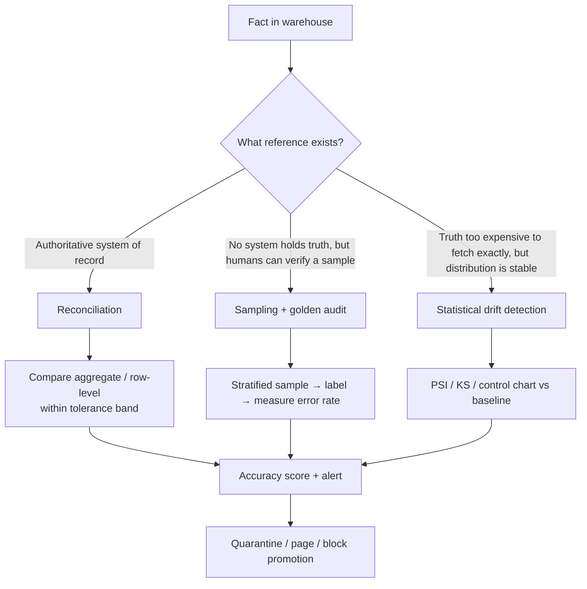

# Accuracy

> Chapter from the **Data Engineering Playbook** — data-quality.

## About This Chapter

**What this is.** Accuracy is the data-quality dimension that asks whether a stored value matches the real-world fact it claims to represent. This chapter covers how to verify it against an independent reference — reconciliation (comparing your data against a trusted source), sampling (checking a representative subset), and statistical drift detection (alerting when the shape of your data changes unexpectedly).

**Who it's for.** Mid-level data engineers, analytics engineers, platform/architecture leads, and engineers preparing for senior/staff data-engineering interviews.

**What you'll take away.** By the end you'll be able to:
- Choose between reconciliation, stratified sampling, and PSI/KS drift detection based on what reference (if any) actually exists for a fact.
- Design a tolerance model (absolute floor + relative band) and reconcile at business-key grain (the most granular level that identifies a unique business entity, like `order_id`) to produce queryable, auto-classified break records.
- Build a dollar-weighted accuracy gate that blocks promotion (prevents bad data from reaching dashboards), and tie accuracy to determinism, fan-out invariants (checks that a join did not accidentally multiply rows), and effective-dated reference data (dimension tables that track changes over time).

---

Accuracy is the dimension that asks: *does the value in the table match the real-world fact it claims to represent?* It is the hardest of the data-quality dimensions because it can't be checked from the data alone. A row can be present (completeness), arrive on time (freshness), be internally unique (validity), and still be wrong. A `subscription_status` of `active` for a customer who churned 40 days ago passes every schema check and every NOT NULL constraint, and it is still a lie. Detecting that lie requires a *reference* — a source of truth, an independent recomputation, or a statistical expectation — and the engineering is mostly about how you get and trust that reference.

## TL;DR

- Accuracy is correctness against an external truth, not internal consistency. You cannot assert it with a `WHERE` clause over a single table; you always need a second opinion (source system, recomputation, or distribution).
- There are three tractable strategies: **reconciliation** against the system of record, **sampling + manual/golden audit** for facts no system holds, and **statistical drift detection** for high-volume facts where exact reconciliation is too expensive.
- Accuracy decays silently. The failure mode is not a crash — it's a slowly diverging number that nobody catches until a VP screenshots a wrong revenue figure. Build *trend* alerts on accuracy rates, not just point checks.
- Tolerance is mandatory. Floating-point sums, timezone boundaries, and late-arriving corrections mean "exact match" reconciliation produces a flood of false positives. Define a tolerance band (absolute + relative) per metric before you ship the check.
- Accuracy bugs are usually *transformation* bugs (wrong join key, fan-out, currency not converted, SCD lookup at the wrong effective date), not ingestion bugs. The check belongs at the gold/serving layer (the final, business-ready layer of your data warehouse) where business semantics live, not only at bronze (the raw ingestion layer).
- The cheapest accuracy control is a deterministic, idempotent pipeline (one that produces the same result when run more than once) with a recompute-from-source capability. If you can replay, you can re-establish truth; if you can't, every accuracy incident becomes archaeology.

## Why this matters in production

Consider a daily `fct_revenue_by_product` table feeding a finance dashboard and the board deck. The pipeline joins `orders`, `order_lines`, `refunds`, and an FX rate dimension, then aggregates to product × day × currency-normalized USD.

Two weeks ago someone added a new `promotions` table and joined it in to attribute discounts. The join key was `(order_id)` but `promotions` has multiple rows per order when an order stacks two promo codes. Nobody added a `count(*)` guard. The result: orders with stacked promos fan out 2× (each order row is duplicated), doubling their revenue line. The error is ~0.4% of total revenue — invisible on a trend chart, well within day-to-day noise. Completeness is fine (every order is present). Freshness is fine (it ran at 06:00 as always). Validity is fine (all amounts are positive decimals). Every gate is green.

Finance closes the month. The number is 0.4% high. It reconciles *almost* to the billing system, and the analyst chalks the gap up to "timing." Three months later a fan-out on a different table compounds it to 1.8%, an auditor flags it, and now you're explaining to the CFO why the data team's revenue number never matched billing. That conversation is the cost of not having an accuracy control.

The fix is structural: a reconciliation check that takes the **independent** billing-system daily total, compares it to the warehouse total within a tolerance, and pages someone when the gap exceeds the band — *and* a transformation-level invariant that asserts `count(fct rows) == count(distinct order_line_id)` so fan-out trips immediately at the source of the bug rather than three layers downstream.

## How it works

Accuracy verification is always a comparison against a reference. The reference is what distinguishes the three strategies.



**Reconciliation** is exact-ish comparison. You take the same fact computed two independent ways and require them to agree within tolerance. The math is a tolerance test, not equality:

```
abs(warehouse_value - reference_value) <= max(abs_tol, rel_tol * abs(reference_value))
```

Use both an absolute floor (`abs_tol`) and a relative band (`rel_tol`). Pure relative tolerance underflows near zero (a $0.01 reference makes any cent of drift a 100% error); pure absolute tolerance over-alerts on large values. Typical settings for revenue: `abs_tol = $1.00`, `rel_tol = 0.001` (10 bps, meaning 0.1%).

**Sampling-based accuracy** estimates an error rate when no system holds the truth — for example, "is this address geocode correct?" You draw a stratified sample (a sample that proportionally covers different segments of your data), get ground-truth labels (human review, a trusted third-party API, a manual audit), and compute an error rate with a confidence interval (a range that shows how certain you are about the estimate). For a measured error rate `p̂` on a sample of size `n`, the 95% margin of error is approximately:

```
margin = 1.96 * sqrt( p̂ * (1 - p̂) / n )
```

So a 2% observed error on 1,000 sampled rows has a ±0.87% margin — you can credibly claim "error rate is 1.1%–2.9%," which is enough to gate a release. This is the only honest way to talk about accuracy for un-reconcilable facts: as a *rate with uncertainty*, never as a binary.

**Statistical drift detection** is the fallback when you can't reconcile every row and there's no human truth, but you trust that the *shape* of the data is stable. You compare today's distribution to a baseline using Population Stability Index (PSI — a measure of how much a variable's distribution has shifted) or a KS test (Kolmogorov-Smirnov test, a statistical method that checks whether two distributions differ significantly). PSI over `k` buckets:

```
PSI = Σ_i (actual_i% - expected_i%) * ln(actual_i% / expected_i%)
```

Rule of thumb: PSI < 0.1 = no shift, 0.1–0.25 = moderate (investigate), > 0.25 = significant (alert). Drift detection catches *that something changed*, not *that it's wrong* — it's a leading indicator that you pair with the other two.

## Deep dive

The parts engineers get wrong on accuracy, in order of how often they bite:

### 1. Reconciling at the wrong grain
The single most common mistake. You compare a warehouse daily total to a source daily total and they don't match, but you can't say *why* because you collapsed all the rows. Reconcile at the **finest grain you can afford**, then roll up. Row-level reconciliation (`order_id` → does the amount match?) tells you *which* orders are wrong; aggregate reconciliation only tells you the bucket is off by $X. Build a `recon_breaks` table keyed by the business key so a break is a queryable artifact, not a Slack message:

```sql
-- One row per mismatched key. This is the debugging surface.
CREATE TABLE recon_breaks (
    recon_date      DATE,
    business_key    STRING,   -- order_id, account_id, etc.
    metric          STRING,   -- 'revenue_usd'
    warehouse_value DECIMAL(18,4),
    source_value    DECIMAL(18,4),
    abs_diff        DECIMAL(18,4),
    rel_diff        DOUBLE,
    break_reason    STRING    -- auto-classified: 'missing_in_wh','fanout','fx_drift','late_correction'
);
```

### 2. Timing skew between systems
The source system is a live OLTP database (a transactional database optimized for writes, like a billing or CRM system); the warehouse is a snapshot taken at a specific point in time. If you reconcile a warehouse load taken at 06:00 against a source queried at 09:00, three hours of new orders and refunds will show as breaks. **Reconcile as-of a consistent cut point.** Either snapshot the source at the same watermark (`WHERE updated_at < '2026-06-18 06:00:00'`) or reconcile T-1 closed data only, never the current open day. Late-arriving corrections — a refund posted yesterday but effective two days ago — are the second source of timing noise; this is where SCD effective-dating accuracy (tracking which version of a dimension record was valid at a given point in time) intersects with reconciliation.

### 3. Float and decimal drift
`SUM` over a billion `DOUBLE` values does not equal the same sum computed in a different order, because floating-point addition is not associative (the order of operations affects the result) and Spark's shuffle (the step where Spark redistributes data across workers) reorders partitions non-deterministically. A reconciliation that requires exact equality on summed doubles will flap. Use `DECIMAL` for money end-to-end and a non-zero `abs_tol`. If you must keep doubles, round to the business precision (`ROUND(x, 2)`) *before* aggregation, and be aware Spark's `sum()` on decimals can overflow and silently return `NULL` if the result exceeds the declared precision — `DECIMAL(18,4)` summing millions of rows needs to widen to `DECIMAL(38,4)`.

### 4. Confusing accuracy with the other dimensions
A row that's missing from the warehouse shows up as a reconciliation break, but its *cause* is completeness, not accuracy. Auto-classify break reasons (the `break_reason` column above) so the on-call engineer doesn't burn an hour discovering that "the number is wrong" because "we dropped 4,000 rows." Accuracy, completeness, and freshness share the same alerting plumbing but have different remediations: completeness → re-ingest; freshness → re-run; accuracy → fix the transform.

### 5. The reference itself is wrong
A principal-level trap. Teams treat the "source of truth" as infallible. It isn't. Billing systems double-count canceled-then-rebooked orders; the CRM has a `created_at` in the rep's local timezone. When the warehouse and the source disagree, the answer is sometimes that the warehouse is *right*. This is why you keep break-level detail: you want to be able to walk into a meeting and say "of the $40k gap, $38k is the billing system counting reversals twice, here are the 212 order IDs." Reconciliation that can only say "off by $40k" loses that argument.

### 6. Recompute determinism
If your pipeline isn't deterministic — non-idempotent merges (merge operations that produce different results when run twice), `current_timestamp()` baked into the output, dependence on the order of a `Kafka` partition read — you cannot reproduce a number, and therefore cannot prove which version was accurate. Determinism is a *precondition* for accuracy, not a nice-to-have. Pin FX rates and reference dimensions to an effective date stored *in the run*, not "latest," so a re-run of last Tuesday produces last Tuesday's numbers.

## Worked example

End-to-end revenue reconciliation in PySpark: independent source total, warehouse total, tolerance test, break classification, and a gate that blocks promotion.

```python
from pyspark.sql import functions as F, Window
from decimal import Decimal

ABS_TOL = Decimal("1.00")    # $1 absolute floor
REL_TOL = 0.001              # 10 bps relative band
RECON_DATE = "2026-06-17"    # reconcile closed T-1, never the open day

# --- 1. Warehouse side: the metric AS WE COMPUTED IT, at order grain ---
wh = (spark.table("gold.fct_revenue")
        .where(F.col("revenue_date") == RECON_DATE)
        .groupBy("order_id")
        .agg(F.sum("revenue_usd").alias("wh_value")))

# Fan-out guard: gold should have exactly one row's worth of revenue per order line.
# If this fails, the bug is a join fan-out, not an FX or timing issue.
line_count = spark.table("gold.fct_revenue").where(F.col("revenue_date") == RECON_DATE)
assert line_count.count() == line_count.select("order_line_id").distinct().count(), \
    "FAN-OUT: fct_revenue has duplicate order_line_id rows"

# --- 2. Source of truth: billing system, snapshotted at the SAME cut point ---
# Pin the watermark so OLTP writes after the cut don't show as phantom breaks.
src = (spark.read.jdbc(url=BILLING_JDBC, table="billing.settled_orders", properties=PROPS)
        .where((F.col("settled_date") == RECON_DATE) &
               (F.col("updated_at") < F.lit(f"{RECON_DATE} 23:59:59")))
        .groupBy("order_id")
        .agg(F.sum("settled_amount_usd").alias("src_value")))

# --- 3. Full outer join so we see breaks in BOTH directions ---
joined = (wh.join(src, "order_id", "full_outer")
            .withColumn("wh_value",  F.coalesce("wh_value",  F.lit(Decimal("0"))))
            .withColumn("src_value", F.coalesce("src_value", F.lit(Decimal("0")))))

# --- 4. Tolerance test: abs(diff) <= max(abs_tol, rel_tol * abs(src)) ---
allowed = F.greatest(F.lit(ABS_TOL), F.abs(F.col("src_value")) * F.lit(REL_TOL))
breaks = (joined
    .withColumn("abs_diff", F.abs(F.col("wh_value") - F.col("src_value")))
    .withColumn("rel_diff", F.col("abs_diff") / F.when(F.col("src_value") != 0, F.abs("src_value")).otherwise(F.lit(None)))
    .where(F.col("abs_diff") > allowed)
    # 5. Auto-classify the break so on-call gets a cause, not just a number
    .withColumn("break_reason",
        F.when(F.col("wh_value") == 0, "missing_in_warehouse")     # completeness, not accuracy
         .when(F.col("src_value") == 0, "extra_in_warehouse")      # fan-out or bad filter
         .when(F.col("wh_value") > F.col("src_value"), "wh_overstated")
         .otherwise("wh_understated"))
    .withColumn("recon_date", F.lit(RECON_DATE)))

breaks.write.mode("append").saveAsTable("dq.recon_breaks")

# --- 6. Accuracy score + gate ---
total_orders = joined.count()
break_count  = breaks.count()
break_dollars = breaks.agg(F.sum("abs_diff")).first()[0] or Decimal("0")
src_dollars   = src.agg(F.sum("src_value")).first()[0] or Decimal("1")

accuracy_rate = 1 - (break_count / total_orders)
dollar_accuracy = 1 - float(break_dollars / src_dollars)

print(f"order-level accuracy: {accuracy_rate:.4%}  dollar accuracy: {dollar_accuracy:.4%}")
print(f"breaks: {break_count} orders, ${break_dollars} unreconciled")

# Block promotion of the gold partition if dollar accuracy falls below SLO.
DOLLAR_ACCURACY_SLO = 0.9995   # 99.95% — at most 5 bps unreconciled
if dollar_accuracy < DOLLAR_ACCURACY_SLO:
    raise SystemExit(
        f"ACCURACY GATE FAILED: {dollar_accuracy:.4%} < {DOLLAR_ACCURACY_SLO:.4%}. "
        f"Partition {RECON_DATE} not promoted. See dq.recon_breaks.")
```

Two design choices carry the weight: the **fan-out assertion fires at the source of the most common bug** (so you debug a join, not a $-gap), and the **gate raises on a dollar-weighted rate**, not a raw count — one wrong $5M order matters more than 500 wrong $0.02 rounding breaks.

## Production patterns

- **Dollar-weighted (or impact-weighted) accuracy, not row-count accuracy.** "99.99% of rows reconcile" is meaningless if the 0.01% that don't are your largest accounts. Always weight the accuracy metric by the business magnitude of the fact.
- **Persist breaks as a table, alert on the trend.** A `dq.recon_breaks` table makes every incident queryable and lets you chart accuracy over time. Alert on the *derivative* (the day-over-day change) — a jump in break count or unreconciled dollars day-over-day — not just a static threshold. Slow drift is the failure mode point-checks miss.
- **Reconcile T-1 closed data, gate the promotion.** Don't reconcile the open day (timing noise) and don't let an unreconciled partition reach the serving layer. The gate belongs between gold compute and the `swap`/`exchange` that publishes the partition — on Iceberg (an open-source table format that supports transactions), this is the moment before the snapshot commit becomes the table's current ref.
- **Invariant assertions at the transform, reconciliation at the boundary.** Cheap, instantaneous invariants (`count == distinct count`, `sum of parts == whole`, `no negative revenue`) catch the bug class at the line of code that caused it. Cross-system reconciliation is slower and catches what invariants can't see. Use both; they're complementary, not redundant.
- **Stratified sampling for un-reconcilable facts.** For things no system can confirm (geocodes, ML-derived attributes, scraped data), sample stratified by segment, label a few hundred per stratum, and report error rate ± margin. Re-sample on every model/source change.
- **Golden datasets in CI.** Keep a small, hand-verified fixture (a test dataset with known-correct outputs) and run the real transformation against it in CI (your continuous integration pipeline) so a logic regression (wrong join, dropped currency conversion) fails the build before it touches production data. This is the only accuracy control that's free at runtime.
- **FX / reference-data effective-dating pinned per run.** Store the FX rate version and dimension snapshot id in the run metadata so re-runs are reproducible and accuracy is provable after the fact.

## Anti-patterns & failure modes

| Anti-pattern | Symptom you'd observe | Fix |
|---|---|---|
| Exact-equality reconciliation on summed doubles | Recon flaps green/red between identical re-runs; breaks with `abs_diff` of $0.0000001 | Switch to `DECIMAL`; add `abs_tol`; round to business precision before summing |
| Reconciling the open (current) day | Constant breaks every morning that "resolve themselves" by afternoon | Reconcile T-1 closed data; pin source watermark to the cut point |
| Aggregate-only reconciliation | "We're off by $12k" with no way to find which rows | Reconcile at business-key grain; persist `recon_breaks` keyed by that grain |
| Trusting the source of truth blindly | You "fix" the warehouse to match a source that was itself double-counting | Keep break-level detail; classify causes; be willing to conclude the warehouse is right |
| Row-count accuracy threshold | Gate passes at 99.99% while the few breaks are your biggest accounts | Weight accuracy by dollar/impact magnitude |
| No fan-out guard on new joins | Revenue silently inflates 0.x% per stacked-promo / multi-row dimension join | `assert count == distinct(grain key)` invariant at the transform |
| Point-threshold alerts only | A slow 5-bps/week drift never trips the static alert until it's 2% | Alert on day-over-day delta and rolling trend, not just absolute level |
| Non-deterministic pipeline | Can't reproduce last week's number to prove which version was right | Idempotent merges; pin FX/dim effective dates; no `current_timestamp()` in outputs |

## Decision guidance

| Situation | Use | Why |
|---|---|---|
| An authoritative system holds the same fact (billing, ledger, CRM) | **Reconciliation** within a tolerance band | Direct, defensible, row-level diagnosable |
| Volume too high to reconcile every row, but a trusted aggregate exists | Aggregate reconciliation + statistical drift on row-level | Cheap; catches systemic shifts |
| No system holds the truth; humans can verify a sample (addresses, ML labels) | **Stratified sampling** + error rate with CI | Honest accuracy-as-a-rate when exact truth is unavailable |
| High-volume fact, no reference, stable history | **PSI / KS drift detection** vs baseline | Leading indicator of "something changed"; pair with sampling |
| Logic-regression protection in the build | **Golden dataset in CI** | Free at runtime; catches transform bugs pre-prod |
| Money on the board deck | Reconciliation **+** invariant assertions **+** gated promotion | Defense in depth; the cost of a wrong number is highest here |

Reconciliation is the default when a reference exists — reach for sampling or drift only when it genuinely doesn't. Most "we can't reconcile" claims are really "we haven't found the consistent cut point yet."

## Interview & architecture-review talking points

- **"Accuracy can't be asserted from the data alone."** Lead with this. It separates accuracy from validity/completeness and shows you understand you always need an independent reference. Interviewers probe whether you'll naively write a `WHERE x > 0` check and call it accuracy.
- **Tolerance is a design decision, not a default.** Be ready to defend specific numbers: "10 bps relative, $1 absolute floor, because float drift and FX rounding produce sub-dollar noise and 10 bps is below finance's materiality threshold." Vague answers here read as junior.
- **Diagnose at the grain, gate at the boundary.** Explain why you reconcile at business-key grain (debuggability) but enforce the SLO (service-level objective — the agreed-upon accuracy target) on a dollar-weighted aggregate at the promotion boundary (impact). This is the principal-level nuance.
- **The source of truth can be wrong.** Demonstrating that you keep break-level evidence and have argued *down* a reconciliation gap by showing the source was double-counting signals real production scars.
- **Determinism as a precondition.** Tie accuracy to idempotency and effective-dating: "I can't prove a number is accurate if I can't reproduce it." This connects accuracy to pipeline architecture, not just checks.
- **Trend over threshold.** Static thresholds miss slow drift, which is exactly how accuracy fails in practice. Alerting on the derivative is the difference between catching a 0.4% bug at week one versus an auditor catching it at month three.

## Further reading

- [reconciliation](../reconciliation/) — system-to-system parity, tolerance thresholds, and automated quarantine (the enforcement mechanism for accuracy)
- [completeness](../completeness/) — why a "missing_in_warehouse" break is a completeness problem wearing an accuracy costume
- [freshness](../freshness/) — timing skew between source and warehouse, the second-largest source of false reconciliation breaks
- [../../data-modeling/scd-types](../../data-modeling/scd-types/) — effective-dating, the mechanism that keeps point-in-time facts accurate as dimensions change
- [../../lakehouse/iceberg](../../lakehouse/iceberg/) — snapshot/commit semantics that let you gate a partition before it becomes the table's current ref
- [../../observability/monitoring](../../observability/monitoring/) — wiring break trends into alerting and on-call
