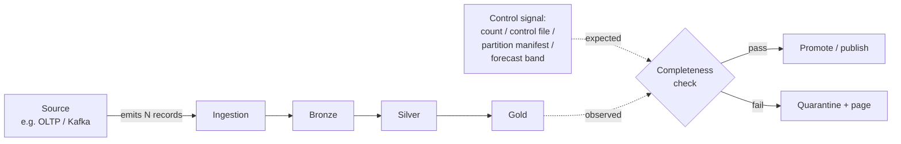

# Completeness

> Chapter from the **Data Engineering Playbook** — data-quality.

Completeness is the discipline of proving that *every row that should exist, does* — and that the columns you depend on are actually populated. It is the cheapest data-quality dimension to check and the most expensive to get wrong, because incompleteness is silent: a pipeline that drops 8% of orders still produces a green dashboard, valid schemas, and clean-looking sums. Nobody pages you. Finance just quietly under-reports revenue until someone reconciles against the source of truth three weeks later.

## TL;DR

- Completeness has two distinct axes that get conflated: **row completeness** (did all expected records arrive?) and **attribute completeness** (are the columns that matter actually populated?). They fail for different reasons and need different checks.
- The hard part isn't counting nulls — it's establishing **what "complete" means** when you have no external truth. You need a *reference cardinality*: an upstream count, a control file, a partition expectation, or a forecast band.
- Absolute thresholds (`null_rate < 1%`) rot. Use **relative, distribution-aware checks** anchored on historical baselines and partition keys, or you will drown in false pages on Black Friday and miss a 40% drop on a Tuesday.
- Late and out-of-order arrival means completeness is a function of *time*, not a single verdict. A partition is "incomplete" at T+0 and "complete" at T+6h — your checks must understand watermarks.
- Distinguish **structurally absent** (NULL because the business event didn't happen) from **lost** (NULL because the pipeline ate it). Treating both as "missing" produces alerts engineers learn to ignore.
- Wire completeness as a **gate**, not a report. A failed completeness assertion should stop promotion from `staging` to `gold`, not show up red on a dashboard the next morning.

## Why this matters in production

A concrete scenario from a clickstream-to-revenue pipeline. Events land in Kafka, a Spark Structured Streaming job writes them to a Bronze Iceberg table, an hourly batch aggregates to Silver, and a daily job rolls up to a Gold `daily_revenue_by_channel` table that the CFO's dashboard reads.

One day an upstream team ships a mobile SDK update that changes the `channel` enum from `mobile` to `mobile_ios` / `mobile_android`. Nothing breaks. Schemas are compatible (`channel` is still a string). Row counts in Bronze are normal. But the Gold rollup has a `WHERE channel IN ('web','mobile','email')` filter buried in it from 2021. Result: 30% of revenue silently falls out of the Gold table. Every individual stage passes its own checks. The sums are internally consistent. The only signal is that `daily_revenue` is lower than yesterday — and yesterday was a Sunday, so "lower" looked plausible.

This is the canonical completeness failure: **no single stage is wrong, but the data that reaches the consumer is incomplete relative to the source of truth.** Completeness checks exist to make that invisible loss loud. The fix is not "add more nulls checks" — it's establishing reference cardinality at each hop and reconciling against it. (See [reconciliation](../reconciliation/) for the cross-system count-matching that catches exactly this.)

## How it works

Completeness is always a comparison: *observed* against *expected*. The entire problem reduces to where "expected" comes from and at what granularity you compare.



Four ways to source the *expected* value, in rough order of trustworthiness:

| Reference source | How you get "expected" | Trust | Cost |
|---|---|---|---|
| **Control file / manifest** | Upstream emits a sidecar with exact row count + checksum per batch | Highest — authoritative | Requires upstream cooperation |
| **Source-system count** | Query the OLTP/source directly for `COUNT(*)` in the window | High | Adds load on source; clock-skew risk |
| **Partition expectation** | "Every hour partition must have ≥ N rows" from schedule | Medium | Breaks on legitimate low-traffic windows |
| **Statistical forecast** | Model expected volume from history (seasonality, trend) | Medium-low; good for anomaly bands | Needs enough history + tuning |

### Attribute completeness math

For a column `c` over a partition `p`, the metric is the **populated rate**:

```
populated_rate(c, p) = (rows where c IS NOT NULL AND c <> '') / total_rows(p)
```

Note `c <> ''` and the explicit handling of sentinel values (`'N/A'`, `'-1'`, `'1970-01-01'`, `'\\N'`). A naive `IS NOT NULL` check passes happily while the column is 100% empty strings. This is the single most common attribute-completeness false-negative.

For **conditional completeness** — the column is only required when some predicate holds — the denominator changes:

```
conditional_populated_rate = (rows where required AND c IS NOT NULL) / (rows where required)
```

Example: `shipping_address` is only required when `order_type = 'physical'`. Checking it globally produces a permanently "incomplete" column because digital orders have no shipping address — that's *structural absence*, not a defect.

### Row completeness with watermarks

For streaming/late-arriving data, completeness is time-dependent. Define a watermark `W` and an allowed lateness `L`. A window `[t, t+Δ)` is considered *sealed* (eligible for a final completeness verdict) only when `event_time_watermark >= t + Δ + L`. Before that, you report `completeness_so_far`, not `complete: false`. Conflating "not yet complete" with "incomplete" is what generates 3 a.m. pages that resolve themselves by 6 a.m.

## Deep dive

This is where engineers get it wrong. The mechanics above are easy; the judgment below is the actual work.

### 1. Null is overloaded — disambiguate before you alert

A NULL in a downstream column can mean at least five different things:

| NULL means | Example | Is it a defect? |
|---|---|---|
| Event genuinely didn't happen | `cancelled_at` on an active order | No — structural |
| Optional field not provided | `middle_name` | No — structural |
| Left-join miss | `customer.tier` after joining to a dim that lacks the key | **Maybe** — referential gap |
| Parse/cast failure swallowed | `to_date()` returned NULL on a bad format | **Yes** — silent corruption |
| Upstream lost the value | Field present at source, NULL after ingest | **Yes** — pipeline bug |

The first two inflate your null rate and train people to ignore the metric. The fix is to **scope completeness checks to columns and conditions where population is contractually expected**, and to separately track *cast-failure nulls* by counting them at the point of transformation (a `try_cast` that nulls out should increment a counter, not vanish).

### 2. Aggregate thresholds hide localized loss

A 1% global null-rate threshold on a 2-billion-row table is useless. If one customer's data feed breaks and they represent 0.5% of volume, you lose 100% of their rows and the global metric barely moves. Completeness must be checked **per meaningful partition** — per source system, per region, per `tenant_id`, per ingestion hour — not as a single table-wide number. The check that catches real incidents is "no `source_system` that had data yesterday has zero rows today," not "table null rate < 1%."

### 3. The denominator is the bug

Most "completeness check passed but data was wrong" postmortems trace to a wrong denominator. If your expected count comes from the same pipeline that produced the observed count, you're checking the pipeline against itself — it will always agree, including when both are wrong. **The reference must be independent of the path being validated.** A control file from upstream, or a direct source query, breaks the circularity. Self-referential completeness checks are theater.

### 4. Re-delivery and dedup inflate completeness past 100%

At-least-once delivery from Kafka means you can observe *more* rows than expected after a consumer restart and offset replay. If your check is `observed >= expected`, duplicates make incompleteness look like over-completeness, masking real loss. You need exactly-once semantics or idempotent dedup *before* the completeness comparison, or you must compare on **distinct business keys**, not raw row counts. (See [exactly-once](../../kafka/exactly-once/) and [offsets](../../kafka/offsets/).)

### 5. Backfills break baselines

Statistical/forecast-based completeness checks anchor on history. A backfill that reprocesses 90 days dumps an enormous volume into "today's" partition by ingestion time, and your anomaly band screams. The fix is to key completeness baselines on the **business event date**, not the physical load date, and to suppress volume-anomaly checks (not correctness checks) during declared backfill windows.

### 6. Schema evolution silently drops attribute completeness

When a column is added upstream, every historical row is NULL for it. When a column is renamed and the old reader keeps the old name, the new column is 100% NULL going forward. Both look like attribute-completeness regressions. Tie your column-completeness expectations to a schema contract with an effective date, so "this column is required starting 2026-03-01" doesn't fire for partitions before that date. (See [event-design](../../kafka/event-design/) for contract evolution.)

## Worked example

A PySpark completeness gate that runs between Silver and Gold. It checks row completeness against an independent control table and attribute completeness per partition with sentinel awareness, and it *fails the job* rather than logging.

```python
from pyspark.sql import functions as F, DataFrame
from datetime import date

# --- Config: what "complete" means, as a contract ---
EXPECTED_TOLERANCE = 0.005          # allow 0.5% slippage vs control count
REQUIRED_COLS = {                   # col -> predicate under which it's required
    "order_id":      F.lit(True),
    "customer_id":   F.lit(True),
    "amount_usd":    F.lit(True),
    "shipping_addr": F.col("order_type") == "physical",   # conditional
}
SENTINELS = ["", "N/A", "n/a", "\\N", "-1", "null"]


def _is_populated(col: str):
    c = F.col(col)
    return c.isNotNull() & (~F.trim(c.cast("string")).isin(SENTINELS))


def check_row_completeness(observed: DataFrame, control: DataFrame, biz_date: date):
    """Compare distinct business keys against an INDEPENDENT control count."""
    obs_n = (observed
             .where(F.col("event_date") == F.lit(biz_date))
             .select("order_id").distinct().count())          # distinct => dedup-safe
    exp_n = (control
             .where(F.col("event_date") == F.lit(biz_date))
             .select(F.col("expected_orders")).first()[0])

    if exp_n == 0:
        raise ValueError(f"No control row for {biz_date}; cannot assert completeness")

    shortfall = (exp_n - obs_n) / exp_n
    if shortfall > EXPECTED_TOLERANCE:
        raise AssertionError(
            f"ROW INCOMPLETE {biz_date}: observed {obs_n:,} vs expected {exp_n:,} "
            f"({shortfall:.2%} short, tolerance {EXPECTED_TOLERANCE:.2%})")
    return {"observed": obs_n, "expected": exp_n, "shortfall": shortfall}


def check_attribute_completeness(df: DataFrame, biz_date: date):
    """Per-source populated-rate. Conditional cols use their own denominator."""
    part = df.where(F.col("event_date") == F.lit(biz_date))
    results = []
    for col, required_pred in REQUIRED_COLS.items():
        req = part.where(required_pred)
        agg = req.agg(
            F.count(F.lit(1)).alias("denom"),
            F.sum(_is_populated(col).cast("int")).alias("populated"),
        ).first()
        denom = agg["denom"] or 0
        rate = (agg["populated"] / denom) if denom else 1.0
        results.append((col, denom, rate))
        # 99.9% bar for hard-required keys; conditional cols get the same bar
        if rate < 0.999:
            raise AssertionError(
                f"ATTR INCOMPLETE {col} on {biz_date}: {rate:.3%} populated "
                f"over {denom:,} required rows")
    return results
```

Run it from the orchestration layer as a blocking task. In Airflow this is just a `PythonOperator` whose raised exception fails the DAG and halts the downstream `publish_gold` task — completeness becomes a promotion gate, not a postmortem artifact.

If you prefer declarative assertions, the same logic in **Great Expectations** / **Soda** expresses row completeness as a freshness-of-volume expectation and attribute completeness as `expect_column_values_to_not_be_null` scoped by a `row_condition`:

```yaml
# soda check (illustrative)
checks for silver_orders:
  - row_count between:
      warn: when < expected_orders * 0.998
      fail: when < expected_orders * 0.995
  - missing_count(amount_usd) = 0
  - missing_percent(shipping_addr) < 0.1%:
      filter: order_type = 'physical'
  - missing_count(shipping_addr) = 0:
      name: structural - digital orders exempt
      filter: order_type = 'digital'   # expected to be NULL; assert it stays scoped
```

## Production patterns

- **Control-file handshake at ingestion.** Have upstream emit a manifest per batch: `{batch_id, row_count, min_event_ts, max_event_ts, sha256}`. Refuse to mark a partition complete until observed distinct keys reconcile with the manifest count. This single pattern eliminates the largest class of silent loss.
- **Completeness as an Iceberg/Delta partition property.** After validation, write a partition-level metadata flag (`completeness_status=sealed`, `expected=…`, `observed=…`) so downstream readers can filter to sealed partitions only and never read a half-loaded hour. Pairs naturally with snapshot isolation (see [iceberg](../../lakehouse/iceberg/) and [delta](../../lakehouse/delta/)).
- **Two-tier verdict for streaming.** Emit `completeness_so_far` continuously and a final `sealed` verdict once the watermark passes `window_end + allowed_lateness`. Alert only on sealed-state shortfalls.
- **Per-segment baselines, not global.** Track expected volume per `(source_system, region, event_hour)` and alert when a segment that historically had data goes to zero. A "missing segment" detector catches feed outages that global counts mask.
- **Cast-failure counters.** Every `try_cast` / lenient parse that can null a value increments a named metric. A spike in cast-failure nulls is a schema-drift early warning, distinct from row loss.
- **Backfill-aware suppression.** Key baselines on business event date; tag declared backfills so volume-anomaly checks suppress while correctness checks (key uniqueness, attribute population) keep running.

## Anti-patterns & failure modes

| Anti-pattern | Symptom you observe | Fix |
|---|---|---|
| Global null-rate threshold on a huge table | A whole tenant's feed dies; metric moves 0.3%; no alert | Check completeness per partition/segment, alert on zero-data segments |
| Self-referential expected count | Checks always pass, including during real loss | Source `expected` from an independent control file or source query |
| `IS NOT NULL` without sentinel handling | Column is 100% empty strings; check is green | Treat `''`, `'N/A'`, `'-1'`, epoch dates as not-populated |
| Treating structural NULLs as defects | Permanent red on `cancelled_at`, `middle_name`; alert fatigue | Scope checks to contractually-required columns + conditions |
| Raw row count under at-least-once delivery | Duplicates mask real shortfall; `observed >= expected` lies | Compare on distinct business keys after dedup |
| Single verdict for late-arriving data | 3 a.m. page resolves itself by 6 a.m. every day | Two-tier `so_far` / `sealed` with watermark + allowed lateness |
| Completeness as a dashboard, not a gate | Incomplete Gold table is consumed for hours before anyone notices | Make a failed assertion block promotion to Gold |
| Baseline keyed on physical load date | Every backfill triggers a false volume alert | Key baselines on business event date; suppress during backfills |

## Decision guidance

| Situation | Use |
|---|---|
| Upstream can emit a manifest/control file | Control-file reconciliation — highest trust, do this |
| Source is a queryable OLTP, modest volume | Direct source `COUNT(*)` per window |
| High-cardinality, seasonal volume, no control source | Statistical forecast band (e.g. STL/Prophet) for anomaly detection only |
| Streaming with late data | Watermark-sealed two-tier verdict |
| You need cross-system row-for-row agreement, not just counts | Escalate to full [reconciliation](../reconciliation/) |
| You care whether values are *right*, not just present | That's [accuracy](../accuracy/), not completeness — different check |
| You care whether data arrived *on time* | That's [freshness](../freshness/) — completeness can be 100% and stale |

Completeness, accuracy, and freshness are orthogonal and all three can fail independently. A partition can be 100% complete, perfectly fresh, and entirely wrong (every `amount` off by a currency-conversion bug). Don't let one green check imply the others.

## Interview & architecture-review talking points

- "Completeness is a comparison; the design question is *where does `expected` come from* and how do I keep it independent of the path I'm validating." Leading with the denominator problem signals you've debugged real incidents, not just read the docs.
- "I check completeness per segment, not table-wide, because aggregate thresholds mathematically cannot detect localized loss below the threshold's resolution." This is the line that separates senior from staff thinking.
- "I distinguish structural NULLs from lost values via a column contract, because conflating them produces alert fatigue and trains the on-call to ignore the one signal that matters."
- "For streaming I emit a provisional and a sealed verdict tied to the watermark, so I'm not paging on data that's merely late."
- "Completeness is a promotion gate, not a report — a failed assertion stops `staging → gold`, so consumers never read a partially-loaded partition." This reframes data quality as a control-flow concern, which is the principal-level move.
- When challenged on cost: per-segment distinct-key counts are cheap relative to the cost of a CFO discovering 30% of revenue went missing for three weeks. The asymmetry justifies the spend.

## Further reading

- [reconciliation](../reconciliation/) — cross-system count and row-level agreement; the heavier hammer when counts alone aren't enough.
- [accuracy](../accuracy/) — values being correct, not merely present.
- [freshness](../freshness/) — on-time arrival; orthogonal to completeness.
- [kafka/exactly-once](../../kafka/exactly-once/) and [kafka/offsets](../../kafka/offsets/) — why raw counts lie under at-least-once delivery.
- [lakehouse/iceberg](../../lakehouse/iceberg/) and [lakehouse/delta](../../lakehouse/delta/) — snapshot isolation and partition metadata for sealing complete partitions.
- [observability/monitoring](../../observability/monitoring/) — wiring segment-level completeness signals into alerting.
- Internal ADRs in [`adr/`](../../adr/).
- External: *Great Expectations* documentation on expectation suites; *Soda Core* checks reference. For the broader taxonomy, the DAMA-DMBOK data-quality dimensions chapter remains the canonical framing of completeness vs. the other dimensions.
