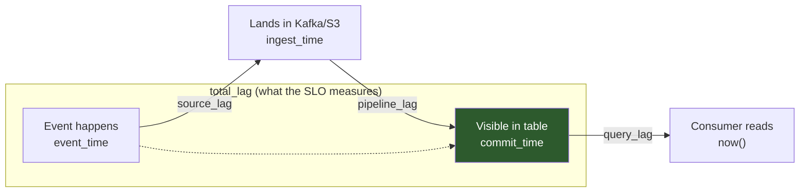

# Data Freshness

> Chapter from the **Data Engineering Playbook** — data-quality.

Freshness is the answer to one question a consumer actually asks: *"As of what wall-clock moment is this table true?"* Everything else in this chapter is about measuring that lag honestly, alerting on it before the consumer notices, and not lying to yourself about which clock you're measuring against.

## TL;DR

- Freshness is a **lag**, not a timestamp. Always express it as `now() − T`, where `T` is a clock you have explicitly chosen (event time, ingest time, or commit time). Most freshness bugs are really *clock confusion* bugs.
- The single most dangerous freshness failure is **silent staleness**: the pipeline is green, the table is queryable, the last partition is from 9 hours ago, and nobody is paged. A row-count check will not catch this. You need a max-timestamp check.
- Set freshness SLOs **per consumer tier**, not per table. A gold dashboard that the CFO opens at 8am and an ML feature table read at inference time have different deadlines and different escalation paths.
- Measure freshness on the **read path**, from the catalog/table the consumer actually queries — not on the write path from your job's success log. A job that finishes at 02:00 but whose Iceberg snapshot isn't committed until 02:40 is 40 minutes stale by the only clock that matters.
- Watermarks, late data, and freshness are the same problem viewed from different angles. If you allow 6 hours of lateness for correctness, your freshness floor is 6 hours — you cannot SLO your way under your own watermark.
- Backfills and replays are the most common cause of false freshness alerts and of *real* freshness regressions. Freshness logic must distinguish "new data arriving late" from "old data being rewritten."

## Why this matters in production

The failure I have cleaned up the most times looks identical every time. A marketing attribution pipeline runs hourly on Airflow. Every task is green. The DAG has been green for three days. On Thursday a director pulls the daily spend-vs-conversion dashboard and the numbers are flat after Tuesday 18:00.

The upstream Kafka topic stopped emitting a particular event type because a mobile client shipped a bad release. The Spark Structured Streaming job kept running — it had data, just not *that* data. The Iceberg table kept getting new snapshots (other event types still flowed). Row counts went *up*. Null rates were fine. Every classic data-quality check passed. The table was simply stale for one slice, and nothing measured "what is the newest event for `event_type = 'conversion'`."

Freshness is the dimension that catches "the pipeline is healthy but reality moved on." It is orthogonal to [completeness](../completeness/README.md) (did we get all the rows we expected?) and [accuracy](../accuracy/README.md) (are the values right?). You can be 100% complete and 100% accurate *as of two days ago* and still be useless. The cost of getting this wrong is rarely a crash — it's a decision made on stale data, which is far harder to detect after the fact.

## How it works

There are three clocks in any pipeline, and conflating them is the root of most incidents.

| Clock | Definition | Who sets it | Use freshness against it when |
|---|---|---|---|
| **Event time** | When the thing happened in the real world | The producer/device | You care about real-world recency (fraud, attribution, SLAs to customers) |
| **Ingest time** | When the record landed in your first durable store (Kafka append, raw S3 write) | Your edge | You care about pipeline throughput, not source delay |
| **Commit time** | When the record became visible in the consumer-facing table (Iceberg snapshot commit, Delta version) | Your transform layer | You are reporting freshness to a query consumer (almost always) |

Lag is always a difference of two clocks. The three lags worth naming:

```
source_lag   = ingest_time  − event_time      # how late the producer is
pipeline_lag = commit_time   − ingest_time     # how slow your processing is
total_lag    = commit_time   − event_time      # what the consumer feels
```

`total_lag = source_lag + pipeline_lag`. You can only control `pipeline_lag` directly. `source_lag` is owned by an upstream team, and a freshness SLO that ignores this distinction will page the wrong team at 3am.



The measurement itself is deliberately simple. For a table the consumer queries, freshness is:

```
freshness_lag = current_timestamp() − MAX(event_timestamp_column)
```

The hard parts are (1) choosing the right `event_timestamp_column`, (2) measuring it without scanning the whole table, and (3) deciding the threshold. Iceberg and Delta make (2) cheap because you can read the latest snapshot's partition stats or column upper bounds from metadata instead of running `MAX()` over billions of rows — more on that below.

## Deep dive

### The watermark is your freshness floor

If your streaming job uses a watermark of 6 hours to handle late-arriving events, you are *telling the engine* "do not finalize a window until 6 hours after its event time." That is a correctness decision, and it puts a hard floor under freshness. No SLO, no faster cluster, no autoscaling will make a 6-hour-watermarked aggregate fresher than ~6 hours for its final, correct value.

```python
# Structured Streaming: watermark = correctness deadline = freshness floor
events.withWatermark("event_time", "6 hours") \
      .groupBy(window("event_time", "1 hour"), "campaign_id") \
      .agg(count("*").alias("conversions"))
```

The principal-level move is to **expose both a provisional and a finalized freshness**. Emit the windowed result early (provisional, low lag, may revise) and again at watermark close (finalized, high lag, stable). Consumers that need recency read provisional; consumers that need correctness read finalized. Trying to serve both from one number is how you end up with a dashboard that "flickers" as late data lands and an analyst who stops trusting it. This is the same late-data tradeoff covered in [event-driven systems](../../distributed-systems/event-driven-systems/README.md) and Kafka [offsets](../../kafka/offsets/README.md).

### Max-timestamp is not enough by itself

`MAX(event_time)` answers "how recent is the newest row" but is blind to **partial staleness**. The attribution incident above is exactly this: `MAX(event_time)` across all event types was fresh, but `MAX(event_time) WHERE event_type='conversion'` was 36 hours stale. A single global freshness metric on a multi-tenant or multi-event table hides per-slice staleness.

The fix is dimensioned freshness — compute the lag per the dimensions that matter to consumers:

```sql
SELECT
  event_type,
  region,
  MAX(event_time)                                    AS latest_event,
  TIMESTAMPDIFF(MINUTE, MAX(event_time), CURRENT_TIMESTAMP()) AS lag_minutes
FROM analytics.conversions
WHERE event_date >= CURRENT_DATE - INTERVAL 2 DAY      -- bound the scan
GROUP BY event_type, region
HAVING lag_minutes > 120;                              -- alert rows only
```

The cardinality of your freshness GROUP BY is a design decision. Too coarse and you miss partial staleness; too fine and you generate thousands of noisy per-key alerts. I default to grouping by the dimension that maps to an *owner who can act* (the team that produces `event_type`), not every dimension that exists.

### Measure on the read path, cheaply, via table metadata

A common mistake is treating job success as freshness. The job's `_SUCCESS` file or Airflow task state tells you the *write* finished. It does not tell you the data is *visible* — there may be a catalog commit, a MSCK/partition registration, a view refresh, or a downstream materialization between write and read.

Measure freshness by querying the consumer's table. With Iceberg you don't need a full scan — the snapshot carries commit time and column bounds:

```sql
-- Iceberg: commit-time freshness straight from metadata, no data scan
SELECT
  committed_at,
  TIMESTAMPDIFF(MINUTE, committed_at, CURRENT_TIMESTAMP()) AS commit_lag_min
FROM analytics.conversions.snapshots
ORDER BY committed_at DESC
LIMIT 1;

-- Event-time upper bound from manifest column stats (no scan of data files)
SELECT readable_metrics
FROM analytics.conversions.files
LIMIT 5;   -- upper_bounds[event_time] gives near-free MAX(event_time)
```

For Delta, `DESCRIBE HISTORY` exposes the equivalent commit timestamps, and the transaction log's `add` actions carry per-file `maxValues` you can read without a scan. The principle: **freshness checks should cost milliseconds**, because you run them constantly and on tables you may not want to wake up.

### Distinguish "late" from "rewritten"

Backfills break naive freshness. Suppose you reprocess last month's data to fix a bug. The `commit_time` is now (fresh!) but the `event_time` is 30 days old (stale!). A `total_lag` alert fires even though everything is working as intended; a `commit_lag` alert stays silent even though the *current* day's data may have stopped flowing.

Robust freshness tracks **both** lags and interprets them together:

| `commit_lag` | `event_time` lag (newest-day partition) | Interpretation |
|---|---|---|
| Low | Low | Healthy |
| Low | High | Backfill/replay in progress — suppress event-time alert |
| High | High | **Pipeline stalled — page** |
| High | Low | Stopped committing recently; recent data stuck pre-commit |

The cleanest implementation: track freshness *per partition you expect to be active* (today, this hour), not globally. "Is the partition for the current hour committed and is its `MAX(event_time)` within SLO?" is immune to backfill noise because it scopes the question to the partition that should be moving.

### Freshness SLO math

Define the SLO as a percentile over a window, not a single bad reading, or transient blips page you:

```
freshness_slo = "p95 of commit_lag over a rolling 7-day window ≤ 90 minutes,
                 AND no single reading > 180 minutes"
```

Two thresholds: a **soft** percentile (warning, ticket) and a **hard** ceiling (page). This mirrors how you'd run an availability SLO with an error budget. The hard ceiling protects against the one catastrophic stall; the percentile protects against slow erosion you'd otherwise normalize.

## Worked example

End-to-end freshness sentinel for an Iceberg gold table, run on a schedule independent of the producing job (so a dead job can't also kill its own monitor). PySpark, but the SQL translates to any engine.

```python
from pyspark.sql import SparkSession
from datetime import datetime, timezone

spark = SparkSession.builder.getOrCreate()

TABLE   = "analytics.conversions"
TIER    = "gold"
# Per-consumer-tier SLOs, in minutes. Soft -> ticket, hard -> page.
SLO = {
    "gold":   {"soft": 90,  "hard": 180},
    "feature":{"soft": 15,  "hard": 30},
}

def freshness_check(table: str, tier: str):
    # 1. Commit-time lag from snapshot metadata (no data scan)
    commit = spark.sql(f"""
        SELECT committed_at,
               (unix_timestamp(current_timestamp()) - unix_timestamp(committed_at)) / 60
                 AS commit_lag_min
        FROM {table}.snapshots
        ORDER BY committed_at DESC LIMIT 1
    """).first()

    # 2. Event-time lag on the partition that SHOULD be active right now.
    #    Scoped scan => backfills of old partitions don't trip this.
    event = spark.sql(f"""
        SELECT
          event_type,
          MAX(event_time) AS latest,
          (unix_timestamp(current_timestamp()) - unix_timestamp(MAX(event_time))) / 60
            AS event_lag_min
        FROM {table}
        WHERE event_date = CURRENT_DATE          -- active partition only
        GROUP BY event_type
    """).collect()

    soft, hard = SLO[tier]["soft"], SLO[tier]["hard"]
    findings = []

    # Pipeline stalled: nothing committing recently
    if commit.commit_lag_min > hard:
        findings.append(("PAGE", f"commit_lag={commit.commit_lag_min:.0f}m > {hard}m"))

    # Per-slice staleness — catches the "one event type went dark" failure
    for r in event:
        if r.event_lag_min > hard:
            findings.append(("PAGE",  f"{r.event_type} event_lag={r.event_lag_min:.0f}m"))
        elif r.event_lag_min > soft:
            findings.append(("TICKET",f"{r.event_type} event_lag={r.event_lag_min:.0f}m"))

    # Slice that emits to gold but produced ZERO rows today = silent dark slice
    seen = {r.event_type for r in event}
    expected = {"conversion", "click", "impression"}   # from a contract/registry
    for missing in expected - seen:
        findings.append(("PAGE", f"{missing} has NO rows in today's partition"))

    return findings

if __name__ == "__main__":
    issues = freshness_check(TABLE, TIER)
    if any(sev == "PAGE" for sev, _ in issues):
        # emit to PagerDuty / Opsgenie; non-zero exit fails the monitor DAG
        for sev, msg in issues:
            print(f"[{sev}] {TABLE}: {msg}")
        raise SystemExit(1)
    print(f"{TABLE} fresh @ {datetime.now(timezone.utc).isoformat()}")
```

Two design choices worth calling out. First, the **dark-slice check** (`expected - seen`) is what would have caught the attribution incident — a `MAX()` check alone cannot detect "this event type produced zero rows," because there is no row to compute a `MAX` over. Second, the monitor is a **separate scheduled job**, not a downstream task in the producing DAG. If the producing DAG is wedged, a self-hosted check goes down with it; an independent sentinel still fires.

## Production patterns

- **Publish freshness as a table, not just an alert.** Write `{table, dimension, commit_lag, event_lag, checked_at}` to a `quality.freshness_log` table. Consumers can then `JOIN` against it or gate their own reads ("don't refresh the model if the feature table lag > 30m"). Freshness becomes a first-class, queryable signal instead of a Slack message that scrolls away.
- **Heartbeat / canary records.** For low-volume tables where "no new rows" is ambiguous (is it broken or just quiet?), have the producer emit a synthetic heartbeat event every N minutes. Freshness on the heartbeat is unambiguous: if it stops, the pipe is down, regardless of business volume.
- **Freshness budget passed downstream.** If gold has a 90-minute SLO and it's built from silver (30m) on bronze (10m), allocate the budget explicitly: bronze ≤10m, silver-build ≤20m, gold-build ≤30m, leaving slack. Track each hop so when gold blows its SLO you immediately know which layer ate the budget. This is freshness as an end-to-end SLO decomposed across [observability/monitoring](../../observability/monitoring/README.md) boundaries.
- **Tier the alert, not just the threshold.** A `feature` table breach pages the on-call immediately; a `gold` dashboard breach at 2am files a ticket and pages only if still breached at 6am before the business reads it. Align escalation with when staleness actually causes harm.
- **Stamp commit time into the data.** Add an `_ingested_at` / `_committed_at` column at write time. It costs one column and makes every downstream freshness check and incident forensic trivial — you can answer "when did this row become visible?" without reconstructing it from logs.

## Anti-patterns & failure modes

| Anti-pattern | Symptom you'll observe | Fix |
|---|---|---|
| Treating job success as freshness | DAG green, table 9h stale, no page | Measure `commit_lag` from the consumer's table metadata, not task state |
| Single global `MAX(event_time)` on a multi-slice table | One event type goes dark; aggregate freshness looks fine | Dimensioned freshness grouped by owner-actionable key + dark-slice (zero-row) check |
| Measuring against `processing_time` / `current_timestamp` at write | Freshness always reads ~0; never alerts | Measure against the producer's **event time**, carried through the pipeline |
| Freshness monitor lives inside the producing DAG | Pipeline wedges; monitor wedges with it; silence | Independent scheduled sentinel with its own cluster/credentials |
| SLO tighter than the watermark | Constant false pages on finalized aggregates | Set freshness floor = watermark; expose provisional vs finalized separately |
| No backfill awareness | Replaying last month pages everyone for "stale event_time" | Scope event-time checks to the active partition; track commit_lag separately |
| Alerting on a single reading | Pager fatigue from transient 1-min blips | p95 over rolling window for soft alerts; hard ceiling only for true stalls |
| Full-table `MAX()` scan every minute | Freshness check itself becomes the most expensive query on the warehouse | Read upper bounds from Iceberg `.files` / Delta `add.maxValues` metadata |

## Decision guidance

| Situation | Approach | Why |
|---|---|---|
| Iceberg / Delta gold table, query consumers | Commit-lag from snapshot metadata + event-lag on active partition | Near-free, measures the clock the consumer feels |
| Low-volume table where "quiet" ≠ "broken" | Heartbeat/canary record | Removes the volume/staleness ambiguity |
| Streaming aggregate with late data | Watermark sets the floor; publish provisional + finalized | You cannot beat your own correctness deadline |
| Many tenants/event types in one table | Dimensioned freshness + dark-slice check | Catches partial staleness a global MAX misses |
| Multi-hop bronze→silver→gold | Budget decomposition, per-hop tracking | Localizes which layer broke the end-to-end SLO |
| External vendor feed you don't control | Separate `source_lag` SLO + escalate to vendor, not on-call | Don't page your team for someone else's clock |
| You just need "did it run today" | A scheduled landing check is fine — don't over-engineer | Not every table needs minute-level freshness |

The honest default: most batch tables need a once-per-expected-load freshness check with a generous hard ceiling. Reserve minute-level dimensioned freshness for tables where a stale read directly drives money or a customer-facing decision.

## Interview & architecture-review talking points

- "Freshness is a lag between two named clocks. Before I design the check I make the team tell me *which* clock the consumer cares about — event, ingest, or commit — because 80% of freshness incidents are clock confusion, not pipeline failure."
- "I measure freshness on the read path from the consumer's own table, using snapshot/transaction-log metadata so the check is effectively free. Job success is a write-path signal and routinely lies about visibility."
- "A row-count or null-rate check cannot detect a dark slice — there's no row to aggregate. That's why I pair `MAX(event_time)` per dimension with an explicit zero-row check against an expected-slice contract."
- "Freshness SLOs are tiered by consumer, not by table. The feature store pages instantly; the executive dashboard files a ticket overnight and only pages if it's still stale before the business reads it."
- "Watermark length is a hard floor on freshness for finalized aggregates. If someone asks for a 5-minute SLO on a 6-hour-watermarked metric, the answer is to expose a provisional value, not to argue with physics."
- "Backfills are the silent killer of freshness monitors. I scope event-time checks to the partition that should be active right now and track commit-lag separately, so reprocessing old data never masks or fakes a current-day stall."

## Further reading

- [data-quality/completeness](../completeness/README.md) — row counts, null rates, key coverage; the orthogonal "did we get all of it" dimension.
- [data-quality/accuracy](../accuracy/README.md) — are the values correct, independent of recency.
- [data-quality/reconciliation](../reconciliation/README.md) — source-to-target agreement, which freshness presupposes.
- [observability/monitoring](../../observability/monitoring/README.md) — SLOs, error budgets, and alert routing that freshness checks plug into.
- [distributed-systems/event-driven-systems](../../distributed-systems/event-driven-systems/README.md) and [kafka/offsets](../../kafka/offsets/README.md) — watermarks, late data, and the event-vs-processing-time distinction at the source.
- [lakehouse/iceberg](../../lakehouse/iceberg/README.md) — snapshot and manifest metadata that makes commit-time freshness checks free.
- External: Tyler Akidau et al., *"The Dataflow Model"* (VLDB 2015) — the canonical treatment of event time, processing time, and watermarks. Apache Iceberg [metadata tables docs](https://iceberg.apache.org/docs/latest/spark-queries/#inspecting-tables) for `.snapshots` and `.files`.
