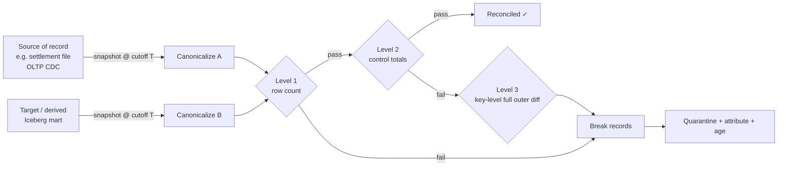

# Reconciliation

> Chapter from the **Data Engineering Playbook** — data-quality.

Reconciliation is the discipline of proving that two representations of the same facts agree within a defined tolerance — and producing an auditable breakdown of exactly which rows, keys, and amounts disagree when they don't. It is the difference between "the pipeline ran green" and "the ledger ties out."

## TL;DR

- **Reconciliation answers a question completeness and freshness can't: are the *values* correct end to end?** A pipeline can land 100% of rows, on time, and still be off by $4.2M because a currency conversion silently used stale FX rates.
- **Reconcile at three altitudes:** row-count parity (cheapest), aggregate/control-total parity (catches arithmetic drift), and key-level diff (most expensive, only run on a failing aggregate or a sample). Don't pay for a full key-level diff on every run.
- **Money reconciliation needs a tolerance model, not equality.** Floating-point, rounding rules, FX, and late-arriving corrections mean `sum(a) == sum(b)` is almost never literally true. Define absolute *and* relative tolerance, and reconcile on a **fixed cutoff watermark**, not "now".
- **The hard part is not the diff — it's the grain and the as-of semantics.** Most false breaks come from comparing two systems captured at different points in time or rolled up to different keys.
- **Breaks must be quarantined, attributed, and aged.** A reconciliation that only emits a pass/fail boolean is useless in an incident. You need the break records, a root-cause category, and a clock.
- **Reconciliation is a control, so it must itself be tested.** A recon job that silently joins zero rows reports "100% match." Guard against the no-op pass.

## Why this matters in production

Consider a payments platform. Events flow Kafka → Spark Structured Streaming → an Iceberg `transactions` table → a nightly batch that aggregates into a `daily_revenue` mart, which finance closes the books against. Four independent things can go wrong without any job failing:

1. A Kafka consumer rebalance during a deploy double-delivers a window of events; the streaming job's dedupe key is `transaction_id` but a retry assigned a new id, so revenue is overstated by the retried slice.
2. The FX enrichment service returns the previous day's rate for a 40-minute window during a cache miss; EUR transactions convert at a stale USD rate. Counts match. Amounts don't.
3. A late schema change widens `amount` from `decimal(18,2)` to `decimal(38,2)`; a downstream `CAST` truncates fractional cents on millions of rows. Each row is off by less than a penny; the aggregate is off by thousands.
4. A backfill reprocesses three days but the partition predicate is off-by-one, dropping one day. Row counts in the mart look plausible because another team's backfill added rows the same night.

None of these trip a row-count check or a freshness SLO. All of them are caught by an amount-level reconciliation between `transactions` and the upstream payment processor's settlement file, run against a fixed end-of-day cutoff. This is why finance, fraud, and regulatory pipelines treat reconciliation as a **release-blocking control**, not a dashboard. See also the sibling chapters on [accuracy](../accuracy/README.md) and [completeness](../completeness/README.md) — reconciliation is where those two intersect.

## How it works

Reconciliation is a controlled comparison between a **source of record** (system A, usually the authoritative upstream — a settlement file, an OLTP CDC stream, a ledger) and a **target** (system B, your derived store). The comparison happens at a chosen **grain** (the key set you group by) and a chosen **as-of point** (the watermark that defines "what counts").



**The three levels, formally.** Let `A` and `B` be the two datasets at grain `K` and cutoff `T`.

- **Level 1 — cardinality:** `|A| == |B|`. O(scan), no join. Catches gross drops/dupes.
- **Level 2 — control totals:** for each measure `m`, compare `Σ_A m` to `Σ_B m`. A pass requires:

  ```
  |Σ_A m − Σ_B m|  ≤  max( abs_tol,  rel_tol · |Σ_A m| )
  ```

  Use absolute tolerance to absorb rounding (e.g. `abs_tol = $0.01 · expected_row_count` for penny rounding) and relative tolerance to absorb FX/precision noise (e.g. `rel_tol = 1e-9`). Equality (`tol = 0`) is a trap on anything involving division, FX, or floats.
- **Level 3 — key-level diff:** a `FULL OUTER JOIN` on `K` partitions every key into four buckets:

  | Bucket | Condition | Meaning |
  |---|---|---|
  | Matched | key in both, measures within tol | OK |
  | Mismatched | key in both, measure delta > tol | value drift |
  | Missing in B | key in A only | dropped / not-yet-loaded |
  | Extra in B | key in B only | dupe / phantom / late |

Level 3 is the expensive one (a shuffle join over both sides). The control flow above only descends to Level 3 when Level 1 or 2 fails, or on a scheduled sampled audit. This is the single most important cost decision in a recon design.

**As-of semantics.** Both sides must be captured at the *same logical cutoff* `T`, not the same wall-clock time. With Iceberg this is clean: pin both reads to a snapshot or timestamp so the comparison is reproducible and re-runnable.

```sql
-- target side, pinned to a snapshot, not "live"
SELECT * FROM transactions
FOR SYSTEM_TIME AS OF TIMESTAMP '2026-06-17 00:00:00';
```

## Deep dive

This is where reconciliations actually fail. The diff algorithm is trivial; the semantics around it are not.

### 1. Grain mismatch is the #1 cause of false breaks

The two systems almost never agree on grain. The settlement file is one row per *settlement batch*; your `transactions` table is one row per *authorization*. A single batch covers many auths; refunds and partial captures fan out. If you `FULL OUTER JOIN` on `transaction_id` you will get a screen full of "missing in B" that are not breaks at all — they're a grain you failed to roll up.

**Fix:** explicitly define the reconciliation grain and project *both* sides to it before comparing. If A is at batch grain and B is at auth grain, roll B up to batch grain (or both to a coarser common key like `merchant_id × settlement_date × currency`). Write the grain into the recon config and assert it; never let it be implicit.

### 2. Tolerance must be typed, not a single global epsilon

A flat `rel_tol = 1e-6` is wrong for both ends of the spectrum. For a `$0.01` micro-transaction it's far too loose (a 1-cent break is 100% of value); for a `$50M` aggregate it's far too tight (sub-penny FP noise breaks it). Define tolerance per measure and let it be a function of magnitude:

- **Counts / integers:** `abs_tol = 0`. Exact.
- **Money:** `abs_tol = round_unit × expected_rows` for the rounding floor, plus `rel_tol` for FX. Reconcile in the *source currency* where possible and convert only for reporting — converting before reconciling bakes FX error into the comparison.
- **Ratios / rates:** relative only.

### 3. The no-op pass — the most dangerous failure mode

If the join key is wrong, or a partition predicate eliminates all rows, or someone reconciles a table against itself, the job reports a perfect match over zero compared rows. This has caused more undetected production incidents than any actual mismatch, because it inverts the alarm: the control is green precisely when it's broken.

**Fix:** assert a non-trivial minimum on `matched + mismatched` rows, and assert `coverage = matched_keys / max(|A|,|B|)` is above a floor (e.g. `> 0.95`). A recon that compared 12 rows when both sides have 40M is a *failed* recon, not a passing one.

### 4. Late-arriving data and the moving cutoff

If you reconcile against "now", A and B drift constantly as events land. The discipline is to reconcile a *closed window*: pick cutoff `T`, freeze both sides at `T`, and accept that anything after `T` belongs to the next window. Late records that arrive *for* a closed window become **timing breaks** — real, but categorized separately from value breaks, and aged: a timing break that's still open after the SLA (say 48h) escalates to a value break.

### 5. Break attribution beats break detection

Detecting that you're $4.2M off is 10% of the value. The other 90% is *which* dimension carries the delta. A principal-grade recon does not stop at a total — it produces the delta decomposed by the natural dimensions (currency, merchant, processor, event-hour) so the on-call engineer opens the run and immediately sees "98% of the break is in EUR between 14:00–14:40," which points straight at the stale-FX window from the scenario above. The diff is cheap to pivot; do it.

### 6. Float vs decimal

Never reconcile money as `double`. `0.1 + 0.2 != 0.3` and Spark's `sum()` over `double` accumulates order-dependent error that differs between the two engines you're comparing. Cast both sides to `decimal(38, 4)` (or the domain's native scale) *before* aggregating, and compare decimals. This single rule eliminates a whole class of phantom breaks.

## Worked example

End-of-day amount reconciliation between an upstream settlement extract (`settlement_raw`) and the derived Iceberg `transactions` table, in PySpark. Run against a fixed cutoff, three levels, with typed tolerance and a no-op guard.

```python
from pyspark.sql import functions as F, DataFrame

CUTOFF = "2026-06-17 00:00:00"
GRAIN = ["merchant_id", "settlement_date", "currency"]
MEASURE = "amount"
ABS_TOL = 0.01      # one cent rounding floor per grain group
REL_TOL = 1e-9      # FP/FX noise
COVERAGE_FLOOR = 0.95

# --- canonicalize both sides to the SAME grain, decimal money, pinned cutoff ---
def canon(df: DataFrame) -> DataFrame:
    return (
        df.withColumn(MEASURE, F.col(MEASURE).cast("decimal(38,4)"))
          .groupBy(*GRAIN)
          .agg(F.sum(MEASURE).alias("amt"), F.count("*").alias("cnt"))
    )

src = canon(spark.read.format("iceberg").load("settlement_raw")
            .where(F.col("settlement_ts") < F.lit(CUTOFF)))
# pin target to a snapshot so the run is reproducible
tgt = canon(spark.read.option("as-of-timestamp",
            "2026-06-17 00:00:00").format("iceberg").load("db.transactions"))

# --- Level 1: cardinality ---
src_keys, tgt_keys = src.count(), tgt.count()

# --- Level 3 diff (also yields Level 2 by aggregation) ---
diff = (src.alias("a").join(tgt.alias("b"), GRAIN, "full_outer")
        .select(
            *GRAIN,
            F.coalesce("a.amt", F.lit(0)).alias("amt_a"),
            F.coalesce("b.amt", F.lit(0)).alias("amt_b"),
            F.col("a.amt").isNull().alias("missing_in_b"),
            F.col("b.amt").isNull().alias("extra_in_b"))
        .withColumn("delta", F.col("amt_a") - F.col("amt_b"))
        .withColumn("tol", F.greatest(F.lit(ABS_TOL),
                                      F.abs("amt_a") * F.lit(REL_TOL)))
        .withColumn("is_break",
                    (F.abs("delta") > F.col("tol")) |
                    F.col("missing_in_b") | F.col("extra_in_b")))

matched   = diff.where(~F.col("is_break")).count()
mismatched = diff.where(F.col("is_break") & ~F.col("missing_in_b") & ~F.col("extra_in_b")).count()
breaks     = diff.where(F.col("is_break"))

# --- NO-OP GUARD: a recon that compared nothing is a FAILURE, not a pass ---
coverage = matched / max(src_keys, tgt_keys, 1)
assert (matched + mismatched) > 0,        "no-op recon: zero comparable groups"
assert coverage >= COVERAGE_FLOOR,        f"coverage {coverage:.3f} below floor"

# --- attribution: where is the money? ---
(breaks.groupBy("currency")
       .agg(F.sum("delta").alias("currency_delta"))
       .orderBy(F.abs("currency_delta").desc())
       .show())

# --- persist break records for quarantine + aging (do NOT just log a bool) ---
(breaks.withColumn("run_cutoff", F.lit(CUTOFF))
       .withColumn("detected_at", F.current_timestamp())
       .withColumn("category",
            F.when(F.col("missing_in_b"), "MISSING")
             .when(F.col("extra_in_b"),  "EXTRA")
             .otherwise("VALUE_DRIFT"))
       .write.format("iceberg").mode("append").save("db.recon_breaks"))
```

The control-total status (Level 2) falls straight out: `total_delta = breaks.agg(F.sum("delta"))`, pass if within the rolled-up tolerance. The job is **idempotent and re-runnable** because both reads are pinned to `CUTOFF` — re-running it tomorrow against the same cutoff produces the same breaks.

## Production patterns

- **Tiered execution by cost.** Run Level 1 + Level 2 on every batch (cheap, no shuffle). Descend to Level 3 only on a Level-2 failure or on a scheduled sampled audit (e.g. 5% of keys hashed by `crc32(key) % 20 == 0`). A nightly full Level-3 over a billion-row settlement set should be the exception, gated behind a flag, not the default.
- **Reconcile in source currency / source units.** Convert for reporting *after* reconciling. Folding FX in before the diff makes every FX hiccup look like a data bug.
- **Break table is a first-class dataset.** Persist `db.recon_breaks` with `(run_cutoff, grain..., delta, category, detected_at, resolved_at, root_cause)`. Age open breaks; a `MISSING` break older than the late-arrival SLA auto-promotes from "timing" to "value." This table is what you query during an incident, not the logs.
- **Reconcile at the boundary you can be held to.** If finance closes books off `daily_revenue`, reconcile `daily_revenue` against the processor, not the bronze table. Reconciling the wrong layer gives false confidence about the layer that actually matters.
- **Two-sided freshness gate.** Before running, assert *both* sides are complete as of `T` (the settlement file fully landed; the target's [freshness](../freshness/README.md) watermark ≥ `T`). Reconciling against a half-loaded side manufactures breaks that resolve themselves an hour later and train people to ignore the alarm.
- **Tolerances and grain live in versioned config**, reviewed like code. A loosened tolerance is a risk decision and should show up in a diff with an owner.

## Anti-patterns & failure modes

| Anti-pattern | Symptom you'd observe | Fix |
|---|---|---|
| Equality comparison on money (`sum_a == sum_b`) | Constant flapping breaks of fractions of a cent; team mutes the alert | Typed tolerance: `abs_tol` (rounding) + `rel_tol` (FP/FX); cast to `decimal` before summing |
| No-op pass (wrong key / empty predicate / self-join) | Recon green over ~0 compared rows; real incident slips through | Assert `matched+mismatched > 0` and `coverage ≥ floor` |
| Reconciling against "now" | Breaks that vanish on re-run; flaky CI | Freeze both sides at a fixed cutoff `T`; pin Iceberg snapshot |
| Grain mismatch (auth vs batch) | Thousands of "missing in B" that are real rows | Project both sides to an explicit common grain before diff |
| Boolean-only output | "It broke" with no idea where; long MTTR in incidents | Decompose delta by dimension; persist break records |
| Reconciling `double` money across two engines | Tiny non-reproducible deltas that differ each run | `decimal(38,4)` on both sides pre-aggregation |
| FX folded in before the diff | Every FX cache miss looks like a pipeline bug | Reconcile in source currency, convert after |
| Tolerance widened in an incident, never revisited | Breaks stop firing; real drift now invisible | Tolerance in versioned config with owner + expiry |

## Decision guidance

| Situation | Approach |
|---|---|
| Internal analytics, no money, drift tolerable | Level 1 (counts) + scheduled sampled Level 2; skip full key diff |
| Financial / ledger / regulatory | All three levels, control totals release-blocking, persisted break table, source-currency tolerance |
| Two streaming systems, sub-second | Don't reconcile live — reconcile closed windows (e.g. hourly tumbling) against a fixed cutoff |
| Billion-row source, cost-sensitive | Tiered: L1+L2 always, L3 sampled by key hash; full L3 only on L2 failure |
| Source has no stable key | Reconcile aggregates only (Level 2); key-level diff is meaningless without a grain |
| Migration / table rebuild parity | Full Level-3 diff is justified one-time; this is the [accuracy](../accuracy/README.md) use case |

Reconciliation vs alternatives: a **schema/contract test** catches structure, not values. A **freshness check** catches lateness, not correctness. **Great Expectations / dbt tests** catch single-table invariants (nulls, ranges) but not cross-system agreement. Reconciliation is the only control that asserts *two systems agree on the facts* — reach for it precisely when "both sides exist and look fine individually" is not enough.

## Interview & architecture-review talking points

- "I reconcile at three altitudes and only pay for the expensive key-level diff when an aggregate fails or on a sampled audit — full key diffs on every run are how recon costs balloon past the pipeline they protect."
- "Tolerance is typed per measure, not a global epsilon. Counts are exact; money carries an absolute rounding floor plus a relative FX/FP allowance; I reconcile in source currency and convert afterward."
- "My biggest source of false breaks is grain and as-of mismatch, not bad data. I pin both sides to a fixed Iceberg snapshot and project to an explicit common grain, so a re-run is byte-stable."
- "The control guards itself: I assert non-trivial coverage so a wrong join key or empty predicate fails the run instead of silently passing over zero rows. The no-op pass is the failure mode that actually burns you."
- "Detection is 10%; attribution is 90%. The job emits the delta decomposed by dimension and persists break records with a category and a clock, so on-call sees 'the break is EUR, 14:00–14:40' instead of just a red light."
- "I reconcile at the layer the business is held to — if finance closes off `daily_revenue`, that's what ties to the processor, not bronze."

## Further reading

- Sibling chapters: [accuracy](../accuracy/README.md) · [completeness](../completeness/README.md) · [freshness](../freshness/README.md)
- Related: [lakehouse/iceberg](../../lakehouse/iceberg/README.md) (snapshot/time-travel reads for pinned cutoffs), [kafka/exactly-once](../../kafka/exactly-once/README.md) (the dedupe semantics that prevent count breaks upstream), [observability/monitoring](../../observability/monitoring/README.md) (alerting on the break table)
- Repo skill: this playbook's companion `table-parity-check` automates the Level-3 column diff with a match-% report — the reusable form of the worked example above.
- External: Apache Iceberg [time-travel & snapshot reads](https://iceberg.apache.org/docs/latest/spark-queries/#time-travel); Kleppmann, *Designing Data-Intensive Applications*, ch. 11 (stream/batch reprocessing and the "deriving and reconciling state" pattern).
