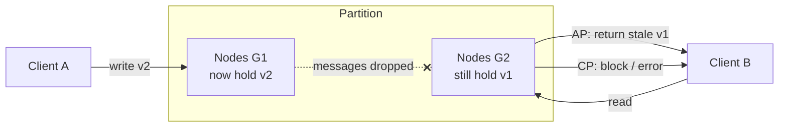

# CAP Theorem (and what it actually constrains)

> Chapter from the **Data Engineering Playbook** — distributed-systems.

## About This Chapter

**What this is.** The CAP theorem describes what a distributed system must give up — linearizable consistency (C) or total availability (A) — when the network partitions. This chapter covers what CAP actually constrains, why PACELC is the model that matters in the common no-partition case, and how to make the CP/AP choice per operation.

**Who it's for.** Data engineers, platform/architecture leads, and engineers preparing for senior/staff data-engineering interviews.

**What you'll take away.** By the end you'll be able to:
- Separate the three meanings of "consistency" (CAP's linearizability, ACID's C, and consistency models) and reason with PACELC instead of "pick two."
- Tune the CP/AP regime per read and per write using quorum math (`W+R>N`) and levers like Cassandra `CL`, DynamoDB consistent reads, and Kafka `unclean.leader.election`.
- Label CAP at the access-path level, defaulting systems of record to CP and derived/cache layers to AP.

---

## TL;DR

- CAP is a statement about **one specific failure mode**: when the network partitions, a distributed system must give up either **linearizable consistency (C)** or **total availability (A)**. It says nothing about the no-partition case, and "pick two" is a misleading slogan.
- Partitions are not optional. You don't *choose* P — the physics of TCP timeouts, GC pauses, and cross-AZ links chooses it for you. The real decision is **CP vs AP**, made per operation, not per database.
- The honest model is **PACELC**: *if Partition then (A or C), Else (Latency or Consistency)*. The "else" branch — the latency/consistency tradeoff you pay 100% of the time when the network is healthy — matters far more to your p99 than the partition branch you hit twice a year.
- "Consistency" in CAP means **linearizability**, the strongest single-object guarantee. It is *not* the "C" in ACID. Conflating them is the single most common interview and design-review error.
- Modern systems are **tunable**: Cassandra/DynamoDB/Cosmos let you slide along the CP↔AP axis per read and per write (quorum knobs `R`, `W`, `N`). The theorem becomes a runtime parameter, not a vendor property.
- In a data platform you almost always have **multiple CAP regimes in one pipeline**: a CP metadata catalog, an AP serving cache, a CP transaction log (Iceberg/Kafka). Pick deliberately at each boundary.

## Why this matters in production

Here is the scenario that turns CAP from a whiteboard puzzle into a 2am page.

You run a fraud-decisioning service. A Kafka consumer enriches each transaction against a user-risk-profile store, then writes a decision. The risk store is a 6-node Cassandra cluster spanning `us-east-1a/1b/1c`. Marketing is happy: write latency p50 is 3ms because you configured `CL=ONE`. Then a top-of-rack switch in `1a` flaps for 90 seconds. The nodes are all alive, but two of them can't see the other four.

What happens next depends entirely on a choice you made months ago in a config file:

- If you write with `CL=ONE` and read with `CL=ONE` (**AP**), both sides of the partition keep serving. A user's risk score gets updated on the minority side; the majority side keeps the stale score and **approves a transaction that should have been blocked**. No error, no alert — just silent divergence and a chargeback three days later.
- If you write with `CL=QUORUM` and read with `CL=QUORUM` (**CP**), the minority side returns `UnavailableException` for that partition key. Your fraud service throws, your consumer lag spikes, PagerDuty fires — but **no incorrect decision is ever made**.

Neither is "wrong." For a fraud decision you want CP and you accept the unavailability. For a "last seen" timestamp on a profile page you want AP and you accept the staleness. The principal-level skill is knowing that *these are different operations on the same cluster* and configuring them independently — not picking a database because its marketing page says "highly available."

CAP matters because under partition there is **no correct default**. The system will do *something*, and if you didn't decide what, you've decided by accident.

## How it works

The formal result (Gilbert & Lynch, 2002, which proved Brewer's 2000 conjecture) is precise:

> In an asynchronous network, it is impossible to implement a read/write register that is both **available** (every request to a non-failing node returns a non-error response) and **linearizable** (reads observe the most recent completed write) when **partitions** (arbitrary message loss between nodes) are possible.

The proof is a one-paragraph contradiction. Partition the nodes into groups `G1` and `G2` with all messages dropped between them. A client writes `v2` to `G1`. A later client reads from `G2`. If the system is available, `G2` must respond without hearing from `G1`, so it returns the old `v1` — violating linearizability. If it wants linearizability, `G2` must block until it hears from `G1` — violating availability. There is no third option while messages are lost.



### The decision tree that actually matters: PACELC

Daniel Abadi's PACELC (2012) extends CAP to cover normal operation:

```
if (Partition):
    choose Availability  OR  Consistency
Else (no partition):
    choose Latency       OR  Consistency
```

This is the model to internalize. Partitions are rare (you might see one a quarter). The **Else** branch is paid on every single request. A system that picks `C` in the else-branch (e.g. Spanner doing a synchronous Paxos round + TrueTime commit-wait) buys you global linearizability at the cost of a ~5–10ms write latency floor. A system that picks `L` (DynamoDB eventual reads, Cassandra `CL=ONE`) gives single-digit-ms p99 but lets you read stale.

| System | Partition (P→) | Else (E→) | One-line characterization |
|---|---|---|---|
| Google Spanner | C (PC) | C (EC) | Strong everywhere; pays TrueTime commit-wait latency |
| DynamoDB (strong reads) | C | C | Quorum reads in-region; cross-region replication is async (EL) |
| DynamoDB (eventual reads) | A | L | Default reads can be stale, sub-ms |
| Cassandra | A or C (tunable) | L or C (tunable) | You choose per-query via `CL` and `R`/`W`/`N` |
| MongoDB (`w:majority`) | C | C | Primary-based; minority partition can't elect, goes read-only |
| Kafka (`acks=all`, ISR) | C | C | Partition leader + ISR; unavailable rather than lose committed offset |
| Redis (single primary + Sentinel) | C-ish | L | Failover window can lose acked writes (`A` leans toward L) |

### Quorum math

For a replicated register with `N` replicas, write quorum `W`, read quorum `R`:

```
Strong (linearizable-ish) consistency  ⇔  W + R > N   AND   W > N/2
```

`W + R > N` guarantees the read set and write set overlap by at least one replica, so a read sees the latest write. `W > N/2` prevents two concurrent writes from both succeeding on disjoint majorities (split-brain). Examples for `N=3`:

| Config | W+R>N? | Behavior |
|---|---|---|
| `W=1, R=1` | 2 > 3 ✗ | Pure AP. Fast, can read stale. |
| `W=3, R=1` | 4 > 3 ✓ | Strong reads, but any one replica down blocks writes. |
| `W=2, R=2` (QUORUM) | 4 > 3 ✓ | Strong + survives one node down. The sweet spot. |
| `W=2, R=1` | 3 > 3 ✗ | Fast reads, *can* miss latest write. |

Note: even `W=2,R=2` in Cassandra is not truly linearizable because of last-write-wins timestamp resolution and lack of read isolation — for true linearizability you need `LWT`/Paxos (`SERIAL` consistency). This is a place engineers get burned (see Deep dive).

## Deep dive

### "Consistency" is overloaded three ways — keep them apart

| Term | Where it lives | What it means |
|---|---|---|
| **C in CAP** | distributed systems | Linearizability: every read sees the latest completed write, single global order. |
| **C in ACID** | databases / transactions | The DB moves from one valid state to another, respecting constraints/invariants. Nothing about replication. |
| **Consistency *model*** | memory/replication | A spectrum: linearizable → sequential → causal → read-your-writes → eventual. |

When someone says "we need a consistent store," your first question is *which one*. See [consistency-models](../consistency-models/README.md) for the full lattice. CAP's C sits at the very top of that lattice; almost every production "consistent" system is actually offering something weaker (often causal+ or read-your-writes) and calling it consistent.

### You do not get to opt out of P

The most common misconception: "We're in one AWS region with low-latency links, so we're CA — we don't have partitions." False, for two reasons:

1. **A slow node is indistinguishable from a partitioned node.** A 12-second JVM stop-the-world GC pause, an `fsync` stall on an EBS volume, or a thread-pool exhaustion looks *exactly* like a partition to its peers. Asynchronous networks can't tell "dead" from "slow." Your CAP tradeoff fires on every long GC, not just on switch failures.
2. **"CA" is not a stable category.** A system advertised as CA (e.g. a single-primary RDBMS with synchronous standby) is really a CP system that becomes *unavailable* when the primary partitions from the standby. It didn't escape CAP; it chose C and pays with downtime during failover.

The honest framing: every real distributed system is either CP or AP. "CA" describes a single-node system, or a system that hasn't met its first partition yet.

### Tunability is per-operation, and the granularity is finer than you think

DynamoDB is the cleanest example: the *same table* serves `ConsistentRead=false` (AP, eventual, half the RCU cost) and `ConsistentRead=true` (CP-in-region, full RCU) depending on a boolean in the request. Global tables add a second axis — cross-region replication is **always** async (last-writer-wins on a region-stamped timestamp), so a global table is AP *across* regions even when each region is CP *within* itself.

This means a single logical entity can be simultaneously CP and AP depending on which client and which region touches it. Drawing one "CAP label" on the database in your architecture diagram is therefore wrong — label the **edges** (the read/write paths), not the nodes.

### The thing that bites people: tunable ≠ transactional

`CL=QUORUM` on both sides gives you *staleness-free reads* but **not** isolation. Two clients doing read-modify-write (`balance = balance - 10`) at `QUORUM` will both read the same value, both subtract, and one update is lost — a classic lost update, even though every individual read and write was "consistent." Quorum overlap solves *recency*, not *atomicity of a compound operation*. For that you need compare-and-set: Cassandra `LWT` (`IF` clause, Paxos under the hood, ~4× latency), DynamoDB conditional writes, or a proper transaction. People conflate "quorum reads" with "safe counters" constantly.

### Partition detection is the hidden hard part

CAP says you trade C for A *during* a partition, but a node doesn't get a "partition started" interrupt. It infers a partition from missed heartbeats and timeouts. This creates two failure surfaces:

- **Timeout too aggressive** → you declare partitions that aren't real (a GC blip), needlessly demoting to read-only or fencing a healthy primary. Availability suffers without any actual network fault.
- **Timeout too lax** → during a real partition you keep both sides live too long, widening the divergence window in AP mode, or extending unavailability in CP mode.

This is why fencing (epoch numbers, leader leases, `STONITH`) lives next to CAP in practice. A primary that *thinks* it's still primary after being partitioned out is the source of split-brain double-writes. The fix is a monotonic fencing token checked by the storage layer — see [consensus](../consensus/README.md) for how Raft/Paxos terms provide exactly this.

## Worked example

A risk-profile store on Cassandra, configured for two different operations on the same keyspace. This is the concrete artifact behind the fraud scenario above.

```sql
-- N = replication factor 3, spread across 3 AZs
CREATE KEYSPACE risk WITH replication = {
  'class': 'NetworkTopologyStrategy', 'us_east_1': 3
};

CREATE TABLE risk.user_profile (
  user_id      uuid PRIMARY KEY,
  risk_score   int,
  last_seen_ts timestamp,
  version      int
);
```

```python
from cassandra.cluster import Cluster
from cassandra import ConsistencyLevel
from cassandra.query import SimpleStatement

session = Cluster(["10.0.1.10"]).connect("risk")

# --- AP path: "last seen" display. Stale is fine, never block. ---
def update_last_seen(user_id, ts):
    stmt = SimpleStatement(
        "UPDATE user_profile SET last_seen_ts=%s WHERE user_id=%s",
        consistency_level=ConsistencyLevel.ONE,        # W=1  -> AP, ~3ms
    )
    session.execute(stmt, (ts, user_id))

# --- CP path: fraud decision. Must read the latest score or fail loudly. ---
def read_risk_for_decision(user_id):
    stmt = SimpleStatement(
        "SELECT risk_score FROM user_profile WHERE user_id=%s",
        consistency_level=ConsistencyLevel.QUORUM,     # R=2, paired with W=2 writes
    )
    # During a partition the minority replicas raise Unavailable -> we WANT this.
    return session.execute(stmt, (user_id,)).one().risk_score

# --- Compound mutation that MUST be atomic: use LWT (Paxos), not QUORUM ---
def bump_score_safely(user_id, expected_version, new_score):
    stmt = SimpleStatement(
        """UPDATE user_profile SET risk_score=%s, version=%s
           WHERE user_id=%s IF version=%s""",       # compare-and-set
        serial_consistency_level=ConsistencyLevel.SERIAL,  # linearizable CAS
    )
    applied = session.execute(stmt,
        (new_score, expected_version + 1, user_id, expected_version)).one()
    if not applied[0]:           # [applied]=False -> someone raced us
        raise ConcurrentModification(f"version moved under us for {user_id}")
```

The Kafka side of the same pipeline must also make a CAP choice. To never lose a committed offset under partition (CP), the producer and topic are configured:

```properties
# Producer: ack only after the full in-sync replica set persists
acks=all
enable.idempotence=true
max.in.flight.requests.per.connection=5

# Broker / topic: a write needs >= 2 ISR members, else REJECT (unavailable, not lossy)
min.insync.replicas=2
default.replication.factor=3
unclean.leader.election.enable=false     # CRITICAL: never elect an out-of-sync replica
```

`unclean.leader.election.enable=false` is the Kafka CAP lever. Set it `true` and a partition becomes AP — Kafka will promote a lagging replica to leader to stay available, **silently dropping** any committed records that replica hadn't received. Set it `false` (the safe default since 0.11) and the partition stays leaderless and unavailable until an in-sync replica returns: CP. For an exactly-once financial event stream you want `false` and you accept the unavailability. See [event-driven-systems](../event-driven-systems/README.md) for the full delivery-semantics treatment.

## Production patterns

- **Label the edges, not the boxes.** In your architecture diagram, annotate each read/write path with its regime: `[CP, W=QUORUM]`, `[AP, eventual]`. A datastore is not "a CP system"; a specific access path is.
- **Pick CP for systems of record, AP for derived/cache.** Iceberg metadata, Kafka committed offsets, the billing ledger → CP (correctness over uptime). Serving caches, search indexes, recommendation features, "last seen" → AP (uptime over recency). The catalog (a [metadata-copilot](../../../metadata-copilot/README.md)-style service) must be CP or your readers see tables that don't exist yet.
- **Co-locate the quorum with the failure domain.** A 3-replica quorum split `2/1` across two AZs means losing the AZ with two replicas kills your write quorum. Spread `N=3` over **three** AZs so any single-AZ loss still leaves a `2`-node majority. For multi-region strong consistency you need an odd number of regions (3 or 5) or you can't form a majority after losing one.
- **Make staleness bounded and observable.** If a path is AP, publish its staleness budget as an SLO (e.g. "feature store reads are eventually consistent within 5s p99") and emit a `replication_lag_seconds` metric. Unbounded, unmeasured staleness is how AP turns into silent corruption.
- **Use idempotent writes + CAS for AP paths that must converge.** If you chose AP for throughput, make every write idempotent (keyed upsert, version column, or CRDT) so the post-partition merge is deterministic rather than last-write-wins-by-clock-skew.
- **Tighten failover/heartbeat timeouts against your real GC and EBS p99**, not defaults. Profile your stop-the-world pauses; set the partition-detection timeout above your p999 pause so a GC doesn't trigger a spurious failover.

## Anti-patterns & failure modes

| Anti-pattern | Symptom you observe | Fix |
|---|---|---|
| "We're single-region so we're CA." | First long GC pause or AZ blip causes split-brain double-writes; two `primary` nodes in logs. | Accept you're CP or AP; add fencing tokens / leader leases. Never claim CA. |
| Treating `CL=QUORUM` as transactional. | Lost updates on counters/balances despite "consistent" reads. Money doesn't reconcile. | Use LWT / `SERIAL` (Paxos) or conditional writes for read-modify-write. Quorum gives recency, not isolation. |
| `unclean.leader.election.enable=true` on a system-of-record topic. | After a broker partition, consumers see *gaps* in committed offsets; downstream totals are short. | Set it `false`; `min.insync.replicas=2`. Prefer unavailable over lossy. |
| `2/1` quorum split across two AZs. | Losing the "heavy" AZ takes the whole cluster read-only even though half the nodes are up. | RF=3 across three AZs; majority survives any single-AZ loss. |
| Same CAP regime for everything. | Either the cache is needlessly down during partitions (over-CP), or the ledger silently diverges (over-AP). | Decide per operation; CP the system-of-record, AP the derived views. |
| Last-write-wins with wall-clock timestamps under AP. | Concurrent updates across a partition silently drop the "loser"; clock skew makes it nondeterministic which. | Use logical clocks/version vectors or CRDTs; never resolve correctness by `System.currentTimeMillis()`. |
| Partition-detection timeout = defaults. | Spurious failovers during normal GC; flapping leadership; availability dips with no network fault. | Set timeouts above measured p999 pause; monitor false-failover rate. |

## Decision guidance

| Question | Choose **CP** | Choose **AP** |
|---|---|---|
| Is an incorrect/stale answer worse than no answer? | Yes (ledger, fraud, inventory, auth) | No (feed, cache, search, "last seen") |
| Can the caller retry / degrade gracefully? | Doesn't need to — it errors clearly | Must keep serving during partition |
| Is the data a system of record? | Yes | No (it's derived/replayable) |
| Compound read-modify-write? | CP + CAS/transaction | Avoid; or use a CRDT |
| Latency budget (Else branch) | Can absorb a consensus round (5–10ms+) | Needs single-digit ms, accepts staleness |

Rule of thumb: **default to CP for anything you can't recompute, AP for anything you can.** If a value is derivable from a CP source (a cache, an index, a materialized view), make the derived layer AP and the source CP — you get availability *and* a path back to truth.

When **neither** is acceptable for a given operation, that's the signal to redesign the operation (split it, make it idempotent, move the invariant to a single shard) rather than to expect CAP to give you a free lunch. CAP is a constraint, not a config bug.

## Interview & architecture-review talking points

- "CAP is about the partition case only. The slogan 'pick two' is wrong — you never give up P, you choose between C and A *when a partition happens*. The more useful question is PACELC: what do I trade in the **common** case with no partition? That's where my latency budget lives."
- "When I say a store is consistent, I mean linearizable — the CAP C, not the ACID C. They're unrelated. A system can be fully ACID and still eventually consistent across replicas."
- "I label CAP at the access-path level. The same Cassandra table is CP for the fraud read at QUORUM and AP for the last-seen write at ONE. The database doesn't have a CAP property; the operation does."
- "I default to CP for systems of record and AP for derived data, because derived data has a recovery path: I can recompute it from the CP source. That gets me availability on the serving tier without risking the ledger."
- "Quorum (`W+R>N`) buys recency, not isolation. For read-modify-write I use compare-and-set or a transaction, because two QUORUM clients can still lose an update."
- "I size quorums against failure domains: RF=3 across three AZs so a majority survives any single-AZ loss, and I set `unclean.leader.election=false` on Kafka so a partition makes us unavailable rather than lossy. For this workload, dropping a committed event is unacceptable; a 90-second outage is."
- The strong follow-up a principal volunteers: "The trap is partition *detection* — a long GC looks identical to a network split, so my failover timeouts are tuned above measured p999 pause time, and I track the spurious-failover rate as an SLI."

## Further reading

- [consensus](../consensus/README.md) — how Raft/Paxos provide the leader leases and fencing tokens that make CP choices safe under partition.
- [consistency-models](../consistency-models/README.md) — the full lattice from linearizable down to eventual; where CAP's "C" actually sits.
- [event-driven-systems](../event-driven-systems/README.md) — Kafka delivery semantics and how `acks`/ISR/`min.insync.replicas` encode the same CP/AP choice for log-structured systems.
- Gilbert & Lynch, *"Brewer's Conjecture and the Feasibility of Consistent, Available, Partition-Tolerant Web Services"* (ACM SIGACT News, 2002) — the formal proof.
- Daniel Abadi, *"Consistency Tradeoffs in Modern Distributed Database System Design"* (IEEE Computer, 2012) — the PACELC paper. Also see Martin Kleppmann, *Designing Data-Intensive Applications*, Ch. 9 ("Consistency and Consensus") for the practitioner's treatment.
