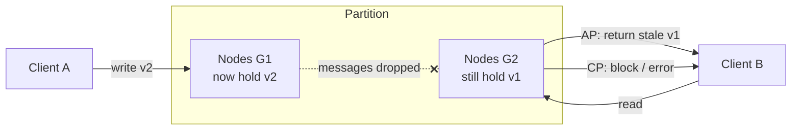

# CAP Theorem (and what it actually constrains)

> Chapter from the **Data Engineering Playbook** — distributed-systems.

## About This Chapter

**What this is.** A plain-language explanation of the CAP theorem — what it actually means, where most engineers get it wrong, and how to use it to make real decisions in a data platform. Covers the CP vs AP choice, why "pick two" is a misleading slogan, and how to configure specific systems (Cassandra, DynamoDB, Kafka) to get the behavior you actually want.

**Who it's for.** Data engineers, platform leads, and engineers preparing for senior/staff interviews. If you've heard "CAP theorem" but aren't confident explaining it, this chapter is for you.

**What you'll take away.** By the end you'll be able to:
- Explain what CAP actually says — and why the common "pick two" shorthand is wrong.
- Understand the CP vs AP choice and make it deliberately for each operation in your system, not for the database as a whole.
- Configure Cassandra, DynamoDB, and Kafka to be CP or AP per operation using the right knobs.

---

## TL;DR

- CAP is a statement about **one specific failure mode**: when two nodes can no longer talk to each other (a network partition), a distributed system must choose — do you keep serving possibly-stale data (**AP**), or do you refuse to serve until you're sure the data is correct (**CP**)? "Pick two" is a misleading slogan — you always have to deal with partitions.
- You don't choose whether partitions happen. A slow JVM garbage collection pause, a flaky cross-AZ link, or a thread-pool backlog all look identical to a partition from the outside. The real decision is **CP vs AP** — and you make it per operation, not per database.
- The more useful model is **PACELC**: *when there IS a partition, choose availability or consistency. When there is NO partition (which is most of the time), choose latency or consistency.* The second half — the everyday latency/consistency tradeoff — affects every single request you make, not just the rare partition event.
- "Consistency" in CAP means **"every read sees the most recent write"** — nothing more. It is NOT the same as the "C" in ACID transactions. Mixing these two up is the most common mistake in interviews and architecture reviews.
- Modern databases are **tunable**: Cassandra, DynamoDB, and Cosmos DB let you choose CP or AP per individual read and write using replication knobs (`W`, `R`, `N`). The same table can be CP for a fraud check and AP for a "last seen" timestamp.
- In a data platform you almost always have **multiple CAP choices in one pipeline**: a CP metadata catalog, an AP serving cache, a CP transaction log (Iceberg/Kafka). Make each choice deliberately — the default is rarely right for every operation.

## Why this matters in production

Here is the scenario that turns CAP from a whiteboard puzzle into a 2am page.

You run a fraud-decisioning service. A Kafka consumer enriches each transaction against a user-risk-profile store, then writes a decision. The risk store is a 6-node Cassandra cluster spanning `us-east-1a/1b/1c`. Marketing is happy: write latency p50 is 3ms because you configured `CL=ONE`. Then a top-of-rack switch in `1a` flaps for 90 seconds. The nodes are all alive, but two of them can't see the other four.

What happens next depends entirely on a choice you made months ago in a config file:

- If you write with `CL=ONE` and read with `CL=ONE` (**AP**), both sides of the partition keep serving. A user's risk score gets updated on the minority side; the majority side keeps the stale score and **approves a transaction that should have been blocked**. No error, no alert — just silent divergence and a chargeback three days later.
- If you write with `CL=QUORUM` and read with `CL=QUORUM` (**CP**), the minority side returns `UnavailableException` for that partition key. Your fraud service throws, your consumer lag spikes, PagerDuty fires — but **no incorrect decision is ever made**.

Neither is "wrong." For a fraud decision you want CP and you accept the unavailability. For a "last seen" timestamp on a profile page you want AP and you accept the staleness. The principal-level skill is knowing that *these are different operations on the same cluster* and configuring them independently — not picking a database because its marketing page says "highly available."

CAP matters because under partition there is **no correct default**. The system will do *something*, and if you didn't decide what, you've decided by accident.

## How it works

The theorem (proven in 2002) says this:

> When a network partition happens, a distributed system cannot simultaneously guarantee that every read returns the most recent write **and** that every request gets a response. You must choose one to sacrifice.

The intuition is simple. Split your nodes into two groups — `G1` and `G2` — with all messages dropped between them. A client writes a new value to `G1`. Another client then reads from `G2`. Two options:

- **Choose availability (AP):** `G2` responds immediately with the old stale value — it can't wait for `G1`. Your system stays up but the data is wrong.
- **Choose consistency (CP):** `G2` refuses to answer until it can confirm with `G1`. Your system returns an error or blocks — but it never serves wrong data.

There is no third option while messages are lost.



### The model that matters more day-to-day: PACELC

CAP only talks about what happens during a partition. But partitions are rare — maybe a few times a year. PACELC fills in what happens the rest of the time:

```
if (Partition):
    choose Availability  OR  Consistency
Else (no partition, which is most of the time):
    choose Latency       OR  Consistency
```

The "Else" branch is the one that hits every single request you make. A database that guarantees you'll always read the most recent write (Google Spanner) has to do an extra coordination round before each write — adding ~5–10ms to every write. A database that trades that guarantee for speed (DynamoDB eventual reads, Cassandra `CL=ONE`) gives you single-digit-ms latency but may occasionally return data that's a few seconds old.

For most data engineering workloads, **the everyday latency/consistency tradeoff matters more than the rare partition tradeoff.**

| System | Partition (P→) | Else (E→) | One-line characterization |
|---|---|---|---|
| Google Spanner | C (PC) | C (EC) | Strong everywhere; pays TrueTime commit-wait latency |
| DynamoDB (strong reads) | C | C | Quorum reads in-region; cross-region replication is async (EL) |
| DynamoDB (eventual reads) | A | L | Default reads can be stale, sub-ms |
| Cassandra | A or C (tunable) | L or C (tunable) | You choose per-query via `CL` and `R`/`W`/`N` |
| MongoDB (`w:majority`) | C | C | Primary-based; minority partition can't elect, goes read-only |
| Kafka (`acks=all`, ISR) | C | C | Partition leader + ISR; unavailable rather than lose committed offset |
| Redis (single primary + Sentinel) | C-ish | L | Failover window can lose acked writes (`A` leans toward L) |

### Quorum math — how CP vs AP maps to actual config

When a database replicates data across `N` nodes, you control how many nodes must confirm a write (`W`) and how many must respond to a read (`R`). The rule for "strong" reads (you always see the latest write):

```
W + R > N   AND   W > N/2
```

In plain terms: if the number of nodes that confirmed the write plus the number of nodes you read from is greater than the total, then at least one node in your read set must have seen the latest write. With 3 replicas (`N=3`):

| Config | Consistent? | Behavior |
|---|---|---|
| `W=1, R=1` | No | Pure AP. Fast, can read stale. |
| `W=3, R=1` | Yes | Strong reads, but any one replica down blocks writes. |
| `W=2, R=2` (QUORUM) | Yes | Strong reads + survives one node down. The sweet spot. |
| `W=2, R=1` | No | Fast reads, can miss the latest write. |

**Important:** even `W=2, R=2` in Cassandra does not protect against two clients doing read-then-write at the same time (a "lost update"). For that you need a compare-and-set operation — Cassandra calls these Lightweight Transactions (`LWT`), DynamoDB calls them conditional writes. See the deep dive below.

## Deep dive

### "Consistency" means three different things — keep them apart

This is where most engineers trip up. The word "consistent" is used in three completely different ways in distributed systems:

| Term | Where it appears | What it actually means |
|---|---|---|
| **C in CAP** | distributed databases | Every read returns the most recent write. Nothing to do with transactions. |
| **C in ACID** | relational databases | A transaction moves the database from one valid state to another — constraints and rules are respected. Nothing to do with replication. |
| **Consistency model** | replication systems | A spectrum from "strongest" (every read sees the latest write) down to "eventual" (reads will eventually be consistent, but maybe not right now). |

When someone says "we need a consistent store," ask *which kind*. Most production systems advertised as "consistent" are actually offering something weaker than full CAP-consistency — often "read your own writes" (you see your own latest write, but others might not yet) or causal consistency (related writes are seen in order). These are useful but weaker guarantees.

### You cannot opt out of partitions

The most common misconception: "We're in one AWS region with fast internal links, so partitions don't apply to us."

Two reasons this is wrong:

1. **A slow node looks identical to a dead node.** A 12-second JVM garbage collection pause, a slow EBS volume sync, or a thread-pool backed up — all of these look *exactly* like a network partition to the other nodes. The CAP tradeoff fires on every long GC pause, not just on actual network failures.
2. **"CA" (consistent and available, no partitions) doesn't exist at scale.** A single-primary database with a synchronous standby is just a CP system that goes *unavailable* when the primary can't reach the standby. It didn't escape CAP — it chose consistency and pays with downtime during failover.

Every real distributed system is either CP or AP. "CA" only describes a single-node system.

### CP vs AP is per operation, not per database

DynamoDB is the clearest example: the *same table* supports `ConsistentRead=false` (AP, eventual, half the read cost) and `ConsistentRead=true` (CP, guaranteed fresh, full read cost) — chosen per request with a single boolean. Global tables add another dimension: cross-region replication is *always* async (last-writer-wins), so a global table is AP *across* regions even when each individual region is CP *within* itself.

**The practical rule:** don't draw a "CAP label" on a database box in your architecture diagram. Label the individual read and write paths — `[CP, QUORUM read]`, `[AP, eventual]`. The same database can be both depending on which operation you're looking at.

### The thing that catches engineers: quorum ≠ safe for read-then-write

`CL=QUORUM` on both reads and writes gives you *fresh reads* — you always read the most recent write. But it does **not** protect against two clients doing a read-then-write at the same time.

Example: two services both read `balance = 100`, both subtract 10, both write `90`. The correct answer is `80`. One update is silently lost — even though every individual read and write was "consistent." Quorum ensures you read the freshest value; it does not ensure nobody else is changing that value at the same time.

For that, you need a compare-and-set (CAS) operation:
- **Cassandra:** Lightweight Transactions (`LWT`) using an `IF` clause. Uses Paxos under the hood — about 4× slower than a regular write.
- **DynamoDB:** conditional writes (`ConditionExpression`).
- **RDBMS:** `SELECT FOR UPDATE` or optimistic locking with a version column.

People conflate "quorum reads" with "safe counters and balances" constantly. They're not the same thing.

### Partition detection is harder than it sounds

A node doesn't receive a "partition started" notification. It infers a partition by counting missed heartbeats and timeouts. This creates two problems:

- **Timeout too short:** you declare a partition during a normal GC pause, triggering a failover when nothing was actually wrong. Your system is less available — not because of a real partition, but because of a false alarm.
- **Timeout too long:** during a real partition, both sides keep running for too long. In AP mode, data diverges further. In CP mode, the cluster stays unavailable longer than necessary.

The practical consequence: set your failover timeouts above your measured worst-case GC pause time. If your JVM occasionally pauses for 8 seconds, your partition-detection timeout should be at least 10–12 seconds — otherwise you'll get spurious failovers constantly.

A node that thinks it's still the leader after being cut off from the cluster is the classic cause of two nodes both accepting writes ("split-brain"). The fix is a fencing token — a number that increments each time a new leader is elected, checked by the storage layer before accepting any write. See the consensus chapter for how this works in practice.

## Worked example

A risk-profile store on Cassandra, configured for two different operations on the same keyspace. This is the concrete artifact behind the fraud scenario above.

```sql
-- N = replication factor 3, spread across 3 AZs
CREATE KEYSPACE risk WITH replication = {
  'class': 'NetworkTopologyStrategy', 'us_east_1': 3
};

CREATE TABLE risk.user_profile (
  user_id      uuid PRIMARY KEY,
  risk_score   int,
  last_seen_ts timestamp,
  version      int
);
```

```python
from cassandra.cluster import Cluster
from cassandra import ConsistencyLevel
from cassandra.query import SimpleStatement

session = Cluster(["10.0.1.10"]).connect("risk")

# --- AP path: "last seen" display. Stale is fine, never block. ---
def update_last_seen(user_id, ts):
    stmt = SimpleStatement(
        "UPDATE user_profile SET last_seen_ts=%s WHERE user_id=%s",
        consistency_level=ConsistencyLevel.ONE,        # W=1  -> AP, ~3ms
    )
    session.execute(stmt, (ts, user_id))

# --- CP path: fraud decision. Must read the latest score or fail loudly. ---
def read_risk_for_decision(user_id):
    stmt = SimpleStatement(
        "SELECT risk_score FROM user_profile WHERE user_id=%s",
        consistency_level=ConsistencyLevel.QUORUM,     # R=2, paired with W=2 writes
    )
    # During a partition the minority replicas raise Unavailable -> we WANT this.
    return session.execute(stmt, (user_id,)).one().risk_score

# --- Compound mutation that MUST be atomic: use LWT (Paxos), not QUORUM ---
def bump_score_safely(user_id, expected_version, new_score):
    stmt = SimpleStatement(
        """UPDATE user_profile SET risk_score=%s, version=%s
           WHERE user_id=%s IF version=%s""",       # compare-and-set
        serial_consistency_level=ConsistencyLevel.SERIAL,  # linearizable CAS
    )
    applied = session.execute(stmt,
        (new_score, expected_version + 1, user_id, expected_version)).one()
    if not applied[0]:           # [applied]=False -> someone raced us
        raise ConcurrentModification(f"version moved under us for {user_id}")
```

The Kafka side of the same pipeline must also make a CAP choice. To never lose a committed offset under partition (CP), the producer and topic are configured:

```properties
# Producer: ack only after the full in-sync replica set persists
acks=all
enable.idempotence=true
max.in.flight.requests.per.connection=5

# Broker / topic: a write needs >= 2 ISR members, else REJECT (unavailable, not lossy)
min.insync.replicas=2
default.replication.factor=3
unclean.leader.election.enable=false     # CRITICAL: never elect an out-of-sync replica
```

`unclean.leader.election.enable=false` is the Kafka CAP lever. Set it `true` and a partition becomes AP — Kafka will promote a lagging replica to leader to stay available, **silently dropping** any committed records that replica hadn't received. Set it `false` (the safe default since 0.11) and the partition stays leaderless and unavailable until an in-sync replica returns: CP. For an exactly-once financial event stream you want `false` and you accept the unavailability. See [event-driven-systems](../event-driven-systems/README.md) for the full delivery-semantics treatment.

## Production patterns

- **Label the edges, not the boxes.** In your architecture diagram, annotate each read/write path with its regime: `[CP, QUORUM read]`, `[AP, eventual]`. Don't label the database box as "CP" or "AP" — label the specific operations.
- **CP for systems of record, AP for derived data.** Iceberg table metadata, Kafka committed offsets, billing ledgers → CP (wrong answer is worse than no answer). Serving caches, search indexes, recommendation scores, "last seen" timestamps → AP (uptime matters more than perfect freshness). If derived data goes stale, you recompute it from the CP source.
- **Spread replicas across three availability zones, not two.** With `N=3`, splitting replicas `2/1` across two AZs means losing the AZ with two replicas kills your write quorum. Spread one replica per AZ so any single AZ failure still leaves a two-node majority alive.
- **Put a number on your AP staleness.** If a path is AP, define and publish its staleness limit as an SLO ("feature store reads are eventually consistent within 5 seconds p99") and emit a `replication_lag_seconds` metric. Unbounded, unmeasured staleness is how AP quietly turns into silent data corruption.
- **Use idempotent writes on AP paths.** If you chose AP for throughput, design every write as an idempotent upsert (keyed by a natural key with a version column) so that when a partition heals and both sides merge, the result is deterministic — not "whoever had the later wall-clock timestamp wins," which is broken under clock skew.
- **Tune failover timeouts above your actual GC pause time.** Measure your worst-case GC pauses on your JVM or EBS volumes. Set partition-detection timeouts above that number so a normal GC pause doesn't trigger a spurious failover.

## Anti-patterns & failure modes

| Anti-pattern | What you observe | Fix |
|---|---|---|
| "We're single-region so we don't have partitions." | First long GC pause or AZ blip causes two nodes to both think they're primary; double-writes in logs. | Accept that you're CP or AP — single region doesn't escape CAP. Add leader leases and fencing tokens. |
| Using `CL=QUORUM` as a substitute for transactions. | Lost updates on counters and balances even though reads look consistent. Money doesn't reconcile. | Use Cassandra LWT (`IF` clause) or DynamoDB conditional writes for any read-then-write operation. Quorum gives you fresh reads, not safe multi-step updates. |
| `unclean.leader.election.enable=true` on a critical Kafka topic. | After a broker partition, consumers see gaps in message offsets; downstream aggregates are short. | Set it `false` with `min.insync.replicas=2`. Better to be briefly unavailable than to silently lose committed messages. |
| Splitting 3 replicas as `2/1` across two AZs. | Losing the AZ with 2 replicas takes the whole cluster offline even though the other AZ is healthy. | Spread one replica per AZ (three AZs for three replicas) so any single AZ loss still leaves a majority. |
| Same CAP setting for every operation. | Either your cache goes down unnecessarily during partitions (too CP) or your ledger silently diverges (too AP). | Decide per operation: CP for source-of-truth data, AP for derived/recomputable data. |
| Resolving concurrent AP writes by wall-clock timestamp. | Concurrent writes during a partition — one silently disappears. Which one is nondeterministic under clock skew. | Use a version column and idempotent upserts, or a proper compare-and-set. Never use `System.currentTimeMillis()` to decide which write wins. |
| Leaving failover timeouts at defaults. | Spurious failovers during normal GC pauses; leadership flaps with no actual network problem. | Measure your actual GC pause p99; set partition-detection timeouts above that. Monitor your false-failover rate as an SLI. |

## Decision guidance

| Question | Choose **CP** | Choose **AP** |
|---|---|---|
| Is an incorrect/stale answer worse than no answer? | Yes (ledger, fraud, inventory, auth) | No (feed, cache, search, "last seen") |
| Can the caller retry / degrade gracefully? | Doesn't need to — it errors clearly | Must keep serving during partition |
| Is the data a system of record? | Yes | No (it's derived/replayable) |
| Compound read-modify-write? | CP + CAS/transaction | Avoid; or use a CRDT |
| Latency budget (Else branch) | Can absorb a consensus round (5–10ms+) | Needs single-digit ms, accepts staleness |

Rule of thumb: **CP for anything you can't recompute, AP for anything you can.** A cache, a search index, a materialized view — these are all derivable from a CP source. Make the derived layer AP and the source CP. You get availability on the serving tier without risking the source of truth.

When neither CP nor AP is acceptable for a given operation, that's a signal to redesign — split the operation, make it idempotent, or move the invariant to a single shard. CAP is a fundamental constraint, not a config bug you can tune away.

## Interview & architecture-review talking points

- **"Explain the CAP theorem."** — CAP says that during a network partition, you must choose: keep serving possibly-stale data (AP) or refuse to serve until you're sure the data is correct (CP). The "pick two" slogan is misleading — you can't opt out of partitions, so the real choice is always CP vs AP.
- **"What's the difference between the C in CAP and the C in ACID?"** — Completely different things. CAP-consistency means every read returns the most recent write. ACID-consistency means a transaction moves the database from one valid state to another. A system can be fully ACID within a single node and still eventually consistent across replicas.
- **"Is DynamoDB CP or AP?"** — Both, depending on the operation. `ConsistentRead=false` is AP (eventual, cheaper). `ConsistentRead=true` is CP within a region. Cross-region global tables are always AP. The database doesn't have one label — the operation does.
- **"How do you decide CP vs AP for a new service?"** — CP for anything you can't recompute: ledgers, committed offsets, metadata catalogs, fraud decisions. AP for anything derived and replayable: caches, search indexes, recommendation scores, "last seen" timestamps. If it goes wrong in AP mode, I can rebuild it from the CP source.
- **"Is QUORUM reads + writes enough for a counter or balance?"** — No. Quorum gives you fresh reads, not safe concurrent updates. Two clients reading the same balance and both writing back will lose one update even at QUORUM. Use compare-and-set — Cassandra LWT, DynamoDB conditional writes — for any read-then-write operation.
- **"What's `unclean.leader.election` in Kafka and why does it matter?"** — When `true`, Kafka will elect a lagging replica as leader during a partition to stay available — silently dropping any messages that replica hadn't received. For a financial event stream, losing a committed message is unacceptable. Set it `false` with `min.insync.replicas=2`: prefer a brief outage over silent data loss.

## Further reading

- [Consensus](../consensus/README.md) — how Raft and Paxos provide the leader leases and fencing tokens that make CP choices safe under partition.
- [Consistency Models](../consistency-models/README.md) — the full spectrum from linearizable down to eventual consistency, and where CAP's "C" actually sits.
- [Event-Driven Systems](../event-driven-systems/README.md) — Kafka delivery semantics and how `acks`, ISR, and `min.insync.replicas` encode the same CP/AP choice for streaming pipelines.
- Martin Kleppmann, *Designing Data-Intensive Applications*, Chapter 9 — the best practitioner treatment of consistency and consensus. Required reading for any senior DE working on distributed systems.
