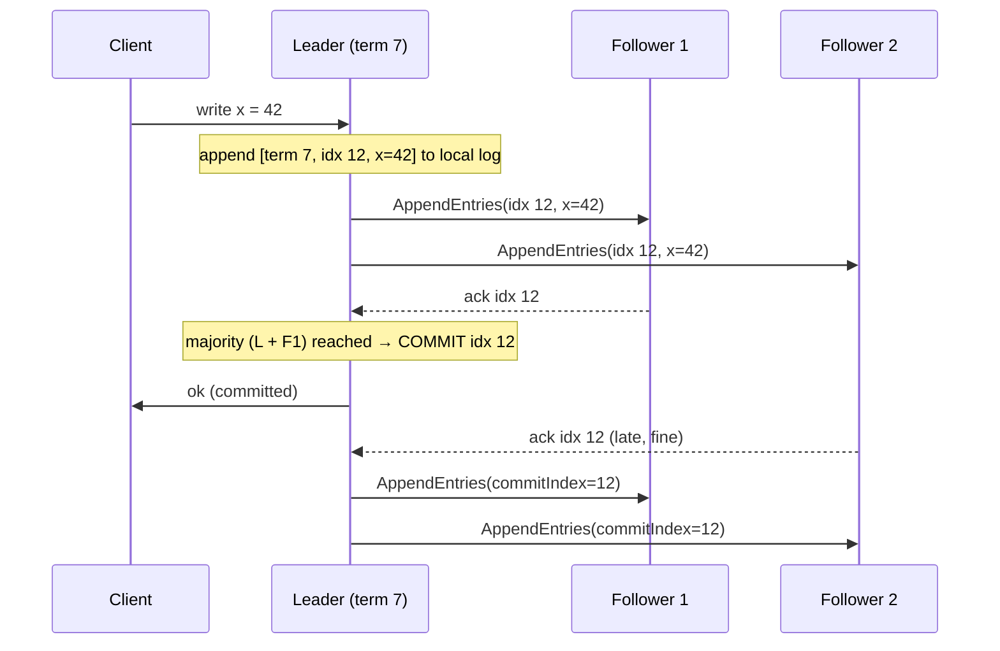

# Consensus

> Chapter from the **Data Engineering Playbook** — distributed-systems.

## About This Chapter

**What this is.** Consensus is how a set of crash-prone machines agree on a single, totally-ordered (every decision has one definitive position in the sequence), durable log of decisions. This chapter explains Raft and Multi-Paxos (the two dominant consensus algorithms used in production systems), the quorum math (the minimum number of nodes that must agree) behind them, and — more importantly — the operational realities (fsync disk flush, leases, membership changes) that actually cause on-call pages.

**Who it's for.** Mid-level data engineers, platform and architecture leads, and engineers preparing for senior or staff data-engineering interviews.

**What you'll take away.** By the end you'll be able to:
- Reason about cluster sizing with `N=2f+1` and explain why even-numbered clusters are strictly dominated.
- Diagnose the real-world failure modes — WAL (Write-Ahead Log, a file where changes are recorded before they are applied) fsync latency causing election storms, stale-leader reads, split-brain from bulk membership changes, and stuck-quorum recovery.
- Locate where consensus lives in a Spark to Iceberg to Kafka pipeline and keep it on metadata (commits, leadership) rather than the per-row hot path.

---

Consensus is the problem of getting a set of machines that can crash, pause, and disagree to agree on a single sequence of decisions — and to keep agreeing even when some of them die. As a data engineer you rarely implement Raft or Paxos yourself, but you depend on a consensus engine every single time you commit an Iceberg snapshot, elect a Kafka controller, lease a partition, or take a Postgres lock. When that engine misbehaves — a stuck leader, a split brain (two nodes both believing they are in charge), a quorum (the required minimum number of agreeing nodes) you can't reach — your "stateless" data pipeline grinds to a halt and the postmortem lands on your desk. This chapter is about understanding the machine underneath the abstraction well enough to operate it.

## TL;DR

- Consensus gives you a **single, totally-ordered, durable log of decisions** even though nodes crash and the network drops, reorders, or delays messages. Everything else (leader election, locks, config, KV stores, table commits) is built on that log.
- The real workhorses are **Raft** and **Multi-Paxos** (both are leader-based, log-replication consensus algorithms — one node sequences all writes to avoid conflicts). The classic single-decree Paxos (a version that only decides one value, not a sequence) is a teaching tool; nobody runs it raw in production.
- **Quorum math is the whole game**: a cluster of `2f+1` nodes tolerates `f` failures. 3 nodes survive 1 loss, 5 survive 2. Even-numbered clusters buy you nothing extra and cost you latency.
- Consensus is **CP under partition** — it sacrifices availability (the ability to keep serving requests) to never split-brain. A minority partition (a group of nodes that don't have enough members to form a majority) correctly *refuses to make progress*. See [cap-theorem](../cap-theorem/README.md).
- Consensus is **slow and expensive per decision** (a round trip to a majority on the write path). The principal-level skill is keeping it off the hot path: batch writes together, pipeline them, and only run consensus on metadata — never on every row.
- The failures that page you are rarely "the algorithm is wrong." They're **clock skew, fsync lies, undersized disks on the leader, lease and timeout misconfiguration, and even-node clusters** — operational, not theoretical.

## Why this matters in production

A concrete scenario from a streaming-to-lakehouse pipeline.

You run Spark Structured Streaming reading a 200-partition Kafka topic, writing to an Iceberg table on S3 with a Hive/Glue-backed catalog, micro-batch every 30s. Three things in this pipeline lean on consensus, and you need to know which:

1. **Kafka** elects a controller and per-partition leaders via KRaft (Kafka's built-in Raft-based consensus) or the older ZooKeeper (ZAB, a Paxos cousin — a protocol that works similarly to Paxos). When a broker dies, a new leader for its partitions must be agreed before producers and consumers can make progress.
2. **The Iceberg catalog** serializes (puts into a single agreed-upon sequence) table commits. Two concurrent writers both want to add a snapshot; consensus (or an atomic compare-and-swap — an operation that updates a value only if it still matches the expected value — backed by it) decides who wins and who retries.
3. **Your checkpoint store** — the offsets and watermark Spark persists so it can recover exactly-once — must be durably agreed before a batch is acknowledged.

Now the failure: a broker hosting partition leaders has a flapping NIC (network interface card). It's not dead — it's *slow*. ZooKeeper or KRaft sessions time out, leadership re-elects, the broker recovers, re-joins, and you get repeated leader churn (frequent leadership changes). Your consumer lag climbs, Spark micro-batches stall waiting on metadata fetches, and your Iceberg commits start failing with `CommitFailedException` because the metadata location moved underneath you. None of these components is "down." Consensus is doing exactly what it's designed to do — refusing to let a flaky node corrupt the agreed state — and the symptom surfaces three layers up as pipeline lag.

If you don't understand consensus, you'll "fix" this by bumping Spark retries. If you do, you'll fix the actual root cause: the flapping NIC, the too-aggressive session timeout, or the under-replicated quorum.

## How it works

The core abstraction is a **replicated state machine (RSM)**: every node runs the same deterministic (given the same input, always produces the same output) state machine, and if you feed every node the *same ordered sequence of commands*, they all end up in the same state. Consensus is the protocol that builds that single ordered sequence — the **replicated log** — across unreliable nodes.

Leader-based consensus (Raft / Multi-Paxos) decomposes into three jobs:

1. **Leader election** — pick one node to sequence writes, so you don't pay full consensus cost to *order* every command.
2. **Log replication** — the leader appends entries, ships them to followers, and waits for a majority to acknowledge before *committing* (making a decision permanent and visible).
3. **Safety** — guarantee that once an entry is committed, no future leader can ever overwrite or lose it.



The key safety invariant: **an entry is committed only when a majority has it durably on disk.** A majority of `2f+1` is `f+1` nodes. Because any two majorities of the same cluster overlap in at least one node, and that node remembers the highest term (a monotonic counter that increases each time a new election happens) it voted in, no two leaders can both believe they have the cluster's mandate for the same log position. That overlap is the entire mathematical heart of consensus.

### Quorum and fault-tolerance math

| Cluster size `N` | Majority `⌊N/2⌋+1` | Failures tolerated `f` | Notes |
|---|---|---|---|
| 1 | 1 | 0 | No HA. A "cluster." |
| 3 | 2 | 1 | The default. Best latency-to-safety ratio. |
| 4 | 3 | 1 | Worse than 3: more cost, *same* tolerance, slower writes. Avoid. |
| 5 | 3 | 2 | For control planes that must survive an AZ + a node. |
| 7 | 4 | 3 | Rare; replication cost rarely worth it. |

The rule: **`N = 2f+1`, always odd.** Even sizes are strictly dominated — a 4-node cluster needs 3 to agree but still only tolerates 1 failure, so you've added a node that increases write latency and the blast radius of a partition without buying tolerance.

Leader election in Raft uses **randomized timeouts**: each follower waits a random interval (e.g. 150–300ms) for a heartbeat (a periodic "I'm still alive" message the leader sends to followers); whoever times out first becomes a candidate, bumps the **term** (a monotonic logical clock — a counter that always increases and never goes backward), and requests votes. Randomization breaks symmetry so you don't get endless split votes (a situation where no candidate wins because votes are evenly spread). A candidate wins with majority votes *and* an up-to-date log.

## Deep dive

This is where engineers get it wrong. The algorithm is the easy part; the operational reality is where systems fall over.

### 1. fsync is the real durability boundary — and disks lie

"A majority has it durably on disk" means the log entry survived an `fsync` or `fdatasync` (system calls that force the OS to flush data from memory to physical storage). If your consensus node acknowledges a write before the data hits stable storage — because it's batching, because the OS page cache (a memory buffer the OS uses to delay disk writes) hasn't flushed, or because a virtualized or cloud disk acknowledges the write before the underlying device does — then a correlated power loss across the quorum can lose a *committed* entry. That's not a consensus bug; it's a broken durability assumption underneath consensus. This is why etcd ships `wal_fsync_duration_seconds` and why a disk that suddenly does 200ms fsyncs (caused by a noisy neighbor or EBS throttling) manifests as **leader election storms**: the leader can't fsync its log fast enough to send heartbeats, followers time out, and you re-elect on a loop.

> **Operational tell:** rising `p99 fsync latency` on the leader followed by `leader changed` events. The fix is faster or dedicated disk (provisioned IOPS, local NVMe for the WAL), not a higher election timeout.

### 2. Leases, not just leadership, prevent stale reads

A subtle point: a node can *think* it's the leader after it has actually been deposed (a new leader was elected while this node was partitioned off, and the old leader hasn't noticed yet). If that stale leader serves a read from its local state, it can return data older than a committed write — violating linearizability (the guarantee that every operation appears to take effect instantly at some point between when it was requested and when it returned). Two fixes:

- **Read through the log** (ReadIndex): the leader confirms it's still leader by exchanging a heartbeat round with a majority before answering a read. Correct, but adds a round trip to every read.
- **Leader leases**: the leader holds a time-bounded lease (a short-lived guarantee that no other leader can exist, based on the assumption that clocks don't drift too far); within it, it serves reads locally. This is *only* safe if you bound clock drift between nodes (which is why leases are tied to clock-skew assumptions — get this wrong and you serve stale reads). etcd and CockroachDB both lean on clock bounds here.

### 3. Membership changes are where clusters split-brain

Adding or removing a node naively can create a window where two disjoint majorities exist (old config majority and new config majority don't overlap). Raft solves this with **single-server changes** (add or remove one node at a time, so consecutive configs always overlap) or **joint consensus** (a transitional config requiring both old and new majorities to agree before switching fully). The classic outage: someone "replaces" 3 nodes by spinning up 3 new ones and pointing them at the cluster, briefly creating a 6-node membership with two possible 3-node majorities — split brain — divergent logs. **Never bulk-replace consensus members.** Drain one, add one, repeat.

### 4. The "stuck cluster" failure mode

Lose your majority and the cluster *correctly* stops accepting writes. A 3-node cluster that loses 2 nodes has 1 survivor that cannot form a majority — it will refuse all writes, and that's the safe behavior (the alternative is split-brain data loss). This is the CP choice in action. Recovery is operationally dangerous: forcing a single survivor to become the cluster (`etcdctl ... --force-new-cluster`) discards any writes the dead majority had committed but the survivor hadn't seen. You trade availability back at the cost of potential data loss, and you must do it deliberately, never automatically.

### 5. Consensus latency is a floor you can't optimize away

Every committed write is at least one round trip from leader to the nearest majority. Spread a 3-node cluster across three regions for "durability" and you've made every write pay cross-region RTT (round-trip time — the time for a message to travel to another data center and back, typically 50–100ms or more). This is why control planes are kept within a single region with fast links, and why you **never put consensus on the data hot path**. Kafka doesn't run consensus per message — it runs ISR (In-Sync Replicas — the set of replicas that are fully caught up with the leader) replication for data and reserves Raft or ZAB for *metadata* (leadership, configs, topic state). Iceberg doesn't run consensus per row — it runs one CAS per *commit* (a whole snapshot of many files).

### 6. Byzantine vs crash-fault

Raft and Paxos assume **crash-stop or fail-recover**: nodes can die or pause but don't lie or send corrupt data. They are *not* Byzantine fault tolerant (BFT means the protocol can handle nodes that send malicious or arbitrarily wrong messages) — a malicious or arbitrarily-corrupted node can break them. BFT consensus (PBFT, Tendermint) needs `3f+1` nodes to tolerate `f` Byzantine faults and is the domain of blockchains, not internal data platforms. For a data engineer inside a trusted VPC (Virtual Private Cloud — a private, isolated network within a cloud provider), crash-fault consensus is correct and BFT is overkill.

## Worked example

Two things worth making concrete: (a) the optimistic-concurrency CAS loop that Iceberg uses on top of catalog consensus, and (b) operating a real consensus cluster.

### Iceberg commit as consensus-backed compare-and-swap

Iceberg doesn't run Raft itself — it pushes the "agree on one winner" problem down to the catalog, which must provide an **atomic CAS** (compare-and-swap — an operation that updates a value only if it currently matches an expected value, with no risk of a concurrent update sneaking in between the check and the write) on the table's current metadata pointer. That atomicity is what's backed by a consensus system (the metastore DB's transaction, a DynamoDB conditional write, a Nessie/Raft commit). The writer wraps it in an optimistic retry loop:

```python
# Simplified model of Iceberg's commit path (real impl: BaseTransaction / TableOperations)
def commit_snapshot(catalog, table_id, planned_changes, max_retries=4):
    for attempt in range(max_retries):
        base = catalog.load_metadata(table_id)          # current metadata.json pointer
        new_meta = apply(base, planned_changes)         # add manifests, new snapshot

        try:
            # The load-bearing line: atomic compare-and-swap.
            # "Set pointer to new_meta ONLY IF it still equals base."
            catalog.commit(table_id, expected=base.location, updated=new_meta.location)
            return new_meta
        except CommitFailedException:
            # Someone else won the race and moved the pointer.
            # Our work isn't lost — re-plan against the NEW base and retry.
            sleep(backoff(attempt))                      # 100ms, 200ms, 400ms...
    raise CommitFailedException("exceeded retries; writer contention too high")
```

The principal-level insight: the consensus guarantee here is *single-winner per commit*, not *all writers succeed*. Under high write concurrency (say 20 Spark jobs all appending to one table), the CAS losers thrash on retries. The fix is not "more retries" — it's reducing contention: fewer, larger commits; partition the writers; or use a catalog with row-level or branch-level isolation. See [iceberg](../../lakehouse/iceberg/README.md) and [exactly-once](../../kafka/exactly-once/README.md).

### Operating a 3-node etcd-style cluster (config + the metrics that matter)

```yaml
# 3 nodes => tolerates 1 failure. Odd by design. Spread across 3 AZs in one region.
name: node-a
initial-cluster: node-a=https://10.0.1.10:2380,node-b=https://10.0.2.10:2380,node-c=https://10.0.3.10:2380
initial-cluster-state: new

# Election/heartbeat: heartbeat ~= network RTT; election-timeout = 10x heartbeat.
# Too low => spurious elections under jitter. Too high => slow failover.
heartbeat-interval: 100        # ms
election-timeout: 1000         # ms  (must be >> max one-way network delay)

# Put the WAL on dedicated low-latency storage. This is the #1 operational lever.
wal-dir: /mnt/nvme/etcd-wal
data-dir: /mnt/nvme/etcd-data

# Bound the log so a slow follower triggers a snapshot transfer instead of unbounded replay.
snapshot-count: 10000
quota-backend-bytes: 8589934592   # 8 GiB; exceeding it makes the cluster read-only (alarm)
```

```bash
# The four signals that predict consensus pain, in priority order:
#  1. fsync latency  — leader can't durably log -> election storms
#  2. leader changes — should be ~0/hour in steady state
#  3. proposal failures / pending — write path backing up
#  4. has-leader      — 0 means the cluster is stuck (lost quorum)
etcdctl endpoint status --write-out=table
etcdctl endpoint health
# Prometheus alerts worth wiring:
#   histogram_quantile(0.99, etcd_disk_wal_fsync_duration_seconds_bucket) > 0.05
#   rate(etcd_server_leader_changes_seen_total[10m]) > 3
#   etcd_server_has_leader == 0
#   etcd_server_proposals_pending > 0  (sustained)
```

## Production patterns

- **Keep consensus on metadata, ISR or quorum-replication on data.** Mirror what Kafka and Iceberg do: agree on *who's in charge* and *what the current pointer is* via consensus; replicate the bulk bytes via cheaper mechanisms. Never run a consensus round per record.
- **Always odd, always AZ-spread within a region.** 3 nodes across 3 AZs is the canonical control-plane topology: survives one AZ loss, keeps cross-node RTT in the sub-millisecond-to-few-ms range. Reserve 5 nodes for control planes that must survive an AZ *and* a concurrent node loss.
- **Dedicate fast storage to the WAL.** Provisioned IOPS or local NVMe for the consensus log. fsync latency is the master variable; throttled EBS is the most common cause of "mysterious" leader churn.
- **Tune election timeout to your network, then leave it.** Rule of thumb: `election-timeout >= 10 x heartbeat` and `heartbeat >= observed p99 one-way delay`. Cross-AZ jitter of a few ms with a 1000ms election timeout is comfortable; the same with a 200ms timeout flaps.
- **Make membership changes one node at a time, with health checks between.** Drain-one/add-one. Bulk replacement is the express lane to split brain.
- **Decide your read consistency explicitly.** Linearizable reads (ReadIndex) for correctness-critical paths; lease or local reads for throughput where bounded staleness (reads that may be slightly behind but by a known maximum amount) is acceptable. Document which you chose — see [consistency-models](../consistency-models/README.md).
- **Treat "lost quorum" as a paging event with a runbook, not an auto-recovery.** Forced single-node recovery loses committed data; it must be a human decision with a known data-loss window.

## Anti-patterns & failure modes

| Anti-pattern | Symptom you'll observe | Fix |
|---|---|---|
| Even-node cluster (4 or 6) | Same fault tolerance as `N-1`, higher write latency, larger partition blast radius | Use 3 or 5. Drop to odd. |
| Consensus log on shared/throttled disk | Periodic `leader changed` storms; lag spikes correlated with EBS burst-credit depletion | Dedicated NVMe / provisioned IOPS for the WAL |
| Election timeout too aggressive for the topology | Constant re-elections under normal network jitter; no node "dead" | Raise election-timeout to >=10x heartbeat and above p99 one-way delay |
| Stretching a 3-node cluster across regions | Every write pays cross-region RTT; throughput collapses, p99 writes 100ms+ | Keep consensus region-local; use async replication across regions |
| Bulk-replacing all members at once | Divergent logs, two leaders, data corruption (split brain) | One-at-a-time membership changes (joint consensus / single-server) |
| Serving reads from a node that lost leadership | Stale reads; clients see writes "disappear" then reappear | ReadIndex or properly-bounded leader leases |
| Assuming the cluster will always be writable | App stalls on writes after losing majority; looks like a hang | Design for CP: surface "no quorum" as a fast, explicit error and back off |
| High-concurrency writers to one Iceberg table | `CommitFailedException` retry thrash, climbing commit latency | Fewer/larger commits, partition writers, or branch-isolated commits |
| Trusting the disk's ack as durability | Rare data loss after correlated power events / host failures | Verify real fsync; monitor `wal_fsync_duration`; use storage that honors flush |

## Decision guidance

| You need… | Use | Not |
|---|---|---|
| A strongly-consistent control plane (configs, locks, leadership) | Raft/etcd-style consensus, 3–5 nodes | A single DB row "lock" with no fencing |
| High-throughput durable data replication | Quorum/ISR replication (Kafka), not per-record consensus | Running Raft per message |
| Mutual exclusion / distributed lock | Consensus-backed lease **with a fencing token** (a monotonically increasing number the locked resource checks to reject requests from deposed holders) | Best-effort lock with no fencing (lock expires, two holders act) |
| Tolerate Byzantine/malicious nodes | BFT (`3f+1`) — almost never inside a trusted platform | Raft (crash-fault only) |
| Geo-distributed strong consistency | Spanner/CockroachDB-style (consensus + bounded clocks) and accept the latency | A single Raft group stretched across regions |
| Single-region HA metadata store | 3-node consensus across 3 AZs | A 1-node "we'll fix HA later" store |

The meta-decision: **do you actually need linearizable agreement, or do you need durability and ordering you can get more cheaply?** Most data-plane problems are the latter. Consensus is the right tool when *more than one writer could disagree about a single piece of authoritative state* — leadership, a table pointer, a lock, a config epoch. If you find yourself reaching for consensus on the per-row write path, step back; you almost certainly want quorum replication or idempotent writes (writes designed so that applying the same write twice produces the same result as applying it once) instead. See [event-driven-systems](../event-driven-systems/README.md).

## Interview & architecture-review talking points

- **"Why is your cluster 3 nodes and not 4?"** Because `N=2f+1`. 3 tolerates 1 failure with the best latency; 4 tolerates the same 1 failure but needs 3 to agree, so it's slower for no resilience gain. Even sizes are strictly dominated.
- **"What happens to writes during a network partition?"** The minority side stops accepting writes — by design. Consensus is CP: it gives up availability on the minority side to guarantee it never split-brains. The majority side keeps serving. I'd surface "no quorum" as a fast explicit error, not a hang.
- **"How do you prevent two leaders from both acting?"** Any two majorities overlap in at least one node, and each node refuses to vote twice in a term, so two leaders can't hold the mandate for the same log position. For external resources (a lock on a DB), I add a **fencing token** — a monotonic number the resource checks — so a deposed-but-unaware leader's late writes get rejected.
- **"Your consensus cluster is doing election storms — diagnose it."** First suspect: WAL fsync latency on the leader, usually throttled cloud storage. The leader can't durably append fast enough to heartbeat, followers time out, re-election loops. Fix the disk (dedicated NVMe / provisioned IOPS), don't paper over it by raising the election timeout. Confirm with `wal_fsync_duration` p99 and `leader_changes_seen_total`.
- **"Where does consensus live in your Spark to Iceberg pipeline?"** Three places: Kafka's KRaft/ZAB for broker leadership and metadata, the Iceberg catalog's atomic CAS for commit serialization, and the structured-streaming checkpoint for durable offsets. I keep consensus on metadata only; data bytes go through ISR replication and object storage.
- **"How do you safely change cluster membership?"** One node at a time so consecutive configurations always share a majority, with a health check between steps. Bulk replacement creates two disjoint majorities and that's how you get split brain and divergent logs.
- **"Linearizable reads or not?"** Depends on the read. For correctness-critical reads I use ReadIndex (leader confirms it still has quorum before answering). For throughput-heavy reads where bounded staleness is fine, leader leases with bounded clock skew. I make the choice explicit and documented, not accidental.

## Further reading

In this repo:

- [cap-theorem](../cap-theorem/README.md) — why consensus chooses C over A under partition
- [consistency-models](../consistency-models/README.md) — linearizability, the guarantee consensus provides
- [event-driven-systems](../event-driven-systems/README.md) — when ordering/durability beats full consensus
- [kafka/exactly-once](../../kafka/exactly-once/README.md) — transactions and idempotence over a consensus-ordered log
- [kafka/consumer-groups](../../kafka/consumer-groups/README.md) — partition leadership and rebalancing on top of broker consensus
- [lakehouse/iceberg](../../lakehouse/iceberg/README.md) — atomic commits as consensus-backed compare-and-swap
- [engineering-leadership/decision-records](../../engineering-leadership/decision-records/README.md) — documenting consistency/availability trade-offs
