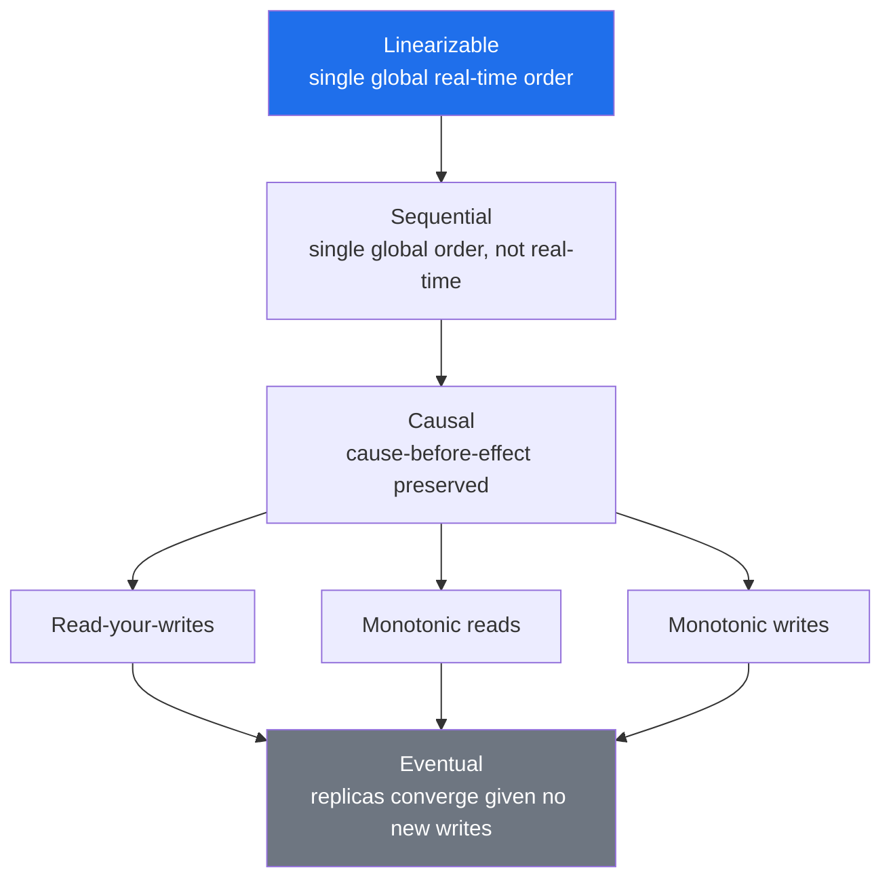
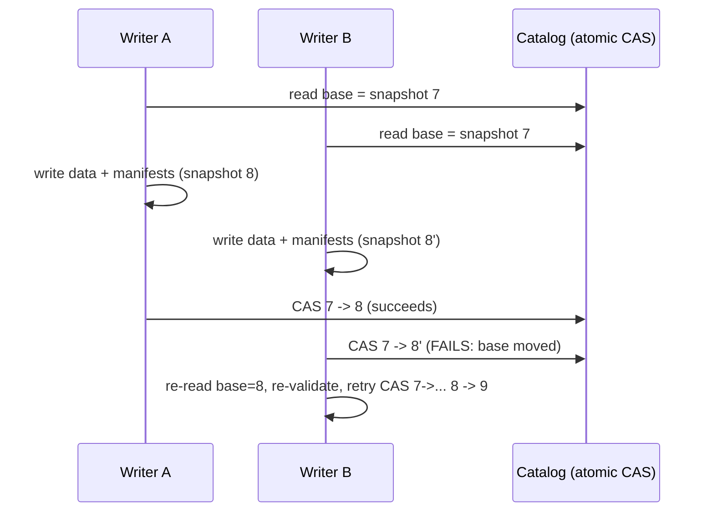

# Consistency Models

> Chapter from the **Data Engineering Playbook** — distributed-systems.

## About This Chapter

**What this is.** A consistency model is the contract a storage system makes with its clients about which values a read is allowed to return, given the writes that have already happened. This chapter walks through the spectrum from the strongest guarantee (linearizability) down to the weakest (eventual consistency), covers the math behind read freshness using quorums (groups of replicas that must agree), and explains the boundaries where strong and weak guarantees meet — because those boundaries are where real production incidents happen.

**Who it's for.** Mid-level data engineers, analytics engineers, platform and architecture leads, and engineers preparing for senior or staff data-engineering interviews.

**What you'll take away.** By the end you'll be able to:
- Place linearizable, sequential, causal, session (read-your-writes/monotonic), and eventual consistency on a spectrum from strongest to weakest, and pick the weakest model that still keeps a feature correct.
- Fix the common "my write disappeared" bug using read-your-writes via writer-pinning (always routing a user's reads to the same database instance that accepted their write) or an LSN/version token (a position marker in the database's write log).
- Explain why the lakehouse (a data platform combining data lake storage with warehouse-style queries) runs on snapshot isolation (not the stronger serializability guarantee), and why a MERGE needs the dedup key in its `ON` clause to avoid write skew (a bug where two concurrent transactions each read data, make disjoint changes, and both commit — violating an invariant neither one alone would have broken).

---

A "consistency model" is the contract between a storage system and its clients about *what values a read is allowed to return given the writes that have happened*. It is not a quality knob you tune higher for "more correct." It is a precise specification, and almost every data incident I have debugged in 11 years — duplicated invoices, a dashboard that disagrees with the source-of-truth ledger, a Spark job that read a half-committed Iceberg snapshot — traces back to someone assuming a stronger model than the system actually provides.

## TL;DR

- A consistency model defines the set of *legal* read outcomes for a given history of operations. Linearizability, sequential, causal, read-your-writes, monotonic reads, and eventual form a spectrum from strongest to weakest — and weaker is not "worse," it is cheaper and more available.
- The cost of stronger consistency is higher latency and reduced availability when a network partition (a network failure where some nodes can't communicate) occurs. Linearizable reads require a quorum round-trip or a leader lease (a time-limited permission granted to one node to serve reads without checking others); eventual reads can be served from any replica with no coordination.
- Most production data platforms run a *mix*: a linearizable system of record (the Iceberg/Delta catalog, a Postgres ledger), causal or read-your-writes guarantees at the API edge, and eventual consistency in caches and analytics replicas.
- The bugs come from the *seams*. A write goes to a strongly consistent store, then a downstream cache or read replica serves a stale value, and the user sees their own write disappear. The fix is almost never "make everything strong"; it is to pin the read path that needs the guarantee.
- In the lakehouse, "consistency" maps to *snapshot isolation* over a table. Iceberg and Delta give you atomic snapshot reads via an optimistic-concurrency commit (a commit strategy where you check for conflicts at commit time rather than locking upfront) on the catalog pointer — that is the consistency model you actually depend on every day.
- You must name the guarantee explicitly per data flow. "Eventually consistent" without a bounded staleness number is not a spec; it is a hope.

## Why this matters in production

Concrete scenario. A user updates their billing address in our profile service. The write lands in the primary Aurora Postgres instance (synchronous, linearizable). The profile service returns 200. The UI immediately re-fetches the profile to render the confirmation screen — but the read is routed to an Aurora *read replica* for load-shedding, and that replica is 800 ms behind under load. The user sees their *old* address and assumes the save failed. They save again. Now there are two writes, an audit-log entry that looks like a flapping user, and a support ticket.

Nothing here is "broken." Postgres did exactly what it promised. The read replica is asynchronous and only guarantees eventual consistency. The defect is that the read path that needed **read-your-writes** was silently downgraded to **eventual** for a performance optimization. The cost of getting this wrong scales with traffic: at 50 req/s this is a rare annoyance; at 5,000 req/s with a 1 s replica lag it is a steady stream of duplicate writes corrupting downstream analytics.

The same class of bug shows up everywhere in a data platform:

- A Spark job reads an Iceberg table mid-compaction and double-counts rows because it assumed file-listing consistency the object store doesn't give it (it does, via the manifest — but only if you read through the catalog, not by globbing S3 paths).
- A Kafka consumer commits offsets before the sink write is durable, so on rebalance it skips records — an availability-favoring choice masquerading as exactly-once.
- A materialized aggregate in Redshift disagrees with the ledger because it was built from an eventually-consistent CDC (Change Data Capture — a pattern that streams database changes as events) stream that reordered two updates to the same key.

Picking and *naming* the consistency model per flow is the difference between a system whose anomalies you can reason about and one where every incident is a fresh mystery.

## How it works

Consistency models are defined over *histories*: the partially ordered set of read and write operations as observed by clients. Think of a history as a timestamped log of every read and write that happened, as seen from each client's perspective. A model is a rule that says which histories are legal. Two axes matter most:

1. **Recency** — how fresh must a read be relative to the latest write?
2. **Ordering** — must all clients agree on the order operations happened?

The classic hierarchy (the lattice below is the practical subset used in data engineering):



Reading top to bottom: each model permits *more* legal histories (more possible read outcomes), costs less coordination, and survives more failure scenarios.

**Linearizability** is the gold standard. Every operation appears to take effect atomically at some single point between its invocation and its response, and that point respects real-time order: if write W completes before read R *starts* (wall-clock), R must see W or something later. This is what makes a register (a single storage cell) behave like a single-threaded variable. It is *composable* — a system built from linearizable parts is linearizable — which is why it is the model you want for a lock, a leader-election register, or a ledger balance.

**Sequential consistency** drops the real-time requirement. All clients agree on *an* order, and each client's own operations appear in program order, but that order need not match wall clock. Two clients can both be "behind" as long as they agree.

**Causal consistency** only orders operations that are causally related (if you read a value then write based on it, that is a causal link): if you read a value then write based on it, everyone sees your read-before-write order. Concurrent, unrelated writes can be seen in different orders by different clients. This is the strongest model achievable while remaining *available* under network partition — it is the practical ceiling for a system that prioritizes availability.

**Read-your-writes, monotonic reads, monotonic writes** are *session* (client-centric) guarantees — they constrain what a single client observes, not what all clients agree on. They are cheap, they fix the majority of user-facing "my data vanished" bugs, and they are usually the right target for an API tier.

- **Read-your-writes**: after you write something, your subsequent reads will always see that write (or something newer).
- **Monotonic reads**: once you've seen a value, you'll never see an older value in a future read.
- **Monotonic writes**: your own writes are applied in the order you issued them.

**Eventual consistency** promises only that *if writes stop, all replicas converge to the same value.* It says nothing about ordering, recency, or what you read in the meantime.

### The quorum math that makes a read fresh

For a Dynamo-style replicated store (a key-value store that replicates data across multiple nodes) with N replicas, write quorum W (minimum number of replicas that must confirm a write), read quorum R (minimum number of replicas that must respond to a read), a read is guaranteed to see the latest acknowledged write if and only if:

```
R + W > N
```

With N=3: `W=2, R=2` (W+R=4>3) gives you strong-ish reads. `W=1, R=1` (=2, not >3) is eventual — fast, but a read can land on a replica that never saw the write. `W=3, R=1` makes reads fast and writes durable-but-slow. The inequality is the lever; everything else is operational taste. Note this gives you *read-after-write on a single key*, not linearizability across keys — that still needs a coordinator.

## Deep dive

This is where engineers get burned.

### Eventual consistency has no bound unless you give it one

"Eventually" is unbounded by definition. In practice you need a **bounded staleness** SLO (Service Level Objective — a measurable target you commit to): "replicas converge within p99 = 2 s." Without a number you cannot test, alert, or reason. For our CDC pipeline I instrument staleness as `read_timestamp - source_commit_timestamp` per key and alert when p99 exceeds the budget. If you can't measure replica lag, you are not running an eventually-consistent system — you are running a randomly-consistent one.

### Session guarantees are sticky-routing, not magic

Read-your-writes is usually implemented by *sticking* a client's reads to the replica (or primary) that absorbed its writes, or by passing a version token (a write timestamp or LSN — Log Sequence Number, a position in the database's write-ahead log) the client must read at-or-after. The Aurora bug above is fixed by either:

- routing the post-write read to the writer endpoint, **or**
- capturing the commit LSN on write and rejecting/retrying replica reads whose `aurora_replica_lag` puts them behind that LSN.

Sticky routing breaks the moment a client moves (mobile network handoff, load-balancer reshuffle) and you lose the token. So session guarantees are only as strong as your ability to carry the version with the client.

### Linearizability does not compose with caches or async replicas

A linearizable database fronted by a cache that is updated *after* the commit is **not** linearizable end to end — there is a window where the cache serves stale data. This is the seam. Two correct patterns:

- **Cache-aside with invalidation on the write path, and read-through that treats a miss as a primary read.** Staleness window = invalidation propagation time.
- **Write-through where the cache write is part of the commit.** Now the cache is on the critical path and you've inherited its availability.

There is no free lunch: you either accept a staleness window or you put the cache in the consistency-critical path.

### Causal consistency and the "concurrent writes" reordering trap

Causal consistency preserves *cause→effect* but lets concurrent writes land in any order per replica. If two services both update the same key without a causal link, last-writer-wins (LWW — a conflict resolution strategy that keeps whichever write has the latest timestamp) silently drops one update — and physical timestamps drift across machines. CRDTs (Conflict-free Replicated Data Types — data structures designed to merge concurrent updates deterministically) or vector clocks (logical clocks that track causal relationships between events across nodes) resolve this deterministically; a bare LWW does not. In Kafka, this is why **keying by entity id** matters: all writes for one key go to one partition and are totally ordered, converting a potential reordering problem into a single ordered log.

### Snapshot isolation is the lakehouse consistency model — and it is *not* serializable

This is the one most data engineers actually depend on daily and least precisely understand. Snapshot isolation (SI) means every read sees a consistent point-in-time snapshot of the table — like a photograph taken at a specific moment. Iceberg and Delta implement this by having each reader see the manifest list (the index of files that make up the table) referenced by the current metadata pointer, and a writer commits atomically by compare-and-swapping (CAS — atomically checking that a value is what you expect, then updating it in a single operation) the catalog pointer from snapshot `N` to `N+1`.



SI prevents dirty reads (reading data from an uncommitted transaction) and gives atomic multi-file commits, but it permits **write skew**: two transactions read an overlapping set, make disjoint writes based on what they read, and both commit — violating an invariant neither alone would. Iceberg's `validate-from-snapshot` and `SnapshotUpdate` conflict checks (and `commit.retry.num-retries`) catch *file-level* conflicts (two MERGEs touching the same data files), but the engine cannot catch a *logical* invariant you never told it about. If your MERGE depends on "this key does not already exist," two concurrent inserts can both pass and you get duplicates. The fix is either a serializable isolation mode where supported (serializable goes further than SI by ensuring transactions behave as if they ran one at a time), or a deduplication/upsert key enforced in the MERGE condition itself.

### Read-listing consistency on object stores

S3 has been strongly read-after-write consistent for new objects since Dec 2020, but **LIST** operations (listing the files in a directory) can still lag in some stores and historically caused Spark to miss files. This is precisely why Iceberg/Delta exist: they never trust a directory listing. The set of files in a snapshot is the manifest, which is itself an immutable object read at a known path. If you `spark.read.parquet("s3://.../table/")` and glob the directory, you have thrown away the table format's consistency guarantee and reintroduced the listing problem. Always read through the catalog.

## Worked example

Two demonstrations: (1) the read-your-writes fix at the service edge, (2) snapshot isolation and conflict handling in Iceberg via Spark.

### 1. Read-your-writes via a version token (pseudo, transferable to any LSN/timestamp scheme)

```python
# Write path: capture the commit position and hand it back to the client.
def update_profile(user_id, payload):
    with primary.begin() as txn:
        txn.execute("UPDATE profile SET ... WHERE user_id = %s", (user_id, payload))
        commit_lsn = txn.execute("SELECT pg_current_wal_lsn()").scalar()
    # Client stores this token (cookie / header) and sends it on the next read.
    return {"status": "ok", "consistency_token": str(commit_lsn)}

# Read path: refuse a replica that hasn't caught up to the client's last write.
def get_profile(user_id, consistency_token):
    if consistency_token:
        replay_lsn = replica.execute("SELECT pg_last_wal_replay_lsn()").scalar()
        if replay_lsn < consistency_token:        # replica is behind the user's write
            return primary.query("SELECT * FROM profile WHERE user_id=%s", user_id)
    return replica.query("SELECT * FROM profile WHERE user_id=%s", user_id)
```

The client never sees its own write disappear, and the *common* case (no recent write, or a caught-up replica) still serves from the replica.

### 2. Iceberg snapshot isolation + optimistic concurrency

```python
from pyspark.sql import SparkSession

spark = (SparkSession.builder
    .config("spark.sql.extensions",
            "org.apache.iceberg.spark.extensions.IcebergSparkSessionExtensions")
    .config("spark.sql.catalog.lake", "org.apache.iceberg.spark.SparkCatalog")
    .config("spark.sql.catalog.lake.type", "glue")
    .config("spark.sql.catalog.lake.warehouse", "s3://lake/warehouse")
    # let concurrent commits retry the CAS instead of failing the job
    .getOrCreate())

spark.sql("""
  ALTER TABLE lake.billing.invoices SET TBLPROPERTIES (
    'commit.retry.num-retries' = '10',
    'commit.retry.min-wait-ms' = '200',
    'write.spark.fanout.enabled' = 'true'
  )
""")
```

```sql
-- A MERGE that is SAFE under snapshot isolation because the dedup key is in the
-- match condition. Two concurrent runs cannot both insert the same invoice_id:
-- the second commit's CAS fails, Iceberg re-reads the new snapshot, re-runs the
-- conflict validation, and retries. Without the ON predicate, SI's write-skew
-- window would let both inserts through.
MERGE INTO lake.billing.invoices t
USING staged_invoices s
  ON t.invoice_id = s.invoice_id          -- the invariant the engine can enforce
WHEN MATCHED AND s.updated_at > t.updated_at THEN UPDATE SET *
WHEN NOT MATCHED THEN INSERT *;
```

```python
# Reads are snapshot-isolated automatically. Time-travel makes the model explicit:
# this read is pinned to a snapshot and is immune to concurrent compaction/writes.
df = (spark.read
      .option("snapshot-id", 8_345_201_993_002)   # or 'as-of-timestamp'
      .table("lake.billing.invoices"))
```

If you instead did `spark.read.parquet("s3://lake/warehouse/billing/invoices/data/")`, you would bypass the manifest, race compaction, and re-inherit listing inconsistency. The whole point of the format is that the snapshot id *is* the consistency boundary.

## Production patterns

- **Name the model per data flow, with a number.** In the design doc: "profile read-after-write: read-your-writes, enforced via LSN token; analytics replica: eventual, bounded staleness p99 ≤ 5 s." A model without a measurable staleness/latency bound is undefined.
- **Pin the consistency-critical read path to the source of truth.** Post-write confirmation reads, balance checks, idempotency-key lookups, and dedup checks go to the writer/primary, not a replica or cache. Everything else can be eventual.
- **Key by entity to convert ordering problems into a single ordered log.** In Kafka, same key → same partition → total order. In Iceberg MERGE, the dedup key in the `ON` clause converts a write-skew hazard into a CAS retry.
- **Make eventual consistency observable.** Emit replica/CDC lag as a first-class metric (`source_commit_ts → visible_ts`) and SLO-alert on it. Staleness you can't see is staleness you'll debug at 2 a.m.
- **Use snapshot ids / version tokens as cross-system join keys.** When a Spark job and a downstream consumer must agree on "which version of the table," pass the Iceberg `snapshot-id` rather than a wall-clock time. It is the only unambiguous reference.
- **Idempotency over exactly-once.** Rather than chasing exactly-once across a weakly consistent boundary, make the sink idempotent (upsert on a natural key, dedup table) so at-least-once delivery is safe. This is almost always cheaper and more robust than two-phase commit (a protocol that coordinates a commit across multiple systems simultaneously).

## Anti-patterns & failure modes

| Anti-pattern | Symptom you observe | Fix |
|---|---|---|
| Post-write read routed to an async replica | User's own write "disappears," duplicate submissions, flapping audit log | Read-your-writes via writer-pin or LSN token (worked example #1) |
| Globbing S3 paths instead of reading via the catalog | Spark double-counts or misses files during compaction; row counts unstable run-to-run | Read through Iceberg/Delta; never trust directory LIST |
| MERGE without the dedup key in the `ON` predicate | Duplicate rows under concurrent writers despite "transactions" | Put the natural key in `ON`; rely on CAS retry; or use serializable mode |
| Treating snapshot isolation as serializable | Invariant violations (write skew) that "shouldn't be possible" | Enforce the invariant in the predicate, or upgrade isolation |
| Bare last-writer-wins on concurrent updates | Updates silently lost; clock-skew-dependent, non-reproducible | Vector clocks/CRDTs, or single-writer per key via partitioning |
| "Eventually consistent" with no staleness SLO | Random stale reads nobody can characterize or alert on | Define and instrument bounded staleness; alert on lag p99 |
| Committing Kafka offsets before the sink is durable | Records skipped on rebalance; gaps in downstream data | Commit offsets only after sink write is acknowledged; idempotent sink |
| Caching in front of a linearizable store with no invalidation | Stale reads for the cache TTL; "I changed it but it's still old" | Invalidate on write path or write-through; document the window |

The common thread: every one of these is a *seam* where a strong guarantee on one side meets a weaker path on the other, and nobody wrote down which guarantee the read actually needed.

## Decision guidance

| You need… | Use this model | Where it lives in our stack |
|---|---|---|
| A correct balance, lock, leader, or uniqueness check | Linearizable | Postgres/Aurora primary, DynamoDB strongly-consistent read, ZK/etcd register |
| A user to always see their own latest change | Read-your-writes (session) | API tier with version-token routing |
| Multi-step user flows to stay causally ordered | Causal | Per-entity Kafka partitioning; client session affinity |
| Atomic point-in-time reads over a big table | Snapshot isolation | Iceberg / Delta via the catalog |
| Cheap, highly-available analytics reads tolerant of staleness | Eventual + bounded staleness | Read replicas, Redshift/Snowflake from CDC, caches |
| To survive network partitions without blocking writes | Causal or eventual (AP) | See the AP/CP tradeoff in the cap-theorem chapter |

Rule of thumb: start from the *weakest model that still makes the feature correct*, because weaker is cheaper and more available. Then strengthen only the specific read paths that need it. Strengthening everything to linearizable "to be safe" is how you get a system that is slow, expensive, and *still* wrong at the cache seam.

## Interview & architecture-review talking points

- "Consistency is a contract, not a quality level. I specify the model per data flow with a measurable staleness bound, then strengthen only the paths that need it." This reframes the question away from "strong vs eventual" toward "which guarantee does *this read* require."
- "The lakehouse consistency model is snapshot isolation, not serializability. I'd point out that a MERGE without the dedup key in the `ON` clause is exposed to write skew, and that Iceberg's CAS-and-retry handles file conflicts but not logical invariants."
- "Read-your-writes fixes most user-facing 'my data vanished' bugs and costs almost nothing — a version token or writer-pin. I'd reach for that long before making the whole system linearizable."
- "I never glob object-store paths for a table; I read through the catalog so the manifest, not a LIST, defines the file set. That's the difference between a stable row count and a flaky one."
- "Linearizability doesn't compose with an asynchronous cache or replica. The honest answer is you pick a staleness window and instrument it — there's no configuration that makes the seam disappear for free."
- "I prefer idempotent sinks over chasing exactly-once across a weak boundary; at-least-once + upsert-on-key is cheaper and more robust than two-phase commit."

## Further reading

- cap-theorem chapter — the availability/consistency tradeoff under partition that bounds which models you can even offer.
- consensus chapter — how Raft/Paxos and quorums *implement* linearizability for the system of record.
- event-driven-systems chapter — ordering, keying, and idempotency in log-based pipelines.
- lakehouse/iceberg chapter — snapshot isolation and optimistic-concurrency commits in practice.
- kafka/offsets chapter — offset-commit ordering and the at-least-once vs exactly-once tradeoff.
