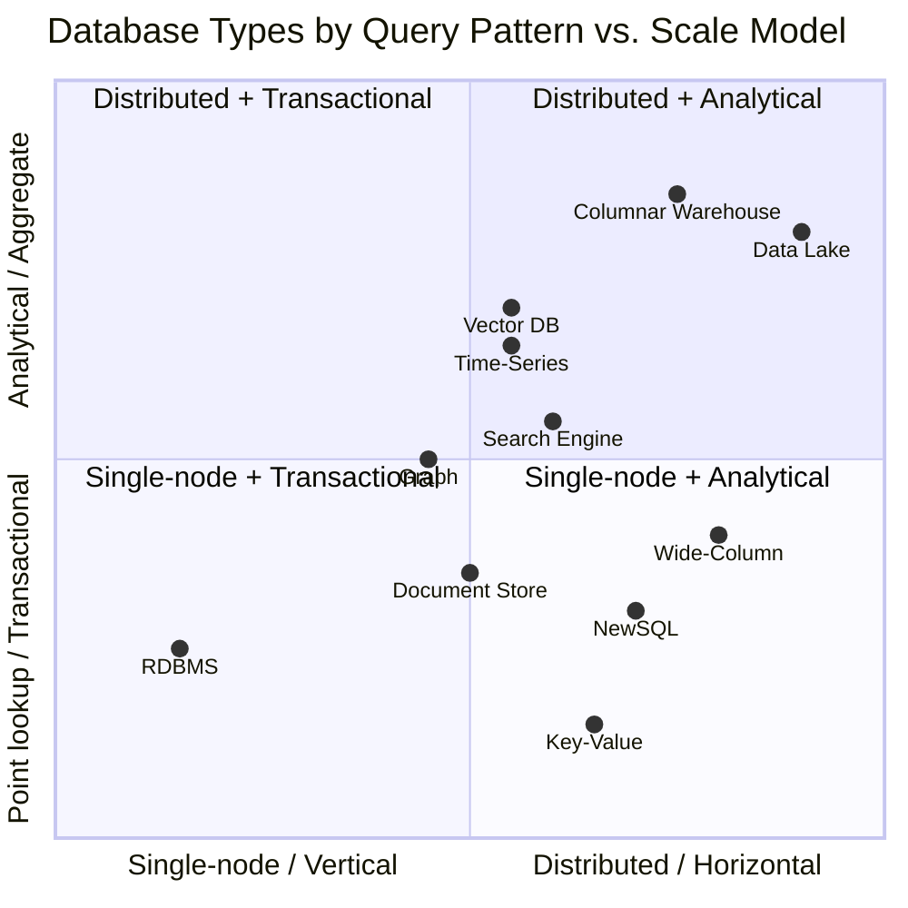

# Database Types Every Data Engineer Should Know

> Chapter from the Data Engineering Playbook — distributed-systems.

---

## TL;DR

| Type | One-line purpose | DE role |
|---|---|---|
| **Relational (RDBMS)** | Structured data, ACID transactions, SQL | Primary source system — ingest from it |
| **Columnar Warehouse** | Analytics and BI on large structured datasets | Primary target — write transformed data to it |
| **Document Store** | Flexible JSON structures, varying schemas | Source system — ingest semi-structured data |
| **Key-Value Store** | Sub-millisecond point lookups by a single key | Target — write feature store data, serve low-latency reads |
| **Wide-Column** | Massive write throughput, time-ordered or entity-scoped data | Source or target — IoT, event history, user activity |
| **Graph Database** | Relationship traversal across connected entities | Specialized source — fraud rings, recommendation graphs |
| **Time-Series** | Metrics, sensor data, monitoring with compression and downsampling | Source or target — ingest monitoring data; write pipeline metrics |
| **Search Engine** | Full-text search, fuzzy matching, log analytics | Target — write processed events for search and log analysis |
| **NewSQL** | RDBMS semantics + horizontal scale | Source — applications that outgrew single-node Postgres |
| **Vector Database** | Nearest-neighbor search on ML embeddings | Target — write embeddings for semantic search / RAG |
| **Data Lake** | Open-format analytical storage at any scale | Primary target — write Parquet/Iceberg/Delta for batch analytics |

---

## The Organizing Framework

Every database type is defined by two things:

**Storage model** — how data is physically laid out on disk:
- Row store: all columns of one row stored together → fast single-row read/write
- Column store: all values of one column stored together → fast aggregation across many rows
- Document: JSON blob per entity → flexible schema, nested access
- Log-structured (LSM tree): writes go to a sequential log, merged in background → high write throughput
- B-tree: balanced tree index on disk → balanced read/write for sorted access
- Inverted index: word → list of documents → fast full-text lookup
- Graph: adjacency list → fast edge traversal

**Query model** — how you access data:
- SQL (declarative)
- Key lookup (GET key → value)
- Document query (find where field = value within JSON)
- Graph traversal (MATCH pattern)
- Vector similarity (find nearest N embeddings to query vector)
- Time-range scan with aggregation functions



---

## Type 1: Relational Database (RDBMS)

### What it is

Stores data in tables (rows and columns) with a fixed schema. Relationships between tables are enforced via foreign keys. Every write is ACID-compliant — Atomic, Consistent, Isolated, Durable. SQL is the query language.

### Why it exists

Before RDBMS, applications stored data in files or hierarchical databases with no standard query interface. RDBMS (1970s, E.F. Codd's relational model) introduced a uniform way to define, store, query, and enforce relationships in structured data — with guarantees that a write either fully succeeds or fully rolls back.

### How it works

Data is stored **row by row** on disk pages. An index (B-tree by default) is built on the primary key and any indexed column, enabling O(log n) lookups. The query planner evaluates multiple execution strategies (index scan, full table scan, hash join, nested loop join) and picks the lowest-cost plan.

ACID is enforced via a Write-Ahead Log (WAL): every change is written to the WAL before being applied to the data pages. On crash, the WAL is replayed to restore consistency.

### How it is used

```sql
-- Application writes (transactional)
INSERT INTO orders (order_id, customer_id, total, status)
VALUES ('ORD-001', 101, 149.99, 'placed');

-- Point lookup
SELECT * FROM orders WHERE order_id = 'ORD-001';

-- Join
SELECT c.name, o.total
FROM customers c
JOIN orders o ON c.customer_id = o.customer_id
WHERE o.status = 'placed';
```

### Technologies

| Option | Notes |
|---|---|
| **PostgreSQL** | OSS; most feature-rich; recommended default |
| **MySQL / MariaDB** | OSS; widely used in web applications |
| **Amazon Aurora** | AWS-managed PostgreSQL/MySQL-compatible; 5× faster than standard MySQL |
| **Amazon RDS** | AWS-managed PostgreSQL, MySQL, SQL Server, Oracle |
| **SQL Server** | Microsoft; common in enterprise / .NET shops |
| **Oracle** | Enterprise legacy; expensive; common in large financial institutions |

### Use cases

1. **E-commerce order management** — orders, line items, customers, payments — all require ACID; a payment must not be credited without the order being recorded
2. **User account systems** — registration, authentication, profile — well-defined schema, strong consistency required
3. **Financial ledgers** — every debit must have a matching credit; rollback on failure is non-negotiable
4. **CRM / ERP systems** — Salesforce, SAP run on relational databases underneath
5. **Reference data** — product catalog, store locations, currency codes — stable schema, joins required

### DE's perspective

**Role: Primary source system.** Most production applications run on an RDBMS. As a DE, you:
- Ingest from it via batch polling (`WHERE updated_ts > watermark`) or CDC (Debezium reading the WAL)
- Land raw data in a staging table or CDC changelog
- Transform and load into a warehouse or lake

The WAL that powers ACID is also what Debezium reads for CDC. Understanding how the WAL works helps you configure Debezium correctly (replication slot retention, max WAL size).

### Limits

- Vertical scaling only — adding more tables/rows eventually hits a single-node ceiling
- Analytical queries (full table scans, large aggregations) compete with OLTP traffic — never run heavy analytics directly on the production RDBMS
- Schema changes (ALTER TABLE) on large tables are slow and lock-prone

---

## Type 2: Columnar / OLAP Data Warehouse

### What it is

Stores data **column by column** rather than row by row. Purpose-built for analytical queries: aggregations (SUM, COUNT, AVG), GROUP BY, and table scans over billions of rows. Not designed for single-row transactional writes.

### Why it exists

RDBMS row stores are inefficient for analytics. A query like `SELECT region, SUM(revenue) FROM orders GROUP BY region` on a 500M-row table must read every column of every row even though only two columns are needed. A columnar store reads only those two columns off disk, achieving 10–100× better I/O efficiency for analytical patterns.

### How it works

Columns are stored as contiguous byte arrays on disk. Values in a column are similar in type → highly compressible (run-length encoding, dictionary encoding). The query engine reads only the columns referenced in the query, skipping everything else. Queries are parallelized across multiple nodes (MPP — Massively Parallel Processing).

```
Row store on disk:   [id=1, region=West, revenue=100] [id=2, region=East, revenue=200] ...
Columnar on disk:    [1,2,3,...] [West,East,West,...] [100,200,150,...] ← read only last two columns
```

### How it is used

```sql
-- Aggregation over billions of rows — fast on columnar
SELECT region, product_category, SUM(revenue), COUNT(DISTINCT customer_id)
FROM fact_orders
WHERE order_date BETWEEN '2024-01-01' AND '2024-03-31'
GROUP BY region, product_category
ORDER BY SUM(revenue) DESC;

-- Loading data (bulk INSERT / COPY)
COPY fact_orders FROM 's3://data-lake/orders/2024-06-18/' IAM_ROLE '...' FORMAT PARQUET;
```

### Technologies

| Option | Notes |
|---|---|
| **Snowflake** | Cloud-native, multi-cloud, auto-suspend compute, data sharing |
| **Amazon Redshift** | AWS-native, tight S3/Glue integration, Redshift Serverless |
| **Google BigQuery** | GCP, serverless, pay-per-TB-scanned, massive scale |
| **Azure Synapse** | Azure, unified SQL + Spark workspace |
| **DuckDB** | OSS, single-node, in-process — runs in Python, reads Parquet/S3 directly; excellent for local development |
| **ClickHouse** | OSS, extremely fast for aggregations, self-hosted or cloud |

### Use cases

1. **BI dashboards and reporting** — Tableau, Looker, Power BI connecting to a warehouse for business metrics
2. **Revenue and funnel analytics** — daily/weekly performance reports across dimensions
3. **Data science / SQL analytics** — analysts writing complex multi-join SQL without impacting production systems
4. **Customer 360** — joining CRM, web, and transactional data in one place for customer analytics
5. **Financial reporting** — period-end closes, P&L summaries, cost attribution

### DE's perspective

**Role: Primary analytical target.** You write transformed, clean data here. The warehouse is the serving layer for analysts and BI tools. As a DE, you:
- Load staged data via COPY/INSERT or dbt models
- Manage schema (CREATE TABLE, ALTER for new columns)
- Monitor query performance — slow queries affect analyst productivity
- Handle incremental loads: upsert on business key or partition overwrite

See [Choosing Your Data Platform](../../../platform-engineering/choosing-your-data-platform/README.md) for warehouse vs lake decision.

### Limits

- Expensive at scale (> 5 TB) — per-TB storage pricing makes lakes far cheaper
- Not designed for real-time writes — micro-batch loads (hourly) are fine; per-row streaming inserts are not
- Single engine — Spark, Flink, and Python can't read Snowflake tables directly as files

---

## Type 3: Document Store

### What it is

Stores data as self-contained documents — typically JSON or BSON. Each document can have a different structure. No fixed schema enforced at the database level. Documents are grouped in collections (equivalent to tables), and each document has a unique `_id`.

### Why it exists

RDBMS requires every row in a table to have the same columns. A product catalog where a TV has 15 attributes and a t-shirt has 5 different attributes either wastes columns (sparse rows) or requires complex EAV (entity-attribute-value) patterns. Document stores let each document carry exactly the fields it needs.

### How it works

Documents are stored as binary JSON (BSON in MongoDB). An index is built on `_id` and any declared field. Queries filter and project fields within documents, including nested paths. Aggregation pipelines chain operations (match → group → project) inside the database.

### How it is used

```javascript
// Insert a product document — no fixed schema
db.products.insertOne({
  _id: "SKU-789",
  name: "4K Smart TV",
  brand: "Acme",
  specs: { screen_size: 55, resolution: "4K", hdr: true, ports: ["HDMI x3", "USB x2"] },
  price: 699.99,
  categories: ["electronics", "televisions"]
})

// Query with nested field filter
db.products.find({ "specs.screen_size": { $gte: 50 }, price: { $lt: 800 } })

// Aggregation
db.orders.aggregate([
  { $match: { status: "shipped" } },
  { $group: { _id: "$customer_id", total: { $sum: "$amount" } } }
])
```

### Technologies

| Option | Notes |
|---|---|
| **MongoDB** | OSS + managed (Atlas); most widely used document store |
| **Amazon DocumentDB** | AWS-managed, MongoDB-compatible API |
| **Google Firestore** | GCP, real-time sync for mobile/web applications |
| **CouchDB** | OSS; HTTP API; multi-master replication |
| **DynamoDB** | AWS key-value + document hybrid; flexible schema per item |

### Use cases

1. **Product catalogs** — varying attributes per product type; schema changes don't require migrations
2. **User profiles with nested preferences** — a user object with embedded addresses, settings, notification prefs
3. **Content management systems** — articles, pages, media — each with different metadata fields
4. **Event logs with variable payload** — each event type has a different set of fields; document store avoids a wide sparse table
5. **Mobile app backends** — rapid schema iteration during development; Firestore real-time sync

### DE's perspective

**Role: Source system.** Applications built on MongoDB are common source systems. As a DE, you:
- Ingest via Change Streams (MongoDB's CDC mechanism) or periodic full exports
- Handle schema variability — fields present in some documents but not others; `explode()` nested arrays in Spark
- Flatten nested JSON structures into relational form for warehouse loading

### Limits

- No joins across collections at the storage level — joins are done in the application or aggregation pipeline
- Not suitable for highly relational data with complex multi-table queries
- Consistency across multiple documents requires explicit transactions (added in MongoDB 4.0) and is slower than RDBMS

---

## Type 4: Key-Value Store

### What it is

The simplest database model: a hash map. Every record has a key and a value. Operations are GET (retrieve by key), PUT (store key → value), and DELETE. No schema, no query language, no joins. Values are opaque bytes (or simple types) to the database.

### Why it exists

RDBMS queries go through a SQL parser, query planner, and index lookup — even a simple primary key lookup takes milliseconds. Key-value stores skip all of that: the key hashes directly to a memory address or disk offset. This achieves sub-millisecond reads at millions of requests per second — something no SQL database can match.

### How it works

In-memory KV stores (Redis): the entire dataset lives in RAM. A key hashes to a slot in a hash table. GET and SET are O(1). Persistence is optional (AOF log or RDB snapshots). Distributed KV (DynamoDB): a consistent-hashing ring partitions keys across nodes. A GET routes directly to the responsible node with no coordination overhead.

### How it is used

```python
# Redis (Python redis-py)
import redis
r = redis.Redis()

# Cache a user session
r.setex("session:user-101", 3600, json.dumps({"user_id": 101, "role": "admin"}))

# Retrieve
session = json.loads(r.get("session:user-101"))

# Increment a counter atomically
r.incr("page_views:homepage")

# DynamoDB
import boto3
ddb = boto3.resource("dynamodb")
table = ddb.Table("feature_store")

# Write a feature vector for a user
table.put_item(Item={"user_id": "101", "feature_date": "2024-06-18",
                     "days_since_last_order": 7, "lifetime_value": 1250.00})

# Read by key
response = table.get_item(Key={"user_id": "101", "feature_date": "2024-06-18"})
```

### Technologies

| Option | Notes |
|---|---|
| **Redis** | OSS in-memory; strings, lists, sets, sorted sets, hashes; pub/sub; Lua scripting |
| **Amazon ElastiCache for Redis** | AWS-managed Redis |
| **Memcached** | Simple OSS in-memory cache; no persistence; no data structures |
| **Amazon DynamoDB** | AWS-managed, durable, single-digit millisecond at any scale; pay-per-request |
| **etcd** | Distributed KV for configuration and service discovery (Kubernetes uses it) |

### Use cases

1. **Session storage** — web sessions stored in Redis; sub-millisecond retrieval on every request
2. **Caching** — cache database query results, API responses, rendered HTML; TTL-based auto-expiry
3. **Rate limiting** — atomic INCR on a per-user-per-minute counter
4. **ML feature store serving layer** — precomputed features stored in DynamoDB; model inference reads features in < 5ms
5. **Real-time leaderboards** — Redis sorted sets rank players by score; top-N query is O(log N)
6. **Distributed locks** — Redis SETNX for mutual exclusion across services

### DE's perspective

**Role: Target for real-time serving.** After computing features in a Spark pipeline, write them to DynamoDB or Redis for the ML model to read at inference time. As a DE, you:
- Write batch-computed features to DynamoDB at scale (use DynamoDB batch writer, not individual PutItem)
- Manage TTL policies to prevent stale feature values
- Monitor cache hit rates — a cache miss means falling back to the slower database

### Limits

- Values are opaque — you cannot query by field inside the value (no `WHERE payload.status = 'active'`)
- Not for analytics — no aggregation, no joins, no SQL
- Memory is expensive — Redis holding 100 GB of data costs far more than 100 GB in S3

---

## Type 5: Wide-Column / Column Family Store

### What it is

Stores data in tables partitioned by a row key, with columns grouped into **column families**. Unlike RDBMS (fixed columns per row), each row can have different columns within the same table. Designed for **massive write throughput** and efficient range scans by row key — at petabyte scale across thousands of nodes.

### Why it exists

Neither RDBMS nor key-value stores handle the combination of: (a) very high write rates (millions of rows/second), (b) wide rows with hundreds or thousands of columns per entity, and (c) distributed scale. Wide-column stores were designed for web-scale use cases — Google's Bigtable (2006) was built to power Google Search's web crawl index.

### How it works

Data is stored in an LSM tree (Log-Structured Merge tree). Writes go to an in-memory buffer (memtable) and a sequential commit log — no random disk I/O, so writes are extremely fast. Periodically, memtables are flushed to sorted files (SSTables) on disk. Reads merge the in-memory and on-disk data. Background compaction merges SSTables, removing deleted records and optimizing read paths.

Row key design determines everything: rows with the same key prefix are stored physically adjacent, enabling efficient range scans.

### How it is used

```python
# Cassandra (cassandra-driver)
from cassandra.cluster import Cluster

cluster = Cluster(['localhost'])
session = cluster.connect('analytics')

# Insert — very fast, no read-before-write needed
session.execute("""
  INSERT INTO user_activity (user_id, event_ts, event_type, page)
  VALUES (%s, %s, %s, %s)
""", ("user-101", datetime.now(), "page_view", "/checkout"))

# Range scan by row key + time range
rows = session.execute("""
  SELECT event_ts, event_type, page
  FROM user_activity
  WHERE user_id = 'user-101'
    AND event_ts >= '2024-06-01' AND event_ts <= '2024-06-18'
""")
```

### Technologies

| Option | Notes |
|---|---|
| **Apache Cassandra** | OSS; peer-to-peer (no master); tunable consistency; CQL (SQL-like) |
| **Amazon Keyspaces** | AWS-managed, Cassandra-compatible; serverless |
| **Apache HBase** | OSS; runs on HDFS; consistent (CP); used with Hadoop |
| **Google Bigtable** | GCP-managed; original wide-column store; petabyte scale |
| **ScyllaDB** | OSS, Cassandra-compatible; written in C++ for lower latency |

### Use cases

1. **User activity history** — billions of events per day, partitioned by user_id; scan last 30 days per user
2. **IoT sensor data** — millions of devices writing measurements every second; row key = device_id + timestamp
3. **Message inbox** — per-user message threads; row key = user_id; efficient "get all messages for user"
4. **Real-time recommendation signals** — recent interactions per user; wide row with one column per item interacted with
5. **Audit logs at scale** — immutable writes, high throughput, long retention

### DE's perspective

**Role: Source or target, depending on use case.** Cassandra is often a serving database for applications — you ingest from it into the lake for analytics. Sometimes you write pipeline output back to Cassandra for application serving (pre-aggregated metrics per user). As a DE:
- Read via Spark-Cassandra Connector for batch ingestion
- Design row keys carefully — a poor row key causes hot partitions (one node overloaded while others are idle)

### Limits

- Queries must include the full partition key — no ad-hoc filtering without it (table scan is prohibited at scale)
- No joins — denormalization is required by design; model data for how it will be read
- Tunable consistency means you can configure eventual consistency (faster) or strong consistency (slower); wrong choice causes stale reads

---

## Type 6: Graph Database

### What it is

Models data as **nodes** (entities) and **edges** (relationships between them). Edges are first-class objects with their own properties. Traversing from one node to another across multiple relationships is the core query operation. Graph query languages: Cypher (Neo4j), Gremlin (TinkerPop), SPARQL (RDF graphs).

### Why it exists

In a relational database, "find all friends of friends of User 101 who have purchased Product X" requires 3 or more self-joins — query time grows exponentially with traversal depth. Graph databases store adjacency lists as direct pointers: traversing from a node to its neighbors is O(1) regardless of total graph size. Deeply connected data that would require dozens of JOINs in SQL is a natural single query in a graph model.

### How it works

Nodes and edges are stored in index-free adjacency structures: each node directly points to its neighboring nodes via edge records. Traversal follows pointers rather than consulting a global index. This makes multi-hop traversal (friend-of-friend-of-friend) fast in a graph but impossible to optimize in a relational system.

### How it is used

```cypher
// Neo4j Cypher — find fraud rings: accounts sharing a device that also share a phone number
MATCH (a1:Account)-[:USES_DEVICE]->(d:Device)<-[:USES_DEVICE]-(a2:Account),
      (a1)-[:HAS_PHONE]->(p:Phone)<-[:HAS_PHONE]-(a2)
WHERE a1 <> a2
  AND a1.flagged = false
  AND a2.flagged = true
RETURN a1.account_id, a2.account_id, d.device_id, p.phone_number

// Find 3-hop recommendations: users similar to me who bought something I haven't
MATCH (me:User {id: 'user-101'})-[:PURCHASED]->(p:Product)
      <-[:PURCHASED]-(similar:User)-[:PURCHASED]->(rec:Product)
WHERE NOT (me)-[:PURCHASED]->(rec)
RETURN rec.name, COUNT(similar) AS recommenders
ORDER BY recommenders DESC LIMIT 10
```

### Technologies

| Option | Notes |
|---|---|
| **Neo4j** | OSS + Enterprise; most widely used; Cypher; AuraDB (managed cloud) |
| **Amazon Neptune** | AWS-managed; supports Gremlin and SPARQL; property graph + RDF |
| **TigerGraph** | Enterprise; GSQL; designed for real-time deep link analytics |
| **JanusGraph** | OSS; pluggable backends (Cassandra, HBase, S3); Gremlin |
| **ArangoDB** | OSS; multi-model (graph + document + KV) |

### Use cases

1. **Fraud detection** — detect rings of accounts sharing devices, IPs, phone numbers, addresses; multi-hop patterns that are invisible in tabular data
2. **Social network features** — friend suggestions, degrees of separation, influence scoring
3. **Knowledge graphs** — entity relationships for NLP; "CEO of Company A acquired Company B whose founder also founded Company C"
4. **Recommendation engines** — collaborative filtering via graph: users who bought X also bought Y
5. **Network and IT operations** — infrastructure dependency graphs; impact analysis ("if this service goes down, what else fails?")

### DE's perspective

**Role: Specialized source or target.** Most DEs work with graph databases rarely but need to recognize them. As a DE:
- You may ingest from a graph DB (export nodes/edges to tabular form for ML feature engineering)
- You may write to a graph DB (build a knowledge graph from structured pipeline output)
- Most interaction is batch: load nodes/edges from the data lake into a graph DB using bulk load APIs (Neo4j's `neo4j-admin import`)

### Limits

- Not suitable for analytical aggregations across all nodes (full graph scans are expensive)
- Steep learning curve for graph query languages (Cypher, Gremlin)
- Horizontal scaling is harder than columnar stores or KV stores — most graph engines are single-node or limited-sharding

---

## Type 7: Time-Series Database (TSDB)

### What it is

A database optimized for data indexed by time. Every record has a timestamp as the primary dimension. Built-in capabilities for downsampling (aggregate raw per-second data into per-minute or per-hour summaries), retention policies (auto-delete data older than N days), and compression of monotonically increasing timestamps.

### Why it exists

Storing time-series data in a RDBMS works until volume grows. A metrics system emitting 10,000 data points per second generates 864M rows per day. RDBMS struggles with: (a) the write amplification of inserting into a B-tree index on timestamp, (b) storage cost for millions of nearly-identical timestamp values, and (c) range queries like "give me 95th percentile CPU usage per host per 5 minutes over the last 7 days." TSDBs are purpose-built for these patterns.

### How it works

Data is stored in time-ordered chunks. Recent data lives in memory; older chunks are compressed and flushed to disk. Timestamps are delta-encoded (store the difference between consecutive timestamps, not absolute values — saving 90%+ space). Values are delta-of-delta encoded. Queries specify a time range and a set of tags (labels) to filter — e.g., `SELECT mean(cpu_pct) WHERE host='web-01' AND time > now() - 1h GROUP BY time(5m)`.

### How it is used

```sql
-- InfluxDB QL — average CPU per host per 5 minutes
SELECT MEAN("cpu_pct") AS "avg_cpu"
FROM "system_metrics"
WHERE "host" = 'web-01'
  AND time >= now() - 1h
GROUP BY time(5m)

-- TimescaleDB (PostgreSQL extension) — percentile over last 24h
SELECT time_bucket('5 minutes', ts) AS bucket,
       host,
       percentile_cont(0.95) WITHIN GROUP (ORDER BY cpu_pct) AS p95_cpu
FROM system_metrics
WHERE ts > NOW() - INTERVAL '24 hours'
GROUP BY bucket, host
ORDER BY bucket;
```

### Technologies

| Option | Notes |
|---|---|
| **InfluxDB** | OSS + Cloud; purpose-built TSDB; InfluxQL and Flux query languages |
| **TimescaleDB** | PostgreSQL extension; time-series on top of Postgres; full SQL |
| **Amazon Timestream** | AWS-managed; serverless; auto-scaling; integrates with Grafana |
| **Prometheus** | OSS; pull-based metrics; widely used for infrastructure monitoring; PromQL |
| **Apache Druid** | OSS; real-time + batch OLAP on time-series events; sub-second queries |
| **OpenTSDB** | OSS; built on HBase; older but still in use at scale |

### Use cases

1. **Infrastructure monitoring** — CPU, memory, disk I/O per host per second; Grafana dashboards on Prometheus/InfluxDB
2. **IoT sensor data** — temperature, pressure, vibration from thousands of devices per second
3. **Financial tick data** — stock prices, bid/ask every millisecond; window aggregations for OHLCV bars
4. **Application APM** — request latency, error rates, throughput per endpoint per second
5. **Pipeline SLA tracking** — job duration, records processed, lag per pipeline per run — write these to a TSDB for trend analysis

### DE's perspective

**Role: Source for pipeline metrics; target for operational data.** As a DE:
- You write pipeline health metrics to a TSDB (job duration, lag, record counts) for monitoring
- You may ingest IoT or monitoring data from a TSDB into the data lake for long-term analytics (TSDBs typically retain only 30–90 days; the lake keeps years)
- Prometheus → Kafka → lake is a common pattern for long-term metrics retention

### Limits

- Not for entity data or relationships — designed only for time-indexed measurements
- Limited query expressiveness compared to SQL — no arbitrary joins
- Hot data in memory, cold data on disk — querying very old data is slower

---

## Type 8: Search Engine / Inverted Index

### What it is

A database built around **full-text search**: given a text query, find all documents that match, ranked by relevance. The core data structure is an inverted index: a mapping from every token (word) to the list of documents containing it. Supports fuzzy matching, phrase search, faceted filtering, and relevance scoring.

### Why it exists

SQL `LIKE '%query%'` scans the entire table and has no concept of relevance ranking. A search engine tokenizes text, builds an inverted index, and returns results in milliseconds for any text query — ranked by TF-IDF or BM25 relevance scoring. Additionally, Elasticsearch evolved into a general log analytics platform: store JSON documents, query them by any field with low latency.

### How it works

On ingest, text fields are tokenized (split into words), normalized (lowercased, stemmed), and written to the inverted index: `word → [doc_id_1: freq, doc_id_2: freq, ...]`. On query, the query is tokenized, relevant doc lists are fetched and merged, and docs are scored by relevance. All data is immutable on disk (Lucene segments); updates are soft-deletes + new segment inserts; segments are periodically merged.

### How it is used

```json
// Elasticsearch — index a product
PUT /products/_doc/SKU-789
{
  "name": "4K Smart TV 55 inch",
  "description": "Ultra HD display with HDR and built-in streaming apps",
  "brand": "Acme",
  "price": 699.99,
  "category": "electronics"
}

// Full-text search with facets
GET /products/_search
{
  "query": {
    "multi_match": {
      "query": "smart tv 4k",
      "fields": ["name^2", "description"],
      "fuzziness": "AUTO"
    }
  },
  "aggs": {
    "by_brand": { "terms": { "field": "brand.keyword" } },
    "price_range": { "histogram": { "field": "price", "interval": 100 } }
  }
}
```

### Technologies

| Option | Notes |
|---|---|
| **Elasticsearch** | OSS + Elastic Cloud; most widely used; REST API; ELK stack |
| **Amazon OpenSearch** | AWS-managed, Elasticsearch-compatible; Kibana included |
| **Apache Solr** | OSS, Lucene-based; older; still used in enterprise search |
| **Typesense** | OSS; simpler than Elasticsearch; fast setup for product search |
| **Algolia** | SaaS; developer-friendly; sub-10ms search; expensive at scale |

### Use cases

1. **E-commerce product search** — fuzzy match on product name, filter by category/price/brand, ranked by relevance
2. **Log analytics (ELK stack)** — application logs → Logstash → Elasticsearch → Kibana; search and visualize logs
3. **Security event search (SIEM)** — search across billions of security events for threat patterns
4. **Document search** — internal knowledge bases, legal document search, contract search
5. **Autocomplete and typeahead** — search-as-you-type with sub-50ms response time

### DE's perspective

**Role: Target — write processed events and documents for search.** As a DE:
- Write structured events to Elasticsearch via Logstash, Kafka → Elasticsearch Sink Connector, or direct bulk API
- Manage index lifecycle (rollover old indices to cold storage, delete after retention period) using ILM (Index Lifecycle Management)
- Elasticsearch is NOT a data warehouse — don't use it for aggregations across billions of records; use it for search and log exploration

### Limits

- Not ACID — writes are near-real-time (up to 1-second delay before a new document is searchable)
- Not suited for complex joins or relational queries
- Expensive to store large amounts of data (stores multiple copies of data in inverted indexes, forward indexes, doc values — 3–5× raw data size)

---

## Type 9: NewSQL / Distributed Relational Database

### What it is

Provides the full SQL interface and ACID guarantees of a traditional RDBMS, but distributes data across multiple nodes for horizontal scale. Designed for applications that have outgrown a single-node Postgres/MySQL but need to preserve SQL semantics and strong consistency.

### Why it exists

The two existing options were: (a) RDBMS — ACID but single-node; (b) NoSQL (Cassandra, DynamoDB) — scalable but no ACID, limited SQL. NewSQL fills the gap: scale-out without giving up transactions. Google Spanner (2012) pioneered this with globally distributed transactions using TrueTime (GPS + atomic clock synchronization).

### How it works

Data is **sharded** across nodes by primary key ranges. Each shard is replicated (typically 3 replicas via Raft consensus). A distributed transaction coordinator ensures that a commit either applies to all involved shards or rolls back — this is two-phase commit (2PC) optimized with Paxos/Raft to avoid blocking on failures. Reads can go to the local replica (fast, slightly stale) or the leader (slower, strongly consistent).

### How it is used

Standard SQL — exactly like PostgreSQL or MySQL. The distribution is transparent to the application.

```sql
-- CockroachDB — identical to PostgreSQL syntax
CREATE TABLE orders (
  order_id UUID DEFAULT gen_random_uuid() PRIMARY KEY,
  customer_id INT NOT NULL,
  total DECIMAL(10,2),
  status VARCHAR(20),
  created_at TIMESTAMPTZ DEFAULT now()
);

-- Distributed transaction — same syntax as Postgres
BEGIN;
  UPDATE accounts SET balance = balance - 100 WHERE account_id = 'ACC-101';
  UPDATE accounts SET balance = balance + 100 WHERE account_id = 'ACC-202';
COMMIT;
```

### Technologies

| Option | Notes |
|---|---|
| **CockroachDB** | OSS + Cloud; PostgreSQL-compatible; geo-distribution; strong consistency |
| **Google Spanner** | GCP-managed; global consistency via TrueTime; used internally at Google |
| **YugabyteDB** | OSS; PostgreSQL + Cassandra-compatible; multi-region |
| **TiDB** | OSS; MySQL-compatible; HTAP (analytical + transactional on same DB) |
| **Amazon Aurora Global Database** | Multi-region Aurora; fast cross-region reads; 1s RPO |
| **PlanetScale** | Managed MySQL-compatible; schema migration without locking |

### Use cases

1. **Global applications requiring ACID** — fintech app serving users in US, EU, Asia with consistent account balances
2. **High-traffic OLTP that outgrew single-node Postgres** — 10M+ rows/hour write rate that one machine can't handle
3. **Multi-region disaster recovery** — data replicated across regions; failover in seconds
4. **HTAP (Hybrid Transactional/Analytical Processing)** — TiDB lets you run analytical queries on fresh transactional data on the same cluster without a separate ETL pipeline

### DE's perspective

**Role: Source system.** Applications that outgrew Postgres migrate to CockroachDB or Aurora. As a DE, you:
- CDC from CockroachDB changefeeds (similar to Debezium concept, but built-in)
- Ingest from Spanner using Dataflow templates (GCP-native)
- The SQL interface means familiar query patterns — same as ingesting from Postgres

### Limits

- Higher latency than single-node RDBMS — distributed consensus adds overhead (5–50ms per write vs < 1ms for Postgres)
- Operational complexity — managing a multi-node distributed system requires more expertise
- Costs more than simple RDS/Aurora for single-region workloads

---

## Type 10: Vector Database

### What it is

Stores high-dimensional numerical vectors (embeddings) and supports **approximate nearest-neighbor (ANN) search**: given a query vector, find the N most similar vectors by distance (cosine similarity, dot product, Euclidean distance). Embeddings are produced by ML models — a sentence, image, or product can be represented as a 768-to-1536-dimension vector that encodes semantic meaning.

### Why it exists

LLMs and embedding models produce dense vectors that encode meaning. "Find products similar to this description" is not a SQL WHERE clause problem — it's a geometry problem: find the N vectors closest to the query vector in 1536-dimensional space. A brute-force search across millions of vectors is too slow. Vector databases use approximate search indexes (HNSW, IVF-PQ) to search billions of vectors in milliseconds.

### How it works

Vectors are indexed using Hierarchical Navigable Small World (HNSW) graphs: a layered graph where each node connects to its nearest neighbors at multiple granularity levels. A query navigates the graph from coarse to fine, arriving at the approximate nearest neighbors quickly. Approximate means occasionally a slightly closer vector is missed — configurable accuracy vs. speed tradeoff.

### How it is used

```python
# Pinecone — store and search product embeddings
import pinecone
from sentence_transformers import SentenceTransformer

model = SentenceTransformer('all-MiniLM-L6-v2')

# Encode a product description into a 384-dim vector
vector = model.encode("4K Smart TV with HDR and built-in streaming").tolist()

# Upsert into Pinecone
index.upsert(vectors=[("SKU-789", vector, {"name": "4K Smart TV", "price": 699.99})])

# Semantic search: find products similar to a user's query
query_vec = model.encode("big television for living room").tolist()
results = index.query(vector=query_vec, top_k=10, include_metadata=True)
# Returns: SKU-789 (4K Smart TV), SKU-102 (OLED TV 65"), SKU-441 (Projector Screen)...
```

```sql
-- pgvector (PostgreSQL extension) — store embeddings in Postgres
CREATE TABLE product_embeddings (
  sku TEXT PRIMARY KEY,
  embedding vector(384)
);

-- Find 10 most similar products
SELECT sku, 1 - (embedding <=> query_embedding) AS similarity
FROM product_embeddings
ORDER BY embedding <=> '[0.1, 0.3, ...]'::vector
LIMIT 10;
```

### Technologies

| Option | Notes |
|---|---|
| **Pinecone** | Managed SaaS; easiest to get started; fully managed HNSW |
| **Weaviate** | OSS + Cloud; built-in text vectorization; multi-modal |
| **Milvus** | OSS; highly scalable; Kubernetes-native |
| **pgvector** | PostgreSQL extension; add vector search to existing Postgres |
| **Amazon OpenSearch k-NN** | AWS-managed; vector search on top of OpenSearch |
| **ChromaDB** | OSS; lightweight; popular for local RAG prototyping |
| **Qdrant** | OSS + Cloud; Rust-based; payload filtering alongside vector search |

### Use cases

1. **Semantic product search** — "find me comfortable shoes for hiking" returns relevant results even with no keyword overlap
2. **RAG (Retrieval-Augmented Generation)** — LLM needs to answer questions from a knowledge base; embed all documents, retrieve top-k most relevant chunks as context
3. **Duplicate detection** — embed records, find near-duplicates by vector similarity (catches paraphrased duplicates that exact-match misses)
4. **Recommendation by similarity** — "users who liked this also liked..." based on embedding proximity rather than collaborative filtering
5. **Image/video similarity search** — find visually similar products in an e-commerce catalog

### DE's perspective

**Role: Target — write embedding pipelines.** As a DE:
- Batch-compute embeddings in Spark (apply an embedding model as a UDF or use a distributed inference framework)
- Write embedding vectors + metadata to a vector DB via bulk upsert
- Schedule nightly re-embedding runs when the model or corpus changes

### Limits

- Not a general-purpose database — can only answer similarity queries, not exact-match relational queries
- Storage scales with dimensionality × number of vectors — 1M vectors at 1536 dims ≈ 6 GB uncompressed
- ANN is approximate — there is always some probability of missing the true nearest neighbor

---

## Type 11: Data Lake (Object Store + Table Format)

### What it is

Not a database in the traditional sense — an object store (S3, GCS, Azure Blob) holding data files in open formats (Parquet, ORC, Avro), organized by a table format (Apache Iceberg, Delta Lake, Apache Hive) that provides a schema, partitioning, and ACID-like semantics. Query engines (Spark, Trino, Athena, Flink) read and write these files directly.

### Why it exists

Managed warehouses (Snowflake, Redshift) are expensive at scale and lock data inside a proprietary format. Data lakes store data as open files on cheap object storage — any engine can read them. The table format layer (Iceberg, Delta) adds the missing pieces: consistent reads, MERGE support, schema evolution, and time-travel queries.

### How it works

Files are stored in S3 as Parquet. The table format maintains metadata (manifest files, snapshots) that tell query engines which files belong to which partition and which snapshot is current. A write adds new Parquet files and atomically commits a new snapshot to the metadata. Readers always see a consistent snapshot.

### Technologies

| Layer | Options |
|---|---|
| **Object store** | Amazon S3, Google GCS, Azure Blob, MinIO (OSS, on-prem) |
| **Table format** | Apache Iceberg, Delta Lake, Apache Hudi, Hive Metastore |
| **Query engines** | Apache Spark, Trino, Amazon Athena, Apache Flink, DuckDB |
| **Catalog** | AWS Glue Catalog, Apache Nessie, Project Nessie, Hive Metastore |

### Use cases

1. **Analytics at any scale** — 100 TB+ of historical data; multiple engines query the same files
2. **ML feature engineering** — raw and transformed data accessible to PySpark and Python ML tooling
3. **Data lakehouse** — combine cheap lake storage with ACID table format + warehouse-quality query performance
4. **Long-term data retention** — raw data preserved indefinitely at S3 pricing ($0.023/GB/month)
5. **Multi-engine analytics** — Spark writes, Trino queries, Flink streams — all on the same Iceberg table

### DE's perspective

**Role: Primary target for pipeline output.** This is where most pipeline output lands. See [Choosing Your Data Platform](../../../platform-engineering/choosing-your-data-platform/README.md) for the full treatment.

---

## Head-to-Head Comparison

| Type | Consistency | Scale model | Primary query | Typical write | DE role |
|---|---|---|---|---|---|
| **RDBMS** | Strong (ACID) | Vertical | SQL, joins | Row-level ACID | Source |
| **Columnar Warehouse** | Strong (per query) | Horizontal MPP | Aggregate SQL | Bulk batch | Target |
| **Document Store** | Tunable | Horizontal sharding | Document filter | Per-document | Source |
| **Key-Value** | Eventual / tunable | Horizontal hash ring | Key lookup O(1) | Per-key | Target |
| **Wide-Column** | Tunable | Horizontal LSM | Row key + range | High-throughput append | Source / target |
| **Graph** | Strong (single-node) | Limited horizontal | Traversal (Cypher) | Node/edge insert | Specialized source |
| **Time-Series** | Eventual (writes) | Horizontal sharding | Time range + tags | High-frequency append | Source / target |
| **Search Engine** | Near-real-time | Horizontal sharding | Full-text, facets | JSON document | Target |
| **NewSQL** | Strong (ACID) | Horizontal Raft | SQL, joins | Row-level ACID | Source |
| **Vector DB** | Eventual | Horizontal | ANN similarity | Vector upsert | Target |
| **Data Lake** | Snapshot (MVCC) | Horizontal (S3) | SQL / DataFrame | File-level atomic | Target |

---

## Decision Guide

```
What is the primary question my system needs to answer?
│
├── "Give me row X by primary key" + ACID required
│     └── < 1 node capacity → RDBMS (PostgreSQL, Aurora)
│     └── > 1 node capacity → NewSQL (CockroachDB, Spanner)
│
├── "Give me value for key K" at sub-millisecond speed
│     └── Key-Value Store (Redis, DynamoDB)
│
├── "Aggregate/group/filter across millions of rows"
│     └── < 5 TB, SQL team → Columnar Warehouse (Snowflake, Redshift)
│     └── > 5 TB, or multi-engine → Data Lake (S3 + Iceberg/Delta)
│
├── "Find documents where field X contains value Y" (flexible schema)
│     └── Document Store (MongoDB, Firestore)
│
├── "How is A connected to B? Find entities connected through N hops"
│     └── Graph Database (Neo4j, Amazon Neptune)
│
├── "Give me metrics for host X over the last 7 days, aggregated per minute"
│     └── Time-Series DB (InfluxDB, TimescaleDB, Timestream)
│
├── "Find documents matching this text query, ranked by relevance"
│     └── Search Engine (Elasticsearch, OpenSearch)
│
├── "Write millions of rows per second with time ordering per entity"
│     └── Wide-Column (Cassandra, HBase, Bigtable)
│
└── "Find the 10 most semantically similar items to this query"
      └── Vector Database (Pinecone, pgvector, Weaviate)
```

---

## CAP Theorem Quick Reference

CAP theorem: a distributed system can guarantee at most 2 of: **Consistency** (all nodes see the same data), **Availability** (every request gets a response), **Partition tolerance** (system continues despite network splits). Since partition tolerance is mandatory in distributed systems, the choice is C vs A.

| Type | CAP choice | What that means in practice |
|---|---|---|
| RDBMS (single node) | CA | Not distributed — both C and A, no partition handling |
| NewSQL (CockroachDB, Spanner) | CP | Chooses consistency; sacrifices availability during network partition |
| Cassandra | AP | Chooses availability; eventual consistency; may return stale reads |
| DynamoDB | AP (default) / CP (strongly consistent reads) | Tunable per request |
| Elasticsearch | AP | Near-real-time; brief window of inconsistency after write |
| Redis (cluster mode) | CP | Chooses consistency; some reads may fail during failover |

---

## Anti-Patterns

| Anti-pattern | What you'll observe | The fix |
|---|---|---|
| **Running analytics on the production RDBMS** | Dashboard query causes production CPU spike; app requests time out | Copy to a read replica, warehouse, or lake first |
| **Using Elasticsearch as a data warehouse** | Aggregations across 1B documents are slow and expensive | Use a columnar warehouse for aggregations; Elastic for search |
| **Storing all data in Redis** | Memory cost explodes; cold data should not live in RAM | Cache only hot data with TTL; durable data goes in DynamoDB or the lake |
| **Cassandra with a bad partition key** | One node handles 80% of reads/writes (hot partition) | Partition key must distribute load evenly; never use a low-cardinality field |
| **Replacing a data warehouse with a graph DB** | GROUP BY queries on millions of nodes are extremely slow | Graph DB is for traversal, not aggregation — use warehouse for metrics |
| **Using a vector DB for exact-match queries** | Results are approximate; known records not returned | Use KV or RDBMS for exact lookups; vector DB for similarity only |
| **Skipping CDC, polling RDBMS with `SELECT *`** | Full table scan every 5 minutes kills production DB | Use Debezium CDC on the WAL; never scan the whole table |

---

## Interview & Architecture-Review Talking Points

- **"When would you use a document store over a relational database?"** — When schema varies significantly across records (product catalog with different attribute sets per category), or when data is naturally hierarchical (user profile with nested addresses and preferences). Relational databases require schema changes for every new field — document stores don't.

- **"What's the difference between Cassandra and Elasticsearch?"** — Cassandra is a wide-column store optimized for high-throughput writes and range scans by a known partition key. Elasticsearch is an inverted-index search engine for full-text search and log analytics. Both are distributed and eventually consistent, but the query model is completely different — you'd never use Cassandra for "find documents matching this text query."

- **"How does a vector database differ from a traditional database?"** — It answers a different kind of question: not "does this record have this exact value?" but "what records are most similar to this query in semantic space?" The index (HNSW) is a graph structure for approximate geometry search, not a B-tree for exact lookups. It's used for semantic search, RAG, and recommendation — not transactional systems.

- **"If a startup asks you what database to use, what do you ask first?"** — What type of queries will drive the product? Point lookups → KV or RDBMS. Full-text search → Elasticsearch. Analytics → warehouse or lake. Relationships between entities → graph. Time-ordered metrics → TSDB. No single database is the right answer — the access pattern determines the choice.

- **"What is the CAP theorem and how does it affect your database choice?"** — CAP says a distributed system can guarantee at most Consistency and Availability when a network partition occurs. CP systems (CockroachDB, HBase) refuse some requests to stay consistent. AP systems (Cassandra, DynamoDB default) return potentially stale data to remain available. For financial transactions, choose CP. For user activity feeds where a briefly stale result is acceptable, AP is fine.

---

## Further Reading

- [Choosing Your Data Platform](../../platform-engineering/choosing-your-data-platform/README.md) — warehouse vs lake detailed decision guide
- [Pipeline Compute Options](../../platform-engineering/pipeline-compute-options/README.md) — the compute layer that sits alongside these storage types
- [CAP Theorem](../cap-theorem/README.md) — deep-dive on consistency models
- [Consistency Models](../consistency-models/README.md) — eventual vs strong vs causal consistency
- [Kafka Ingestion Patterns](../../kafka/ingestion-patterns/README.md) — streaming data into these storage types from Kafka
- [Merge Strategies](../../pipeline-patterns/merge-strategies/README.md) — how to load data into these targets correctly
