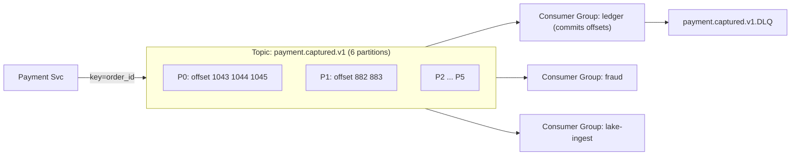
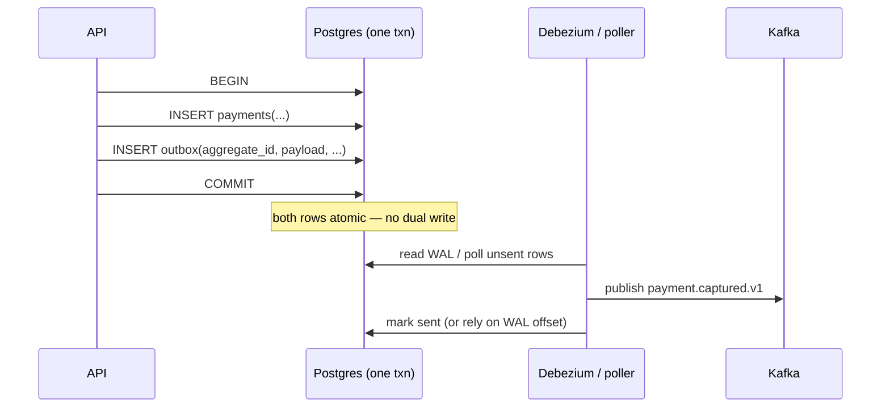

# Event-Driven Systems

> Chapter from the **Data Engineering Playbook** — distributed-systems.

## TL;DR

- An event is an immutable fact ("OrderPlaced at 14:02:11Z, order_id=A91"), not a command or a request. Once you internalize that distinction, most design arguments resolve themselves.
- Kafka gives you ordering **per partition**, not per topic. Your partition key *is* your ordering and concurrency contract — pick it before you pick anything else.
- At-least-once delivery is the default reality. Exactly-once is a property you *construct* at the consumer with idempotency keys or transactional sinks; it is never something the broker hands you for free.
- Dual writes (write to DB, then publish to Kafka) are the single most common correctness bug in event systems. The transactional outbox + CDC is the fix, not "wrap both in a try/catch."
- Schemas are the API. A Schema Registry with `BACKWARD` compatibility and a CI gate is the difference between a 6-month-old topic still working and a 3am pager about a deserialization storm.
- Consumer lag (not CPU, not throughput) is your primary health signal. If lag is flat or shrinking, the system is healthy; if it grows monotonically, you have a problem regardless of how good the dashboards look.

## Why this matters in production

Picture a payments platform. The synchronous path is: API receives a charge, writes a row to Postgres, then needs to (a) update the ledger, (b) notify the fraud service, (c) fan out to the data lake for analytics, (d) trigger a receipt email. If you wire these as synchronous RPC calls, the charge endpoint's availability is now the *product* of four downstreams' availability, its latency is the *sum*, and adding a fifth consumer means redeploying the charge service. At 11+ years of doing this, I can tell you that architecture does not survive contact with a growing org.

Flip it: the charge service writes one fact — `PaymentCaptured` — to a Kafka topic and returns. The ledger, fraud, lake-ingest, and email services each subscribe independently. The producer doesn't know they exist. Adding a sixth consumer is a new consumer group, zero changes to the producer. Fraud being down for 20 minutes means fraud's consumer lag grows to 20 minutes of backlog and then catches up — it does **not** fail the payment.

That decoupling is the entire value proposition, and it is real. But it moves the hard problems somewhere new: ordering, duplicate processing, schema drift, and "the DB committed but the event never published." The rest of this chapter is about those problems, because the happy path is trivial and the failure modes are where principal-level judgment lives.

## How it works

The mental model: producers append immutable records to a partitioned, append-only log. Consumers read at their own pace by tracking an **offset** per partition. The broker retains data by time or size, not by "has everyone read it" — so a slow consumer never blocks a producer, and a new consumer can replay from the beginning.



Three invariants do most of the work:

1. **Ordering is per-partition.** Records with the same key always land on the same partition (`partition = murmur2(key) % numPartitions`), and within a partition offsets are monotonic. Across partitions there is *no* global order. So if "all events for one order must be processed in sequence," `order_id` must be the partition key. If you key by `user_id`, two orders for the same user serialize unnecessarily; if you key by nothing (round-robin), you have no per-entity ordering at all.

2. **Offsets are the consumer's bookmark.** A consumer group's progress is `committed_offset` per partition. Lag = `log_end_offset - committed_offset`. *When* you commit relative to *when* you do the side effect determines your delivery semantics:

   | Commit timing | Crash window behavior | Semantics |
   |---|---|---|
   | Commit **before** processing | Work lost on crash | at-most-once |
   | Commit **after** processing | Reprocessed on crash | at-least-once |
   | Commit **atomically with** the sink (Kafka transactions / idempotent writes) | No visible duplicate or loss | effectively-once |

3. **Rebalancing reassigns partitions.** When a consumer joins, leaves, or dies (session timeout, `session.timeout.ms` default 45s in modern clients), the group coordinator redistributes partitions. During a stop-the-world rebalance, processing pauses. This is why a consumer doing 90-second batch writes while `max.poll.interval.ms` defaults to 300000 (5 min) is fine, but one doing a 6-minute sync call gets kicked from the group mid-batch and triggers an endless rebalance loop.

Partition count is a capacity decision you make early and regret changing: max consumer parallelism within a group equals the partition count, and **increasing partitions changes the key→partition mapping**, breaking per-key ordering for in-flight keys. Size for 2–3x headroom up front rather than resharding live.

## Deep dive

### The dual-write problem (and why outbox beats everything else)

The naive producer does this:

```python
def capture_payment(order):
    db.execute("INSERT INTO payments ...")        # 1
    db.commit()                                   # 2  <-- crash here?
    producer.send("payment.captured.v1", event)   # 3
```

If the process dies between (2) and (3), the DB has the payment but no event was ever published. The ledger never updates. There is no retry that fixes this because the in-memory `event` is gone with the dead process. Reordering the two writes just moves the failure: publish-then-commit can emit an event for a payment that rolled back.

There is no way to make two independent systems commit atomically without a distributed transaction, and you do not want 2PC across Postgres and Kafka in a payments hot path. The **transactional outbox** sidesteps it: write the business row *and* an `outbox` row in the **same local DB transaction**, then a separate relay publishes outbox rows to Kafka.



The relay is **at-least-once** (it can crash after publishing, before marking sent, and re-publish), which is exactly why consumers must be idempotent. The outbox does not give you exactly-once; it gives you "the event is published if and only if the DB committed," which is the property that was actually missing. CDC via Debezium reading the Postgres WAL is the production-grade relay — no polling load, low latency, ordered per-aggregate.

### Idempotency: the consumer's job, not the broker's

Because both the relay and consumer retries produce duplicates, every consumer that has side effects needs a dedupe strategy. Three real options:

1. **Idempotency key + dedupe table.** Each event carries a stable `event_id` (UUID generated at produce time, *not* per attempt). Consumer does `INSERT INTO processed_events(event_id) ... ON CONFLICT DO NOTHING` in the same transaction as its effect; zero rows affected means "already done, skip."
2. **Natural idempotency.** Design the effect to be safe to repeat: `UPSERT balance SET ... WHERE version = expected` or `SET state='SHIPPED' WHERE order_id=? AND state='PACKED'`. Re-applying is a no-op.
3. **Kafka EOS for Kafka→Kafka.** With `processing.guarantee=exactly_once_v2` (Kafka Streams) or the transactional producer API, the consume-process-produce loop commits the consumer offset and the output records in one transaction. This only covers Kafka sinks — it does nothing for your Postgres or S3 write.

The trap: people set `enable.idempotence=true` on the **producer** and think they're done. That flag only dedupes producer *retries* within a single producer session against a single broker — it prevents the producer from writing the same record twice on a network retry. It does nothing about consumer reprocessing after a rebalance, which is where the real duplicates come from.

### Ordering vs. parallelism — the central tension

You want both "process events for one order in order" and "process 50k events/sec across many orders." Per-partition ordering gives you exactly this if your key is the entity. The mistakes:

- Keying too coarsely (`tenant_id` for a multi-tenant SaaS) creates **hot partitions** — one big tenant pins one partition while five sit idle, and your effective throughput is one partition's worth.
- Multi-threading inside a single consumer to "go faster" silently breaks ordering, because thread B can finish record N+1 before thread A finishes record N. If you need intra-partition parallelism, use a key-aware executor (hash the key to a worker) — Confluent's parallel-consumer does exactly this with `KEY` ordering mode.

### Schema evolution

Topics outlive the code that wrote them. A `payment.captured.v1` event written today might be read by a replay job in 18 months. Schema Registry (Avro/Protobuf) enforces compatibility *before* a producer can register a new schema:

- `BACKWARD` (the sensible default): new schema can read old data → consumers upgrade first, then producers. Add fields with defaults; never remove a required field.
- `FORWARD`: old schema can read new data → producers upgrade first.
- `FULL`: both. Strictest, and what I require on regulated topics.

The failure mode without this: a producer adds a non-defaulted required field, deploys, and every consumer running the old schema throws `SerializationException` on deserialize, lands the record in retry, fails again, fills the DLQ, and lag explodes across every consumer group simultaneously. Compatibility checking in CI turns that 3am incident into a failed pull-request build.

## Worked example

A correct, idempotent, at-least-once consumer for the ledger service. Manual offset commit *after* the idempotent DB write — this is the pattern that actually holds up.

```python
from confluent_kafka import Consumer
import psycopg2

consumer = Consumer({
    "bootstrap.servers": "b-1.payments.kafka:9092",
    "group.id": "ledger-applier",
    "enable.auto.commit": False,          # we commit manually, after the write
    "auto.offset.reset": "earliest",      # never silently skip on a fresh group
    "max.poll.interval.ms": 300000,
    "session.timeout.ms": 45000,
    "isolation.level": "read_committed",  # honor producer transactions / outbox
})
consumer.subscribe(["payment.captured.v1"])

def apply_to_ledger(cur, evt):
    # Dedupe + effect in ONE transaction. event_id is stable across retries.
    cur.execute(
        "INSERT INTO processed_events (event_id) VALUES (%s) "
        "ON CONFLICT (event_id) DO NOTHING", (evt["event_id"],),
    )
    if cur.rowcount == 0:
        return False  # duplicate — effect already applied, safe to skip
    cur.execute(
        "INSERT INTO ledger_entries (order_id, amount_cents, currency, captured_at) "
        "VALUES (%(order_id)s, %(amount_cents)s, %(currency)s, %(captured_at)s)",
        evt,
    )
    return True

while True:
    msg = consumer.poll(1.0)
    if msg is None:
        continue
    if msg.error():
        log.error("kafka error", err=msg.error()); continue

    try:
        evt = deserialize(msg)  # AvroDeserializer bound to Schema Registry
    except Exception as e:
        route_to_dlq(msg, reason=str(e))            # poison pill -> DLQ, do not block
        consumer.commit(msg, asynchronous=False)    # advance past it
        continue

    conn = pg_pool.getconn()
    try:
        with conn:                       # commits on clean exit, rolls back on raise
            with conn.cursor() as cur:
                applied = apply_to_ledger(cur, evt)
        # DB txn is durably committed HERE. Only now advance the offset.
        consumer.commit(msg, asynchronous=False)
    except psycopg2.Error:
        conn.rollback()
        # offset NOT committed -> this record is redelivered -> idempotency saves us
        raise
    finally:
        pg_pool.putconn(conn)
```

The ordering that matters: **DB commit first, offset commit second.** If we crash between them, the record is redelivered, the `processed_events` insert conflicts, `apply_to_ledger` returns `False`, and we skip — no double-posting to the ledger. That is effectively-once *for this sink*, built from at-least-once delivery + idempotency.

Producer side, the outbox relay config that keeps the WAL honest:

```yaml
# Debezium connector — Postgres outbox -> Kafka
name: payments-outbox
config:
  connector.class: io.debezium.connector.postgresql.PostgresConnector
  plugin.name: pgoutput
  table.include.list: public.outbox
  transforms: outbox
  transforms.outbox.type: io.debezium.transforms.outbox.EventRouter
  transforms.outbox.route.by.field: aggregate_type      # -> topic payment.captured.v1
  transforms.outbox.table.field.event.key: aggregate_id # -> partition key
  # ordering preserved per aggregate because key = aggregate_id
```

## Production patterns

- **Topic naming as a contract:** `domain.entity.event.vN` (e.g. `payments.payment.captured.v1`). The version is in the name, not just the registry, so a breaking change is a new topic with dual-write/dual-read during migration — never an in-place mutation.
- **Dead-letter queue with structured reason and replay tooling.** A poison pill (un-deserializable record, business-rule reject) goes to `<topic>.DLQ` with headers: `original_topic`, `original_partition`, `original_offset`, `error`, `attempt_count`. Blocking the partition on one bad record halts a whole entity's stream — never do that. Ship a CLI that replays DLQ records back to the source topic after a fix.
- **Tombstones for compacted topics.** For a "latest-state-per-key" topic (`cleanup.policy=compact`), publish a record with the key and `null` value to delete that key. Forgetting tombstones is how compacted topics leak deleted entities forever.
- **Lag-based autoscaling and alerting.** Scale consumers (and alert) on `consumer_lag`, not CPU. KEDA's Kafka scaler on `lagThreshold` is the standard. Alert on *lag derivative* (growing for N minutes) plus absolute lag, so a brief spike during deploy doesn't page but a stuck consumer does.
- **Idempotent + acks=all producers everywhere.** `enable.idempotence=true`, `acks=all`, `max.in.flight.requests.per.connection<=5`. This is non-negotiable for any topic carrying business facts; the throughput cost is single-digit percent.
- **Consume from `read_committed`** so transactional/outbox events are only visible once committed, never as aborted partials.

## Anti-patterns & failure modes

| Anti-pattern | Symptom you'd observe | Fix |
|---|---|---|
| Dual write (DB then `producer.send`) | DB and downstream silently diverge; ledger missing entries that exist in `payments` | Transactional outbox + CDC relay |
| Treating producer `enable.idempotence` as end-to-end EOS | Duplicate ledger rows after every consumer rebalance | Consumer-side idempotency key + dedupe table |
| Auto-commit + slow processing | Records "processed" but lost on crash; gaps in output, no error | `enable.auto.commit=false`, commit after the side effect |
| Long blocking work inside `poll()` loop exceeding `max.poll.interval.ms` | Endless rebalance loop; lag climbs while CPU is near zero | Increase the interval, or hand work to a bounded executor and pause/resume partitions |
| Hot partition from coarse key (e.g. `tenant_id`) | One partition at 100% lag, others idle; total throughput pinned to one core | Re-key to the finer entity (`order_id`); consider a composite key |
| Adding partitions to an existing keyed topic | Out-of-order processing for in-flight keys after the change | Provision partitions up front (2–3x headroom); migrate via new topic if you must reshard |
| No schema compatibility gate | Fleet-wide `SerializationException`, all consumer groups lag at once | Schema Registry `BACKWARD`/`FULL` + CI compatibility check |
| Poison pill blocks the partition | One entity's entire stream stalls; lag grows on a single partition | Route un-processable records to DLQ and advance the offset |
| Unbounded retention "just in case" | Storage cost balloons; broker disk pressure | Time/size retention per topic; compaction for state topics |

## Decision guidance

| Use event-driven when... | Use synchronous request/response when... |
|---|---|
| Multiple independent consumers need the same fact | A caller needs an answer *now* to proceed (e.g. auth check) |
| Producer and consumers evolve/deploy independently | Strong, immediate read-after-write within one transaction |
| Bursty load you want to buffer and smooth | Sub-10ms p99 with no buffering tolerance |
| You need replay / audit / rebuild from history | Simple CRUD with one reader and one writer |
| Fan-out and temporal decoupling are the point | The added eventual-consistency cost isn't worth it |

Tooling within event-driven:

| Need | Reach for | Avoid |
|---|---|---|
| High-throughput durable log, replay, many consumers | **Kafka** | A DB-backed queue at scale |
| Per-message ack, visibility timeout, no ordering needed | SQS / RabbitMQ | Kafka for fine-grained per-message retry semantics |
| Stateful stream processing, joins, EOS Kafka→Kafka | Kafka Streams / Flink | Hand-rolled stateful consumers |
| DB-to-event with correctness | Debezium outbox (CDC) | Application-level dual writes |

Eventual consistency is the price. If "the ledger reflects the payment within ~1 second, and exactly once it converges" is acceptable, event-driven wins. If you need the ledger updated *synchronously inside the charge transaction*, that's one bounded context and a local transaction, not an event.

## Interview & architecture-review talking points

- **"Walk me through exactly-once."** Lead with: the broker gives at-least-once; exactly-once is constructed at the sink. Then: producer idempotence dedupes retries, the outbox guarantees publish-iff-committed, the consumer idempotency key guarantees no double-apply. Name where Kafka transactions help (Kafka→Kafka) and where they don't (external sinks). If a candidate says "Kafka does exactly-once for you," that's a flag.
- **"How do you keep ordering while scaling?"** Per-partition ordering; key = the entity that requires order; partition count = max parallelism; never multi-thread within a partition without a key-aware executor; never reshard a keyed topic in place.
- **"What's the failure mode of a dual write, precisely?"** Crash between commit and publish → durable divergence with no retry that recovers it. The reason outbox exists.
- **"How do you size partitions?"** Target throughput / per-partition throughput, with 2–3x headroom, and acknowledge that increasing later breaks key locality — so I provision up front.
- **"What do you monitor?"** Consumer lag and its derivative first; DLQ rate; rebalance frequency; end-to-end produce→consume latency. CPU is a distant secondary.
- **Defending eventual consistency to a skeptical reviewer:** name the bounded contexts, show that no single business invariant spans two services synchronously, and show the convergence path + idempotency that makes "eventually" deterministic rather than hopeful.

## Further reading

- [Consistency Models](../consistency-models/README.md) — what "eventual" actually guarantees and the read-your-writes nuances behind async fan-out.
- [CAP Theorem](../cap-theorem/README.md) — why an available, partition-tolerant log makes the consistency tradeoff you're now managing at the consumer.
- [Consensus](../consensus/README.md) — how Kafka's controller/ISR replication keeps the log durable and ordered under broker failure.
- [Kafka chapter](../../kafka/README.md) — broker internals, ISR, and producer/consumer tuning referenced throughout.
- [Data Quality](../../data-quality/README.md) — DLQ triage, contract testing, and validating event payloads at ingest.
- Martin Kleppmann, *Designing Data-Intensive Applications*, Ch. 11 ("Stream Processing") — the canonical treatment of logs, change capture, and exactly-once.
- Confluent, ["Exactly-Once Semantics in Apache Kafka"](https://www.confluent.io/blog/exactly-once-semantics-are-possible-heres-how-apache-kafka-does-it/) and the Debezium Outbox Event Router documentation.
