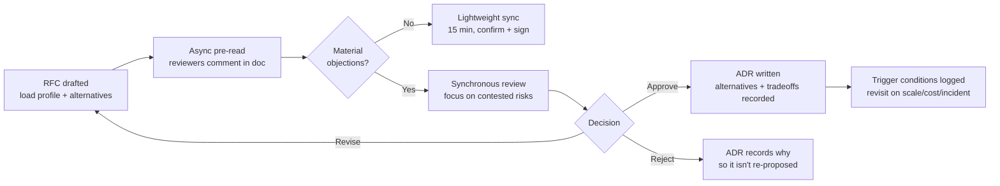

# Architecture Reviews

> Chapter from the **Data Engineering Playbook** — engineering-leadership.

An architecture review is the most leveraged hour a principal engineer spends all week. It is the only point in the lifecycle where a design is still cheap to change and expensive mistakes are still hypothetical. Done well, it converts a vague RFC into a load-bearing decision the team can build against for two years. Done badly, it becomes a rubber-stamp meeting where the loudest person ships the riskiest design. This chapter is about running them so they do the former.

## TL;DR

- A review is a **risk-reduction transaction**, not an approval ceremony. The output is a list of de-risked assumptions plus an [ADR](../decision-records/README.md), not a thumbs-up.
- Review the **failure modes and the reversibility of the decision**, not the happy path. Happy paths demo fine; they never page you at 3am.
- Force the author to state the **load profile in numbers** (events/sec, GB/day, p99 read latency, cardinality) before anyone debates technology. Most arguments dissolve once the numbers are on the table.
- Separate **one-way doors from two-way doors** (Bezos's framing). Spend 80% of the review on the one-way doors — schema contracts, partition keys, storage format, the streaming/batch boundary — because those are the ones you cannot cheaply undo.
- A review without a **written record of the rejected alternatives** is worthless six months later when someone asks "why didn't we just use Postgres?"
- The reviewer's job is to **surface the questions the author didn't think to ask**, not to redesign the system in the room.

## Why this matters in production

Concrete scenario. A team proposes a "real-time customer activity" pipeline: Kafka → Spark Structured Streaming → a Delta table queried by a dashboard. The RFC is two pages, the diagram is clean, the demo works on 1,000 events. It ships.

Three months later: the activity topic is doing 40k events/sec at peak, the streaming job is partitioned by `event_date` only, so every micro-batch writes ~3,000 files of ~2 MB each into the same partition. The dashboard now scans 2.6 million small files, p99 query latency is 90 seconds, and the `OPTIMIZE` job that was supposed to compact them can't keep up because it competes with the writer for the same partition's metadata. The streaming checkpoint has also silently been retaining 14 days of `_delta_log` because nobody set `delta.logRetentionDuration`. Storage cost on the metadata alone is now a line item.

Every one of those failures was visible in the original design — *if anyone had asked for the numbers and traced the file-count math*. None of them showed up in the demo. The architecture review is the forum that exists specifically to catch the gap between "works on my laptop" and "survives 40k events/sec for a year." The cost of catching it at review time is one engineer-hour. The cost of catching it in production is a re-platforming project and an exec asking why the dashboard is down.

The principal-level insight: reviews aren't about whether the design *can* work. Almost any design can work at small scale. They're about whether it **degrades predictably** and whether the **expensive decisions are reversible**.

## How it works

A healthy review is a pipeline, not a meeting. The meeting is one stage of it, and often the least important.



The non-obvious mechanics:

1. **Async pre-read does most of the work.** If reviewers read the RFC cold in the meeting, you get reaction, not analysis. The doc should circulate 48 hours ahead with reviewers leaving inline comments. By meeting time, the trivial objections ("you spelled the topic name wrong") are resolved and only the contested risks remain.

2. **The author owns the numbers.** A review can't start until the RFC contains the load profile. I treat "we expect moderate volume" as an automatic send-back. Moderate is not a number.

3. **The decision is classified by reversibility before it's debated.** A two-way door (which compute instance type, which dashboard tool) gets minutes. A one-way door (partition key, event schema, the batch/streaming boundary, the system of record) gets the hour. The most common review failure is spending equal time on everything.

### One-way vs two-way doors

The reversibility cost is roughly the blast radius of changing the decision after it has dependents:

```
cost_to_reverse ≈ (# downstream consumers) × (data already written under old design) × (contract rigidity)
```

A partition key change on a 200 TB Iceberg table with 14 consumer teams is a near-infinite-cost reversal — it requires a full rewrite plus coordinated migration of every reader. That's a one-way door, and it deserves the deepest scrutiny in the review. Choosing `r6g.2xlarge` vs `r6g.4xlarge` is a config change with zero downstream contract — debate it for thirty seconds and move on.

## Deep dive

This is the part engineers get wrong, ranked by how often I see it.

### 1. Reviewing the diagram instead of the contracts

Boxes and arrows lie. The arrow labeled "Kafka → Spark" hides every question that actually matters: What's the schema and who owns it? Is it Avro with a registry and `BACKWARD` compatibility enforced, or JSON that anyone can break? What's the partitioning key on the topic, and does it match the join key downstream (or does every join trigger a full shuffle)? What's the delivery guarantee — at-least-once with idempotent writes, or are you assuming exactly-once you didn't configure?

The discipline: for every arrow, demand the **contract**. Schema, ownership, compatibility policy, delivery semantics, and the SLA. A review that approves a diagram without contracts has approved nothing. See [event design](../../kafka/event-design/README.md) and [exactly-once](../../kafka/exactly-once/README.md) for the contract details worth interrogating.

### 2. Not tracing the small-files / shuffle math

The single most predictable data-engineering failure is small files, and it is fully computable at review time. If a streaming job writes every 30 seconds with 200 shuffle partitions, that's `200 files × 2 × 60 × 24 = 576,000` files/day per partition column value before compaction. Ask the author to do this multiplication in the room. If they can't, they haven't designed the write path; they've drawn it.

Same for shuffle. If the design joins a 5 TB fact against a 5 TB dimension on a non-colocated key, that's a 10 TB shuffle every run. Ask whether the dimension can be broadcast (see [broadcast-join](../../spark-internals/broadcast-join/README.md)), whether the tables can be bucketed on the join key, or whether [AQE](../../spark-internals/aqe/README.md) skew handling is even enabled. These are review questions, not tuning questions — the *structure* of the join is set at design time.

### 3. Ignoring the boundary between streaming and batch

The streaming/batch boundary is the most expensive one-way door in data platforms and the one teams cross most casually. "We'll make it real-time" usually means: a checkpoint to operate, watermark/late-data semantics to reason about, a stateful store to size, and an on-call rotation. Most "real-time" requirements are actually "fresh within 5 minutes," which a micro-batch every 2 minutes satisfies at a fraction of the operational cost. The review must force the question: *what is the actual freshness SLA, in minutes, and what does the business lose at 10 minutes vs 2?* If nobody can answer, you don't have a real-time requirement, you have a real-time aspiration. Push back. (Related: [event-driven-systems](../../distributed-systems/event-driven-systems/README.md).)

### 4. Hand-waving consistency and ordering

When the design touches more than one storage system, the consistency model is a first-class review topic, not an implementation detail. "We write to Kafka and to the warehouse" — are those two writes atomic? (They aren't.) What happens when the second one fails? Is there a reconciliation job, or will the two systems silently diverge? The number of "data doesn't match" incidents that trace back to a dual-write nobody flagged at review is large. Make the author draw the failure case. See [consistency-models](../../distributed-systems/consistency-models/README.md) and [reconciliation](../../data-quality/reconciliation/README.md).

### 5. Backfill and reprocessing as an afterthought

Every pipeline gets backfilled — because the logic had a bug, because a column was added, because a year of history is needed for a new model. If the design can only run forward, you've shipped a pipeline that can't be fixed. Review question: *how do we reprocess 90 days without double-counting and without taking the live path down?* The good answers are idempotent writes keyed on a natural+batch key, partition-overwrite (`replaceWhere` / dynamic partition overwrite), or Iceberg snapshot replacement. The bad answer is silence.

### 6. The cost model is missing

A design without a cost estimate is a blank check. I ask for a back-of-envelope: GB scanned per query × queries/day × $/TB, plus compute hours × instance cost, plus storage growth/month. It doesn't need to be precise; it needs to exist, because an order-of-magnitude error (a full-scan dashboard, an un-pruned partition scheme) is usually visible in the estimate. Cost is an architecture property, not a billing surprise. See [cost-attribution](../../finops/cost-attribution/README.md) and [capacity-planning](../../finops/capacity-planning/README.md).

## Worked example

Here's the artifact I expect attached to a review — a structured RFC skeleton plus the load-profile and file-math computation the author should bring. The point is that the math is *in the doc*, computed, before the meeting.

````markdown
# RFC: Customer Activity Aggregates

## 1. Problem & freshness SLA
- Surface per-customer rolling 7-day activity counts to the support console.
- Freshness SLA: aggregates must be ≤ 5 min stale at p95. NOT real-time.
- Decision class: ONE-WAY (defines the activity event schema + table partition key).

## 2. Load profile (NUMBERS REQUIRED)
| Metric                     | Steady | Peak  |
|----------------------------|--------|-------|
| activity events/sec        | 8,000  | 40,000|
| avg event size             | 1.1 KB | 1.1 KB|
| ingest GB/day              | ~760   | —     |
| distinct customer_id (card)| 12 M   | —     |
| console reads/day          | 90,000 | —     |

## 3. Chosen design
Kafka (Avro, schema registry, BACKWARD compat) -> Spark Structured Streaming,
2-min trigger -> Iceberg table partitioned by (event_date, bucket(customer_id, 64)).

## 4. Rejected alternatives
- Partition by event_date only -> REJECTED: single-partition hotspot, small files (math below).
- Continuous (real-time) trigger -> REJECTED: no business value below 5 min; doubles ops cost.
- Postgres rollup table -> REJECTED: 760 GB/day ingest exceeds single-node write budget.
````

The file-count math the reviewer should make the author show:

```python
# Why event_date-only partitioning was rejected, computed in the RFC.
trigger_seconds      = 120          # 2-min micro-batch
shuffle_partitions   = 64           # spark.sql.shuffle.partitions for this job
batches_per_day      = 86_400 / trigger_seconds        # 720

# event_date ONLY -> all files land in ONE partition value per day
files_per_day_flat   = batches_per_day * shuffle_partitions
print(files_per_day_flat)          # 46,080 files in a single partition, per day

# With bucket(customer_id, 64) the same files spread across 64 buckets,
# AND we can target-size with Iceberg write properties so compaction keeps up.
files_per_bucket_day = files_per_day_flat / 64
print(files_per_bucket_day)        # 720 -> compactable; readers prune by bucket
```

The Iceberg write + maintenance config that makes the chosen design hold up, which the review should explicitly approve:

```sql
ALTER TABLE analytics.customer_activity SET TBLPROPERTIES (
  'write.target-file-size-bytes' = '536870912',   -- 512 MB target, kills small files
  'write.distribution-mode'      = 'hash',         -- align write shuffle to partition spec
  'commit.manifest.target-size-bytes' = '8388608',
  'history.expire.max-snapshot-age-ms' = '604800000'  -- 7 days; bound metadata growth
);

-- Compaction the review must confirm is scheduled, not assumed:
CALL catalog.system.rewrite_data_files(
  table => 'analytics.customer_activity',
  options => map('target-file-size-bytes','536870912','min-input-files','5')
);
```

The corresponding Spark job knobs the review checks are set (not defaults):

```python
spark.conf.set("spark.sql.adaptive.enabled", "true")
spark.conf.set("spark.sql.adaptive.skewJoin.enabled", "true")
spark.conf.set("spark.sql.shuffle.partitions", "64")
spark.conf.set("spark.sql.streaming.minBatchesToRetain", "20")  # bound checkpoint growth
# Iceberg metadata retention, the thing the opening scenario forgot:
spark.conf.set("spark.sql.catalog.analytics.write.metadata.delete-after-commit.enabled", "true")
spark.conf.set("spark.sql.catalog.analytics.write.metadata.previous-versions-max", "20")
```

A reviewer reading this RFC can sign it in fifteen minutes because the author already did the load math, classified the decision, and recorded why the obvious alternatives lose. That is what "review-ready" means.

## Production patterns

Patterns specific to running architecture reviews, not generic engineering advice.

- **The pre-read gate.** No load profile, no review. Bounce the doc back automatically. This single rule eliminates most of the low-value debate, because half of bad designs don't survive contact with their own numbers.
- **Reviewer pre-assignment by failure domain.** Assign reviewers to *risks*, not to "the design." One reviewer owns the schema/contract question, one owns cost, one owns the operational/on-call burden. Diffuse responsibility ("everyone please review") produces shallow reviews where everyone assumes someone else checked the hard part.
- **Time-box by reversibility, in the agenda.** Literally write on the agenda: "Partition key — 25 min. Instance type — 3 min." Make the allocation visible so the room doesn't bikeshed the easy stuff.
- **The "draw the failure" rule.** For any external dependency or dual-write, the author must walk through what happens when it fails mid-operation. If they can't, that's the finding.
- **Decisions ship with trigger conditions.** Every approval records what would invalidate it: "revisit if events/sec exceeds 60k, if monthly cost exceeds $X, or after any data-divergence incident." This turns the [ADR](../decision-records/README.md) into a living tripwire instead of a tombstone.
- **A standing "boring default" menu.** Maintain a list of the org's blessed defaults (Iceberg + Glue catalog, Avro + registry, micro-batch over continuous, etc.). New designs justify *deviations* from the menu, which shrinks every review to "why are you different here?" — the only interesting question.

## Anti-patterns & failure modes

| Anti-pattern | Symptom you'll observe | Fix |
|---|---|---|
| Rubber-stamp review | Every RFC approved in <10 min; production incidents traced to "approved" designs | Require a written list of *rejected alternatives*; if there are none, the author didn't consider any |
| Redesign-in-the-room | Reviewers propose a brand-new architecture during the meeting; author leaves demoralized with no decision | Reviewer's job is to surface questions, not author a competing design; take big alternatives offline |
| No load profile | "Should scale fine"; later, p99 latency and small-file blowups in prod | Hard gate: numbers in the doc or no review |
| All decisions weighted equally | 40 min on instance types, 5 min on the partition key | Classify one-way vs two-way doors up front; time-box accordingly |
| Decisions with no owner of the record | Six months later: "why did we choose this?" — nobody knows | Output is always an [ADR](../decision-records/README.md) with context and tradeoffs, not a Slack thumbs-up |
| HiPPO override | Most senior person's preference wins regardless of the numbers | Decisions cite the load profile and cost estimate; opinions that contradict the data must say why |
| Approving without operability | Design ships, then nobody can backfill / has no runbook / no alerting | Operability is a review line item: backfill story, on-call burden, failure visibility |
| Review theater for two-way doors | Heavyweight process applied to trivially reversible config | Reversible decisions get a lightweight async sign-off, not a meeting |

The most insidious failure mode is the **silent dual-write divergence** (anti-pattern #5 from the deep dive surfacing in prod): two systems written non-atomically, no reconciliation, and the discrepancy only discovered when a customer disputes a number. It never shows up in testing because both writes succeed in the happy path. The only place to catch it is the review, by forcing the author to draw the mid-write failure.

## Decision guidance

How heavy a review does a given change need? Match the process to the blast radius.

| Change | Door type | Review weight | Output |
|---|---|---|---|
| New system of record / new event schema | One-way | Full sync review, multiple failure-domain reviewers | ADR + trigger conditions |
| Partition key / storage format / batch↔streaming boundary | One-way | Full sync review, deep file-math + cost scrutiny | ADR + alternatives recorded |
| New consumer of an existing contract | Mostly two-way | Async pre-read, lightweight sign-off | Note in existing ADR |
| Compute sizing, dashboard tool, retry tuning | Two-way | Self-serve or single async approval | Commit message / PR |
| Bugfix within an approved design | None | Standard code review | PR |

Rule of thumb: **the deeper the contract and the more consumers depend on it, the heavier the review.** A schema or partition decision with 14 downstream teams is the heaviest review you'll run all quarter; a retry-count tweak is a PR comment. When unsure, ask "if this is wrong, how many teams have to coordinate to undo it?" — the answer is your review weight.

## Interview & architecture-review talking points

What a principal says when defending how they run reviews:

- "I gate the review on a load profile. If the RFC says 'moderate volume' instead of events/sec and GB/day, it goes back. Most bad designs don't survive their own arithmetic, and I'd rather find that out in the doc than in PagerDuty."
- "I spend the review budget on the irreversible decisions. Instance type is a config change; the partition key on a 200 TB table is a re-platforming project. Equal time on both is malpractice."
- "For every arrow in the diagram I ask for the contract — schema, owner, compatibility policy, delivery semantics. Diagrams hide exactly the things that cause incidents."
- "The deliverable isn't approval, it's a de-risked design plus an ADR that records the rejected alternatives and the conditions that would make us revisit. Six months later that record is the difference between a decision and a mystery."
- "I make the author draw the failure case for any dual-write or external dependency. The happy path always works in the demo; I'm reviewing what happens at 40k events/sec when the second write fails."
- "A review where nothing changed and nothing was rejected wasn't a review. Either we found risk and reduced it, or we wasted an hour."

## Further reading

- [Decision Records](../decision-records/README.md) — the durable output of every review; how to record context and supersede cleanly.
- [Technical Strategy](../technical-strategy/README.md) — how individual review decisions roll up into a coherent platform direction.
- [Roadmaps](../roadmaps/README.md) — sequencing the one-way-door decisions so you don't paint the platform into a corner.
- [Event Design](../../kafka/event-design/README.md) and [Exactly-Once](../../kafka/exactly-once/README.md) — the contract details a review must interrogate.
- [Consistency Models](../../distributed-systems/consistency-models/README.md) and [Reconciliation](../../data-quality/reconciliation/README.md) — for the dual-write / divergence failure mode.
- [Capacity Planning](../../finops/capacity-planning/README.md) and [Cost Attribution](../../finops/cost-attribution/README.md) — putting the cost model into the review.
- External: Werner Vogels / Jeff Bezos on **one-way vs two-way door decisions** (Amazon 2015–2016 shareholder letters). Michael Nygard, *"Documenting Architecture Decisions"* (2011) — the original ADR pattern.
