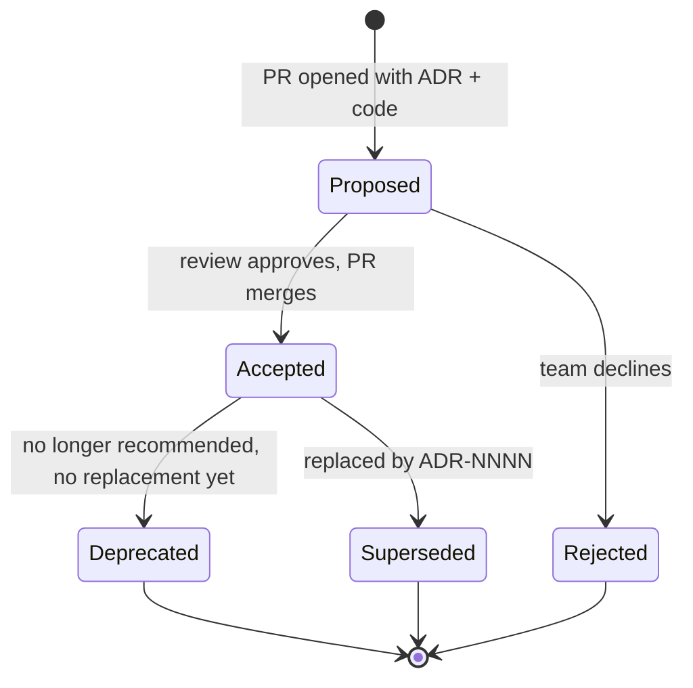

# Architecture Decision Records

> Chapter from the **Data Engineering Playbook** — engineering-leadership.

## About This Chapter

**What this is.** An Architecture Decision Record (ADR) is a short, permanent document that captures one significant decision and the context future engineers can no longer reconstruct. This chapter covers how to write, store, and enforce them on a data platform.

**Who it's for.** Mid-level data engineers, platform and architecture leads, engineering managers and tech leads, and engineers preparing for senior or staff data-engineering interviews.

**What you'll take away.** By the end you'll be able to:
- Write focused, append-only ADRs (documents you add to but never change) whose value lies in recording what was rejected and why — along with measurable triggers for when to revisit the decision.
- Apply the "cost of reversal" filter to decide what warrants an ADR, and replace outdated records cleanly using bidirectional links instead of editing accepted ones.
- Keep ADRs useful in the repo with a CI linter (an automated check that runs on every pull request), an auto-generated index, and a gate that blocks expensive changes from merging silently.

---

An Architecture Decision Record (ADR) is a short, permanent document that captures one architecturally significant decision, the forces that shaped it, and the consequences the team accepted. The value is not the decision itself — it's the *context* that future engineers can no longer reconstruct.

## TL;DR

- An ADR records **one** decision with its **alternatives, forces, and consequences**. If a record needs an "and" in its title, it's two ADRs.
- ADRs are **immutable and append-only** (you add new records; you never change old ones). You never edit an `Accepted` ADR; you supersede it with a new one and leave a link in both directions. Git history is the audit trail.
- The expensive thing to lose is the *negative space*: which options were rejected and *why*. The outcome is visible in the codebase; rejected alternatives are not.
- ADRs live **in the repo next to the code** (`docs/adr/NNNN-*.md`), reviewed in the same pull request as the change. A decision that lands without a code change is suspect.
- The trigger for writing an ADR is **cost of reversal**, not seniority or formality. If undoing the decision means a migration, a re-platform, or a breaking schema change, write the ADR.
- ADRs only stay useful if they're **discoverable and queried** — an index, a linter in CI, and links from the code that implements them.

## Why this matters in production

Eighteen months ago someone on the platform team chose Iceberg copy-on-write (a write mode where every update rewrites the affected data files immediately) over merge-on-read (a write mode that records changes cheaply and merges them at query time) for the `orders_fact` table. Today MERGE jobs on that table take 40 minutes and rewrite 60% of the table's Parquet files on every late-arriving correction. A new engineer looks at it and the obvious move is "switch to merge-on-read." That instinct is wrong, and the only thing standing between them and a multi-week regression is whether someone wrote down *why* copy-on-write was chosen.

In the real case described here, the answer was: the table is read by 200+ downstream Trino queries with strict p95 latency SLAs (service level agreements defining acceptable response times), and merge-on-read's read-time merge of delete files blew the latency budget. The team accepted slow writes to protect fast reads. That sentence is invisible in the code. It lives in the ADR or it lives nowhere.

The failure mode without ADRs is predictable:

- **Decisions get re-litigated.** The same Kafka-vs-Kinesis debate happens every other quarter because nobody can find the conclusion or the constraints that drove it.
- **Reversal by accident.** Someone "cleans up" a config (`spark.sql.adaptive.coalescePartitions.enabled=false`, set deliberately to keep file counts stable for an Iceberg-compacted table) and reintroduces the small-files problem it was guarding against.
- **Onboarding takes a quarter.** New seniors spend their first three months reverse-engineering intent from code that only encodes the *what*, never the *why*.
- **Blameless postmortems aren't.** When a decision causes an incident and there's no record of the tradeoff, the discussion turns to who, not what.

ADRs are the cheapest insurance a data platform buys. A record costs 30 minutes to write and saves weeks of rediscovery.

## How it works

An ADR is a small state machine (a document that moves through defined statuses in one direction). A decision moves through statuses, and the document is immutable once it leaves `Proposed`.



The canonical template (Michael Nygard's format, lightly extended for data platforms):

```markdown
# ADR-0042: Use copy-on-write for orders_fact Iceberg table

- **Status:** Accepted
- **Date:** 2025-09-14
- **Deciders:** @sharath, @data-platform, @analytics-eng
- **Supersedes:** —
- **Superseded by:** —
- **Tags:** iceberg, table-format, read-latency

## Context
orders_fact is queried by 200+ Trino dashboards with a p95 < 2s SLA.
Corrections arrive late (up to 14 days) via a CDC stream, so we MERGE
~0.5% of rows daily. We must pick a write mode that does not regress reads.

## Decision
Use copy-on-write (write.merge.mode=copy-on-write). Accept full file
rewrites on MERGE; protect read latency by never producing delete files
that Trino must reconcile at query time.

## Alternatives considered
- merge-on-read: cheaper writes, but read-time delete-file merge pushed
  Trino p95 from 1.8s to 4.3s in the spike test on a 2TB table.
- Partition-overwrite nightly batch: simpler, but breaks the 14-day
  late-correction requirement and doubles storage churn.

## Consequences
- (+) Read p95 stays under SLA; no delete-file compaction job needed.
- (-) MERGE jobs rewrite ~60% of touched partitions; 40-min runtime.
- (-) Revisit if late-correction volume exceeds ~5% of daily rows.

## Revisit triggers
- MERGE runtime > 90 min, OR
- daily correction volume > 5% of rows, OR
- Iceberg adds positional-delete read pruning that closes the latency gap.
```

The two structural rules that make this work:

1. **Numbering is monotonic and never reused.** `ADR-0042` always points at the same decision forever, even after it's superseded. Cross-references stay stable.
2. **Supersession is bidirectional.** When `ADR-0061` replaces `ADR-0042`, you set `Superseded by: ADR-0061` on the old one *and* `Supersedes: ADR-0042` on the new one. A reader landing on either record can navigate to the current state.

The "architecturally significant" filter is the hard part. A useful definition: a decision is significant if it affects structure, non-functional characteristics (like performance or reliability), dependencies, interfaces, or construction techniques — *and* it is expensive to reverse. For data platforms, the practical test is a single question: **does undoing this require a migration?** Choosing Iceberg over Delta: yes, write an ADR. Choosing the variable name for a UDF (user-defined function): no. Choosing `numToString` vs a 4-byte hash for a partition key on a 50TB table: yes — repartitioning that table is a weekend of work.

## Deep dive

### Immutability is the entire mechanism, and it's the most violated rule

The single most common ADR failure is treating the file as a living document. Someone learns the decision was wrong, opens the ADR, and edits the Decision section. Now the record lies: it claims the team chose X for reasons Y, when actually the team later chose Z. Every reader after that point inherits a falsified history.

The rule: **an `Accepted` ADR is frozen.** New information produces a new ADR that supersedes the old one. The old one stays exactly as written, with its status flipped to `Superseded` and a forward link added. This is the same discipline as event sourcing (a pattern where you record every change as a new event rather than overwriting old state) — you append a correcting event, you don't mutate the past.

The one exception: you may edit the **Status** field and the **Superseded by** link, because those are metadata about the record's lifecycle, not the decision itself.

### Negative space is the part everyone skips, and it's the only part with long-term value

Junior ADRs read: "We chose Kafka." That's worthless in two years — anyone can see Kafka in the repo. The senior version reads: "We chose Kafka over Kinesis *because* we needed log compaction (a feature that keeps only the latest value per key in a topic) for the changelog topics and more than 7-day retention for replay, both of which Kinesis caps; we accepted operating our own brokers as the cost." The rejected option plus the reason is what stops the next person from "improving" the system by switching to the thing the team already evaluated and ruled out.

A test to apply in review: **if you delete the Alternatives and Consequences sections, is the ADR still worth keeping?** If yes, it's not an ADR — it's a code comment that wandered into a markdown file.

### Granularity: one decision, one record

The failure signature of bad granularity is the "Q3 Platform Decisions" ADR that bundles eight unrelated choices. When choice #3 gets superseded, you can't supersede a third of a document — so either the whole thing rots or you never revisit it. Keep them atomic (one decision per record). The cost of many small ADRs (a long index) is far cheaper than the cost of entangled ones (a history you can't revise cleanly).

### ADRs vs RFCs — they are different artifacts with different lifecycles

Teams conflate these constantly. An **RFC** (Request for Comments) is the *forward-looking proposal* used to reach a decision — it's a discussion document, it has comments, it changes during review, and it can be 12 pages. An **ADR** is the *backward-looking record* of what was decided — it's short, immutable, and written *after* the discussion converges. The clean pipeline is: RFC → review forum → ADR. The RFC captures the deliberation; the ADR captures the verdict. You can link an ADR to its originating RFC, but you don't replace one with the other. The review is the forum, the ADR is its durable output.

### Where they physically live

| Location | Pros | Cons | Verdict |
|---|---|---|---|
| `docs/adr/` in the same repo | Versioned with the code, reviewed in the same PR, survives team churn | Hard to see cross-repo decisions | **Default** for service- and pipeline-local decisions |
| Central `architecture-decisions` repo | One index for org-wide bets (table format, cloud, streaming bus) | Drifts from code; nobody opens it | Use **only** for cross-cutting platform decisions |
| Wiki / Confluence | Easy to write | No diff, no PR review, no immutability guarantee, link-rot | **Avoid** — wikis are mutable by design, which breaks the core invariant |

The recommended pattern: local decisions in `docs/adr/` of the owning repo; truly cross-cutting decisions (table format choice, the org's consistency model) in a single platform-wide ADR repo, with local ADRs linking up to them.

### Discoverability or death

An ADR nobody can find is a private diary. Three things keep them alive:

- **An index** (`docs/adr/README.md`) generated from front-matter (the structured metadata block at the top of each file), listing number, title, status, and date. `adr-tools` or a 20-line script does this.
- **Links from code.** The deliberate `write.merge.mode=copy-on-write` line gets a comment: `# see docs/adr/0042`. The decision and its rationale are one click apart.
- **A CI check** that fails the build if a pull request touches a "significant" path (table DDL, Terraform infrastructure config, the Kafka topic config) without adding or referencing an ADR.

## Worked example

A repo-local ADR with machine-readable front-matter, plus the CI linter that keeps the index honest and forces an ADR on significant changes.

`docs/adr/0042-orders-fact-copy-on-write.md`:

```markdown
---
id: 0042
title: Use copy-on-write for orders_fact Iceberg table
status: Accepted
date: 2025-09-14
deciders: [sharath, data-platform, analytics-eng]
supersedes: null
superseded_by: null
tags: [iceberg, table-format, read-latency]
---
# ADR-0042: Use copy-on-write for orders_fact Iceberg table
... (Context / Decision / Alternatives / Consequences / Revisit triggers)
```

A linter that runs in CI — it validates the state machine and regenerates the index so the two never drift:

```python
# tools/adr_lint.py  — run in CI on every PR
import sys, re, glob, pathlib
import yaml  # PyYAML

ADR_DIR = pathlib.Path("docs/adr")
VALID_STATUS = {"Proposed", "Accepted", "Rejected", "Deprecated", "Superseded"}

def load(path):
    text = path.read_text()
    fm = re.match(r"^---\n(.*?)\n---\n", text, re.S)
    if not fm:
        sys.exit(f"{path}: missing YAML front-matter")
    return yaml.safe_load(fm.group(1))

def main():
    records, errors = {}, []
    for p in sorted(ADR_DIR.glob("[0-9][0-9][0-9][0-9]-*.md")):
        meta = load(p)
        n = meta["id"]
        if n in records:
            errors.append(f"duplicate ADR id {n}")
        records[n] = (p, meta)
        if meta["status"] not in VALID_STATUS:
            errors.append(f"ADR-{n}: invalid status {meta['status']!r}")

    # supersession must be bidirectional and consistent
    for n, (p, meta) in records.items():
        sb = meta.get("superseded_by")
        if sb is not None:
            if meta["status"] != "Superseded":
                errors.append(f"ADR-{n}: has superseded_by but status != Superseded")
            target = records.get(sb)
            if not target:
                errors.append(f"ADR-{n}: superseded_by {sb} does not exist")
            elif target[1].get("supersedes") != n:
                errors.append(f"ADR-{n}<->{sb}: supersession link not bidirectional")

    if errors:
        print("\n".join(errors)); sys.exit(1)

    # regenerate the index; CI fails if it would change (drift detection)
    lines = ["# Architecture Decision Records\n", "| ADR | Title | Status | Date |", "|---|---|---|---|"]
    for n in sorted(records):
        _, m = records[n]
        lines.append(f"| [ADR-{n:04d}]({n:04d}-{slug(m['title'])}.md) | {m['title']} | {m['status']} | {m['date']} |")
    index = ADR_DIR / "README.md"
    new = "\n".join(lines) + "\n"
    if index.read_text() != new:
        index.write_text(new)
        sys.exit("ADR index was stale; regenerated. Commit docs/adr/README.md and re-push.")

def slug(t):  # mirror the filename convention
    return re.sub(r"[^a-z0-9]+", "-", t.lower()).strip("-")

if __name__ == "__main__":
    main()
```

The "significant path" gate, as a GitHub Actions step:

```yaml
# .github/workflows/adr.yml
- name: Require ADR for significant changes
  run: |
    CHANGED=$(git diff --name-only origin/main...HEAD)
    SIGNIFICANT=$(echo "$CHANGED" | grep -E '(ddl/.*\.sql|infra/.*\.tf|topics/.*\.yaml)' || true)
    ADR_TOUCHED=$(echo "$CHANGED" | grep -E 'docs/adr/[0-9]{4}-' || true)
    if [ -n "$SIGNIFICANT" ] && [ -z "$ADR_TOUCHED" ]; then
      echo "::error::Changed table DDL / infra / topic config without an ADR."
      echo "Add docs/adr/NNNN-*.md or reference an existing one in the PR body."
      exit 1
    fi
```

This is deliberately a *soft* gate in spirit — a reviewer can override by referencing an existing ADR number in the PR body — but the default is "no significant change lands silently."

## Production patterns

- **Write the ADR in the same PR as the change.** Reviewers approve the rationale and the implementation together. An ADR written a week later is archaeology, and it shows — the forces get sanitized in hindsight.
- **Record revisit triggers, not just the decision.** Every consequence with a "-" sign should have a measurable threshold that flips the decision (`MERGE > 90 min`, `correction volume > 5%`). This turns ADRs from prose into a tripwire you can wire into monitoring.
- **Supersede loudly.** When you replace an ADR, the new one's Context opens with "Supersedes ADR-0042 because the late-correction volume crossed 5% in Q1." The reader sees the causal chain.
- **Keep an "ADR-0001: Record architecture decisions."** The first ADR in every repo is the meta-decision to use ADRs at all, in the chosen format. It's the bootstrapping record and it sets the template.
- **Tag for query.** Front-matter tags (`iceberg`, `kafka`, `cost`) let you answer "what have we decided about table formats across all teams?" with `grep` or a tiny index. A `cost` tag is especially useful during FinOps (financial operations and cloud cost optimization) reviews.
- **Link ADRs from postmortems.** When an incident traces back to a decision, the postmortem links the ADR and — if the decision was wrong — files the superseding ADR as a remediation item. This closes the loop between incidents and architecture.

## Anti-patterns & failure modes

| Anti-pattern | Symptom you observe | Fix |
|---|---|---|
| Editing an Accepted ADR in place | Git blame shows the Decision section rewritten months after merge; readers act on stale rationale | Freeze on `Accepted`; supersede with a new numbered ADR |
| Omitting alternatives | "We chose Spark Structured Streaming." No mention of Flink. Team re-evaluates Flink every year | Mandate an Alternatives section; reject the ADR in review if it's empty |
| ADR-as-essay | 3,000-word documents nobody reads; decision buried in paragraph 9 | One decision per ADR, ~1 page, decision in the first 200 words |
| Bundling decisions | "Q3 Platform Decisions" with 8 choices; can't supersede one without orphaning the rest | Atomic ADRs, one decision each |
| Status never updated | Repo full of `Accepted` ADRs, several contradict current code | CI linter cross-checks supersession links; quarterly status sweep |
| Wiki home | ADRs in Confluence, mutable, no diff, link-rot to dead pages | Move to `docs/adr/` under version control |
| Ceremony without enforcement | An ADR process exists on paper; significant changes still merge without records | The significant-path CI gate above |
| Retroactive ADRs to look organized | A backfill of 40 ADRs written in one afternoon, all sanitized | Only write ADRs at decision time; don't fabricate history |

The tell that an ADR practice has died: open the `docs/adr/` index and check the date of the most recent `Accepted` record against the last six months of architecturally significant merges. If the platform changed and the ADRs didn't, the process is theater.

## Decision guidance

| Situation | Use an ADR? | Alternative |
|---|---|---|
| Choosing table format (Iceberg vs Delta vs Hudi) | **Yes** — expensive to reverse | — |
| Naming a Python module | No | Code review |
| Setting a non-obvious config that guards a property (`coalescePartitions=false` for stable file counts) | **Yes** — invisible intent, easy to "fix" wrongly | Inline comment + ADR link |
| Picking a chart library for an internal dashboard | No | Team norm / style guide |
| Adopting a new streaming engine org-wide | **Yes** — cross-cutting, costly | Cross-team RFC → ADR in platform repo |
| A reversible feature flag rollout | No | Runbook / experiment doc |
| Changing the partition key on a 50TB table | **Yes** — migration required | — |
| A short-lived spike or experiment | No | Spike doc; promote to ADR only if it ships |

Rule of thumb: **cost of reversal × number of teams affected.** High on either axis, write the ADR. Low on both, a code comment or a Slack thread is the right weight. The skill is not writing more ADRs — it's writing them for exactly the decisions that will be questioned in two years.

## Interview & architecture-review talking points

- "ADRs exist to preserve the *negative space* — the alternatives we rejected and why. The chosen path is recoverable from the code; the rejected paths aren't, and they're what stop the next engineer from redoing the same evaluation."
- "I treat ADRs as append-only, like an event log. I never edit an accepted decision; I supersede it with a bidirectional link. The history has to be trustworthy or it's worse than no history."
- "The trigger for an ADR is cost of reversal, not formality. My filter is one question: does undoing this require a migration?"
- "Every negative consequence in my ADRs has a measurable revisit trigger. That converts the document from prose into a tripwire I can wire into monitoring."
- "RFC and ADR are different artifacts. The RFC is the mutable forward-looking proposal; the ADR is the immutable backward-looking record. RFC → review → ADR."
- "I enforce them with a CI gate on significant paths — DDL (data definition language, the SQL commands that create or alter tables), infra, topic configs — so no expensive-to-reverse change merges without a record. The gate is overridable by referencing an existing ADR, so it's friction proportional to risk, not bureaucracy."
- When challenged with "isn't this just documentation overhead?": "A record is 30 minutes. Re-litigating the Kafka-vs-Kinesis decision for the third time, or accidentally reverting a config that was protecting read latency, costs weeks. The asymmetry is the whole argument."

## Further reading

- [Architecture reviews](../architecture-reviews/README.md) — the forum that produces ADRs as its durable output (RFC → review → ADR).
- [Technical strategy](../technical-strategy/README.md) — how org-level bets become the cross-cutting ADRs in the platform repo.
- [Event-driven systems](../../distributed-systems/event-driven-systems/README.md) — the append-only and event-sourcing discipline that ADR immutability borrows from.
- [Iceberg](../../lakehouse/iceberg/README.md) and [consistency models](../../distributed-systems/consistency-models/README.md) — examples of decisions that almost always warrant a cross-cutting ADR.
- Michael Nygard, *Documenting Architecture Decisions* (2011) — the original lightweight ADR format.
