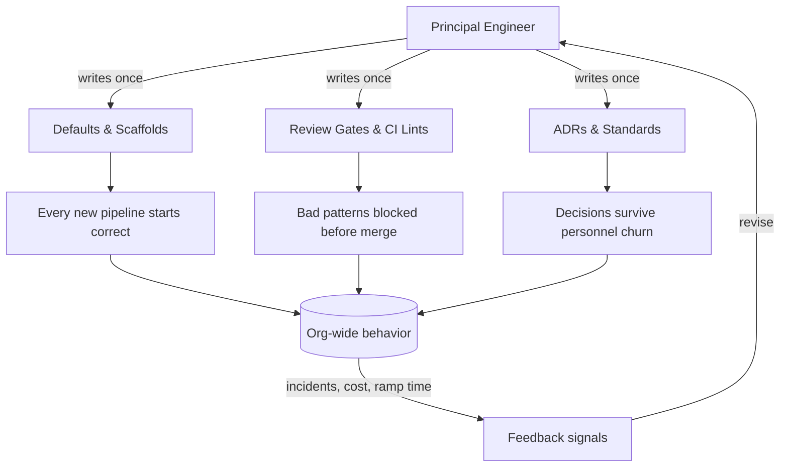

# Technical Leadership for Data Platforms

> Chapter from the **Data Engineering Playbook** — engineering-leadership.

## About This Chapter

**What this is.** Technical leadership for a principal engineer with no direct reports: changing what fifty engineers build by changing the defaults, gates, and stories rather than the code. This chapter treats leadership as a systems-design problem where the system is the org plus its pipelines.

**Who it's for.** Mid-level data engineers, platform/architecture leads, engineering managers/tech leads, and engineers preparing for senior/staff data-engineering interviews.

**What you'll take away.** By the end you'll be able to:
- Apply leverage through golden paths (opinionated, well-supported ways to build things), scaffolds (template starter code), CI gates (automated checks that block bad code before it merges), and ADRs (Architecture Decision Records — written logs of important technical decisions) instead of one-off mandates, and pick the right altitude (global vs domain vs local) for each decision.
- Earn and spend technical authority — carrying the pager, shipping load-bearing code, and practicing "disagree and commit" with falsifiable predictions wired into ADR tripwires.
- Set a quality bar via automated gates and a short "consult a principal" trigger list without becoming the single-approver bottleneck.

---

Most leadership writing aimed at engineers is about people skills. This chapter is not. It is about the technical leverage a principal engineer applies to a data platform with no direct reports: how you change what fifty engineers build by changing the defaults, the review gates, the failure budgets, and the stories the org tells about incidents. Leadership at this level is a systems-design problem where the system is the organization plus its pipelines.

## TL;DR

- A principal's output is **the decisions other people make**, not the code you write. Measure yourself by the diffs (code changes) you never had to author because the default was already right.
- Leverage comes from **changing the surface area**: golden paths, scaffolds, lint rules, and CI gates move the whole org; a brilliant one-off PR moves one pipeline.
- **Write the decision down or it didn't happen.** An undocumented architectural call is re-litigated every quarter as people churn. ADRs (Architecture Decision Records) are the durable artifact.
- Lead incidents toward **blameless causal analysis**, not heroics. The org you build is the one that survives a Saturday at 3am when you're offline.
- The hardest principal skill is **disagreeing and committing in public**, then making the path you lost on succeed anyway. Sandbagging (deliberately underperforming on) a decision you disagreed with is how you lose the room.
- You earn the right to set the bar by **carrying a pager and shipping**, not by reviewing from a tower.

## Why this matters in production

Concrete scenario. A 40-person data org runs ~600 Spark jobs and ~120 Kafka consumers (services that read messages from a Kafka event stream) across three domains (payments, risk, marketing). Each domain picked its own conventions over four years. Payments writes Iceberg (an open table format designed for large analytic datasets) with `write.target-file-size-bytes=536870912` and compacts (merges small files into larger ones) hourly; risk writes Delta (another open table format with built-in ACID transactions) with no compaction and 8 KB files piling up; marketing writes raw Parquet with `coalesce(1)` (a Spark operation that forces all data into a single output file) and a 9-hour nightly job nobody can restart safely. Three on-call rotations, three incident formats, three definitions of "data is fresh."

No individual engineer is wrong. Each made a locally reasonable call. The platform is incoherent because **nobody owned the cross-cutting decisions**, and the cost shows up as: duplicated table-maintenance code, an 11-day onboarding ramp because there's no canonical path, and a recurring class of incident (small-file explosions, unbounded state stores, non-idempotent restarts) that each team rediscovers independently.

A principal's job is to collapse that variance. Not by mandating a single stack from above — that produces malicious compliance and a platform team with no domain feedback — but by making the *good* path the *easy* path, instrumenting the cost of the bad path so it's visible, and writing down the few decisions that must be global. The leadership work is choosing **which decisions are global vs. local**, and earning the authority to enforce the global ones.

## How it works

Technical leadership operates through three leverage mechanisms, in increasing order of durability:



The model is a **control loop** (a system that observes its own output and adjusts), not a one-shot mandate. You ship a default, watch the signals (incident rate, p99 latency, cost per TB, onboarding time), and revise. The leverage multiplier is roughly:

```
impact ≈ (engineers affected) × (decision frequency) × (cost per wrong decision)
       − (cost to maintain the default)
```

This is why a `target-file-size` lint rule that fires on every Iceberg write beats a one-time compaction fix: the lint touches every future write by every engineer, the compaction fix touches one table once. The subtraction term matters — a default you don't maintain rots into a trap, and a rotted default costs *more* than no default because people trust it.

### Three altitudes of a leadership decision

Think of "altitude" as how broadly a decision applies — global means the whole org must follow it, local means a single pipeline team decides for themselves.

| Altitude | Question | Artifact | Revisit trigger |
|---|---|---|---|
| Global / platform | Iceberg vs Delta as the org table format? | ADR + migration plan | New engine support, vendor lock-in event |
| Domain / squad | Streaming vs micro-batch for risk scoring? | Design doc + review | SLA change, cost spike |
| Local / pipeline | `repartition(200)` vs AQE coalesce here? | Code comment + PR | None — let teams own it |

The failure mode of junior principals is pulling local decisions up to global altitude (micromanaging `repartition` counts org-wide) and pushing global decisions down to local (letting each team pick a table format). Get the altitude right and most of the politics disappears.

## Deep dive

### The authority question: influence without ownership

A principal usually has no reports and no budget. Authority is *granted* by the org based on a track record, and it's spent every time you block a PR or veto a design. Treat it as a depleting resource with slow regeneration.

The mechanics that actually generate authority:

- **Carry the pager.** Be in the on-call rotation for the platform you set standards for. The fastest way to lose credibility is to mandate a pattern you've never been paged for at 3am. When I require idempotent restarts (restarts that produce the same result whether run once or ten times), it's because I've personally re-run a non-idempotent 9-hour marketing job and watched it double-write a fact table.
- **Ship load-bearing code.** Not feature volume — *consequential* code. The Iceberg compaction service, the Kafka consumer scaffold, the lineage instrumentation (code that tracks where data came from and where it goes). Code that other teams depend on buys you standing to review theirs.
- **Lose arguments visibly and gracefully.** The single highest-leverage trust-building act is disagreeing in a design review, being overruled by data, and then helping the winning approach ship. People extend you authority when they've seen you not abuse it.

### Disagree and commit — the part everyone gets wrong

"Disagree and commit" is misread as "shut up after the decision." The real obligation is heavier:

1. Disagree *loudly and specifically* **before** the decision, with the falsifiable prediction (a prediction specific enough that you can later check whether it came true) attached: "If we go event-driven for risk scoring, the unbounded state store will OOM the executors within ~6 weeks at current event growth; here's the math."
2. Once the call is made against you, **commit fully** — and write your prediction into the ADR's "consequences" section as a tripwire (a measurable signal that tells you to re-examine the decision).
3. When the tripwire fires, **resist the I-told-you-so.** Reference the ADR, fix the platform, move on. The ADR did the politics for you.

The anti-pattern is the principal who keeps relitigating in side channels, or worse, builds a parallel "correct" implementation in the dark. That fractures the platform and burns the trust you need for the *next* decision.

### Scaling yourself: the mentorship-to-multiplier pipeline

Mentoring one engineer is linear. Turning that engineer into someone who sets standards for *their* domain is exponential. The concrete move: don't fix the small-file problem for the risk team — pair with their senior engineer, fix it together, and have *them* write the ADR and the lint rule. Now risk has a local owner of table-maintenance standards and you've reclaimed the bandwidth. Your scaling metric is the number of decisions you *no longer need to be in the room for*.

### Setting the bar vs. gatekeeping

A principal sets a quality bar; a principal does **not** become the single approver on every PR. That's a bottleneck and a single point of failure for the org's velocity. The bar lives in:

- **Automated gates** (CI lints, schema-compatibility checks, cost-regression alerts) that don't need you to be awake.
- **A small set of "you must consult a principal" triggers**: new datastore, new public API contract, anything touching PII (Personally Identifiable Information) or money, anything that changes a global default.

Everything else, the teams own. If you find yourself in every code review, you've built a gate, not a bar, and you're the reason velocity is dropping.

## Worked example

A leadership decision encoded so it scales without you. Suppose the global call is: *every Iceberg table in the org must have a registered compaction policy.* You don't enforce this by reviewing tables. You enforce it with a CI gate plus a self-service scaffold.

The ADR tripwire, written into the decision records:

```markdown
## ADR-014: Mandatory compaction policy for Iceberg tables
Status: Accepted (2026-02)
Decision: All Iceberg tables registered in the catalog MUST declare a
compaction policy via the `data_platform.compaction` table property.
Default: rewrite_data_files when small-file ratio > 0.30.

Consequences / tripwires:
- If a domain opts out, they own a runbook for small-file remediation.
- TRIPWIRE (S. Rama, dissented on payments exemption): if payments'
  hourly compaction is exempted, expect query p95 on fct_payments to
  regress >40% within 8 weeks. Revisit if it fires.
```

The CI gate that makes the bar self-enforcing (runs in the merge pipeline, no principal required):

```python
# ci/checks/iceberg_compaction_policy.py
from pyspark.sql import SparkSession

REQUIRED_PROP = "data_platform.compaction"
EXEMPT = {"marketing.raw_clickstream"}  # documented in ADR-014

def assert_compaction_policy(spark: SparkSession, table: str) -> None:
    props = {
        r["key"]: r["value"]
        for r in spark.sql(f"SHOW TBLPROPERTIES {table}").collect()
    }
    if table in EXEMPT:
        return
    if REQUIRED_PROP not in props:
        raise SystemExit(
            f"[ADR-014] {table} has no compaction policy. "
            f"Add TBLPROPERTIES ('{REQUIRED_PROP}'='rewrite>0.30') "
            f"or request an exemption in the ADR. "
            f"Docs: engineering-leadership/decision-records/README.md"
        )
```

The scaffold so the *easy* path is the *correct* path — engineers get a compliant table by default:

```sql
-- scaffolds/new_iceberg_table.sql  (generated by `dp new-table`)
CREATE TABLE ${catalog}.${schema}.${table} (
  ${columns}
)
USING iceberg
TBLPROPERTIES (
  'write.target-file-size-bytes' = '536870912',   -- 512 MB
  'write.distribution-mode'      = 'hash',
  'data_platform.compaction'     = 'rewrite>0.30', -- satisfies ADR-014
  'data_platform.owner'          = '${squad}'      -- routes the page
);
```

Now the leadership decision is in three places that all outlive you: the ADR (the *why*), the CI gate (the *enforcement*), and the scaffold (the *default*). No one needs you in the room to comply. The error message even teaches the next engineer where to read the reasoning.

## Production patterns

- **Tripwires in ADRs over arguments in meetings.** Encode your dissent as a measurable prediction inside the decision's consequences. When it fires, the ADR re-opens itself; when it doesn't, you were wrong and you owe a learning, not a grudge.
- **Default-shifting over mandate-issuing.** Change the scaffold, the template, the `CREATE TABLE` generator. New work starts correct; you spend zero authority and zero review time. Reserve mandates for the handful of genuinely global, irreversible calls.
- **Pager-driven standards.** Only standardize patterns you've personally been paged for or can point to a specific incident for. A standard with an incident behind it survives challenge; a standard from taste alone does not.
- **The "consult a principal" trigger list.** Publish the short list of changes that require principal review (new datastore, money/PII, global-default change). Everything off the list, teams ship without you. This is how you set a bar without becoming a gate.
- **Local owners for local standards.** Every domain gets a named owner of its table-maintenance, schema-evolution, and on-call standards. You federate (distribute responsibility to domain owners); you don't centralize. Your job becomes the *interface* between domains, not the implementer inside them.
- **Public retro on your own miss.** When your tripwire is wrong, say so in the retro. It is the single most authority-generating move available and it costs nothing but ego.

## Anti-patterns & failure modes

| Anti-pattern | Symptom you'd observe | Fix |
|---|---|---|
| Principal as sole PR approver | Merge queue blocked when you're on PTO; review SLA in days | Move the bar into CI gates; define a 5-item "must consult" trigger list, delegate the rest |
| Mandate without scaffold | High "compliance" in the ADR, near-zero in the catalog; teams paste boilerplate they don't understand | Ship the default path; make compliance the path of least resistance |
| Shadow re-implementation | A "correct" parallel pipeline appears in your branch; two sources of truth for the same fact table | Commit to the decision you lost; if it's truly wrong, re-open the ADR with data, not a fork |
| Standardizing on taste | "Because I said so" pushback; standard erodes within two quarters | Attach every standard to a specific incident or a measured cost; if you can't, it's local |
| Hero on-call | One person resolves 80% of pages; bus factor of 1 (the whole system depends on one person); burnout | Write runbooks during the retro; rotate the page; the principal's job is fewer pages, not faster ones |
| Global decision pushed to local | Three table formats, three incident formats, 11-day onboarding | Pull the genuinely cross-cutting calls up to ADR altitude; leave the rest with teams |
| Local decision pulled to global | Org-wide `repartition` mandate; teams route around the platform | Push pipeline-level tuning back down; trust AQE (Adaptive Query Execution — Spark's built-in query optimizer) and team judgment |

The two altitude failures are mirror images and the most common. A principal who gets altitude right is mostly invisible — which is the point, and also why the role is hard to measure.

## Decision guidance

When to escalate a decision to principal/global altitude vs. leave it with the team:

| Situation | Take it global | Leave it local |
|---|---|---|
| Reversibility | One-way door (table format, event schema contract) | Two-way door (partition count, executor sizing) |
| Blast radius | Crosses domain boundaries / shared contract | Contained in one pipeline |
| Regulatory surface | Touches PII, money, retention, audit | Internal-only derived data |
| Cost of inconsistency | High (every team reinvents on-call, maintenance) | Low (teams legitimately differ) |
| Frequency of the decision | Made daily across the org → encode a default | Made once → let the team decide |

Rule of thumb: **if reversing it later requires a migration, it's global; if reversing it is a config change and a re-deploy, it's local.** Most decisions are local, and a principal's restraint in *not* globalizing them is what keeps domain feedback loops alive.

## Interview & architecture-review talking points

- *"How do you set standards across teams that don't report to you?"* — I shift defaults and CI gates rather than issuing mandates, because a scaffold touches every future pipeline while a mandate touches only the people who happen to read it. I reserve hard mandates for one-way-door decisions: table format, event contracts, anything touching money or PII.
- *"Tell me about a time you disagreed with a technical decision."* — Lead with the falsifiable prediction you made, that you committed fully after losing, that you wrote the prediction into the ADR as a tripwire, and what happened when (or whether) it fired. The grace in losing is the signal interviewers are listening for.
- *"How do you measure your impact as a principal?"* — Decisions I'm no longer in the room for; onboarding ramp time; the slope of a recurring incident class after I shipped a default. Not lines of code or PRs reviewed.
- *"How do you avoid becoming a bottleneck?"* — A published "consult a principal" trigger list and automated gates that enforce the bar while I sleep. If I'm in every review, I've built a gate, not a bar.
- In an architecture review, the principal's move is to ask *which decisions here are one-way doors*, force those into the ADR with explicit consequences, and let the reversible ones go un-debated. Reviews that try to perfect reversible choices waste the room's most expensive hour.

## Further reading

- [decision-records](../decision-records/README.md) — how to write ADRs with tripwires that do your politics for you.
- [architecture-reviews](../architecture-reviews/README.md) — running the review where these decisions get made.
- [technical-strategy](../technical-strategy/README.md) — the multi-quarter arc the individual decisions ladder up to.
- [roadmaps](../roadmaps/README.md) — sequencing platform investments across domains.
- [platform-engineering/golden-paths](../../platform-engineering/golden-paths/README.md) — the scaffold mechanism that makes the correct path the easy path.
- Will Larson, *Staff Engineer: Leadership Beyond the Management Track* (2021) — the canonical text on the IC (Individual Contributor) leadership ladder.
