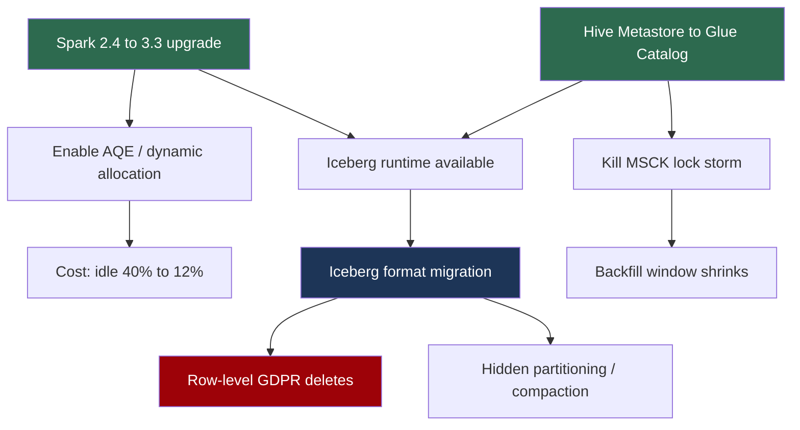

# Technical Roadmaps for Data Platforms

> Chapter from the **Data Engineering Playbook** — engineering-leadership.

A roadmap is not a list of features with quarters next to them. For a data platform it is a **risk-and-capacity allocation document** that answers one question for an executive who can't read a query plan: *given finite engineers and a finite blast radius, what do we change, in what order, so the platform stops bleeding and starts compounding?* The hard part isn't picking good projects — it's sequencing them against shared infrastructure (one metastore, one Spark version, one Kafka cluster) where the wrong order causes two migrations instead of one.

## TL;DR

- A data-platform roadmap sequences work against **shared, hard-to-fork infrastructure** — a single Hive Metastore, one EMR/Spark line, one Kafka cluster. Order matters more than selection because dependencies are physical, not logical.
- Plot every initiative on a **2×2 of leverage (engineer-hours unblocked) vs. blast radius (tables/pipelines affected)**. High-leverage, low-blast work goes first; it buys you the credibility and slack to do the scary migrations later.
- Sequence by the **dependency DAG of platform primitives**, not by team preference. You cannot adopt Iceberg hidden partitioning before you've moved off the Hive metastore; you cannot enforce schemas before you have a registry.
- Express commitments as **capacity-bounded bands (Now / Next / Later)** with explicit *exit criteria*, never calendar dates. "Now = the 2 things in flight; Next = unblocked when Now lands; Later = blocked or unfunded."
- Every roadmap line carries a **kill/trigger condition**. A migration that doesn't define "we stop and roll back if X" is a hope, not a plan.
- Reserve **20–30% of capacity for keep-the-lights-on** (on-call, version bumps, cost regressions). Roadmaps that assume 100% feature velocity are fiction and get blown up by the first Log4Shell-grade CVE.

## Why this matters in production

Concrete scenario. You inherit a platform: ~4,000 Hive tables on S3, EMR 5.36 (Spark 2.4), an external Hive Metastore on Aurora MySQL, Airflow 1.x, and a Kafka 2.6 cluster feeding a half-dozen streaming jobs. Three things are simultaneously on fire:

1. Finance flagged a **$180k/month S3 + EMR bill** with 40% idle cluster time.
2. Analysts hit **metastore lock contention** every morning — `ALTER TABLE ... ADD PARTITION` storms during the 6 AM backfill window cause 90-second `MSCK REPAIR` stalls.
3. A directive came down: **GDPR-style row-level deletes** must be supported within two quarters.

Every one of these has an obvious local fix. Cost: spot fleets and autoscaling. Locks: batch partition registration. Deletes: switch to a table format with row-level mutation (Iceberg/Delta/Hudi). The trap is treating them as three independent tracks. They share a metastore and a Spark version. Iceberg row-level deletes want Spark 3.3+. Spark 3 changes shuffle behavior, which changes your cost profile. Autoscaling EMR with the old metastore makes lock contention *worse* because more concurrent executors mean more concurrent partition writes.

The roadmap's job is to find the **one ordering** where each step unblocks the next instead of fighting it: bump Spark first (unblocks Iceberg *and* lets adaptive query execution kill most of the idle cost), migrate the metastore to Glue Data Catalog (kills the lock storm *and* is the prerequisite for Iceberg), *then* do the format migration table-by-table (delivers deletes). Get the order wrong and you do the Spark upgrade twice — once on Hive tables, again after the format flip — because Iceberg's Spark runtime jar is version-pinned.

A bad roadmap isn't a slide; it's six months of rework.

## How it works

The mental model is a **directed acyclic graph of platform capabilities**, where edges are hard prerequisites, overlaid with a capacity budget that drains as you commit.



Read the DAG, not the calendar. The two **green roots** (Spark upgrade, metastore migration) have no upstream dependencies and unblock everything else — those are the "Now." The **blue node** (format migration) is large, sits in the middle, and is gated by both roots — that's "Next." The **red node** (the actual mandate) is downstream of everything — it's "Later," and that's *fine*, because Later with a clear path beats Now with no foundation.

### The leverage / blast-radius scoring

For each candidate I score two numbers:

- **Leverage (L):** engineer-hours per quarter this unblocks or saves, across the whole org. AQE on a 200-job fleet that each waste 30 min/day = thousands of hours.
- **Blast radius (B):** number of tables/pipelines/teams that break if this goes wrong, weighted by criticality.

Priority isn't `L/B`. It's a quadrant decision:

| Quadrant | L | B | Roadmap placement |
|---|---|---|---|
| Quick wins | High | Low | **Now** — do immediately, build trust |
| Big bets | High | High | **Next** — only after quick wins fund the slack to absorb risk |
| Fill-ins | Low | Low | Background / 20% time |
| Money pits | Low | High | **Kill** — or reframe until L rises |

The non-obvious rule: **you earn the right to do Big Bets by shipping Quick Wins first.** When you propose a risky 6-month Iceberg migration, the question in the room is "can this team execute?" If you spent the prior quarter cutting the bill 25% with autoscaling, the answer is already yes.

## Deep dive

This is where roadmaps go wrong in ways that don't show up until month four.

### 1. Dependency edges are physical, and they're often invisible

The Spark-version edge above is the one everyone misses. Iceberg's Spark integration ships as a version-pinned runtime jar — `iceberg-spark-runtime-3.3_2.12`. You cannot run it on Spark 2.4. So "adopt Iceberg" silently contains "upgrade Spark," which silently contains "test 200 jobs against Spark 3 SQL semantics" (the `INTERVAL` type changes, the `spark.sql.legacy.timeParserPolicy` flag, decimal-division precision changes). If your roadmap line says "Q2: adopt Iceberg," you've hidden a quarter of compatibility work inside a one-liner. The fix: **decompose every initiative until each line maps to one deployable artifact change.** "Upgrade Spark" and "migrate format" are different lines with different risk.

### 2. Roadmaps are written in the wrong units

Stakeholders want dates. Dates are the one thing you can't honestly give for migration work, because the cost of a migration is dominated by the **long tail of weird tables** — the one with 4 million partitions, the one some team writes to with a hand-rolled `INSERT OVERWRITE`, the one nobody owns. I commit to **bands with exit criteria** instead:

- **Now** = work in flight, capacity-locked. Max 2 large initiatives.
- **Next** = unblocked the moment a Now item hits its exit criteria. Named, scoped, *not* scheduled.
- **Later** = blocked, unfunded, or deliberately deferred. Listed so people stop asking.

An exit criterion is testable: *"Spark upgrade exits when 95% of jobs pass the shadow-run diff and the p99 job runtime is within 10% of baseline."* That sentence does more scheduling than any Gantt chart.

### 3. The migration long-tail is a power law, not a line

A format or version migration is never linear. The first 80% of tables migrate with one templated job. The last 20% each have a reason they're special, and those reasons take 3× the per-table effort. If you straight-line your burn-down ("we did 800 tables in 4 weeks, so 4,000 in 5 months"), you will miss by a quarter. Model the tail explicitly: bucket tables by *complexity class* (clean / custom-partition / multi-writer / orphaned) and estimate each bucket separately. The orphaned bucket is the one that needs a *decommission* decision from a human, not an engineer — surface it on the roadmap as a dependency on someone else's sign-off.

### 4. Keep-the-lights-on capacity is non-negotiable and always under-budgeted

Across the last several platforms I've run, **20–30% of engineering capacity** evaporates into version bumps, CVE patches (Log4Shell ate a week of everyone's life), cost regressions, and on-call follow-ups. A roadmap that books 100% of capacity to features is not optimistic — it's wrong, and it fails predictably the first time a transitive dependency ships a critical CVE. Reserve the band explicitly and defend it; the alternative is silently stealing it from your Big Bet and then explaining the slip.

### 5. Cross-org dependencies are the real critical path

Your team can move fast. The four downstream teams that read your tables cannot all re-point their readers in the same week. The true duration of a format migration is `max(your_migration_time, slowest_consumer_cutover)`. The roadmap must name those consumers as line items and the contract change (dual-write / dual-read window) that lets them move asynchronously. This is the bridge to [technical strategy](../technical-strategy/README.md): a roadmap that ignores org topology is just a wishlist.

## Worked example

A roadmap is most honest when it's *executable*. Here's the scoring as code — a small model that ranks initiatives and emits the Now/Next/Later bands, so the roadmap is regenerated from data instead of argued in a meeting.

```python
from dataclasses import dataclass, field

@dataclass
class Initiative:
    name: str
    leverage_hrs_per_q: int      # eng-hours saved/unblocked org-wide per quarter
    blast_tables: int            # tables/pipelines at risk if it goes wrong
    blocked_by: list[str] = field(default_factory=list)
    eng_quarters: float = 1.0    # team capacity to land it

# blast normalized against the ~4,000-table estate
ESTATE = 4000

CANDIDATES = [
    Initiative("spark_3_upgrade",        leverage_hrs_per_q=2400, blast_tables=4000, eng_quarters=1.5),
    Initiative("glue_catalog_migration", leverage_hrs_per_q=1200, blast_tables=4000, eng_quarters=1.0),
    Initiative("emr_autoscaling_aqe",    leverage_hrs_per_q=1800, blast_tables=200,  eng_quarters=0.5,
                blocked_by=["spark_3_upgrade"]),
    Initiative("iceberg_format_migration", leverage_hrs_per_q=900, blast_tables=4000, eng_quarters=3.0,
                blocked_by=["spark_3_upgrade", "glue_catalog_migration"]),
    Initiative("gdpr_row_deletes",       leverage_hrs_per_q=300,  blast_tables=600,  eng_quarters=1.0,
                blocked_by=["iceberg_format_migration"]),
    Initiative("airflow_2_upgrade",      leverage_hrs_per_q=400,  blast_tables=50,   eng_quarters=0.5),
]

CAPACITY_PER_BAND = 2.0   # eng-quarters of feature capacity (after 25% KTLO reserve)

def quadrant(i: Initiative) -> str:
    high_L = i.leverage_hrs_per_q >= 1000
    high_B = i.blast_tables / ESTATE >= 0.25
    return {(True, False): "quick_win", (True, True): "big_bet",
            (False, False): "fill_in", (False, True): "money_pit"}[(high_L, high_B)]

def schedule(cands: list[Initiative]) -> dict[str, list[str]]:
    done, bands = set(), {"now": [], "next": [], "later": []}
    # NOW: unblocked quick-wins first, then unblocked big-bets, up to capacity
    order = sorted(cands, key=lambda i: (quadrant(i) != "quick_win", -i.leverage_hrs_per_q))
    spent = 0.0
    for i in order:
        if quadrant(i) == "money_pit":
            continue  # kill or reframe — never schedule
        unblocked = all(dep in done for dep in i.blocked_by)
        if unblocked and spent + i.eng_quarters <= CAPACITY_PER_BAND:
            bands["now"].append(i.name); done.add(i.name); spent += i.eng_quarters
        elif unblocked:
            bands["next"].append(i.name)
        else:
            bands["later"].append(i.name)
    return bands

for i in CANDIDATES:
    print(f"{i.name:28} {quadrant(i)}")
print(schedule(CANDIDATES))
```

Representative output:

```
spark_3_upgrade              big_bet
glue_catalog_migration       big_bet
emr_autoscaling_aqe          quick_win
iceberg_format_migration     fill_in
gdpr_row_deletes             fill_in
airflow_2_upgrade            fill_in
{'now':  ['airflow_2_upgrade', 'spark_3_upgrade'],
 'next': ['glue_catalog_migration', 'emr_autoscaling_aqe'],
 'later':['iceberg_format_migration', 'gdpr_row_deletes']}
```

The model surfaces the uncomfortable truth: `emr_autoscaling_aqe` is the highest-leverage low-blast item, but it is *blocked by* the Spark upgrade, so it can't be in Now — it drops to Next and lands the moment Spark exits. That forces the Spark upgrade itself into Now even though it's a Big Bet, because nothing valuable moves until it does. The GDPR mandate, the thing leadership cares about most, is correctly in **Later** with a two-hop dependency chain visible to everyone. Now the conversation is about the chain, not the date.

Each Now item then gets an exit criterion in the roadmap doc:

```yaml
spark_3_upgrade:
  exit_criteria:
    - "95% of 200 jobs pass shadow-run output diff (row count + checksum)"
    - "p99 job runtime within 10% of Spark 2.4 baseline"
    - "spark.sql.legacy.timeParserPolicy audited on all date-parsing jobs"
  kill_switch: "if >20 jobs show silent decimal-precision drift, halt and pin spark.sql.legacy flags"
  ktlo_reserve: 0.25
```

## Production patterns

- **Roadmap as a generated artifact, not a slide.** Keep initiatives in version control (the YAML/Python above), regenerate the bands on every change, and diff it in PRs. When someone wants to jump the queue, they submit a PR that re-scores — the argument becomes about numbers and dependency edges, not volume.
- **One "anchor migration" per band, max.** Migrations are coordination-heavy and consume slack you didn't know you had. Running two large migrations concurrently (Spark *and* Airflow *and* format) means every incident now has three suspects. Serialize the anchors; parallelize only the low-blast fill-ins around them.
- **Dual-write / dual-read bridges for every format or schema cutover.** Write to both old Hive table and new Iceberg table for one cycle; let consumers move on their own clock; flip the canonical pointer last. This converts a hard cross-team deadline into an asynchronous one and is the single biggest de-risker for the consumer critical path.
- **Tie roadmap lines to [decision records](../decision-records/README.md).** Every Big Bet links to the ADR that justified it. When the trigger condition fires ("cost crossed $250k", "metastore p99 lock > 60s"), the ADR is revisited, not relitigated from scratch.
- **Publish the kill conditions louder than the goals.** A roadmap that says "we will stop the Iceberg migration and stay on Hive if per-table migration cost exceeds 6 eng-hours at the median" earns more trust than one that promises only success. It signals you've thought about being wrong.
- **Refresh on triggers, not on a calendar.** Quarterly re-planning is theater if nothing changed. Re-plan when a dependency lands, a cost threshold trips, or an incident reveals a new edge. Tie this into [architecture reviews](../architecture-reviews/README.md) as the standing forum.

## Anti-patterns & failure modes

| Anti-pattern | Symptom you'll observe | Fix |
|---|---|---|
| Calendar-committed migrations | Slip every quarter; "90% done" for three months (the long tail) | Bands + exit criteria; bucket tables by complexity class and estimate the tail separately |
| Hidden version dependency | Spark upgraded twice — once on Hive, once after Iceberg flip; duplicated regression testing | Decompose to one-artifact lines; draw the prerequisite DAG before sequencing |
| Two anchor migrations at once | Every incident has 3 suspects; on-call burns out; both slip | One anchor per band; serialize coordination-heavy work |
| 100% capacity booked to features | First critical CVE (Log4Shell) blows the plan; Big Bet silently raided for patch work | Reserve 20–30% KTLO band explicitly and defend it |
| Ignoring consumer cutover time | Your migration "done" but 4 downstream teams still on old table; can't decommission; pay double storage | Name consumers as line items; dual-write/dual-read bridge; flip pointer last |
| Roadmap with goals but no kill conditions | Sunk-cost migration limps on at 70% for a year; nobody empowered to stop it | Every Big Bet ships with a written trigger/kill condition |
| Bottom-up wishlist masquerading as a roadmap | 30 items, all "P1", no dependency edges; team thrashes | Score on leverage × blast-radius quadrants; force prioritization through the 2×2 |

## Decision guidance

**When a roadmap is the right artifact vs. alternatives:**

| Situation | Use | Why |
|---|---|---|
| Multi-quarter platform evolution with shared infra | **This roadmap model (DAG + bands)** | Dependencies are physical; ordering dominates |
| Single-team, single-service feature work | A backlog / sprint board | No cross-cutting infra dependencies; dates are honest |
| One irreversible architecture choice | An [ADR](../decision-records/README.md) | The decision is a point, not a sequence |
| Org-topology / team-boundary change | A [technical strategy](../technical-strategy/README.md) doc | Roadmap sequences *work*; strategy reshapes *who does it* |
| "What broke and what's next" after an incident | Architecture review action items | Reactive, scoped, doesn't need band-level planning |

**Now / Next / Later vs. quarterly OKRs:** OKRs answer *what outcome*; the roadmap answers *in what order, given dependencies*. Use OKRs to set the leverage weights; use the roadmap to sequence within them. They're complementary, not competing.

## Interview & architecture-review talking points

- "I sequence platform work off a dependency DAG of primitives, not a calendar. The first question I ask of any initiative is *what one-artifact change does this actually require* — because 'adopt Iceberg' usually hides a Spark upgrade and 200 jobs of regression testing."
- "I score on leverage versus blast radius and front-load quick wins, because shipping a 25% cost cut is how you *earn* permission to attempt the scary 6-month migration. Credibility is roadmap capacity."
- "I commit to exit criteria, not dates, on migration work — because migration cost is a power law dominated by the weird-table long tail, and any straight-line estimate is a lie I'll have to walk back."
- "Every Big Bet on my roadmap has a written kill condition. If I can't tell you when I'd stop and roll back, I haven't planned it — I've hoped."
- "The real critical path on a format migration is the slowest consumer's cutover, not my team's burn-down. So I budget a dual-write window and name every downstream team as a line item."
- "I reserve 20–30% capacity for keep-the-lights-on. A roadmap that assumes 100% feature velocity isn't ambitious, it's the one that detonates on the next CVE."

## Further reading

- [Technical Strategy](../technical-strategy/README.md) — how org topology and team boundaries shape what a roadmap can even attempt.
- [Decision Records (ADRs)](../decision-records/README.md) — the per-decision artifacts each Big Bet links to and revisits on trigger events.
- [Architecture Reviews](../architecture-reviews/README.md) — the standing forum where roadmaps get re-planned against new edges and incidents.
- [Engineering Leadership](../leadership/README.md) — defending the KTLO band and the kill conditions is a leadership act, not a planning one.
- Apache Iceberg — [Spark runtime version compatibility matrix](https://iceberg.apache.org/multi-engine-support/) — the canonical source for the version-pinned-jar dependency that breaks naive "adopt Iceberg" roadmap lines.
- Will Larson, *An Elegant Puzzle* (the "Migrations" and "Saying no" chapters) — the strongest published treatment of why migrations are the only scalable way to evolve shared infrastructure.
