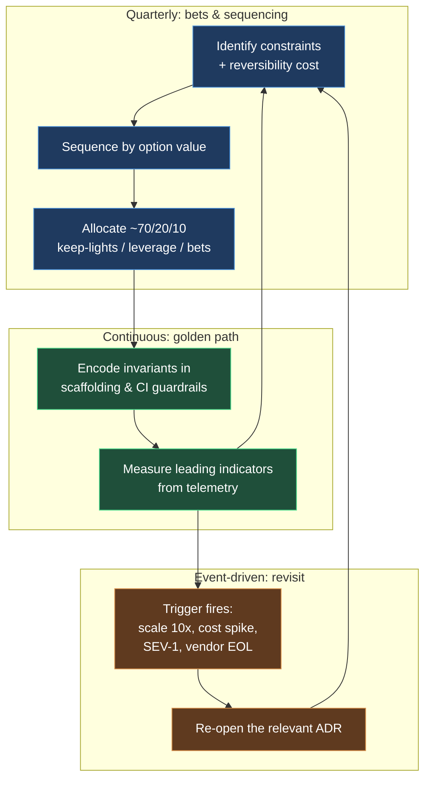

# Technical Strategy

> Chapter from the **Data Engineering Playbook** — engineering-leadership.

## About This Chapter

**What this is.** Technical strategy works like a constraint system — a small set of firm rules you choose now that determine which engineering decisions stay simple and which become painful two years out. This chapter covers how to set, enforce, measure, and retire those constraints on a data platform.

**Who it's for.** Mid-level data engineers, platform and architecture leads, engineering managers and tech leads, and engineers preparing for senior or staff data-engineering interviews.

**What you'll take away.** By the end you'll be able to:
- Express strategy as enforceable pillars — scaffold defaults (project templates that build in the right choice), CI guardrails (automated checks in your build pipeline), telemetry (metrics you can pull today), and written revisit triggers — rather than a vision deck.
- Separate one-way doors (decisions that are very hard to reverse, like schema contracts, table format, partitioning at scale, and streaming engine) from two-way doors (decisions you can undo cheaply) and match how much analysis time you spend to how reversible each decision is.
- Sequence work by option value (prioritizing what unlocks future work), treat Conway's Law (the principle that your system architecture will mirror your org structure) as a strategic input, run build-vs-buy as a pager-ownership and total cost of ownership (TCO) decision, and design migrations so they can be stopped halfway without leaving a mess.

---

Technical strategy is the part of the principal job that has no pull request attached to it. It is the set of constraints you choose *now* that determine which engineering decisions are cheap and which are catastrophic two years out. A good strategy is mostly a list of things you have decided *not* to build, written down with enough teeth that a staff engineer under deadline pressure can't quietly relitigate it in a Slack thread at 2am.

## TL;DR

- Strategy is a **constraint system**, not a vision deck. Its output is a small set of firm rules ("all batch state lives in Iceberg tables in `s3://lake/`, never in HDFS or a sidecar RDBMS") that make 80% of downstream decisions automatic.
- Anchor every bet to a **reversibility cost**. One-way doors (table format, partitioning scheme, the streaming engine, your event schema contract) deserve months of analysis; two-way doors (which orchestrator, which dashboard tool) deserve a week and a willingness to be wrong.
- Sequence work by **option value**, not feature value. The migration that unblocks five future migrations beats the feature that ships one quarter sooner.
- A strategy you can't measure is a wish. Tie each pillar to a leading indicator you can pull from telemetry today — `restated_partitions_per_week`, `p95 backfill hours`, `% of pipelines on the golden path` — and review it on a fixed cadence.
- Build-vs-buy is a **TCO + control-surface** decision, not a feature-checklist decision. The question is never "can the vendor do X," it's "who carries the pager when X breaks at 3am and the SLA is breached."
- The hardest part is **retiring** strategy. Most platform pain is two valid strategies from different eras colliding because nobody declared the old one dead.

## Why this matters in production

Concrete scenario. A 200-person data org has, over four years, accumulated: a Spark-on-EMR batch estate, a Flink streaming estate someone stood up for a fraud use case, three "temporary" Airflow instances, two table formats (legacy Parquet directories registered in Hive Metastore, plus a newer Iceberg footprint), and a homegrown data quality (DQ) framework that predates Great Expectations adoption. Nothing here was a bad local decision. Every one was reasonable for the team and quarter that made it.

The aggregate is a tax that compounds. A new pipeline takes six weeks to ship instead of three days because the author has to *choose* a format, a metastore (the catalog that tracks your tables), an orchestrator (the tool that schedules and runs pipelines), and a DQ approach — and choosing wrong means a painful migration later. On-call spans four runtimes. The FinOps team can't attribute cost because compute is split across EMR clusters with no consistent tagging. Hiring slows because "our stack" takes a month to explain.

This is the failure technical strategy prevents. The principal's job is not to pick the *best* table format — Iceberg, Delta, and Hudi are all defensible. The job is to pick *one*, write down *why*, define the trigger that would make you revisit it, and then make the platform make that choice for everyone by default. The cost of a slightly-suboptimal-but-uniform choice is almost always lower than the cost of three locally-optimal divergent ones.

## How it works

A technical strategy operates as three nested loops on different clocks.



**Constraints become defaults become guardrails.** A strategy pillar like "Iceberg is the only table format for new tables" is worthless as a wiki sentence. It becomes real in three layers:

1. *Scaffolding* — the project template (sometimes called a cookiecutter) emits Iceberg DDL (data definition language — the SQL that creates tables) by default, so the path of least resistance is compliant.
2. *CI guardrail* — a lint check fails any pull request that registers a non-Iceberg external table in the production catalog.
3. *Telemetry* — a dashboard counts `non_iceberg_table_count` in prod and trends it to zero.

**The reversibility frame.** Think of decisions as one-way or two-way doors — a framing popularized by Jeff Bezos. A one-way door is a decision that is very hard or expensive to undo once made. A two-way door is a decision you can reverse cheaply if it turns out to be wrong. Here is how common data decisions map to this frame:

| Decision | Door type | Cost to reverse | Analysis budget |
|---|---|---|---|
| Event schema contract (the bytes on the wire) | One-way | Re-emit history, dual-publish for months | High — design review + ADR |
| Table format (Iceberg vs Delta) | One-way-ish | Full rewrite + lineage break | High |
| Partition / clustering scheme | One-way per table | Full table rewrite, often PB-scale | High |
| Streaming engine (Flink vs Spark Structured Streaming) | One-way | Rewrite all stateful jobs + state migration | High |
| Orchestrator (Airflow vs Dagster) | Two-way | Re-author DAGs, mechanical | Medium |
| BI / dashboard tool | Two-way | Rebuild dashboards | Low |
| Spark cluster manager (EMR vs k8s) | Two-way-ish | Repackage, retune | Medium |

The strategic error is spending one-way-door rigor on two-way-door decisions (six-month orchestrator bake-offs) while letting one-way-door decisions — *especially event schemas* — get made implicitly by whoever ships first.

**Option value sequencing.** Order initiatives by how many *future* decisions each unlocks, not by isolated return on investment. Prefer initiative `A` over `B` when `value(A) + Σ unlocked_option_value(A) > value(B) + Σ unlocked_option_value(B)`. In plain terms: migrating to a single catalog has modest direct value but unlocks uniform lineage, uniform access control, and cross-engine reads — three downstream initiatives that are impossible until it lands.

## Deep dive

This is where principals get it wrong. The mechanics that matter:

**1. Strategy without trigger conditions rots silently.** Every pillar needs a written *revisit trigger* — a measurable event, not a calendar date. "Revisit the EMR-vs-Databricks decision when monthly EMR spend crosses $X **or** p95 cluster spin-up exceeds 8 minutes **or** we exceed 2 SEV-2s/quarter attributable to cluster ops." Without triggers, you get two failure modes: zombie strategies enforced long after they stopped making sense, and thrashing where every new hire relitigates settled decisions. The trigger is what lets you say "no, not now — here's the line that would change my mind." See [decision-records](../decision-records/README.md) for the ADR (Architecture Decision Record — a short document that captures a decision and its context) mechanics that hold the trigger.

**2. The "one-way door" set is smaller than people think — but the schema is always in it.** Most engineers over-classify decisions as irreversible because reversal is *painful*, not impossible. The genuinely irreversible ones share a property: **they're embedded in data already at rest or in contracts other teams depend on.** A partitioning scheme on a 4 PB table is effectively one-way because the rewrite costs more compute-hours than the optimization saves in a year. An event schema is one-way because consumers you don't control have already deserialized (read and parsed) those bytes. This is why event design deserves disproportionate strategic attention — it's the one-way door that masquerades as a two-way door because "we can just add a field."

**3. Conway's Law is a strategic input, not a footnote.** Conway's Law states that the systems a team builds will mirror the communication structure of that team — meaning your architecture will mirror your org chart whether you plan for it or not. If you want a centralized lakehouse (a unified storage and query layer for all your data) with shared tables, you need a team that owns those tables and a funding model for them. If you have domain-aligned teams with no shared platform team, you will get a data mesh (a pattern where domain teams own and publish their own data products) whether you called it that or not — so write the strategy that *embraces* domain ownership (federated governance, data contracts) rather than fighting it with a central team that has no authority. The mistake is choosing an architecture that requires an org you don't have and won't get.

**4. Strategy must allocate capacity explicitly.** A pillar that isn't funded is a slogan. The useful default is roughly **70/20/10**: 70% keeping the lights on and incremental delivery, 20% leverage work (paying down the things that slow everyone), 10% genuine bets. When a strategy review produces no change in how capacity is allocated next quarter, the strategy is theater. The leading indicator that this is broken: leverage and bet work is the first thing cut when a delivery deadline slips, every quarter, with no exception.

**5. Migrations are the real strategy, and they must be designed to be abandonable mid-flight.** The strategy is rarely "be on Iceberg" — it's "*get* from Hive-Parquet to Iceberg without a flag day (a single, instant cutover where everything switches at once)." A migration that requires a big-bang cutover is a strategy that can't survive a single bad quarter. Design every migration with a dual-write or shadow-read phase (where you write to or read from both the old and new system in parallel to verify correctness) and a documented rollback, so that if priorities shift you stop in a *consistent* state rather than stranded half-migrated across two formats forever — which is exactly how orgs end up with the two-table-format problem from the opening scenario.

**6. The build-vs-buy decision is about who carries the pager.** Feature parity (whether a vendor's tool can do everything you need) is the least interesting axis. The real axes:

| Axis | Build | Buy |
|---|---|---|
| Differentiation | Build only if it's a moat | Buy commodity |
| Pager ownership | You carry it 24/7 | Vendor SLA (read the credits) |
| Control surface | Total — patch anything | Limited to their API/roadmap |
| TCO at year 3 | Eng salaries + opportunity cost | License + integration + lock-in exit cost |
| Talent | Need + retain experts | Need integration skills |

The trap is comparing a vendor's mature product to the *idealized* version of what you'd build, ignoring the years of edge cases the vendor has already absorbed. Build the thing that is your differentiation; buy the thing where being average is fine.

## Worked example

A strategy pillar is only real when it's machine-enforced. Here is the "single table format" pillar expressed as the three enforcement layers, plus the telemetry that proves it's working.

**Layer 1 — scaffolding default (project template):**

```python
# scaffold/templates/new_pipeline/table_ddl.py.j2 -> rendered for every new pipeline
# Default sink is Iceberg; deviating requires editing this file AND a waiver ADR.
def write_gold_table(df, table: str) -> None:
    (
        df.writeTo(f"glue_catalog.gold.{table}")
        .using("iceberg")
        .partitionedBy("event_date")           # hidden partitioning via Iceberg transforms
        .tableProperty("format-version", "2")
        .tableProperty("write.target-file-size-bytes", str(512 * 1024 * 1024))
        .tableProperty("write.distribution-mode", "hash")
        .createOrReplace()
    )
```

**Layer 2 — CI guardrail (blocks the PR, not just warns):**

```python
# tools/guardrails/check_table_format.py  (runs in CI on changed SQL/DDL)
import re, sys, pathlib

OFFENDERS = re.compile(
    r"(STORED\s+AS\s+PARQUET|USING\s+parquet|CREATE\s+EXTERNAL\s+TABLE)",
    re.IGNORECASE,
)
WAIVER = re.compile(r"#\s*format-waiver:\s*ADR-\d+")  # explicit, auditable escape hatch

violations = []
for path in pathlib.Path("pipelines").rglob("*.sql"):
    text = path.read_text()
    if OFFENDERS.search(text) and not WAIVER.search(text):
        violations.append(str(path))

if violations:
    print("Non-Iceberg table definitions without an ADR waiver:")
    print("\n".join(f"  - {v}" for v in violations))
    print("Add `-- format-waiver: ADR-0042` if this is an approved exception.")
    sys.exit(1)
```

**Layer 3 — telemetry (the leading indicator the strategy review actually reads):**

```sql
-- Trend to zero. Reviewed monthly in the platform strategy sync.
-- Source: AWS Glue Data Catalog inventory snapshot loaded daily.
SELECT
    snapshot_date,
    COUNT(*) FILTER (WHERE input_format NOT LIKE '%iceberg%') AS non_iceberg_prod_tables,
    COUNT(*)                                                  AS total_prod_tables,
    ROUND(
        100.0 * COUNT(*) FILTER (WHERE input_format LIKE '%iceberg%') / COUNT(*),
        1
    ) AS pct_on_golden_path
FROM catalog_inventory
WHERE database_name LIKE 'gold%' OR database_name LIKE 'silver%'
GROUP BY snapshot_date
ORDER BY snapshot_date DESC
LIMIT 30;
```

And the pillar's revisit trigger, in the ADR that owns it:

```yaml
# adr/ADR-0042-single-table-format.yaml (excerpt)
decision: "Iceberg (format-version 2) is the only table format for new silver/gold tables."
status: accepted
revisit_when:
  - "pct_on_golden_path stalls below 90% for two consecutive quarters (adoption failure)"
  - "Iceberg metadata overhead causes >2 SEV-2s/quarter (e.g. snapshot expiry, manifest bloat)"
  - "A first-class engine we must support drops Iceberg read/write parity"
waiver_process: "Open an ADR referencing this one; add `format-waiver: ADR-XXXX` to the DDL."
```

The point of the example: the pillar is a sentence, but it lives as a default, a gate, a metric, and a trigger. That is the difference between strategy and a slide.

## Production patterns

- **Golden path over governance board.** Make the strategic choice the easiest choice. A scaffolded, paved-road pipeline that does the right thing in 30 seconds beats a 12-page standards doc nobody reads. See [platform-engineering/golden-paths](../../platform-engineering/golden-paths/README.md).
- **Strangler-fig migrations with a kill switch.** Route a slice of traffic or tables to the new system behind a feature flag, shadow-read (run both systems and compare results without switching users over yet) to compare, ramp gradually, and keep the old path warm until the new one holds for N weeks. Never a flag day.
- **One-way doors get an explicit design review and an ADR; two-way doors get a default and a `git revert`.** Match analysis cost to reversal cost. Calibrate the org so a two-way decision doesn't burn a quarter.
- **Tracer-bullet the riskiest assumption first.** A tracer bullet is a small, end-to-end test of the most uncertain part of the plan. If the strategy depends on "Iceberg snapshot expiry will keep metadata manageable at 50k commits/day," prove *that* in week one with a load test, not in month six in production.
- **Publish a one-page strategy with named pillars, owners, and triggers.** If it doesn't fit on a page with a clear owner per pillar, it won't be enforced. Link each pillar to its ADR and its telemetry query.
- **Reserve a standing capacity line for leverage work and defend it like a P0.** The 20% only survives if it's pre-committed before delivery pressure arrives.

## Anti-patterns & failure modes

- **Resume-driven architecture.** *Symptom:* a Flink cluster running one low-volume job because someone wanted Flink on their resume; on-call now spans an extra runtime. *Fix:* tie every new runtime to a written requirement that the existing stack provably can't meet, reviewed at architecture review.
- **Strategy by accretion (no retirement).** *Symptom:* two table formats, three orchestrators, "temporary" systems years old. *Fix:* every new strategic choice must name what it *replaces* and fund the retirement; a pillar with no sunset of its predecessor is rejected.
- **The 18-month boil-the-ocean rewrite.** *Symptom:* a "platform 2.0" with no incremental value until month 18; it gets cancelled at month 11 with nothing shippable. *Fix:* slice into independently valuable increments, each landing in a quarter, each safe to stop after.
- **Unmeasurable pillars.** *Symptom:* "we will be cloud-native and scalable" — no number, no trend, no way to know if it's working. *Fix:* every pillar gets a leading indicator pulled from telemetry, reviewed on cadence. If you can't write the SQL, you can't have the pillar.
- **Centralization without a feedback loop.** *Symptom:* a platform team mandates choices, domain teams build shadow workarounds, the mandate becomes fiction. *Fix:* publish the golden path *and* a sanctioned, auditable waiver process; track waiver volume as the signal that the path is wrong, not that teams are bad.
- **One-way doors made implicitly.** *Symptom:* an event schema shipped without review; six months later three external consumers depend on a misnamed field you can't change. *Fix:* gate all wire-format and schema changes behind compatibility checks and a design review.
- **Vision deck with no capacity change.** *Symptom:* a beautiful strategy, but next quarter's roadmap is identical to last quarter's. *Fix:* the strategy review's output is a capacity reallocation or it didn't happen.

## Decision guidance

**When to invest in formal technical strategy vs. just keep shipping:**

| Situation | Approach |
|---|---|
| <15 engineers, single product, one runtime | Lightweight: a few written defaults + ADRs. Heavy strategy is overhead. |
| Multiple teams sharing a platform | Formal pillars + golden paths + enforced guardrails. The divergence cost is now real. |
| Post-merger / acquired stack | Strategy *is* the work: pick survivors, fund retirements, sequence migrations. |
| Cost or reliability crisis | Targeted strategy on the one axis on fire; don't boil the ocean. |
| Greenfield | Decide the one-way doors deliberately (format, schema, streaming engine); defer two-way doors to defaults. |

**Build vs buy quick test:** Build if it's your differentiation *and* you can staff the pager for its lifetime. Buy if being average is acceptable and the exit cost is bounded. Adopt open source if you'd build it anyway and want shared maintenance — but budget for carrying patches, because you will.

**Centralized lakehouse vs data mesh:** Choose by org reality, not fashion. Centralized fits when you have a funded platform team and tolerable cross-team coupling. Mesh fits when domains are strong, independent, and you can enforce data contracts. The wrong move is picking the one your org structure can't support.

## Interview & architecture-review talking points

- "I separate decisions by reversibility. One-way doors — schema contracts, table format, partitioning at scale, the streaming engine — get a design review and an ADR. Two-way doors get a sensible default and the freedom to be wrong cheaply. Most teams invert this."
- "A strategy pillar I can't measure is a wish. For 'single table format' I trend `pct_on_golden_path` toward 100% and `non_iceberg_prod_tables` toward zero, monthly. The pillar lives as a scaffold default, a CI gate, a metric, and a written revisit trigger — not a wiki page."
- "Every pillar has a trigger condition, not a review date. I can tell you the exact spend and SEV numbers that would make me re-open the EMR-vs-Databricks ADR. That's what lets me say 'not now' to relitigation without being dogmatic."
- "I design migrations to be abandonable mid-flight — dual-write, shadow-read, documented rollback. A strategy that needs a flag day is a strategy that can't survive one bad quarter, and that's how orgs end up stranded across two table formats forever."
- "Architecture mirrors the org. I won't propose a centralized platform that needs a funded team we don't have. I'll write the strategy that fits the org we actually have and evolve the org deliberately if we need a different one."
- "Build-vs-buy is a pager-ownership and TCO question. I build our differentiation and buy the commodity where average is fine, and I price the exit cost of lock-in explicitly."

## Further reading

In this repo:

- [decision-records](../decision-records/README.md) — the ADR mechanics that make pillars and triggers durable.
- [architecture-reviews](../architecture-reviews/README.md) — the forum where one-way-door decisions get pressure-tested.
- [roadmaps](../roadmaps/README.md) — turning strategy into sequenced, funded delivery.
- [leadership](../leadership/README.md) — getting humans to actually follow the strategy.
- [platform-engineering/golden-paths](../../platform-engineering/golden-paths/README.md) — encoding strategy as the path of least resistance.
- [finops/cost-optimization](../../finops/cost-optimization/README.md) — the cost triggers that re-open strategic decisions.
- [lakehouse/iceberg](../../lakehouse/iceberg/README.md) · [lakehouse/delta](../../lakehouse/delta/README.md) · [lakehouse/hudi](../../lakehouse/hudi/README.md) — the one-way-door choice worked through in detail.
