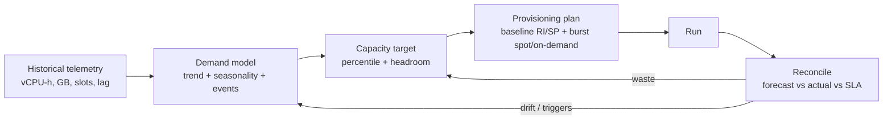

# Capacity Planning for Data Platforms

> Chapter from the Data Engineering Playbook — finops.

## About This Chapter

**What this is.** Capacity planning is sizing compute, storage, and concurrency to meet SLAs at peak without over-committing dollars. This chapter treats SLA and cost as one optimization, modeling demand as a distribution and provisioning a baseline floor while letting burst capacity absorb the variance.

**Who it's for.** Data engineers, platform/architecture leads, and engineering managers/tech leads.

**What you'll take away.** By the end you'll be able to:
- Run the measure→forecast→provision→reconcile loop, decomposing demand into trend, seasonality, and explicitly-budgeted events (backfills, launches).
- Apply queueing reality (`ResponseTime ≈ ServiceTime/(1−ρ)`) and plan to the binding constraint — memory, shuffle, slots, or partitions — instead of vCPU alone.
- Compute a commit floor (p5–p10) for Savings Plans, size additive recovery/burst/maintenance headroom, and verify a backfill converges with `P·R > λ` before launch.

---

Capacity planning is the discipline of buying the *right* amount of compute, storage, and concurrency *just before* you need it — not after a pager goes off, and not eighteen months early into a reserved-instance commitment you can't unwind. For a data platform this is harder than for a stateless web service: workloads are bursty (backfills, month-end close, holiday traffic), the unit of capacity is heterogeneous (vCPU, GB, slots, partitions, throughput-units), and the cost of getting it wrong shows up on two different ledgers — the AWS bill and the SLA dashboard.

## TL;DR

- Capacity planning answers two coupled questions: *will the platform meet its SLA at peak?* and *how much will that cost?* Treat them as one optimization, not two.
- Model demand as a **distribution**, not a point estimate. Plan to a percentile (p95/p99 of demand), size headroom to your recovery objective, and let autoscaling absorb the variance you didn't forecast.
- The governing equation is **Little's Law** and **queueing theory**: utilization above ~70-80% on a shared cluster means latency explodes non-linearly. "We're only at 85% CPU" is a warning, not a victory.
- Separate **baseline** (steady-state, suited to Reserved/Savings Plans) from **burst** (backfills, reprocessing, suited to spot/on-demand). Committing to your peak is how you set money on fire.
- The most expensive capacity mistake in data is **the backfill you didn't budget for**. Reserve explicit headroom for it; it is not an edge case, it is a quarterly event.
- Forecasts decay. Re-forecast on a cadence (monthly) and on triggers (new tenant, schema explosion, a 2× data-source) — a 12-month-old growth curve is fiction.

## Why this matters in production

Concrete scenario. You run a Spark-on-EMR + Iceberg lakehouse feeding a Databricks SQL serving layer. The platform has hummed along at ~400 EMR core-hours/day for a year. Then three things happen in the same quarter:

1. A new product team onboards and lands a clickstream source that triples raw ingest volume.
2. Finance asks for a 36-month historical restatement — a backfill over 2.1 TB of compacted Parquet.
3. The holiday season doubles transaction volume for six weeks.

If you sized your Reserved Instances to last year's steady state, the backfill and the new tenant now run on on-demand at 3-4× the rate, and your month-end SQL warehouse queues because the BI concurrency limit was set for the old user count. The first signal isn't a cost alert — it's the data-quality [freshness](../../data-quality/freshness/README.md) SLO breaching because the 02:00 batch is now finishing at 09:30, after the dashboards refreshed.

Capacity planning is the work that turns all three of those into *line items on a forecast* instead of *incidents*. It is upstream of [cost optimization](../cost-optimization/README.md) (you can't right-size what you haven't sized) and it consumes the per-team signal produced by [cost attribution](../cost-attribution/README.md).

## How it works

Capacity planning has four stages that form a closed loop: **measure → forecast → provision → reconcile.**



**The demand model.** Decompose each workload's resource series into trend, seasonality, and event spikes:

```
demand(t) = baseline + g·t           (linear/compound growth)
          + S(t)                     (weekly/monthly seasonality)
          + Σ eventᵢ(t)              (known one-offs: backfills, launches)
          + ε                        (noise → drives headroom)
```

You forecast `baseline + g·t + S(t)`, you *budget* the events explicitly, and you size headroom against `ε` plus your failure-recovery requirement.

**The queueing reality.** Capacity is not "does average demand fit average supply." Under variable arrivals, latency follows the M/M/1 (or M/M/c) response curve:

```
ResponseTime ≈ ServiceTime / (1 − ρ)        where ρ = utilization
```

At ρ=0.5, response time is 2× service time. At ρ=0.9 it's 10×. At ρ=0.95 it's 20×. This is *why* you can't run a shared cluster at 95% CPU and expect predictable SLAs — and why "headroom" is not waste, it's the price of bounded latency. Little's Law (`L = λ·W`) closes the loop: the number of concurrent jobs in flight equals arrival rate times time-in-system, so a slowdown (rising W) silently inflates concurrency (rising L) until you hit a hard limit (executor slots, warehouse max clusters, Kafka consumer lag).

**Sizing to a percentile.** Pick the demand percentile you provision the baseline for and the mechanism that covers the rest:

| Layer | Provision baseline to | Covers the rest with |
|---|---|---|
| Steady batch (EMR/Spark) | p50-p75 of daily core-hours | Managed scaling, spot task nodes |
| Interactive SQL (Databricks/BigQuery) | p90 of concurrent queries | Multi-cluster autoscaling, query queueing |
| Streaming (Kafka/Flink) | p99 of sustained throughput | Partition headroom + standby capacity |
| Storage (S3/Iceberg) | trend + 90 days | Elastic; budget, don't pre-provision |

Streaming sits at p99 because you cannot "queue" a firehose without growing lag, and lag is unbounded — see [consumer-groups](../../kafka/consumer-groups/README.md) and [offsets](../../kafka/offsets/README.md).

## Deep dive

This is where engineers get it wrong. The mechanics that don't fit on a slide.

### 1. The unit of capacity is not vCPU — it's the bottleneck resource

A Spark job that OOMs at 60% CPU is *memory-bound*; adding cores does nothing. A shuffle-heavy job is *network/disk-bound*. A SQL warehouse with 200 idle connections is *concurrency-slot-bound*. Capacity planning to CPU alone is the classic failure. Profile each workload class for its **binding constraint** and plan that dimension:

- **Memory-bound Spark**: plan executor count from `peak shuffle/spill + cached RDD bytes`, not vCPU. `spark.executor.memory` × executors must exceed peak working set, or you pay in spill I/O (which then makes you *also* disk-bound). See [skew-handling](../../spark-internals/skew-handling/README.md) — one hot key can make a job that "should" need 50 executors need 200.
- **Concurrency-bound SQL**: capacity = max concurrent queries, not data scanned. Databricks SQL serverless scales clusters on queue depth; the planning variable is `max_num_clusters`, and the cost knob is how aggressively you let it scale down.
- **Throughput-bound streaming**: capacity = partition count × per-partition consumer throughput. You cannot add consumers beyond partition count, so partition count is a *capacity-planning decision made at topic-creation time* and is expensive to change later.

### 2. Headroom math: don't confuse "headroom" with "slack"

Headroom must cover three distinct things, and they add:

```
headroom = recovery_headroom        # absorb a lost AZ / node group while staying under SLA
         + burst_headroom           # the demand variance ε you chose not to forecast
         + maintenance_headroom      # compaction, vacuum, OPTIMIZE running concurrently
```

A common error: sizing for N-1 node failure but forgetting that nightly Iceberg compaction and the freshness backfill run in the *same window*. Two independent "spare" pools that turn out to be the same pool. When you plan a 99.9% monthly availability target, that's 43 minutes of downtime budget — your recovery_headroom has to bring a replacement node group up *within* that budget, which for EMR means warm capacity or a pre-scaled instance fleet, not "the autoscaler will figure it out in 12 minutes."

### 3. Backfills are the dominant non-steady cost, and they're forecastable

A backfill of D days of history at throughput R, parallelized over P workers, against a steady stream still arriving at rate λ:

```
wall_clock ≈ (D · daily_volume) / (P · R − λ)
```

Two traps fall out of this formula:

- If `P·R ≤ λ` you **never catch up** — the backfill diverges. People discover this at hour 14 of a backfill that's losing ground. Always check that effective throughput exceeds live arrival rate before launching.
- The `P` that minimizes wall-clock often *maximizes* cost (more spot reclaims, more shuffle, diminishing returns past the shuffle-partition sweet spot). Plan backfills to a *deadline*, then choose the smallest `P` that hits it.

### 4. Reserved commitments and the lock-in trap

Savings Plans / Reserved Instances trade flexibility for ~30-60% discount. The planning rule: **commit only to the floor of your demand distribution — the capacity you are statistically certain to use 24/7 for the commitment term.** Compute the floor as roughly the p5-p10 of hourly demand over a representative period, *not* the average and never the peak. Everything above the floor rides on-demand or spot. A 3-year commit to your *average* means you pay for capacity you don't use at night and still burst onto on-demand at peak — the worst of both. This is the seam where capacity planning hands off to [cost optimization](../cost-optimization/README.md).

### 5. Forecast decay and the re-forecast cadence

A growth curve fit six months ago is wrong today because: a new tenant changed the slope, a schema added 40 columns and doubled bytes-per-row, or a deprecation removed a workload. Re-forecast monthly *and* on triggers:

| Trigger | Why it invalidates the forecast |
|---|---|
| New tenant / data product onboarded | Step change in baseline, not captured by trend |
| 2× source volume or new high-cardinality dimension | Bytes-per-row and shuffle volume jump |
| SLA tightened (e.g., freshness 6h→1h) | Higher percentile target → more baseline |
| Engine/format migration (Hive→Iceberg, EMR→EKS) | Throughput-per-dollar changes; old R is invalid |
| Incident post-mortem | Real peak was higher than the planned percentile |

## Worked example

End-to-end: forecast next-quarter EMR core-hours from telemetry, decide the commit floor, and size backfill headroom. Telemetry comes from Spark event logs / CloudWatch; this runs as a PySpark job.

```python
import numpy as np
import pandas as pd
from pyspark.sql import functions as F

# 1) Load 180 days of daily core-hours per workload class from the metering table
daily = (
    spark.read.table("platform.metering.emr_core_hours")
    .where(F.col("ds") >= F.date_sub(F.current_date(), 180))
    .groupBy("ds")
    .agg(F.sum("core_hours").alias("core_hours"))
    .orderBy("ds")
    .toPandas()
)

# 2) Decompose: linear trend + day-of-week seasonality
daily["t"] = np.arange(len(daily))
daily["dow"] = pd.to_datetime(daily["ds"]).dt.dayofweek
trend = np.polyfit(daily["t"], daily["core_hours"], deg=1)        # [slope, intercept]
g, b0 = trend
seasonal = daily.groupby("dow")["core_hours"].mean()
seasonal = seasonal - seasonal.mean()                            # additive seasonal offsets

# residual ε after removing trend + seasonality -> drives headroom
fitted = b0 + g * daily["t"] + daily["dow"].map(seasonal).values
resid_std = (daily["core_hours"] - fitted).std()

# 3) Forecast the next 90 days, then take demand percentiles
future = np.arange(len(daily), len(daily) + 90)
future_dow = (pd.to_datetime(daily["ds"].iloc[-1]) + pd.to_timedelta(np.arange(1, 91), "D")).dayofweek
forecast = b0 + g * future + future_dow.map(seasonal).values

p50 = np.percentile(forecast, 50)
p95 = np.percentile(forecast, 95)

# 4) The commit floor = the capacity we use ~every hour, all term long.
#    Approx as p10 of the forecast minus a safety margin (never commit to the average).
commit_floor = max(0.0, np.percentile(forecast, 10) - 1.0 * resid_std)

# 5) Headroom = recovery (N-1 of a 10-node baseline) + burst (1.65σ ≈ p95 of noise) + maintenance
recovery_headroom   = p50 * (1 / 10)        # tolerate losing 1 of 10 baseline nodes
burst_headroom      = 1.65 * resid_std      # one-sided 95% of residual noise
maintenance_headroom = p50 * 0.08           # compaction/OPTIMIZE overlap
planned_peak = p95 + recovery_headroom + burst_headroom + maintenance_headroom

print(f"daily growth slope (core-h/day): {g:6.1f}")
print(f"forecast p50 / p95 core-h:       {p50:8.0f} / {p95:8.0f}")
print(f"commit floor (Savings Plan):     {commit_floor:8.0f}")
print(f"planned peak (provision to):     {planned_peak:8.0f}")
print(f" -> burst above floor on spot:   {planned_peak - commit_floor:8.0f}")
```

Backfill headroom check — *before* launching the 36-month restatement, verify it converges and hits the deadline:

```python
D_days        = 36 * 30          # history to reprocess
daily_volume  = 0.60             # TB/day of source landed historically
live_lambda   = 0.18             # TB/day still arriving on the stream
per_worker_R  = 0.05             # TB/day throughput per Spark task node (measured!)
deadline_days = 5

# smallest P that meets the deadline AND beats live arrival rate
for P in range(1, 400):
    eff = P * per_worker_R - live_lambda
    if eff <= 0:
        continue                                  # diverges: never catches up
    wall = (D_days * daily_volume) / eff
    if wall <= deadline_days:
        print(f"backfill: {P} task nodes -> {wall:.1f} days (eff {eff:.2f} TB/day)")
        break
else:
    print("No worker count meets the deadline — extend deadline or raise per-worker R")
```

The matching EMR managed-scaling config keeps the steady baseline on-demand and lets the backfill burst onto spot task nodes, with a hard ceiling so the plan is enforced, not hoped for:

```json
{
  "ManagedScalingPolicy": {
    "ComputeLimits": {
      "UnitType": "InstanceFleetUnits",
      "MinimumCapacityUnits": 10,
      "MaximumCapacityUnits": 120,
      "MaximumOnDemandCapacityUnits": 10,
      "MaximumCoreCapacityUnits": 20
    }
  }
}
```

`MinimumCapacityUnits=10` is the committed baseline (Savings Plan covered), `MaximumOnDemandCapacityUnits=10` pins on-demand to the baseline only, and units 11-120 are spot task nodes for burst/backfill. The cap of 120 is the *enforced* planned-peak — a runaway query can't silently quadruple the bill.

## Production patterns

- **Two-tier provisioning by default.** Baseline pool (RI/Savings Plan, on-demand, long-lived) + burst pool (spot, ephemeral, interruptible). Tag them distinctly so [cost attribution](../cost-attribution/README.md) can show "baseline vs burst" per team — that split is the single most useful FinOps chart.
- **Capacity as a budgeted line item per workload class.** Don't forecast "the platform." Forecast ingest, transform, serving, and ML-feature workloads separately; they have different growth slopes and binding constraints.
- **Scheduled pre-scaling for known events.** Month-end close, Black Friday, and quarterly restatements are on the calendar. Pre-warm the cluster on a cron 30-60 min ahead rather than letting cold autoscaling eat into the SLA window.
- **A standing "backfill budget."** Reserve an explicit, named slice of capacity (and dollars) for reprocessing every quarter. Treat its *absence* as the anomaly.
- **Saturation SLOs, not just utilization dashboards.** Alert on queue depth, Spark task wait time, Kafka consumer lag derivative, and SQL warehouse queued-query count — these lead the latency breach. CPU% lags it. Wire these into [monitoring](../../observability/monitoring/README.md) and [metrics](../../observability/metrics/README.md).
- **Partition headroom up front for Kafka.** Over-partition modestly at topic creation (capacity decision you can't cheaply reverse) so you can scale consumers later without a repartition migration.

## Anti-patterns & failure modes

| Anti-pattern | Symptom you'd observe | Fix |
|---|---|---|
| Plan to average demand | Nightly idle waste *and* daytime on-demand burst on the same cluster | Commit to the floor (p5-p10), burst above it on spot |
| Size to CPU only | Job OOMs / spills at 55% CPU; adding cores doesn't help | Plan to the binding constraint (memory, shuffle, slots) |
| Run shared cluster at 90%+ | p99 latency 10×+ service time; "random" SLA breaches | Cap steady utilization ~70%; headroom is not waste |
| No backfill budget | Backfill pre-empts batch; freshness SLO breaches; cost spikes 3× | Standing backfill capacity + convergence check (`P·R > λ`) |
| Commit 3yr to peak | RI utilization < 40%; locked-in waste you can't unwind | Commit floor only; layer Savings Plans incrementally |
| Set-and-forget forecast | Forecast off 50%+ within a quarter after a new tenant | Monthly re-forecast + trigger-based re-forecast |
| Under-partition Kafka | Can't scale consumers; lag grows; partition migration outage | Over-partition modestly at creation time |
| Backfill that diverges | Lag *grows* during backfill; ETA recedes | Verify `P·per_worker_R − λ > 0` before launch |

## Decision guidance

**Forecasting method — pick by data maturity:**

| Situation | Method | Why |
|---|---|---|
| <6 months telemetry, stable | Linear trend + DoW seasonality (as above) | Simple, transparent, defensible in review |
| Strong weekly/yearly seasonality | Holt-Winters / Prophet | Captures multiplicative seasonality |
| Spiky, event-driven (launches) | Trend baseline + explicit event budget | ML smears spikes; budget them manually |
| Hard real-time SLA (streaming) | Queueing model to p99 + standby | Latency is non-linear; averages lie |

**Provisioning model — pick by workload shape:**

| Workload | Model | Rationale |
|---|---|---|
| Steady 24/7 transform | Savings Plan / RI to the floor | Maximize discount on certain capacity |
| Bursty batch / backfill | Spot task nodes, capped | Cheapest, interruption-tolerant |
| Interactive SQL | Serverless autoscaling, queue-based | Demand is concurrency, not bytes |
| Streaming | Provisioned to p99 + partition headroom | Can't queue a firehose |

Use capacity *planning* (this chapter) to decide *how much*; use [cost optimization](../cost-optimization/README.md) to make each unit cheaper; use [cost attribution](../cost-attribution/README.md) to know *whose* growth is driving the curve.

## Interview & architecture-review talking points

- "We provision the baseline to the p5-p10 floor on a Savings Plan and burst everything above it on capped spot. Committing to the average is how teams end up paying for night-time idle *and* daytime on-demand simultaneously."
- "Headroom isn't slack — it's three additive budgets: recovery, burst, and maintenance. The classic miss is assuming N-1 spare and compaction headroom are the same pool. They overlap in the nightly window."
- "We plan to the binding constraint per workload class, not vCPU. A memory-bound Spark stage and a concurrency-bound SQL warehouse have nothing in common except that planning them on CPU% is wrong for both."
- "Before any large backfill we check `P·R > λ` — effective throughput must exceed live arrival or it diverges. Then we pick the *smallest* worker count that hits the deadline, because the parallelism that minimizes wall-clock usually maximizes cost."
- "We alert on saturation signals — queue depth, Spark task wait, consumer-lag derivative — because those lead the latency breach. Utilization dashboards lag the incident."
- "Forecasts decay. We re-forecast monthly and on triggers: new tenant, 2× source, tightened SLA, engine migration. A point estimate from last quarter is fiction."

## Further reading

- [Cost Optimization](../cost-optimization/README.md) — making each provisioned unit cheaper once you've sized it
- [Cost Attribution](../cost-attribution/README.md) — per-team metering that tells you whose growth bends the curve
- [Skew Handling](../../spark-internals/skew-handling/README.md) — why a single hot key blows up your executor count estimate
- [Kafka Consumer Groups](../../kafka/consumer-groups/README.md) and [Offsets](../../kafka/offsets/README.md) — throughput-bound capacity and lag as the streaming saturation signal
- [Data Freshness](../../data-quality/freshness/README.md) — the SLO that breaks first when capacity falls short
- [Monitoring](../../observability/monitoring/README.md) — wiring saturation SLOs that lead latency breaches
- Gunther, N. *Guerrilla Capacity Planning* — the queueing-theory foundation (Universal Scalability Law)
- AWS Well-Architected Framework, Cost Optimization Pillar — Right Sizing and Demand-Based Supply
