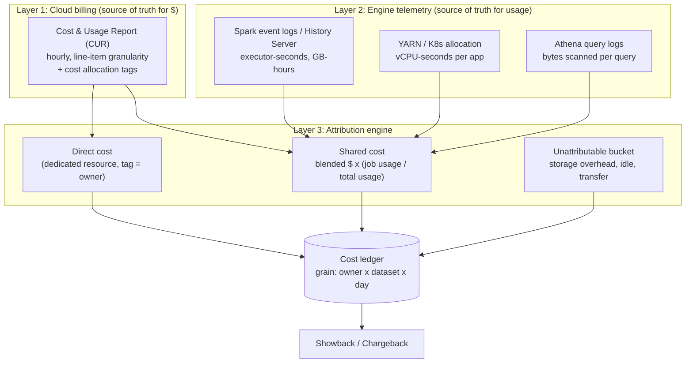

# Cost Attribution

> Chapter from the **Data Engineering Playbook** — finops.

Cost attribution is the discipline of answering one question without hand-waving: *who spent this dollar, and on what?* On a data platform that means mapping a line item on the AWS bill — an EMR step, an EC2 instance-hour, a TB scanned by Athena, an S3 GET — back to the team, pipeline, dataset, or business product that caused it. Get this wrong and every downstream FinOps motion (showback, chargeback, budgets, optimization prioritization) is built on sand.

## TL;DR

- The hard part of cost attribution is not the dashboard, it is the **join key**. You need a consistent dimension (team / pipeline / dataset) stamped onto compute at launch time, because the bill only knows about instances, not jobs.
- AWS gives you ~70-80% coverage with **cost allocation tags** + **Cost and Usage Report (CUR)**. The remaining 20-30% — shared clusters, S3 storage shared across tables, idle capacity, the data transfer line — is where the real engineering lives.
- **Shared resources break naive tagging.** A multi-tenant EMR cluster or a shared Spark-on-K8s pool carries one set of instance tags but runs ten teams' jobs. You must split that cost by an internal usage signal (vCPU-seconds, executor-seconds, slots), not by the cloud tag.
- **Untagged and unattributable cost is a first-class metric.** Track "% of spend attributable to an owner" as an SLO. If it drops below ~90%, your chargeback numbers are politically indefensible.
- **Showback before chargeback.** Publish costs by owner for one or two quarters and let teams trust the numbers before money actually moves. Chargeback with bad attribution destroys trust permanently.
- Attribution is plumbing for [cost optimization](../cost-optimization/README.md) and [capacity planning](../capacity-planning/README.md): you cannot optimize what you cannot see, and you cannot forecast what you cannot attribute.

## Why this matters in production

A concrete scenario from a lakehouse platform serving ~40 teams:

The monthly AWS bill is $480K. Finance asks the platform org to allocate it back to the four business units that fund the platform. The platform lead opens Cost Explorer, groups by the `team` tag, and finds:

- 62% of cost has a `team` tag and maps cleanly.
- 23% sits under a shared EMR cluster tagged `team=data-platform` — which is the platform team's own tag, but the cluster is actually running ELT jobs for marketing, finance, and risk.
- 9% is S3 storage and `DataTransfer-Out` with no meaningful per-team tag at all.
- 6% is untagged entirely (someone launched EC2 by hand, a Glue job with no tags, a forgotten dev cluster).

So 38% of a $480K bill — $182K/month — cannot be honestly attributed. When the platform tries to chargeback, marketing disputes their number, finance escalates, and the whole exercise stalls. The dashboard was never the problem. The **attribution model** was.

The fix is not "tag harder." Shared compute fundamentally cannot be attributed by cloud tags, because the tag is on the instance and the cause is the job. You need a second layer: capture per-job resource consumption from the engine itself (Spark event logs, EMR step metrics, YARN/K8s allocation), and **apportion** the shared cluster's blended cost across jobs by their measured consumption.

## How it works

There are three layers, and the architecture only works when all three are present:



**Layer 1 — Cloud billing.** Enable the Cost and Usage Report (CUR), not just Cost Explorer. CUR is delivered to S3 as Parquet at hourly, line-item granularity with one column per activated cost allocation tag (`resource_tags_user_team`, `resource_tags_user_pipeline`, etc.). Cost Explorer is a viewer; CUR is the queryable fact table. Activate your tag keys in the Billing console — an *unactivated* tag does not appear as a CUR column even if the resource carries it. This is the single most common silent failure.

**Layer 2 — Engine telemetry.** The bill tells you a `r6g.4xlarge` ran for 6 hours and cost $5.80. It does not tell you that of those 6 hours, marketing's job used 4,000 executor-seconds and finance's used 1,500. That ratio lives in the Spark event log (`spark.eventLog.dir`), in EMR step metrics, or in YARN's `ApplicationResourceUsageReport`. You must collect it.

**Layer 3 — The attribution engine.** This joins the two and produces a ledger at the grain `owner × dataset × day`. The core formula for a shared resource:

```
attributed_cost(job_j, resource_r) =
    blended_cost(resource_r, window)
    × ( usage(job_j) / Σ_k usage(job_k) )

where usage = executor-seconds  (or vCPU-seconds, or slot-ms)
```

The denominator `Σ usage` is over **all** jobs that ran on `r` in the window — *including* idle. If the cluster was 60% utilized, the other 40% (idle compute you paid for) does not vanish; it must be parked in an explicit overhead bucket and either re-apportioned proportionally or charged to the cluster owner. The choice is a policy decision, and it must be written down.

### Showback vs chargeback

| | Showback | Chargeback |
|---|---|---|
| Money moves | No | Yes (internal cross-charge) |
| Accuracy bar | "directionally right" | accountant-defensible |
| Failure cost | a confusing dashboard | broken trust, escalations |
| Right starting point | always | only after showback is trusted |

## Deep dive

This is where attribution projects actually succeed or fail.

### 1. The cloud tag is on the resource; the cost cause is the workload

Tagging works perfectly for **dedicated** resources: a Kafka MSK cluster owned by one team, an Airflow EC2 box, a dataset-specific transient EMR cluster spun up by one DAG. Tag it `team=risk`, done.

It breaks completely for **shared** resources, which on a mature platform is where most of the spend goes:

- A persistent EMR/YARN cluster running steps for 12 teams.
- A Spark-on-EKS node pool with bin-packed executors from many namespaces.
- An S3 bucket holding 600 Iceberg tables owned by 30 teams.
- A Databricks SQL warehouse or Athena workgroup serving everyone.

For these, the cloud tag is meaningless for attribution. The instance is tagged `team=platform` and that is *correct* — the platform owns the instance — but it is *useless* for telling marketing what they owe. You have to descend into Layer 2.

### 2. Picking the usage metric for apportionment

What you divide by determines who pays. Choose deliberately:

| Metric | Captures | Gotcha |
|---|---|---|
| **executor-seconds** (`executorRunTime` summed) | CPU time held | Ignores memory; a memory-heavy job that pins a node looks cheap |
| **vCPU-seconds × memory-GB-seconds** (max-of-ratio) | Dominant resource (DRF-style) | Closer to what actually constrains the node; harder to compute |
| **bytes scanned** (Athena/Trino) | Serverless query cost | Only valid for scan-priced engines |
| **slot-ms** (BigQuery) | Reserved-slot consumption | Specific to BQ reservations |

For Spark, the defensible default is **memory-GB-seconds** when jobs are memory-bound (most Iceberg/Parquet ETL is) and **executor-seconds** when CPU-bound. A blunt but workable heuristic used in practice: `cost_weight = executor_seconds × max(1, requested_mem_gb / cores)`. This stops a `spark.executor.memory=32g, cores=1` job from being attributed the same as a `4g, 4-core` job that held the same wall-clock executor time.

### 3. Idle, overhead, and the "shared platform tax"

A reserved 100-node cluster running at 55% utilization has 45 nodes of cost with no job to attribute. Three policies, in increasing fairness and complexity:

1. **Charge idle to the cluster owner (platform).** Simple, but the platform's budget balloons and looks like waste it cannot control.
2. **Re-apportion idle proportionally to actual users.** Each team pays a "platform tax" proportional to their usage. Most defensible; what most mature orgs land on.
3. **Charge idle to the team whose autoscaling floor or reservation created it.** Correct in theory, brutal to compute, requires per-team reservation tracking.

Whatever you pick, **report idle as its own line**. The moment a team sees "you owe $40K, $9K of which is your share of idle capacity," they have a concrete lever — and that conversation is the entire point of FinOps.

### 4. Storage attribution is a different beast

Compute is a flow (per-second); storage is a stock (per-GB-month). A 600-table S3 bucket needs prefix-level attribution. Two real options:

- **S3 Storage Lens** + prefix conventions (`s3://lake/<domain>/<dataset>/...`) gives you per-prefix bytes, but Storage Lens prefix metrics are advanced-tier (paid) and have depth limits.
- **S3 Inventory** (daily Parquet manifest of every object with size + last-modified), joined against your table catalog (Iceberg/Glue) to map prefix → dataset → owner. This is the precise path and what I default to for lakehouses, because it also surfaces orphaned files, failed-compaction debris, and old snapshots that pure billing never reveals.

Storage attribution also forces a versioning conversation: Iceberg snapshot retention, S3 versioning, and incomplete multipart uploads are real GB that someone is paying for and nobody asked for. (See [iceberg-health-monitor](../../../iceberg-health-monitor) for snapshot/orphan tracking that feeds straight into storage attribution.)

### 5. Data transfer is the line item everyone forgets

`DataTransfer-Out`, `DataTransfer-Regional`, and NAT gateway processing (`NatGateway-Bytes`) routinely run 5-12% of a data platform's bill and carry almost no useful tag. Cross-AZ shuffle in a poorly-placed Spark cluster, cross-region replication, and egress to a BI tool all land here. The honest move is to attribute what you can via VPC Flow Logs (source/dest ENI → workload) and put the irreducible remainder in the unattributable bucket — never silently smear it.

### 6. Latency of the bill

CUR is finalized days after the fact and is re-stated as credits, RIs, and Savings Plans are applied. Engine telemetry is available in minutes. So you have a **fast/approximate** attribution (engine usage × an estimated blended rate) for daily ops, and a **slow/authoritative** monthly reconciliation against finalized CUR. Conflating these — showing engineers a number that contradicts what finance later bills — is a credibility killer. Label every cost figure as *estimated* or *reconciled*.

## Worked example

Apportion a shared EMR cluster's daily cost across the Spark applications that ran on it, weighted by memory-GB-seconds, with idle re-apportioned proportionally.

**Inputs**
- `cur` — Cost & Usage Report (Parquet in S3, queried via Athena/Spark).
- `spark_app_usage` — derived from Spark event logs (one row per application): `app_id`, `owner`, `dataset`, `executor_seconds`, `requested_mem_gb`, `cluster_id`, `usage_date`.

```python
from pyspark.sql import functions as F, Window

# 1. Daily blended cost of each shared cluster from the CUR.
#    Filter to EC2 line items carrying the cluster's resource id.
cluster_cost = (
    spark.read.parquet("s3://billing/cur/parquet/")
    .where(F.col("line_item_product_code") == "AmazonEC2")
    .where(F.col("resource_tags_aws_elasticmapreduce_job_flow_id").isNotNull())
    .groupBy(
        F.col("resource_tags_aws_elasticmapreduce_job_flow_id").alias("cluster_id"),
        F.to_date("line_item_usage_start_date").alias("usage_date"),
    )
    .agg(F.sum("line_item_unblended_cost").alias("cluster_cost_usd"))
)

# 2. Per-app usage weight. Memory-GB-seconds with a CPU floor so a
#    1-core/32g job is not undercounted vs a 4-core/4g job.
app_usage = (
    spark.table("finops.spark_app_usage")
    .withColumn(
        "usage_weight",
        F.col("executor_seconds")
        * F.greatest(F.lit(1.0), F.col("requested_mem_gb") / F.col("requested_cores")),
    )
)

# 3. Each app's share of its cluster-day. Window over cluster x day.
w = Window.partitionBy("cluster_id", "usage_date")
app_share = app_usage.withColumn(
    "usage_share", F.col("usage_weight") / F.sum("usage_weight").over(w)
)

# 4. Join cost to share. Because usage_share sums to 1.0 over the
#    cluster-day, idle capacity is implicitly re-apportioned across
#    active jobs (Policy #2). We surface the idle separately below.
attributed = (
    app_share.join(cluster_cost, ["cluster_id", "usage_date"])
    .withColumn("attributed_cost_usd", F.col("usage_share") * F.col("cluster_cost_usd"))
    .select(
        "usage_date", "owner", "dataset", "cluster_id", "app_id",
        "usage_weight", "usage_share", "attributed_cost_usd",
    )
)

# 5. Reconciliation invariant: attributed must equal cluster cost to the penny.
recon = (
    attributed.groupBy("cluster_id", "usage_date")
    .agg(F.sum("attributed_cost_usd").alias("sum_attributed"))
    .join(cluster_cost, ["cluster_id", "usage_date"])
    .withColumn("delta", F.round(F.col("sum_attributed") - F.col("cluster_cost_usd"), 2))
)
assert recon.where(F.abs("delta") > 0.01).count() == 0, "attribution does not reconcile to CUR"

(
    attributed.write.format("iceberg").mode("overwrite")
    .partitionBy("usage_date")
    .saveAsTable("finops.cost_ledger_compute")
)
```

The **reconciliation invariant in step 5 is the test that matters**: every dollar the cluster cost must land on exactly one owner. If `sum(attributed) != cluster_cost`, you have either a join miss (an app with no CUR match) or double counting. Ship attribution without this assert and you will be off by a few percent in a way nobody catches until finance does.

For the unattributable buckets, a coverage query:

```sql
SELECT
  CASE
    WHEN owner IS NOT NULL                    THEN 'attributed'
    WHEN product_code IN ('AmazonS3')         THEN 'storage_unmapped'
    WHEN usage_type LIKE '%DataTransfer%'     THEN 'data_transfer'
    WHEN usage_type LIKE '%NatGateway%'       THEN 'nat'
    ELSE 'untagged'
  END                                          AS bucket,
  ROUND(SUM(unblended_cost), 0)                AS cost_usd,
  ROUND(100.0 * SUM(unblended_cost)
        / SUM(SUM(unblended_cost)) OVER (), 1) AS pct_of_bill
FROM finops.cur_with_owner
WHERE usage_date >= date_add('month', -1, current_date)
GROUP BY 1
ORDER BY cost_usd DESC;
```

Track `pct_of_bill` for `bucket = 'attributed'` as your **attribution coverage SLO**. Below 90% and the chargeback exercise will not survive its first dispute.

## Production patterns

- **Stamp identity at launch, not after.** Inject `team`, `pipeline`, `dataset`, and `cost_center` as both cloud tags *and* Spark conf (`spark.executorEnv.PIPELINE_ID`, `--conf spark.yarn.tags=...`) at job submission, centrally enforced in your orchestration layer (Airflow operator, EMR step wrapper, Spark submit shim). Tags applied by hand always rot.
- **A tagging policy enforced by Service Control Policies / AWS Config.** A Config rule that flags any EC2/EMR/Glue resource missing required tag keys, plus an SCP that denies `RunInstances` without them, keeps the untagged bucket from creeping back up. Enforcement, not documentation, holds the line.
- **One canonical owner dimension.** Resolve `team` tags against an org directory (a `dim_team` table sourced from your IdP/HR system) so that `mktg`, `marketing`, and `MKTG-2` collapse to one owner. Free-text tags fork; a dimension table with surrogate keys does not.
- **Cost ledger as a versioned table.** Store the `owner × dataset × day` ledger in Iceberg so you can re-run attribution after late-arriving CUR restatements and keep an audit trail of *why* a number changed.
- **Anomaly detection on the attributed series, not the raw bill.** A 3× spike on `owner=risk, dataset=fraud_features` is far more actionable than "the bill went up." Alert per-owner with a day-over-day and week-over-week threshold.
- **Unit economics on top of attribution.** Once cost is attributed to a dataset, divide by a business unit (cost per 1M events processed, cost per dashboard query, cost per model training run). That number is what executives actually act on, and it feeds directly into [capacity planning](../capacity-planning/README.md).

## Anti-patterns & failure modes

| Anti-pattern | Symptom you observe | Fix |
|---|---|---|
| Tag-only attribution on shared clusters | One team (`platform`) shows 30%+ of spend; everyone disputes it | Add Layer 2 engine telemetry and apportion by usage |
| Tag key never activated in Billing console | Resources are tagged, but the CUR column is all NULL | Activate the tag key; wait ~24h for CUR to backfill the column |
| Idle silently smeared into user costs | Teams say "we didn't run anything near that much" | Break out idle as its own ledger line; pick an explicit idle policy |
| Mixing estimated and reconciled numbers | Engineer's daily dashboard contradicts finance's monthly bill | Label every figure; reconcile monthly against finalized CUR |
| Free-text owner tags | `marketing` vs `mktg` vs `Marketing-Team` split one owner three ways | Resolve through a `dim_team` dimension keyed to the IdP |
| Chargeback before showback | Escalations, lost trust, attribution abandoned | Run showback for 1-2 quarters until numbers are trusted |
| No reconciliation invariant | Allocated total quietly drifts a few % from the bill | Assert `Σ attributed == bill` per cluster-day in the pipeline |
| Ignoring storage versioning | S3 bill grows; no compute explains it | S3 Inventory join; track Iceberg snapshot/orphan retention |

## Decision guidance

**When tag-only attribution is enough:** dedicated, single-tenant resources (one team per cluster, per bucket, per warehouse). Small org, few teams, high isolation. Don't build a usage-apportionment engine for five teams on five clusters — that is over-engineering.

**When you need usage-based apportionment (Layer 2):** any persistent multi-tenant compute — shared EMR/YARN, Spark-on-EKS bin-packing, shared SQL warehouses. The moment one resource serves more than ~2 teams, tags alone will be politically contested.

**When to buy vs build:**

| Approach | Fits | Watch out for |
|---|---|---|
| AWS-native (CUR + Athena + QuickSight) | AWS-only, willing to model apportionment yourself | No engine telemetry layer — you build Layer 2 |
| Vendor FinOps (CloudHealth, Kubecost, Vantage) | Want dashboards/chargeback fast; mixed cloud | Kubecost is excellent for K8s usage but weak on EMR/Spark-on-YARN specifics |
| Build the ledger in-house | Lakehouse with rich Spark telemetry, custom owner model | Maintenance cost; you own the reconciliation logic |

In practice: CUR for the dollars, a home-grown Spark/EMR telemetry collector for Layer 2, an Iceberg cost ledger, and a BI tool on top. Vendors handle K8s well but rarely model a shared YARN cluster's per-step apportionment the way you need.

## Interview & architecture-review talking points

- "Attribution is a join problem, not a dashboard problem. The bill is keyed on resources; cost is caused by workloads. The architecture exists to bridge those two key spaces." Lead with this — it shows you understand the core difficulty.
- "On shared compute, cloud tags are necessary but not sufficient. I apportion blended cost by measured usage — memory-GB-seconds for memory-bound Spark — and I treat idle as an explicit, separately-reported line with a written policy, not a silent smear."
- "I enforce a reconciliation invariant: the sum of attributed cost equals the bill to the penny per cluster-day. Without it, drift accumulates invisibly until finance catches it, and then you've lost the room."
- "Coverage is an SLO. I track percent-of-spend-attributable-to-an-owner and gate chargeback on it staying above 90%. Below that, chargeback is indefensible and I keep it as showback."
- "I separate fast/estimated daily attribution from slow/reconciled monthly truth, and label every number. Showing engineers a figure that contradicts finance is how a FinOps program loses credibility."
- "Storage and data transfer are where naive programs leave 20-30% unattributed. I use S3 Inventory joined to the table catalog for storage and VPC Flow Logs for transfer, and I never pretend the irreducible remainder is zero."

## Further reading

- [Cost Optimization](../cost-optimization/README.md) — what you do *after* attribution tells you where the money is.
- [Capacity Planning](../capacity-planning/README.md) — forecasting that consumes the attributed unit-economics series.
- [Observability › Metrics](../../observability/metrics/README.md) — the telemetry collection patterns that feed Layer 2.
- [iceberg-health-monitor](../../../iceberg-health-monitor) — snapshot/orphan tracking that feeds storage attribution.
- [FinOps Foundation — Cost Allocation & Showback/Chargeback capabilities](https://www.finops.org/framework/capabilities/) — the canonical framework vocabulary.
- [AWS — Using the Cost and Usage Report with cost allocation tags](https://docs.aws.amazon.com/cur/latest/userguide/what-is-cur.html) — the authoritative reference for Layer 1.
