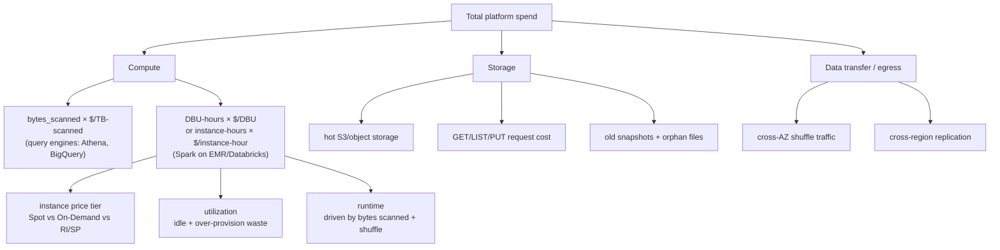

# Cost Optimization

> Chapter from the **Data Engineering Playbook** — finops.

Cost optimization in a data platform is not a quarterly spreadsheet exercise. It is an engineering discipline with the same feedback loops as latency or correctness: instrument, attribute, find the dominant term, fix it, and put a guardrail in place so it does not regress. The hard part is that the dominant cost term moves. This quarter it is a single broadcast-gone-wrong job scanning 40 TB; next quarter it is 3,000 tiny-file Iceberg tables paying S3 PUT and metadata-listing taxes. This chapter is about how a principal engineer keeps finding and killing the dominant term without trading away reliability.

## TL;DR

- **Optimize the unit cost, not the bill.** `$ per TB scanned`, `$ per million events`, `$ per DBU-hour`, `$ per query`. A growing bill with a flat or falling unit cost is a *success*; a flat bill with rising unit cost is a hidden problem you have not been billed for yet.
- **Three levers dominate Spark/lakehouse spend, in this order:** (1) bytes scanned (partition pruning, file layout, column projection), (2) compute price (Spot, Graviton, autoscaling floor), (3) idle/over-provisioned capacity (cluster sprawl, warm pools, oversized executors). Most teams reach for lever 2 first because it is a console setting; lever 1 is where the 5–10× wins live.
- **Storage layout is a compute cost, not a storage cost.** The 200-byte-per-file overhead is irrelevant; the millions of S3 GET/LIST calls and split-planning on small files is what shows up on your compute bill. Compaction is a compute optimization.
- **Spot interruptions are cheap on stateless work and ruinous on long shuffles.** Put the driver and shuffle-heavy stages on on-demand; put map-only and idempotent retryable work on Spot. A 70% Spot discount that triggers a 3-hour recompute is negative ROI.
- **Every cost guardrail must be enforceable in CI or at submit time.** A Slack reminder is not a control. A failing `bytes_scanned` budget check in the PR is.
- **Cost without attribution is un-actionable.** You cannot optimize what you cannot assign to a team and a query. See [cost-attribution](../cost-attribution/README.md).

## Why this matters in production

A realistic scenario from a fast-growing analytics platform. The monthly AWS bill for the data org goes from \$180K to \$310K over two quarters. Finance escalates. The instinct is to negotiate a bigger committed-use discount or move everything to Spot. Both are lever-2 moves and both are wrong as a first response.

You pull the EMR/Databricks usage data joined to query history and discover:

- One hourly `marketing_attribution` job rewrites a full unpartitioned 8 TB table every run because someone used `df.write.mode("overwrite")` instead of a merge. That is ~5.7 PB scanned/written per month from a single DAG.
- A BI tool issues `SELECT *` against a 1.2 TB events table with no partition filter, 4,000 times a day, because the dashboard has no date default. Each query scans the full table.
- The dev/staging EMR clusters never scale to zero and run 24/7 on on-demand `r5.4xlarge` at ~30% average utilization.

None of these is a price problem. They are bytes-scanned and idle-capacity problems. Fix the overwrite-to-merge (lever 1), add a partition-filter guardrail to the BI semantic layer (lever 1), and put dev clusters on a scale-to-zero idle timeout (lever 3), and the bill drops back to ~\$190K *while ingest volume keeps growing*. The committed-use discount you were about to sign would have locked in the waste.

The principal-level lesson: **the bill is a lagging, aggregated signal. You optimize against the unit-cost and attribution signals, which lead it.**

## How it works

The mental model is a cost waterfall: total spend decomposes into a small number of multiplicative and additive terms, and at any moment one term dominates. Your job is to make the dominant term observable and then attack it.



For a Spark job on a per-instance-hour platform, the cost of a single run is approximately:

```
cost_run ≈ (Σ instance_hours_i × price_i) + storage_io_requests × price_req

instance_hours_i ≈ runtime_hours × num_instances_in_pool_i
runtime_hours    ≈ f(bytes_scanned, shuffle_bytes, skew, parallelism)
```

The leverage is non-linear and concentrated in `runtime_hours`, which is itself dominated by `bytes_scanned` and `shuffle_bytes`. Halving bytes scanned via partition pruning typically halves runtime *and* halves the instance-hours *and* shrinks the cluster you need — a compounding win. Switching to Spot only touches `price_i`, a linear ~60–70% discount that is capped and carries interruption risk.

This is why the lever ordering matters. Lever 1 (bytes) multiplies into runtime and capacity; lever 2 (price) is a flat multiplier; lever 3 (utilization) recovers waste but cannot go below 1.0×.

## Deep dive

### Bytes scanned: the term everyone underestimates

On a query engine billed by scan (Athena at \$5/TB, BigQuery on-demand at \$6.25/TB), `$ per TB scanned` is the literal price. On Spark it is implicit but it drives runtime, so it shows up as instance-hours. The same four techniques reduce it everywhere:

1. **Partition pruning** requires the predicate to align with the partition column *and* survive Catalyst's predicate pushdown. The classic miss: partitioning by `event_date STRING` and then filtering `WHERE cast(event_ts as date) = '2026-06-18'`. The cast blocks pushdown — the engine scans everything and filters in memory. You only find this by reading the physical plan for `PartitionFilters: []`.

2. **File layout and small files.** Iceberg/Delta split planning lists and opens every data file in the matching partitions. 50,000 files of 2 MB each cost far more in GET/LIST and task scheduling than 400 files of 256 MB. Target 128–512 MB files. Compaction (`OPTIMIZE` in Delta, `rewrite_data_files` in Iceberg) is the fix and it is a *compute* spend that pays back in reduced scan compute. See [lakehouse/iceberg](../../lakehouse/iceberg/README.md) and [spark-internals/partitioning](../../spark-internals/partitioning/README.md).

3. **Column projection.** Parquet/ORC are columnar; `SELECT *` defeats the format. A 200-column events table where the query needs 6 columns scans ~30× more than necessary. The semantic layer / BI tool is the usual culprit because it expands to all columns by default.

4. **Data skipping / Z-order / clustering.** Min-max stats per file let the engine skip files whose range excludes the predicate. Effective only if the data is sorted/clustered on the filter column. Z-order on Delta and Iceberg sort-order writes give file-level pruning beyond partition-level.

### Spot economics: where the discount turns negative

Spot is ~60–70% off on-demand but can be reclaimed with a 2-minute warning. The decision is not "Spot good, on-demand bad" — it is per-stage risk.

| Workload shape | Spot suitability | Why |
|---|---|---|
| Map-only ETL, idempotent, retryable | Excellent | Lost task re-runs cheaply; no shuffle to recompute |
| Long shuffle / wide join, 1+ hr stages | Poor on executors, never on driver | Losing a shuffle-map output forces stage recompute; losing the driver kills the app |
| Streaming with checkpointing | Mixed | Tolerable on executors if checkpoint interval is short; driver on on-demand |
| Interactive / SLA-bound dashboards | Avoid | Interruption-induced latency violates the SLO that justifies the spend |

The trap: a 3-hour batch job at 70% Spot looks like a 70% saving on the dashboard, but if the interruption rate forces one full recompute per week, the *expected* cost is `0.30 × normal + recompute_overhead`, and the recompute can wipe the discount. Mitigations: enable Spark's decommissioning (`spark.decommission.enabled=true`, `spark.storage.decommission.enabled=true`) so shuffle/RDD blocks migrate off a node before reclamation, diversify across instance types and AZs to reduce correlated interruptions, and keep the driver + at least the shuffle-critical fraction of executors on on-demand or a fallback pool.

### Idle and over-provisioned capacity

Two distinct wastes that look the same on the bill:

- **Idle:** a cluster that is up but doing nothing (dev clusters overnight, warm pools sized for peak, an EMR cluster that finished its job but did not terminate). Fix: aggressive idle-termination timeouts (5–10 min for interactive, terminate-on-completion for batch), scale-to-zero for serverless SQL warehouses.
- **Over-provision:** a cluster doing work but on the wrong shape. The classic is requesting `r5.4xlarge` (128 GB) executors with `spark.executor.memory=8g` — you pay for 128 GB and use 8. Or running 100 executors on a job whose shuffle parallelism caps useful concurrency at 30. Fix: right-size executor memory/cores to the actual working set, and let AQE coalesce partitions instead of over-parallelizing. See [spark-internals/aqe](../../spark-internals/aqe/README.md).

### Graviton and instance-family arbitrage

On AWS, Graviton (`r6g`, `m6g`, `r7g`) is typically ~20% cheaper per hour and often *faster* on JVM/Spark workloads, so the effective `$ per unit work` saving exceeds the sticker discount. The only friction is native-library compatibility (e.g., JNI bindings, certain Parquet codecs). For pure Spark/SQL it is close to free money and should be a default, not an experiment.

### Storage tiering and snapshot hygiene

Iceberg/Delta keep old snapshots for time travel; left unbounded they accumulate orphan files you pay to store and that bloat metadata listing. Expire snapshots (Iceberg `expire_snapshots`, Delta `VACUUM`) on a retention aligned to your actual time-travel SLA (often 7 days, not the default). Tier cold raw zones to S3 Infrequent Access / Glacier via lifecycle rules — but never tier hot query targets, where the per-GET retrieval cost and latency dwarf the storage saving.

## Worked example

A reusable pre-submit cost guardrail plus the layout fixes that drive the real saving. First, the layout fixes on an Iceberg table.

```sql
-- BEFORE: hourly job overwrites the whole table → full rewrite + full scan downstream
-- INSERT OVERWRITE TABLE marketing.attribution SELECT ... ;  -- 8 TB rewritten/run

-- AFTER: MERGE only touches changed partitions; downstream prunes by event_date
MERGE INTO marketing.attribution t
USING staging.attribution_delta s
ON t.user_id = s.user_id AND t.event_date = s.event_date
WHEN MATCHED THEN UPDATE SET *
WHEN NOT MATCHED THEN INSERT *;

-- Compact small files written by streaming ingest into 256 MB targets
CALL catalog.system.rewrite_data_files(
  table => 'marketing.attribution',
  strategy => 'binpack',
  options => map('target-file-size-bytes', '268435456',
                 'min-input-files', '5')
);

-- Expire snapshots older than the 7-day time-travel SLA; drop orphan files
CALL catalog.system.expire_snapshots('marketing.attribution', TIMESTAMP '2026-06-11 00:00:00');
CALL catalog.system.remove_orphan_files(table => 'marketing.attribution');
```

A pre-submit guardrail that estimates bytes scanned from the physical plan and **fails the job** if it exceeds a per-job budget. This is the enforceable control referenced in the TL;DR.

```python
# cost_guard.py — wrap any Spark batch entrypoint
from pyspark.sql import SparkSession, DataFrame

# Per-job byte budgets, owned in version control, reviewed in PRs.
SCAN_BUDGET_TB = {
    "marketing_attribution": 0.5,   # post-merge target
    "events_daily_rollup":   2.0,
}

def estimate_scan_bytes(df: DataFrame) -> int:
    """Pull scan size from the optimized plan's file-source stats."""
    plan = df._jdf.queryExecution().optimizedPlan()
    # sizeInBytes is the Catalyst stats estimate after pruning is applied.
    return int(plan.stats().sizeInBytes())

def assert_within_budget(job_name: str, df: DataFrame) -> None:
    est_tb = estimate_scan_bytes(df) / 1e12
    budget = SCAN_BUDGET_TB[job_name]
    if est_tb > budget:
        raise RuntimeError(
            f"[cost-guard] {job_name}: estimated scan {est_tb:.2f} TB "
            f"exceeds budget {budget} TB. "
            f"Check PartitionFilters in df.explain(True) — likely a pruning miss."
        )

if __name__ == "__main__":
    spark = (SparkSession.builder
             .appName("marketing_attribution")
             # AQE: coalesce shuffle partitions, skew join split, dynamic pruning
             .config("spark.sql.adaptive.enabled", "true")
             .config("spark.sql.adaptive.coalescePartitions.enabled", "true")
             .config("spark.sql.adaptive.skewJoin.enabled", "true")
             # Dynamic partition pruning: prune fact by dim join key at runtime
             .config("spark.sql.optimizer.dynamicPartitionPruning.enabled", "true")
             # Spot resilience: migrate shuffle/cache off nodes before reclaim
             .config("spark.decommission.enabled", "true")
             .config("spark.storage.decommission.enabled", "true")
             .getOrCreate())

    df = (spark.read.table("marketing.attribution")
          .where("event_date = current_date()")   # aligns with partition col → pruning
          .select("user_id", "channel", "conversion_value"))  # projection, not SELECT *

    df.explain(True)                 # CI greps the plan for "PartitionFilters: []"
    assert_within_budget("marketing_attribution", df)
    df.write.mode("append").saveAsTable("marketing.attribution_scored")
```

Tag every cluster/job at launch so the spend lands on a team (the input to [cost-attribution](../cost-attribution/README.md)):

```hcl
# emr_cluster.tf
tags = {
  cost_center = "data-platform"
  domain      = "marketing"
  pipeline    = "attribution"
  owner       = "sharath_rama"
  environment = "prod"
}
```

## Production patterns

- **Cost budgets as code, enforced at submit.** The `cost_guard` above lives next to the pipeline, is reviewed in PRs, and fails the run when a pruning regression blows the budget. Pair with a hard `query_timeout` and a `max_bytes_billed` ceiling on serverless engines (BigQuery `maximumBytesBilled`, Athena workgroup `BytesScannedCutoffPerQuery`).
- **A tiered cluster policy.** Driver + SLA-critical executors on on-demand/savings-plan; the elastic body on diversified Spot across 3+ instance types and AZs; an automatic on-demand fallback pool when Spot capacity is unavailable. Encode it once in a Databricks cluster policy or EMR instance fleet, not per-job.
- **Scheduled compaction and snapshot expiry as first-class pipelines.** Treat `rewrite_data_files` / `OPTIMIZE` and `expire_snapshots` / `VACUUM` as monitored DAGs with their own SLAs, not as someone's cron job. The compaction compute is a line item you *want* to see — it is buying down future scan cost.
- **Unit-cost dashboards over bill dashboards.** Track `$/TB scanned`, `$/million events ingested`, `$/active user` weekly. Alert on unit-cost regressions, not absolute spend, so growth does not page you and waste does.
- **Default to Graviton + AQE on every new workload.** Make the cheap, fast configuration the golden path so teams opt *out*, not in. See [platform-engineering/golden-paths](../../platform-engineering/golden-paths/README.md).
- **A monthly "top 10 spenders" review** joining usage data to query history, ranked by cost. The dominant term moves; this is how you re-find it. One job almost always accounts for an outsized share.

## Anti-patterns & failure modes

| Anti-pattern | Symptom you observe | Fix |
|---|---|---|
| `mode("overwrite")` on a large table for incremental updates | Full-table rewrite every run; storage write cost and downstream scan both balloon | `MERGE` / upsert touching only changed partitions |
| Filter predicate that blocks pushdown (cast, function on partition col) | `PartitionFilters: []` in `explain`, full scan despite a `WHERE` clause | Filter on the raw partition column; pre-compute the partition value |
| Buying a 3-year commitment to "fix" a high bill | Locked-in spend that survives after you remove the waste | Eliminate waste first, *then* size the commitment to the steady-state floor |
| 100% Spot on a long shuffle job | Sporadic stage recomputes, p95 runtime 3× p50, occasional app failures | Driver + shuffle-critical executors on on-demand; enable decommissioning |
| Small-file explosion from streaming ingest | Job runtime grows with file count, not data volume; S3 LIST/GET cost spikes | Scheduled compaction to 128–512 MB; tune ingest batch interval |
| Dev/staging clusters with no idle timeout | Flat overnight/weekend spend; <30% daytime utilization | Idle-termination 5–10 min; terminate batch clusters on completion |
| Oversized executors (`r5.4xlarge`, `executor.memory=8g`) | Cluster memory utilization <20%; paying for unused RAM | Right-size to working set; fewer, correctly-sized nodes |
| Optimizing the bill in aggregate with no attribution | Endless meetings, no team owns the number, nothing changes | Tag everything; route cost to domains via [cost-attribution](../cost-attribution/README.md) |
| Unbounded snapshot retention | Storage and metadata listing grow without bound; `VACUUM` never runs | Expire snapshots on the actual time-travel SLA; schedule orphan-file removal |

## Decision guidance

**Which lever first?** Always profile before acting. Pull the dominant cost term, then:

| If the dominant term is... | Reach for | Not |
|---|---|---|
| Bytes scanned / instance-hours driven by scan | Partition pruning, compaction, column projection, DPP | Spot — it only discounts the waste |
| Instance price on already-efficient jobs | Graviton, Savings Plans/RI sized to the floor, Spot on safe stages | More tuning — diminishing returns |
| Idle / over-provisioned capacity | Idle timeouts, scale-to-zero, right-sizing, AQE coalesce | Bigger commitments |
| Cross-AZ shuffle or cross-region egress | Co-locate compute with data, single-AZ placement groups for shuffle-heavy jobs | Ignoring it — egress is silent and large |

**Spot vs On-Demand vs Savings Plan:** Spot for elastic, interruptible, idempotent capacity. Savings Plan / Reserved for the predictable baseline floor you will run regardless. On-Demand for drivers, SLA-critical executors, and burst above the committed floor. The mix, not the choice, is the answer.

**Build a guardrail vs trust a review:** if the regression is mechanical (bytes scanned, query timeout, file size) and catchable from a plan or metadata, enforce it in CI/at submit. Reserve human review for architectural choices (partitioning scheme, commitment sizing) where judgment is irreducible.

## Interview & architecture-review talking points

- "I optimize unit cost, not the bill. A bill that grows while `$/TB scanned` falls means the platform is getting *more* efficient as it scales — that is the goal. I'd be worried about a flat bill with rising unit cost, because it means waste is hiding behind a hiring or volume freeze."
- "The first lever is bytes scanned, not instance price, because scan reduction compounds: it cuts runtime, instance-hours, and the cluster size you need to provision. Spot is a flat 60–70% discount that is capped and risky. I've seen teams sign a committed-use discount that locked in a workload they could have deleted."
- "Spot is a per-stage decision, not a platform decision. Map-only idempotent work goes on Spot; drivers and long shuffles do not, because a reclamation mid-shuffle forces a stage recompute that can erase the discount. I enable decommissioning so blocks migrate before reclaim, and diversify instance types to decorrelate interruptions."
- "Compaction is a compute optimization that lives on the storage table. Small files don't cost much to store; they cost a fortune in LIST/GET and split planning. I treat `OPTIMIZE`/`rewrite_data_files` and snapshot expiry as monitored pipelines with SLAs."
- "Cost controls have to be enforceable. A budget that lives in a wiki is a suggestion. A `bytes_scanned` budget that fails the PR or the submit is a control. And none of it works without attribution — you can't optimize a number no team owns."
- "Right-sizing is a real lever people skip because it's unglamorous: oversized executors and clusters with no idle timeout are pure margin loss. I default new workloads to Graviton + AQE so the efficient path is the path of least resistance."

## Further reading

- [finops/cost-attribution](../cost-attribution/README.md) — tagging, chargeback/showback; the prerequisite for actionable optimization.
- [finops/capacity-planning](../capacity-planning/README.md) — forecasting the baseline floor you should commit to vs. burst on Spot.
- [spark-internals/aqe](../../spark-internals/aqe/README.md) — adaptive coalescing and skew handling that cut shuffle and over-provisioning.
- [spark-internals/partitioning](../../spark-internals/partitioning/README.md) — partition design that makes pruning actually fire.
- [spark-internals/broadcast-join](../../spark-internals/broadcast-join/README.md) — avoiding the shuffle that drives runtime cost.
- [lakehouse/iceberg](../../lakehouse/iceberg/README.md) — compaction, snapshot expiry, and metadata mechanics.
- [observability/metrics](../../observability/metrics/README.md) — emitting unit-cost metrics, not just absolute spend.
- External: [AWS — Amazon EMR best practices: cost optimization](https://aws.github.io/aws-emr-best-practices/docs/bestpractices/Cost%20Optimization/) and the [Apache Iceberg maintenance documentation](https://iceberg.apache.org/docs/latest/maintenance/).
