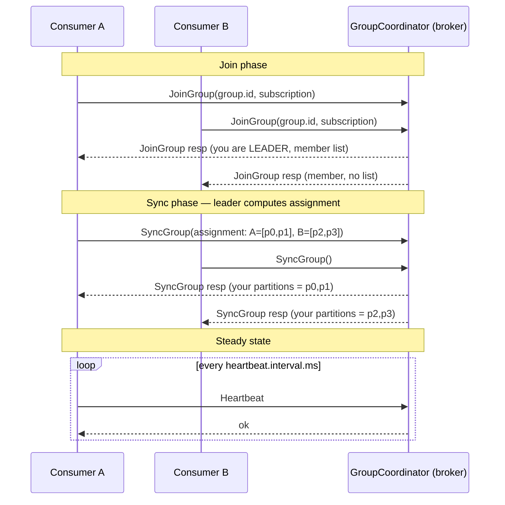

# Consumer Groups

> Chapter from the **Data Engineering Playbook** — kafka.

## About This Chapter

**What this is.** A consumer group is how Kafka spreads a topic's partitions across multiple consumers for parallelism and failover. This chapter covers the membership protocol, rebalancing, the timers that govern liveness, and the offset/coordination machinery behind it.

**Who it's for.** data engineers, data/ML engineers, platform/architecture leads, and engineers preparing for senior/staff data-engineering interviews.

**What you'll take away.** By the end you'll be able to:
- Size consumers against the partition ceiling and use cooperative-sticky assignment plus static membership to make rolling deploys rebalance-free.
- Reason about `session.timeout.ms`, `heartbeat.interval.ms`, and `max.poll.interval.ms`, and diagnose which one is evicting a healthy consumer.
- Write a correct manual-commit consumer with a revoke handler that commits last-processed + 1, and treat `__consumer_offsets` as infrastructure you own.

---

A consumer group is Kafka's unit of horizontal scale, fault tolerance, and ordering guarantee all at once. Get the membership protocol wrong and you don't get a slow consumer — you get a group that spends more time rebalancing than processing, lag that climbs while CPU sits idle, and duplicate writes that corrupt downstream tables.

## TL;DR

- A consumer group maps **partitions to consumers** — never the reverse. Your maximum useful parallelism equals the partition count of the topic(s) you subscribe to. Add a 13th consumer to a 12-partition topic and it sits idle.
- **Rebalances are the enemy of throughput.** Every rebalance under the eager protocol revokes *all* partitions from *all* members ("stop-the-world"). Cooperative rebalancing (KIP-429, default since 2.4) and static membership (KIP-345) exist to make rebalances rare and cheap.
- The three timers that govern membership — `session.timeout.ms`, `heartbeat.interval.ms`, and `max.poll.interval.ms` — fail you in different ways. The one that bites teams in production is `max.poll.interval.ms`: slow processing, not network loss, is what kicks healthy consumers out of the group.
- **Offsets are committed per group, per partition.** The group is the identity that owns "where am I." Two pipelines reading the same topic for different purposes must use different `group.id`s, or they steal each other's progress.
- Group coordination, offset storage, and rebalance orchestration all live in the broker-side **`__consumer_offsets`** topic and a per-group **GroupCoordinator**. When that topic is misconfigured (under-replicated, wrong cleanup policy), the whole group blinks.
- KIP-848 (the new consumer group protocol, GA in Kafka 4.0) moves assignment computation to the broker and largely eliminates client-side rebalance stalls. Know whether your cluster speaks it.

## Why this matters in production

A concrete scenario from a clickstream ingestion pipeline. The topic `events.clickstream` has 24 partitions, ~80k msg/s at peak. A consumer group of 12 pods writes micro-batches to Iceberg. Each pod owns 2 partitions, processes a batch, commits offsets, repeats. Steady state: end-to-end lag under 3 seconds.

Then a deploy rolls the 12 pods one at a time. Under the **eager** assignment protocol, each pod restart triggers a rebalance, and each rebalance revokes all 24 partitions from all 11 surviving pods, recomputes assignment, and resumes. A 12-pod rolling deploy fires **12 stop-the-world rebalances**. During each one, *zero* partitions are being consumed. The deploy takes 4 minutes; lag spikes to 90 seconds and pages the on-call.

The same deploy with **cooperative-sticky** assignment and **static group membership** fires effectively zero disruptive rebalances — a restarting pod keeps its `group.instance.id`, rejoins within `session.timeout.ms`, and reclaims the same two partitions without anyone else stopping. Lag never crosses 5 seconds. That is the entire difference between a clean deploy and a 2am page, and it is two config lines.

This is why consumer-group mechanics are a principal-level topic: the defaults are correct for a laptop demo and wrong for a rolling deploy at scale.

## How it works

A consumer group is coordinated by exactly one broker — the **GroupCoordinator** — chosen by hashing the `group.id` to a partition of the internal `__consumer_offsets` topic; the leader of that partition is the coordinator. Members talk to the coordinator for membership (join/sync/heartbeat) and for offset commits.



Key detail engineers miss: **the assignment is computed on the group leader (a client), not the broker** under the classic protocol. The broker just relays the member list to the leader and the resulting assignment back to members. The leader runs the configured `partition.assignment.strategy`. This is why upgrading the assignor is a *rolling client* concern, and why a buggy client can wedge an entire group.

### The three timers

| Config | Default | Governs | Failure when exceeded |
|---|---|---|---|
| `heartbeat.interval.ms` | 3s | How often the background thread pings the coordinator | Too high → slow failure detection |
| `session.timeout.ms` | 45s | Max gap between heartbeats before the member is declared dead | Network blip / GC pause → eviction + rebalance |
| `max.poll.interval.ms` | 300s (5 min) | Max gap between `poll()` calls | Slow processing → member proactively *leaves* the group |

Heartbeats run on a **separate background thread** since 0.10.1, so a consumer can be heartbeating happily while its application thread is stuck in a 6-minute batch. That consumer is alive to the coordinator (session not expired) but dead to progress. When `poll()` finally exceeds `max.poll.interval.ms`, the client sends a LeaveGroup, triggering a rebalance and *reprocessing* of the in-flight batch by whoever inherits the partition — a classic duplicate source. See [offsets](../offsets/README.md) for how commit timing interacts with this.

### Assignment strategies

The effective `max(parallelism) = number of partitions`. Within that ceiling, the assignor decides who gets what:

| Strategy | Balance | Stickiness | Rebalance cost |
|---|---|---|---|
| `RangeAssignor` (legacy default) | Poor across multiple topics — co-locates same-numbered partitions | None | Eager (stop-the-world) |
| `RoundRobinAssignor` | Good | None | Eager |
| `StickyAssignor` | Good | Yes — minimizes movement | Eager |
| `CooperativeStickyAssignor` (recommend) | Good | Yes | **Incremental** — only moved partitions are revoked |

## Deep dive

### Eager vs cooperative rebalancing — the part that actually moves lag

Under **eager** rebalancing (the original protocol), the rebalance is a barrier: every member must revoke *all* its partitions in `onPartitionsRevoked`, rejoin, then receive a fresh assignment. The window where nobody owns anything is the rebalance duration — and it scales with group size and assignment-computation time. A 50-member group rebalancing on every pod restart is a self-inflicted outage.

**Cooperative** rebalancing (KIP-429) splits a rebalance into two joins. In the first, the assignor figures out which partitions actually need to move and asks only their current owners to revoke them. Partitions that stay put are never interrupted. Net effect: a single pod restart in a 50-member group disturbs only the ~2 partitions that pod owned, not all of them.

The migration trap: you cannot flip from `RangeAssignor` to `CooperativeStickyAssignor` in one rolling restart, because mid-roll some members speak eager and some speak cooperative, and they disagree on the revocation contract. The supported path is a **two-phase rolling upgrade**: first set `partition.assignment.strategy=[CooperativeStickyAssignor, RangeAssignor]` (cooperative listed first, range as fallback) and roll; then drop `RangeAssignor` and roll again. Skip the intermediate step and you get a group stuck in perpetual rebalance.

### Static membership — why your deploys page you

By default a consumer gets an **ephemeral member ID** assigned by the coordinator on every JoinGroup. Restart the pod and it's a brand-new member, which means a leave (old ID expires) *and* a join (new ID) — two rebalances per restart.

Static membership (KIP-345) lets you pin a stable `group.instance.id` (e.g. the StatefulSet ordinal `clickstream-writer-3`). On restart, the coordinator recognizes the returning instance ID and — as long as it reconnects within `session.timeout.ms` — hands back the **same partitions with no rebalance at all**. The tradeoff: a *crashed* static member's partitions are not reassigned until `session.timeout.ms` elapses, so you trade faster recovery for fewer rebalances. Tune `session.timeout.ms` up (e.g. 60–120s) when you adopt static membership, so a 30-second pod restart doesn't trip a rebalance, but accept that a true crash means up to that many seconds of unconsumed lag on those partitions.

### The `__consumer_offsets` topic is infrastructure you own

This internal topic stores both committed offsets and group metadata. Two failure modes I've actually debugged:

1. **Under-replicated `__consumer_offsets`.** Default `offsets.topic.replication.factor` is 3, but if the topic was auto-created when the cluster had fewer than 3 live brokers, it gets created with RF=1. Lose that one broker and *every* group on the cluster loses its coordinator and its committed offsets simultaneously. Always verify RF=3 explicitly.
2. **Compaction misconfiguration.** `__consumer_offsets` uses `cleanup.policy=compact`. If someone sets it to `delete`, old offset commits get aged out, and a group that goes idle longer than the retention window comes back having "forgotten" its position — it then honors `auto.offset.reset` (often `latest`) and silently skips everything produced while it was down.

### Rebalance listeners and the commit-on-revoke contract

The single most important code you write in a consumer is the `ConsumerRebalanceListener`. When a partition is revoked, you have a narrow window to commit the offset of the last fully processed record *before* someone else inherits it. Miss it and the inheritor reprocesses. Commit too eagerly (offsets ahead of processed work) and the inheritor *skips*. This is the seam where at-least-once vs at-most-once is actually decided — not in a config flag, but in the revoke handler. See [exactly-once](../exactly-once/README.md) for closing the duplicate gap with transactions.

## Worked example

A correct manual-commit consumer with cooperative rebalancing, static membership, and a revoke handler that commits the right offsets. This is the shape I ship.

```python
import os
from confluent_kafka import Consumer, TopicPartition

# group.instance.id is injected from the StatefulSet pod ordinal,
# e.g. POD_NAME=clickstream-writer-3 -> instance id "writer-3"
instance_id = "writer-" + os.environ["POD_NAME"].rsplit("-", 1)[-1]

conf = {
    "bootstrap.servers": os.environ["KAFKA_BOOTSTRAP"],
    "group.id": "clickstream-iceberg-writer",          # the group identity
    "group.instance.id": instance_id,                  # static membership (KIP-345)
    "partition.assignment.strategy": "cooperative-sticky",
    "session.timeout.ms": 90000,                        # tolerate 30-60s pod restarts
    "heartbeat.interval.ms": 3000,
    "max.poll.interval.ms": 600000,                     # batch can take up to 10 min
    "enable.auto.commit": False,                        # we commit explicitly
    "auto.offset.reset": "earliest",                    # never silently skip on cold start
    "isolation.level": "read_committed",                # ignore aborted txns from producers
}

# Track the next offset to commit per partition (last processed + 1).
pending = {}  # (topic, partition) -> next_offset

def on_revoke(consumer, partitions):
    # Commit progress for partitions we are losing, BEFORE they move.
    to_commit = [
        TopicPartition(p.topic, p.partition, pending[(p.topic, p.partition)])
        for p in partitions
        if (p.topic, p.partition) in pending
    ]
    if to_commit:
        consumer.commit(offsets=to_commit, asynchronous=False)  # synchronous: must land
    for p in partitions:
        pending.pop((p.topic, p.partition), None)

def on_assign(consumer, partitions):
    # Under cooperative-sticky, 'partitions' is only the INCREMENTAL set added.
    consumer.incremental_assign(partitions)

c = Consumer(conf)
c.subscribe(["events.clickstream"], on_assign=on_assign, on_revoke=on_revoke)

try:
    while True:
        msg = c.poll(timeout=1.0)
        if msg is None:
            continue
        if msg.error():
            raise RuntimeError(msg.error())

        write_to_iceberg(msg)  # idempotent sink keyed on (topic, partition, offset)

        # record offset+1 as the next position; commit periodically
        pending[(msg.topic(), msg.partition())] = msg.offset() + 1
        if msg.offset() % 5000 == 0:
            c.commit(asynchronous=True)   # cheap, opportunistic
finally:
    c.commit(asynchronous=False)          # final synchronous flush
    c.close()                             # sends LeaveGroup -> clean rebalance
```

Two non-obvious correctness points:

- The committed offset is **last processed + 1** (the *next* offset to read), not the offset of the record you just handled. Off-by-one here causes either a permanent one-record duplicate or one-record skip on every rebalance.
- `c.close()` sends an explicit LeaveGroup. Without it, the group waits a full `session.timeout.ms` to notice the departure — which under static membership is intentional, but for a graceful shutdown you usually want the clean leave.

To inspect group state from the CLI:

```bash
# Lag and assignment per partition — the first thing I check on a page
kafka-consumer-groups.sh --bootstrap-server "$KAFKA_BOOTSTRAP" \
  --describe --group clickstream-iceberg-writer

# Reset a group to a timestamp (e.g. replay after a bad deploy) — group must be empty
kafka-consumer-groups.sh --bootstrap-server "$KAFKA_BOOTSTRAP" \
  --group clickstream-iceberg-writer --topic events.clickstream \
  --reset-offsets --to-datetime 2026-06-18T02:00:00.000 --execute
```

## Production patterns

- **Static membership + cooperative-sticky + raised `session.timeout.ms` for every long-lived group.** This combination is what makes rolling deploys boring. It is the single highest-leverage change for any group above ~10 members.
- **Size partitions for peak consumer count, then add 30–50% headroom.** Partition count is your parallelism ceiling and is painful to increase (it breaks key-based ordering for keyed topics). A 24-partition topic caps you at 24 consumers forever; provision the partition count for the parallelism you'll need in 12 months.
- **One `group.id` per logical consumer, never shared across deployables.** If two services subscribe with the same `group.id`, Kafka load-balances partitions *between* them — each service sees only a slice of the stream and assumes that's all there is. Silent data loss that no test catches. Use distinct group IDs; let each get a full copy.
- **Alert on rebalance *rate*, not just lag.** The metric `kafka.consumer:type=consumer-coordinator-metrics,rebalance-rate-per-hour` rising is the leading indicator; lag is the lagging one. A group rebalancing more than a few times an hour outside deploys is sick.
- **Make the sink idempotent and key it on `(topic, partition, offset)` or a business key.** Consumer groups give at-least-once by default; the only robust defense against the inevitable duplicate-on-rebalance is an idempotent write. Pairs with [dlq](../dlq/README.md) for poison records that would otherwise stall a partition forever.
- **Pin `auto.offset.reset=earliest` for pipelines that must not lose data.** `latest` is correct for "live dashboard" consumers and catastrophic for ingestion — a group that loses its committed offset silently skips to the tail.

## Anti-patterns & failure modes

| Anti-pattern | Symptom you'd observe | Fix |
|---|---|---|
| More consumers than partitions | Idle pods, lag not improving despite scaling out | Increase partitions (and accept key-ordering reshuffle) or scale consumers down |
| Long processing inside `poll()` loop without raising `max.poll.interval.ms` | Periodic rebalances, log line `Member ... leaving group ... consumer poll timeout has expired`, duplicate writes | Raise `max.poll.interval.ms`, or hand work to a bounded queue and keep polling |
| Sharing one `group.id` across two services | Each service processes ~half the records; downstream counts low | Give each consumer its own `group.id` |
| Eager assignor on a large group with rolling deploys | Lag spikes once per pod during deploy; `rebalance-rate-per-hour` matches pod count | Migrate to `cooperative-sticky` via the two-phase rolling upgrade |
| `__consumer_offsets` at RF=1 (auto-created on a small cluster) | One broker loss wipes all groups' committed offsets; mass reprocessing | Recreate the internal topic at RF=3; set `offsets.topic.replication.factor=3` |
| Committing offsets *before* processing completes | Records silently skipped after a crash; gaps in downstream data | Commit only after the work durably lands (last processed + 1) |
| Static member crash with high `session.timeout.ms` and no monitoring | One partition's lag climbs for ~90s with no rebalance | Monitor per-partition lag; tune `session.timeout.ms` to your restart-vs-crash tradeoff |

## Decision guidance

**Consumer group vs assign() (manual partition assignment):** Use a consumer group when you want automatic rebalancing, failover, and scale-out. Use manual `assign()` (no group membership, no rebalances) when you need *deterministic, fixed* partition ownership — e.g. a stateful stream processor that pins partition state to a node, or a tool replaying a specific partition. Manual assign gives you total control and zero rebalance protection.

**Scaling consumers vs scaling partitions:** Scale consumers (cheap, fast) until you hit the partition-count ceiling. Only then scale partitions (expensive, breaks keyed ordering, requires producer awareness). Never plan to scale partitions reactively under load.

| You need… | Use |
|---|---|
| Elastic scale-out, automatic failover | Consumer group, cooperative-sticky |
| Fewer rebalances on long-lived stateful consumers | Static membership |
| Fixed, deterministic partition ownership | Manual `assign()`, no group |
| Exactly-once across consume→produce | Group + transactions + `read_committed` ([exactly-once](../exactly-once/README.md)) |
| Independent reads of the same topic | One distinct `group.id` per consumer |

## Interview & architecture-review talking points

- "Maximum consumer parallelism equals partition count" — say this first; it shows you understand the model isn't elastic past the partition ceiling, and it frames every capacity discussion.
- Explain *why* cooperative rebalancing matters operationally, not just that it exists: under eager, a rolling deploy of N pods causes N stop-the-world rebalances; under cooperative-sticky + static membership it causes effectively zero. That's an SLO conversation, not a config trivia question.
- Name the three timers and the failure each produces, and call out that heartbeats run on a background thread so `max.poll.interval.ms` (slow *processing*) — not network loss — is the usual cause of unexpected evictions.
- Treat `__consumer_offsets` as infrastructure you own: replication factor, cleanup policy, and what happens to every group when it's misconfigured.
- Be explicit that consumer groups are at-least-once by default and that exactly-once is a property of the *sink and transaction boundary*, not the group. The duplicate gap lives in the revoke handler and the commit ordering.
- If the cluster is on Kafka 4.0+, mention KIP-848: assignment moves server-side, client-driven rebalance stalls largely disappear, and the classic "leader computes assignment" wedge mode goes away.

## Further reading

- [offsets](../offsets/README.md) — commit strategies and how commit timing decides duplicate vs skip on rebalance.
- [exactly-once](../exactly-once/README.md) — closing the at-least-once duplicate gap with transactions and `read_committed`.
- [dlq](../dlq/README.md) — handling poison records so a single bad message doesn't stall a partition for the whole group.
- [event-design](../event-design/README.md) — keying and partitioning choices that set your parallelism ceiling.
- [KIP-429: Cooperative incremental rebalance protocol](https://cwiki.apache.org/confluence/display/KAFKA/KIP-429%3A+Kafka+Consumer+Incremental+Rebalance+Protocol)
- [KIP-345: Static membership](https://cwiki.apache.org/confluence/display/KAFKA/KIP-345%3A+Introduce+static+membership+protocol+to+reduce+consumer+rebalances) and [KIP-848: The next generation consumer group protocol](https://cwiki.apache.org/confluence/display/KAFKA/KIP-848%3A+The+Next+Generation+of+the+Consumer+Rebalance+Protocol)
