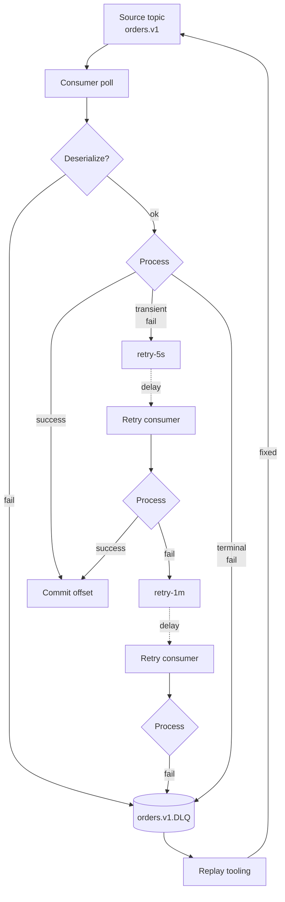

# Dead Letter Queues in Kafka

> Chapter from the **Data Engineering Playbook** — kafka.

## About This Chapter

**What this is.** A dead letter queue (DLQ) is where a consumer routes messages it cannot process. This chapter treats the DLQ as a contract — classifying transient vs. terminal failures, tiered non-blocking retries, what to capture for replay, and the ordering/exactly-once trade-offs of rerouting.

**Who it's for.** data engineers, data/ML engineers, platform/architecture leads, and engineers preparing for senior/staff data-engineering interviews.

**What you'll take away.** By the end you'll be able to:
- Separate transient from terminal failures and build tiered retry topics so a poison message never wedges a partition.
- Preserve the original payload byte-for-byte with rich failure-metadata headers, and run guarded, filtered, manual replay.
- Alert on DLQ ingress rate and distinct exception fingerprints instead of depth, and keep DLQ produces inside the EOS transaction.

---

A dead letter queue (DLQ) is not a feature you turn on. It is a contract you design: which failures are recoverable, which are terminal, who owns the recovery, and how a message gets back into the main flow without breaking ordering or idempotency. Get the contract wrong and the DLQ becomes a write-only swamp that quietly drops revenue events.

## TL;DR

- A DLQ is a routing decision for messages a consumer **cannot** process, not a dumping ground for messages it *failed once* to process. Separate **transient** failures (retry in place) from **terminal** failures (route to DLQ).
- Preserve the original payload **byte-for-byte** plus rich failure metadata in headers (original topic/partition/offset, exception class, stack hash, attempt count, schema ID). Without this, replay is guesswork.
- Blocking retries stall the partition and destroy throughput. Use **non-blocking, tiered retry topics** (e.g. `retry-5s`, `retry-1m`, `retry-10m`) before the terminal DLQ — this is the Spring Kafka / Confluent pattern.
- A DLQ with no **replay tooling and no alerting on growth rate** is a liability. The number that matters is `dlq_messages_in_total` first derivative, not depth.
- Ordering and exactly-once break the moment you reroute. Decide per-topic whether you can tolerate out-of-order recovery, and key the DLQ by the original key if downstream cares.
- Poison pills (deserialization failures) must be caught **before** your business logic, or one bad message blocks a partition forever in a tight crash-restart loop.

## Why this matters in production

Picture a `payments.authorized` topic feeding a consumer that writes to a ledger service. At 3am a partner ships a producer change that sets `amount` as a string `"42.00"` instead of a number. Your Avro/JSON deserializer throws on every message from that producer.

What happens with no DLQ design:

1. The consumer throws `DeserializationException` on offset 1,284,902.
2. The default `SeekToCurrentErrorHandler` (or a naive `try/catch` that doesn't commit) re-seeks to the same offset.
3. The consumer reprocesses offset 1,284,902, throws again, restarts. **The partition is now wedged.** Lag climbs at the full ingress rate.
4. Consumer-group rebalances fire as the liveness probe kills the looping pod, which triggers more rebalances across healthy partitions.
5. By the time someone is paged, you have 4 hours of payment lag, a thundering rebalance storm, and a single bad message at the head of one partition.

The DLQ contract turns step 2 into: *detect terminal failure → publish original record + failure metadata to `payments.authorized.DLQ` → commit the offset → keep moving.* The partition drains. The bad message is preserved with enough context to replay it once the partner fixes the producer or you patch the schema. One poison pill costs you one DLQ entry, not a multi-hour outage.

That asymmetry — one message vs. one partition — is the entire reason DLQs exist. Everything else is implementation detail.

## How it works

A DLQ in Kafka is just another topic. There is no broker-level "dead letter" primitive like SQS or RabbitMQ provide; the routing logic lives entirely in your consumer (or the connector/Streams runtime). The design space is the *path* a record takes from "failed" to "terminal."



Two failure classes drive the routing:

| Class | Examples | Correct action |
|-------|----------|----------------|
| **Transient** | Downstream 503, connection reset, lock timeout, `OptimisticLockException`, throttling | Retry with backoff. Will likely succeed unchanged. |
| **Terminal** | Deserialization failure, schema incompatibility, business-rule rejection (negative amount), referenced entity missing permanently | Route to DLQ. Retrying the same bytes will never succeed. |

The classic anti-pattern is treating all failures the same. A blanket "retry 3 times then DLQ" sends transient 503s to the DLQ during a downstream blip (now you're replaying thousands of perfectly valid messages) and wastes three retries on a deserialization failure that can never succeed.

### Blocking vs. non-blocking retry

A **blocking** retry (`Thread.sleep` inside the consumer, or a `RetryTemplate` with backoff) holds the partition. If your backoff is 10s × 3 attempts, every poison message blocks its partition for 30s. At 5k msg/s that's 150k messages of accumulated lag per incident.

A **non-blocking** retry commits the offset immediately and republishes the record to a *delay topic*. A separate retry consumer reads the delay topic, honors the timestamp, and reprocesses. The original partition never stalls.

The tiered-topic math: with topics `retry-5s`, `retry-1m`, `retry-10m`, a message that keeps failing visits each tier once, accumulating `5s + 60s + 600s ≈ 11 minutes` of recovery window before landing in the DLQ. Tune tiers to the recovery profile of your downstream — a database failover takes ~30-90s, so a `1m` and `10m` tier covers it without human intervention.

## Deep dive

### What goes in the DLQ record

The single most common DLQ mistake is publishing only the exception message and losing the original payload, or losing the failure context. You need both. Confluent's Connect DLQ writes the **original key and value unchanged** and stuffs context into headers. Replicate that everywhere:

| Header | Why |
|--------|-----|
| `dlq.original.topic` | You may have multiple sources feeding one DLQ, or want to route replay back correctly. |
| `dlq.original.partition` / `dlq.original.offset` | Forensics — find the exact record in the source for audit. |
| `dlq.original.timestamp` | Distinguish "failed at ingest" from "failed during replay." |
| `dlq.exception.class` | Group failures. `DeserializationException` ≠ `NullPointerException`. |
| `dlq.exception.stacktrace.hash` | A stable fingerprint to count *distinct* failure modes, not raw stack strings. |
| `dlq.attempts` | How many retry tiers it survived. |
| `dlq.schema.id` | The Schema Registry ID at failure time — critical when the schema later changes. |
| `dlq.consumer.group` | Which consumer rejected it. The same topic may be read by three groups with different validity rules. |

Keep the value as the **raw bytes**. If you re-serialize into a wrapper JSON envelope, you've coupled replay to a second schema and you can no longer feed the record straight back into the source topic.

### The poison-pill ordering problem

Deserialization happens *before* your code sees the record, inside the Kafka client / Streams `Deserializer`. A naive `KafkaConsumer.poll()` that hits a bad record throws `SerializationException` from inside `poll()` itself — you never get the `ConsumerRecord`. You must install an error-handling deserializer that catches the failure and yields a sentinel:

- **Spring Kafka**: `ErrorHandlingDeserializer` wrapping the real deserializer; failures surface as a `null` value with the exception in a header, which a `DeadLetterPublishingRecoverer` then routes.
- **Kafka Streams**: `default.deserialization.exception.handler` set to `LogAndContinueExceptionHandler` (skips, logs) or a custom handler that publishes to DLQ. `LogAndFailExceptionHandler` is the default and will crash-loop your app — exactly the wedged-partition scenario above.
- **Raw consumer**: catch `RecordDeserializationException`, extract `e.partition()` and `e.offset()`, publish raw bytes to DLQ, then `consumer.seek(partition, offset + 1)` to step over the poison.

That `seek(offset + 1)` is the load-bearing line. Forget it and you loop forever.

### Ordering and exactly-once are casualties of rerouting

The moment you publish to a retry topic and commit the original offset, you've broken in-order processing for that key. If message `A` (key `k`) fails and goes to `retry-1m` while message `B` (key `k`) succeeds immediately, `B` is now applied before `A`. For a stateful aggregation keyed by `k`, that's a correctness bug.

Two mitigations:

1. **Key-aware DLQ**: republish to retry/DLQ topics with the *original key* and accept that recovery for that key is best-effort eventually-consistent. Document it.
2. **Stop-the-key**: maintain a per-key "quarantine" marker so subsequent messages for a failed key also divert until the original recovers. This preserves ordering at the cost of complexity and a state store. Reserve it for genuinely order-sensitive domains (ledgers, inventory).

For exactly-once (`processing.guarantee=exactly_once_v2` in Streams, or a transactional producer), the DLQ publish **must be part of the same transaction** as the source-offset commit. If you publish to the DLQ outside the transaction and the transaction aborts, you get a phantom DLQ entry for a record that was never actually committed as consumed — a duplicate on replay. See [exactly-once](../exactly-once/) for the transactional-producer mechanics.

### DLQ depth vs. growth rate

Alerting on absolute DLQ depth is a beginner trap. A DLQ that holds 50k messages from a six-month-old batch incident is fine if it's flat. A DLQ growing at 200 msg/s right now is an active outage. Alert on the **rate**:

```promql
# Page when DLQ ingress sustains over threshold for 5m
sum(rate(kafka_dlq_produced_total{topic=~".*\\.DLQ"}[5m])) by (topic) > 50
```

Pair it with a *distinct-failure* gauge derived from `dlq.exception.stacktrace.hash` so you know whether you're looking at one schema break (one fingerprint, route to the producing team) or scattered corruption (many fingerprints, infra problem). See [observability/monitoring](../../observability/monitoring/) for the SLO framing.

## Worked example

A Spring Boot consumer with tiered non-blocking retries and a terminal DLQ. This is the production shape, not a toy.

```java
@Configuration
public class KafkaRetryConfig {

    // 3 retry tiers (5s, 60s, 600s) then DLQ. Non-blocking: each tier
    // is its own topic + listener, so the source partition never stalls.
    @Bean
    public RetryTopicConfiguration retryConfig(KafkaTemplate<String, byte[]> template) {
        return RetryTopicConfigurationBuilder
            .newInstance()
            .fixedBackOff(Duration.ofSeconds(5))
            .maxAttempts(4)                      // 1 original + 3 retries
            .retryTopicSuffix("-retry")
            .dltSuffix(".DLQ")
            // ONLY retry transient failures. Terminal failures skip
            // retries and go straight to the DLQ.
            .notRetryOn(List.of(
                DeserializationException.class,
                SchemaValidationException.class,
                BusinessRuleViolationException.class))
            .retryOn(List.of(
                DownstreamUnavailableException.class,
                OptimisticLockException.class))
            .dltHandlerMethod("dlqRecoverer", "handle")
            .create(template);
    }

    // ErrorHandlingDeserializer catches poison pills BEFORE business logic,
    // so a bad record becomes a null value + header instead of a poll() crash.
    @Bean
    public ConsumerFactory<String, OrderEvent> consumerFactory() {
        Map<String, Object> props = baseConsumerProps();
        props.put(ErrorHandlingDeserializer.VALUE_DESERIALIZER_CLASS,
                  KafkaAvroDeserializer.class);
        props.put(ConsumerConfig.VALUE_DESERIALIZER_CLASS_CONFIG,
                  ErrorHandlingDeserializer.class);
        return new DefaultKafkaConsumerFactory<>(props);
    }
}

@Component
public class OrderConsumer {

    @KafkaListener(topics = "orders.v1", groupId = "ledger-writer")
    public void onMessage(@Payload(required = false) OrderEvent event,
                          @Header(KafkaHeaders.RECEIVED_KEY) String key,
                          ConsumerRecordMetadata meta) {
        if (event == null) {
            // Poison pill: deserialization already failed. Spring routes
            // it to the DLQ via the ErrorHandlingDeserializer header.
            throw new DeserializationException(
                "null payload at " + meta.topic() + "-" + meta.partition() + "@" + meta.offset(),
                null, false, null);
        }
        ledgerService.apply(event);   // may throw Downstream/BusinessRule
    }
}

@Component
public class DlqRecoverer {
    private static final Logger log = LoggerFactory.getLogger(DlqRecoverer.class);

    // Final stop. Enrich headers so replay tooling has full context.
    public void handle(byte[] raw, Exception ex,
                       @Header(KafkaHeaders.ORIGINAL_TOPIC) byte[] origTopic,
                       @Header(KafkaHeaders.ORIGINAL_PARTITION) byte[] origPartition,
                       @Header(KafkaHeaders.ORIGINAL_OFFSET) byte[] origOffset) {
        log.error("DLQ terminal failure topic={} partition={} offset={} class={}",
            new String(origTopic), bytesToInt(origPartition), bytesToLong(origOffset),
            ex.getClass().getSimpleName());
        meterRegistry.counter("kafka.dlq.produced",
            "topic", new String(origTopic),
            "exception", ex.getClass().getSimpleName()).increment();
        // raw bytes are already in *.DLQ with original key preserved.
    }
}
```

Replay is a separate, deliberate operation — never automatic from the DLQ. A guarded replay script:

```bash
#!/usr/bin/env bash
# replay-dlq.sh — re-emit DLQ records to the source topic after a fix.
# Filters by exception class so you only replay what the fix addresses.
SRC_TOPIC="orders.v1"
DLQ_TOPIC="orders.v1.DLQ"
FIXED_EXCEPTION="SchemaValidationException"

kafka-console-consumer \
  --bootstrap-server "$BROKERS" \
  --topic "$DLQ_TOPIC" \
  --from-beginning --property print.headers=true \
  --timeout-ms 30000 \
| jq -c --arg ex "$FIXED_EXCEPTION" '
    select(.headers["dlq.exception.class"] == $ex)
  ' \
| while read -r record; do
    # Re-key with ORIGINAL key so downstream partitioning is preserved.
    echo "$record" | jq -r '[.headers["dlq.original.key"], .value] | @tsv' \
    | kafka-console-producer \
        --bootstrap-server "$BROKERS" \
        --topic "$SRC_TOPIC" \
        --property "parse.key=true" --property "key.separator=	"
  done
```

In practice you run this against a *staging consumer group* first, confirm the records process cleanly, then run against prod. Blind replay of a whole DLQ is how you turn a contained incident into a duplicate-processing incident.

## Production patterns

- **One DLQ per source topic + consumer group, not one global DLQ.** A shared DLQ destroys the `original.topic` routing and makes ownership ambiguous. Naming convention: `<topic>.<group>.DLQ`.
- **Tiered retry topics with a hard terminal cap.** `5s / 1m / 10m` covers most downstream recoveries (deploys, failovers, throttling). Beyond that a human must look.
- **DLQ replay is manual and filtered, gated behind a runbook.** Treat replay like a deploy: change record, staging dry-run, blast-radius limit. Keying replay by exception fingerprint lets you replay only the cohort your fix addresses.
- **Republish raw bytes, context in headers.** Never wrap the payload in a new envelope schema — it couples replay to a schema you'll have to evolve.
- **Quarantine markers for order-sensitive keys.** When a key lands in the DLQ, divert subsequent messages for that key until cleared, so you don't apply `B` before the recovered `A`.
- **Set retention on DLQ topics generously (14–30d) but finite.** A DLQ with infinite retention becomes an unbounded liability and a compliance question. 30 days gives the producing team time to fix and replay.
- **Emit a structured failure event, not just a log line.** Downstream alerting and the distinct-fingerprint gauge depend on it.

## Anti-patterns & failure modes

| Anti-pattern | Symptom you'd observe | Fix |
|--------------|----------------------|-----|
| Blocking retry inside the consumer | Partition lag climbs in lockstep with `Thread.sleep` duration; throughput collapses during a downstream blip | Move to non-blocking retry topics; commit offset and republish to a delay topic |
| Retrying terminal failures | DLQ entries with `dlq.attempts=3` for `DeserializationException`; wasted latency | `notRetryOn` for deserialization/schema/business-rule exceptions |
| No `seek(offset+1)` after a poison pill in a raw consumer | Single pod CrashLoopBackOff; one partition's lag rises while others are healthy | Catch `RecordDeserializationException`, publish raw, then seek past it |
| Alerting on DLQ depth, not rate | Either constant noise from an old flat backlog, or no page during an active spike | Alert on `rate(dlq_produced[5m])` and distinct-fingerprint count |
| Re-serializing payload into an envelope | Replay fails because records no longer match the source schema | Preserve raw key+value; metadata in headers only |
| Auto-replay loop from DLQ back to source | Tight loop: same bad message bounces DLQ→source→DLQ forever, burning quota | Replay is always manual + filtered by fixed exception class |
| Shared global DLQ across topics | Replay can't determine the original topic; ownership disputes | One DLQ per `<topic>.<group>` |
| DLQ publish outside the EOS transaction | Phantom DLQ entries for records that were never committed; duplicates on replay | Include the DLQ produce in the same transaction as the offset commit |
| No schema ID captured at failure | After the producer fixes the schema, you can't deserialize old DLQ records to inspect them | Store `dlq.schema.id` in headers |

## Decision guidance

| Situation | Recommendation |
|-----------|----------------|
| High-throughput stream, downstream occasionally flaky | **Tiered non-blocking retry → DLQ.** Don't block the partition. |
| Strict per-key ordering (ledger, inventory) | Retry **in place with bounded blocking** for transient errors, or quarantine-the-key. Out-of-order recovery is a correctness bug here. |
| Kafka Connect sink (S3, JDBC) | Use the built-in connector DLQ: `errors.tolerance=all`, `errors.deadletterqueue.topic.name`, `errors.deadletterqueue.context.headers.enable=true`. Don't hand-roll. |
| Kafka Streams topology | Custom `DeserializationExceptionHandler` + `ProductionExceptionHandler`; remember EOS transaction boundaries. |
| Very low volume, human-in-the-loop acceptable | A single DLQ + a Slack alert on any new entry may beat building retry tiers. Don't over-engineer. |
| Failure is almost always transient (network) | Favor retries; a DLQ that rarely fills is correct. If your DLQ is busy, your *classification* is wrong, not your retry count. |

DLQs are the right tool when failures are **heterogeneous and a meaningful fraction are terminal**. If essentially every failure is transient, invest in retry/backoff and circuit breakers (see [consumer-groups](../consumer-groups/)) and keep the DLQ as a thin safety net.

## Interview & architecture-review talking points

- "Our DLQ is a routing decision, not a retry bucket. We classify transient vs. terminal at the throw site, retry transient on tiered delay topics so the partition never stalls, and only terminal failures are persisted." This single sentence separates engineers who've run Kafka in prod from those who've read about it.
- "We alert on DLQ ingress rate and distinct exception fingerprints, not depth — depth tells you about history, rate tells you about *now*."
- "The poison-pill case is handled in the deserializer, before business logic, so one malformed message can't wedge a partition. The `seek(offset+1)` is what keeps us out of a crash loop."
- "Replay is a guarded, filtered, manual operation with a staging dry-run. We never auto-replay, because the DLQ→source→DLQ loop is how a contained incident becomes a duplicate-processing incident."
- "Under exactly-once we include the DLQ produce in the consume-process-produce transaction, so we never emit a phantom DLQ record for an aborted transaction."
- The principal-level nuance: be ready to defend *what you intentionally gave up*. Rerouting trades strict ordering for liveness. Name that trade-off and where you preserved ordering (quarantine-the-key) vs. accepted eventual recovery.

## Further reading

- Sibling chapters: [exactly-once](../exactly-once/) (transactional DLQ produce), [consumer-groups](../consumer-groups/) (rebalance storms from wedged partitions), [offsets](../offsets/) (commit semantics that make `seek` safe), [event-design](../event-design/) (schema evolution, the upstream cause of most terminal failures).
- Cross-section: [observability/monitoring](../../observability/monitoring/) for rate-based DLQ alerting and SLO framing.
- Confluent: [Kafka Connect Dead Letter Queues](https://docs.confluent.io/platform/current/connect/concepts.html#dead-letter-queue) — the canonical header/context model.
- Spring Kafka: [Non-Blocking Retries & Dead Letter Topics](https://docs.spring.io/spring-kafka/reference/kafka/annotation-error-handling.html#retry-topic) — reference implementation of tiered retry topics.
