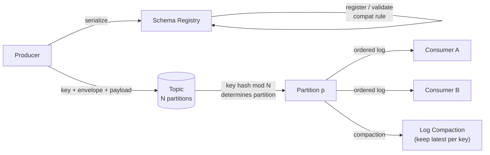

# Event Design

> Chapter from the **Data Engineering Playbook** — Kafka.

The shape of an event is the most expensive decision you make on a streaming platform, because once a topic has 40 downstream consumers you no longer own the schema — they do. This chapter is about designing events that can survive five years of producers and consumers evolving independently without a coordinated deploy.

## TL;DR

- An event is a **contract**, not a message. Treat the schema, the key, the partitioning, the compaction semantics, and the topic naming as one indivisible API surface that you version deliberately.
- Decide **fact vs. delta vs. state** up front. `OrderPlaced` (fact), `order-quantity-changed-by +2` (delta), and `order is now {qty: 5}` (state) have completely different replay, idempotency, and compaction properties. Mixing them in one topic is the most common design error.
- The **partition key is your ordering guarantee and your hot-spot risk**. Kafka only orders within a partition. Pick the key that matches the aggregate you need ordered (usually the entity ID), and accept that you've now coupled throughput to key cardinality.
- **Schema evolution is backward/forward compatibility math**, not vibes. Adding an optional field with a default is safe; removing a required field, changing a type, or renaming is not. The Schema Registry enforces this — configure `FULL_TRANSITIVE` and mean it.
- Put the **event envelope** (id, type, version, time, key, correlation/causation IDs, source) outside the payload so routing, dedup, and lineage don't depend on parsing every consumer's domain fields.
- Design for **replay from offset 0** as a first-class operation. If reprocessing the topic from the beginning produces a different result than the live stream did, your events aren't really events — they're RPC calls in a trench coat.

## Why this matters in production

Concrete scenario. We had a `payments.transactions.v1` topic on an MSK cluster (Kafka 3.5, 24 partitions) keyed by `account_id`. The original producer team modeled it as a **state** event: each message was the full current state of a transaction. Three years later there were 31 consumers — a fraud service, a ledger materializer writing to Iceberg, a Flink job computing rolling balances, a CDC mirror to a downstream region, and 27 others.

Then a producer team "optimized" by switching to **delta** events (`amount_delta` instead of `amount`) to save bandwidth, behind a feature flag, without a version bump. Backward-compatible at the Avro level (they added a nullable field, removed nothing). The Schema Registry passed it. Production broke in three different ways within an hour:

- The ledger materializer summed `amount` as before, now mostly null → balances dropped to zero on replay.
- The fraud service's `MAX(amount)` window started flagging everything as anomalous.
- The Iceberg sink's `MERGE ... WHEN MATCHED UPDATE` overwrote good rows with nulls, and because the table had a 7-day snapshot retention, the clean state had already expired.

The schema was compatible. The **semantics** were not. Compatibility checks validate that bytes deserialize; they do not validate that meaning is preserved. That gap — between wire compatibility and semantic compatibility — is where most streaming incidents live, and it's why event design is a principal-level concern, not a serialization detail.

## How it works

An event flows through five design surfaces, each of which can be wrong independently:



**Partition assignment.** The producer computes `partition = murmur2(key) % num_partitions` (the default `DefaultPartitioner`). Same key → same partition → total order for that key. Null key → round-robin (sticky in modern clients), so **null-keyed topics have no per-entity ordering at all**. This is the single most load-bearing fact in event design: your ordering guarantee is exactly "per key, within a partition, never across."

**Compaction vs. retention.** Two retention models, and the event type dictates which:

| Model | Config | Keeps | Use for |
|---|---|---|---|
| Time/size retention | `cleanup.policy=delete`, `retention.ms` | All events in window | Facts (immutable history) |
| Log compaction | `cleanup.policy=compact` | Latest value per key | State (current snapshot) |
| Both | `cleanup.policy=compact,delete` | Latest per key within window | State with eviction |

Compaction is a key-by-key "keep the last write" garbage collection. A `null` value for a key is a **tombstone** — it deletes the key after `delete.retention.ms`. This means state topics and tombstones are a coupled design: if your event type is "state," deletes must be a value of `null`, not a `deleted=true` field, or compaction will never reclaim the key.

**Compatibility math.** For a registry compatibility mode, the question is whether reader schema R can read data written with writer schema W:

- **BACKWARD**: new R reads old W. Safe changes: add field *with default*, delete field. (Consumers upgrade first.)
- **FORWARD**: old R reads new W. Safe changes: add field, delete field *with default*. (Producers upgrade first.)
- **FULL**: both. Safe changes: add/remove only fields *with defaults*.
- **`_TRANSITIVE`**: the above, checked against **all** prior versions, not just the immediately previous one. Without transitive, you can chain three "compatible" steps into a net-incompatible jump.

In a multi-consumer topic where you do not control deploy order, **`FULL_TRANSITIVE` is the only honest setting**. Anything weaker assumes coordination you do not have.

## Deep dive

### Fact vs. delta vs. state — the decision that propagates everywhere

This is the choice that everything else falls out of.

| Property | Fact (event) | Delta (change) | State (snapshot) |
|---|---|---|---|
| Example | `OrderPlaced{order_id, total}` | `StockAdjusted{sku, +2}` | `Order{id, status, total}` |
| Replay from 0 | Reconstructs full history | Requires every prior delta, in order, no gaps | Reconstructs current state only |
| Idempotent on redelivery | Yes (dedup by event id) | **No** — double-apply corrupts | Yes (last-write-wins) |
| Compaction | No (lose history) | No (lose intermediate deltas) | Yes (this is the point) |
| Missing one message | History has a hole | **State permanently wrong** | Self-heals on next snapshot |
| Right retention | Time/size | Time/size + careful gap detection | Compaction |

The trap: **deltas look efficient and behave like landmines.** A redelivery (which Kafka allows under at-least-once) double-applies. A consumer that skips one offset is permanently desynchronized with no signal. Use deltas only when you have an independent reconciliation mechanism (e.g., periodic full snapshots into the same topic, or a separate state topic to true up against). For most domains, **emit facts, and let consumers fold facts into their own state** — that pushes the materialization where it belongs, into the consumer that knows what state it needs.

### The envelope

Routing, dedup, and lineage should never require parsing domain fields. Standardize an envelope (CloudEvents is a reasonable starting spec) and keep it stable across all topics:

```json
{
  "id": "01HZ8...ULID",
  "type": "com.acme.payments.TransactionAuthorized",
  "specversion": "1.0",
  "source": "payments-auth-service",
  "time": "2026-06-18T14:03:11.221Z",
  "subject": "account_id=A-4471",
  "datacontenttype": "application/avro",
  "dataschema": "payments.TransactionAuthorized:v3",
  "traceparent": "00-4bf92f...-00f067aa...-01",
  "causationid": "01HZ7...",
  "data": { "...domain payload..." }
}
```

`id` powers consumer-side dedup (store seen IDs in a TTL'd RocksDB/state store). `causationid`/`traceparent` give you event lineage across services — when the fraud team asks "what triggered this?", you can walk the chain. `dataschema` lets a consumer pin the exact contract it parses without trusting the topic name. Crucially, **put `type` and `id` in the Kafka record headers too**, so routers and dedup filters never deserialize the payload at all.

### Schema design choices that bite later

- **Avro over JSON for high-volume topics.** Schema-on-write, compact binary, registry-enforced evolution. JSON Schema is fine for low-volume control planes where human-readability wins. Protobuf is the right call when you also have gRPC services sharing the contract.
- **Never use `enum` for open-ended sets.** Avro enums are closed; adding a value is a breaking change for old readers (they can't decode the new symbol). Use a `string` with documented valid values, or accept that the enum locks your vocabulary forever. We've had `status` enums that took a 3-week cross-team migration to add one value.
- **Logical types and time.** Always store time as `timestamp-millis` (UTC epoch), never a formatted string. Capture both **event time** (when it happened in the domain) and **ingestion time** (when produced) — windowed consumers and Flink/Spark watermarking need event time, and you cannot reconstruct it later.
- **`union` with `null` for optionality, default `null`.** This is the *only* way to add a field backward-compatibly. `["null","string"]` with `"default": null`. Order matters in Avro unions — the default's type must be first.
- **No `bytes` blobs of nested JSON.** "We'll just stuff a JSON string in a field and parse it later" defeats the registry, breaks evolution, and hides the contract. If it has structure, model it.

### Keying and partitioning is a throughput contract

The key decides ordering *and* parallelism *and* hot-spot exposure simultaneously:

- Key by the **aggregate root you need ordered**. For payments that's usually `account_id`; for IoT it's `device_id`. If you key by something high-cardinality and uniform (`event_id`), you get perfect spread but **zero ordering** — fine for facts, fatal for anything order-dependent.
- **Hot keys throttle a whole partition.** One `account_id` doing 50% of traffic pins one partition's consumer at 100% while 23 others idle. Detect with per-partition lag skew. Mitigations: composite key (`account_id + bucket`) if you can relax to per-account *eventual* ordering, or pull the hot entity onto its own topic.
- **Partition count is sticky.** You can increase partitions, but doing so **changes `key % N` and breaks all existing per-key ordering** from that moment — historical messages for a key may now live on a different partition than new ones. Over-provision partitions at creation (a 2-4x headroom on expected consumer parallelism) rather than reshard live. This interacts directly with consumer scaling — see [consumer-groups](../consumer-groups/README.md).

## Worked example

Designing `payments.transactions.v3` as a **fact** topic with an Avro contract, registered under `FULL_TRANSITIVE`, keyed by `account_id`.

**Avro schema** (`TransactionAuthorized.avsc`):

```json
{
  "type": "record",
  "name": "TransactionAuthorized",
  "namespace": "com.acme.payments",
  "doc": "Immutable fact: an authorization decision was made.",
  "fields": [
    { "name": "event_id",     "type": "string", "doc": "ULID; consumer dedup key" },
    { "name": "account_id",   "type": "string", "doc": "Partition key" },
    { "name": "txn_id",        "type": "string" },
    { "name": "amount_minor", "type": "long",   "doc": "Integer minor units; never float for money" },
    { "name": "currency",     "type": "string", "doc": "ISO-4217; open set, deliberately not an enum" },
    { "name": "occurred_at",  "type": { "type": "long", "logicalType": "timestamp-millis" } },
    { "name": "produced_at",  "type": { "type": "long", "logicalType": "timestamp-millis" } },
    { "name": "decision",     "type": "string", "doc": "APPROVED|DECLINED|... documented open set" },
    {
      "name": "risk_score",
      "type": ["null", "double"],
      "default": null,
      "doc": "Added v3 — nullable+default keeps it backward/forward compatible"
    }
  ]
}
```

Note `amount_minor` is a `long` of minor units (cents), never a `float`/`double` — binary floats cannot represent `0.10` exactly and you will lose money in aggregation.

**Topic and registry config:**

```bash
# Over-provisioned partitions; never reshard a keyed fact topic live.
kafka-topics --create --topic payments.transactions.v3 \
  --partitions 48 --replication-factor 3 \
  --config min.insync.replicas=2 \
  --config cleanup.policy=delete \
  --config retention.ms=2592000000   # 30d of facts

# The contract is the API. Enforce semantic-safe evolution.
curl -X PUT $REGISTRY/config/payments.transactions.v3-value \
  -d '{"compatibility":"FULL_TRANSITIVE"}'
```

**Producer (idempotent, keyed, headers carry routing metadata):**

```python
from confluent_kafka import SerializingProducer
from confluent_kafka.schema_registry.avro import AvroSerializer

producer = SerializingProducer({
    "bootstrap.servers": BROKERS,
    "enable.idempotence": True,          # no producer-side dup on retry
    "acks": "all",                       # wait for min.insync.replicas
    "max.in.flight.requests.per.connection": 5,
    "value.serializer": AvroSerializer(sr_client, schema_str),
})

def emit(txn):
    producer.produce(
        topic="payments.transactions.v3",
        key=txn["account_id"],            # ordering boundary
        value=txn,
        headers=[                          # routers/dedup never parse payload
            ("event_type", b"TransactionAuthorized"),
            ("event_id", txn["event_id"].encode()),
            ("schema_version", b"3"),
        ],
    )
```

**Consumer folds facts into state idempotently** (the dedup that makes at-least-once safe):

```python
def handle(msg):
    eid = dict(msg.headers())["event_id"]
    if seen_store.contains(eid):          # TTL'd state store
        return                            # redelivery — drop, no double-apply
    fact = msg.value()
    balances[fact["account_id"]] += fact["amount_minor"]   # fold fact -> state
    seen_store.put(eid, ttl="48h")
```

Because each message is a **fact** with a stable `event_id`, replay from offset 0 reproduces the exact balance, and redelivery is a no-op. That is the property the original `payments.transactions.v1` topic lost when it switched to deltas.

## Production patterns

- **Topic naming as a typed namespace.** `<domain>.<aggregate>.<version>` (`payments.transactions.v3`). Version in the topic name for **breaking** changes (new topic, dual-write, drain, retire). Version in the schema for **compatible** changes. Never mutate v3's meaning in place.
- **Dual-write migration for breaking changes.** Produce to v3 and v4 simultaneously, move consumers one at a time, monitor lag on both, retire v3 only when its consumer-group count hits zero. This is the only safe way to change a key, a partition strategy, or fact↔state semantics.
- **Tombstones for the right-to-be-forgotten.** On a compacted state topic, GDPR/CCPA deletion = produce a `null` value for that key. Set `delete.retention.ms` long enough that all consumers see the tombstone before it's compacted away, or a slow consumer rebuilds the deleted key.
- **Schema CI gate.** Run `mvn schema-registry:test-compatibility` (or the Gradle/CLI equivalent) in the producer's pipeline. A schema change that fails compatibility should fail the build, not fail in production.
- **Carry trace context in the envelope** so a single user action's event chain is walkable across services — this is your incident-debugging lifeline and feeds [observability](../../observability/README.md).
- **Pair every topic with a DLQ contract.** Poison messages (unparseable, failed-invariant) go to a dead-letter topic with the original headers plus a failure reason — see [dlq](../dlq/README.md).

## Anti-patterns & failure modes

| Anti-pattern | Symptom you'll observe | Fix |
|---|---|---|
| Delta events without reconciliation | Consumer state silently drifts; balances wrong after one skipped/duplicated offset | Emit facts; or add periodic full snapshots + gap detection on a monotonic sequence |
| Null partition keys on an order-dependent topic | Out-of-order processing; "the refund applied before the charge" | Key by the aggregate root; verify with per-key ordering tests |
| Compatibility ≠ semantics | Registry passes, consumers compute garbage (the v1 incident) | Version the *topic* for semantic changes; review meaning, not just bytes |
| `enum` for an evolving set | 3-week cross-team migration to add one status value; old readers fail to decode | Use documented `string`; reserve enums for truly closed sets |
| Increasing partitions on a live keyed topic | Per-key ordering breaks at the resize boundary; duplicate-looking processing | Over-provision at creation; if you must reshard, treat it as a new topic + dual-write |
| Float for money | Penny drift in aggregates; reconciliation fails audit | `long` minor units or `decimal` logical type |
| Fat JSON blob in a `bytes`/`string` field | Registry can't enforce it; silent breaking changes ship | Model the structure as real Avro/Proto fields |
| `deleted=true` flag on a compacted topic | Topic grows unbounded; "deleted" keys never reclaimed | Use `null` tombstones; deletion is the absence of a value |
| No `event_id` for dedup | Double-processing on every consumer rebalance/redelivery | Add a stable ULID; dedup in a TTL'd state store |

## Decision guidance

**Event type:**

| Choose | When |
|---|---|
| **Fact** | Default. History matters, you want replay, consumers materialize their own views. |
| **State (compacted)** | Consumers need "current value of X" cheaply, history doesn't matter, you have a natural key (CDC topics, config, lookup tables). |
| **Delta** | Only with an independent truth-up mechanism and a monotonic sequence for gap detection. Rare. |

**Serialization:**

| Format | Pick when |
|---|---|
| **Avro + Schema Registry** | High-volume domain events, strong evolution discipline, JVM/Python ecosystem. Default. |
| **Protobuf** | Contract shared with gRPC services; cross-language with strict typing. |
| **JSON Schema** | Low-volume control-plane topics where human-readability beats compactness. |

**Compatibility mode:** `FULL_TRANSITIVE` for any topic with consumers you don't deploy. `BACKWARD` only when you provably upgrade consumers before producers and own both.

Adjacent guarantees live in sibling chapters: ordering/replay interacts with [offsets](../offsets/README.md), delivery semantics with [exactly-once](../exactly-once/README.md).

## Interview & architecture-review talking points

- "An event is an API contract with no caller you can see. I design the envelope, key, schema, and retention as one versioned surface, and I version the topic for semantic changes and the schema for compatible ones." This is the framing that signals you've operated topics with dozens of consumers.
- "Schema compatibility is necessary but not sufficient — it validates deserialization, not meaning. The expensive incidents are semantically-breaking, wire-compatible changes." Bring the delta-vs-state failure as the concrete example.
- "The partition key is simultaneously my ordering guarantee, my parallelism ceiling, and my hot-spot risk. I key by the aggregate root I need ordered and over-provision partitions because resharding a keyed topic breaks ordering."
- "I default to facts over deltas. Facts are idempotent on redelivery and replay-safe; deltas are landmines under at-least-once delivery. I push state materialization into the consumer that knows what state it needs."
- For money/audit domains: "Integer minor units, never floats; both event-time and ingestion-time; tombstones for deletion on compacted topics; trace context in the envelope for lineage." These specifics separate a principal answer from a textbook one.
- When challenged on cost ("deltas save bandwidth"): "Bandwidth is cheap; a silently-desynchronized fraud model is not. I'll spend the bytes to keep events self-contained and replay-safe."

## Further reading

- [consumer-groups](../consumer-groups/README.md) — how partition count and keys cap consumer parallelism.
- [offsets](../offsets/README.md) — replay, reset-to-earliest, and what "replay from 0" actually requires.
- [exactly-once](../exactly-once/README.md) — idempotent producers, transactions, and why consumer dedup still matters.
- [dlq](../dlq/README.md) — the failure contract that pairs with every event contract.
- [data-modeling](../../data-modeling/README.md) — how events land as facts/dimensions in the lakehouse.
- Martin Kleppmann, *Designing Data-Intensive Applications*, Ch. 11 (Stream Processing) — facts vs. state and the log abstraction.
- Confluent, [Schema Evolution and Compatibility](https://docs.confluent.io/platform/current/schema-registry/fundamentals/schema-evolution.html) — the canonical reference for the compatibility modes above.
- [CloudEvents specification](https://cloudevents.io/) — a sane, widely-adopted starting point for the event envelope.
