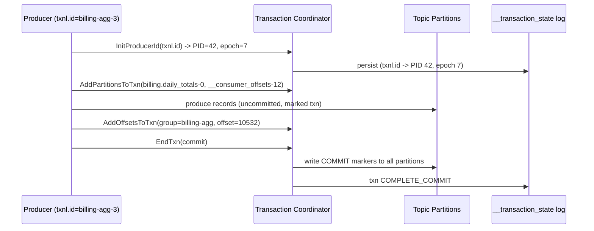
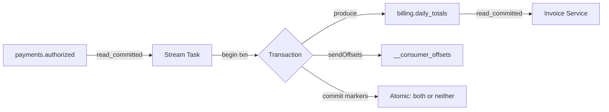

# Exactly-Once Semantics in Kafka

> Chapter from the **Data Engineering Playbook** — kafka.

## About This Chapter

**What this is.** Exactly-once semantics (EOS) in Kafka is the combination of three building blocks: the idempotent producer, transactions, and read-committed consumers. This chapter explains how those layers work together, where the guarantee actually holds, and where it can silently break.

**Who it's for.** Mid-level data engineers, data/ML engineers, platform/architecture leads, and engineers preparing for senior/staff data-engineering interviews.

**What you'll take away.** By the end you'll be able to:
- Combine the idempotent producer, transactions (which tie an offset commit to output), and read-committed consumers into an end-to-end Kafka-native guarantee — and spot the silent `read_uncommitted` downgrade (a misconfiguration that quietly breaks the guarantee).
- Recognize that EOS stops at the Kafka boundary and reach for idempotent sinks (external writes designed to be safely repeated) or the outbox pattern when writing to external systems.
- Use stable `transactional.id`s for fencing (blocking stale instances from writing), tune `commit.interval.ms`/`transaction.timeout.ms`, and diagnose a hung transaction that freezes the Last Stable Offset (LSO).

---

## TL;DR

- "Exactly-once" in Kafka is not a magic flag. It is the combination of three mechanisms: the **idempotent producer** (deduplicates writes within a partition using a producer ID and sequence number), **transactions** (atomic multi-partition writes plus offset commits), and **read-committed consumers** (skip aborted records). Drop any one and you fall back to at-least-once.
- The guarantee is **end-to-end only inside Kafka** — the pattern `consume → process → produce` where both the input offsets and the output records live in Kafka topics. The moment your destination is Postgres, S3, or an HTTP call, Kafka transactions stop protecting you and you need an **idempotent sink** (a write operation that is safe to run more than once) or a two-phase commit you build yourself.
- The idempotent producer alone gives you exactly-once **per partition, per producer session**. It does not survive an application restart with a new `producer.id`, and it does nothing for duplicates introduced by your own retry-the-whole-batch logic.
- Transactions cost real latency. With the default `commit.interval` you add one transaction round trip per batch; tune `transaction.timeout.ms` and batch size or you trade throughput for a guarantee most stages don't need.
- The most common production failure is a silent downgrade: someone sets `processing.guarantee=exactly_once_v2` in Kafka Streams but the downstream consumer reads with `isolation.level=read_uncommitted`, so it happily reads aborted records. The guarantee was never end-to-end.
- EOS protects against duplicate **delivery and processing**. It does not protect against duplicate **events at the source** (a payment service emitting the same `order_id` twice). That is a deduplification problem you solve with keys and idempotency tokens, not transactions.

## Why this matters in production

Picture a billing pipeline: a `payments.authorized` topic feeds a stream job that aggregates per-account spend into a `billing.daily_totals` topic, which a downstream service reads to generate invoices. At-least-once is the Kafka default, and at-least-once means: when a broker fails mid-write, or a consumer rebalances (reassigns partition ownership between consumers) before committing offsets, records get reprocessed.

For a running total, reprocessing is catastrophic. A retry that re-adds `$48.10` to a daily total double-bills the customer. The symptoms show up days later as a reconciliation gap — `billing.daily_totals` says `$1,204` but the sum of authorizations says `$1,156` — and now you are doing forensic offset archaeology across three consumer groups.

The naive fixes all leak:

- "Just commit offsets after processing." This is read-process-commit. If you crash *after* producing the aggregate but *before* committing the input offset, you reprocess and double-count. The window is small but it is non-zero, and at 50K records/sec a 200ms window is 10,000 records.
- "Make the producer idempotent." This deduplicates broker-side retries within one partition and session. It does nothing about the offset-commit race above.
- "Deduplicate downstream on a key." Workable, but you have now pushed the problem to every consumer and you need a state store with retention long enough to cover your worst replay.

Exactly-once-semantics (EOS) collapses the produce-and-commit into a **single atomic transaction**: either the aggregate record *and* the consumed offset both commit, or neither does. That is the difference between a correct counter and a reconciliation ticket.

## How it works

Three primitives stack. Understand them as layers, not as one switch.

### Layer 1 — Idempotent producer

Set `enable.idempotence=true` (the default since Kafka 3.0). The broker assigns each producer a **Producer ID (PID)** and the producer tags every record with a monotonic (always increasing) **sequence number** per partition. The broker tracks the last sequence per `(PID, partition)` and rejects or ignores a duplicate:

```
if record.seq == broker.lastSeq + 1   -> accept, advance
if record.seq <= broker.lastSeq        -> duplicate, ack but drop (DUPLICATE_SEQUENCE_NUMBER)
if record.seq >  broker.lastSeq + 1    -> OUT_OF_ORDER_SEQUENCE_NUMBER, fatal
```

This kills the classic "producer retried after a network blip and wrote the record twice" duplicate. It requires `acks=all`, `max.in.flight.requests.per.connection <= 5`, and bounded retries — all set automatically when idempotence is on.

### Layer 2 — Transactions

Idempotence is per-session; a restart gets a fresh PID and loses the deduplification history. Transactions fix that by giving the producer a stable, user-supplied `transactional.id`. The broker maps that to a PID and an **epoch** (a version counter), and the epoch lets a new instance **fence** (block and invalidate) a zombie old instance:



The key move is `sendOffsetsToTransaction` (`AddOffsetsToTxn` on the wire): the **consumer's input offset commit becomes part of the same transaction as the output records**. The coordinator writes commit/abort **markers** into every involved partition, including `__consumer_offsets` (the internal Kafka topic that tracks which offsets each consumer group has processed). That is the atomic bond between "what I read" and "what I wrote."

### Layer 3 — Read-committed consumer

Transaction markers are invisible unless the downstream consumer asks for them. Set `isolation.level=read_committed`. Now the consumer will not advance past the **Last Stable Offset (LSO)** — the offset of the first still-open transaction — and it filters out any record belonging to an aborted transaction. With `read_uncommitted` (the default), it reads everything, aborted records included, and your guarantee is gone.

### The end-to-end picture



## Deep dive

This is where engineers get it wrong.

### EOS is scoped to the Kafka boundary

The atomic unit is *Kafka offsets + Kafka records*. The instant your processing has a side effect outside Kafka — write to DynamoDB, call Stripe, append to an Iceberg table — the transaction does not cover it. If you commit the Kafka transaction and then crash before the DynamoDB write, you lose the write; if you write to DynamoDB and crash before the Kafka commit, you double-write on replay. **There is no Kafka transaction that spans Kafka and an external system.** Your options:

1. **Idempotent sink** — make the external write safe to repeat (upsert on a deterministic key, conditional put with a version). This is the pragmatic 90% answer.
2. **Outbox / CDC** — write the side effect *as* a Kafka record inside the transaction, then a separate connector applies it to the external system idempotently.
3. **Transactional connector** — Kafka Connect sink connectors with `exactly.once.support=required` (e.g. the S3 sink with file-level atomicity) push the deduplification into the connector's commit protocol.

### `exactly_once` vs `exactly_once_v2`

The original Kafka Streams EOS (pre-2.5) used **one producer per input partition**. A task consuming 64 partitions held 64 transactional producers, 64 PIDs, 64 transaction states. It worked but it did not scale — broker memory and `__transaction_state` (the internal topic that stores transaction status) traffic exploded.

`exactly_once_v2` (introduced in KIP-447, the default since version 2.6, the v1 alias is deprecated) lets a single producer commit offsets for **multiple input partitions in one transaction** by threading consumer group metadata through `sendOffsetsToTransaction`. Use v2. If you see code or configs pinned to `exactly_once`, that is a sign of an old copy-paste and usually comes from an older Confluent example.

### The Last Stable Offset and consumer lag lies

A `read_committed` consumer can only advance to the LSO (Last Stable Offset — the offset of the earliest open transaction). If a transaction stays open — a stuck producer, a long `transaction.timeout.ms`, a paused stream task — the LSO does not move and **every read-committed consumer behind it stalls**, even though the log has plenty of committed data after the open transaction. Symptom: consumer lag climbs while broker bytes-in is healthy and there is no obvious slow consumer. The fix is to find the long-running or zombie transaction (look at `kafka-transactions.sh --list`) and let it time out or abort.

There is also a subtle lag-metric trap: with read-committed, the gap between the LSO and the log-end offset is "in-flight transaction" data, not lag. Standard lag exporters that diff committed-offset against log-end will **over-report lag** for EOS consumers. Alert on LSO-relative lag.

### Transaction timeout and fencing

`transaction.timeout.ms` (producer side) must be `<= transaction.max.timeout.ms` (broker side, default 15 min). If your processing of a batch — including any slow external call — exceeds the timeout, the coordinator aborts your transaction out from under you, you get a `ProducerFencedException` (meaning a newer producer epoch has taken over your task) or `InvalidProducerEpochException`, and the task must rebuild from the last committed offset. Set the timeout above your realistic worst-case batch time, but not so high that a genuinely stuck task blocks the LSO for everyone for 15 minutes.

Fencing is the other half of the story. When a task migrates after a rebalance, the new owner calls `InitProducerId` with the same `transactional.id`, gets a higher epoch, and any write from the old (zombie) instance is rejected with `ProducerFenced`. This is what prevents a slow-dying old instance from committing stale aggregates. It only works if the `transactional.id` is **stable and deterministic per task** — Kafka Streams derives it from `applicationId + taskId`; if you roll your own producer, you must do the same or zombie instances slip through.

### What EOS does NOT give you

- **No protection against source duplicates.** If the upstream system emits `order_id=X` twice as two distinct records, Kafka faithfully delivers both exactly once. Deduplicate on a business key — see [event-design](../event-design/README.md) for putting an idempotency key on the event.
- **No ordering guarantee across partitions.** EOS is per-partition. Cross-partition ordering still requires keying or a single partition.
- **No exactly-once for `auto.offset.reset`.** If a consumer group's offsets are deleted (due to retention on `__consumer_offsets`, or a manual reset), EOS cannot reconstruct where you were.

## Worked example

A read-process-write aggregator using the Java transactional API (the canonical EOS pattern). Java is used here because the transactional consumer-producer loop is most explicit in that language; then the Kafka Streams one-liner is shown after.

### Raw transactional loop

```java
Properties producerProps = new Properties();
producerProps.put(ProducerConfig.BOOTSTRAP_SERVERS_CONFIG, "broker:9092");
producerProps.put(ProducerConfig.ENABLE_IDEMPOTENCE_CONFIG, "true");
producerProps.put(ProducerConfig.ACKS_CONFIG, "all");
// Stable, deterministic per logical task instance — NOT a random UUID.
producerProps.put(ProducerConfig.TRANSACTIONAL_ID_CONFIG, "billing-agg-" + taskId);
producerProps.put(ProducerConfig.TRANSACTION_TIMEOUT_CONFIG, "60000"); // 60s > worst batch

KafkaProducer<String, Long> producer = new KafkaProducer<>(producerProps);
producer.initTransactions(); // claims PID + epoch, fences any zombie

Properties consumerProps = new Properties();
consumerProps.put(ConsumerConfig.BOOTSTRAP_SERVERS_CONFIG, "broker:9092");
consumerProps.put(ConsumerConfig.GROUP_ID_CONFIG, "billing-agg");
consumerProps.put(ConsumerConfig.ISOLATION_LEVEL_CONFIG, "read_committed");
consumerProps.put(ConsumerConfig.ENABLE_AUTO_COMMIT_CONFIG, "false"); // offsets go in the txn
KafkaConsumer<String, Long> consumer = new KafkaConsumer<>(consumerProps);
consumer.subscribe(List.of("payments.authorized"));

while (running) {
    ConsumerRecords<String, Long> records = consumer.poll(Duration.ofMillis(200));
    if (records.isEmpty()) continue;

    producer.beginTransaction();
    try {
        Map<String, Long> totals = new HashMap<>();
        for (ConsumerRecord<String, Long> r : records) {
            totals.merge(r.key(), r.value(), Long::sum);
        }
        for (var e : totals.entrySet()) {
            producer.send(new ProducerRecord<>("billing.daily_totals", e.getKey(), e.getValue()));
        }

        // Bind the input offsets into THIS transaction (v2: group metadata, not just group id)
        Map<TopicPartition, OffsetAndMetadata> offsets = new HashMap<>();
        for (TopicPartition tp : records.partitions()) {
            long last = records.records(tp).get(records.records(tp).size() - 1).offset();
            offsets.put(tp, new OffsetAndMetadata(last + 1));
        }
        producer.sendOffsetsToTransaction(offsets, consumer.groupMetadata());

        producer.commitTransaction(); // atomic: records + offsets, or nothing
    } catch (ProducerFencedException | OutOfOrderSequenceException e) {
        producer.close(); // fatal — a new instance fenced us; let it own the task
        throw e;
    } catch (KafkaException e) {
        producer.abortTransaction(); // retryable — abort, reprocess from last commit
    }
}
```

The two distinct catch blocks matter. `ProducerFencedException` is **fatal** — a newer epoch owns the task, you must die. A generic `KafkaException` is **retryable** — abort and the next poll re-reads from the last committed offset, which is correct because nothing committed.

### Kafka Streams equivalent

Streams hides all of the above behind one property:

```java
Properties props = new Properties();
props.put(StreamsConfig.APPLICATION_ID_CONFIG, "billing-agg"); // drives transactional.id
props.put(StreamsConfig.PROCESSING_GUARANTEE_CONFIG, StreamsConfig.EXACTLY_ONCE_V2);
props.put(StreamsConfig.COMMIT_INTERVAL_MS_CONFIG, "100"); // txn boundary; lower = more txns
// Downstream consumers MUST still set read_committed themselves.
```

```java
StreamsBuilder b = new StreamsBuilder();
b.stream("payments.authorized", Consumed.with(Serdes.String(), Serdes.Long()))
 .groupByKey()
 .reduce(Long::sum, Materialized.as("daily-totals-store"))
 .toStream()
 .to("billing.daily_totals", Produced.with(Serdes.String(), Serdes.Long()));
```

`commit.interval.ms` is the real throughput knob: it controls transaction size. At `100ms` you commit roughly 10 transactions/sec/task; raising it to `1000ms` cuts transaction overhead 10x at the cost of 1s of end-to-end latency and larger replay-on-failure windows. With EOS the default is `100ms`; with at-least-once it is `30000ms`. Tune deliberately.

## Production patterns

- **Pin `transactional.id` to the logical task, never a random value.** A `UUID.randomUUID()` transactional id makes fencing impossible — every restart is a "new" producer, zombies never get fenced, and you have idempotence on paper only. Derive it from `appId + partition` or let Streams do it.
- **Enforce `read_committed` as an org default, not a per-team opt-in.** The producer side can be flawless and one downstream team reading `read_uncommitted` voids the guarantee silently. Bake it into your client library defaults and assert it in integration tests.
- **Push side effects through the outbox pattern.** Write the external action as a record into a Kafka topic *inside* the EOS transaction; a separate idempotent sink connector applies it. This keeps the atomic boundary inside Kafka where transactions actually hold.
- **Size transactions for your latency SLO.** Use `commit.interval.ms` (Streams) or batch poll size (raw) as the dial. Measure end-to-end p99 with EOS on; expect a 1.5–3x latency increase versus at-least-once at the same batch size, mostly from the commit round trip.
- **Monitor open-transaction age and LSO-relative lag.** A single stuck transaction stalls every read-committed consumer behind it. Alert when `transaction age > transaction.timeout.ms * 0.8`.
- **Replicate `__transaction_state` and `__consumer_offsets` with the same care as your data topics.** EOS state lives there. Default replication factor 3, `min.insync.replicas=2`. A coordinator failover with under-replicated transaction state is how you get hung transactions.

## Anti-patterns & failure modes

| Anti-pattern | Symptom you observe | Fix |
|---|---|---|
| Producer EOS, consumer `read_uncommitted` | Downstream sees aborted records; intermittent duplicates that don't correlate with restarts | Set `isolation.level=read_committed` everywhere; assert in CI |
| Random / non-deterministic `transactional.id` | Duplicates appear only after deploys or rebalances; no `ProducerFenced` in logs | Deterministic id per task; let Kafka Streams manage it |
| Treating EOS as covering an external DB write | DB has duplicate or missing rows after a crash; Kafka topic is clean | Idempotent sink (upsert by key) or outbox pattern |
| `transaction.timeout.ms` shorter than batch processing | Recurring `ProducerFencedException`, tasks thrash and rebuild state | Raise timeout above worst-case batch time (under broker max) |
| Long external call inside the transaction | LSO frozen, fleet-wide read-committed lag climbs, broker bytes-in healthy | Move slow calls outside the txn; shorten transaction scope |
| Lag exporter diffing committed vs log-end on EOS topic | False high-lag alerts during normal in-flight transactions | Alert on LSO-relative lag, not log-end-relative |
| Using deprecated `exactly_once` (v1) on many partitions | Broker memory pressure, `__transaction_state` write amplification | Migrate to `exactly_once_v2` |
| Assuming EOS deduplicates source duplicates | Two invoices for one order despite EOS being "on" | Business-key deduplification with an idempotency token on the event |

## Decision guidance

| You need… | Use | Notes |
|---|---|---|
| A correct Kafka-to-Kafka counter/aggregator | **EOS v2** (Streams or transactional API) | The textbook fit; this is what transactions were built for |
| Kafka-to-external-system with no duplicates | At-least-once + **idempotent sink** | Cheaper and simpler than fake "EOS to a DB"; upsert by key |
| High-throughput log/metrics ingest, occasional dup OK | **At-least-once** (default) | EOS latency/throughput cost not worth it for tolerant consumers |
| Fire-and-forget telemetry, loss acceptable | **At-most-once** (`acks=0`, commit before process) | Lowest latency, no guarantees |
| Cross-system atomicity (Kafka + DB together) | **Outbox + CDC** | No real distributed txn across Kafka and a DB; don't fake it |

Rule of thumb: reach for EOS when the processing is **stateful and within Kafka** (counters, joins, deduplification). For everything else, at-least-once with an idempotent sink is simpler, faster, and easier to reason about under failure. See [offsets](../offsets/README.md) for how commit strategy interacts with each delivery semantic, and [consumer-groups](../consumer-groups/README.md) for how rebalances trigger the fencing that EOS depends on.

## Interview & architecture-review talking points

- "Exactly-once in Kafka is three things combined — idempotent producer, transactions binding offset-commit to output, and read-committed consumers. It's an end-to-end guarantee *only inside Kafka*. The first question I ask in a review is: where's the sink? If it's a database, transactions don't help you and we design an idempotent upsert instead."
- "The single most common defect is a silent downgrade: the producer side is EOS but a consumer reads `read_uncommitted`. The guarantee is gone and nothing errors. I enforce `read_committed` in the shared client config and test for it."
- "I default to at-least-once with idempotent sinks. EOS earns its latency and operational cost only for stateful, Kafka-native processing. Turning on EOS everywhere is cargo-culting a guarantee you mostly don't need."
- "Fencing is the load-bearing detail. A stable `transactional.id` plus producer epochs is what stops a zombie task from committing stale state after a rebalance. A random transactional id quietly disables it."
- "Operationally, the failure that wakes you up is a hung transaction freezing the Last Stable Offset — fleet-wide read-committed lag with healthy broker throughput. I monitor open-transaction age and alert at 80% of the transaction timeout."

## Further reading

- [offsets](../offsets/README.md) — commit strategies and how they map to delivery semantics
- [consumer-groups](../consumer-groups/README.md) — rebalances, fencing, and partition ownership
- [event-design](../event-design/README.md) — idempotency keys and source-level deduplification
- [dlq](../dlq/README.md) — handling poison records without breaking the transaction
- [event-driven-systems](../../distributed-systems/event-driven-systems/README.md) — delivery semantics in the broader architecture
- [consistency-models](../../distributed-systems/consistency-models/README.md) — what "exactly-once" means against the consistency spectrum
