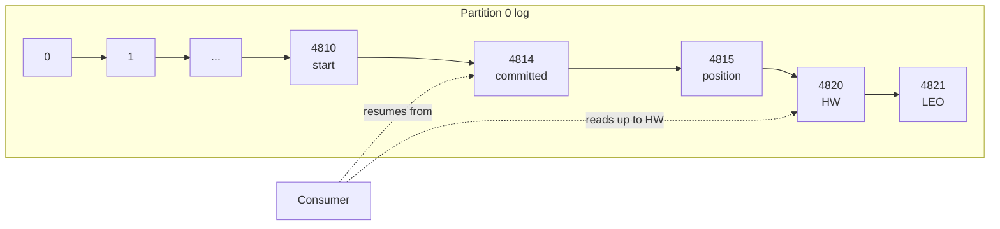

# Kafka Offsets

> Chapter from the **Data Engineering Playbook** — kafka.

## About This Chapter

**What this is.** An offset is a per-partition position that tells a consumer where to resume reading after a crash. This chapter is about when and where you move the committed offset (the saved resume point) relative to your side effects — the ordering that determines whether you get duplicates, data loss, or correct replay.

**Who it's for.** Mid-level data engineers, data/ML engineers, platform/architecture leads, and engineers preparing for senior/staff data-engineering interviews.

**What you'll take away.** By the end you'll be able to:
- Understand the broker watermarks (internal position markers) and consumer lag, and commit last-processed + 1 after the side effect to get correct at-least-once behavior.
- Choose `auto.offset.reset` (the setting that controls where to start reading when no saved position exists) deliberately, and avoid the auto-commit and `offsets.retention.minutes` traps that cause silent skips or replays.
- Achieve exactly-once by deriving the offset from sink state or Kafka transactions, and read accurate lag for Spark/Flink jobs that checkpoint (save) offsets themselves.

---

An offset is a 64-bit integer (a whole number up to about 9.2 quintillion) that names a position in a partition's log. Everything about consumer correctness — duplicates, data loss, replay, lag, rebalance pain — reduces to one question: *when, and to where, do you move the committed offset relative to when you do the side effect?* Get the ordering wrong and you ship double-charged invoices or silently drop events. This chapter is about that ordering.

## TL;DR

- An offset is a per-partition monotonic position (a number that only ever increases), not a global clock. `offset=4815` in partition 0 has nothing to do with `offset=4815` in partition 1. Ordering guarantees stop at the partition boundary.
- The committed offset is the position you'd **resume from after a crash**, and it is stored separately from your processing. The gap between "I committed offset N" and "I actually finished processing offset N-1" is where every duplicate and every dropped record lives.
- `enable.auto.commit=true` commits on a timer (`auto.commit.interval.ms`, default 5000ms) inside `poll()`, decoupled from whether your work succeeded. It is at-most-once or at-least-once depending on crash timing — never exactly-once. Most "we lost data on deploy" incidents trace back to it.
- The committed offset must equal **last-processed + 1**. Off-by-one here is the single most common offset bug: commit `record.offset()` instead of `record.offset() + 1` and you reprocess one record forever on every restart.
- `__consumer_offsets` is just a compacted Kafka topic (a special internal topic where old entries are cleaned up to keep only the latest value per key; 50 partitions by default). Offset commits are writes to this topic; offset fetches are reads of the last value per key. The group coordinator (the broker responsible for your consumer group) owns the relevant partition for your `group.id`.
- For real exactly-once you don't trust offsets alone — you either store the offset **transactionally with your output** (offset = function of state), or you make writes idempotent (safe to repeat) on a business key. See the exactly-once chapter for the full treatment.

## Why this matters in production

A payments enrichment service at scale reads a `transactions` topic, calls a fraud-scoring API, and writes the scored event to a downstream topic and a Postgres ledger. It runs with the Kafka defaults nobody reviewed: `enable.auto.commit=true`, `auto.commit.interval.ms=5000`.

Here is the failure. The consumer polls a batch of 500 records. It processes 200 of them — writes to Postgres, emits downstream — and then the pod gets OOM-killed mid-batch. But 1.2 seconds earlier, a `poll()` had fired the auto-commit timer and committed the offset for the **entire previous** batch plus part of this one, because auto-commit commits whatever was returned by the last `poll()`, not what you finished. On restart, the consumer resumes from the committed offset, skipping ~300 records that were fetched but never processed. Those transactions never get fraud scores. Nobody notices for 6 hours because lag looks healthy — the offset moved forward, it just moved forward over unprocessed data.

The inverse failure is just as common and shows up the day you turn auto-commit off without understanding it: you commit synchronously *before* the write to Postgres, the write fails, you retry the whole batch, and now you've double-inserted into the ledger. Same root cause, opposite symptom: the committed offset and the durable side effect are not atomic, and you chose the wrong order.

Offsets are the contract between "what Kafka thinks you've consumed" and "what your system has actually done." When those diverge, you don't get an error — you get a quiet correctness bug measured in dollars.

## How it works

Each partition is an append-only log (records are only ever added to the end, never inserted or overwritten). The offset is the array index of a record in that log. The broker tracks several watermarks (position markers) per partition that you must be able to read off a lag dashboard:

| Watermark | Meaning |
|---|---|
| **Log start offset** | Oldest retained offset (advances as retention/compaction deletes segments) |
| **Log end offset (LEO)** | Next offset to be written; the "head" of the log |
| **High watermark (HW)** | Highest offset replicated to all ISR (in-sync replicas — the brokers fully caught up with the leader); consumers can only read up to HW |
| **Committed offset** | Per-group, per-partition resume point stored in `__consumer_offsets` |

Consumer lag is `HW - committed offset`. Note it is *not* measured against your in-memory position — it is measured against what you've durably committed. A consumer that has processed everything but hasn't committed shows lag.



The committed offset lives in `__consumer_offsets`, keyed by `(group.id, topic, partition)`. The value is the offset to resume from plus optional metadata. Because the topic is **log-compacted** (only the most recent entry per key is kept), only the latest commit per key survives compaction, so the topic stays bounded regardless of commit frequency. The group coordinator (the broker that owns the `__consumer_offsets` partition for your group) serves `OffsetFetch` on rebalance/startup and persists `OffsetCommit`.

The invariant (the rule that everything depends on):

```
committed_offset = offset_of_last_successfully_processed_record + 1
```

The `+ 1` is not cosmetic. The committed offset is the *next* offset to read, not the last one read. The Java client's `OffsetAndMetadata` and the `commitSync(Map)` API both expect last-processed + 1. The convenience `commitSync()` (no args) computes this for you from the consumer's position; the explicit map form does not, and that's where people get the off-by-one.

## Deep dive

### Where the offset gets reset: `auto.offset.reset`

When a group has **no committed offset** for a partition (brand-new group, or the committed offset has aged out of retention), the consumer needs a starting point. `auto.offset.reset` decides:

- `latest` (default) — start at HW (the current head of the log). **Silently skips everything currently in the topic.** A new consumer group on a busy topic processes zero history and you wonder why your backfill is empty.
- `earliest` — start at log start offset (the oldest available record). Reprocesses everything retained. Correct for backfills, dangerous if your processing isn't idempotent (safe to repeat).
- `none` — throw `NoOffsetForPartitionException` (a hard error). Forces you to decide explicitly. The right choice for anything where a wrong default is a correctness incident.

The retention trap: `offsets.retention.minutes` (default 7 days in modern brokers, was 1 day pre-2.0) controls how long a committed offset survives **after the group goes empty** (no active consumers). A consumer group that's down for a long weekend can have its offsets expire, then on restart it falls back to `auto.offset.reset` and either skips everything (`latest`) or reprocesses everything (`earliest`). I have seen a low-volume nightly job lose its place over a holiday because `offsets.retention.minutes` was shorter than the gap between runs.

### Sync vs async commit

```java
consumer.commitSync();   // blocks, retries on retriable errors, throws on failure
consumer.commitAsync();  // fires and forgets, callback for result, no retry
```

`commitSync` is correct but adds latency to your loop and blocks on coordinator round-trips. `commitAsync` is fast but a failed async commit followed by a successful later one is fine — *out-of-order* commits are not. An async commit of offset 100 that lands after an async commit of 200 would move you backward. The standard pattern: `commitAsync` in the hot loop for throughput, `commitSync` in the `finally`/shutdown path and after rebalance to guarantee the final position is durable.

### Manual commit, done correctly

Auto-commit's flaw is that the commit is decoupled from your work. The fix is to own the commit and place it **after** the side effect, committing last-processed + 1:

```java
Properties props = new Properties();
props.put("enable.auto.commit", "false");
props.put("isolation.level", "read_committed"); // only see committed txn records
props.put("max.poll.records", "500");
props.put("auto.offset.reset", "none");

while (running) {
    ConsumerRecords<String, byte[]> records = consumer.poll(Duration.ofMillis(200));
    Map<TopicPartition, OffsetAndMetadata> toCommit = new HashMap<>();

    for (TopicPartition tp : records.partitions()) {
        List<ConsumerRecord<String, byte[]>> partitionRecords = records.records(tp);
        for (ConsumerRecord<String, byte[]> r : partitionRecords) {
            process(r);                       // the durable side effect
        }
        long lastOffset = partitionRecords.get(partitionRecords.size() - 1).offset();
        toCommit.put(tp, new OffsetAndMetadata(lastOffset + 1));  // +1 is the whole point
    }
    consumer.commitAsync(toCommit, (offsets, ex) -> {
        if (ex != null) log.warn("commit failed, will retry on next loop", ex);
    });
}
```

This is **at-least-once**: if you crash after `process()` but before the commit lands, you reprocess. That's the correct default for most pipelines — pair it with idempotent writes (writes that produce the same result even if repeated).

### `max.poll.interval.ms` and the silent rebalance that eats your commit

`max.poll.interval.ms` (default 300000ms = 5 min) is the maximum time between `poll()` calls before the coordinator considers the consumer dead and rebalances (reassigns) its partitions to another consumer. If your `process()` of a 500-record batch with a slow API takes longer than 5 minutes, the broker revokes your partitions mid-batch. Your subsequent `commitSync` then throws `CommitFailedException` because you no longer own those partitions — and another consumer has already started reprocessing from the old committed offset. Symptom: duplicate processing plus a storm of `CommitFailedException` in logs during high-latency periods. Fix: lower `max.poll.records`, raise `max.poll.interval.ms`, or move slow work off the poll thread.

### Why offsets alone can't give exactly-once

The committed offset and your external write are two separate systems. There is no two-phase commit (a protocol that makes two systems agree atomically) between Kafka and Postgres for free. So:

1. **Commit-then-write**: crash between them → record lost (at-most-once).
2. **Write-then-commit**: crash between them → record reprocessed (at-least-once).

There is no third ordering that is exactly-once across two independent systems. You only get exactly-once by collapsing them into one system: either Kafka transactions (offset commit and output produce in one transaction, the read-process-write loop) or by making the offset a *derived function of your sink state* — e.g. store the offset in the same Postgres transaction as the row, or use Spark Structured Streaming checkpoints. The takeaway for this chapter is: **stop trying to make `commit()` atomic with a foreign write — make the offset recoverable from the sink instead.**

### Storing offsets outside `__consumer_offsets`

For sink-coupled exactly-once you bypass Kafka's offset store entirely. On startup you `seek()` (manually position the consumer) to the offset you persisted alongside your data:

```python
# resume from offsets persisted transactionally with the sink
saved = sink.read_committed_offsets(group="enrichment")  # {TopicPartition: offset}
consumer.assign(list(saved.keys()))
for tp, off in saved.items():
    consumer.seek(tp, off)
# never call commit(); the sink is the source of truth
```

This is exactly what Spark Structured Streaming and Flink do — they manage offsets in their own checkpoint, not in `__consumer_offsets` (which is why the Kafka UI shows zero/stale committed offsets for a Spark consumer; lag tooling that reads `__consumer_offsets` will lie to you).

## Worked example

A PySpark Structured Streaming job reading Kafka. Spark stores offsets in its checkpoint, not `__consumer_offsets`, and recovers exactly-once for the Kafka-read + idempotent-sink path.

```python
from pyspark.sql import SparkSession
from pyspark.sql.functions import from_json, col
from pyspark.sql.types import StructType, StringType, LongType, DoubleType

spark = (SparkSession.builder
         .appName("txn-enrich")
         .config("spark.sql.streaming.checkpointLocation", "s3://lake/_chk/txn-enrich")
         .getOrCreate())

schema = (StructType()
          .add("txn_id", StringType())
          .add("amount", DoubleType())
          .add("ts", LongType()))

raw = (spark.readStream.format("kafka")
       .option("kafka.bootstrap.servers", "broker:9092")
       .option("subscribe", "transactions")
       .option("startingOffsets", "earliest")   # only honored on FIRST run; checkpoint wins after
       .option("failOnDataLoss", "true")          # fail loud if committed offset aged out of retention
       .option("maxOffsetsPerTrigger", 200000)    # bound per-microbatch work -> bounded lag spikes
       .load())

events = raw.select(
    from_json(col("value").cast("string"), schema).alias("e"),
    col("topic"), col("partition"), col("offset")  # offset is queryable for audit
).select("e.*", "partition", "offset")

# idempotent sink keyed on the business id makes reprocessing safe
def upsert_batch(batch_df, batch_id):
    (batch_df.write
        .format("delta").mode("append")
        .option("txnVersion", batch_id)   # Delta idempotent writes: dedupe by (appId, batchId)
        .option("txnAppId", "txn-enrich")
        .save("s3://lake/scored_txns"))

(events.writeStream
    .foreachBatch(upsert_batch)
    .option("checkpointLocation", "s3://lake/_chk/txn-enrich")
    .trigger(processingTime="30 seconds")
    .start()
    .awaitTermination())
```

Two offset-specific things make this correct: `failOnDataLoss=true` turns a silently-skipped range (offsets expired) into a loud failure instead of data loss, and `txnVersion`/`txnAppId` make Delta dedupe (deduplicate) replayed microbatches so that Spark's at-least-once Kafka read becomes effectively-once at the sink. `startingOffsets` only applies on the very first run — once the checkpoint exists, the checkpoint's offsets always win, which is why deleting a checkpoint to "reprocess from latest" is one of the most destructive operations in streaming.

### Resetting offsets operationally

When you genuinely need to replay or skip, do it with the admin tooling, never by editing `__consumer_offsets`:

```bash
# dry-run: show where each partition would land
kafka-consumer-groups.sh --bootstrap-server broker:9092 \
  --group enrichment --topic transactions \
  --reset-offsets --to-datetime 2026-06-18T00:00:00.000 --dry-run

# replay from a specific time (consumer group MUST be stopped first)
kafka-consumer-groups.sh --bootstrap-server broker:9092 \
  --group enrichment --topic transactions \
  --reset-offsets --to-datetime 2026-06-18T00:00:00.000 --execute

# skip a poison partition forward by 1000 (use with extreme care)
kafka-consumer-groups.sh --bootstrap-server broker:9092 \
  --group enrichment --topic transactions:7 \
  --reset-offsets --shift-by 1000 --execute
```

The group must have no active members or the reset is refused — Kafka won't let you move the floor out from under a running consumer.

## Production patterns

- **Commit last-processed + 1, after the side effect, always.** Treat the committed offset as a promise: "everything below this is durably done." Never let it run ahead of your durable work.
- **Set `auto.offset.reset=none` for correctness-critical consumers.** Make a missing offset a startup failure that a human triages, not a silent skip or a full replay. Use `earliest`/`latest` only where the wrong default is harmless.
- **Bound the batch: `max.poll.records` + `maxOffsetsPerTrigger`.** Large in-flight batches mean large reprocessing windows on crash and large lag spikes. Smaller bounded batches shrink the blast radius of any single failure.
- **Make `offsets.retention.minutes` longer than your longest expected downtime.** For nightly/weekly jobs, bump it well past the inter-run gap or you'll resume from the `auto.offset.reset` fallback.
- **For exactly-once, derive the offset from the sink.** Either Kafka transactions for read-process-write, or persist offsets in the sink's transaction. Don't bolt external two-phase commit onto `commitSync`.
- **Monitor committed-offset lag *and* offset velocity.** Lag near zero with velocity at zero means a stuck consumer that still looks "caught up." Alert on `rate(committed_offset) == 0 while LEO advancing`.
- **`commitAsync` in the loop, `commitSync` on shutdown and post-rebalance** (in `onPartitionsRevoked`) so your final position is durable and ordered.

## Anti-patterns & failure modes

| Anti-pattern | Symptom you'd observe | Fix |
|---|---|---|
| `enable.auto.commit=true` with slow processing | Records skipped on crash; lag looks healthy but downstream is missing data | Disable auto-commit; commit manually after processing |
| Committing `record.offset()` instead of `+ 1` | One record reprocessed on every single restart; perpetual single duplicate | Commit `offset + 1` |
| Commit-before-write | Quiet data loss on crash between commit and write | Reorder: write first, commit after; or transactional offsets |
| `auto.offset.reset=latest` on a new group expecting history | Backfill processes nothing; consumer "works" but output is empty | `earliest` for backfills, `none` for critical paths |
| Processing longer than `max.poll.interval.ms` | `CommitFailedException` storms + duplicate processing during slow periods | Lower `max.poll.records`, raise interval, async the slow work |
| Reading Spark/Flink lag from `__consumer_offsets` | Dashboard shows huge or zero lag for a healthy job | Read offsets from the engine's checkpoint/metrics, not `__consumer_offsets` |
| Deleting a Spark checkpoint to "start fresh" | Full reprocess or full skip; idempotency violations downstream | Use `startingOffsets` semantics; treat checkpoint as the durable offset store |
| Offsets expiring over downtime (`offsets.retention.minutes`) | Group resumes from `auto.offset.reset` after a long pause | Extend retention beyond max downtime; alert on offset reset |

## Decision guidance

| You need... | Use | Why |
|---|---|---|
| Simple pipeline, downstream is idempotent | Manual at-least-once (write then commit+1) | Cheapest correct option; duplicates are absorbed by the sink |
| No tolerance for duplicates, single Kafka in/out | Kafka transactions (read-process-write, EOS) | Offset commit and output produce are one atomic transaction |
| No tolerance for duplicates, external sink (DB/lake) | Offset stored in the sink's transaction, or idempotent upsert by business key | Collapses the two systems into one atomic unit |
| Spark/Flink streaming to a lakehouse | Engine checkpoint + idempotent sink (`txnVersion`) | Engine owns offsets; effectively-once at the sink |
| Backfill / replay | `--reset-offsets --to-datetime` (group stopped) + `earliest` | Deterministic, auditable, dry-runnable |
| Tolerate loss, never duplicates (e.g. metrics) | Commit-before-process (at-most-once) | Rare, but valid for lossy telemetry where dupes are worse |

If your answer is "I'll just use auto-commit," the only correct contexts are: the workload is genuinely idempotent end to end, or loss is acceptable. Everywhere else it is a latent incident.

## Interview & architecture-review talking points

- "Offsets are a resume pointer, not a processing record. The bug surface is the gap between committing the pointer and finishing the work. I order those two operations deliberately and I know which failure mode each ordering produces."
- "Exactly-once across Kafka and a foreign store isn't achievable by tuning `commitSync` — there's no free two-phase commit. I either use Kafka transactions for the read-process-write loop, or I make the offset a function of sink state so recovery is deterministic."
- "I set `auto.offset.reset=none` on critical consumers because the alternatives turn a missing-offset edge case into either silent data loss or an unbounded replay — both are incidents, and `none` forces a human decision."
- "For Spark/Flink I don't trust `kafka-consumer-groups.sh` lag numbers, because the engine stores offsets in its checkpoint. Lag tooling reading `__consumer_offsets` will report a stale or zero position for a perfectly healthy job."
- On rebalances: "Long `process()` times blow past `max.poll.interval.ms`, the coordinator revokes partitions, the next commit fails, and another consumer reprocesses. I bound `max.poll.records` and keep slow I/O off the poll thread."
- On retention: "Committed offsets expire via `offsets.retention.minutes` after a group goes empty. Low-frequency jobs need this raised, or they silently fall back to the reset policy."

## Further reading

- exactly-once — turning at-least-once offsets into end-to-end EOS (exactly-once semantics) with transactions and idempotent sinks.
- consumer-groups — rebalance protocol, partition assignment, and how revocation interacts with commits.
- dlq — what to do with the poison record (a record that causes your consumer to fail) so you can commit past it instead of stalling the partition.
- event-design — keying and partitioning choices that determine what "ordering" your offsets actually buy you.
