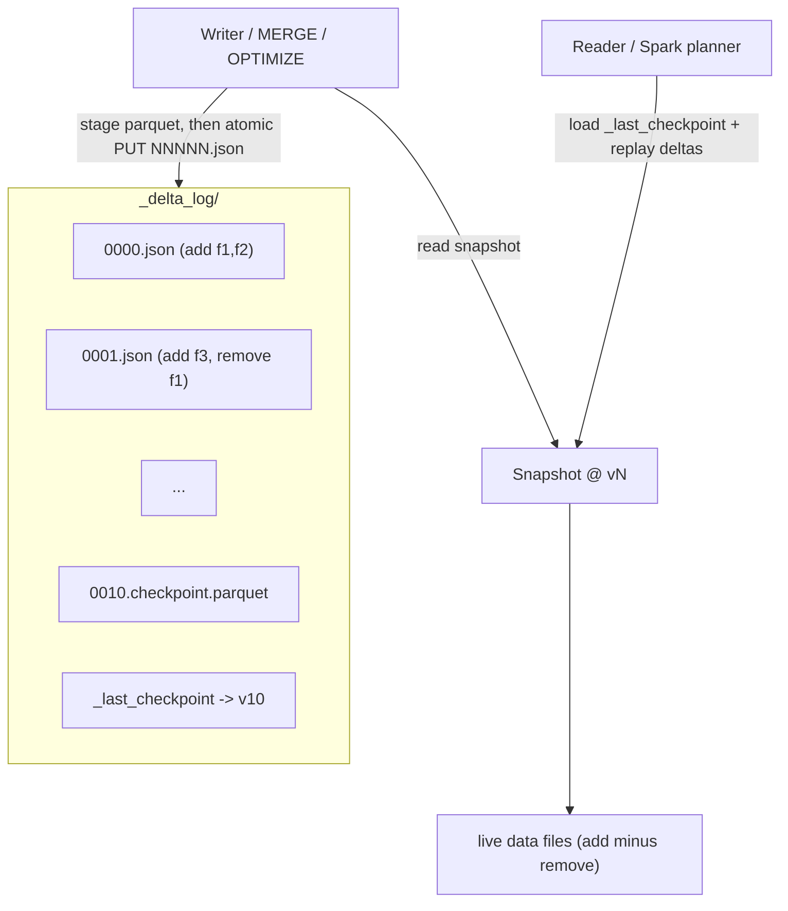

# Delta Lake

> Chapter from the **Data Engineering Playbook** — lakehouse.

## About This Chapter

**What this is.** Delta Lake is an ACID table format built on Parquet plus an ordered transaction log. This chapter covers how that log drives every guarantee, how `MERGE` and small-file accumulation drive cost, and how to wire `OPTIMIZE`, deletion vectors, and `VACUUM` into a table's lifecycle.

**Who it's for.** Data engineers, data/ML engineers, platform/architecture leads, and engineers preparing for senior/staff data-engineering interviews.

**What you'll take away.** By the end you'll be able to:
- Reason about the `_delta_log`, checkpoints, and optimistic-concurrency commit protocol as the source of truth for a table.
- Design partitioning, clustering, and deletion vectors so `MERGE` and CDC stay cheap instead of rewriting whole files.
- Manage log/file retention, `VACUUM`, and protocol-feature upgrades without self-inflicting `FileNotFoundException` or locking out external readers.

---

## TL;DR

- Delta Lake is an ACID table format built on Parquet plus an ordered **transaction log** (`_delta_log/`). The log — not the files on disk — is the source of truth for what a table contains at any version.
- Concurrency is **optimistic** with a single serialization point: writers commit by atomically creating `NNNNN.json`. Conflicts are detected at commit time and resolved by isolation level (`WriteSerializable` by default, not full `Serializable`).
- The expensive operations are not your writes — they are the **read-amplification from small files** and the **listing/log-replay cost** as the table accumulates thousands of commits. `OPTIMIZE`, checkpointing, and `VACUUM` exist to bound those.
- `MERGE` is the workhorse for CDC and upserts, and it is also where most teams burn money: a naive merge rewrites whole files. Partition pruning, deletion vectors, and `OPTIMIZE ZORDER` are the levers that keep it cheap.
- Delta is deeply co-designed with Spark and the Databricks runtime. Off-Databricks (OSS Delta, delta-rs, Trino, Flink) you get a real but lagging subset — feature parity is a per-version negotiation, not a given.
- The cross-engine question (Delta vs [Iceberg](../iceberg/README.md) vs [Hudi](../hudi/README.md)) is increasingly answered by **UniForm**, which writes Iceberg/Hudi metadata alongside Delta so one set of data files serves multiple readers.

## Why this matters in production

You have a `fact_transactions` table landing 40–60M rows/day from Kafka via Structured Streaming. Micro-batches commit every 30 seconds. Within three weeks you have ~60,000 tiny Parquet files (each a few MB), a `_delta_log/` with 60k+ commit JSONs, and analysts complaining that a `SELECT ... WHERE txn_date = current_date()` that used to return in 4 seconds now takes 90.

Nothing is "broken." Every write succeeded, every read is correct. What degraded is **metadata and I/O efficiency**:

- The driver must list and replay thousands of log entries to reconstruct the current snapshot before any query planning happens.
- The executors open tens of thousands of file handles, each with Parquet footer overhead, to read a day's data that should fit in a handful of 256 MB files.
- A nightly `MERGE` to apply late-arriving corrections rewrites entire partitions because the changed rows are scattered across all those small files.

Delta gives you the primitives to fix this without re-architecting: `OPTIMIZE` to compact, log checkpoints to collapse replay cost, deletion vectors to avoid rewrites on updates/deletes, and `VACUUM` to reclaim storage. A principal engineer's job is to wire those into the lifecycle of the table so the 90-second regression never happens — not to discover it in a Sev2.

## How it works

A Delta table is a directory containing data files (Parquet) and a `_delta_log/` directory holding an ordered sequence of commits. Each commit is a JSON file (`00000000000000000001.json`) containing **actions**: `add` (a new data file with stats), `remove` (tombstone a file), `metaData` (schema/partitioning), `protocol` (reader/writer feature versions), `commitInfo`, and `txn` (idempotency markers for streaming).

The current state of the table = replay all actions from version 0 to N in order. To avoid replaying millions of actions, every 10 commits (configurable) Delta writes a **checkpoint** — a Parquet file summarizing the table state up to that version — plus a `_last_checkpoint` pointer. Readers load the latest checkpoint and replay only the JSON deltas after it.



**Commit protocol (optimistic concurrency).** A writer:

1. Reads the current snapshot at version `r`.
2. Stages new Parquet files (no log entry yet — invisible to readers).
3. Attempts to commit version `r+1` by atomically writing `(r+1).json`.
4. If `(r+1).json` already exists (another writer won), it re-reads the new commits, checks whether their changes **conflict** with its own read/write set, and if not, retries the commit at `r+2`.

The atomicity of step 3 depends on the storage layer offering a put-if-absent / mutual-exclusion primitive. On S3, which historically lacked this, Delta uses a `LogStore` implementation; on Databricks this is backed by a commit service, and OSS Delta on S3 multi-cluster needs DynamoDB-backed `S3DynamoDBLogStore` to be safe.

**Isolation.** The default is `WriteSerializable`: reads see a consistent snapshot, and concurrent blind appends (which don't read overlapping data) are allowed to commit without conflict even though a strict serializable history might reorder them. You can tighten to `Serializable` per table:

```sql
ALTER TABLE fact_transactions SET TBLPROPERTIES ('delta.isolationLevel' = 'Serializable');
```

Conflict classes you will actually hit: `ConcurrentAppendException` (two writers add files to a partition another writer's condition reads), `ConcurrentDeleteReadException`, and `MetadataChangedException`. The fix is almost always to narrow each writer's condition so its read set doesn't overlap — usually by partitioning the write by the same key the writer filters on.

## Deep dive

### File statistics and data skipping

Every `add` action carries per-file stats: row count, and min/max/nullCount for the first `delta.dataSkippingNumIndexedCols` columns (default 32). The query planner uses these to **skip files** whose min/max range can't satisfy a predicate. This is why column order in the schema matters and why high-cardinality filter columns should be early. If you query on a column beyond index 32, you get zero skipping and full scans regardless of how well-clustered the data is.

`ZORDER BY (col_a, col_b)` co-locates rows with similar values in the same files using a space-filling (Z-order) curve, tightening per-file min/max ranges so skipping prunes more aggressively. Z-ordering is multi-dimensional but degrades past ~3–4 columns. On Databricks, **Liquid Clustering** (`CLUSTER BY`) supersedes both partitioning and Z-order for most new tables — it clusters incrementally without full rewrites and lets you change keys without re-partitioning.

### MERGE internals — the cost model

`MERGE` runs in two jobs. **Phase 1 (find touched files):** an inner join between source and target on the merge condition identifies which target files contain matching rows. **Phase 2 (rewrite):** every touched file is read, the matched rows are updated/deleted and unmatched rows from source inserted, and the result is written as new files; old files are tombstoned.

The killer detail: **the unit of rewrite is the file, not the row.** If your merge keys are scattered such that 200 changed rows land in 200 different 256 MB files, you rewrite ~50 GB to change 200 rows. Mitigations:

- **Partition/cluster on the merge key** so changed rows concentrate in few files, and add the partition predicate to the `ON` clause so Phase 1 prunes (`ON t.dt = s.dt AND t.id = s.id`).
- Enable **deletion vectors** (`delta.enableDeletionVectors = true`). Updates/deletes then write a compact bitmap of deleted row positions instead of rewriting the whole file — "merge-on-read." A later `OPTIMIZE` materializes the vectors. This turns a 50 GB rewrite into a few MB of DV writes.
- For low-shuffle merge on Databricks, the runtime keeps unmodified rows in place rather than re-shuffling the whole file's contents.

### Deletion vectors change your mental model

With DVs on, a "delete" doesn't remove data; it records positions to mask at read time. This means: storage doesn't shrink until `OPTIMIZE`/`VACUUM`; `VACUUM` semantics interact with DV-referenced files; and any external reader (Trino, delta-rs) **must support the DV reader feature** or it will return deleted rows. DVs are gated behind a protocol bump (reader/writer feature `deletionVectors`), and bumping the protocol can lock out older clients. Treat protocol upgrades as a breaking change to the table's consumer contract.

### Log retention, checkpoints, and the two clocks

There are two independent retention clocks people conflate:

| Clock | Property | Default | Governs |
| --- | --- | --- | --- |
| Log retention | `delta.logRetentionDuration` | 30 days | How far back the commit history (time travel by version/timestamp) is kept |
| Deleted-file retention | `delta.deletedFileRetentionDuration` | 7 days | How long tombstoned data files survive before `VACUUM` may delete them |

`VACUUM` deletes data files no longer referenced by the current snapshot **and** older than `deletedFileRetentionDuration`. If you `VACUUM` with a shorter retention than your longest-running reader or your time-travel SLA, you get `FileNotFoundException` on snapshots that still reference those files — a classic self-inflicted outage. Never lower the threshold below your longest concurrent read.

### Schema evolution

`mergeSchema` allows additive evolution (new columns, widening). It does **not** safely handle type narrowing or column renames by position. **Column mapping** (`delta.columnMapping.mode = 'name'`) decouples logical column names from physical Parquet names, enabling true renames and drops — but it's another protocol feature that older readers can't open. Streaming reads break on non-additive schema changes unless you provide a `schemaTrackingLocation`.

## Worked example

End-to-end CDC: stream Kafka into bronze, then a scheduled `MERGE` into a silver SCD-1 dimension, with the table configured for cheap merges.

```python
from pyspark.sql import SparkSession
from pyspark.sql import functions as F
from delta.tables import DeltaTable

spark = (
    SparkSession.builder
    .config("spark.sql.extensions", "io.delta.sql.DeltaSparkSessionExtension")
    .config("spark.sql.catalog.spark_catalog", "org.apache.spark.sql.delta.catalog.DeltaCatalog")
    .config("spark.databricks.delta.optimizeWrite.enabled", "true")   # right-size files at write
    .config("spark.databricks.delta.autoCompact.enabled", "true")     # auto-compact small commits
    .getOrCreate()
)

# 1) Bronze: append raw CDC envelopes from Kafka, idempotent per micro-batch via txn markers.
bronze_q = (
    spark.readStream.format("kafka")
    .option("subscribe", "txn.cdc")
    .option("maxOffsetsPerTrigger", 2_000_000)   # bound batch size -> bound file count
    .load()
    .selectExpr("CAST(value AS STRING) AS json", "timestamp AS kafka_ts")
    .writeStream.format("delta")
    .option("checkpointLocation", "s3://lake/_chk/bronze_txn")
    .trigger(processingTime="2 minutes")          # not 30s: fewer, larger commits
    .toTable("lake.bronze.txn_cdc")
)
```

```sql
-- 2) Silver dimension, configured up front for cheap merges.
CREATE TABLE IF NOT EXISTS lake.silver.dim_customer (
  customer_id   BIGINT,
  email         STRING,
  country       STRING,
  segment       STRING,
  op            STRING,          -- I/U/D from CDC
  src_ts        TIMESTAMP,
  ingest_dt     DATE
)
USING DELTA
PARTITIONED BY (ingest_dt)
TBLPROPERTIES (
  'delta.enableDeletionVectors' = 'true',
  'delta.autoOptimize.optimizeWrite' = 'true',
  'delta.deletedFileRetentionDuration' = 'interval 7 days',
  'delta.logRetentionDuration' = 'interval 30 days'
);
```

```python
# 3) Scheduled MERGE: dedupe CDC to latest row per key, then upsert/delete.
batch = (
    spark.read.table("lake.bronze.txn_cdc_parsed")
    .where("ingest_dt = current_date()")
)

latest = (
    batch.withColumn("rn", F.row_number().over(
        Window.partitionBy("customer_id").orderBy(F.col("src_ts").desc())))
    .where("rn = 1").drop("rn")
)

(DeltaTable.forName(spark, "lake.silver.dim_customer").alias("t")
    .merge(latest.alias("s"),
           # partition predicate FIRST so phase-1 prunes files; then the key
           "t.ingest_dt = s.ingest_dt AND t.customer_id = s.customer_id")
    .whenMatchedDelete(condition="s.op = 'D'")
    .whenMatchedUpdateAll(condition="s.op = 'U'")
    .whenNotMatchedInsertAll(condition="s.op != 'D'")
    .execute())
```

```sql
-- 4) Lifecycle maintenance (nightly job, separate from the write path).
OPTIMIZE lake.silver.dim_customer
  WHERE ingest_dt >= current_date() - INTERVAL 2 DAYS
  ZORDER BY (customer_id);

-- VACUUM only after confirming no reader/time-travel needs older snapshots.
VACUUM lake.silver.dim_customer RETAIN 168 HOURS;   -- 7 days, matches retention

-- Inspect what's happening.
DESCRIBE HISTORY lake.silver.dim_customer;           -- per-version operationMetrics
DESCRIBE DETAIL  lake.silver.dim_customer;           -- numFiles, sizeInBytes, partitions
```

The load-bearing choices: a **2-minute trigger** (not 30s) to cap commit/file count, **`optimizeWrite`** to emit ~128–256 MB files at write time, **deletion vectors** so the delete/update branches don't rewrite partitions, and a partition predicate as the **first** clause of the merge condition so Phase 1 prunes.

## Production patterns

- **Separate the write path from the maintenance path.** Streaming/ingestion jobs should write small and fast; `OPTIMIZE`/`VACUUM`/`ZORDER` run as scheduled jobs on their own cluster. Co-locating them creates contention and unpredictable streaming latency.
- **Bound the trigger interval to bound file count.** File count ≈ (commits) × (files per commit). A 30s trigger over a week is 20k commits before you've touched a row twice. Push to minutes and lean on `autoCompact`.
- **Use `txnVersion`/`txnAppId` idempotency** for exactly-once into Delta from your own driver code, so a retried batch doesn't double-write. Structured Streaming does this for you via the checkpoint.
- **Make protocol upgrades a reviewed decision.** Enabling deletion vectors, column mapping, or Liquid Clustering bumps reader/writer protocol versions and can lock out Trino, delta-rs, or older Spark. Inventory every consumer before flipping `delta.enableDeletionVectors` on a shared table.
- **UniForm for multi-engine reads.** If Snowflake/BigQuery/Trino need Iceberg, set `delta.universalFormat.enabledFormats = 'iceberg'` rather than maintaining a parallel Iceberg copy. One set of Parquet files, two metadata layers. See [iceberg](../iceberg/README.md) and [metadata-layers](../metadata-layers/README.md).
- **Z-order / cluster on the actual filter and join columns**, validated against `DESCRIBE HISTORY` skipping metrics — not on intuition.

## Anti-patterns & failure modes

| Anti-pattern | Symptom you'd observe | Fix |
| --- | --- | --- |
| 30-second micro-batch triggers indefinitely | Reads slow over weeks; `DESCRIBE DETAIL` shows `numFiles` in the tens of thousands; driver OOM during planning | Lengthen trigger to minutes; enable `optimizeWrite` + `autoCompact`; schedule `OPTIMIZE` |
| `VACUUM RETAIN 0 HOURS` to "save space" | `FileNotFoundException` / `Path does not exist` on concurrent or time-travel reads | Keep retention ≥ longest reader + time-travel SLA; default 7 days exists for a reason |
| `MERGE` without a partition predicate in `ON` | Each merge scans/rewrites the whole table; job time grows with table size, not change size | Add partition/cluster column as first `ON` clause; enable deletion vectors |
| Over-partitioning (e.g. by `customer_id`) | Millions of tiny partitions; `LIST` storms; metadata bloat | Partition on low-cardinality date-like keys; use Liquid Clustering or Z-order for high-cardinality |
| Enabling deletion vectors on a table read by Trino/delta-rs without checking | External readers return rows that were deleted, or fail to open the table | Audit consumers; only bump protocol when all readers support the feature |
| Querying a filter column past index 32 | Full scans despite "good" partitioning; data skipping shows 0 files pruned | Reorder schema or raise `delta.dataSkippingNumIndexedCols` |
| Concurrent writers to the same partition | `ConcurrentAppendException` on commit retry exhaustion | Partition writes by the key each writer filters on so read sets don't overlap |
| OSS Delta multi-cluster on S3 without DynamoDB LogStore | Silent commit loss / corrupted log under concurrent writers | Configure `S3DynamoDBLogStore` or use a managed commit service |

## Decision guidance

| Situation | Choose | Why |
| --- | --- | --- |
| Databricks-centric platform, Spark-heavy | **Delta** | Tightest runtime integration: Photon, Liquid Clustering, low-shuffle merge, predictive optimization |
| Heavy multi-engine reads (Trino/Flink/Snowflake), open governance | [Iceberg](../iceberg/README.md) | Broadest engine support, hidden partitioning, mature REST catalog; or Delta + **UniForm** |
| Streaming upserts with record-level indexes and incremental queries | [Hudi](../hudi/README.md) | Built around upsert/CDC with bloom/record indexes and MOR; though Delta DVs narrow the gap |
| Need time travel + ACID on S3 with minimal vendor lock | Delta (OSS) or Iceberg | Both open; Delta on S3 needs the DynamoDB LogStore for safe multi-writer |
| Simple append-only analytics, no updates | Plain Parquet + Hive/Glue, or any of the three | If you never update/delete, the format value is mostly metadata + skipping |

Rule of thumb: **on Databricks, default to Delta and reach for UniForm when another engine needs in.** Off Databricks with many engines, Iceberg is the safer center of gravity. The data files are Parquet in all cases — you are choosing a metadata and concurrency layer, not a storage format.

## Interview & architecture-review talking points

- "Delta's source of truth is the ordered transaction log, not the files. Every guarantee — ACID, time travel, isolation — derives from atomically appending commit JSONs and replaying them, with checkpoints to bound replay cost."
- "Optimistic concurrency with `WriteSerializable` as default. I tighten to `Serializable` only when blind-append reordering would violate a business invariant, because it raises conflict rates."
- "The dominant cost is file rewrite in `MERGE` and read-amplification from small files. I design partitioning/clustering around the merge and filter keys, push the partition predicate into the `ON` clause, and enable deletion vectors to convert copy-on-write into merge-on-read."
- "I treat `VACUUM` retention and log retention as two separate SLAs and never let `VACUUM` undercut the longest reader or time-travel window — that's a self-inflicted `FileNotFoundException`."
- "Protocol features (deletion vectors, column mapping, Liquid Clustering) are consumer-contract changes. I inventory every reader before bumping the protocol on a shared table."
- "For cross-engine, UniForm lets me serve Iceberg readers from Delta data files without a second pipeline — one copy, two metadata layers."

## Further reading

- Sibling chapters: [Iceberg](../iceberg/README.md) · [Hudi](../hudi/README.md) · [Metadata Layers](../metadata-layers/README.md)
- Armbrust et al., *Delta Lake: High-Performance ACID Table Storage over Cloud Object Stores* (VLDB 2020) — the foundational paper on the transaction-log design.
- Delta Lake protocol specification (`PROTOCOL.md`, delta-io/delta) — the authoritative definition of actions, checkpoints, and reader/writer features.
