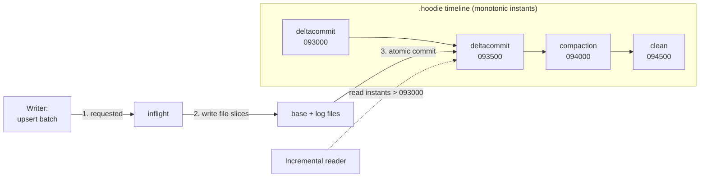
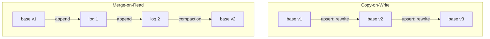

# Apache Hudi: Record-Level Upserts and Incremental Pipelines on the Lake

> Chapter from the **Data Engineering Playbook** — lakehouse.

## About This Chapter

**What this is.** Apache Hudi is the lake table format built for high-frequency, mutable workloads. This chapter covers its core machinery — file groups, the timeline, Copy-on-Write vs Merge-on-Read, the index, and the compaction/cleaning table services — and how those choices govern upsert latency and read cost.

**Who it's for.** Data engineers, data/ML engineers, platform/architecture leads, and engineers preparing for senior/staff data-engineering interviews.

**What you'll take away.** By the end you'll be able to:
- Choose CoW vs MoR and the right index (Bloom, Bucket, Record Level Index) for a given CDC/upsert workload.
- Tune compaction, cleaning, and the metadata table so a "low-latency" MoR table doesn't decay into read amplification and storage bloat.
- Run end-to-end CDC ingestion with monotonic precombine, tombstone deletes, and the three MoR query types used safely.

---

Hudi (Hadoop Upserts Deletes and Incrementals) is the table format you reach for when the table *changes a lot* and you need either low write latency or cheap incremental reads. It was built at Uber to solve a specific problem: ingesting a high-volume CDC stream into a lake and serving it within minutes, without rewriting whole partitions on every batch. If you understand that origin, every design decision in Hudi — the timeline, file groups, Merge-on-Read, the record index — falls out logically.

## TL;DR

- Hudi's core unit is the **file group**: a logical primary-key bucket inside a partition, made of a base Parquet file plus a chain of delta log files. Upserts route a record to its file group via an **index**, so a write touches only the groups holding affected keys — not the whole partition.
- **Copy-on-Write (CoW)** rewrites the base file on every commit (read-cheap, write-expensive). **Merge-on-Read (MoR)** appends row-level changes to Avro log files and merges them at read time (write-cheap, read-expensive). The choice is a latency/cost tradeoff, not a quality one.
- The **timeline** is Hudi's transaction log — an ordered set of instants (`commit`, `deltacommit`, `compaction`, `clean`, `replacecommit`) under `.hoodie/`. It provides snapshot isolation and powers **incremental queries** that return only what changed since a given instant.
- The **index** (Bloom, Simple, Bucket, or Record Level Index) is the single most important performance lever. A wrong index choice on a large table turns a 5-minute upsert into a 45-minute full-partition scan.
- MoR introduces **compaction** and **cleaning** as first-class table services. If you don't tune and monitor them, log files pile up, read amplification explodes, and your "low-latency" table becomes slow and storage-heavy.
- Hudi shines for mutable, high-frequency CDC and streaming upsert workloads. For append-mostly analytics with broad SQL-engine reach, [Iceberg](../iceberg/README.md) is usually the cleaner default.

## Why this matters in production

The canonical scenario: you have a MySQL `orders` table with 800M rows behind a payments product. Debezium streams the binlog into Kafka. Downstream, finance, fraud, and the data warehouse all need a queryable, deduplicated, point-in-time-correct copy of `orders` in S3, freshness target ~5 minutes.

Without record-level upserts you have two bad options:

1. **Full snapshot reload** — re-export 800M rows nightly. Freshness is 24h, and you burn compute rewriting rows that never changed.
2. **Append raw CDC and reconcile at query time** — every reader has to apply window functions (`ROW_NUMBER() OVER (PARTITION BY order_id ORDER BY ts DESC)`) to collapse the change stream. This pushes cost and correctness risk onto every consumer, and it's a recurring source of subtle bugs.

Hudi gives you a third option: a table that *natively understands* "this is the latest version of `order_id = X`." A late-arriving update to an order placed three months ago lands in the right file group, in the right partition, and overwrites the prior version under snapshot isolation. Readers see a clean, deduplicated table. That is the entire value proposition — and it's why Hudi pairs so naturally with CDC, which we cover in the [Kafka exactly-once chapter](../../kafka/exactly-once/README.md).

## How it works

### Physical layout

A Hudi table is a directory tree. Each partition holds one or more **file groups**, identified by a stable `fileId`. Within a file group, each successful write produces a new **file slice**: a base file (Parquet) and, for MoR, zero or more log files (Avro) keyed to the base file's commit.

```
s3://lake/orders/
├── .hoodie/                         # the timeline + metadata
│   ├── 20260618093000.deltacommit
│   ├── 20260618093500.deltacommit
│   ├── 20260618094000.compaction.requested
│   ├── hoodie.properties            # table type, key fields, payload class
│   └── metadata/                    # the metadata table (files, col stats, RLI)
├── region=us/
│   ├── f3a1...-0_20260618093000.parquet      # base file slice 1
│   └── .f3a1...-0_20260618093500.log.1_0     # delta log on top
└── region=eu/
    └── 7c92...-0_20260618093000.parquet
```

### The timeline and instants



Every state change moves through three phases written as separate files: `requested` → `inflight` → completed. Readers only ever see completed instants, which is how Hudi gives snapshot isolation without locking readers. The latest completed instant defines the table snapshot.

### Upsert path and the index

The write flow for an upsert batch:

1. **Tag** each incoming record with its location. The index answers: "does key `K` already exist, and in which `fileId`?" New keys are routed to existing under-filled file groups or new ones (bin-packing toward `hoodie.parquet.small.file.limit`).
2. **Partition** the tagged records by `fileId`.
3. **Write**:
   - CoW: read the old base file, merge the incoming records, write a new base Parquet file (a new file slice).
   - MoR: append the merged records to a log block in the file group's log file. No base rewrite.
4. **Commit** atomically by writing the completed instant to the timeline.

The merge of a new record over an existing one is governed by the **payload class** / **record merger**. The default `OverwriteWithLatestAvroPayload` keeps the record with the highest precombine value. This is your SCD logic. For deletes, a tombstone record (with `_hoodie_is_deleted = true`) flows through the same path.

### Compaction math (MoR)

Read amplification for a MoR file group is roughly proportional to the number of unmerged log blocks. If a snapshot query must merge `b` base records against `d` log records:

```
read_cost ≈ base_scan + Σ(log_block_scan) + merge(b + d)
```

Compaction rewrites `base + logs → new base`, resetting `d` to 0. The scheduling strategy decides *when*:

- `NUM_COMMITS` — compact a file group after N deltacommits (`hoodie.compact.inline.max.delta.commits`, default 5).
- `TIME_ELAPSED` / `NUM_AND_TIME` — bound by wall-clock and/or commits.
- `LOG_FILE_SIZE` — compact when accumulated log bytes cross a threshold.

The right cadence balances read latency (compact often) against compaction compute cost (compact rarely). For a 5-minute CDC pipeline, compacting every 5–10 deltacommits asynchronously is a sane starting point.

## Deep dive

### Index choice is the whole ballgame

The index decides how fast `tagLocation` runs, which dominates upsert latency on large tables. Engineers reach for the default and then wonder why upserts are slow.

| Index | How it works | Good for | Failure mode |
|---|---|---|---|
| `BLOOM` (default) | Bloom filter + key-range pruning stored in base file footers; falls back to scanning candidate files | Bursty inserts, time-ordered keys | False-positive scans on random/UUID keys → reads most files in the partition |
| `SIMPLE` | Joins incoming keys against `(key, fileId)` extracted from base files | Update-heavy batches where many files are touched anyway | Cost scales with table size; bad for small updates on huge tables |
| `BUCKET` | Hash key into fixed N buckets per partition; no lookup, pure hash | Predictable, high-throughput streaming; stable cardinality | Fixed bucket count — wrong sizing causes skew; resizing is painful |
| `RECORD_INDEX` (RLI) | Global key→location map stored in the metadata table (HFile) | Random-access updates on huge tables, global uniqueness | Metadata table write overhead; needs MDT enabled and healthy |

The trap with `BLOOM` is **non-monotonic keys**. Bloom indexing prunes by key min/max ranges per file. If your record key is a UUID or a hash, every file's range is effectively `[0, MAX]`, so range pruning does nothing and you fall back to reading candidate files across the partition. Symptom: the upsert stage shows a massive `tagLocation` join touching nearly every base file. Fix: switch to `BUCKET` or the **Record Level Index**, or make keys monotonic (e.g., prefix with a sortable timestamp).

`GLOBAL_BLOOM` / `GLOBAL_SIMPLE` enforce uniqueness across *all* partitions (needed when a key can move partitions, e.g., a status change repartitions the row). Global indexes are far more expensive — only pay for them if keys genuinely migrate.

### CoW vs MoR, concretely



The decision is workload-shaped:

- **CoW**: write amplification is high (rewrite a whole base file to change one row) but reads are a plain Parquet scan — zero merge cost, full engine compatibility (Trino, Athena, Spark all read it natively as Parquet). Pick CoW when reads vastly outnumber writes and write latency tolerance is minutes-to-hours.
- **MoR**: write amplification is low (append a small Avro block) but you pay merge cost on every snapshot read until compaction runs. Pick MoR when you need sub-5-minute write latency or your update rate would make CoW rewrite the same large files repeatedly.

A subtlety teams miss: MoR exposes **three** query types — `snapshot` (base + logs merged, freshest), `read_optimized` (base files only, stale until compaction, fast), and `incremental`. Your BI dashboards can hit the read-optimized view for speed while a freshness-critical job uses snapshot. Don't expose the wrong one and then blame Hudi for being slow or stale.

### The metadata table is not optional anymore

Modern Hudi (0.13+, and certainly 1.x) stores file listings, column stats, bloom filter indexes, and the Record Level Index in an internal **metadata table** (`.hoodie/metadata/`), itself a MoR Hudi table. This eliminates expensive S3 `LIST` operations on partitions with thousands of files — the single biggest source of "why does planning take 90 seconds" on cloud object stores. Enable it (`hoodie.metadata.enable=true`, default on in recent versions) and make sure *all* writers to the table agree, or you'll corrupt it. A common incident: a legacy job writing with metadata disabled while the main pipeline has it enabled — the listings drift and queries return wrong file sets.

### Cleaning, archival, and the "my table grew to 40TB" problem

Hudi retains old file slices for time-travel and rollback. The **cleaner** (`hoodie.clean.*`) removes slices older than the retention policy:

- `KEEP_LATEST_COMMITS` (default, keep last N=10 commits) — bounds by commit count.
- `KEEP_LATEST_FILE_VERSIONS` — bounds by versions per file group.
- `KEEP_LATEST_BY_HOURS` — bounds by wall-clock.

If cleaning is misconfigured or failing silently, storage grows unbounded and listing slows. Separately, the **timeline archiver** moves old completed instants out of the active timeline into `.hoodie/archived/` to keep timeline reads fast. Watch for: a `.hoodie` directory with tens of thousands of instant files — that's an archiver that isn't keeping up, and it slows every commit.

### Concurrency control

Hudi defaults to **single-writer** with optimistic in-process coordination. For multiple concurrent writers you must enable **Optimistic Concurrency Control** with an external lock provider:

```properties
hoodie.write.concurrency.mode=optimistic_concurrency_control
hoodie.write.lock.provider=org.apache.hudi.client.transaction.lock.DynamoDBBasedLockProvider
hoodie.write.lock.dynamodb.table=hudi_locks
```

OCC in Hudi detects conflicts at the **file-group level** at commit time: if two writers touched the same file group, the second commit fails and must retry. This is fine for partitioned writers that rarely overlap; it's a recipe for constant conflict-retries if two jobs both upsert hot partitions. The architectural answer is usually to partition writers by key range, not to crank up retries. Table services (compaction, cleaning) run as async, non-blocking writers under this model.

## Worked example

End-to-end MoR CDC ingestion with PySpark on EMR, writing to S3 with the Record Level Index and async compaction.

```python
from pyspark.sql import SparkSession

spark = (
    SparkSession.builder.appName("orders-cdc-hudi")
    # Hudi + Spark catalog wiring
    .config("spark.serializer", "org.apache.spark.serializer.KryoSerializer")
    .config("spark.sql.extensions", "org.apache.spark.sql.hudi.HoodieSparkSessionExtension")
    .config("spark.sql.catalog.spark_catalog", "org.apache.spark.sql.hudi.catalog.HoodieCatalog")
    .config("spark.sql.adaptive.enabled", "true")
    .getOrCreate()
)

# CDC batch from Kafka/Debezium: order_id (key), updated_at (precombine), op, payload...
cdc = spark.read.format("kafka")  # ... elided; landed as a DataFrame `cdc`

hudi_opts = {
    # --- identity & merge semantics ---
    "hoodie.table.name": "orders",
    "hoodie.datasource.write.recordkey.field": "order_id",
    "hoodie.datasource.write.partitionpath.field": "region",
    "hoodie.datasource.write.precombine.field": "updated_at",     # latest wins
    "hoodie.datasource.write.operation": "upsert",
    "hoodie.datasource.write.table.type": "MERGE_ON_READ",

    # --- index: random-ish keys + huge table -> RLI, not bloom ---
    "hoodie.index.type": "RECORD_INDEX",
    "hoodie.metadata.enable": "true",
    "hoodie.metadata.record.index.enable": "true",

    # --- file sizing: target 128MB base files, avoid small files ---
    "hoodie.parquet.max.file.size": str(128 * 1024 * 1024),
    "hoodie.parquet.small.file.limit": str(100 * 1024 * 1024),

    # --- async compaction every 6 deltacommits ---
    "hoodie.compact.inline": "false",
    "hoodie.compact.schedule.inline": "true",
    "hoodie.compaction.strategy":
        "org.apache.hudi.table.action.compact.strategy.LogFileSizeBasedCompactionStrategy",
    "hoodie.compact.inline.max.delta.commits": "6",

    # --- retention: keep 24h of slices for time-travel/rollback ---
    "hoodie.cleaner.policy": "KEEP_LATEST_BY_HOURS",
    "hoodie.cleaner.hours.retained": "24",

    # --- Glue / Hive sync so Athena & Trino see it ---
    "hoodie.datasource.hive_sync.enable": "true",
    "hoodie.datasource.hive_sync.mode": "glue",
    "hoodie.datasource.hive_sync.database": "lake",
    "hoodie.datasource.hive_sync.table": "orders",
    "hoodie.datasource.hive_sync.partition_fields": "region",
}

(
    cdc.write.format("hudi")
    .options(**hudi_opts)
    .mode("append")
    .save("s3://lake/orders/")
)
```

Handling deletes from the CDC stream — flag tombstones so they flow through the same merge path:

```python
from pyspark.sql import functions as F

cdc_with_deletes = cdc.withColumn(
    "_hoodie_is_deleted", F.col("op") == F.lit("d")  # Debezium delete op
)
```

Reading: the three faces of a MoR table.

```sql
-- Snapshot (freshest, merges base + logs)
SELECT order_id, status, amount
FROM lake.orders
WHERE region = 'us';

-- Read-optimized (fast, base files only, stale between compactions)
SELECT order_id, status FROM lake.orders_ro WHERE region = 'us';

-- Incremental: everything that changed after a known instant
SET hoodie.orders.consume.mode = INCREMENTAL;
SET hoodie.orders.consume.start.timestamp = 20260618093000;
SELECT order_id, status, _hoodie_commit_time FROM lake.orders;
```

Spark SQL DML works directly via the Hudi catalog:

```sql
MERGE INTO lake.orders t
USING staged_updates s
ON t.order_id = s.order_id
WHEN MATCHED AND s.op = 'd' THEN DELETE
WHEN MATCHED THEN UPDATE SET *
WHEN NOT MATCHED THEN INSERT *;
```

## Production patterns

- **Run table services asynchronously and off the write path.** Inline compaction (`hoodie.compact.inline=true`) blocks ingestion and torpedoes your freshness SLO. Schedule inline, execute async — either via a separate Spark job, the Hudi compaction CLI, or by letting the metaserver run them. The write job should do one thing: write.
- **Use Hudi Streamer (DeltaStreamer) for the ingest tier.** For Kafka→Hudi CDC, `HoodieStreamer` in continuous mode with the `DebeziumSource` and checkpointing handles offset management, schema evolution from a schema registry, and exactly-once-ish ingestion far better than a hand-rolled `foreachBatch`. Hand-roll only when you need logic Hudi Streamer can't express.
- **Size base files to ~128MB and let Hudi bin-pack.** Small files are the most common Hudi pathology on S3. `hoodie.parquet.small.file.limit` tells Hudi to top off under-filled files on insert rather than spawning thousands of tiny ones. Clustering (`replacecommit`) can re-sort and re-size cold partitions for better data skipping.
- **Enable the metadata table and column stats, then actually use data skipping.** With `hoodie.metadata.column.stats.enable=true`, predicate pushdown prunes files by min/max without listing. This is the same win that [Iceberg](../iceberg/README.md) gets from its manifest stats.
- **Pick precombine fields that are truly monotonic.** If two CDC events for the same key share an `updated_at` second, the merge is non-deterministic. Prefer a log-sequence number (binlog position, Kafka offset) as precombine, or a composite. This is where [data-quality reconciliation](../../data-quality/reconciliation/README.md) checks earn their keep — they catch silent merge losses.
- **Co-locate writers per partition under OCC.** If you must have multiple writers, shard them by partition/key range so they never contend on the same file group, instead of relying on lock-retry churn.

## Anti-patterns & failure modes

| Anti-pattern | Symptom you'd observe | Fix |
|---|---|---|
| MoR + never tuning compaction | Snapshot query latency climbs over days; log files outnumber base files 20:1; storage bloats | Set `max.delta.commits`, run async compaction, alert on log-to-base ratio per file group |
| `BLOOM` index on UUID keys | Upsert `tagLocation` stage reads ~entire partition; write time grows with table size, not batch size | Switch to `RECORD_INDEX` or `BUCKET`; or make keys sortable |
| Inline compaction on the ingest job | Periodic latency spikes every N commits; missed freshness SLO during compaction | Schedule inline, execute async in a separate job |
| Mixed writers, one with metadata table disabled | Queries return wrong/missing files; intermittent `FileNotFoundException` | Enforce uniform `hoodie.metadata.enable` across every writer; rebuild MDT if drifted |
| Cleaner disabled or failing | `.hoodie` and data dirs grow without bound; planning slows | Set a `KEEP_LATEST_*` policy; alert on table size growth and cleaner instant age |
| Too many partitions (e.g., partition by `event_id`) | Millions of tiny file groups; metadata table itself becomes huge; planning crawls | Coarsen partitioning (date/region); let file groups, not partitions, give you parallelism |
| Reading `read_optimized` and expecting freshness | "Hudi is dropping my updates" — actually reading base-only between compactions | Query the snapshot view for freshness-critical reads |
| Multi-writer without OCC + lock provider | Silent overwrites / lost commits; corrupted timeline | Enable OCC with DynamoDB/ZK lock provider, or enforce single writer |

## Decision guidance

| If you need… | Choose | Why |
|---|---|---|
| High-frequency CDC, sub-5-min freshness, mutable rows | **Hudi MoR** | Append-only writes + record index = cheap upserts at low latency |
| Mutable table but reads dominate, latency tolerance is minutes+ | **Hudi CoW** or **Iceberg CoW** | No read-time merge; Iceberg if you want broader engine reach |
| Append-mostly analytics, wide SQL-engine support, open ecosystem | **[Iceberg](../iceberg/README.md)** | Cleaner spec, hidden partitioning, strong Trino/Spark/Flink support |
| Databricks-centric stack, Spark-first | **[Delta Lake](../delta/README.md)** | Deepest Spark integration, liquid clustering, Unity Catalog |
| Streaming upserts from Flink with second-level latency | **Hudi MoR** or Paimon | Hudi has mature Flink + bucket index; Paimon is the LSM-native alternative |

Hudi's differentiator is **upsert performance at scale via the index + MoR**. If your workload isn't upsert-heavy, you're paying Hudi's operational complexity (compaction, cleaning, index tuning) for capabilities you don't use — that's when Iceberg becomes the better call. See [metadata-layers](../metadata-layers/README.md) for how all three formats relate to the catalog tier.

## Interview & architecture-review talking points

- **"Why Hudi over Iceberg here?"** Because the workload is CDC with a high update ratio and a 5-minute freshness SLO. Hudi's record index plus MoR makes per-key upserts cheap; Iceberg's merge-on-read is newer and its upsert ergonomics for streaming CDC are less mature. If it were append-mostly analytics I'd flip to Iceberg for the broader engine support and cleaner partition handling.
- **"What's the failure mode of MoR you watch for?"** Read amplification from uncompacted log files. I monitor log-file-to-base-file ratio per file group and snapshot-query p95, and I run compaction async so it never blocks ingestion. The read-optimized view is my pressure-release valve for dashboards.
- **"How do you guarantee correctness on updates?"** Record key + a monotonic precombine field (binlog LSN, not wall-clock), an `OverwriteWithLatestAvroPayload`-style merger, tombstones for deletes, and reconciliation counts against the source. Snapshot isolation via the timeline means readers never see a half-applied commit.
- **"How does this scale to multiple writers?"** OCC with a DynamoDB lock provider, conflict detection at file-group granularity, and writers sharded by partition so they don't contend. Table services run as non-blocking async writers.
- **"Where does cost come from?"** Compaction compute and write amplification. I tune compaction cadence against the freshness SLO, size base files to 128MB, and enable the metadata table to kill S3 LIST cost. See [finops](../../finops/README.md) for the full cost model.

## Further reading

- [Iceberg](../iceberg/README.md) — the append-first alternative and its hidden partitioning model
- [Delta Lake](../delta/README.md) — the Spark/Databricks-native comparison point
- [Metadata layers](../metadata-layers/README.md) — how catalog and table format responsibilities split
- [Kafka exactly-once](../../kafka/exactly-once/README.md) — the CDC ingestion side that feeds Hudi
- [Data-quality reconciliation](../../data-quality/reconciliation/README.md) — catching silent merge/dedup losses
- [Spark partitioning](../../spark-internals/partitioning/README.md) — why partition layout drives file-group parallelism
- Apache Hudi docs — Table & Query Types: https://hudi.apache.org/docs/table_types
- "Uber's Lambda-less CDC with Apache Hudi" and the original Hoodie design writeups on the Uber engineering blog
