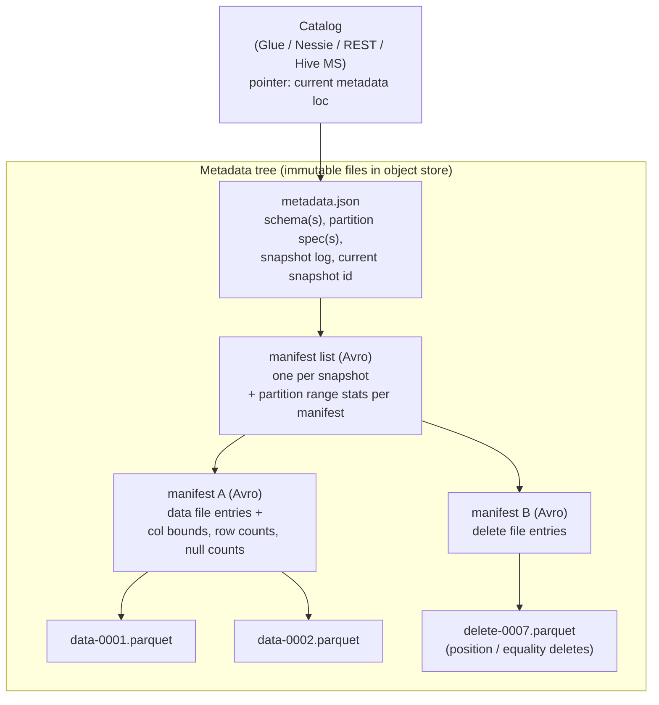

# Apache Iceberg

> Chapter from the **Data Engineering Playbook** — lakehouse.

## About This Chapter

**What this is.** Apache Iceberg is a table format: a metadata tree over immutable data files plus a catalog holding one atomic pointer. This chapter explains how that copy-on-write pointer swap gives you snapshots, hidden partitioning, schema/partition evolution, and time travel — and where it breaks at scale.

**Who it's for.** Data engineers, data/ML engineers, platform/architecture leads, and engineers preparing for senior/staff data-engineering interviews.

**What you'll take away.** By the end you'll be able to:
- Trace a commit through the metadata tree and the catalog compare-and-swap, and reason about snapshot vs serializable isolation.
- Pick copy-on-write vs merge-on-read per table and manage delete files, sort orders, and stats so pruning actually works.
- Keep planning fast by scheduling `rewrite_data_files`, `rewrite_manifests`, and `expire_snapshots`, and choose a catalog (REST/Glue/Nessie) that fits the write concurrency.

---

Iceberg is a table format, not a storage engine and not a query engine. It is a specification for a tree of metadata files sitting on top of immutable Parquet/ORC/Avro data files in object storage, plus a contract with a catalog that holds one atomic pointer: the current metadata location. Everything Iceberg gives you — serializable snapshots, schema and partition evolution without rewrites, time travel, engine portability — falls out of that one design decision. Once you internalize that the whole format is a copy-on-write pointer swap over an immutable file tree, the operational behavior stops being surprising.

## TL;DR

- Iceberg tracks data at **file granularity** in a metadata tree (`metadata.json` → manifest list → manifests → data files), so planning never lists object storage. A commit is an atomic swap of the catalog's current-metadata pointer; that swap is the entire concurrency model.
- **Hidden partitioning** stores the partition transform (`days(ts)`, `bucket(16, id)`) in metadata and computes partition values for you. Queries filter on the raw column and Iceberg derives partition pruning — no `WHERE dt = '2026-06-18'` ritual, and no partition columns physically in the data.
- **Schema and partition evolution are metadata-only.** Adding a column, renaming, reordering, or changing `days(ts)` to `hours(ts)` rewrites zero data files because columns are tracked by a stable integer **field ID**, not by name or position.
- **Two delete strategies decide your write economics:** copy-on-write (rewrite whole files on update/delete) vs merge-on-read (write position/equality delete files, merge at scan time). Pick per workload, not per table-by-default.
- **Optimistic concurrency means writers retry on conflict.** Snapshot isolation is free; serializable requires `WriteSerializable`/`Serializable` isolation and costs validation scans. High commit-rate streaming into a wide-fanout table is where this bites.
- The most common production failures are not data bugs — they are **metadata bloat** (millions of tiny manifests/snapshots) and **catalog commit contention**. Maintenance (`rewrite_data_files`, `rewrite_manifests`, `expire_snapshots`) is not optional housekeeping; it is part of the write path's SLA.

## Why this matters in production

The scenario that sells Iceberg: you run a 40 TB clickstream table on S3, partitioned by `event_date`. Analysts query last-7-days slices; a nightly Spark job appends ~2 billion rows; a GDPR pipeline issues `DELETE WHERE user_id IN (...)` a few hundred times a day for right-to-be-forgotten requests.

On plain Hive tables this is a slow-motion fire. Partition discovery means `LIST` calls against S3 prefixes — at tens of thousands of partitions, planning takes minutes and you hit S3 request throttling (503 SlowDown). There is no atomic commit, so a job that dies mid-write leaves half-written partitions that readers see immediately. A `DELETE` means reading a partition, filtering, and overwriting it — and two concurrent deletes silently clobber each other because Hive has no isolation. Changing the partition scheme means rewriting the entire table and coordinating every consumer.

Iceberg fixes each of these structurally:

- **Planning reads metadata, not S3 listings.** The manifest tree carries per-file partition values and column min/max stats, so the planner prunes files without touching object storage prefixes.
- **Every write is a snapshot.** A failed job leaves orphan data files but never advances the pointer, so readers never see partial state. Roll forward or clean up; readers are unaffected.
- **Deletes are isolated and (with MoR) cheap.** A `DELETE` writes a small delete file and commits a new snapshot. Two concurrent deletes either both succeed or one retries — never a silent overwrite.
- **The partition scheme can change tomorrow** from `days(event_ts)` to `hours(event_ts)` with no rewrite; old files keep their old spec, new files use the new one, and the planner handles the mix.

This is the difference between a table you babysit and a table that behaves like a database object. See [delta](../delta/README.md) and [hudi](../hudi/README.md) for how the other two formats make the same guarantees with different tradeoffs, and [metadata-layers](../metadata-layers/README.md) for where all three sit in the stack.

## How it works

Iceberg is a four-level metadata tree anchored by a single mutable pointer in the catalog.



**A commit, step by step:**

1. Writer reads the current `metadata.json` (it knows the base snapshot id).
2. Writer stages new data files and new manifests pointing at them.
3. Writer builds a new manifest list = surviving manifests from base + new manifests.
4. Writer writes a new `metadata.json` whose `current-snapshot-id` is the new snapshot.
5. Writer asks the catalog to **atomically swap** the pointer: "change current metadata from `v37.json` to `v38.json`, but only if it's still `v37.json`." This is a compare-and-swap.
6. If the CAS fails (someone else committed `v38` first), the writer re-reads, re-validates that its changes don't conflict, rebuilds the manifest list on top of the new base, and retries.

That CAS is the whole consistency story. Snapshot isolation is automatic: a reader resolves the current snapshot id once and reads a frozen file tree. This connects directly to [consistency-models](../../distributed-systems/consistency-models/README.md) — Iceberg gives you snapshot isolation by default and serializable isolation by paying for conflict-detection scans.

**Hidden partitioning** is a function stored in the spec:

```
partition_value = transform(source_column)
```

with transforms `identity`, `bucket[N]`, `truncate[W]`, `year`, `month`, `day`, `hour`, `void`. The data files don't store partition columns; the manifest stores the computed partition tuple per file. When you query `WHERE event_ts >= '2026-06-18'`, the planner applies the `day(event_ts)` transform to the predicate and prunes manifests and files by their partition ranges and column bounds.

**Field IDs** are the trick behind safe evolution. Every column has a permanent integer ID assigned at creation. Parquet files are read by field ID, not by name. Rename `user_id` → `account_id`? Metadata-only; the Parquet files don't change because the reader maps field ID 3 → the new name. This is why Iceberg evolution never rewrites data, and why it never has the "add column in the middle breaks positional reads" bug that plagued Hive.

## Deep dive

### Copy-on-write vs merge-on-read — the decision that defines your write cost

This is the single most consequential per-table setting and the one people get wrong.

| | Copy-on-write (CoW) | Merge-on-read (MoR) |
|---|---|---|
| Update/delete write | Rewrite every data file touching an affected row | Write a small delete file; data files untouched |
| Write latency | High (rewrite amplification) | Low |
| Read latency | Low (no merge at scan) | Higher (merge deletes at scan time) |
| Best for | Read-heavy, infrequent updates | Write-heavy, CDC, frequent small deletes |
| Set via | `write.update.mode=copy-on-write` | `write.update.mode=merge-on-read` |

Configure per operation:

```sql
ALTER TABLE clickstream SET TBLPROPERTIES (
  'write.delete.mode'='merge-on-read',
  'write.update.mode'='merge-on-read',
  'write.merge.mode'='copy-on-write'
);
```

MoR introduces two delete file flavors, and conflating them is a classic mistake:

- **Position deletes** mark `(file_path, row_position)` — "row 4172 in data-0007.parquet is gone." Cheap to write, cheap to apply, scoped to specific files.
- **Equality deletes** mark `column = value` predicates — "all rows where `user_id = 88231`." Written when the writer doesn't know physical positions (typical for Flink CDC upserts). These are expensive at read time because the engine must evaluate the predicate against every candidate row, and they accumulate fast.

The MoR failure pattern: a Flink CDC job writes equality deletes on every upsert. After a few days, scans drag because each one applies thousands of equality-delete predicates. The fix is scheduled `rewrite_data_files` compaction that *materializes* the deletes back into rewritten data files, collapsing the merge.

> **Iceberg v2 vs v3:** v2 introduced position + equality delete files. The v3 spec adds **deletion vectors** (a single binary bitmap per data file instead of many position-delete files), row lineage, and a richer type system. Deletion vectors substantially reduce small-file count on MoR tables — if your engine supports v3, prefer it for high-churn tables.

### Metadata explosion — the quiet killer

Every commit creates a new `metadata.json`, a new manifest list, and at least one new manifest. A streaming job committing every 60 seconds produces ~1,440 snapshots/day. Without maintenance:

- `metadata.json` grows because it retains the full snapshot log.
- Manifest count grows linearly; planning reads them all.
- Symptom: query *planning* (not execution) climbs from 200 ms to 30+ s; the driver spends its time in `ManifestGroup.planFiles`. You'll see it in the Spark UI as a long gap before any task launches.

Three maintenance procedures, each addressing a different layer:

```sql
-- Compact small data files into right-sized ones (and apply MoR deletes)
CALL catalog.system.rewrite_data_files(
  table => 'db.clickstream',
  strategy => 'binpack',
  options => map('target-file-size-bytes','536870912',  -- 512 MB
                 'min-input-files','5')
);

-- Coalesce many small manifests into fewer large ones
CALL catalog.system.rewrite_manifests('db.clickstream');

-- Drop old snapshots + their now-unreferenced metadata
CALL catalog.system.expire_snapshots(
  table => 'db.clickstream',
  older_than => TIMESTAMP '2026-06-11 00:00:00',
  retain_last => 100
);

-- Delete data files no failed-commit ever referenced (run sparingly, it LISTs)
CALL catalog.system.remove_orphan_files(
  table => 'db.clickstream',
  older_than => TIMESTAMP '2026-06-17 00:00:00'
);
```

Order matters: `expire_snapshots` is what actually frees storage and shrinks the snapshot log. `rewrite_data_files` without `expire_snapshots` afterward *grows* storage, because the old files stay referenced by retained snapshots until they expire.

### The catalog is your real single point of failure

The metadata tree is engine-agnostic, but the atomic pointer swap is the catalog's job, and catalogs differ on how they do it:

| Catalog | Atomicity mechanism | Multi-table txn | Notes |
|---|---|---|---|
| Hive Metastore | Table lock | No | Lock contention under concurrent writers; legacy |
| AWS Glue | Optimistic + version check | No | Default on EMR/Athena; watch commit throttling |
| Nessie | Git-style branches/commits | Yes | Branching, merging, multi-table atomic commits |
| REST catalog | Server-defined CAS | Server-defined | The portable standard; backs Polaris, Unity, Tabular |

The REST catalog spec matters because it decouples the engine from the catalog implementation — Spark, Trino, Flink, and DuckDB all speak the same HTTP protocol and the catalog server owns commit semantics centrally. If you're choosing today, default to a REST catalog unless you have a hard dependency on Glue or Nessie branching.

### Sort order, clustering, and the stats that drive pruning

Pruning quality is bounded by how well your data is clustered relative to your filters. Iceberg stores per-column lower/upper bounds per data file in the manifest. If `user_id` is scattered randomly across files, every file's `[min,max]` spans the whole key space and no file gets pruned. Declare a sort order so compaction physically clusters the data:

```sql
ALTER TABLE clickstream WRITE ORDERED BY event_ts, user_id;
```

Then `rewrite_data_files` with the `sort` strategy produces files with tight, non-overlapping bounds and pruning actually works. For high-cardinality multi-dimensional filters, use Z-order:

```sql
CALL catalog.system.rewrite_data_files(
  table => 'db.clickstream',
  strategy => 'sort',
  sort_order => 'zorder(user_id, geo_id)'
);
```

## Worked example

End-to-end: create a MoR clickstream table, evolve its partitioning, run a CDC-style merge, time-travel, and maintain — in PySpark with the Iceberg Spark runtime.

```python
from pyspark.sql import SparkSession

spark = (
    SparkSession.builder.appName("iceberg-clickstream")
    # Iceberg Spark runtime for Spark 3.5 / Scala 2.12
    .config("spark.jars.packages",
            "org.apache.iceberg:iceberg-spark-runtime-3.5_2.12:1.6.1")
    .config("spark.sql.extensions",
            "org.apache.iceberg.spark.extensions.IcebergSparkSessionExtensions")
    # REST catalog named 'prod'
    .config("spark.sql.catalog.prod", "org.apache.iceberg.spark.SparkCatalog")
    .config("spark.sql.catalog.prod.type", "rest")
    .config("spark.sql.catalog.prod.uri", "https://catalog.internal:8181")
    .config("spark.sql.catalog.prod.warehouse", "s3://lake/prod")
    .config("spark.sql.catalog.prod.io-impl", "org.apache.iceberg.aws.s3.S3FileIO")
    .getOrCreate()
)
```

```sql
-- 1. Create a merge-on-read table with hidden partitioning on day(event_ts)
CREATE TABLE prod.web.clickstream (
  event_id     STRING,
  user_id      BIGINT,
  event_ts     TIMESTAMP,
  url          STRING,
  geo_id       INT
)
USING iceberg
PARTITIONED BY (days(event_ts))          -- hidden partitioning; no dt column
TBLPROPERTIES (
  'format-version'              = '2',
  'write.delete.mode'           = 'merge-on-read',
  'write.update.mode'           = 'merge-on-read',
  'write.target-file-size-bytes'= '536870912',
  'write.metadata.delete-after-commit.enabled' = 'true',
  'write.metadata.previous-versions-max'       = '100'
);

-- 2. Evolve the partition spec to hourly without rewriting any data.
--    Old files keep day(); new files use hour(). The planner reads both.
ALTER TABLE prod.web.clickstream
  REPLACE PARTITION FIELD days(event_ts) WITH hours(event_ts);

-- 3. Declare a sort order so compaction clusters by the common filter keys
ALTER TABLE prod.web.clickstream WRITE ORDERED BY event_ts, user_id;
```

```python
# 4. CDC upsert: merge a micro-batch of late/corrected events.
#    With MoR this writes delete files + new data files, not a full rewrite.
spark.sql("""
  MERGE INTO prod.web.clickstream t
  USING staging.cdc_batch s
    ON t.event_id = s.event_id
  WHEN MATCHED AND s.op = 'D' THEN DELETE
  WHEN MATCHED AND s.op = 'U' THEN UPDATE SET *
  WHEN NOT MATCHED AND s.op IN ('I','U') THEN INSERT *
""")
```

```sql
-- 5. Time travel: read the table exactly as of a past snapshot (audit / replay)
SELECT count(*) FROM prod.web.clickstream
  FOR SYSTEM_VERSION AS OF 4859392749112;          -- snapshot id

SELECT count(*) FROM prod.web.clickstream
  FOR SYSTEM_TIME AS OF TIMESTAMP '2026-06-17 09:00:00';

-- 6. Inspect metadata via system tables (no engine listing of S3)
SELECT committed_at, snapshot_id, operation, summary
FROM prod.web.clickstream.snapshots ORDER BY committed_at DESC LIMIT 10;

SELECT partition, file_count, total_size, row_count
FROM prod.web.clickstream.partitions;

-- 7. Roll back a bad write atomically (pointer swap, no data moved)
CALL prod.system.rollback_to_snapshot('web.clickstream', 4859392749112);
```

```python
# 8. Nightly maintenance, ordered correctly
for stmt in [
    """CALL prod.system.rewrite_data_files(
         table => 'web.clickstream', strategy => 'sort',
         sort_order => 'event_ts, user_id',
         options => map('rewrite-all','false','min-input-files','5'))""",
    "CALL prod.system.rewrite_manifests('web.clickstream')",
    """CALL prod.system.expire_snapshots(
         table => 'web.clickstream', retain_last => 100,
         older_than => current_timestamp() - INTERVAL 7 DAYS)""",
]:
    spark.sql(stmt)
```

## Production patterns

- **Treat maintenance as a first-class scheduled job with its own SLO**, not a cron afterthought. A separate compaction job (Airflow DAG, EMR step, or the Tabular/Glue auto-maintenance) running `rewrite_data_files` + `expire_snapshots` keeps planning under a target (e.g. p95 planning < 2 s). Alert on `snapshots` table row count and average manifest size, not just on query latency.
- **Stream with the right commit cadence.** Flink/Spark Structured Streaming committing every few seconds is the fastest path to metadata explosion. Set checkpoint/commit interval to 1–5 minutes and let compaction handle file sizing. For Flink, set `write.upsert.enabled` and a sane `write.distribution-mode=hash` so writers don't all target the same partition.
- **Pick CoW for dimensions, MoR for facts/CDC.** A slowly-changing dimension that updates a few thousand rows nightly is fine on CoW. A 2-billion-row event table absorbing CDC needs MoR plus aggressive compaction. See [scd-types](../../data-modeling/scd-types/README.md) for how the merge logic maps onto each.
- **Use branches and tags for safe publishing (WAP).** Write to a branch (`audit`), run validations, then `fast_forward` the `main` ref only if checks pass. This gives you a write-audit-publish gate without a staging table:
  ```sql
  ALTER TABLE prod.web.clickstream CREATE BRANCH audit;
  -- write + validate against branch 'audit', then:
  CALL prod.system.fast_forward('web.clickstream', 'main', 'audit');
  ```
- **Set `write.metadata.previous-versions-max` and `delete-after-commit.enabled`** so old `metadata.json` files are pruned automatically — otherwise the metadata folder grows unbounded even with snapshot expiry.
- **Right-size target files to your engine's read parallelism.** 512 MB is a good default for Spark/Trino on S3; smaller (128 MB) only if you have many concurrent point-lookups and want finer pruning. Sub-128 MB files mean you're paying object-store request overhead per file.

## Anti-patterns & failure modes

| Anti-pattern | Symptom you observe | Fix |
|---|---|---|
| Never running `expire_snapshots` | Planning time grows weekly; metadata folder is 100s of GB; `snapshots` table has 10k+ rows | Schedule expiry retaining 7 days / 100 snapshots; enable metadata version pruning |
| Streaming commits every few seconds | Thousands of tiny data files; tasks dominated by file-open overhead; driver stuck in planning | Commit every 1–5 min; run `rewrite_data_files` binpack hourly |
| MoR with unchecked equality deletes (Flink CDC) | Scan time climbs daily even as row count is flat; delete files outnumber data files | Compaction that materializes deletes; consider position deletes / v3 deletion vectors |
| Over-partitioning (`days` + `bucket[1024]` + `geo`) | Tens of thousands of partitions, most files < 10 MB; planning slow, writes fan out badly | Coarsen the spec; evolve to fewer/larger partitions; rely on sort order + stats for pruning |
| Many concurrent writers on one table via Glue/HMS | Commits fail with `CommitFailedException` / `ValidationException`; retries storm | Reduce writer concurrency, batch writes, or move to REST/Nessie; widen retry backoff |
| Treating `remove_orphan_files` as routine cleanup | Occasionally deletes files an in-flight long commit still needs → `FileNotFoundException` on read | Run rarely, with `older_than` well beyond your longest job; never inside the write path |
| Filtering on a derived `dt` string column instead of the source timestamp | No partition pruning; full scans despite hidden partitioning | Filter on the real `event_ts`; let Iceberg apply the `day()`/`hour()` transform |
| Assuming time travel is free retention | `expire_snapshots` deletes the snapshot you wanted to audit; rollback target gone | Tag snapshots you must retain: `CREATE TAG eom_2026_05 AS OF VERSION <id>` |

## Decision guidance

**Iceberg vs the alternatives** — all three are open-ish ACID table formats; the choice is about catalog/engine ecosystem and write workload.

| Dimension | Iceberg | Delta Lake | Hudi |
|---|---|---|---|
| Engine neutrality | Strongest — Spark, Trino, Flink, Presto, Snowflake, BigQuery, DuckDB | Best inside Databricks; UniForm for others | Spark-centric; Flink supported |
| Partition evolution | Yes, metadata-only | Limited (no in-place spec change) | Limited |
| Hidden partitioning | Yes | No (physical partition columns) | No |
| CDC / streaming upserts | MoR + Flink connector | Strong on Databricks | Strongest historically (designed for it) |
| Catalog story | REST / Glue / Nessie / HMS | Unity Catalog (Databricks) | HMS / Glue |
| Pick it when | You want multi-engine portability + schema/partition evolution without lock-in | You're Databricks-first and want Photon + Unity Catalog | You need low-latency incremental upserts and Hudi's record-index |

Default recommendation: **Iceberg when the table is read by more than one engine or you anticipate partition/schema changes;** Delta when you live inside Databricks; Hudi when ingest-side incremental upsert latency is the dominant requirement. See [delta](../delta/README.md) and [hudi](../hudi/README.md) for the full treatment, and [cost-optimization](../../finops/cost-optimization/README.md) for how compaction cadence trades compute against storage and query cost.

**Within Iceberg:** CoW vs MoR per table; REST catalog unless you have a Glue/Nessie constraint; format-version 3 for high-churn MoR tables if your engine supports it.

## Interview & architecture-review talking points

- **"Why Iceberg over Hive?"** Hive tables identify data by directory layout, so planning means listing object storage and there is no atomic commit. Iceberg tracks data at file granularity in a metadata tree and commits via an atomic catalog pointer swap. You get snapshot isolation, file-level pruning from column stats, and partition evolution — none of which Hive can do without full rewrites.
- **"How does a commit stay atomic on S3, which has no atomic rename?"** Iceberg doesn't rely on storage atomicity. It relies on the catalog's compare-and-swap of a single pointer. Data and metadata files are immutable and written before the swap; the swap is the only mutation, and it's transactional in the catalog.
- **"What's your isolation level?"** Snapshot isolation by default — readers pin a snapshot id and see a frozen tree. For write-write conflicts you choose `WriteSerializable` (cheap; allows non-overlapping concurrent appends) or `Serializable` (validates that no conflicting data appeared since the base snapshot, at the cost of a scan). I'd map that to the workload rather than maxing it out blindly. (Ties to [consistency-models](../../distributed-systems/consistency-models/README.md).)
- **"Where does it break at scale?"** Not in the data path — in metadata and the catalog. Unbounded snapshot retention and per-second streaming commits blow up planning time; the catalog becomes the contention point under many concurrent writers. The mitigations are scheduled maintenance with an SLO and controlled writer concurrency.
- **"CoW vs MoR — defend your choice."** I'd point to the read/write ratio and the update cardinality. Read-heavy dimensions: CoW for clean scans. CDC-heavy facts: MoR to avoid rewrite amplification, paired with compaction that materializes delete files so read latency doesn't decay. The mistake is leaving it at default and discovering the cost in production.
- **"How do you do safe production publishing?"** Write-audit-publish on a branch ref, validate, then fast-forward `main`. No staging table, no consumer-visible partial state, and rollback is a pointer swap.

## Further reading

- [delta](../delta/README.md) — Databricks-native ACID; the closest comparison
- [hudi](../hudi/README.md) — incremental upserts and record-level indexing
- [metadata-layers](../metadata-layers/README.md) — where table formats sit in the lakehouse stack
- [scd-types](../../data-modeling/scd-types/README.md) — mapping merge logic onto CoW/MoR
- [consistency-models](../../distributed-systems/consistency-models/README.md) — snapshot vs serializable isolation
- [cost-optimization](../../finops/cost-optimization/README.md) — compaction cadence as a compute/storage/query tradeoff
- Apache Iceberg Table Spec (v2/v3): <https://iceberg.apache.org/spec/>
- Ryan Blue et al., "Iceberg: a fast table format for huge analytic datasets" — original Netflix design talk and the canonical reference for the metadata model
