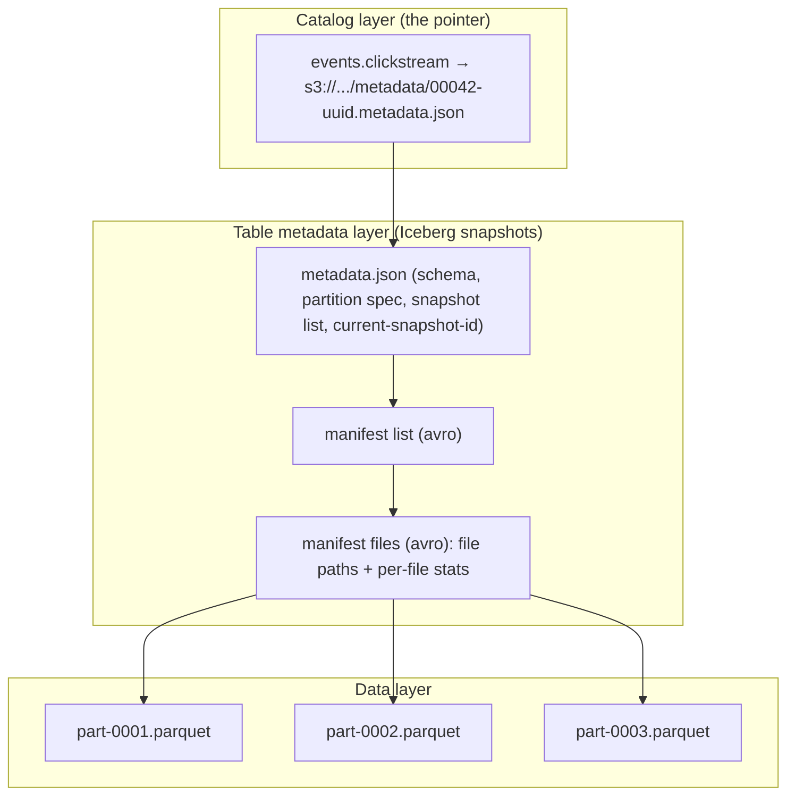

# Metadata Layers: Catalogs, Commits, and the Engine Contract

> Chapter from the **Data Engineering Playbook** — lakehouse.

## About This Chapter

**What this is.** The metadata layer is the thin tier of state — table metadata plus the catalog pointer — that turns Parquet files into a consistent table across many engines. Think of it as the address book that tells every query engine exactly which files belong to a table right now. This chapter covers the three stacked layers, why a single atomic operation called a compare-and-swap (CAS) of the current-metadata pointer is the whole correctness story, and how different catalogs implement it.

**Who it's for.** Mid-level data engineers, platform and architecture leads, engineering managers and tech leads, and engineers preparing for senior or staff data-engineering interviews.

**What you'll take away.** By the end you'll be able to:
- Distinguish the pointer registry, the table-metadata tree, and the governance surface, and reason about the optimistic-concurrency commit invariant (the rule that ensures two writers never corrupt each other's work).
- Explain why Glue and HMS (Hive Metastore) need lock workarounds and why the REST catalog (with credential vending and branch refs) became the industry's convergence point.
- Migrate catalogs via `register_table` without copying or corrupting data, and treat the catalog as a tier-0 (most critical), high-availability dependency with commit-latency SLIs (Service Level Indicators — the metrics you monitor to know if the system is healthy).

---

The metadata layer is the part of a lakehouse nobody draws on the architecture slide and everybody pages someone about at 2am. It is the thin layer of state that turns a pile of Parquet in S3 into a *table* with a name, a schema, a current version, and an answer to the question "what files do I read right now?" Get it right and a hundred engines see one consistent table. Get it wrong and you get silent data loss, phantom duplicates, and `CommitFailedException` storms that no amount of compute will fix.

## TL;DR

- A lakehouse table is **three stacked layers**: the data files (Parquet/ORC), the *table metadata* (Iceberg snapshots / Delta log / Hudi timeline), and the *catalog* (the pointer that says which metadata version is current). The catalog is the smallest layer and the one that decides correctness.
- The catalog's only hard job is the **atomic compare-and-swap (CAS) of a single pointer** — "swap current metadata from version N to N+1 only if it is still N." Everything else (search, lineage, governance) is convenience built on top of that one guarantee. Atomic means the swap either completes fully or does not happen at all — there is no in-between state.
- **Hive Metastore (HMS) and Glue cannot do that swap safely** for Iceberg without lock workarounds; that is the entire reason REST, JDBC, DynamoDB, and Nessie catalogs exist.
- The **Iceberg REST catalog spec** decouples engines from the metastore implementation: Spark, Trino, Flink, and DuckDB all speak one HTTP protocol, and the server owns the commit. This is the convergence point the industry landed on in 2023–2025.
- Migration from HMS/Glue to a transactional catalog is a **pointer-rewrite problem, not a data-copy problem** — done wrong it dual-writes and corrupts; done right it's a metadata `register_table` that touches zero data files.
- Catalog availability is now a **tier-0 dependency** (meaning: if this goes down, everything goes down). If the catalog is down, every read and write across every engine is down, regardless of how healthy S3 is.

## Why this matters in production

Picture the failure I have actually debugged. A Spark structured-streaming job writes to an Iceberg table `events.clickstream` every minute. A backfill Spark job and a Trino-based compaction job also write to it. All three resolve the table through Glue. Glue is a *non-transactional* catalog for Iceberg — it stores the pointer to the current `metadata.json` but has no native conditional-put on that pointer that Iceberg's commit protocol can rely on without the lock-table extension.

Two writers read pointer version N, both build N+1 on top of it, both write their `metadata.json`, and both update Glue's pointer. The second write wins. The first writer's snapshot — and the data files it newly added — are now **orphaned**: present in S3, referenced by a metadata file nobody points to, invisible to every reader. No exception. No alert. Just rows that silently vanished from query results. The clickstream count is off by 4% for a week and finance notices before engineering does.

The fix is not "add retries." The fix is a catalog that guarantees the commit is a true atomic CAS so the losing writer gets a `CommitFailedException`, refreshes to the *actual* current snapshot, replays its changes on top, and commits cleanly. That guarantee lives entirely in the metadata layer. The compute layer cannot manufacture it.

## How it works

Three layers, each pointing down to the next. Only the top one needs to be transactional.



The write path, abstractly, for any of the open table formats:

1. Reader resolves table name → catalog returns pointer to current metadata version `N`.
2. Writer stages new data files, builds new manifests, and writes a **new** `metadata.json` describing version `N+1`. (Metadata is immutable and append-only; you never mutate `N`.)
3. Writer asks the catalog: *set current pointer to `N+1`, but only if it is currently `N`.*
4. Catalog performs the conditional swap atomically. Success → commit visible. Failure → `CommitFailedException`, writer refreshes and retries from step 1.

The correctness of the whole lakehouse reduces to step 3 being a genuine atomic CAS. Expressed as the optimistic-concurrency invariant (the rule that all correct commits must satisfy):

```
commit(N → N+1) succeeds  ⟺  catalog.current == N at the instant of swap
```

Different catalogs implement that swap with different primitives (the underlying mechanisms they use to enforce atomicity):

| Catalog | CAS primitive | Multi-writer safe for Iceberg? |
|---|---|---|
| Hive Metastore | `ALTER TABLE` + table-level lock | Only with HMS locks enabled and supported by the backing DB |
| AWS Glue | `UpdateTable` (not conditional natively) | Needs DynamoDB lock table (`LockManager`) or Glue's newer optimistic-locking |
| JDBC catalog | DB transaction / row version on a catalog table | Yes — Postgres/MySQL row-level conditional update |
| DynamoDB catalog | `ConditionExpression` on item version | Yes — native conditional write |
| Nessie | Git-style commit on a content ref | Yes — branch HEAD CAS |
| REST catalog | Server-side; `commit` endpoint owns the CAS | Yes — server enforces |

Delta and Hudi push the same logic into their *log* and *timeline* respectively rather than relying on the catalog for the swap. Delta uses the `_delta_log` with a `LogStore` (a pluggable storage abstraction) that must provide a put-if-absent for `n.json`. On S3, this historically needed DynamoDB (`S3DynamoDBLogStore`) because raw S3 lacked atomic put-if-absent until conditional writes shipped in 2024. Same problem, same shape, different file.

## Deep dive

### The catalog is not the metadata — conflating them is the #1 mental-model bug

Engineers say "the catalog" when they mean one of three different things. It helps to keep these separate because they have very different consequences when something breaks.

The three things people actually mean are: the *pointer registry* (Glue/HMS/REST — the service that maps a table name to the current metadata file), the *table metadata tree* (snapshots/log/timeline that lives next to the data in object storage), or the *governance surface* (Unity Catalog, Polaris, Atlan, DataHub — the UI and policy layer for discovery, access control, and lineage). These have wildly different consistency, availability, and ownership properties. The pointer registry must be strongly consistent and is on the critical path of every commit. The metadata tree lives in S3 and inherits S3's consistency. The governance surface can be eventually consistent and lag minutes without breaking correctness. When you say "we're moving to Unity Catalog," be precise about whether you mean the commit authority or the discovery UI — they are not the same dependency tier.

### Glue's non-transactional commit and the DynamoDB lock table

Out of the box, `org.apache.iceberg.aws.glue.GlueCatalog` performs `UpdateTable` to swap the metadata location, but two concurrent `UpdateTable` calls can both succeed in the lost-update scenario described above. The historical mitigation is a DynamoDB lock table. This acts like a traffic light — writers must acquire the lock before touching the Glue pointer, so only one writer can be in the swap at a time:

```python
spark.conf.set("spark.sql.catalog.prod", "org.apache.iceberg.spark.SparkCatalog")
spark.conf.set("spark.sql.catalog.prod.catalog-impl", "org.apache.iceberg.aws.glue.GlueCatalog")
spark.conf.set("spark.sql.catalog.prod.lock-impl", "org.apache.iceberg.aws.dynamodb.DynamoDbLockManager")
spark.conf.set("spark.sql.catalog.prod.lock.table", "iceberg_glue_commit_locks")
```

The lock table serializes (makes sequential) the read-modify-write of the Glue pointer so only one writer can be in the swap at a time. The cost: a hot DynamoDB partition (a single heavily-used shard) under high write concurrency, lock-acquisition latency on the commit critical path, and stale locks that need a TTL (time-to-live) sweep when a writer dies mid-commit holding the lock. If you see commits hanging for exactly the lock-TTL duration, that is a dead writer's abandoned lock, not a Glue outage.

### Why REST won

The REST catalog spec (`org.apache.iceberg.rest.RESTCatalog`) moved the commit logic *server-side*. The engine no longer needs the Glue lock table, the DynamoDB credentials, or even knowledge of which backing store the server uses. The client sends a `TableCommit` with `requirements` (assertions like "assert-current-snapshot-id = X") and `updates`; the server validates the requirements against current state and applies the updates atomically or returns `409 Conflict`. This is the same optimistic-concurrency CAS, but the assertion is explicit in the protocol:

```
POST /v1/namespaces/events/tables/clickstream
{
  "requirements": [
    {"type": "assert-ref-snapshot-id", "ref": "main", "snapshot-id": 7281937401234567890}
  ],
  "updates": [
    {"action": "add-snapshot", "snapshot": { ... }},
    {"action": "set-snapshot-ref", "ref-name": "main", "snapshot-id": 7491238740987654321}
  ]
}
```

If `assert-ref-snapshot-id` fails (meaning another writer already moved the pointer), you get `409` and retry. Apache Polaris, Unity Catalog (in its Iceberg-REST mode), Tabular/Databricks-managed services, Gravitino, and Lakekeeper all implement this surface. The practical win at principal scale: you stop maintaining N catalog integrations for N engines. One protocol, one commit authority, vendor-portable.

### Credential vending and the security boundary

A REST catalog can also vend (issue on demand) **scoped, short-lived storage credentials** alongside the table metadata response (`config` → `s3.access-key-id` etc., or STS-style — STS is AWS's token service for temporary credentials). This is a genuine architectural shift: engines no longer need standing S3 access to the warehouse bucket — they ask the catalog for table X, and the catalog hands back metadata *plus* a credential scoped to exactly the prefixes that table occupies. The catalog becomes the authorization choke point. This is also a new failure mode: a misconfigured credential-vending policy can hand a read-only consumer write creds, or expire creds mid-job causing `403` halfway through a long shuffle. Pin the credential TTL (how long the credential stays valid) well above your longest task, not your longest job.

### Snapshot pointers, branches, and tags

Modern Iceberg metadata is not a single pointer — it is a set of named refs (`main`, plus arbitrary branches and tags) each pointing to a snapshot ID, with independent retention. This is git-for-tables and it changes catalog semantics: a commit targets a *ref* (a named pointer, like a branch), the CAS assertion is per-ref, and WAP (write-audit-publish — a pattern where you write data to a staging area, audit it for quality, then publish it) becomes a first-class flow — write to a `staging` branch, run quality checks, then fast-forward `main`. The catalog has to expose ref-level commit endpoints for this to work, which is exactly why the Glue-with-lock approach feels increasingly legacy: it was built for the single-pointer world.

### Eventual consistency between catalog and object store

The catalog says version N+1 is current. The `metadata.json` for N+1 lives in S3. On the very rare read-after-write lag, a reader can resolve the pointer, fetch the metadata path, and 404 because the metadata write hasn't propagated yet. S3 has been strongly read-after-write consistent for new objects since December 2020, so this is mostly a non-issue today — but on MinIO, Ceph, or some on-prem object storage gateways it absolutely still bites. The symptom is intermittent `NotFoundException` on freshly committed tables that disappears on retry. The fix is a consistent object store, not catalog retries.

## Worked example

End-to-end with Spark 3.5 + Iceberg 1.5, pointing the same logical table at a REST catalog, and demonstrating the conflict path explicitly.

```python
# spark-defaults: a REST catalog with credential vending
configs = {
    "spark.sql.extensions":
        "org.apache.iceberg.spark.extensions.IcebergSparkSessionExtensions",
    "spark.sql.catalog.prod": "org.apache.iceberg.spark.SparkCatalog",
    "spark.sql.catalog.prod.type": "rest",
    "spark.sql.catalog.prod.uri": "https://catalog.internal.example.com",
    "spark.sql.catalog.prod.warehouse": "s3://lakehouse-prod/warehouse",
    # the REST server vends scoped creds; engine has no standing S3 keys
    "spark.sql.catalog.prod.header.X-Iceberg-Access-Delegation": "vended-credentials",
    "spark.sql.catalog.prod.io-impl": "org.apache.iceberg.aws.s3.S3FileIO",
}
```

```sql
-- DDL goes through the catalog; the table metadata lands in S3,
-- the pointer lands in the REST server.
CREATE TABLE prod.events.clickstream (
    event_id   STRING,
    user_id    STRING,
    url        STRING,
    ts         TIMESTAMP
)
USING iceberg
PARTITIONED BY (days(ts))
TBLPROPERTIES (
    'write.target-file-size-bytes' = '134217728',   -- 128 MB
    'write.metadata.delete-after-commit.enabled' = 'true',
    'write.metadata.previous-versions-max' = '20',
    'commit.retry.num-retries' = '4',
    'commit.retry.min-wait-ms' = '100'
);
```

Now the concurrency contract, made observable. Two writers, optimistic commit, exponential backoff handled by Iceberg:

```python
from pyspark.sql import SparkSession
from py4j.protocol import Py4JJavaError

spark = SparkSession.builder.getOrCreate()

def append_with_retry(df, table, max_app_retries=3):
    """commit.retry.* handles the metadata-level CAS retry.
    This outer loop handles the rarer case where the whole
    optimistic-concurrency window is exhausted."""
    for attempt in range(max_app_retries):
        try:
            df.writeTo(table).append()   # builds N+1, asserts current==N, swaps
            return
        except Py4JJavaError as e:
            msg = str(e.java_exception)
            if "CommitFailedException" in msg and attempt < max_app_retries - 1:
                # someone else committed; our snapshot is stale.
                # Iceberg already retried at commit.retry.num-retries;
                # we re-derive from the now-current snapshot and try again.
                spark.catalog.refreshTable(table)
                continue
            raise
```

Inspect the metadata layer directly — this is what you read during an incident, not the data:

```sql
-- which snapshot is current, and what was the lineage of commits?
SELECT committed_at, snapshot_id, parent_id, operation,
       summary['added-records'] AS added,
       summary['deleted-records'] AS deleted
FROM prod.events.clickstream.snapshots
ORDER BY committed_at DESC
LIMIT 10;

-- detect the orphaned-file scenario from "Why this matters":
-- files in storage but not referenced by the current snapshot tree.
-- (run remove_orphan_files in dry-run first; never blind-delete.)
CALL prod.system.remove_orphan_files(
    table => 'events.clickstream',
    older_than => TIMESTAMP '2026-06-17 00:00:00',
    dry_run => true
);
```

And the migration that should *not* copy data — registering an existing HMS table into the REST catalog by pointing at its current `metadata.json`:

```sql
-- zero data movement; this rewrites the pointer only.
CALL prod.system.register_table(
    table => 'events.clickstream',
    metadata_file => 's3://lakehouse-prod/warehouse/events/clickstream/metadata/00231-uuid.metadata.json'
);
```

## Production patterns

- **One commit authority per table, enforced, not assumed.** Pick the transactional catalog and route *every* writer through it. The orphaned-snapshot bug is always a second writer that bypassed the authority — a `df.write.parquet()` straight to the table prefix, a legacy Glue path that skipped the lock table. Block direct-path writes with bucket policy.
- **WAP with branches for anything finance or compliance reads.** Write to a `staging` ref, run data-quality checks against the branch, fast-forward `main` only on green. The catalog ref model makes this atomic; a stage-then-overwrite pattern does not.
- **Tune metadata retention or drown in `metadata.json` files.** `write.metadata.previous-versions-max` and `write.metadata.delete-after-commit.enabled` keep the per-table metadata directory from accumulating tens of thousands of tiny JSON/Avro files that slow every `refreshTable` and inflate catalog listing latency. A streaming table committing every minute generates 1,440 metadata versions a day.
- **Expire snapshots on a schedule, separately from compaction.** `expire_snapshots` is what actually unlinks old data files for deletion; without it, time-travel retention quietly pins terabytes. Run it in a dedicated maintenance job with a retention window that satisfies your time-travel SLA, not as a side effect of writes.
- **Monitor commit latency and conflict rate as first-class SLIs.** p99 commit latency and `CommitFailedException` rate per table tell you when write concurrency is exceeding what the catalog's CAS can absorb. A rising conflict rate is the early signal that you need to fan writes into per-partition branches or reduce writer count.
- **Treat the catalog endpoint as tier-0 and run it HA (highly available).** Multi-AZ (across multiple availability zones), health-checked, with a tested failover. When the REST catalog is down, your entire lakehouse is down for both reads and writes even though S3 is fine.

## Anti-patterns & failure modes

| Anti-pattern | Symptom you observe | Fix |
|---|---|---|
| Multiple writers through non-transactional Glue, no lock table | Row counts silently drift; orphan files in storage; no exceptions | Enable DynamoDB `LockManager` or migrate to REST/JDBC catalog |
| Mixing engines on different catalog impls for the same table | Trino sees a stale snapshot Spark just superseded; reads disagree | Single catalog of record; never point two catalogs at one table |
| Never expiring snapshots | Storage cost climbs linearly forever; `expire_snapshots` later takes hours | Scheduled `expire_snapshots` with a defined retention window |
| Never deleting old metadata files | `refreshTable` slows; thousands of tiny files; catalog listing latency up | Set `previous-versions-max` + `delete-after-commit.enabled` |
| `register_table` into a new catalog while old writers still active | Dual commit authority → lost updates and divergence | Freeze writers, cut over atomically, then resume on new catalog only |
| Credential-vending TTL shorter than longest task | `403` mid-job after a long stage; job fails near completion | Set TTL above longest task duration with margin |
| Treating Unity/Polaris discovery lag as a correctness bug | "The table exists but search can't find it" panic | Discovery is eventually consistent; correctness lives in the commit pointer |
| Blind `remove_orphan_files` without dry-run | Deletes files a concurrent in-flight commit was about to reference | Always `dry_run => true` first; respect `older_than` safety window |

## Decision guidance

| You have / want | Use | Why |
|---|---|---|
| AWS-native, single-writer or low write concurrency | Glue (+ lock table if any concurrency) | Lowest ops; acceptable if you control writers |
| Multiple engines (Spark + Trino + Flink + DuckDB) | **REST catalog** (Polaris / Unity-REST / Lakekeeper) | One protocol, server-owned commit, vendor-portable |
| Strong RDBMS already in stack, few engines | JDBC catalog (Postgres) | Native row-version CAS; simple; no extra service |
| Git-style branching, multi-table cross-commit | Nessie | Branches/tags/merge as first-class; multi-table atomicity |
| Databricks-centric org | Unity Catalog | Governance + lineage + commit in one; Iceberg-REST for interop |
| Pure single-node analytics | DuckDB + local/REST | Skip heavy metastore entirely |

Cross-format note: this chapter is catalog-centric and applies across formats, but the commit-layer details differ — see [iceberg](../iceberg/README.md) for the snapshot/manifest model, [delta](../delta/README.md) for the `_delta_log` + `LogStore` model, and [hudi](../hudi/README.md) for the timeline-based commit model.

## Interview & architecture-review talking points

- "What's the smallest unit of correctness in your lakehouse?" — The atomic compare-and-swap of the current-metadata pointer. Everything else degrades gracefully; that one operation cannot. I'd describe the optimistic-concurrency invariant and show the `assert-ref-snapshot-id` mechanism.
- "Why did you move off Glue?" — Not for features. Because Glue's pointer swap isn't natively conditional for the Iceberg commit protocol, so multi-writer concurrency required a DynamoDB lock table that put a hot partition and lock-TTL latency on the commit critical path. REST moves the CAS server-side and removes that.
- "How do you migrate without downtime or data movement?" — `register_table` rewrites the pointer; zero data files touched. The hard part is the *cutover discipline*: freeze all writers, register, resume on exactly one catalog. The danger is dual commit authority, not the data.
- "What's your tier-0 dependency list?" — The catalog endpoint sits next to object storage and IAM. I run it multi-AZ with tested failover and alert on p99 commit latency and conflict rate per table.
- "How do you guarantee a bad write never reaches finance?" — WAP on a `staging` branch with quality gates, fast-forward `main` only on green. The catalog's ref model makes the publish atomic.
- "Where's the security boundary?" — Increasingly the catalog itself, via scoped credential vending. Engines hold no standing warehouse-bucket access; they get table-scoped, short-lived creds with the metadata response.

## Further reading

- [iceberg](../iceberg/README.md) — snapshot, manifest, and partition-spec internals the catalog points into
- [delta](../delta/README.md) — the `_delta_log` and `LogStore` put-if-absent commit model
- [hudi](../hudi/README.md) — timeline-based commits and the metadata table
- [data-quality](../../data-quality/README.md) — the gates that run inside a WAP branch flow
- [observability/metrics](../../observability/metrics/README.md) and [observability/lineage](../../observability/lineage/README.md) — commit-latency SLIs and catalog-driven lineage
