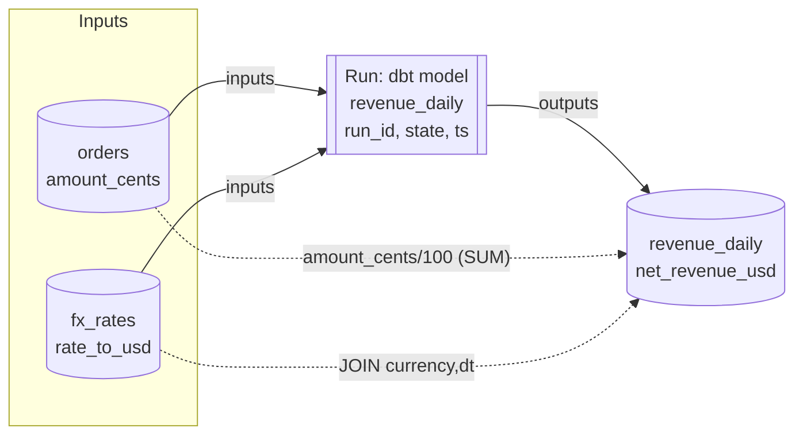

# Data Lineage

> Chapter from the **Data Engineering Playbook** — observability.

Lineage is the graph that answers two questions every incident eventually forces you to answer: *"What feeds this number?"* and *"If I change this, what breaks?"* Everything else in this chapter is implementation detail in service of those two queries.

## TL;DR

- Lineage is a directed graph of **datasets (nodes)** and **runs (edges)**. The useful resolution is **column-level** with **transformation context** — table-to-table lineage tells you *that* `revenue_daily` depends on `orders`, but not *that* it depends on `orders.amount_cents` via a `SUM(...) / 100`. The second form is what survives a 3am page.
- Capture lineage **at the point of execution**, not by re-parsing SQL out of band. A Spark plan, a dbt manifest, or an Airflow task that ran tells you what *actually* happened; a SQL file in git tells you what someone *intended* two deploys ago.
- **[OpenLineage](https://openlineage.io/)** is the de-facto wire format. Standardize on it as your event schema even if you never adopt Marquez or DataHub — it decouples *producers* (Spark, dbt, Airflow) from *consumers* (catalog, impact analysis, alerting).
- Lineage that is not *queried* is decoration. The value is realized in three workflows: **impact analysis** (pre-deploy blast radius), **root-cause traversal** (incident upstream walk), and **freshness/quality propagation** (a stale parent should taint children).
- The hard part is not building the graph; it is keeping it **current, complete, and trustworthy** across SQL, PySpark, Kafka, external loads, and the inevitable `boto3` script someone runs from a laptop.
- Column-level lineage from logical plans degrades through `UDF`, `explode`, `pivot`, and dynamic schema — know where your coverage drops to table-level and label it, rather than pretending the graph is complete.

## Why this matters in production

A concrete Tuesday. The `finance.revenue_daily` table is reported wrong in a board deck — a metric is ~4% low for the prior 3 days. You have maybe 30 minutes before the question escalates.

Without lineage, the investigation is archaeology: grep the warehouse for jobs writing `revenue_daily`, find a 600-line dbt model, read the CTEs, guess which of 11 upstream tables drifted, and repeat one level up. With ~40 people committing to the warehouse, this is a half-day of work and a Slack thread with six engineers.

With **column-level lineage**, the query is mechanical:

```
revenue_daily.net_revenue_usd
  ← orders_enriched.amount_usd        (SUM)
      ← orders.amount_cents           (amount_cents / 100.0)
      ← fx_rates.rate_to_usd          (JOIN on currency, dt)   ← changed yesterday
```

You discover `fx_rates` had a late-arriving partition for 3 days, the join produced `NULL` rates, and `COALESCE(rate, 0)` silently zeroed those rows. Time to root cause: minutes, because the graph told you *which* of the 11 parents touches the broken column and *how*.

The same graph powers the inverse query before you ever ship. An engineer wants to rename `orders.amount_cents` to `orders.gross_amount_cents`. Impact analysis returns 23 downstream columns across 9 tables and 2 Looker dashboards. That list *is* the migration plan and the review checklist. Without it, the rename ships, and you find the 23 dependents one incident at a time.

This is why lineage belongs under **observability**, not "documentation." It is the topology layer that makes [monitoring](../monitoring/README.md) alerts actionable and [freshness](../../data-quality/freshness/README.md) SLAs propagatable.

## How it works

The core model is small. Three entity types, two relationships:



- **Dataset**: a namespaced, addressable thing — `s3://lake/iceberg/finance.orders`, `kafka://prod/orders.v2`, `snowflake://acct/db/schema/orders`. Namespacing is load-bearing; the same logical table in two clusters must not collide or falsely merge.
- **Job / Run**: a *job* is the recurring definition (`dbt:revenue_daily`); a *run* is one execution with a `runId`, `eventType` (START/RUNNING/COMPLETE/FAIL/ABORT), and timestamps. Edges attach to runs so the graph is *temporal* — you can ask "what was lineage on 2026-06-15?" not just "what is it now."
- **Edge**: input/output facets connecting datasets to a run. Column-level lineage rides as a `columnLineage` facet mapping each output field to its `inputFields` plus a `transformation` description.

### The OpenLineage event

Producers emit JSON events to an HTTP endpoint (or Kafka topic). A COMPLETE event for one run:

```json
{
  "eventType": "COMPLETE",
  "eventTime": "2026-06-18T04:12:33Z",
  "run": { "runId": "a3f1...-9c" },
  "job": { "namespace": "dbt", "name": "finance.revenue_daily" },
  "inputs": [
    { "namespace": "iceberg://lake", "name": "finance.orders" },
    { "namespace": "iceberg://lake", "name": "ref.fx_rates" }
  ],
  "outputs": [{
    "namespace": "iceberg://lake",
    "name": "finance.revenue_daily",
    "facets": {
      "columnLineage": { "fields": {
        "net_revenue_usd": {
          "inputFields": [
            {"namespace":"iceberg://lake","name":"finance.orders","field":"amount_cents"},
            {"namespace":"iceberg://lake","name":"ref.fx_rates","field":"rate_to_usd"}
          ],
          "transformationDescription": "SUM(amount_cents/100.0 * rate_to_usd)",
          "transformationType": "AGGREGATION"
        }
      }}
    }
  }]
}
```

The consumer (Marquez, DataHub, or your own service) does an upsert: merge datasets by `(namespace, name)`, append the run, and rewrite the column-edge set for that output. **The graph is the materialized view over the event stream** — which means it is exactly as good as your event coverage.

### Where column-level edges come from

You do not write these by hand. They are extracted from the **logical plan** the engine already built:

| Source | Extraction mechanism | Resolution |
|---|---|---|
| Spark SQL / DataFrame | `openlineage-spark` listener on `QueryExecution`, walks the `LogicalPlan` | Column-level (degrades on UDF) |
| dbt | `dbt run` → `manifest.json` + `catalog.json`, parsed by `openlineage-dbt` | Column-level (from compiled SQL via sqlparser) |
| Airflow | Task-level `extractors` per operator | Job/dataset-level; SQL operators get column-level |
| Raw SQL warehouse (Snowflake/BQ) | Parse `QUERY_HISTORY` / `INFORMATION_SCHEMA` access logs | Column-level if the parser resolves `SELECT *` |
| Kafka → sink | Connector config + schema registry subject refs | Topic-to-table, field-level via Avro/Protobuf schema |

The Spark path is the highest-fidelity because it reads the *optimized* plan after Catalyst resolves `*`, pushes filters, and rewrites expressions — see [Catalyst](../../spark-internals/catalyst/README.md). You get the real column projection, not the source text.

## Deep dive

This is where lineage projects go wrong, so it gets the most space.

### 1. Column lineage from logical plans — and exactly where it breaks

The `openlineage-spark` integration registers a `SparkListener` and inspects `QueryExecution.optimizedPlan`. For each `LogicalPlan` node it tracks how output `AttributeReference`s map back to input attributes. A `Project(SUM(a/100) AS net)` cleanly attributes `net → a`. Coverage stays clean through `Project`, `Aggregate`, `Join`, `Filter`, `Union`, `Window`.

It degrades — and you must *know* it degrades — at:

- **Scala/Python UDFs**: the planner sees an opaque `ScalaUDF(inputs...)`. You get `output ← {all inputs}` with no transformation semantics. A UDF that only reads one of three input columns will over-report.
- **`explode` / `posexplode` / `flatten`**: array-to-row fan-out; the lineage is real (child ← array column) but row-count semantics are lost, which matters for downstream quality propagation.
- **`pivot`**: output columns are *data-dependent* (values become column names). The plan can't enumerate them at compile time, so you fall back to table-level for the pivoted block.
- **`from_json` / schema inference on `string`**: if a column is parsed at runtime, the static plan has no child fields. Pin an explicit `schema` so the planner materializes the struct.
- **Dynamic SQL / `spark.sql(f"...{var}...")`**: the string is resolved at runtime; lineage is captured per-run (good) but you cannot do *static* pre-deploy impact analysis on it.

**Principle**: label each edge with its confidence (`column` / `table` / `udf-coarse`). A graph that admits "this block is table-level only" is more trustworthy than one that silently over-connects and trains people to ignore it.

### 2. Logical plan lineage vs. parsing SQL files

A common shortcut is a CI job that parses `.sql`/`.py` files with a static parser and builds lineage from source. It is cheap and it is wrong in three ways:

1. **Intent ≠ execution.** The file says `SELECT *`. The runtime resolved 47 columns, then someone added column 48 upstream. Static parse can't know.
2. **No temporality.** A file-based graph is "current main." It can't answer "what was the lineage of the run that produced *yesterday's* bad partition?" — which is the exact question incidents ask.
3. **It misses the gaps.** The `boto3` backfill script, the manual `COPY INTO`, the one-off notebook — none are in your dbt project, so they're invisible. Run-based capture sees them *if* you instrument the runtime.

Use static parsing only as a *pre-merge* preview ("here's the likely blast radius of this PR"). The source of truth is emitted from runs.

### 3. Completeness: the dark-edge problem

Your lineage graph is a *lower bound* on real dependencies. Every uninstrumented producer is a **dark edge** — a real data dependency invisible to the graph. The danger is not that dark edges exist; it's that the graph *looks* complete, so people trust the impact analysis and ship the rename, and the uninstrumented Python loader breaks silently.

Mitigations that actually work:

- **Reconcile against access logs.** Snowflake `ACCESS_HISTORY` / BigQuery `INFORMATION_SCHEMA.JOBS` record every read/write. Periodically diff "datasets touched per writer" against your lineage edges. A writer in the logs but not the graph is a dark edge — alert on it.
- **Make the producer the gate.** Instrument at the *platform* layer (the shared Spark image, the dbt wrapper, the Airflow plugin) so new pipelines emit lineage by default. If lineage is opt-in per team, coverage asymptotes to ~60% and stays there. This is a [golden-path](../../platform-engineering/golden-paths/README.md) decision.
- **Track a coverage SLI.** "% of warehouse write-bytes covered by a lineage edge in the last 24h." Put it on a dashboard. Coverage you don't measure rots.

### 4. Identity and namespace normalization

The silent killer of lineage graphs is **node identity**. `s3://lake/orders`, `s3a://lake/orders/`, `iceberg://lake/db.orders`, and `glue://...orders` can all refer to the same table emitted by four producers. If you don't canonicalize, the graph fragments into disconnected islands and traversal returns half the truth.

Build a **naming resolver** in the consumer: a deterministic function `(rawNamespace, rawName) → canonicalDatasetId` that strips schemes, normalizes trailing slashes, resolves Glue/metastore aliases to the physical Iceberg table, and maps temp/staging views to their final target. This resolver is the single most important piece of infrastructure in a lineage system and the one most often skipped. See [Iceberg](../../lakehouse/iceberg/README.md) and [metadata layers](../../lakehouse/metadata-layers/README.md) for why catalog identity is non-trivial.

### 5. Streaming lineage

Kafka complicates the model because a topic is a *continuous* dataset, not a partition you wrote once. Two practical stances:

- **Topology-level**: emit lineage from the connector/stream definition — `orders.v2 → flink:enrich → orders_enriched`. This is static, captured at deploy, field-level via the schema registry subject. Good enough for impact analysis.
- **Per-microbatch**: a Structured Streaming job emits an OpenLineage run *per trigger*, with offsets as the "partition" facet. High volume; only worth it if you need to correlate a specific bad batch to its offset range. Tie this to [offsets](../../kafka/offsets/README.md) and [event design](../../kafka/event-design/README.md) — the schema subject is your column-level source for streaming.

## Worked example

End-to-end: a Spark job that emits OpenLineage automatically, plus the impact-analysis query you run against the resulting graph.

### Instrumenting Spark (zero application code changes)

```python
# spark-submit \
#   --packages io.openlineage:openlineage-spark_2.12:1.18.0 \
#   --conf spark.extraListeners=io.openlineage.spark.agent.OpenLineageSparkListener \
#   --conf spark.openlineage.transport.type=http \
#   --conf spark.openlineage.transport.url=http://marquez:5000 \
#   --conf spark.openlineage.namespace=prod-warehouse

from pyspark.sql import SparkSession, functions as F

spark = SparkSession.builder.appName("revenue_daily").getOrCreate()

orders = spark.read.table("lake.finance.orders")          # amount_cents, currency, dt
fx     = spark.read.table("lake.ref.fx_rates")            # currency, dt, rate_to_usd

revenue = (
    orders.join(fx, on=["currency", "dt"], how="left")
          .withColumn("rate", F.coalesce("rate_to_usd", F.lit(0.0)))  # the silent bug
          .withColumn("amount_usd", (F.col("amount_cents") / 100.0) * F.col("rate"))
          .groupBy("dt")
          .agg(F.sum("amount_usd").alias("net_revenue_usd"))
)

revenue.writeTo("lake.finance.revenue_daily").overwritePartitions()
# Listener fires on the write: emits START + COMPLETE with column lineage
# net_revenue_usd <- {orders.amount_cents, fx_rates.rate_to_usd}, type=AGGREGATION
```

No `emit_lineage()` calls in the business logic. The listener reads the plan. That property — lineage as a *side effect* of running, not a thing engineers remember to do — is the whole game.

### Querying the graph for impact analysis

Marquez stores the graph in Postgres; you can also load it into a graph DB. Downstream blast radius for a column, in recursive SQL:

```sql
-- "What depends on orders.amount_cents, transitively?"
WITH RECURSIVE downstream AS (
    SELECT output_dataset, output_field, input_dataset, input_field, 1 AS depth
    FROM   column_lineage_edge
    WHERE  input_dataset = 'lake.finance.orders'
      AND  input_field   = 'amount_cents'

    UNION ALL

    SELECT e.output_dataset, e.output_field, e.input_dataset, e.input_field, d.depth + 1
    FROM   column_lineage_edge e
    JOIN   downstream d
      ON   e.input_dataset = d.output_dataset
     AND   e.input_field   = d.output_field
    WHERE  d.depth < 10                        -- guard against cycles
)
SELECT DISTINCT output_dataset, output_field, MIN(depth) AS hops
FROM   downstream
GROUP  BY output_dataset, output_field
ORDER  BY hops;
```

Wire that into CI: a PR that alters a column runs this query against the *current* graph and posts the dependent list as a check. The reviewer now sees the blast radius before approving.

### Closing the freshness loop

Lineage edges let a stale parent **taint** children. When `fx_rates` misses its SLA, walk the graph and mark every downstream dataset `freshness=at_risk` until it re-derives. This is how a single missed upstream partition becomes a *targeted* page ("3 downstream tables at risk") instead of a blanket "everything is maybe stale." See [freshness](../../data-quality/freshness/README.md).

## Production patterns

- **Instrument at the platform image, not per pipeline.** Bake the OpenLineage listener/wrapper into the shared Spark base image, the dbt invocation wrapper, and the Airflow plugin. Coverage becomes the default; teams opt *out*, not in.
- **Canonical dataset ID resolver as a first-class service.** One deterministic function, unit-tested, owned by the platform team. Every consumer routes through it. This prevents graph fragmentation more than any other single thing.
- **Persist runs, not just current state.** Keep the temporal graph (run-versioned edges) for at least your incident-investigation window (90+ days). "What was lineage when the bad partition was written?" is unanswerable without it.
- **Reconcile against access logs nightly.** Diff warehouse `ACCESS_HISTORY` writers against lineage producers; alert on dark edges. This is your coverage truth, not the producer's self-report.
- **Expose lineage where engineers already are.** A link from the table page, a `dbt docs` panel, a CI comment. A separate "lineage portal" nobody logs into is a graph nobody queries.
- **Attach quality + freshness facets to the same nodes.** Lineage is the topology; layer the [data-quality](../../data-quality/accuracy/README.md) and [metrics](../metrics/README.md) signals on it so one graph answers "what, how fresh, how correct, and what's downstream."

## Anti-patterns & failure modes

| Anti-pattern | Symptom you'd observe | Fix |
|---|---|---|
| Parsing SQL files instead of capturing runs | Lineage looks right but misses the `boto3` loader; impact analysis says "0 dependents" then prod breaks | Capture from runtime (Spark plan, dbt manifest); use static parse only as PR preview |
| No namespace canonicalization | Graph is a set of disconnected islands; traversal stops at scheme boundaries (`s3://` vs `s3a://`) | Deterministic resolver to a canonical dataset ID; merge metastore aliases to physical table |
| Trusting a graph with unmeasured coverage | `revenue_daily` has a parent nobody knew about; rename ships, breaks silently | Coverage SLI + nightly access-log reconciliation; label dark edges |
| Treating UDF/`pivot` output as full column lineage | Over-connected edges; engineers learn the impact list is "always huge," start ignoring it | Confidence labels per edge (`column`/`table`/`udf-coarse`); surface the degraded blocks honestly |
| Building the graph but never querying it | Beautiful lineage UI, zero incidents resolved faster | Wire into CI (impact check) + incident runbook (upstream walk) + freshness propagation |
| Lineage stored only as "current" | Can't investigate yesterday's bad run; the edge that mattered was overwritten | Run-versioned, temporal edges retained for the investigation window |
| Emitting per-microbatch lineage for every stream | Event store overwhelmed; consumer lags; lineage itself becomes the incident | Topology-level lineage for streams; per-batch only where offset correlation is required |

## Decision guidance

**Granularity:**

| Need | Use | Don't bother with |
|---|---|---|
| Impact analysis, root-cause on metrics | Column-level | — |
| Compliance "where does PII flow" | Column-level + tag propagation | Table-level (insufficient for field-level audit) |
| Capacity / cost attribution by pipeline | Job/dataset-level | Column-level (overkill) |
| Streaming topology overview | Topology-level | Per-microbatch |

**Build vs. buy the consumer:**

| Option | When it fits | Watch out for |
|---|---|---|
| **Marquez** (OpenLineage reference) | You want the cleanest OL model, Postgres-backed, lightweight | Thinner catalog/search; you build UI integrations |
| **DataHub** | You want lineage + catalog + governance + discovery in one | Heavier to operate; ingestion connectors vary in column-level fidelity |
| **OpenMetadata** | Catalog-first org, want lineage bundled | Column-level depends on connector maturity |
| **Roll your own consumer** | You have a graph DB + strong identity needs and OL events already flowing | You will rebuild traversal, UI, and identity — only worth it at real scale |

The non-negotiable: **standardize producers on OpenLineage** regardless of consumer. It keeps the consumer swappable.

## Interview & architecture-review talking points

- "Lineage is an **observability** signal, not documentation. I capture it from the runtime — Spark logical plans, dbt manifests — because the file in git is intent and the run is truth."
- "I standardize the *wire format* on OpenLineage so producers and consumers are decoupled. We can swap Marquez for DataHub without re-instrumenting 200 pipelines."
- "I measure a **coverage SLI** and reconcile against warehouse access logs nightly. A lineage graph you don't measure the completeness of is a liability — it gives false confidence to impact analysis."
- "Column-level lineage degrades through UDFs and pivots. I **label edge confidence** rather than over-report, because an impact list people don't trust is worse than no list."
- "The two queries that justify the whole system are *downstream blast radius* (wired into CI before merge) and *upstream root cause* (wired into the incident runbook). If neither is automated, lineage is decoration."
- "Identity is the hard part. A canonical dataset-ID resolver — owned, tested, single — is what keeps the graph connected across `s3://`, Glue, and Iceberg catalog names."

## Further reading

- [Monitoring](../monitoring/README.md) — lineage makes monitoring alerts actionable by giving them topology.
- [Metrics](../metrics/README.md) and [Logging](../logging/README.md) — the other observability signals layered on the same nodes.
- [Freshness](../../data-quality/freshness/README.md) and [Reconciliation](../../data-quality/reconciliation/README.md) — propagate staleness and validate parity along edges.
- [Catalyst](../../spark-internals/catalyst/README.md) — why optimized logical plans are the best column-lineage source.
- [Iceberg](../../lakehouse/iceberg/README.md) / [Metadata layers](../../lakehouse/metadata-layers/README.md) — catalog identity, the root of node canonicalization.
- [Golden paths](../../platform-engineering/golden-paths/README.md) — why platform-level instrumentation beats per-team opt-in.
- External: [OpenLineage spec](https://openlineage.io/docs/spec/object-model) and [Marquez data model](https://marquezproject.ai/docs/) — the reference object model and a working consumer.
