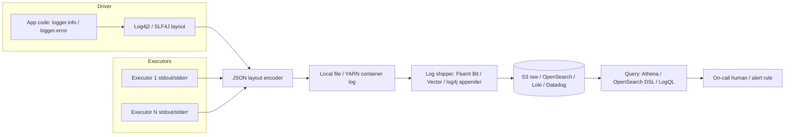

# Logging for Data Pipelines

> Chapter from the **Data Engineering Playbook** — observability.

## About This Chapter

**What this is.** Logging for data pipelines, where the signal lives on ephemeral executors (short-lived worker processes that run your Spark tasks and then disappear) and failures are often silent quality regressions (the job finishes without an error but the data is wrong) rather than thrown exceptions. This chapter covers structured logging, correlation IDs (a single identifier that links every log entry across all systems in one run), executor-log capture, volume and cost control, and PII redaction.

**Who it's for.** Mid-level data engineers, senior/staff data engineers, data/ML engineers, platform/architecture leads, and engineers preparing for senior/staff data-engineering interviews.

**What you'll take away.** By the end you'll be able to:
- Emit structured JSON logs with a stable schema and propagate one correlation ID from the orchestrator (e.g., Airflow) through Spark, Kafka, and the table commit.
- Capture ephemeral executor logs and aggregate at the partition boundary so logging doesn't create a volume explosion or a serialization error.
- Use counted `WARN` events to surface silent row drops, redact PII (personally identifiable information) at the logging layer, and choose hot/cold storage backends deliberately.

---

Logging in data engineering is not the same as logging in a web application. A web service emits one log line per request and you index all of them. A Spark job emits 40,000 log lines per task across 2,000 tasks on 200 executors, and 99.9% of them are noise — until the one minute they're the only thing standing between you and a 6-hour backfill. This chapter is about logging that survives that asymmetry: how to make logs that are cheap when nothing is wrong and decisive when something is.

## TL;DR

- **Structured JSON logs with a stable schema** beat free-text. You query logs more than you read them; `WHERE job_run_id = ... AND level = 'ERROR'` only works if `job_run_id` is a field, not buried inside a sentence.
- **Propagate one correlation ID end-to-end** — Airflow `run_id` → Spark `applicationId` → Kafka message header → output table commit. Without it, "why is this row wrong?" becomes archaeology across five systems.
- **Executor logs are the hard part.** Driver logs (from the coordinator process) are easy and small; the truth about data lives in executor stdout/stderr (the raw output streams of each worker process), which is ephemeral, sharded across nodes, and gone when the cluster scales in. Ship them before the node dies.
- **Logging is a cost center at scale.** Per-record `logger.info` inside a `mapPartitions` is how you turn a 2 TB job into a 40 GB log bill and a serialized-logger `NotSerializableException` (a crash caused by trying to send a non-transmittable object across the network).
- **Logs, metrics, and traces are different tools.** Don't compute aggregates by searching through logs; that belongs in metrics. Logs answer "what happened to *this* thing," not "how often does X happen."
- **PII in logs is a breach waiting for an audit.** Redact at the logging layer, not in a downstream scrubber you'll forget to run.

## Why this matters in production

3:14 AM. The `customer_revenue_daily` table is 40 minutes late and the Airflow task shows `success`. The downstream finance dashboard is stale, an exec noticed, and you're paged.

The DAG (directed acyclic graph — your pipeline workflow) says success. The Spark History Server says the job ran in 22 minutes. CloudWatch says the EMR cluster terminated cleanly. Everything is green and the data is wrong.

What actually happened: a malformed upstream Avro file (a binary data format commonly used in data pipelines) caused a `from_json` to return `null` for 8% of rows, a `WHERE col IS NOT NULL` filter silently dropped them, and the job "succeeded" with 8% fewer rows. No exception was thrown. The only evidence that ever existed was an executor `WARN` line — `Corrupt record in partition s3://.../dt=2026-06-17/part-00131.avro` — emitted once per bad partition, on an executor that was reclaimed by autoscaling 18 minutes ago. The log is gone.

This is the defining property of data-pipeline logging: **the signal is at the executor, the executor is ephemeral, and the failure is often a silent quality regression rather than a thrown exception.** A logging strategy that only captures the driver and only captures exceptions would have told you nothing. The job that emits a structured `data_quality.rows_dropped` event with `run_id`, `partition`, and `count` — shipped off-node before the executor dies — turns that 4-hour incident into a 4-minute one.

## How it works

A pipeline log event travels through more hops than an app log event, and each hop can drop or mangle it. The model:



Three layers matter:

1. **Emission.** A logging facade (a common interface for logging, like SLF4J in JVM or Python's `logging` module) hands a record to a backend (such as Log4j2 or `structlog`). The backend applies a *layout* — a template that decides whether logs come out as plain text or JSON, and which fields (timestamp, level, logger name, thread, MDC context) get attached.

2. **Collection.** On Spark, driver logs go to the launching process; executor logs go to per-container files (YARN `container_*/stdout`, or local directories on Kubernetes/standalone mode). A shipper (a background process that watches log files and forwards them) tails these and sends them to your log store. The critical, often-missed fact: **on autoscaled clusters, executor log files are deleted when the node terminates** unless you've configured log aggregation (`yarn.log-aggregation-enable=true`, or `spark.kubernetes.executor.deleteOnTermination=false` plus a sidecar shipper, or EMR's S3 log push).

3. **Storage and query.** Hot, searchable storage (OpenSearch/Loki/Datadog) is expensive; cold object storage (S3 + Athena/Glue) is cheap but slow. The standard split is hot for the last 7–14 days, cold (S3, partitioned by `dt`) for longer retention.

### The MDC / context-propagation mechanism

Structured logging hinges on a **Mapped Diagnostic Context** (MDC): a thread-local key-value map (a dictionary tied to the current thread of execution) that the layout automatically merges into every log line. You set `MDC.put("run_id", runId)` once and every subsequent `logger.info` on that thread carries it. The trap in Spark: MDC is *thread-local*, meaning each thread only sees values set on that same thread. Your code runs on executor threads that never saw the driver's MDC. You must propagate context into the closure (the function you send to executors) explicitly — capture it in a variable and log it as a field. The driver's MDC does not magically follow a task to an executor.

### Log volume math

For capacity and cost, the back-of-envelope is:

```
events/run  = tasks × events_per_task
bytes/run   = events/run × avg_event_bytes
$/month     = (bytes/run × runs/day × 30 × retention_factor) × $/GB_ingest
```

A 2,000-task job logging 5 structured events per task at 400 bytes is `2000 × 5 × 400 = 4 MB/run` — trivial. The same job with one `logger.info(row)` inside a `foreach` over 2 billion rows is `2e9 × ~300 = 600 GB/run`. At Datadog's ingest pricing that single bad line is a five-figure monthly mistake. **Where you log (per-record vs. per-partition vs. per-stage) dominates everything else.**

## Deep dive

### Levels mean something — enforce it

The single most common failure is teams treating `INFO`/`WARN`/`ERROR` as vibes. Codify them:

| Level | Meaning in a pipeline | Paged? | Sampled? |
|-------|----------------------|--------|----------|
| `ERROR` | Run failed or will produce wrong output; needs a human | Yes | Never |
| `WARN` | Degraded but survivable — corrupt records skipped, fallback taken, retry succeeded | No (alert on rate) | Never |
| `INFO` | Lifecycle milestones — stage start/end, row counts, config resolved | No | Maybe at high volume |
| `DEBUG` | Per-partition / per-batch detail, plans, schemas | No | Off in prod |

The discipline that pays off: **`WARN` is for things you're choosing to tolerate, and every `WARN` must carry a count.** `WARN skipped corrupt records` is useless. `WARN data_quality.corrupt_records count=14213 partition=dt=2026-06-17` is an SLO (service-level objective — a threshold your pipeline must stay within) breach you can alert on. This is the bridge to data quality: tolerated-but-counted events are your early-warning system for silent regressions.

### Driver vs. executor logging — the asymmetry

```python
# Driver: runs once, logs are small and reliably captured. Log freely here.
logger.info("stage_start", extra={"stage": "enrich", "input_rows": df.count()})

# Executor: runs on every partition, across the cluster. A naive log here = volume bomb.
def enrich(rows):
    for r in rows:
        logger.info(f"processing {r.id}")   # 600 GB of logs. Never do this.
        yield transform(r)
```

The right executor-side pattern is to **aggregate within the partition and emit once**. A partition is one chunk of data assigned to one executor — aggregate the counts for that chunk, then emit a single log line:

```python
def enrich(partition_index, rows):
    bad = 0
    out = []
    for r in rows:
        try:
            out.append(transform(r))
        except ValueError:
            bad += 1
    if bad:
        # One structured line per partition, not per row.
        logging.getLogger("dq").warning(
            "corrupt_records", extra={"partition": partition_index, "count": bad}
        )
    return out
```

A second executor trap: **logger serialization.** In Scala/Java, a `private val logger = LoggerFactory.getLogger(...)` referenced inside a closure tries to serialize (convert to bytes for network transmission) the enclosing object, which causes `org.apache.spark.SparkException: Task not serializable` or a `NotSerializableException`. Fix: make the logger `@transient lazy val` (telling Spark not to serialize it, and to re-create it on the executor instead), or fetch it inside the closure. In PySpark, never capture a `logging.Logger` object in a closure; call `logging.getLogger(name)` *inside* the executor function.

### Spark/Kafka/Iceberg context worth logging — and where to get it

The IDs that make correlation possible are scattered across runtimes:

| Field | Source | Why |
|-------|--------|-----|
| `run_id` | Airflow `{{ run_id }}` / your orchestrator | The one ID that ties the whole DAG run together |
| `spark_app_id` | `spark.sparkContext.applicationId` | Joins logs to Spark History Server & metrics |
| `stage_id` / `task_id` | `TaskContext.get()` | Pinpoints the executor work unit |
| `kafka_topic/partition/offset` | `ConsumerRecord` headers | Replays exactly the events involved |
| `iceberg_snapshot_id` | `table.currentSnapshot().snapshotId()` | Ties the output commit to the producing run |
| `input_files` | `df.inputFiles()` (sample) | The blast radius of a bad source partition |

Stamp `run_id` into the Iceberg commit as well (`df.writeTo(t).option("snapshot-property.run-id", run_id)`), so lineage tooling can walk from a wrong row to the snapshot, to the run, to the logs — without guessing.

### Log4j2 JSON, the EMR/Spark-specific way

Text logs force you to use a regex (a pattern-matching expression) like `2026-06-18 03:14:02 WARN dq corrupt_records...`, which breaks the moment someone changes the layout. JSON makes every field queryable without parsing. The Spark-correct way is a `log4j2.properties` file (Spark 3.3+ defaults to Log4j2) with a JSON layout:

```properties
# log4j2.properties — pass with: --files log4j2.properties \
#   --conf spark.driver.extraJavaOptions=-Dlog4j2.configurationFile=log4j2.properties \
#   --conf spark.executor.extraJavaOptions=-Dlog4j2.configurationFile=log4j2.properties
rootLogger.level = info
rootLogger.appenderRef.stdout.ref = jsonAppender

appender.json.type = Console
appender.json.name = jsonAppender
appender.json.layout.type = JsonTemplateLayout
appender.json.layout.eventTemplateUri = classpath:EcsLayout.json   # ECS schema → plays nice with OpenSearch

# Quiet the framework noise that drowns your signal
logger.spark.name = org.apache.spark
logger.spark.level = warn
logger.hadoop.name = org.apache.hadoop
logger.hadoop.level = warn
logger.s3.name = com.amazonaws
logger.s3.level = error
```

Cutting `org.apache.spark` and `org.apache.hadoop` from `INFO` to `WARN` alone routinely removes 80–95% of executor log volume — the `BlockManager`, `MemoryStore`, and `MapOutputTracker` chatter (internal Spark framework messages about memory management and shuffle coordination) that nobody queries.

## Worked example

End-to-end: structured logging in a PySpark job with full correlation context, partition-level data quality aggregation, and redaction. Runnable shape on EMR/Glue/Databricks.

```python
import json, logging, hashlib, os
from pyspark.sql import SparkSession
from pyspark import TaskContext

# --- 1. JSON formatter for the Python-side (driver) logger ---
class JsonFormatter(logging.Formatter):
    def format(self, record):
        base = {
            "ts": self.formatTime(record, "%Y-%m-%dT%H:%M:%S%z"),
            "level": record.levelname,
            "logger": record.name,
            "msg": record.getMessage(),
        }
        # merge structured fields passed via extra={"ctx": {...}}
        if hasattr(record, "ctx"):
            base.update(record.ctx)
        return json.dumps(base)

def get_logger(name, ctx):
    lg = logging.getLogger(name)
    if not lg.handlers:
        h = logging.StreamHandler()
        h.setFormatter(JsonFormatter())
        lg.addHandler(h)
        lg.setLevel(logging.INFO)
    return logging.LoggerAdapter(lg, {"ctx": ctx})

# --- 2. Resolve correlation context once, at the driver ---
spark = SparkSession.builder.getOrCreate()
RUN_ID = os.environ.get("AIRFLOW_RUN_ID", "manual")
CTX = {"run_id": RUN_ID, "spark_app_id": spark.sparkContext.applicationId}
log = get_logger("pipeline", CTX)

log.info("stage_start", extra={"ctx": {**CTX, "stage": "enrich"}})

# --- 3. Redaction helper: hash PII, never log it raw ---
def redact_email(e):
    if not e:
        return None
    return "sha256:" + hashlib.sha256(e.encode()).hexdigest()[:16]

# --- 4. Executor-side: aggregate per partition, emit ONE structured line ---
def enrich_partition(idx, rows):
    import logging, json
    tc = TaskContext.get()
    bad, total = 0, 0
    out = []
    for r in rows:
        total += 1
        try:
            d = r.asDict()
            d["email"] = redact_email(d.get("email"))
            if d.get("amount") is None:
                raise ValueError("null amount")
            out.append(d)
        except ValueError:
            bad += 1
    if bad:
        # Logger fetched INSIDE the closure -> no serialization, runs on executor JVM's python worker
        rec = {"level": "WARN", "logger": "dq", "msg": "corrupt_records",
               "run_id": RUN_ID, "partition": idx,
               "stage_id": tc.stageId(), "count": bad, "total": total}
        print(json.dumps(rec))   # goes to executor stdout -> shipped to S3/OpenSearch
    return iter(out)

rdd = spark.read.parquet("s3://lake/raw/txns/dt=2026-06-17/") \
    .rdd.mapPartitionsWithIndex(enrich_partition)

result = spark.createDataFrame(rdd)
n = result.count()
log.info("stage_end", extra={"ctx": {**CTX, "stage": "enrich", "output_rows": n}})

# --- 5. Stamp run_id into the Iceberg commit for lineage correlation ---
result.writeTo("glue_catalog.analytics.txns_enriched") \
    .option("snapshot-property.run-id", RUN_ID) \
    .append()
```

Querying it later in Athena over the shipped S3 JSON logs:

```sql
-- Did any partition silently drop records on the late run?
SELECT run_id,
       SUM(count)            AS rows_dropped,
       SUM(total)            AS rows_seen,
       ROUND(100.0*SUM(count)/SUM(total), 2) AS drop_pct
FROM pipeline_logs
WHERE logger = 'dq'
  AND msg    = 'corrupt_records'
  AND run_id = 'scheduled__2026-06-17T07:00:00+00:00'
GROUP BY run_id;
-- run_id  rows_dropped  rows_seen  drop_pct
-- ...     1,420,113     17,800,000   7.98     <- there's your "successful" job
```

That `drop_pct` is the line that would have ended the 3 AM incident in minutes.

## Production patterns

- **One correlation ID, set at the orchestrator, threaded everywhere.** The Airflow `run_id` becomes the Spark app name (`--name {{ run_id }}`), an env var read by the job, a field in every structured log, a Kafka header on emitted events, and a snapshot property on the output table. Build it once into your job-submission wrapper so engineers can't forget it.
- **Aggregate at the partition boundary.** The unit of executor logging is the partition, not the row. Count, then emit one line. This single rule prevents nearly every log-volume incident.
- **Ship executor logs off-node before scale-in.** On EMR set `s3://.../logs` log push; on Spark-on-Kubernetes run Fluent Bit or Vector as a sidecar (a helper container that runs alongside your main container) or DaemonSet; on YARN enable log aggregation. Verify by intentionally killing an executor and confirming its logs survived.
- **Two-tier retention.** Hot store (OpenSearch/Datadog/Loki) for 7–14 days for active debugging; cold S3 partitioned by `dt`, queryable via Athena, for the 90-day to 7-year compliance tail. Set OpenSearch ILM (Index Lifecycle Management — a policy that automatically moves or deletes old data) or Datadog retention explicitly — defaults are expensive.
- **Sample `INFO`, never sample `WARN`/`ERROR`.** High-volume lifecycle logs can be sampled (for example, 1-in-N micro-batches in Structured Streaming). Anything signaling degradation or failure is always kept.
- **Log the resolved config, once, at startup.** `spark.sql.shuffle.partitions`, `spark.sql.adaptive.enabled`, input paths, and the git SHA of the job. Half of "why did this run behave differently?" is answered by diffing two startup config blobs.
- **Emit a machine-readable run summary as the last log line.** A single `run_summary` JSON event (rows in/out, duration, dropped count, output snapshot id) gives monitoring and metrics a clean hook without parsing the whole stream.

## Anti-patterns & failure modes

| Anti-pattern | Symptom you'd observe | Fix |
|---|---|---|
| `logger.info` per record inside a map/foreach | Log bill 100×; executors slow on stdout flush; storage backend throttles ingest | Aggregate per partition, emit once |
| Capturing a logger in a Spark closure | `Task not serializable` / `NotSerializableException` at job submit | `@transient lazy val` (Scala) or `getLogger()` inside the function (Python) |
| Free-text logs (`f"dropped {n} rows for {date}"`) | Can't `GROUP BY`; every alert is a brittle regex that breaks on a wording change | Structured JSON with stable field names |
| No correlation ID | "Which Spark run produced this wrong row?" takes hours across 5 UIs | Propagate `run_id` orchestrator → Spark → Kafka → table commit |
| Relying on default executor log retention on autoscaled clusters | Logs vanish when the node scales in; the one WARN you needed is gone | Enable log aggregation / S3 push / sidecar shipper before scale-in |
| `try/except: pass` swallowing errors silently | Job "succeeds," row count quietly drops, no log at all | Always count and `WARN` the swallowed cases |
| Logging PII (emails, SSNs, tokens) raw | GDPR/PCI finding in audit; logs become a regulated data store | Redact/hash at the logging layer (see `redact_email` above) |
| Computing metrics by grep-ing logs | Slow, expensive, drifts from reality; alerts lag by minutes | Emit real metrics; logs are for the single-entity story |
| Logging at `DEBUG` in prod | Volume explosion, S3 cost, History Server pages slow to load | `WARN` baseline for frameworks; `INFO` for your code; `DEBUG` behind a flag |

A subtle streaming-specific failure: in Spark Structured Streaming, a `logger.info` in `foreachBatch` (a callback that runs once per micro-batch) fires once per micro-batch — fine at a 1-minute trigger, catastrophic at a 100 ms trigger. Tie streaming log verbosity to the trigger interval, or sample by `batchId % N == 0`.

## Decision guidance

**Logs vs. metrics vs. traces** — pick by the question:

| You're asking… | Use | Why |
|---|---|---|
| "What happened to *this* row / file / message?" | **Logs** | High-cardinality, per-entity, keyed by `run_id`/`offset` |
| "How often / how much / how fast, over time?" | **Metrics** | Cheap aggregates, alertable, low cardinality |
| "Where did the latency / data go across services?" | **Traces / lineage** | Causal path across hops |

**Storage backend:**

| Backend | Best for | Watch out for |
|---|---|---|
| S3 + Athena/Glue | Cheap long retention, compliance, ad-hoc forensics | Query latency (seconds–minutes); partition by `dt` |
| OpenSearch / Elastic | Fast interactive search, dashboards | Cost and cluster ops scale with hot data volume |
| Grafana Loki | Label-indexed logs alongside Prometheus metrics | Full-text search weaker than OpenSearch |
| Datadog / Splunk | Turnkey, correlated with APM (application performance monitoring) | Ingest-based pricing punishes volume mistakes hard |

Default for a data platform: **structured JSON → ship to both a 7–14 day hot store and partitioned S3 cold storage.** Build the dual-write into the shipper, not the application.

## Interview & architecture-review talking points

- "Application logging assumes one event per request; data logging has to handle the executor fan-out where the signal is on ephemeral nodes. My logging design starts from *where does the truth live and how long until it's deleted*, not from log levels."
- "I treat `WARN` as a contract: anything we choose to tolerate — corrupt records, fallbacks, retries — must be counted and emitted as a structured event, because that count is our earliest signal of silent data-quality regression. A green DAG with 8% fewer rows is the failure mode logging exists to catch."
- "The expensive mistakes in data logging are about *placement and volume*, not format. Per-record logging inside a partition turns a 4 MB-per-run job into a 600 GB one. I review for log emission inside hot loops the same way I review for collect-to-driver."
- "Correlation is the whole game. One `run_id` from the orchestrator stamped through Spark, Kafka headers, and the Iceberg snapshot property means I can go from a wrong number on a dashboard to the exact executor WARN and the exact source partition without leaving one query interface."
- "Logs, metrics, and traces are not interchangeable. I push back hard on alerting off log greps — that's a metric wearing a costume, and it'll lag and drift."
- "PII redaction is a logging-layer responsibility. If raw emails reach the log store, the log store is now in scope for GDPR/PCI, and that's a far bigger problem than a missing field."

## Further reading

- Metrics — when the question is "how often / how much," not "what happened to this one thing."
- Monitoring & alerting — turning `ERROR` rates and `run_summary` events into pages that matter.
- Lineage — walking from a wrong row → Iceberg snapshot → run → the logs that explain it.
- Data quality: completeness — the silent-row-drop failure class that `WARN`-with-counts surfaces.
- Iceberg — snapshot properties as the join key between commits and logs.
