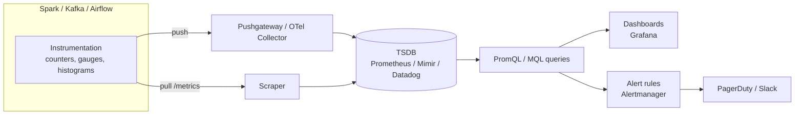

# Metrics for Data Platforms

> Chapter from the **Data Engineering Playbook** — observability.

## TL;DR

- A metric is a **numeric measurement plus a label set, sampled over time** — not a log line, not an event. The label set (the cardinality) is what makes or breaks your cost and query latency, far more than the raw sample rate.
- Pick the right **instrument type per signal**: counters for monotonic totals (rows read, bytes shuffled), gauges for point-in-time levels (queue depth, lag), histograms for distributions (stage runtime, file size). Mixing these up is the most common instrumentation bug.
- Aggregate over time with **percentiles, not averages**. A pipeline whose mean runtime is 6 minutes can still blow a 15-minute SLA on the p99 batch that lands on month-end. Averages hide the batches that page you.
- The four data-platform signals worth instrumenting first are **freshness, volume, distribution, and cost-per-run** — these catch most silent data incidents before a consumer files a ticket.
- **Cardinality is a budget.** `user_id` as a metric label will detonate your TSDB; partition date, table name, and job name will not. Treat every label dimension as a deliberate spend.
- Metrics tell you *that* something is wrong and *how bad*; [logging](../logging/README.md) tells you *why*, and [lineage](../lineage/README.md) tells you *what is downstream*. Metrics are the entry point of every investigation, not the whole investigation.

## Why this matters in production

Picture the Iceberg-backed `fct_payments` table that feeds finance dashboards and a fraud model. The Spark job runs hourly on EMR, reads from a Kafka-sourced bronze layer, MERGEs into silver, and rewrites the gold aggregate.

One Tuesday, an upstream service starts emitting `amount` in cents instead of dollars for a subset of merchants. The job **succeeds**. Airflow is green. No exception is thrown. The row count is normal. But the daily revenue gold table is now 40% high for the affected segment.

You find out 26 hours later when a finance analyst flags a number in a board deck.

The job-level health check (did the DAG run?) told you nothing, because the failure was semantic, not operational. What would have caught it:

- A **distribution metric** — `p50(amount)` per merchant segment — that drifted 100x and tripped a band check.
- A **volume metric** — rows-written per partition — that was flat, ruling out a backfill explosion and pointing at a value bug not a row bug.
- A **freshness metric** — max event-time landed vs wall clock — that was healthy, telling you the lateness was not the issue.

Metrics are how you compress the state of a pipeline into a handful of numbers you can alert on, trend, and put on a wall. The alternative — humans eyeballing dashboards or waiting for downstream complaints — does not survive contact with 200 tables and 12 on-call engineers.

## How it works

A metric pipeline has four stages: **instrument → collect → store → query/alert**. The model that matters most is the *time series*: a unique combination of metric name and label set, evolving as a stream of `(timestamp, value)` samples.



A single time series is identified by its full label set. These are **two different series**:

```
spark_stage_duration_seconds{job="fct_payments", stage="merge", env="prod"}
spark_stage_duration_seconds{job="fct_payments", stage="merge", env="staging"}
```

The number of unique series is your **active cardinality**, and it is the dominant cost driver. Roughly:

```
series_count = metric_count × Π(distinct_values_per_label)
```

A metric with labels `{job(50), stage(8), env(3)}` is 1,200 series — fine. Add `partition_date` with a 90-day retention (90 values) and you are at 108,000 series for one metric. Add `user_id` (millions) and you have built a denial-of-service against your own TSDB.

### Instrument types

| Type | Semantics | Example | Aggregation |
|------|-----------|---------|-------------|
| **Counter** | Monotonic, resets to 0 on restart | `rows_written_total` | `rate()` / `increase()` over a window |
| **Gauge** | Arbitrary up/down value at a point in time | `kafka_consumer_lag` | `max`/`avg`/`min` over series |
| **Histogram** | Pre-bucketed distribution + sum + count | `stage_duration_seconds` | `histogram_quantile()` for p50/p95/p99 |
| **Summary** | Client-side computed quantiles | legacy; avoid for distributed agg | cannot re-aggregate across instances |

The critical subtlety: **summaries compute quantiles on each instance and cannot be merged**. If you run 200 Spark executors each emitting a p99 summary, there is no mathematically valid way to combine them into a fleet p99. Histograms store buckets, which *are* additive, so `histogram_quantile(0.99, sum(rate(bucket[5m])) by (le))` is correct across instances. This is why histograms win for anything distributed.

### Percentiles over averages

For SLA work, compute percentiles from histogram buckets:

```promql
histogram_quantile(
  0.99,
  sum(rate(spark_stage_duration_seconds_bucket{job="fct_payments"}[10m])) by (le)
)
```

The accuracy of that p99 is bounded by your bucket boundaries (`le`, "less than or equal"). If your buckets jump 60s → 300s and the true p99 is 200s, the quantile estimate is interpolated within that bucket and can be off by tens of seconds. Choose bucket edges around your SLA threshold, not on a uniform linear scale.

## Deep dive

This is where the engineering judgment lives.

### Cardinality control is the whole game

The number one production incident with metrics is not "we don't have the data" — it is "our TSDB fell over because someone shipped a high-cardinality label." Concrete failure: an engineer adds `query_id` (a UUID) as a label to `spark_query_duration`. Every query is now a new series that lives forever in the head block. Prometheus head memory grows unbounded, ingestion latency spikes, and eventually the WAL replay on restart takes 40 minutes.

Rules that hold up:

- **Bounded label values only.** A label is safe if you can name its full domain: env (3), region (4), job (~hundreds), stage (~tens). It is unsafe if the domain is open-ended: ids, emails, file paths, SQL text, error messages.
- **High-cardinality dimensions belong in logs or traces**, keyed for correlation. Put `query_id` in a structured log line with the same `job` and `trace_id` labels, and join at investigation time — see [logging](../logging/README.md).
- **Pre-aggregate at the source** when you only need a distribution. Don't emit one series per partition; emit a histogram of per-partition row counts.

### Counter resets and `rate()`

Counters reset to zero on process restart. Naively diffing a counter (`value_now - value_then`) goes negative on restart and produces a nonsense spike or a giant negative. PromQL's `rate()` and `increase()` are reset-aware: they detect the drop and treat it as a counter reset, adding the pre-reset value. This is why you **never alert on a raw counter** — always on `rate()`/`increase()`. A common bug is computing throughput in application code by subtracting two snapshots; do the math in the query layer where reset handling is free.

### Push vs pull for batch jobs

Prometheus is pull-based: it scrapes a `/metrics` endpoint on an interval. That model assumes a **long-lived process**. A Spark batch job that runs for 4 minutes and exits will likely never be scraped — the scrape interval (15-60s) may miss it entirely, and the process is gone before the next scrape lands.

Options, with the trade I actually make:

| Approach | Fits | Gotcha |
|----------|------|--------|
| **Pushgateway** | Short batch jobs | Last-pushed value sticks forever; you must `DELETE` on job completion or it lies about a dead job |
| **OTel Collector (push)** | Mixed batch + streaming | Adds an agent hop; correct for ephemeral workloads |
| **StatsD + agent** | Legacy / simple counters | Aggregation semantics weaker than histograms |
| **Direct remote_write** | High-volume executors | Bypasses scrape; needs auth + backpressure handling |

For EMR/Spark batch, I push job-completion metrics (rows, duration, cost) to a Pushgateway grouped by `{job, run_date}`, and **explicitly delete the group at the end of a successful run** so a stale gauge doesn't masquerade as the current state. For Structured Streaming, the process is long-lived, so a pull endpoint backed by `StreamingQueryListener` works.

### The RED and USE method, translated to data

The web-service framings (RED: Rate/Errors/Duration; USE: Utilization/Saturation/Errors) map cleanly onto pipelines:

- **Rate** → records/sec ingested, partitions processed/hour.
- **Errors** → DLQ writes, schema-validation rejects, MERGE conflicts. See [Kafka DLQ](../../kafka/dlq/README.md).
- **Duration** → stage and job runtime histograms.
- **Saturation** → Kafka consumer lag, shuffle spill, executor memory pressure, SQL warehouse queue depth.

But data platforms need a fifth class the web world doesn't: **data-shape signals** — freshness, volume, null-rate, distribution. These are the ones that catch the cents-vs-dollars bug above, and they belong on the same dashboards as the operational signals so on-call sees both in one place.

### Recording rules and the read-amplification trap

A dashboard that recomputes `histogram_quantile` over a 30-day range across 100k buckets on every page refresh will hammer the TSDB. Pre-compute hot aggregations with **recording rules** that run on the ingest interval and write a new, low-cardinality series:

```yaml
groups:
  - name: pipeline_slo
    interval: 30s
    rules:
      - record: job:rows_written:rate5m
        expr: sum(rate(rows_written_total[5m])) by (job)
      - record: job:stage_duration:p99_10m
        expr: histogram_quantile(0.99, sum(rate(spark_stage_duration_seconds_bucket[10m])) by (job, le))
```

Dashboards and alerts then read the cheap `job:...` series, not the raw buckets.

## Worked example

End-to-end instrumentation of a PySpark MERGE job, emitting the four data-shape signals plus operational duration, pushed to a Pushgateway.

```python
import time
from prometheus_client import (
    CollectorRegistry, Counter, Gauge, Histogram,
    push_to_gateway, delete_from_gateway,
)
from pyspark.sql import SparkSession, functions as F

PUSHGATEWAY = "pushgateway.observ.svc:9091"
JOB = "fct_payments_merge"

# A fresh registry per run so we control exactly what gets pushed.
reg = CollectorRegistry()

rows_written = Counter(
    "pipeline_rows_written_total", "Rows MERGEd into target",
    ["table"], registry=reg)
freshness_secs = Gauge(
    "pipeline_freshness_seconds", "Wall-clock minus max event_time",
    ["table"], registry=reg)
amount_p50 = Gauge(
    "pipeline_amount_p50", "Median txn amount (distribution guard)",
    ["table", "segment"], registry=reg)
stage_duration = Histogram(
    "pipeline_stage_duration_seconds", "Stage wall time",
    ["table", "stage"],
    # Buckets clustered around the 900s SLA, not uniform.
    buckets=(30, 60, 120, 300, 600, 900, 1200, 1800),
    registry=reg)

spark = SparkSession.builder.getOrCreate()

def timed(stage):
    """Context manager that records a histogram observation."""
    class _T:
        def __enter__(self): self.t = time.monotonic(); return self
        def __exit__(self, *exc):
            stage_duration.labels(table="fct_payments", stage=stage)\
                .observe(time.monotonic() - self.t)
    return _T()

try:
    with timed("read_bronze"):
        bronze = spark.read.table("bronze.payments_raw") \
            .where("ingest_date = current_date()")

    with timed("merge_silver"):
        bronze.createOrReplaceTempView("staged")
        spark.sql("""
          MERGE INTO silver.fct_payments t
          USING staged s ON t.payment_id = s.payment_id
          WHEN MATCHED THEN UPDATE SET *
          WHEN NOT MATCHED THEN INSERT *
        """)

    # --- data-shape metrics, computed in ONE pass to avoid extra scans ---
    stats = bronze.groupBy("segment").agg(
        F.count(F.lit(1)).alias("n"),
        F.expr("percentile_approx(amount, 0.5)").alias("p50_amount"),
        F.max("event_time").alias("max_evt"),
    ).collect()

    now = time.time()
    total = 0
    for r in stats:
        total += r["n"]
        amount_p50.labels(table="fct_payments", segment=r["segment"]) \
            .set(float(r["p50_amount"]))
        freshness_secs.labels(table="fct_payments") \
            .set(now - r["max_evt"].timestamp())
    rows_written.labels(table="fct_payments").inc(total)

finally:
    # Push on success AND failure so a crash is visible, then the next
    # successful run overwrites it. Group by run so we can clean up.
    grouping = {"job": JOB, "run_date": time.strftime("%Y-%m-%d")}
    push_to_gateway(PUSHGATEWAY, job=JOB, registry=reg, grouping_key=grouping)
```

The matching alert — note it fires on *distribution drift*, which the green DAG would never catch:

```yaml
- alert: PaymentAmountDistributionDrift
  expr: |
    abs(
      pipeline_amount_p50{table="fct_payments"}
      - avg_over_time(pipeline_amount_p50{table="fct_payments"}[7d])
    ) / avg_over_time(pipeline_amount_p50{table="fct_payments"}[7d]) > 0.25
  for: 10m
  labels: { severity: page }
  annotations:
    summary: "p50 amount for {{ $labels.segment }} drifted >25% vs 7d baseline"
```

## Production patterns

- **Emit a `run_id` as a label only on a final summary metric, never on hot-path series.** One series per run for `job_last_success_timestamp` is fine (one value per run); one series per run on `rows_written` is a cardinality leak.
- **Always pair a counter with the metric that contextualizes it.** `dlq_writes_total` alone is noise; `dlq_writes_total / records_processed_total` is a ratio you can SLO. Ratios survive volume changes; raw counts don't.
- **Stamp a `freshness_seconds` gauge on every table-writing job** and alert on it centrally. This single pattern catches stuck schedulers, upstream stalls, and silently skipped partitions — and it composes with [data-quality freshness](../../data-quality/freshness/README.md) checks.
- **Use exemplars** to bridge a metric spike to a trace. A histogram bucket can carry an exemplar `trace_id`; clicking the p99 spike in Grafana jumps you straight to the slow run's trace. This is how you make metrics the *entry point* to an investigation rather than a dead end.
- **Tag cost as a first-class metric.** Emit `job_cost_usd` (DBU or EMR instance-hours × rate) per run. Trending cost-per-successful-run next to runtime exposes the job that "got faster" by quietly doubling its cluster — feeds directly into [cost attribution](../../finops/cost-attribution/README.md).
- **Keep raw retention short, downsample for long trends.** 15s resolution for 14 days, 5m rollups for 13 months. Nobody alerts on month-old 15-second data; they trend on it. Mimir/Thanos downsampling or recording rules handle this.

## Anti-patterns & failure modes

| Anti-pattern | Symptom you observe | Fix |
|---|---|---|
| High-cardinality label (`user_id`, `query_id`, UUIDs) | TSDB OOM, slow WAL replay, ingestion lag climbing, "too many series" rejects | Move the dimension to a log/trace; keep only bounded labels |
| Alerting on a raw counter | False spikes on every deploy/restart; negative values | Alert on `rate()`/`increase()` which are reset-aware |
| Averages for SLA | "Avg runtime 6m" but month-end p99 misses the 15m SLA and pages | `histogram_quantile` with buckets around the threshold |
| Pushgateway gauge never deleted | Dead job shows healthy freshness; "zombie" metric | `delete_from_gateway` on success; or use a TTL/`push_time` guard |
| Summaries across distributed executors | Fleet "p99" is mathematically meaningless | Use histograms (additive buckets), aggregate in query |
| Scraping a 3-minute batch job | Empty graphs, gaps, "no data" alerts that are really scrape misses | Push model (Pushgateway/OTel) for ephemeral workloads |
| Only operational metrics, no data-shape | Green DAG, wrong numbers; found by a downstream human days later | Add volume/freshness/distribution/null-rate guards |
| Linear histogram buckets | p99 estimate off by tens of seconds near the SLA edge | Cluster bucket boundaries around the SLA value |
| Dashboards recomputing quantiles over 30d | TSDB CPU saturation on page load; slow dashboards | Recording rules; read the pre-aggregated series |

## Decision guidance

**Metrics vs logs vs traces** — they answer different questions; you need all three, layered.

| Question | Tool |
|---|---|
| Is it broken, and how bad, right now? | **Metrics** |
| Why did *this specific run* fail? | **Logs** ([logging](../logging/README.md)) |
| Where did the latency go across services? | **Traces** |
| What breaks downstream if I ship this? | **Lineage** ([lineage](../lineage/README.md)) |

**TSDB choice:**

| Need | Pick |
|---|---|
| Self-hosted, single cluster, <1M active series | Prometheus + Alertmanager + Grafana |
| Horizontal scale, multi-tenant, long retention | Mimir / Thanos / VictoriaMetrics |
| Managed, willing to pay per host/custom metric | Datadog / Grafana Cloud |
| Already all-in on OpenTelemetry | OTel Collector → any OTLP backend |

**When metrics are the wrong tool:** if every value is unique (per-request payloads, per-row audit), you want logs/events, not metrics. If you need exact counts for billing/reconciliation, use the source-of-truth store and [reconciliation](../../data-quality/reconciliation/README.md) — metrics are sampled and lossy by design.

## Interview & architecture-review talking points

- "I instrument **four data-shape signals — freshness, volume, distribution, null-rate** — on every table-writing job, because a green DAG tells you the process ran, not that the data is correct. The most expensive incidents I've seen were semantically wrong data on successful jobs."
- "Cardinality is a budget I manage explicitly. I can state the bounded domain of every label I ship. The moment someone wants `query_id` on a metric, that's a signal it belongs in a trace with a correlation id, not in the TSDB."
- "I use histograms over summaries for anything distributed, because buckets are additive and summaries' quantiles can't be merged across executors. The fleet p99 from 200 executors is only meaningful if I aggregate buckets in the query layer."
- "Batch jobs are push, streaming is pull. A 3-minute Spark job will get missed by a 30-second scrape, and I clean up the Pushgateway group on completion so a dead job can't show healthy freshness."
- "I alert on **ratios and rates**, not raw counters — DLQ-rate not DLQ-count — so the alert survives volume growth and counter resets without retuning thresholds."
- "Cost-per-successful-run is a first-class metric on the same dashboard as runtime, so a job that 'got faster' by doubling its cluster doesn't hide."

## Further reading

- [observability/logging](../logging/README.md) — structured logs and metric-to-log correlation
- [observability/monitoring](../monitoring/README.md) — turning these metrics into SLOs, alerts, and on-call rotations
- [observability/lineage](../lineage/README.md) — propagating a metric anomaly to its downstream blast radius
- [data-quality/freshness](../../data-quality/freshness/README.md) — freshness as a data-quality contract, not just a gauge
- [finops/cost-attribution](../../finops/cost-attribution/README.md) — cost-per-run metrics feeding chargeback
- [kafka/consumer-groups](../../kafka/consumer-groups/README.md) — consumer lag as the canonical streaming saturation metric
- Brendan Gregg, *The USE Method* — utilization/saturation/errors for resource saturation: <https://www.brendangregg.com/usemethod.html>
- Prometheus docs, *Histograms and summaries* — why buckets are additive and summaries are not: <https://prometheus.io/docs/practices/histograms/>
