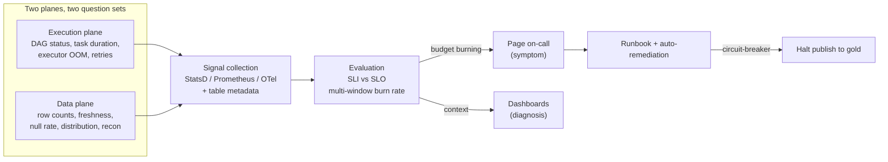

# Monitoring Data Pipelines

> Chapter from the **Data Engineering Playbook** — observability.

## About This Chapter

**What this is.** Monitoring for data pipelines: defining what a healthy data product looks like and encoding it as signals that page only when a consumer promise is at risk. This chapter covers monitoring the data plane (not just execution), SLOs and error budgets, multi-burn-rate alerting, and fail-closed circuit breakers.

**Who it's for.** Data engineers, platform/architecture leads, engineering managers/tech leads, and engineers preparing for senior/staff data-engineering interviews.

**What you'll take away.** By the end you'll be able to:
- Monitor volume, freshness, distribution, and reconciliation SLIs that catch silent partial successes a green DAG misses.
- Set robust seasonality-aware baselines (median/MAD), measure at write time, and tie every page to an SLO and error budget with multi-burn-rate alerting.
- Build a fail-closed gold-boundary circuit breaker and tier alerting by layer so stale-but-correct beats fresh-but-wrong without alert fatigue.

---

Monitoring is the discipline of deciding *what a healthy pipeline looks like* before it breaks, then encoding that definition as machine-checked signals that page a human only when a customer-visible promise is at risk. For data systems this is harder than for stateless services: a job can exit `0`, emit no errors, and still corrupt the gold layer. This chapter is about closing that gap.

## TL;DR

- A green Airflow task and a healthy dataset are different facts. Monitor the **data product** (rows, freshness, distribution, reconciliation), not just the **execution** (exit code, duration).
- Adapt RED (Rate, Errors, Duration) for batch and **PLUS** — Pipeline lag, Late/dropped records, Unique-key violations, Schema drift — for the data plane. Alert on symptoms users feel, diagnose with everything else.
- Every alert maps to an SLO and an error budget. If an alert can't burn a budget that someone signed up to defend, it's a dashboard panel, not a page.
- Multi-burn-rate alerting (fast + slow windows) is how you get paged for a real outage in minutes without paging for every 5-minute blip.
- The single most common failure mode is the **silent partial success**: the job ran, the upstream delivered 30% of partitions, and nothing fired because you only checked "did the DAG finish."
- Push freshness and volume checks as close to *write time* as possible (Iceberg snapshot metadata, Kafka consumer lag) instead of polling downstream — you detect 20–40 minutes earlier.

## Why this matters in production

The 3 a.m. story that defines this chapter: a `clicks_enriched` Spark job on EMR reads from a partitioned S3 source landed by an upstream Kafka Connect sink. One night the sink's S3 bucket policy changes and Connect silently writes to a `.../_tmp/` prefix for four hours. The Spark job's input glob matches zero new files for those partitions, so it processes the partitions it *can* see, commits an Iceberg snapshot, and exits `0`. Airflow is green. The on-call dashboard is green.

The breakage surfaces 9 hours later when a finance analyst notices revenue is down 38% — a number that was wrong in three downstream marts and one executive dashboard by then. Root cause took 40 minutes; backfill and re-derivation took 6 hours; trust took weeks.

Nothing here was an *error*. Every system did exactly what it was told. The failure was in **monitoring**: we monitored that code ran, not that data arrived correctly. Pipeline monitoring exists to make "the data is wrong but nothing crashed" a paging event with a minute-scale detection time, not a customer-discovered one.

The economic framing a principal uses: detection time (`MTTD`) dominates incident cost, because cost compounds with every downstream consumer that reads bad data before you catch it. Cutting `MTTD` from 9 hours to 9 minutes is usually a 50–100x reduction in blast radius, and it's almost always cheaper than the alternative of rebuilding consumer trust.

## How it works

Monitoring is a control loop: instrument a signal, compare it to an expectation, and act when the gap crosses a threshold tied to a promise.



The vocabulary, used precisely:

- **SLI** (indicator): a measured ratio of good events to valid events. Example: `fresh_partitions / expected_partitions`.
- **SLO** (objective): the target for that SLI over a window. Example: 99.5% of hourly partitions land within 30 min of the hour, measured over 28 days.
- **Error budget**: `1 − SLO`. At 99.5% over 28 days, the budget is `0.5% × 28 × 24 = 3.36 hours` of allowed lateness. You spend it; you don't hoard it.
- **Burn rate**: how fast you're consuming budget relative to "even" spend. Burn rate `1.0` exhausts the budget exactly at window end. Burn rate `14.4` exhausts a 28-day budget in `28d / 14.4 ≈ 2 days`.

The multi-window alert (from the Google SRE workbook, adapted) fires only when a *fast* window and a *slow* window both show high burn, which kills the false positives that single-threshold alerts generate:

```
PAGE when:
  burn_rate(1h)  > 14.4  AND  burn_rate(5m)  > 14.4     # fast: 2% of budget in 1h
  OR
  burn_rate(6h)  > 6     AND  burn_rate(30m) > 6        # slow: 5% of budget in 6h
```

For data pipelines, the SLI numerator is rarely "HTTP 200." It's a *data* fact. The art is choosing SLIs a consumer would actually pay for: freshness, completeness, and correctness, in that order of how often they bite.

## Deep dive

### The four signal classes, and why execution-only monitoring lies

| Signal class | Example metric | What it catches | What it misses |
|---|---|---|---|
| Execution | task exit code, wall-clock duration, executor OOM count | crashes, hangs, resource exhaustion | wrong-but-successful runs |
| Volume | rows written per snapshot, `Δ` vs 7-day median | empty/partial loads, dedup blowups | rows present but wrong |
| Freshness | `now() − max(event_time)`, partition arrival lag | stalled upstream, late SLA | on-time but incomplete |
| Distribution | null rate, cardinality, p50/p99 of key columns | schema drift, logic regressions, source corruption | issues only visible cross-table |
| Reconciliation | `sum(amount)` source vs target, row-count parity | dropped/duplicated records, join fan-out | nothing — this is the backstop |

Execution-only monitoring is the trap because it has the highest signal-to-effort ratio (the orchestrator gives it to you free) and the lowest catch rate for the incidents that actually hurt. Every senior data team eventually has the `clicks_enriched` story. The fix is to treat **reconciliation as the backstop SLI**: even if every other check is fooled, `source_total == target_total` within tolerance is the check that catches the silent partial. See [data-quality/reconciliation](../../data-quality/reconciliation/README.md).

### Anomaly thresholds: static vs dynamic, and the seasonality trap

A static "row count > 0" check is useless; a static "row count between 9M and 11M" check pages every Black Friday and every daylight-saving Sunday. Real volume monitoring needs **seasonality-aware baselines**.

The cheap, robust approach that beats most ML: compute the median and MAD (median absolute deviation) over the *same slot* in prior weeks, and flag using a robust z-score.

```
expected = median(counts at this hour-of-week over trailing 6 weeks)
mad      = median(|count_i − median|)
robust_z = 0.6745 × (observed − expected) / mad      # 0.6745 makes MAD ≈ σ for normal data
flag if |robust_z| > 3.5
```

MAD is used instead of standard deviation because one bad day (a previous incident) won't poison the baseline — the mean and σ are not robust to outliers; the median and MAD are. This is the single most common thing engineers get wrong: they baseline on `AVG`/`STDDEV` over a window that includes the last outage, the threshold widens, and the next outage slips through.

### Where to measure: write-time beats poll-time

Two ways to know a partition is fresh:

1. **Poll-time**: a sensor queries the downstream table every 5 minutes asking "is the 14:00 partition here yet?"
2. **Write-time**: the writer emits a `partition_committed{table, partition, rows, event_lag_s}` metric *at commit*, or you read it off the table's own metadata.

Write-time wins on latency (you know the instant it lands, not up to one poll interval later) and on cost (no polling fan-out across thousands of tables). For Iceberg, you don't even need the writer to cooperate — the snapshot summary carries it:

```sql
-- Iceberg: freshness and volume straight from metadata, no full scan
SELECT
  committed_at,
  summary['added-records']    AS rows_added,
  summary['total-records']    AS total_rows,
  date_diff('minute', committed_at, current_timestamp) AS staleness_min
FROM clicks.enriched.snapshots
ORDER BY committed_at DESC
LIMIT 1;
```

This reads the metadata layer, not the data files, so it's milliseconds regardless of table size. See [lakehouse/iceberg](../../lakehouse/iceberg/README.md) and [observability/metrics](../metrics/README.md).

For streaming, the equivalent write-time signal is **consumer lag** (`log-end-offset − committed-offset`) plus **time lag** (`now − timestamp of last committed record`). Offset lag alone lies during low-traffic windows — 50 offsets behind on a topic doing 5 msg/s is fine; 50 offsets behind on a topic doing 50k msg/s is an incident. Always pair offset lag with time lag. See [kafka/consumer-groups](../../kafka/consumer-groups/README.md) and [kafka/offsets](../../kafka/offsets/README.md).

### Alert fatigue is a reliability bug

If on-call mutes a channel, your `MTTD` for the *next* real incident is now hours, because the page is buried. Treat the page-to-actionable ratio as a tracked SLI of the monitoring system itself. A useful target: every paging alert should have a runbook link, fire <2 times/week steady-state, and have a documented "what a human does in the first 5 minutes." If it can't pass those, demote it to a ticket or a dashboard. This is why multi-burn-rate alerting matters — it's the mechanism that lets you set a tight SLO without paying for it in 3 a.m. noise.

## Worked example

End-to-end: a PySpark batch job that publishes data-plane signals to Prometheus at write time, plus a freshness check that *blocks* the gold publish (a circuit breaker) when the source is incomplete.

```python
# monitoring.py — emit data-plane SLIs at write time, fail closed on bad data
from prometheus_client import CollectorRegistry, Gauge, push_to_gateway
from pyspark.sql import SparkSession, functions as F

PUSHGW = "pushgateway.obs.svc:9091"
JOB = "clicks_enriched"

def emit(metrics: dict, labels: dict):
    reg = CollectorRegistry()
    for name, val in metrics.items():
        g = Gauge(name, name, list(labels), registry=reg)
        g.labels(**labels).set(val)
    # grouping_key dedupes by run so a re-run overwrites, not appends
    push_to_gateway(PUSHGW, job=JOB, registry=reg, grouping_key=labels)

def run(spark: SparkSession, run_hour: str):
    src = spark.read.format("iceberg").load("clicks.raw.events") \
        .where(F.col("hour") == run_hour)

    # ---- completeness gate: did we get all expected upstream partitions? ----
    expected_sources = 12                       # known fan-in from upstream contract
    got_sources = src.select("source_id").distinct().count()
    completeness = got_sources / expected_sources

    # ---- correctness signals computed in one pass ----
    stats = src.agg(
        F.count("*").alias("rows"),
        F.sum(F.when(F.col("user_id").isNull(), 1).otherwise(0)).alias("null_user"),
        F.max("event_ts").alias("max_event_ts"),
    ).first()

    null_rate = (stats["null_user"] or 0) / max(stats["rows"], 1)
    freshness_s = (spark.sql("SELECT unix_timestamp()").first()[0]
                   - int(stats["max_event_ts"].timestamp()))

    labels = {"table": "clicks.enriched", "hour": run_hour}
    emit({
        "pipeline_rows_total": stats["rows"],
        "pipeline_completeness_ratio": completeness,
        "pipeline_null_rate": null_rate,
        "pipeline_freshness_seconds": freshness_s,
    }, labels)

    # ---- CIRCUIT BREAKER: fail closed. Better stale than wrong. ----
    if completeness < 0.99:
        raise RuntimeError(
            f"ABORT publish: only {got_sources}/{expected_sources} sources present "
            f"({completeness:.1%}). Refusing to overwrite gold with partial data."
        )

    transform(src).writeTo("clicks.enriched").overwritePartitions()
```

The Prometheus alert rules that turn those gauges into pages, using multi-window burn rate for freshness and robust thresholds for the rest:

```yaml
# alerts.yaml
groups:
- name: clicks_enriched_data_plane
  rules:
  # Symptom alert: freshness SLO is 30 min; page only on real budget burn.
  - alert: ClicksEnrichedStale_Fast
    expr: |
      pipeline_freshness_seconds{table="clicks.enriched"} > 1800
      and (max_over_time(pipeline_freshness_seconds[5m]) > 1800)
    for: 5m
    labels: {severity: page, slo: freshness}
    annotations:
      runbook: "https://wiki/runbooks/clicks_enriched#stale"
      summary: "clicks.enriched stale >30m, burning freshness budget fast"

  # Diagnostic alert: partial load. This is the silent-partial catcher.
  - alert: ClicksEnrichedPartialLoad
    expr: pipeline_completeness_ratio{table="clicks.enriched"} < 0.99
    for: 0m                          # no flap tolerance: any partial is actionable
    labels: {severity: page, slo: completeness}
    annotations:
      runbook: "https://wiki/runbooks/clicks_enriched#partial"

  # Distribution drift vs robust baseline (recording rule computes the z-score).
  - alert: ClicksEnrichedNullSpike
    expr: pipeline_null_rate{table="clicks.enriched"} > 0.05
    for: 10m
    labels: {severity: ticket, slo: correctness}
```

Note the deliberate severity split: freshness and completeness **page** (a consumer feels them); the null-rate spike opens a **ticket** unless it's catastrophic. That split is the difference between a monitoring system people trust and one they mute.

## Production patterns

- **Fail closed at the gold boundary.** A circuit breaker that aborts publish on `completeness < threshold` converts a *silent corruption* (worst case, unbounded blast radius) into a *visible staleness* (bounded, alertable, recoverable). Stale-but-correct beats fresh-but-wrong for almost every gold-layer consumer. Pair with a freshness alert so staleness itself doesn't go unnoticed.
- **Emit signals at write time, alert at read-relevance.** Push `rows`, `freshness`, `completeness` from the writer (or read them off Iceberg/Delta snapshot metadata); evaluate SLOs against the freshness *the consumer was promised*, not against an arbitrary cron.
- **Tier SLOs by layer.** Bronze: page only on total stoppage. Silver: page on freshness + schema drift. Gold: page on freshness, completeness, *and* reconciliation. Don't apply gold-grade alerting to bronze staging — you'll drown. Coordinate tiers with [data-quality/freshness](../../data-quality/freshness/README.md).
- **One metric, both purposes.** The same `pipeline_rows_total` gauge feeds the symptom alert (volume drop) and the diagnosis dashboard (trend). Don't build parallel metric pipelines for alerting and dashboards; they drift apart and you debug the monitoring instead of the incident.
- **Reconciliation as a scheduled backstop.** Even with all the above, run a daily `sum(amount)` and row-count parity check source-vs-target. It's the only check that's robust to *every* logic bug, because it doesn't trust your transform. See [data-quality/reconciliation](../../data-quality/reconciliation/README.md).
- **Make MTTD a tracked metric.** Tag every incident with detection mechanism (auto-alert vs human report) and time-to-detect. A rising share of human-reported incidents is the leading indicator that your monitoring is decaying.

## Anti-patterns & failure modes

| Anti-pattern | Symptom you observe | Fix |
|---|---|---|
| Monitoring only DAG success | Airflow all green; analyst reports wrong numbers hours later | Add data-plane SLIs (volume, freshness, recon) with a fail-closed gate at gold |
| Static thresholds on seasonal volume | Pages every Monday / Black Friday; on-call mutes the channel | Robust z-score on hour-of-week MAD baseline (trailing 6 weeks, outliers excluded) |
| Baseline includes prior incidents | Threshold quietly widens; the next real drop slips under it | Exclude flagged incident windows from baseline; use median/MAD not mean/σ |
| Offset lag without time lag | "Lag is 200, we're fine" on a topic that stopped producing at 2 a.m. | Alert on `now − last_committed_event_ts`, not offset delta alone |
| Single-threshold alert, no burn windows | Either floods of 5-min blips or misses a slow 3-hour bleed | Multi-window multi-burn-rate (fast 1h/5m + slow 6h/30m) |
| Every check pages | Alert fatigue; real page buried; MTTD balloons | Split page vs ticket by consumer impact; demote anything that can't burn an SLO |
| Polling thousands of tables for freshness | Sensor sprawl, warehouse cost spike, detection lag = poll interval | Read freshness from snapshot metadata at write time |
| Alerting on cause not symptom (e.g. "executor count low") | Pages for self-healing conditions; no consumer impact | Alert on the SLI the consumer feels; keep cause metrics for diagnosis |

## Decision guidance

| Question | Choice A | Choice B | Pick A when… |
|---|---|---|---|
| Threshold type | Static bound | Dynamic (MAD baseline) | Volume is genuinely flat and contractually bounded |
| Detection point | Write-time emit | Downstream poll | Almost always; poll only when you can't touch the writer |
| Alert trigger | Single threshold | Multi-burn-rate | Single only for binary facts (partial load); burn-rate for ratio SLIs |
| Build vs buy | DIY Prometheus + checks | Monte Carlo / Anomalo / Bigeye | DIY when you have <~200 tables and platform muscle; buy for breadth + ML profiling at scale |
| Severity | Page | Ticket | A consumer's promise is at risk *right now* |

The build-vs-buy line a principal draws: managed data-observability tools earn their cost when you need broad **auto-profiling across hundreds of tables** with little per-table config — they catch the long tail you'd never hand-instrument. They do *not* replace the hand-built circuit breakers and reconciliation on your top-20 revenue-critical tables, where you know the semantics and false positives are expensive. Run both; don't pretend one is the other.

## Interview & architecture-review talking points

- "Green DAG ≠ healthy data" is the opening line. I monitor the data product — freshness, completeness, distribution, reconciliation — and treat execution status as necessary but nowhere near sufficient.
- I tie every paging alert to an SLO and an error budget, and use multi-window burn-rate alerting so I can hold a tight freshness SLO without paying for it in 3 a.m. noise. An alert that can't burn a budget someone defends is a dashboard, not a page.
- For the silent-partial-success class of incident — the one that does the most damage and trips up most teams — my answer is a fail-closed circuit breaker at the gold boundary plus reconciliation as the semantics-independent backstop. Stale-but-correct beats fresh-but-wrong.
- I measure at write time (Iceberg snapshot metadata, Kafka lag) rather than polling, which cuts MTTD by tens of minutes and removes sensor sprawl and warehouse cost.
- I treat alert fatigue as a reliability bug and track page-to-actionable ratio and MTTD-by-detection-mechanism as health metrics of the monitoring system itself.
- On baselines: median/MAD over hour-of-week slots, with prior incident windows excluded — because mean/σ baselines that include the last outage silently widen the threshold and miss the next one.

## Further reading

- [observability/metrics](../metrics/README.md) — the metric instrumentation and storage layer monitoring builds on
- [observability/logging](../logging/README.md) — structured logs for the diagnosis half of an incident
- [observability/lineage](../lineage/README.md) — blast-radius mapping once an alert fires
- [data-quality/freshness](../../data-quality/freshness/README.md) and [data-quality/reconciliation](../../data-quality/reconciliation/README.md) — the data-plane SLIs that feed these alerts
- [kafka/consumer-groups](../../kafka/consumer-groups/README.md) and [kafka/offsets](../../kafka/offsets/README.md) — streaming lag signals
- [lakehouse/iceberg](../../lakehouse/iceberg/README.md) — snapshot metadata as a free freshness/volume source
- External: Google SRE Workbook, ["Alerting on SLOs"](https://sre.google/workbook/alerting-on-slos/) (multi-window multi-burn-rate); Brendan Gregg, ["The USE Method"](https://www.brendangregg.com/usemethod.html) and Tom Wilkie's RED method as the lineage for the PLUS adaptation here.
