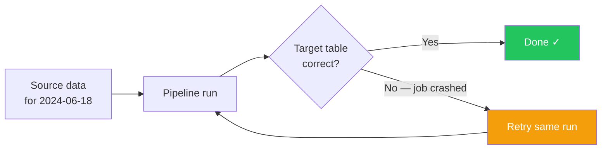

# Idempotency in Data Pipelines

> Chapter from the Data Engineering Playbook — pipeline-patterns.

---

## TL;DR

- **Idempotent pipeline:** running it once or ten times produces the exact same result in the target table.
- **Why it matters:** retries happen. Orchestrators restart failed jobs. Backfills re-process old dates. Without idempotency, every retry creates duplicates or corrupts state.
- **RDBMS:** use `INSERT ... ON CONFLICT DO UPDATE` (upsert); for partitioned facts, `DELETE` the partition first then re-insert.
- **Hive / Parquet:** no native MERGE — use dynamic partition overwrite so only the affected partition is replaced.
- **Delta Lake:** `MERGE INTO` on the business key gives fully ACID upsert; `replaceWhere` for partition-scoped overwrites.
- **Apache Iceberg:** same `MERGE INTO` syntax; each run creates a new snapshot — re-running lands in the same snapshot state.

---

## What Is Idempotency?

Imagine your nightly load job runs at midnight, inserts 50,000 rows into a fact table, then crashes at 11:58 PM while writing the last batch. The orchestrator restarts it at 12:01 AM and runs the whole job again.

**Without idempotency:** you now have duplicate rows — some customers appear twice, revenue totals are wrong, and the on-call engineer gets paged at 2 AM.

**With idempotency:** the re-run detects what already exists and either skips it (already inserted) or overwrites it with the same values. The table ends up identical to what a single clean run would have produced.

The rule of thumb: **a pipeline is idempotent if you can safely re-run it with the same input and get the same output.**



The retry loop is only safe if the pipeline is idempotent. Otherwise each pass through adds more data.

---

## 1. Relational Database (RDBMS)

### Theory

Relational databases support `UPSERT` — a single statement that inserts a new row if the key doesn't exist, or updates the existing row if it does. In PostgreSQL this is `INSERT ... ON CONFLICT DO UPDATE`. Because the operation is keyed on the business key, running it twice with the same data produces the same result.

For partitioned facts (date-range tables), the pattern is: **delete the target partition, then re-insert**. Both steps together are idempotent — deleting a partition that was already deleted is a no-op, and inserting the same rows again gives the same partition.

---

### Non-Partitioned Table: `dim_customer`

**Scenario:** incremental load from `stg_customer` into `dim_customer`. Some rows are new, some are updates.

```sql
-- Step 1: Stage incremental data (already done by upstream extract)
-- stg_customer contains today's changed/new customers from the source system.

-- Step 2: Upsert into the target dimension.
-- ON CONFLICT: if customer_id already exists, UPDATE the mutable columns.
-- If it doesn't exist, INSERT as a new row.
-- Re-running this with the same stg_customer data is safe —
-- the conflict fires again and sets the same values.

INSERT INTO dim_customer (customer_id, full_name, email, status, updated_at)
SELECT
    customer_id,
    full_name,
    email,
    status,
    updated_at
FROM stg_customer
ON CONFLICT (customer_id)
DO UPDATE SET
    full_name  = EXCLUDED.full_name,
    email      = EXCLUDED.email,
    status     = EXCLUDED.status,
    updated_at = EXCLUDED.updated_at;

-- EXCLUDED refers to the row that was attempted to be inserted.
-- So EXCLUDED.email = the new email coming from stg_customer.
```

---

### Partitioned Table: `fact_orders` (partitioned by `order_date`)

**Scenario:** daily order facts, one partition per date. We want to reload `2024-06-18` safely.

```sql
-- Step 1: Delete the target partition for the run date.
-- If this step already ran (job crashed after this), deleting an empty
-- partition is a no-op — still safe.
DELETE FROM fact_orders
WHERE order_date = '2024-06-18';

-- Step 2: Insert the full set of rows for that date from staging.
-- Combined with the delete above, re-running produces identical rows
-- in the partition every time.
INSERT INTO fact_orders (order_id, customer_id, order_date, amount, status)
SELECT
    order_id,
    customer_id,
    order_date,
    amount,
    status
FROM stg_orders
WHERE order_date = '2024-06-18';
```

> **Tip:** Wrap both statements in a transaction (`BEGIN; DELETE...; INSERT...; COMMIT;`) so a crash between the two steps doesn't leave the partition empty.

---

## 2. Hive (Parquet on S3 / Hive Metastore)

### Theory

Hive (and plain Parquet tables on S3 managed by a Hive metastore) does **not** support `MERGE INTO`. There is no native upsert. Idempotency is achieved by **overwriting** rather than appending:

- **Non-partitioned table:** overwrite the entire table each run. Safe only when you recompute the full table from source on every run.
- **Partitioned table:** use **dynamic partition overwrite** (`spark.sql.sources.partitionOverwriteMode=dynamic`). Spark replaces only the partitions present in the new DataFrame — other partitions are untouched.

The critical setting is `partitionOverwriteMode=dynamic`. Without it, Spark's default **static** overwrite wipes every partition in the table, not just the ones you're writing.

---

### Non-Partitioned Table: `dim_customer`

**Scenario:** recompute the full dimension from source on each run.

```python
from pyspark.sql import SparkSession

spark = SparkSession.builder.appName("dim_customer_load").getOrCreate()

# Read the full customer snapshot from the source system.
# Because we read everything, overwriting the full table is safe.
source_df = spark.table("source_system.customers")

# Transform: rename columns, cast types, etc.
dim_df = source_df.select(
    "customer_id",
    "full_name",
    "email",
    "status",
    "updated_at"
)

# Write with mode="overwrite" — replaces the entire table.
# Re-running with the same source produces the same table. ✓
# WARNING: only use this pattern when you read the FULL source each run.
# If you read only incremental rows, this would delete everything not in
# today's delta — use the partitioned pattern instead.
dim_df.write \
    .mode("overwrite") \
    .format("parquet") \
    .saveAsTable("analytics.dim_customer")
```

---

### Partitioned Table: `fact_orders` (partitioned by `order_date`)

**Scenario:** daily incremental load of orders for `2024-06-18` only. Other partitions must not be touched.

```python
from pyspark.sql import SparkSession

spark = SparkSession.builder.appName("fact_orders_load").getOrCreate()

# CRITICAL: set dynamic partition overwrite mode BEFORE writing.
# Dynamic = only partitions present in the DataFrame are overwritten.
# Static (default) = the entire table is wiped. Never use static for incremental loads.
spark.conf.set("spark.sql.sources.partitionOverwriteMode", "dynamic")

# Read only today's incremental orders from the source.
orders_df = spark.table("source_system.orders") \
    .filter("order_date = '2024-06-18'")

# Transform as needed.
fact_df = orders_df.select(
    "order_id",
    "customer_id",
    "order_date",   # <-- this is the partition column
    "amount",
    "status"
)

# Write with mode="overwrite" and partitionBy.
# Because partitionOverwriteMode=dynamic, ONLY the 2024-06-18 partition
# is replaced. All other order_date partitions are untouched.
# Re-running replaces the same partition with the same rows. ✓
fact_df.write \
    .mode("overwrite") \
    .partitionBy("order_date") \
    .format("parquet") \
    .saveAsTable("analytics.fact_orders")
```

---

## 3. Delta Lake

### Theory

Delta Lake adds an **ACID transaction log** on top of Parquet files. Every write is a logged transaction, and `MERGE INTO` is a first-class operation. Because `MERGE` is keyed on a business key, re-running it with the same source data is naturally idempotent — matched rows get updated to the same values, unmatched rows get inserted once.

For partitioned tables, adding a partition filter to the merge condition prevents Delta from scanning the entire table, which is important for performance at scale.

---

### Non-Partitioned Table: `dim_customer`

**Scenario:** incremental upsert — new customers inserted, changed customers updated.

```python
from pyspark.sql import SparkSession
from delta.tables import DeltaTable

spark = SparkSession.builder \
    .appName("dim_customer_load") \
    .config("spark.sql.extensions", "io.delta.sql.DeltaSparkSessionExtension") \
    .config("spark.sql.catalog.spark_catalog", "org.apache.spark.sql.delta.catalog.DeltaCatalog") \
    .getOrCreate()

# Read today's incremental customers from staging.
# This contains both new customers and customers whose data changed.
staged = spark.table("staging.stg_customer")

# Reference the existing Delta target table.
target = DeltaTable.forName(spark, "analytics.dim_customer")

# MERGE: match on the business key (customer_id).
# - WHEN MATCHED: the customer already exists → update all columns to new values.
# - WHEN NOT MATCHED: new customer → insert the full row.
# Re-running with the same staged data:
#   - matched rows: update fires again, sets the same values → no change.
#   - not-matched rows: they were inserted on the first run, so now they match
#     and the update fires instead → same result. ✓
target.alias("t") \
    .merge(
        staged.alias("s"),
        "t.customer_id = s.customer_id"   # join condition: business key
    ) \
    .whenMatchedUpdateAll() \             # update every column when key matches
    .whenNotMatchedInsertAll() \          # insert full row when key is new
    .execute()
```

---

### Partitioned Table: `fact_orders` (partitioned by `order_date`)

**Scenario:** daily order fact load for `2024-06-18`. Orders can be late-arriving or corrected (so upsert is needed, not just insert).

```python
from pyspark.sql import SparkSession
from delta.tables import DeltaTable

spark = SparkSession.builder.appName("fact_orders_load").getOrCreate()

# Read today's incremental orders from staging.
staged = spark.table("staging.stg_orders") \
    .filter("order_date = '2024-06-18'")

target = DeltaTable.forName(spark, "analytics.fact_orders")

# MERGE with a partition filter in the join condition.
# Adding "t.order_date = s.order_date" tells Delta to only scan the
# 2024-06-18 partition — without this, Delta scans all partitions, which
# is very slow on a large table.
target.alias("t") \
    .merge(
        staged.alias("s"),
        "t.order_date = s.order_date AND t.order_id = s.order_id"
    ) \
    .whenMatchedUpdateAll() \
    .whenNotMatchedInsertAll() \
    .execute()

# ── Alternative: replaceWhere (simpler, no upsert logic) ──────────────────
# If you don't need upsert (all rows for a date are always fully recomputed),
# replaceWhere is simpler: it atomically replaces the entire partition.
# staged.write \
#     .format("delta") \
#     .option("replaceWhere", "order_date = '2024-06-18'") \
#     .mode("overwrite") \
#     .saveAsTable("analytics.fact_orders")
```

---

## 4. Apache Iceberg

### Theory

Apache Iceberg manages tables as an immutable sequence of **snapshots**. Every write — including a `MERGE` — creates a new snapshot that points to new data files. Old snapshots are retained for time-travel queries. Re-running a `MERGE` with the same source data produces a new snapshot, but the snapshot's data is identical to the previous one.

Iceberg supports `MERGE INTO` natively via Spark SQL (Spark 3.x with the Iceberg catalog). For simple partition replacements, `writeTo(...).overwritePartitions()` is the Iceberg equivalent of Delta's `replaceWhere`.

---

### Non-Partitioned Table: `dim_customer`

**Scenario:** incremental upsert — new and updated customers.

```python
from pyspark.sql import SparkSession

spark = SparkSession.builder \
    .appName("dim_customer_load") \
    .config("spark.sql.extensions", "org.apache.iceberg.spark.extensions.IcebergSparkSessionExtensions") \
    .config("spark.sql.catalog.spark_catalog", "org.apache.iceberg.spark.SparkSessionCatalog") \
    .getOrCreate()

# Write today's incremental customers to a staging view.
staged = spark.table("staging.stg_customer")
staged.createOrReplaceTempView("stg_customer_view")

# MERGE INTO using Spark SQL.
# Identical semantics to Delta: match on business key, update or insert.
# Re-running with the same source → same result. ✓
spark.sql("""
    MERGE INTO analytics.dim_customer AS t
    USING stg_customer_view AS s
    ON t.customer_id = s.customer_id       -- match on business key

    WHEN MATCHED THEN
        UPDATE SET
            t.full_name  = s.full_name,    -- overwrite with latest values
            t.email      = s.email,
            t.status     = s.status,
            t.updated_at = s.updated_at

    WHEN NOT MATCHED THEN
        INSERT (customer_id, full_name, email, status, updated_at)
        VALUES (s.customer_id, s.full_name, s.email, s.status, s.updated_at)
""")
```

---

### Partitioned Table: `fact_orders` (partitioned by `order_date`)

**Scenario:** daily order fact load for `2024-06-18`.

```python
from pyspark.sql import SparkSession

spark = SparkSession.builder.appName("fact_orders_load").getOrCreate()

staged = spark.table("staging.stg_orders") \
    .filter("order_date = '2024-06-18'")
staged.createOrReplaceTempView("stg_orders_view")

# Option A: MERGE INTO with a partition predicate.
# The WHERE clause on t.order_date tells Iceberg to only scan the
# 2024-06-18 partition — same performance benefit as Delta's partition filter.
spark.sql("""
    MERGE INTO analytics.fact_orders AS t
    USING stg_orders_view AS s
    ON t.order_date = s.order_date         -- partition pruning
    AND t.order_id  = s.order_id           -- business key

    WHEN MATCHED THEN
        UPDATE SET *                       -- update all columns

    WHEN NOT MATCHED THEN
        INSERT *                           -- insert new rows
""")

# Option B: overwritePartitions() — simpler when all rows for a partition
# are recomputed from scratch (no upsert needed).
# This atomically replaces the 2024-06-18 partition with the new data.
# staged.writeTo("analytics.fact_orders").overwritePartitions()
```

---

## Anti-Patterns & Failure Modes

| Anti-pattern | What goes wrong | Fix |
|---|---|---|
| Plain `INSERT` with no dedup | Duplicate rows on every retry | Use UPSERT / MERGE keyed on business key |
| Hive static partition overwrite | Re-run wipes the entire table | Set `partitionOverwriteMode=dynamic` |
| No partition filter on Delta/Iceberg MERGE | Full table scan on every run — very slow at scale | Add partition column to the merge join condition |
| Wrapping DELETE+INSERT without a transaction | Crash between the two steps leaves the partition empty | Wrap in a transaction (`BEGIN`/`COMMIT`) |
| Trusting upstream dedup | Duplicates from source land in mart | Add a dedup step (`ROW_NUMBER() OVER (PARTITION BY key ORDER BY updated_at DESC)`) before the merge |

---

## Decision Guide

| Storage type | Table type | Recommended approach |
|---|---|---|
| RDBMS | Non-partitioned dimension | `INSERT ... ON CONFLICT DO UPDATE` on business key |
| RDBMS | Partitioned fact | `DELETE` partition + `INSERT` in a transaction |
| Hive / Parquet | Non-partitioned | Full overwrite (`mode("overwrite")`) — only if full table recomputed |
| Hive / Parquet | Partitioned | Dynamic partition overwrite (`partitionOverwriteMode=dynamic`) |
| Delta Lake | Non-partitioned | `DeltaTable.merge()` on business key |
| Delta Lake | Partitioned | `DeltaTable.merge()` with partition filter, or `replaceWhere` for full-partition replace |
| Apache Iceberg | Non-partitioned | `MERGE INTO` on business key |
| Apache Iceberg | Partitioned | `MERGE INTO` with partition predicate, or `overwritePartitions()` for full-partition replace |

---

## Interview & Architecture-Review Talking Points

- **"What makes a pipeline idempotent?"** — The output is the same regardless of how many times you run it with the same input. Achieved by using upsert/merge (keyed on business key) or partition overwrite rather than append.
- **"Why does Hive need a different approach than Delta?"** — Hive/Parquet has no transaction log and no native MERGE. The only safe mechanism is overwriting the affected partition. Delta's ACID log enables true row-level MERGE.
- **"What's the risk of forgetting `partitionOverwriteMode=dynamic` in Hive?"** — Default is static: Spark drops all partitions in the table before writing, even ones you didn't touch. A load for `2024-06-18` silently deletes every other date.
- **"How does Iceberg's snapshot model help?"** — Every write is a new immutable snapshot. Re-running a merge creates a new snapshot with the same data as the previous one. You can also roll back to the prior snapshot if something goes wrong.
- **"When would you use `replaceWhere` (Delta) or `overwritePartitions` (Iceberg) instead of MERGE?"** — When you recompute the full partition from source on every run and don't need row-level upsert. Simpler and faster than MERGE for that case.

---

## Further Reading

- [Exactly-Once Semantics in Kafka](../../kafka/exactly-once/README.md) — source-side idempotency
- [Delta Lake](../../lakehouse/delta/README.md) — transaction log and ACID guarantees
- [Apache Iceberg](../../lakehouse/iceberg/README.md) — snapshot model and partition evolution
- [Data Quality Gates](../../data-quality/README.md) — how to validate idempotent loads didn't produce dupes
