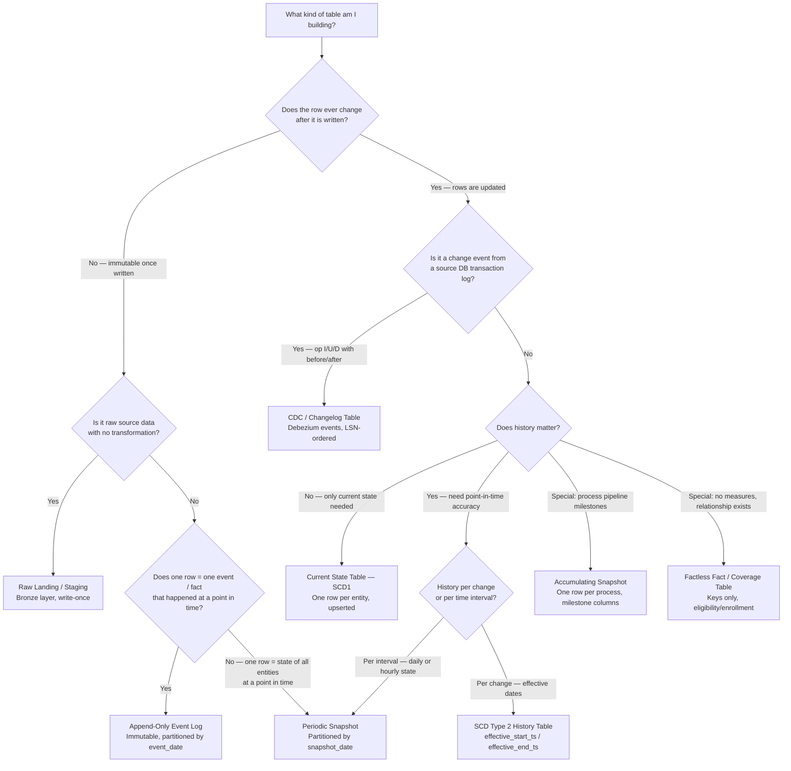

# Data Landing Table Patterns

> Chapter from the Data Engineering Playbook — pipeline-patterns.

---

## TL;DR

- **Append-Only Event Log** — one row per event, never updated. Every thing that happened is preserved forever. Right for transactions, clicks, audit trails.
- **Periodic Snapshot** — full state of all entities on a fixed schedule. Right when "what was the state on date X?" is the question and recomputing it from events would be expensive.
- **Current State (SCD Type 1)** — one row per entity, always the latest. Right for reference data where history has no analytical value.
- **SCD Type 2 History Table** — one row per version of each entity, with effective dates. Right when point-in-time accuracy matters — "what was this customer's tier when they took this loan?"
- **Raw Landing / Staging** — data exactly as received, no transformation. Right as a reprocessing safety net and audit trail.
- **CDC / Changelog Table** — raw insert/update/delete events from a source database. Right as a durable buffer between capture and apply.
- **Accumulating Snapshot** — one row per business process instance, updated at each milestone. Right for pipeline duration analytics: "average time from order placed to shipped."
- **Factless Fact / Coverage Table** — records that a relationship existed, no measures. Right when the denominator (who was eligible?) is what you're missing.

The wrong pattern silently produces wrong answers. Append-only on a customer table gives you 50 rows per customer. Current-state on a payment event table loses the authorization before the reversal. Snapshotting daily when SCD2 is needed wastes 10× the storage.

---

## Shared Scenario

An e-commerce platform. Customers place orders; orders move through stages (placed → confirmed → shipped → delivered); inventory changes; customer profiles update. All 8 patterns are illustrated in this domain so the tradeoffs are directly comparable.

---

## Pattern 1: Append-Only Event Log

### What it is

Every event that occurs is written as a new row. Existing rows are never updated or deleted. The table grows monotonically — it is the permanent record of what happened.

### Schema shape

| Column | Type | Notes |
|---|---|---|
| `event_id` | STRING | Unique per event (UUID or hash) |
| `event_type` | STRING | `order_placed`, `order_shipped`, `payment_auth`, etc. |
| `entity_id` | STRING | Order ID, customer ID, payment ID — the subject of the event |
| `event_ts` | TIMESTAMP | When the event occurred (event time, not load time) |
| `payload` | MAP / STRUCT | Event-specific fields |
| `event_date` | DATE | **Partition column** — derived from `event_ts` |

**Key constraint:** `entity_id` is NOT unique. Customer 101 has one row for `order_placed`, one for `payment_authorized`, one for `order_shipped`. That is correct behavior.

### Sample rows

| event_id | event_type | entity_id | event_ts | event_date |
|---|---|---|---|---|
| evt-001 | order_placed | ord-888 | 2024-06-18 09:01:00 | 2024-06-18 |
| evt-002 | payment_authorized | ord-888 | 2024-06-18 09:01:03 | 2024-06-18 |
| evt-003 | order_shipped | ord-888 | 2024-06-19 14:22:00 | 2024-06-19 |
| evt-004 | payment_reversed | ord-888 | 2024-06-19 17:05:00 | 2024-06-19 |

### Business scenario

A payments team tracks authorizations, captures, and reversals. The CFO asks: *"Show me every authorization in the last 30 days that was reversed within 24 hours — how much revenue did that represent?"*

With an append-only `payment_events` table, this is a self-join on `entity_id` filtered to `event_type IN ('payment_authorized', 'payment_reversed')`. Both events are permanently present.

If the team had built a current-state table instead — overwriting the row on each status change — the authorization record would no longer exist after the reversal. The CFO's question becomes unanswerable. The audit trail requires every event preserved.

### Query pattern

```sql
-- Events for a specific order
SELECT event_type, event_ts, payload
FROM analytics.order_events
WHERE event_date BETWEEN '2024-06-01' AND '2024-06-30'
  AND entity_id = 'ord-888'
ORDER BY event_ts;

-- Reversals within 24h of authorization (self-join)
SELECT auth.entity_id, auth.event_ts AS auth_ts, rev.event_ts AS reversal_ts
FROM analytics.payment_events auth
JOIN analytics.payment_events rev
  ON  auth.entity_id = rev.entity_id
  AND auth.event_type = 'payment_authorized'
  AND rev.event_type  = 'payment_reversed'
  AND rev.event_ts - auth.event_ts < INTERVAL '24 hours'
WHERE auth.event_date BETWEEN '2024-06-01' AND '2024-06-30';
```

### When to avoid

- Entity tables (customers, products) where analysts want "current state" — append creates one row per load cycle per customer, requiring dedup on every read.
- Tables queried by entity ID without a time filter — no partition pruning means full table scans.

---

## Pattern 2: Periodic Snapshot Table

### What it is

The complete state of all entities, captured at regular intervals. Every day (or hour), the ETL writes one row per entity reflecting the current state of that entity at that moment. Each snapshot date is one partition. Querying any past date is a single partition scan.

### Schema shape

| Column | Type | Notes |
|---|---|---|
| `snapshot_date` | DATE | **Partition column** — when this snapshot was taken |
| `entity_id` | STRING | SKU, account, order, etc. |
| `metric_1..N` | various | State at snapshot time: balance, quantity, status |

**Key constraint:** `snapshot_date + entity_id` is unique. `entity_id` alone is not.

### Sample rows

| snapshot_date | sku_id | warehouse_id | quantity_on_hand | reserved_qty | available_qty |
|---|---|---|---|---|---|
| 2024-06-17 | SKU-789 | WH-01 | 1200 | 80 | 1120 |
| 2024-06-18 | SKU-789 | WH-01 | 1150 | 95 | 1055 |
| 2024-06-19 | SKU-789 | WH-01 | 980 | 110 | 870 |

### Business scenario

A retail operations team tracks inventory across 50,000 SKUs and 20 warehouses. Inventory changes dozens of times per day — sales, returns, restocks, adjustments.

The team needs to answer: *"What was available inventory for SKU-789 at warehouse WH-01 every day last quarter?"*

Reconstructing this from an event log would require replaying every stock movement event (sales, returns, restocks) for every SKU for every day — expensive and complex. A `daily_inventory_snapshot` partitioned by `snapshot_date` makes the query trivial:

```sql
SELECT snapshot_date, quantity_on_hand, available_qty
FROM analytics.daily_inventory_snapshot
WHERE snapshot_date BETWEEN '2024-04-01' AND '2024-06-30'
  AND sku_id = 'SKU-789'
  AND warehouse_id = 'WH-01'
ORDER BY snapshot_date;
```

The ETL runs nightly: for each SKU × warehouse, write one row with the closing balance. Yesterday's partition never changes after it's written.

### Growth planning

```
50,000 SKUs × 20 warehouses × 365 days = 365M rows/year
```

Plan cold archival after 2–3 years. Use partition pruning aggressively — never query without a `snapshot_date` filter.

### When to avoid

- Entities with very low change rate: snapshotting 10M customers daily when 99.9% don't change wastes storage. Use SCD2 (history-per-change) instead of snapshot (history-per-day).
- When the analytical question is "what changed?" rather than "what was the state?" — the event log answers that better.

---

## Pattern 3: Current State Table (SCD Type 1)

### What it is

One row per entity. Always the latest version. When an entity changes, the existing row is overwritten (upserted). No history is kept.

### Schema shape

| Column | Type | Notes |
|---|---|---|
| `entity_id` | STRING | **Primary key** — unique |
| `attr_1..N` | various | Current values |
| `updated_ts` | TIMESTAMP | When this row was last changed |

### Sample rows

| store_id | store_name | region | manager_name | updated_ts |
|---|---|---|---|---|
| STR-001 | Downtown SF | West | Alice Chen | 2024-06-01 |
| STR-002 | Midtown NY | East | Bob Patel | 2024-05-15 |
| STR-003 | Loop Chicago | Central | Carol Diaz | 2024-06-10 |

### Business scenario

A retail company has 5,000 stores. Analysts join every sales fact to `dim_store` to group by region, district, and manager. These attributes change rarely — maybe 200 stores get a manager change or region reassignment each year.

Analysts never ask *"what region was store STR-001 in last year?"* — they only ever want the current region when filtering and grouping today's sales. Building SCD2 with effective dates would add `BETWEEN effective_start_ts AND effective_end_ts` to every single JOIN in every single report for zero analytical benefit.

SCD1 is the right call: one row per store, simple JOIN, no date filter. When a store changes region, the row is upserted — old region gone, new region in.

### When to avoid

- When historical values are analytically significant: pricing tier, risk segment, product category, sales territory. If an analyst ever asks "what was X at the time of transaction Y?", you need SCD2.
- When regulatory or audit requirements mandate preserving old values.

---

## Pattern 4: SCD Type 2 — History Table

### What it is

One row per version of each entity. When an attribute changes, the existing row's `effective_end_ts` is set to now, and a new row is inserted with the new values and `effective_start_ts` = now. The entity has as many rows as it has had versions.

### Schema shape

| Column | Type | Notes |
|---|---|---|
| `surrogate_key` | STRING | Unique per row (UUID or hash of entity + start ts) |
| `entity_id` | STRING | NOT unique — same entity, multiple versions |
| `attr_1..N` | various | Values for this version |
| `effective_start_ts` | TIMESTAMP | When this version became active |
| `effective_end_ts` | TIMESTAMP | When this version expired; `9999-12-31` = still current |
| `is_current` | BOOLEAN | TRUE for the active row |

### Sample rows

| surrogate_key | customer_id | risk_tier | effective_start_ts | effective_end_ts | is_current |
|---|---|---|---|---|---|
| sk-101a | CUST-101 | low | 2023-01-15 | 2024-01-10 | FALSE |
| sk-101b | CUST-101 | medium | 2024-01-10 | 2024-03-15 | FALSE |
| sk-101c | CUST-101 | high | 2024-03-15 | 9999-12-31 | TRUE |

### Business scenario

A financial services team tracks customer risk tier (low / medium / high). In January, CUST-101 was upgraded from low to medium. In March, upgraded again to high. In April, they defaulted on a personal loan.

The credit risk team asks: *"What was CUST-101's risk tier at the time of loan origination?"* If the origination date was February 20, the answer should be "medium" — the tier that was active when the loan was issued.

With SCD1, `risk_tier = high` (the current value overwrote everything). The origination context is gone.

With SCD2, the point-in-time join retrieves the correct version:

```sql
SELECT
  l.loan_id,
  l.originated_ts,
  c.risk_tier
FROM analytics.fact_loans l
JOIN analytics.dim_customer_scd2 c
  ON  l.customer_id = c.customer_id
  AND l.originated_ts BETWEEN c.effective_start_ts AND c.effective_end_ts;
-- Returns: loan-456, 2024-02-20, medium  ← correct
```

### When to avoid

- When analysts don't need point-in-time joins — every query adds date-range conditions; this is wasted complexity on stable reference data.
- High-cardinality entities with very frequent changes — the table grows large and requires partitioning on `effective_start_ts` or `is_current` for query performance.

See [Merge Strategies](../merge-strategies/README.md) for the SCD2 upsert implementation in SQL, Delta, and Iceberg.

---

## Pattern 5: Raw Landing / Staging Table (Bronze Layer)

### What it is

Data written exactly as received from the source — no transformation, no deduplication, no schema enforcement beyond parsing. Landing metadata columns (`_load_ts`, `_source_file`, `_batch_id`) are appended. This is the pipeline's audit trail and reprocessing source.

### Schema shape

| Column | Type | Notes |
|---|---|---|
| all source columns | as-is | Original field names and types |
| `_load_ts` | TIMESTAMP | When this batch was ingested |
| `_source_file` | STRING | S3 key, Kafka topic+offset, or API endpoint |
| `_batch_id` | STRING | Run ID — links all rows from one load |
| `_row_hash` | STRING | Hash of the source row — detects duplicates |
| `_load_date` | DATE | **Partition column** |

### Sample rows

| order_id | customer_id | total_amt | status_code | _load_ts | _source_file | _load_date |
|---|---|---|---|---|---|---|
| ORD-888 | 101 | 149.99 | CONF | 2024-06-18 09:00:01 | s3://feeds/orders/20240618.csv | 2024-06-18 |
| ORD-889 | 102 | 79.00 | PEND | 2024-06-18 09:00:01 | s3://feeds/orders/20240618.csv | 2024-06-18 |

### Business scenario

A data engineering team ingests a daily pricing feed from a third-party vendor. In March, the vendor silently changes how they encode discounts — a `0.15` (15% off) becomes `15` in the new format. The transformation pipeline divides by 100 as usual, producing `0.0015` — 0.15% off. Incorrect discounted prices flow into dashboards for two days before an analyst catches an anomaly.

**With raw landing:** the team queries `raw_pricing_landing` for the affected dates and sees the original `15` values. They fix the transformation logic and replay from the raw table for those two days without contacting the vendor.

**Without raw landing:** they must request a re-send from the vendor, wait for it, and hope the vendor still has the historical file. If the vendor purges daily feeds, that data is permanently lost.

Raw landing tables make transformation bugs recoverable. They also make SLA auditing possible: "prove that the vendor's feed arrived on time every day this quarter" is answered by a query on `_load_ts` per `_load_date`.

### Key properties

- Write-once, never modified. All transformations happen in downstream tables.
- Append-only — even re-delivered batches land as new rows with a new `_batch_id`.
- Typically 30–90 days hot retention, then cold archival or purge.

---

## Pattern 6: CDC / Changelog Table

### What it is

Raw change data capture events — inserts, updates, and deletes — captured from a source database's transaction log (via Debezium, AWS DMS, or similar) and stored as-is. Each row is a change event, not the current state of the entity. Downstream processes consume these events and apply them to target tables via MERGE.

### Schema shape

| Column | Type | Notes |
|---|---|---|
| `op` | STRING | `c` (create), `u` (update), `d` (delete), `r` (snapshot read) |
| `before` | STRUCT | Row values before the change (NULL for inserts) |
| `after` | STRUCT | Row values after the change (NULL for deletes) |
| `event_ts` | TIMESTAMP | When the change occurred in the source DB |
| `source_lsn` | BIGINT | Log sequence number — ordering guarantee |
| `_load_date` | DATE | **Partition column** |

### Sample rows

| op | after.order_id | after.status | after.updated_ts | event_ts | source_lsn |
|---|---|---|---|---|---|
| c | ORD-888 | placed | 2024-06-18 09:01:00 | 2024-06-18 09:01:00 | 100001 |
| u | ORD-888 | confirmed | 2024-06-18 09:05:00 | 2024-06-18 09:05:01 | 100045 |
| u | ORD-888 | shipped | 2024-06-19 14:22:00 | 2024-06-19 14:22:03 | 102310 |
| d | *(null)* | *(null)* | *(null)* | 2024-06-19 17:06:00 | 102587 |

The `d` row has no `after` image — only the before image indicates which row was deleted.

### Business scenario

An e-commerce company's orders live in PostgreSQL. The analytics lake needs to mirror the `orders` table within 5 minutes, including physical deletes (cancelled orders must disappear from the lake).

**The polling problem:** querying `WHERE updated_ts > last_watermark` catches inserts and updates, but misses deletes — a deleted row has no `updated_ts` to scan. You can't detect a delete from a polling query.

**The CDC solution:** Debezium listens to PostgreSQL's Write-Ahead Log. Every INSERT, UPDATE, and DELETE produces a structured event, published to Kafka, and landed in `cdc_orders_raw` partitioned by `_load_date`. A Flink job reads the changelog table and applies:

```python
def apply_cdc(batch_df, batch_id):
    target = DeltaTable.forName(spark, "analytics.fact_orders")

    # Hard deletes
    deletes = batch_df.filter("op = 'd'").select("before.order_id")
    target.alias("t").merge(deletes.alias("d"), "t.order_id = d.order_id") \
        .whenMatchedDelete().execute()

    # Upserts for inserts and updates
    upserts = batch_df.filter("op IN ('c', 'u')").select("after.*")
    target.alias("t").merge(upserts.alias("s"), "t.order_id = s.order_id") \
        .whenMatchedUpdateAll().whenNotMatchedInsertAll().execute()
```

The CDC table is the durable buffer: if the Flink job is down for 2 hours, it resumes from the last committed LSN and catches up — no events lost.

### Retention

30–90 days. Long enough to reprocess the target table on logic change or failure. Then purge (CDC tables grow fast on high-write sources).

See [Merge Strategies — Full Sync](../merge-strategies/README.md) for the complete CDC consumer pattern.

---

## Pattern 7: Accumulating Snapshot Fact Table

### What it is

One row per business process instance — one row per order, one row per loan application, one row per support ticket. That row is updated (via MERGE) as the process moves through milestone stages. All milestone timestamps live as columns on the single row. When the order ships, `shipped_ts` is populated. When it's delivered, `delivered_ts` is populated.

### Schema shape

| Column | Type | Notes |
|---|---|---|
| `order_id` | STRING | **Primary key** — unique |
| `customer_id` | STRING | FK |
| `placed_ts` | TIMESTAMP | When the order was placed |
| `confirmed_ts` | TIMESTAMP | When payment was confirmed; NULL until reached |
| `shipped_ts` | TIMESTAMP | When package left warehouse; NULL until reached |
| `delivered_ts` | TIMESTAMP | When delivered; NULL until reached |
| `cancelled_ts` | TIMESTAMP | If cancelled; NULL otherwise |
| `hours_to_confirm` | DECIMAL | `confirmed_ts - placed_ts` in hours |
| `hours_to_ship` | DECIMAL | `shipped_ts - confirmed_ts` in hours |
| `hours_to_deliver` | DECIMAL | `delivered_ts - shipped_ts` in hours |
| `warehouse_id` | STRING | Which warehouse shipped it |

### Sample rows

| order_id | placed_ts | confirmed_ts | shipped_ts | delivered_ts | hours_to_ship | warehouse_id |
|---|---|---|---|---|---|---|
| ORD-888 | 2024-06-18 09:01 | 2024-06-18 09:05 | 2024-06-19 14:22 | 2024-06-21 10:15 | 29.3 | WH-01 |
| ORD-889 | 2024-06-18 10:30 | 2024-06-18 10:33 | *(NULL)* | *(NULL)* | *(NULL)* | WH-02 |

ORD-889 has been confirmed but not yet shipped — `shipped_ts` is NULL.

### Business scenario

A logistics company wants to reduce delivery time. Operations asks: *"For orders placed last month, what is the average time between confirmed and shipped, broken down by warehouse? Which warehouse is the bottleneck?"*

This question requires `confirmed_ts` and `shipped_ts` for the same order. In an event log, these are separate rows:

```
evt: order_confirmed, order_id=ORD-888, ts=09:05
evt: order_shipped,   order_id=ORD-888, ts=14:22 (next day)
```

Answering the question from the event log requires:

```sql
-- Self-join on entity_id + event_type — slow at scale
SELECT shipped.entity_id,
       DATEDIFF('hour', confirmed.event_ts, shipped.event_ts) AS hours_to_ship
FROM order_events confirmed
JOIN order_events shipped
  ON confirmed.entity_id = shipped.entity_id
 AND confirmed.event_type = 'order_confirmed'
 AND shipped.event_type   = 'order_shipped';
```

With the accumulating snapshot:

```sql
-- Single table scan, one row per order
SELECT warehouse_id, AVG(hours_to_ship) AS avg_hours
FROM analytics.fact_order_lifecycle
WHERE placed_ts >= '2024-06-01'
  AND shipped_ts IS NOT NULL
GROUP BY warehouse_id
ORDER BY avg_hours DESC;
```

The accumulating snapshot makes pipeline duration analytics fast and simple. The cost: each milestone triggers a MERGE on the existing row, requiring Delta or Iceberg for ACID support. This is not an append-only pattern.

### Key distinction from Event Log

| | Event Log | Accumulating Snapshot |
|---|---|---|
| Rows per order | N (one per event) | 1 (updated at each milestone) |
| `shipped_ts` on placed row | Not present — different row | Present as a column (NULL until shipped) |
| Pipeline duration query | Requires self-join | Single scan, direct column subtraction |
| Storage | Append-only | Requires MERGE / ACID |

---

## Pattern 8: Factless Fact / Coverage Table

### What it is

Records that a relationship or event existed — no numeric measures. The fact is the occurrence or eligibility itself, not an amount or count. Keys only, plus a date.

### Schema shape

| Column | Type | Notes |
|---|---|---|
| `member_id` | STRING | FK to dim_member |
| `benefit_id` | STRING | FK to dim_benefit |
| `coverage_start_date` | DATE | When eligibility began |
| `coverage_end_date` | DATE | When eligibility ends |
| `event_date` | DATE | **Partition column** |

### Sample rows

| member_id | benefit_id | coverage_start_date | coverage_end_date |
|---|---|---|---|
| MBR-101 | preventive_screening | 2024-01-01 | 2024-12-31 |
| MBR-101 | dental_annual | 2024-01-01 | 2024-12-31 |
| MBR-102 | preventive_screening | 2024-01-01 | 2024-06-30 |

### Business scenario

A health insurance company's quality team needs to measure preventive care utilization: *"Of all members eligible for a preventive screening in Q1, what percentage actually completed one?"*

Screening completions are easy — they exist in a transactions table. But **eligibility is not a transaction** — it has no dollar amount, no event timestamp, no measure. It is a coverage fact: this member was entitled to this benefit during this period.

Without a factless eligibility table, the denominator is missing. You can count completions, but you can't compute a rate because you don't know who was eligible.

```sql
-- Utilization rate: completions / eligible members
SELECT
  COUNT(DISTINCT e.member_id)                                       AS eligible_members,
  COUNT(DISTINCT c.member_id)                                       AS completed,
  ROUND(COUNT(DISTINCT c.member_id) * 100.0
        / COUNT(DISTINCT e.member_id), 1)                           AS utilization_pct
FROM analytics.fact_member_eligibility e
LEFT JOIN analytics.fact_screening_completion c
  ON  e.member_id    = c.member_id
  AND e.benefit_id   = 'preventive_screening'
  AND c.completed_date BETWEEN e.coverage_start_date AND e.coverage_end_date
WHERE e.coverage_start_date <= '2024-03-31'
  AND e.coverage_end_date   >= '2024-01-01';
-- Returns: 850,000 eligible, 612,000 completed, 72.0%
```

The factless table provides the denominator — the population of eligible members — that makes the rate computable.

### When to use

- Many-to-many relationships where the relationship itself is the analytical subject
- Enrollment, coverage, eligibility tracking
- Attendance, subscription entitlements
- Promotion eligibility (who was eligible for a discount vs who used it)

### vs Event Log

- Factless fact: deduplicated — one row per member per benefit per coverage period
- Event log: not deduplicated — one row per time this event occurred

---

## Head-to-Head Comparison

| Pattern | Mutability | History kept | Partition key | Uniqueness | Growth model | Typical layer |
|---|---|---|---|---|---|---|
| **Event Log** | Immutable | All events forever | `event_date` | `event_id` (not entity) | Unbounded, monotonic | Silver / Gold |
| **Periodic Snapshot** | Immutable per partition | State per interval | `snapshot_date` | `snapshot_date + entity_id` | `entities × intervals` | Gold |
| **Current State (SCD1)** | Mutable (overwrite) | None | None or entity bucket | `entity_id` | = source size | Gold |
| **SCD Type 2** | Mutable (close + insert) | Full version history | `is_current` or date | `entity_id + effective_start` | Grows with change rate | Gold |
| **Raw Landing** | Immutable | All loads forever | `_load_date` | `_batch_id + _row_hash` | = source volume × retention | Bronze |
| **CDC Changelog** | Immutable | All changes for retention window | `_load_date` | `source_lsn` | High (one row per DB change) | Bronze / Silver |
| **Accumulating Snapshot** | Mutable (MERGE per milestone) | No history, latest milestones only | None or `placed_date` | `process_id` | = process instances | Gold |
| **Factless Fact** | Append / Upsert | Coverage/eligibility periods | `event_date` | `entity + benefit + period` | = entity × benefit × period | Gold |

---

## Decision Guide



---

## Pattern Combinations in Real Pipelines

Real data platforms layer these patterns. A single source system typically produces multiple table types:

```
PostgreSQL (orders table)
    │
    ├── Debezium → Kafka → CDC Changelog Table         (Bronze: raw change events)
    │                           │
    │                           ├── MERGE → Current State Table             (Gold: dim_order_current)
    │                           ├── MERGE → Accumulating Snapshot           (Gold: fact_order_lifecycle)
    │                           └── INSERT → Append-Only Event Log          (Gold: order_events)
    │
    └── Daily ETL → Raw Landing Table                  (Bronze: raw_orders_landing)
                        │
                        └── Transform → Periodic Snapshot                   (Gold: daily_order_status)
```

The CDC changelog feeds three gold-layer tables simultaneously — each optimized for a different query pattern:
- **Current state** → dashboards showing today's open orders
- **Accumulating snapshot** → operations analytics on fulfillment duration
- **Event log** → audit trail and event-driven downstream triggers

The daily raw landing feeds a periodic snapshot for the "what was the state of all orders on date X?" query that operations analysts run for monthly reporting.

---

## Anti-Patterns

| Anti-pattern | What you'll observe | The fix |
|---|---|---|
| **Append-only on a customer entity table** | `SELECT * FROM dim_customer WHERE customer_id = 101` returns 365 rows — one per daily load | Add a business key merge: upsert on `customer_id`, or use SCD2 if history matters |
| **Periodic snapshot without partition pruning** | Athena scans 3 years of snapshots for a "yesterday" query; cost and latency explode | Always filter `WHERE snapshot_date = '...'`; enforce via a dbt model or view |
| **SCD2 without an `is_current` index** | Point-in-time joins scan every historical version of every entity | Index on `(entity_id, is_current)` and `(entity_id, effective_start_ts, effective_end_ts)` |
| **CDC table with no TTL/purge policy** | CDC table grows indefinitely — PostgreSQL generates millions of changes/day | Set `_load_date` partition retention (30–90 days); scheduled partition drop |
| **Accumulating snapshot with append-only writes** | Every milestone creates a new row — order ORD-888 now has 4 rows (one per stage) | Use MERGE on `process_id` as the primary key; requires Delta or Iceberg |
| **Skipping raw landing to save storage** | A vendor format change corrupts 3 days of data; no way to replay without raw source | Always land raw first; storage is cheap, vendor re-sends are slow and unreliable |
| **Factless fact with no deduplication** | Eligibility table has 12 rows for member MBR-101 in benefit `preventive_screening` for 2024 | Define business key: `(member_id, benefit_id, coverage_start_date)` and UPSERT on it |

---

## Interview & Architecture-Review Talking Points

- **"What's the difference between an event log and a periodic snapshot?"** — An event log records *what happened* (events over time, one row per occurrence). A periodic snapshot records *what was* (the state of all entities at a point in time). To answer "what was inventory on Tuesday?" you'd query a snapshot. To answer "how many order_shipped events happened on Tuesday?" you'd query the event log.

- **"When would you use SCD2 instead of a daily snapshot?"** — When history is needed per *change*, not per *day*. If a customer's pricing tier changes twice in one day, a daily snapshot captures only the end-of-day value. SCD2 captures both changes with exact timestamps. SCD2 is also more storage-efficient for slowly-changing entities — one new row per change, vs. one row per entity per day regardless of whether anything changed.

- **"Why land raw data before transforming?"** — Transformation bugs are inevitable. Without a raw landing table, fixing a bug requires re-fetching from the source, which may be unavailable, rate-limited, or no longer have the historical data. Raw landing tables make bugs recoverable at the cost of 30–90 days of raw storage — usually a very worthwhile trade.

- **"What is a factless fact table? Give an example."** — A table that records that a relationship or eligibility existed, with no numeric measures. Example: `fact_member_eligibility` with columns `(member_id, benefit_id, coverage_start_date, coverage_end_date)`. It answers "who was eligible?" — the denominator for utilization rate queries. Without it, you can count completions but can't compute a rate.

- **"How is an accumulating snapshot different from an event log?"** — An event log has N rows per order (one per event: placed, confirmed, shipped, delivered). An accumulating snapshot has exactly one row per order, with milestone timestamps as columns, updated at each stage. The event log is better for audit trails; the accumulating snapshot is better for duration analytics like "average time from placed to shipped."

---

## Further Reading

- [Merge Strategies](../merge-strategies/README.md) — how to implement MERGE, upsert, full sync, SCD2, and soft delete for each of these table patterns
- [Idempotency in Pipelines](../idempotency/README.md) — making these patterns safe to re-run across RDBMS, Hive, Delta, and Iceberg
- [Kafka Ingestion Patterns](../../kafka/ingestion-patterns/README.md) — how data flows from Kafka into event logs, CDC tables, and snapshots
- [Choosing Your Data Platform](../../platform-engineering/choosing-your-data-platform/README.md) — which table format (Hive, Delta, Iceberg) supports which patterns
