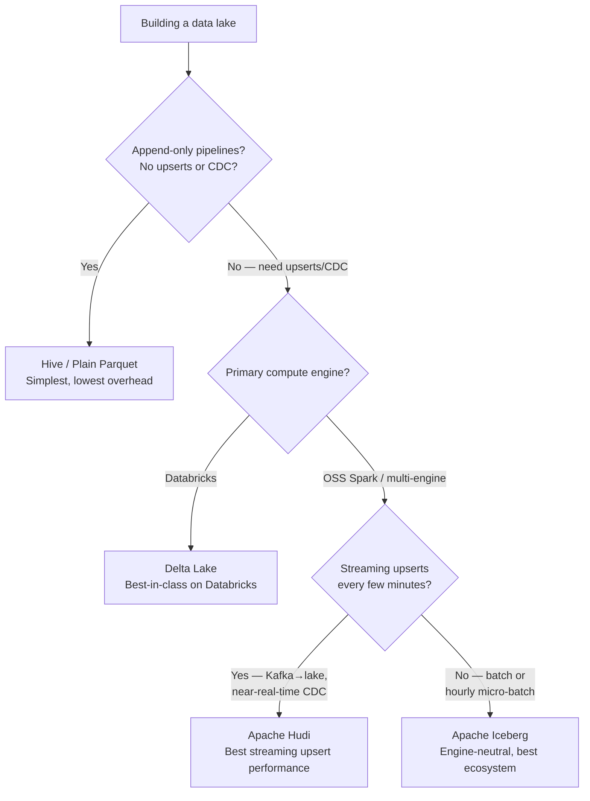

# Choosing Your Data Platform

> Chapter from the Data Engineering Playbook — platform-engineering.

## About This Chapter

**What this is.** A decision guide for picking the storage and compute foundation of a data platform — warehouse vs. lake, and which table format (Hive, Delta, Iceberg, Hudi) to build on. It walks the choices stage by stage as a company grows from gigabytes to petabytes.

**Who it's for.** Data engineers, platform/architecture leads, engineering managers/tech leads, and engineers preparing for senior/staff data-engineering interviews.

**What you'll take away.** By the end you'll be able to:
- Use five upfront questions to decide between a managed warehouse and a data lake, and know when dbt fits (transformation only, never the platform itself).
- Pick a table format deliberately — Hive for append-only, Delta for Databricks CDC, Iceberg for multi-engine, Hudi for streaming upserts — and justify it in a head-to-head comparison.
- Map a progressive architecture to data volume and avoid the classic over- and under-engineering traps and high-cost-to-reverse format mistakes.

---

## TL;DR

- **Start simple.** A startup with < 50 GB of data does not need a data lake — a read replica or Redshift Serverless is enough.
- **Warehouse first, lake later.** If your team is SQL-first and your schema is stable, a managed warehouse (Snowflake or Redshift) gets you to dashboards in days, not months.
- **dbt is not a platform.** dbt is a transformation layer — it runs SQL on top of a warehouse or lake. You need storage and compute first.
- **Lake when volume, variety, or cost forces it.** Once data exceeds ~5 TB, per-TB scan pricing on warehouses becomes painful. Lakes on S3 store data at 1/10th the cost.
- **Table format depends on your engine and workload.** Hive for append-only, Delta for Databricks CDC, Iceberg for multi-engine, Hudi for streaming upserts.
- **The worst mistake:** over-engineering on day one. The second-worst: under-engineering and having to migrate 50 TB later.

---

## The Startup Scenario

Picture a startup that launched 18 months ago. Their product runs on PostgreSQL. It works great — until it doesn't.

| Stage | Symptoms | What's actually happening |
|---|---|---|
| **Stage 0** — 1M rows | Analysts query Postgres directly, dashboards load in 2s | Fine. No problem yet. |
| **Stage 1** — 50M rows | Dashboard queries take 30s; engineers notice prod DB CPU spikes during business hours | Analytics traffic is competing with transactional traffic on the same database |
| **Stage 2** — 500M rows, 3 source systems | Analysts need joins across Postgres, the CRM, and the event stream; nobody can build that query | Data is siloed; no single place to join across systems |
| **Stage 3** — 5B+ events/day | ML team needs feature pipelines; data team has 10 engineers; Snowflake bill hits $15K/month | Scale and cost are now architectural constraints |

Each stage has a different right answer. The mistake is applying a Stage 3 solution at Stage 1, or staying on a Stage 1 solution until Stage 3 forces a painful migration.

---

## Step 1: Answer Five Questions First

Before picking any technology, answer these:

| Question | If Yes → | If No → |
|---|---|---|
| Is your team SQL-only with no Spark experience? | Managed warehouse (Snowflake/Redshift) | Consider a lake |
| Is your schema stable and well-understood? | Warehouse — enforce it | Lake — preserve raw data, model later |
| Do you need to keep raw/unstructured data (JSON logs, clickstream, CDC)? | Data lake | Warehouse is fine |
| Do you need ML feature pipelines or Spark workloads? | Data lake | Warehouse is fine |
| Will your data exceed 10 TB or your warehouse bill exceed $5K/month? | Migrate to a lake for cost | Stay on warehouse |

If you answered "warehouse" to most questions: go to [Option A](#option-a--managed-data-warehouse).
If you answered "lake" to most questions: go to [Option B](#option-b--data-lake).

---

## Option A — Managed Data Warehouse

A data warehouse is a **structured, SQL-queryable store** with schema enforcement, fast query execution, and managed infrastructure. You don't run servers. You write SQL. Analysts are productive on day one.

### Redshift vs Snowflake

| Dimension | Amazon Redshift | Snowflake |
|---|---|---|
| **Compute model** | Always-on clusters (RA3) or Serverless (auto-scales) | Virtual warehouses that auto-suspend when idle |
| **Cost model** | Per-cluster-hour (RA3) or per-RPU-second (Serverless) | Per-credit (compute) + per-TB/month (storage) |
| **Idle cost** | RA3 clusters charge even when idle; Serverless does not | Auto-suspend eliminates idle compute cost |
| **AWS integration** | Native: S3, Glue, EMR, Lambda — zero friction | Works on AWS/GCP/Azure but not AWS-native |
| **Data sharing** | Limited (within AWS account) | First-class: share live data across accounts/companies |
| **Best for** | AWS-committed orgs, predictable batch workloads | Variable workloads, fast start, data marketplace |
| **Watch out for** | RA3 clusters expensive at high concurrency; Serverless has cold-start latency | Credits accumulate fast for always-on workloads; storage pricing adds up |

### When a warehouse is the right call

- Your team writes SQL, not PySpark
- Data is < 5 TB and schema is known upfront
- You need dashboards running in under 2 weeks
- You have < 50 concurrent query users
- You are on AWS and already use S3/Glue (Redshift fits naturally)

### What dbt actually is

dbt (**data build tool**) is frequently misunderstood as a "data platform." It is not.

**dbt is a transformation layer.** It takes SQL `SELECT` statements, compiles them into the right dialect for your target, runs them, and materializes the results as tables or views. It has no storage. It has no compute engine of its own.

```
Without dbt:  raw data in warehouse → analyst writes ad-hoc SQL → inconsistent results
With dbt:     raw data in warehouse → dbt models transform it → clean, tested, versioned tables → analyst queries
```

You need a warehouse (or lake) first. Then dbt models the data inside it. dbt works equally well on Snowflake, Redshift, BigQuery, Spark, and Iceberg — but it always needs something underneath it.

---

## Option B — Data Lake

A data lake stores data in **open file formats (Parquet, ORC, Avro) on object storage (S3, GCS)**. Compute is separate and pluggable — Spark, Trino, Athena, Flink, Presto. You own the infrastructure but gain flexibility, scale, and dramatically lower storage costs.

### Why lakes win at scale

**Storage cost comparison (100 TB):**

| Platform | Monthly storage cost (approx.) |
|---|---|
| Snowflake | ~$2,000–$4,000/mo (compressed TB pricing) |
| Redshift RA3 | ~$1,000–$2,000/mo (managed storage) |
| S3 (lake) | ~$230/mo (standard tier) |

At 100 TB, you're paying ~10× more for storage on a managed warehouse than on a lake. The savings fund the compute layer.

### When to choose a lake over a warehouse

- Raw data must be preserved — compliance, ML model retraining, future schema changes
- Multiple compute engines needed (Spark for batch + Trino for ad-hoc + Flink for streaming)
- Semi-structured or unstructured sources (JSON event logs, CDC streams, clickstream)
- Data will grow beyond 10 TB or 100M events/day
- ML/feature engineering workloads need full row-level access and Python/Spark

### The progressive lake stack

```
Stage 1 (simple):   S3 + Parquet files + Amazon Athena
                    → Query raw files in place; no table format; append-only
                    → Good for: log analysis, quick exploration, < 1 TB

Stage 2 (ACID):     S3 + Delta Lake or Iceberg + Spark on EMR/Databricks
                    → Upserts, MERGE, CDC, schema evolution
                    → Good for: CDC pipelines, SCD2 dimensions, daily batch loads

Stage 3 (governed): Multi-engine catalog (Glue, Nessie) + Iceberg + dbt-spark + streaming
                    → Multiple teams, multiple engines, compliance, real-time
                    → Good for: enterprise data platform, 10+ data engineers
```

---

## Choosing a Table Format

Once you've committed to a lake, the next decision is which table format to build on. This is a **high-cost-to-reverse decision** — migrating 50 TB from Delta to Iceberg mid-flight is painful. Choose deliberately.

### Decision flowchart



---

### Hive / Plain Parquet

**What it is:** Parquet files on S3 with a Hive Metastore (or Glue) tracking partitions. No transaction log. No ACID. Just files.

**Use when:**
- Pipelines are append-only (logs, events, immutable facts)
- Full partition overwrites are acceptable (see [Idempotency — Hive](../../pipeline-patterns/idempotency/README.md))
- You need every engine to read the data without any format dependency
- Cost and simplicity are the top priorities

**Avoid when:**
- You need to update or delete rows (customer records, order corrections)
- Schema will change — adding columns requires manual migration

**Operational overhead:** Low. No compaction jobs, no transaction log to maintain.

---

### Delta Lake

**What it is:** Parquet files + a `_delta_log/` transaction log that records every write as a JSON entry. Enables ACID, MERGE, time-travel, and schema enforcement. Built by Databricks; open-sourced.

**Use when:**
- Your team is on **Databricks** (Delta is the native format; best tooling, best performance)
- You need **CDC-style upserts** (SCD2 dimensions, order corrections, late-arriving data)
- Single compute engine (Spark) is acceptable — you don't need Trino or Flink reading the same tables natively
- You want `MERGE INTO` with the lowest engineering effort

**Avoid when:**
- You need Trino, Flink, or Snowflake to read these tables natively without a Spark intermediary
- You anticipate partition evolution (adding a new partition column requires a full rewrite)

**Operational overhead:** Medium. Compaction (`OPTIMIZE`) and log cleanup (`VACUUM`) must be scheduled.

**Key feature:** `replaceWhere` — atomically replace a single partition without scanning the rest of the table.

See [Delta Lake deep dive](../../lakehouse/delta/README.md).

---

### Apache Iceberg

**What it is:** An open table format with a 4-level metadata tree (catalog → metadata.json → manifest list → data files). Designed from the ground up for **engine neutrality** — any engine that implements the Iceberg spec reads the same table correctly.

**Use when:**
- You need **multiple engines** to read the same tables (Spark writes + Trino queries + Flink streaming reads)
- **Partition evolution** is expected — adding or changing partition columns without rewriting all data
- **Cloud-agnostic** architecture — not locked to AWS or Databricks
- Snowflake or BigQuery needs to query the same lake tables via external table support

**Avoid when:**
- Your team is entirely on Databricks — Delta's native integration is faster to operate
- You don't have the bandwidth to manage metadata maintenance (snapshot expiry, manifest rewriting, compaction) — Iceberg's metadata can bloat significantly without it

**Operational overhead:** Medium-High. Three maintenance jobs must run on schedule: `rewrite_data_files` (compaction), `rewrite_manifests`, `expire_snapshots`.

**Key feature:** Hidden partitioning — the engine handles partition transforms (`days(event_ts)`) automatically; queries never need to know the partition scheme.

See [Apache Iceberg deep dive](../../lakehouse/iceberg/README.md).

---

### Apache Hudi

**What it is:** A table format optimized for **streaming upserts** — ingesting CDC records from Kafka or Debezium at high frequency (every few minutes) while keeping read performance acceptable via Copy-on-Write (CoW) or Merge-on-Read (MoR) table types.

**Use when:**
- You are ingesting **Kafka → lake** with sub-10-minute latency
- Source data is a **CDC stream** (Debezium capturing Postgres changes, for example)
- Downstream consumers need **incremental pull** — Hudi's incremental query API lets consumers read only rows changed since their last checkpoint
- You are on AWS EMR (Hudi is the default table format on EMR)

**Avoid when:**
- Your pipelines are batch (hourly or daily) — Iceberg or Delta have better ecosystems for batch CDC
- You need Trino or non-Spark engines to query the tables — Hudi's multi-engine support is narrower

**Operational overhead:** High. Hudi has the steepest operational learning curve of the four options. Compaction, cleaning, and index management all need tuning.

See [Apache Hudi deep dive](../../lakehouse/hudi/README.md).

---

## Head-to-Head: All Four Formats

| Dimension | Hive / Parquet | Delta Lake | Apache Iceberg | Apache Hudi |
|---|---|---|---|---|
| **ACID / MERGE** | No | Yes | Yes | Yes |
| **Primary write engine** | Any | Spark / Databricks | Spark, Flink | Spark, Flink |
| **Read engines** | All (universal) | Spark (best); Trino/Flink limited | Spark, Trino, Flink, Snowflake, BigQuery | Spark (best); Hive, Trino limited |
| **Schema evolution** | Manual | Yes | Yes — field IDs (safest) | Yes |
| **Partition evolution** | Manual (breaking rewrite) | Limited | Yes — non-breaking | Limited |
| **Streaming upserts** | No | Yes (micro-batch) | Yes (micro-batch) | Best-in-class |
| **Incremental read API** | No | Change data feed | Incremental scan | Native incremental queries |
| **Operational overhead** | Low | Medium | Medium–High | High |
| **Ecosystem** | Universal | Databricks-centric | Broadest (engine-neutral) | AWS / EMR-centric |
| **Best for** | Append-only, cost-first | Databricks CDC / SCD2 | Multi-engine, cloud-agnostic | Kafka→lake, real-time CDC |

---

## Progressive Architecture by Stage

| Stage | Data volume | Recommended stack | Rationale |
|---|---|---|---|
| **Early startup** | < 50 GB | PostgreSQL read replica or Redshift Serverless | No infra ops; SQL-ready in hours; analysts productive immediately |
| **Growing** | 50 GB – 5 TB | Snowflake or Redshift + dbt | Managed warehouse; dbt models clean it up; no infra team needed |
| **Scaling** | 5 TB – 100 TB | S3 + Delta or Iceberg + Spark (EMR or Databricks) + dbt-spark | Cost savings from S3; ACID upserts; ML-ready; dbt still handles transformations |
| **Enterprise** | 100 TB+ | S3 + Iceberg + multi-engine catalog (Glue or Nessie) + streaming | Engine neutrality, governance, compliance, real-time pipelines |

---

## Anti-Patterns

| Anti-pattern | What you'll observe | The fix |
|---|---|---|
| **"We'll just use dbt"** | dbt has nowhere to run — no compute, no storage | Choose a warehouse or lake first; dbt transforms data inside it |
| **Building a lake when you need dashboards in 2 weeks** | Weeks of infra setup before first query | Start with Snowflake/Redshift Serverless; migrate to lake when scale demands it |
| **Picking Hudi for a batch daily pipeline** | Operational complexity with no benefit over Delta/Iceberg | Use Delta or Iceberg for batch; save Hudi for streaming CDC |
| **Iceberg without a catalog** | Engines see different versions of the same table | Set up Glue or Nessie catalog before the first write; retrofitting is painful |
| **Plain Parquet with upserts** | Hand-rolled partition overwrite logic that breaks on retry | Migrate to Delta or Iceberg; let the format handle MERGE |
| **Snowflake forever past 100 TB** | Storage bill exceeds engineering cost of a lake migration | Plan the migration before you're forced into it by budget |

---

## Interview & Architecture-Review Talking Points

- **"Why would you choose a lake over a warehouse?"** — Cost at scale, engine flexibility, raw data preservation, and streaming ingestion. A 100 TB lake on S3 costs ~$230/mo in storage; the same on Snowflake is ~$2,000+.
- **"What's dbt's role in a data platform?"** — Transformation only. It compiles SQL models and materializes them in your warehouse or lake. It has no storage or compute of its own.
- **"When would you choose Iceberg over Delta?"** — When multiple engines (Spark + Trino + Flink) need to read the same tables, or when partition evolution is required. For a Databricks-only shop, Delta's native integration is hard to beat.
- **"When is Hudi the right choice?"** — Streaming CDC ingestion at sub-10-minute latency, especially Kafka → lake pipelines. Its incremental query API also lets downstream consumers read only changed rows since their last checkpoint.
- **"What's the biggest migration risk when choosing a table format?"** — Partition scheme and business key design. Both are expensive to change after data is at scale. Choose deliberately and document the decision as an ADR. See [decision records](../../engineering-leadership/decision-records/README.md).

---

## Further Reading

- [Delta Lake deep dive](../../lakehouse/delta/README.md)
- [Apache Iceberg deep dive](../../lakehouse/iceberg/README.md)
- [Apache Hudi deep dive](../../lakehouse/hudi/README.md)
- [Idempotency in Pipelines — Hive patterns](../../pipeline-patterns/idempotency/README.md)
- [FinOps: Cost Optimization](../../finops/cost-optimization/README.md)
- [Architecture Decision Records](../../engineering-leadership/decision-records/README.md)
