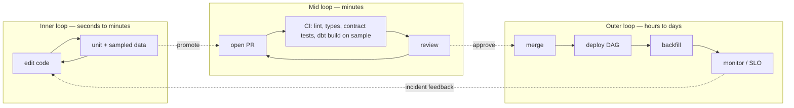

# Developer Experience for Data Platforms

> Chapter from the **Data Engineering Playbook** — platform-engineering.

Developer experience (DevEx) for a data platform is the measured friction between a data engineer's intent and a correct, observable pipeline running in production. On data platforms it is harder than on application platforms, because the inner loop is slow (a Spark job takes minutes to fail), the failure surface is wide (schema, skew, late data, IAM, quota), and the feedback is often a stack trace from a JVM you didn't write. This chapter is about collapsing that loop.

## TL;DR

- The metric that matters is **inner-loop latency**: time from a code edit to a trustworthy pass/fail signal. On data teams this is routinely 8–20 minutes (submit to YARN/K8s, pull image, read S3, fail on row 4M). Drive it under 90 seconds with local sampled data and you change how people work.
- **Time-to-first-pipeline** (onboarding to merged, scheduled, monitored job) is the leading indicator of platform health. Measure it in hours, not story points. If it's > 1 day, your platform has a documentation or scaffolding gap, not a tooling gap.
- DevEx is an **SLO-bearing product**, not a wiki. Treat `time-to-first-pipeline`, `inner-loop p50/p90`, and `CI false-failure rate` as numbers you own and regress against.
- The single highest-leverage investment is **local/CI parity** — the same image, the same catalog client, the same data contracts in `pytest` as in prod. Without it, "works on my laptop" becomes a production incident.
- Error messages are a feature. A raw `Py4JJavaError` with 200 lines of Scala is a DevEx defect; a one-line "partition column `event_date` missing, did you forget `--conf spark.sql.sources.partitionOverwriteMode=dynamic`?" is a fix.
- Friction compounds. A 12-minute inner loop run 15× a day is 3 hours of an engineer staring at logs — per engineer, per day.

## Why this matters in production

A concrete scenario. A new engineer joins the marketing-analytics squad. Their first task: add a `is_trial_conversion` column to the `fct_subscription_events` Iceberg table. Sounds like a one-day task. What actually happens on a platform with poor DevEx:

1. Day 1–2: chase down which AWS account, which Glue catalog, which Airflow instance. Find the repo by asking in Slack.
2. Day 3: clone, `pip install`, hit a dependency conflict because the repo pins `pyspark==3.3.1` but the shared wheel is `3.5.0`. No `Dockerfile` that matches prod.
3. Day 4: write the transform, submit to a dev EMR cluster, wait 14 minutes, fail with `AnalysisException: cannot resolve 'event_date'` — because the dev cluster reads a stale catalog snapshot. Repeat 6 times.
4. Day 7: open a PR. CI flakes twice on an unrelated table's schema test. Reviewer asks "where's the data quality check?" — which no one documented as required.
5. Day 9: merged. The Airflow DAG isn't wired to alerting because that's a separate, undocumented step. The first prod failure pages no one.

Nine days for a one-column change, and a silent monitoring gap shipped to prod. None of those nine days were spent on the actual business logic. That is the problem DevEx engineering solves: every step above is a removable friction point, and each one is measurable.

The reason this matters at principal scope: friction is regressive. Senior engineers route around it (they have tribal knowledge, side-channel access, a working laptop from 2 years ago). New and mid-level engineers absorb the full cost. So bad DevEx silently lowers your effective hiring bar and your team's bus factor at the same time.

## How it works

DevEx is engineered across three loops with very different time constants. The discipline is knowing which loop a given pain lives in, because the fixes are different.



The governing equation is simple. If `N` is daily iterations and `L` is loop latency, the cost of a loop is `N × L` engineer-minutes, and the *value* of an optimization is `N × ΔL`. This is why the inner loop dominates: `N` is large (dozens per day) and `L` is the thing you can cut by 10×. Optimizing the outer loop (deploy takes 8 min vs 5 min) has low `N` and rarely moves the needle.

Two structural ideas underpin everything else:

**Parity.** The artifact and its dependencies must be identical across local, CI, and prod. The mechanism is a single pinned image (`data-platform-base:2024.11`) plus a locked dependency set (`uv.lock` / `poetry.lock`), referenced by digest, not tag. The same Iceberg/Glue catalog client, the same Spark version, the same Python. When parity holds, a green local test is a real signal. When it doesn't, the inner loop produces false confidence — worse than no signal.

**Sampling with shape preservation.** You cannot run the inner loop on 4 TB. You run it on a deterministic sample that preserves schema and the distributions that matter (skew keys, nulls, late-arriving partitions). The sample is generated from prod with PII redaction and checked into a fixtures layer or a `dev` catalog namespace. Done right, a transform that passes on the sample passes on prod logic; only volume- and cost-related behavior (shuffle spill, AQE coalescing) is left for the mid/outer loops.

## Deep dive

This is where data-platform DevEx diverges from generic SRE/platform advice, and where teams get it wrong.

### The inner loop is the whole game, and Spark fights you on it

The default Spark inner loop is hostile: JVM startup, executor allocation, S3 listing, and the fact that errors surface at *action* time, not at the line you wrote. Three things actually move it:

- **Run Spark in local mode against sampled Parquet/Iceberg in `pytest`.** `SparkSession.builder.master("local[2]")` with a 50–200 MB fixture starts in ~3–5 s and exercises Catalyst, the real DataFrame API, and your UDFs. This catches 80%+ of logic and schema bugs before any cluster. See [spark-internals/catalyst](../../spark-internals/catalyst/README.md) for why local mode reproduces the optimizer faithfully and [spark-internals/aqe](../../spark-internals/aqe/README.md) for what it does *not* reproduce (runtime skew handling).
- **Make schema a fast-fail.** The most common 14-minute failure is a schema mismatch that's knowable in milliseconds. Load the contract (a `pydantic` model, an Iceberg schema, or a `.avsc`) and validate the DataFrame schema *before* you trigger the heavy action. Fail in the IDE, not on the cluster.
- **Cache the warm session.** In a test suite, a session-scoped `SparkSession` fixture amortizes JVM startup across the whole file. Re-creating it per test turns a 20 s suite into a 4 min suite.

### Error messages are an interface you own

A platform team's leverage point is the wrapper, not the engine. Engineers don't read Spark's source; they read the first 5 lines of the traceback. You can intercept the most common failure signatures and rewrite them:

| Raw signature | What the engineer should see |
|---|---|
| `Py4JJavaError ... AnalysisException: cannot resolve 'event_dt'` | `Column 'event_dt' not found. Closest match in fct_orders: 'event_date'. Did you typo it?` |
| `org.apache.spark.SparkException: Job aborted ... ExecutorLostFailure (out of memory)` | `Executor OOM on stage 7 (a join). Likely skew on join key. See skew-handling runbook; try salting or broadcast.` |
| `ParquetDecodingException` mid-job | `Corrupt/mismatched Parquet file at s3://.../part-00042. A schema evolved without a migration. Run the contract check.` |
| `AccessDenied` from S3 | `Your role lacks s3:GetObject on the bronze bucket. Request access via the platform CLI: \`dpctl access request bronze-read\`.` |

This is not cosmetic. The difference between a 30-minute self-serve fix and a 3-hour Slack escalation is the quality of that first line.

### Local/CI parity is a contract, and it leaks in specific places

Parity always breaks at the boundaries, and you should pre-empt each one:

- **Catalog state.** Local tests use an isolated catalog (a temp Hadoop/Hive catalog or a per-PR Iceberg namespace). Sharing a dev catalog means two engineers' tests stomp on each other's schemas — the classic intermittent CI failure. Give every test run its own namespace, torn down after.
- **Time and "now".** Pipelines that read `current_date()` or `CURRENT_TIMESTAMP` are non-deterministic and flake in CI at midnight UTC. Inject a logical execution date (`ds` / `logical_date`) everywhere; ban wall-clock reads in transforms.
- **Credentials.** Prod uses IRSA/instance roles; laptops use SSO tokens; CI uses an OIDC-federated role. The *code* must not care — abstract behind a credential provider so the same code path runs in all three.
- **Data volume behavior.** Sampled data hides skew, spill, and AQE coalescing. Be explicit that the inner loop validates *logic*, and that volume behavior is a mid-loop concern validated on a staging-scale dataset. Don't pretend the sample tests performance.

### Onboarding is the highest-signal benchmark you have

`time-to-first-pipeline` — laptop unboxed to a merged, scheduled, monitored job — is the single best aggregate DevEx metric, because a new hire hits *every* friction point with zero tribal knowledge. Instrument it. Have each new engineer log timestamps at: environment ready, first local test green, first PR opened, first merge, first prod run, first alert configured. The longest gap is your next quarter's roadmap. The companion [self-service-platforms](../self-service-platforms/README.md) and [golden-paths](../golden-paths/README.md) chapters cover the scaffolding that compresses these gaps; this chapter is about *measuring* them so you know which to attack.

### The cost of context switching

A 12-minute inner loop doesn't cost 12 minutes — it costs 12 minutes *plus* the re-immersion cost when the engineer's attention has wandered to Slack. Empirically, loops longer than ~3–4 minutes cause task-switching; loops under ~30 seconds keep flow. This is why cutting an inner loop from 12 min to 8 min feels like nothing, but cutting it from 8 min to 45 s is transformational. The threshold, not the linear reduction, is what matters.

## Worked example

A self-contained pattern that gives a fast, parity-respecting inner loop for a Spark/Iceberg transform. Two files: the transform and its test. The test runs in ~5 s locally and unchanged in CI.

```python
# transforms/subscription_events.py
from pyspark.sql import DataFrame, functions as F

EXPECTED_COLS = {"user_id", "event_date", "plan_tier", "is_trial_conversion"}

def build_subscription_events(raw: DataFrame, logical_date: str) -> DataFrame:
    """Pure function: DataFrame in, DataFrame out. No catalog reads, no current_date()."""
    out = (
        raw
        .filter(F.col("event_date") == F.lit(logical_date))   # injected ds, never wall-clock
        .withColumn(
            "is_trial_conversion",
            (F.col("prev_plan") == "trial") & (F.col("plan_tier") != "trial"),
        )
        .select("user_id", "event_date", "plan_tier", "is_trial_conversion")
    )
    # Fast-fail schema check BEFORE any heavy action downstream.
    missing = EXPECTED_COLS - set(out.columns)
    if missing:
        raise ValueError(f"Contract violation: missing columns {missing}")
    return out
```

```python
# tests/test_subscription_events.py
import pytest
from pyspark.sql import SparkSession
from transforms.subscription_events import build_subscription_events

@pytest.fixture(scope="session")          # amortize JVM startup across the file
def spark():
    s = (
        SparkSession.builder
        .master("local[2]")
        .appName("inner-loop")
        .config("spark.sql.shuffle.partitions", "4")    # tiny data, no 200-partition shuffle
        .config("spark.ui.enabled", "false")            # shave startup
        .getOrCreate()
    )
    yield s
    s.stop()

def test_trial_conversion_flagged(spark):
    raw = spark.createDataFrame(
        [
            ("u1", "2026-06-18", "trial", "pro"),     # converted
            ("u2", "2026-06-18", "trial", "trial"),   # still trial
            ("u3", "2026-06-17", "trial", "pro"),     # wrong partition, filtered out
        ],
        ["user_id", "event_date", "prev_plan", "plan_tier"],
    )
    out = build_subscription_events(raw, logical_date="2026-06-18").collect()
    by_user = {r["user_id"]: r["is_trial_conversion"] for r in out}
    assert by_user == {"u1": True, "u2": False}       # u3 correctly excluded
```

The CI step is the same command, run in the same pinned image:

```yaml
# .github/workflows/pr.yml (excerpt)
jobs:
  inner-loop:
    runs-on: ubuntu-latest
    container:
      image: ghcr.io/org/data-platform-base@sha256:9c1f...   # digest, not tag → parity
    steps:
      - uses: actions/checkout@v4
      - run: uv sync --frozen                  # exact locked deps, same as prod
      - run: uv run pytest tests/ -q --maxfail=1
      - run: uv run dpctl contract check transforms/  # schema vs Iceberg catalog contract
```

The scaffold a `dpctl new transform` command generates — the transform stub, the test with a sampled fixture, the DAG entry with alerting pre-wired — is what a [golden path](../golden-paths/README.md) provides. DevEx work is making sure that scaffold runs green in under a minute on a fresh checkout.

## Production patterns

- **Ship a CLI, not a wiki.** `dpctl new transform`, `dpctl test --sample`, `dpctl access request`, `dpctl deploy --dry-run`. A CLI is testable, versionable, and discoverable (`--help`); a wiki rots. The CLI is the API to your platform; treat it like one.
- **Per-PR ephemeral data namespaces.** Each PR gets an isolated Iceberg namespace (`pr_1234.*`) seeded from sampled prod, torn down on merge/close. Eliminates the "two PRs touched the same dev table" flake class entirely.
- **Golden fixtures generated from prod, redacted, version-controlled.** A nightly job samples prod (stratified on skew keys and null patterns), redacts PII, and publishes a versioned fixture set. Tests pin a fixture version so a fixture refresh can't silently break CI.
- **Error-message middleware.** A thin wrapper around job submission that pattern-matches the top N failure signatures and rewrites them with an actionable next step and a runbook link. Track which messages fire most; those are your next docs/automation targets.
- **Inner-loop budget as a CI gate.** Fail CI (or warn loudly) if the test suite exceeds a wall-clock budget, e.g. 3 minutes. This keeps the inner loop fast as the suite grows, the same way you'd guard a latency SLO.
- **One command to reproduce a prod failure locally.** `dpctl repro --run-id <airflow_run>` pulls the failing run's sampled inputs and config into a local session. The gap between "it failed in prod" and "I can debug it on my laptop" should be one command.

## Anti-patterns & failure modes

| Anti-pattern | Symptom you'd observe | Fix |
|---|---|---|
| **No local/CI/prod parity** (laptop has different Spark/Python) | "Passes locally, fails in prod" recurring; reviewers can't trust green CI | Single pinned base image by digest; locked deps (`uv.lock`); same catalog client everywhere |
| **Inner loop requires a real cluster** | Engineers iterate by submitting to dev EMR; 12-min feedback; context switching to Slack between runs | Local-mode Spark on sampled fixtures; reserve clusters for mid/outer loop only |
| **Wall-clock reads in transforms** (`current_date()`) | CI flakes at midnight UTC; backfills produce wrong results | Inject `logical_date`/`ds`; lint-ban wall-clock calls in transform modules |
| **Shared mutable dev catalog** | Intermittent CI failures, "someone changed the schema" | Per-PR ephemeral namespaces, torn down after |
| **Raw engine errors surfaced to users** | Slack flooded with pasted `Py4JJavaError`; same questions weekly | Error-message middleware mapping signatures → actionable fixes + runbooks |
| **Sampled data treated as a perf test** | Skew/OOM ships to prod despite green tests; "but it passed!" | Document that inner loop tests logic only; gate volume behavior on staging-scale data |
| **Onboarding lives in tribal knowledge** | `time-to-first-pipeline` is 1–2 weeks; same setup questions per hire | `dpctl init`; measure the metric; attack the longest gap |
| **DevEx with no metrics** | Platform team argues from anecdote; can't prioritize | Instrument inner-loop latency, CI false-failure rate, time-to-first-pipeline; review monthly |

The most insidious failure is the **green-but-meaningless test suite**: parity has quietly drifted, so tests pass while prod behaves differently. The symptom is rising "passes locally, breaks in prod" tickets *despite* high test coverage. The fix is to treat parity drift as a P2 incident, not a chore — pin by digest and alert when the prod image and CI image diverge.

## Decision guidance

| Situation | Recommendation |
|---|---|
| Inner loop > 5 min and engineers submit to clusters to iterate | **Invest first.** Local-mode Spark + sampled fixtures. Highest ROI by far (large `N`). |
| "Passes locally, fails in prod" tickets recurring | Fix **parity** before anything else; green tests are currently lying. |
| Onboarding takes > 1 day to first merged pipeline | Build/measure **time-to-first-pipeline**; pair with [golden-paths](../golden-paths/README.md) scaffolding. |
| Same support questions repeat in Slack weekly | **Error-message middleware** + CLI; encode each repeated question as an actionable error or command. |
| Small team (< 5), one product, low churn | Don't over-build. A good `Makefile`, pinned deps, and sampled fixtures may be enough; a full `dpctl` is premature. |
| Many teams, polyglot, high churn | Full self-service platform — see [self-service-platforms](../self-service-platforms/README.md). DevEx tooling becomes a product with its own SLOs. |
| Deploy is slow but iteration is fast | Lower priority. Outer-loop `N` is small; optimize only if deploys block releases. |

The trap is optimizing the loop you can see (deploys, dashboards) instead of the loop that costs the most (inner iteration). Measure `N × L` per loop before choosing where to spend.

## Interview & architecture-review talking points

- "DevEx is an SLO-bearing product. I own three numbers: inner-loop p90, CI false-failure rate, and time-to-first-pipeline. I can show you the trend and the work that moved each one."
- "I optimize the inner loop first because `value = N × ΔL`, and the inner loop has the largest `N`. Cutting a 12-minute Spark-on-cluster loop to a 45-second local-mode loop changed how the team worked — it crossed the flow threshold, not just the linear one."
- "Parity is a contract enforced by a digest-pinned image and locked deps. When parity drifts, green CI lies, so I alert on image divergence and treat drift as an incident."
- "Error messages are an interface the platform team owns. We wrap the top failure signatures and rewrite them into one actionable line plus a runbook link; that's the difference between a 30-minute self-serve fix and a 3-hour escalation."
- "Sampled fixtures validate logic, not volume. I'm explicit that skew and OOM are mid-loop concerns on staging-scale data — I don't let a green sampled test masquerade as a performance guarantee." (Ties to [spark-internals/skew-handling](../../spark-internals/skew-handling/README.md).)
- On scope: "For a 4-person team I'd ship a Makefile and fixtures, not a CLI platform. DevEx investment scales with team count and churn, not with ambition."

## Further reading

- [platform-engineering/golden-paths](../golden-paths/README.md) — the paved-road scaffolding that compresses the loops measured here.
- [platform-engineering/self-service-platforms](../self-service-platforms/README.md) — when DevEx tooling becomes a product with its own SLOs.
- [spark-internals/catalyst](../../spark-internals/catalyst/README.md) — why local-mode Spark faithfully reproduces optimizer behavior in the inner loop.
- [spark-internals/aqe](../../spark-internals/aqe/README.md) and [spark-internals/skew-handling](../../spark-internals/skew-handling/README.md) — the volume-dependent behavior the inner loop cannot reproduce.
- [observability/monitoring](../../observability/monitoring/README.md) — wiring alerting into the outer loop so a merged pipeline is actually watched.
- Nicole Forsgren, Jez Humble, Gene Kim — *Accelerate* (2018): the empirical link between lead time / deployment frequency and organizational performance.
- Abi Noda et al. — *DevEx: What Actually Drives Productivity* (ACM Queue, 2023): feedback loops, cognitive load, and flow state as the three measurable dimensions of developer experience.
