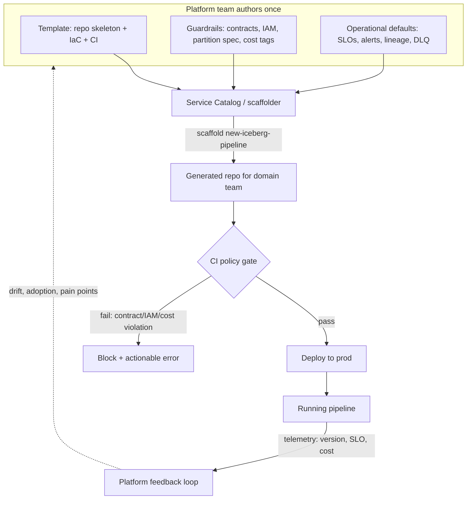

# Golden Paths

> Chapter from the Data Engineering Playbook — platform-engineering.

A golden path is the opinionated, supported route from "I have an idea for a pipeline" to "it is running in production with SLOs, lineage, alerts, and cost tags" — without the engineer having to assemble those pieces by hand. It is not a tutorial and it is not a wiki page. It is executable scaffolding plus enforced guardrails plus a default operational posture, delivered as one artifact.

## TL;DR

- A golden path is a **generated, opinionated stack** (repo + CI + deploy + observability + governance) that a domain team gets in minutes, not a document they read. The output is a running pipeline, not a checklist.
- Golden paths win by being the path of *least resistance*, not the path of *least power*. If the supported route is harder than rolling your own, engineers fork off it and you lose the leverage. Measure adoption, not mandate compliance.
- The hard engineering is in the **guardrails that travel with the path**: schema contracts, partition layout, table maintenance, IAM scoping, and cost tags baked into the template so they are correct by construction.
- A path must support a clean **escape hatch with a graduated exit**. Teams that outgrow the template should be able to eject specific layers without rewriting everything, and the platform should still see them.
- The number that matters is **time-to-first-production-pipeline** and the percentage of pipelines that stay on the supported version. Track template version drift like you track dependency CVEs.
- Golden paths are versioned software with a deprecation policy. The day you ship `v1` you owe consumers a migration story for `v2`.

## Why this matters in production

Picture a 40-engineer data org with eight domain teams. Without a golden path, every team that needs a new Iceberg ingestion pipeline rediscovers the same decisions: which catalog, what partition spec, how to wire Airflow, how to emit OpenLineage events, what the on-call alert thresholds should be, how to tag spend for FinOps. Each team gets 70% of it right. The other 30% is where the incidents live:

- Team A partitions a 4 TB fact table by `event_timestamp` to the second, creating 11 million tiny files. Their `MERGE` jobs go from 6 minutes to 50 minutes over a quarter and nobody notices until the SLA breaks.
- Team B grants their Glue job role `s3:*` on the whole data bucket because the docs were vague, and a security review six months later flags it as a finding.
- Team C ships a Kafka consumer with no DLQ, so one poison message at 2 a.m. silently halts the partition and the gap is discovered three days later by a finance analyst.
- Nobody tagged their EMR clusters, so the $180K/month bill is a single undifferentiated line item and the FinOps team can't attribute it.

None of these are exotic failures. They are the *default* failures of letting smart people each solve a solved problem under deadline pressure. A golden path is how a platform team encodes "the way we already know works" so that the 30% is correct by construction. The platform team writes the partition strategy, the IAM policy, and the DLQ wiring *once*, tests it, and ships it as a template. Eight teams inherit it for free.

The principal-level insight: golden paths are a **leverage multiplier on scarce senior judgment**. The decisions above are exactly the ones junior and mid-level engineers get wrong, and exactly the ones a principal can't personally review on every pipeline. Encoding them into the path is how one senior engineer's judgment scales to 40 people's output. See [self-service-platforms](../self-service-platforms/README.md) for the platform-vs-domain ownership model this rests on, and [developer-experience](../developer-experience/README.md) for the friction metrics that tell you whether the path is actually being used.

## How it works

A golden path has three layers that must ship together. Ship only the template and you get a nice starter that rots. Ship only the guardrails and you get a bureaucratic gate that teams route around. The value is in the composition.



**Layer 1 — Scaffolding.** A scaffolder (Backstage software templates, Cookiecutter, `copier`, or an internal CLI) materializes a working repo from parameters: pipeline name, source, target table, owning team, PagerDuty service. The output already compiles, already has CI, already deploys to a sandbox. The engineer fills in transformation logic, not infrastructure.

**Layer 2 — Guardrails.** Policy that travels with the generated code and is enforced in CI, not in a review meeting. Examples: the generated Iceberg DDL is validated against the partition-spec linter; the Terraform IAM policy is checked against an OPA/Conftest rule that forbids wildcard resource ARNs; every deployable resource must carry a `cost-center` and `team` tag or the plan fails.

**Layer 3 — Operational defaults.** The pipeline ships with monitoring, alerting, lineage emission, and a DLQ already wired. A freshness SLO and a row-count anomaly check exist on day one because the template generated them, not because someone remembered to add them.

The economic model is simple. Let *N* be the number of pipelines and *c* the per-pipeline cost of getting the operational layer right by hand. Without a path, total cost is `N · c` and quality variance is high. With a path, the platform team pays `c_path` once to author it plus a small marginal `c_use` per scaffold:

```
cost_handrolled = N · c
cost_golden_path = c_path + N · c_use      where c_use ≪ c
```

The crossover is at `N > c_path / (c − c_use)`. For anything but a handful of pipelines, the path wins — *and* the variance collapses because every pipeline got the same vetted defaults. The trap is authoring `c_path` so high (over-engineered, hard to use) that `c_use` stops being `≪ c` and teams defect.

## Deep dive

### The path must be the easiest option, or it is dead

This is the single most-violated principle. A golden path competes against the alternative of an engineer wiring it themselves, and engineers are ruthless optimizers under deadline. If `scaffold new-pipeline` produces something they then have to fight — undocumented magic, a 12-field wizard, a generated repo that doesn't actually run — they will copy last quarter's pipeline instead. Now you have a *bronze* path (the most-copied unsupported pipeline) that the platform team doesn't even know exists.

Measure this directly. The KPIs are **time-to-first-green-deploy** from a clean scaffold and **the share of production pipelines on the current or N-1 template version**. If 40% of pipelines were never scaffolded from your template, your path isn't golden, it's aspirational.

### Guardrails belong in CI, not in human review

A guardrail enforced by "the platform team reviews every PR" does not scale and creates a bottleneck that itself drives defection. Guardrails must be *machine-checked policy*. Conftest/OPA over the Terraform plan, a custom linter over the Iceberg partition spec, a schema-registry compatibility check in the pipeline's CI. The error must be **actionable**: not "policy violation 7.3.1" but "IAM policy grants `s3:*` on `arn:aws:s3:::lake-prod/*`; scope it to `arn:aws:s3:::lake-prod/domain=payments/*` — see the generated `iam.tf` line 22."

### Partition layout is the most common silently-wrong default

The template's choice of partition spec is doing real engineering work. Hour-granularity partitioning on a high-cardinality timestamp on a table that gets thousands of small writes per hour produces the small-files problem; day-granularity with hidden partitioning (`days(event_ts)`) plus a scheduled compaction job is the safe default for most append-heavy fact tables. The template should also generate the maintenance jobs — `rewrite_data_files`, `expire_snapshots`, `rewrite_manifests` — because "Iceberg table with no maintenance" is a time bomb the domain team won't see for a quarter. See [lakehouse/iceberg](../../lakehouse/iceberg/README.md) and [spark-internals/partitioning](../../spark-internals/partitioning/README.md) for the mechanics the default is encoding.

### The escape hatch is a first-class feature, not a failure

Some teams will legitimately outgrow the path: a streaming team needs sub-second latency the batch template can't give; a team needs a partition scheme the linter forbids for good reason. If your only options are "fully on the golden path" or "fully off it and invisible," teams that need one exception go dark entirely. Design for **graduated ejection**: a team can override the partition spec while still inheriting the IAM, cost-tagging, and lineage layers. The override is explicit (a documented flag, an ADR), so the platform still sees them and they still get most of the guardrails. A path with no exit becomes a cage, and engineers escape cages completely.

### Versioning and drift are the long-tail cost

The moment you have 30 pipelines on `v1` of a template and you ship `v2` with a fixed IAM policy, you own a fleet migration. You cannot regenerate other teams' repos — they've added business logic. The realistic mechanisms:

- **Template version stamping**: every scaffolded repo records `golden_path_version` in a manifest. A dashboard shows the version distribution across the fleet — this is your "patch level."
- **Layered updates**: keep the guardrail layer (IAM modules, CI policy, base Docker image) as *versioned dependencies* the generated repo references, so a security fix is a dependency bump (`renovate`/Dependabot PR) rather than a regeneration.
- **Forced upgrades on triggers**: a CVE in the base image or a critical IAM finding warrants an org-wide forced bump with a deadline. Routine improvements get a soft deprecation window.

The teams that skip version stamping discover, during an incident, that they have no idea which pipelines have the bad default.

## Worked example

A `copier` template that scaffolds an Iceberg batch-ingestion pipeline with guardrails baked in. The platform team maintains this; a domain engineer runs one command.

```yaml
# copier.yml — the golden path's parameter surface (kept deliberately small)
pipeline_name:
  type: str
  help: "kebab-case, e.g. payments-events-ingest"
  validator: "must be kebab-case"
owning_team:
  type: str
  help: "Maps to cost-center tag and PagerDuty service"
target_table:
  type: str
  help: "catalog.namespace.table, e.g. prod.payments.events"
freshness_slo_minutes:
  type: int
  default: 60
partition_grain:
  type: str
  choices: [day, hour]
  default: day        # day is the safe default; hour requires an ADR + override flag
```

The template emits a partition spec that is correct by construction — hidden partitioning so queries don't need to know the layout, plus the maintenance jobs:

```sql
-- {{ target_table }}.ddl.sql  (generated)
CREATE TABLE {{ target_table }} (
  event_id      STRING NOT NULL,
  account_id    STRING NOT NULL,
  event_type    STRING,
  amount        DECIMAL(18,2),
  event_ts      TIMESTAMP NOT NULL,
  _ingest_ts    TIMESTAMP NOT NULL
)
USING iceberg
PARTITIONED BY ({{ 'days' if partition_grain == 'day' else 'hours' }}(event_ts))
TBLPROPERTIES (
  'write.target-file-size-bytes' = '536870912',     -- 512 MB, avoids small files
  'write.distribution-mode'      = 'hash',
  'format-version'               = '2'
);
```

```python
# maintenance.py (generated) — runs nightly, no domain action required
spark.sql(f"""
  CALL prod.system.rewrite_data_files(
    table => '{TARGET_TABLE}',
    options => map('target-file-size-bytes','536870912','min-input-files','5'))
""")
spark.sql(f"""
  CALL prod.system.expire_snapshots(
    table => '{TARGET_TABLE}',
    older_than => TIMESTAMP '{retention_cutoff}',
    retain_last => 10)
""")
spark.sql(f"CALL prod.system.rewrite_manifests(table => '{TARGET_TABLE}')")
```

The IAM is scoped, not wildcard, and the guardrail is enforced in CI:

```hcl
# iam.tf (generated) — resource scoped to the team's prefix, never s3:*
data "aws_iam_policy_document" "pipeline" {
  statement {
    actions   = ["s3:GetObject", "s3:PutObject", "s3:DeleteObject"]
    resources = ["arn:aws:s3:::lake-prod/${var.namespace}/*"]
  }
}
```

```rego
# policy/iam.rego — Conftest gate, runs in CI on the terraform plan JSON
package main
deny[msg] {
  r := input.resource_changes[_]
  r.type == "aws_iam_policy"
  contains(r.change.after.policy, "\"s3:*\"")
  msg := sprintf("IAM policy %s uses s3:* wildcard; scope to the team prefix", [r.address])
}
deny[msg] {
  r := input.resource_changes[_]
  not r.change.after.tags["cost-center"]
  msg := sprintf("%s missing required cost-center tag", [r.address])
}
```

The operational layer is generated too — a freshness SLO check and lineage emission the engineer never wrote:

```python
# quality_checks.py (generated)
assert_freshness(
    table=TARGET_TABLE,
    ts_column="_ingest_ts",
    max_lag_minutes={{ freshness_slo_minutes }},
    on_breach=pagerduty_service("{{ owning_team }}"),
)
emit_openlineage(job=PIPELINE_NAME, inputs=SOURCES, outputs=[TARGET_TABLE])
```

What the engineer actually does:

```bash
copier copy git@internal:platform/golden-paths/iceberg-ingest.git ./payments-events-ingest
# answer 5 prompts → working repo with CI, IAM, partition spec, maintenance,
# freshness SLO, lineage, cost tags. git push → green pipeline in sandbox.
```

The 30% that teams normally get wrong is now in the template, tested once by the platform team.

## Production patterns

- **Golden path as a paved road with a measured shoulder.** Allow override flags (e.g. `partition_grain=hour`) but require they be explicit and recorded. The path stays opinionated; the exit stays visible.
- **Guardrails as versioned dependencies, scaffolding as one-time generation.** The base image, IAM modules, and CI policy bundle are pulled by version so security fixes propagate via a dependency bump. The repo skeleton is generated once. This is what makes fleet-wide patching tractable.
- **Reference implementation in the same repo as the template.** Maintain one canonical pipeline scaffolded from the path and kept green in CI. It is your regression test for the template and your living documentation. If the reference breaks, the path is broken.
- **Adoption telemetry baked into the generated pipeline.** Every scaffolded pipeline phones home its `golden_path_version`, freshness-SLO attainment, and monthly cost. The platform team's dashboard is the org's pipeline patch-level and a heatmap of where the path causes pain.
- **Office hours over mandates.** Pair the path with a weekly slot where domain teams bring the cases the path doesn't cover. Those cases are your `v2` backlog. A path that never changes is a path drifting away from what teams need.

## Anti-patterns & failure modes

| Anti-pattern | Symptom you observe | Fix |
|---|---|---|
| Path harder to use than rolling your own | <60% of prod pipelines were scaffolded from the template; teams copy an old repo | Cut the parameter surface, make the scaffold actually run on first try, measure time-to-green |
| Guardrails enforced by human review | Platform team is the PR bottleneck; teams batch changes to avoid review | Move every guardrail into machine-checked CI policy (OPA/Conftest, linters, schema-registry checks) |
| No escape hatch | A team with a legit exception forks off entirely and goes invisible | Add explicit, recorded override flags; let teams eject one layer while keeping the rest |
| No version stamping | During an incident, nobody knows which pipelines have the bad default | Stamp `golden_path_version` in a manifest; build a fleet version dashboard |
| Template generates an Iceberg table with no maintenance jobs | `MERGE`/`SELECT` latency creeps up over a quarter; millions of small files | Generate `rewrite_data_files` / `expire_snapshots` / `rewrite_manifests` as part of the scaffold |
| Wildcard IAM in the template | Security review finds over-permissioned roles fleet-wide | Scope to team prefix in the generated `iam.tf`; deny `s3:*` in CI policy |
| Path frozen after launch | Teams' requests pile up unaddressed; bronze paths proliferate | Treat the path as a product with a roadmap fed by office-hours pain points |
| Hour-grain partitioning as the default | Small-files explosion on append-heavy fact tables | Default to `days(event_ts)` + hidden partitioning; `hour` requires an explicit override + ADR |

The signature failure to internalize: a golden path doesn't fail loudly. It fails by **slow defection** — adoption quietly stalls, bronze paths multiply, and two years later you have the same per-team variance you started with, plus a platform team maintaining a template nobody uses.

## Decision guidance

| Situation | Use a golden path? | Why |
|---|---|---|
| 8+ domain teams building similar pipelines | Yes | Crossover `N > c_path/(c − c_use)` is well exceeded; variance reduction is the bigger win |
| 2–3 pipelines, stable team | Probably not yet | Authoring cost `c_path` won't amortize; a well-documented reference repo is enough |
| One genuinely novel architecture (first streaming use case) | Build the reference first, templatize later | You don't yet know the right defaults to encode; premature templating bakes in mistakes |
| Highly regulated domain (PII, financial) | Yes, strongly | Guardrails (IAM scoping, lineage, retention) are exactly what audits demand; encode them once |
| Teams with wildly divergent needs | Thin path + strong escape hatches | Force only the cross-cutting guardrails (IAM, cost tags, lineage); leave the rest opt-in |

Golden paths vs. alternatives: a **wiki/runbook** documents the path but enforces nothing and rots; a **shared library** factors out code but not infrastructure, IAM, or operational defaults; a **center-of-excellence review gate** enforces standards but is a human bottleneck. The golden path is the only option that delivers a *running, guardrailed pipeline* as its output. Use libraries *inside* the path, keep a wiki as supplementary docs, and reserve human review for the cases the path explicitly doesn't cover.

## Interview & architecture-review talking points

- **"How do you keep 40 engineers from each reinventing the same pipeline?"** Encode the vetted decisions — partition spec, IAM scope, DLQ, maintenance jobs, SLOs — into a scaffolder that generates a running pipeline. The platform team's senior judgment ships as a template; domain teams inherit it for free. The leverage is that one principal's call on partition layout protects every pipeline.
- **"How do you stop the path from becoming a bottleneck?"** Guardrails are machine-checked CI policy (OPA/Conftest, schema-registry compatibility, linters), never human review. Humans only see the cases the path doesn't cover, and those become the `v2` backlog.
- **"What happens when a team needs something the path forbids?"** Graduated escape hatch: explicit, recorded override flags let a team eject one layer (say, the partition spec) while keeping IAM, cost tags, and lineage. They stay visible to the platform. A path with no exit is a cage, and engineers escape cages completely — going dark.
- **"How do you patch a security issue across the whole fleet?"** Guardrails are versioned dependencies (base image, IAM modules, CI policy bundle), so a fix is a Renovate/Dependabot bump, not a regeneration. Version stamping in each repo's manifest gives a fleet patch-level dashboard, and CVE-class issues get a forced bump with a deadline.
- **"How do you know it's working?"** Two numbers: time-to-first-green-deploy from a clean scaffold, and the share of production pipelines on the current-or-N-1 template version. If adoption is stalling, the path isn't golden — it's harder than the alternative, and you fix the friction, not the mandate.

The principal framing in a review: a golden path is a bet that you can amortize scarce senior judgment across many teams *and* collapse the quality variance that produces most incidents. You defend it with adoption and version-drift metrics, not with a compliance policy.

## Further reading

- [Self-service platforms](../self-service-platforms/README.md) — the platform-owns-primitives, domains-own-products model the golden path operationalizes.
- [Developer experience](../developer-experience/README.md) — the friction and time-to-value metrics that tell you whether the path is actually being used.
- [Lakehouse / Iceberg](../../lakehouse/iceberg/README.md) and [Spark internals / partitioning](../../spark-internals/partitioning/README.md) — the table-layout and maintenance defaults the path encodes.
- [Kafka / DLQ](../../kafka/dlq/README.md) — the streaming guardrail every ingestion path should generate by default.
- [Principal engineering / decision records](../../engineering-leadership/decision-records/README.md) — how an explicit override off the path gets recorded.
- [FinOps / cost attribution](../../finops/cost-attribution/README.md) — why the cost-center tag is a non-negotiable guardrail.
- External: Spotify's ["Golden Path"](https://engineering.atspotify.com/2020/08/how-we-use-golden-paths-to-solve-fragmentation-in-our-software-ecosystem/) write-up that named the pattern, and the [Backstage Software Templates](https://backstage.io/docs/features/software-templates/) docs for a concrete scaffolder implementation.
