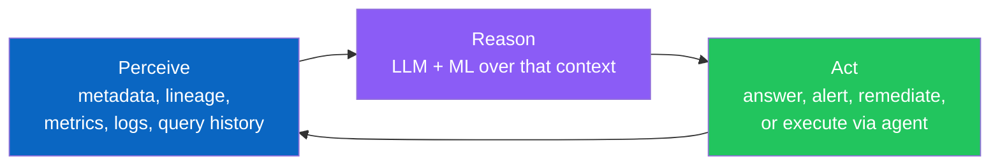
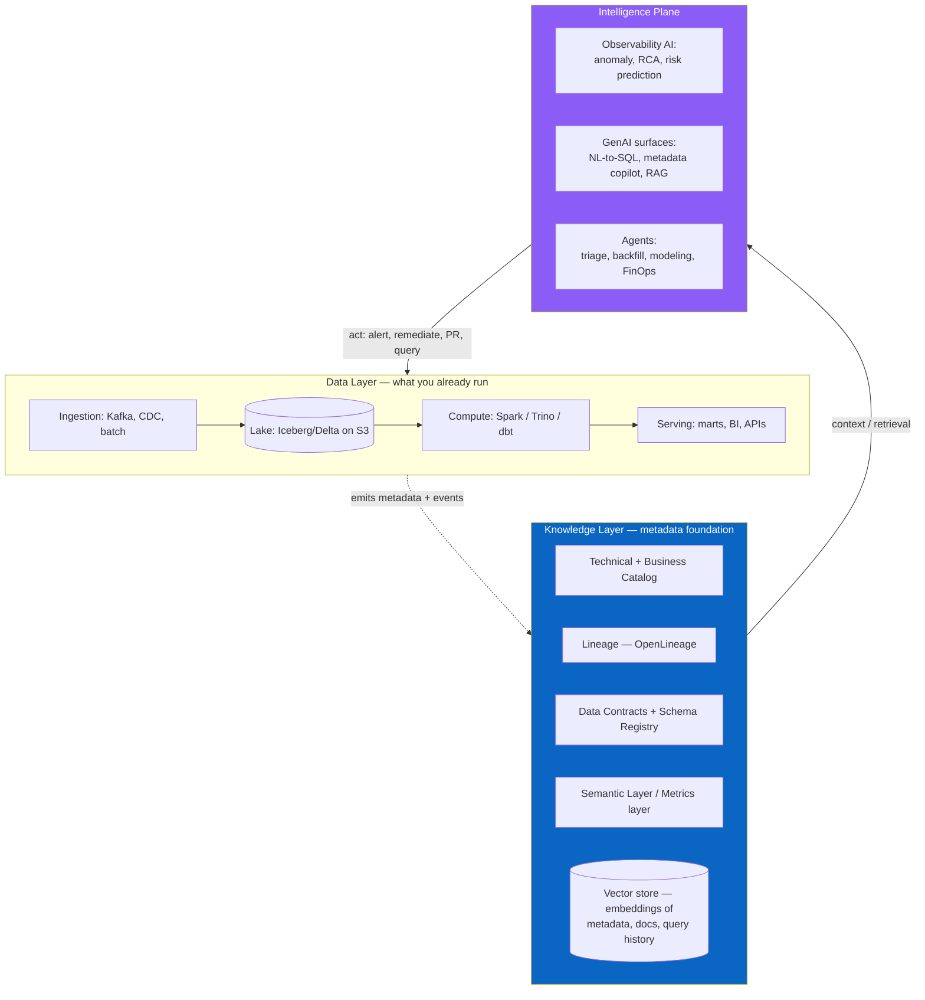
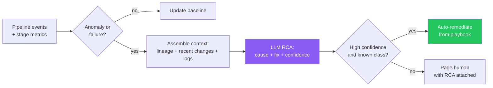
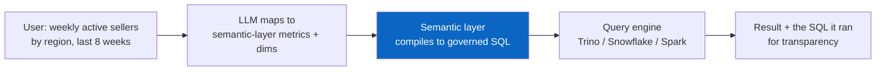
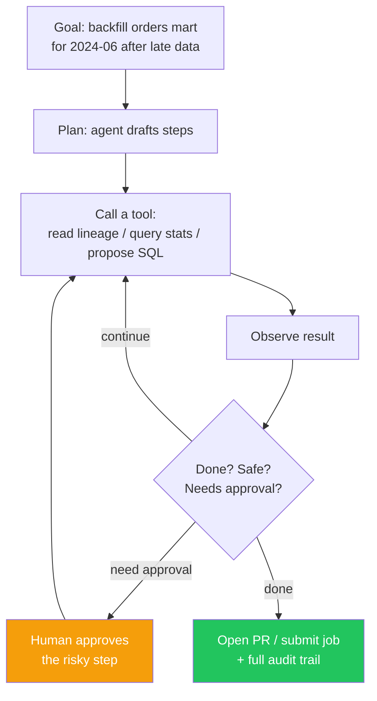
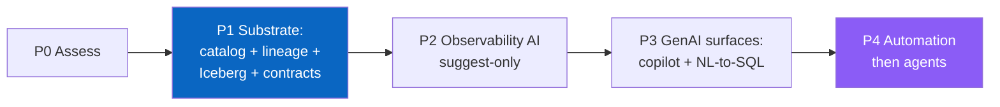

# The Intelligent Data Platform

> Chapter from the **Data Engineering Playbook** — platform-engineering.

## About This Chapter

**What this is.** A plain-language guide to what an "intelligent data platform" actually means — and how to build one. Covers what separates a smart platform from a dumb one, the foundation you must build before any AI feature will work, and a step-by-step plan for upgrading an existing S3 + Spark + Airflow data lake.

**Who it's for.** Mid-level and senior data engineers, platform leads, and engineering managers curious about where data platforms are heading. No AI or ML background required — the concepts are explained as you go.

**What you'll take away.** By the end you'll be able to:
- Describe the four maturity levels (manual → observable → AI-assisted → agentic) and explain why you cannot skip levels.
- Name the five things a platform needs in place before AI features will work reliably — and why skipping them leads to wrong, hallucinated answers.
- Explain the three AI capabilities every intelligent platform should have (anomaly detection, natural-language Q&A, and automated agents), and know which to build first.

---

A data platform becomes *intelligent* when the platform itself — not just the people using it — can watch its own health, explain what went wrong, answer questions about its own data in plain English, fix routine problems automatically, and increasingly handle engineering tasks through AI agents. Think of the difference between a pipeline that silently fails at 3am and one that sends you a message saying: "the orders mart is stale because the upstream topic changed its schema — here are the downstream tables affected and a suggested fix." This chapter covers two things: a **plain-language explanation** of what an intelligent data platform actually is (cutting through the buzzwords), and a **step-by-step migration plan** for turning an existing data lake into one — with the prerequisites named honestly.

---

## TL;DR

- **An intelligent data platform = a conventional data platform (storage + compute + orchestration) + a metadata foundation the AI can read from + an intelligence layer (anomaly detection, GenAI interfaces, and agents) that forms a feedback loop: the platform *watches itself → thinks about what it sees → takes action*.** Remove any one of the three and you don't have it.
- **The metadata foundation is the hard part, not the AI model.** GenAI and agents are only as good as the metadata, lineage, contracts, and definitions they read from. A lake with no catalog, no lineage, and no column descriptions cannot be made "intelligent" by bolting an LLM on top — you'll get confident, wrong answers. **The 80% of the work is making your platform readable by machines — this is done before you touch any AI library.**
- **There is a maturity ladder:** (0) scripts you babysit → (1) observable (metrics/lineage exist) → (2) assistive (GenAI answers questions, suggests fixes) → (3) automated (system remediates known issues) → (4) agentic (agents plan and execute multi-step work under guardrails). Skipping rungs fails.
- **Three GenAI features you can build on top of the platform:** (1) **NL-to-SQL** — users ask questions in plain English and get governed SQL answers; (2) a **metadata copilot** — ask "what feeds this table, who owns it, what's broken?" and get real answers; (3) **RAG** (Retrieval-Augmented Generation — a technique where the AI searches your own docs/data before answering) over your docs, runbooks, and past incidents. All three require clean, well-described metadata in place first.
- **Agentic data engineering** = giving an AI model a set of **tools** (catalog API, query engine, git, CI, orchestrator) plus **background context** (lineage, schemas, runbooks) and a **loop** so it can do real engineering work — triage an incident, propose a backfill, write a dbt model, open a PR. The platform's job is to expose safe tools and limit what can go wrong.
- **For a data lake specifically**, switching to intelligent requires: a **metadata-rich table format** (Iceberg/Delta instead of bare Parquet), a **catalog** (Unity Catalog / Glue + OpenMetadata / DataHub), **machine-readable lineage** (OpenLineage), **data contracts**, a **semantic layer** (defines what metrics mean), and a **vector store** (a database optimized for similarity search, used for AI retrieval). These are the prerequisites — skip them and nothing else works.
- **Build vs buy:** buy the tools (catalog, observability platform, vector DB, LLM API), build the thin layer that encodes *your* domain — the retrieval logic that understands your tables, the agent tools that wrap your APIs, the guardrails that match your risk tolerance. Don't build a vector database; do build the retrieval that knows your tables.
- **For the engineer:** the skill that compounds over the next five years is *making data systems readable by machines and wiring AI to act on them safely* — metadata modeling, retrieval design, tool/function-calling, and guardrail engineering. SQL and Spark remain table stakes; these are additive.

---

## What "Intelligent" Actually Means (and What It Doesn't)

The phrase is overused. A dashboard with a chatbot stapled to the corner is not an intelligent data platform. The real definition: an intelligent data platform has a **closed feedback loop** — it watches its own state, figures out what it means, and takes action. Here's that loop:



Three properties distinguish it from a conventional platform:

1. **Self-describing.** Every table and column carries machine-readable information: schema, owner, meaning, lineage, freshness, quality, and cost. The platform can answer "what is this column, where did it come from, who depends on it, and is it trustworthy right now?" *without a human looking it up.*
2. **Self-explaining.** When something breaks or drifts, the platform produces a *specific* explanation — not just "job failed," but "job failed because upstream topic `orders.v3` added a non-nullable field, which violated the contract on `silver.orders`, which will break three downstream tables."
3. **Self-acting (progressively).** It moves up a ladder from *suggesting* fixes, to *automatically fixing* known classes of problems, to *agents* that plan and execute multi-step work under guardrails.

What it is **not**: "we added a text-to-SQL box" is not an intelligent platform. That's one feature. Intelligence is a property of the *whole feedback loop*, and the loop is only as strong as the metadata foundation underneath it.

---

## The Maturity Ladder

Most teams want to jump from Level 0 to Level 4. It doesn't work, because each level is the *foundation* for the next. You cannot have an agent safely backfill a table (L4) if you cannot even detect that the table is broken (L1) or explain why (L2).

| Level | Name | What the platform can do | What's required to get here |
|---|---|---|---|
| **0** | **Manual** | Pipelines run on schedule; humans read logs, debug, fix | Orchestration (Airflow), compute, storage |
| **1** | **Observable** | Platform *knows its own state*: freshness, volume, schema, lineage, cost are all queryable | Metrics, **OpenLineage**, a catalog, DQ checks emitting events |
| **2** | **Assistive (GenAI)** | Humans ask in natural language: "why is revenue mart stale?", "what feeds `dim_customer`?", "write the SQL for weekly active sellers." Platform answers and *suggests* fixes | Vector layer + RAG over metadata/docs; NL-to-SQL with semantic layer; clean column/table descriptions |
| **3** | **Automated** | Platform *acts* on known problems: auto-scales, auto-compacts, auto-retries with tuned config, quarantines bad partitions, auto-tunes thresholds | A policy engine; remediation playbooks as code; a risk/confidence model (e.g. the LightGBM predictor in [`pipeline-health-monitor`](https://github.com/sharath-dataengineer/pipeline-health-monitor)) |
| **4** | **Agentic** | Agents plan and execute multi-step novel work: triage an incident end-to-end, propose+open a backfill PR, generate a new model from a request, run a cost-optimization sweep | Typed, safe **tools**; rich **context** injection; **guardrails** (approval gates, dry-run, blast-radius limits); **evals** |

> **The single most common failure**: buying an L4 "AI agent for data" while sitting at L0. The agent has nothing legible to reason over, no lineage to traverse, no contracts to check — so it hallucinates plausible-looking SQL against tables it doesn't understand. **Intelligence is earned bottom-up.**

---

## Why This Matters in Production

The scenario that justifies the whole chapter. A 200-person data org running a petabyte-scale lake on S3 + Spark + Airflow. Symptoms:

- An analyst asks "which table has net revenue by region?" and pings four Slack channels because there's no way to find out. **Discovery is tribal knowledge.**
- A gold mart silently produces nulls for nine days because an upstream Kafka topic changed `event_version` and nobody traced the dependency. **No machine-readable lineage; no contracts.**
- A pipeline fails at 2am. The on-call engineer spends 40 minutes reading Spark logs in S3 to discover it was a skewed join. **Triage is manual log archaeology.**
- The EMR bill grows 6% a month and no one can attribute it to a team or a job. **Cost is invisible at decision time.**
- The ML team can't find features, can't trust freshness, and rebuilds the same joins everyone else already wrote. **No semantic layer, no feature reuse.**

An intelligent platform attacks every one of these with the *same* underlying investment — a legible metadata substrate — exposed through different intelligence surfaces:

- Discovery → **semantic search + metadata copilot**: "net revenue by region" returns the governed table, its owner, freshness, and a sample query.
- Silent nulls → **contract enforcement + lineage-aware impact analysis**: the schema change fails the producer's PR, and if it slips through, the platform names every downstream asset at risk.
- 2am triage → **LLM-augmented RCA**: the failure is classified ("skewed join on `customer_id`"), the probable fix is surfaced, and MTTR drops sharply — ~70% in the production case study referenced below. (This is exactly the pattern in [`pipeline-health-monitor`](https://github.com/sharath-dataengineer/pipeline-health-monitor).)
- Cost → **per-job/per-partition attribution + an agent that proposes right-sizing**.
- ML enablement → **a semantic layer + feature catalog** the GenAI surfaces query.

The business case: each of these is usually treated as a separate tool purchase. They are actually **one metadata foundation problem** with multiple front-ends. Build the foundation once; add the AI surfaces incrementally.

---

## The Architecture

An intelligent data platform is a conventional platform with two additional layers added on top: a **knowledge layer** (the metadata foundation that makes everything readable by machines) and an **intelligence layer** (the AI features and agents). The data layer is what you already run.



The arrows are the point. **The AI layer never touches raw data directly — it reads from the metadata foundation.** This is what makes it safe, fast, and accurate: an LLM answering "what feeds `dim_customer`?" reads the lineage graph, not 40 TB of Parquet. An agent proposing a backfill reads the contract and the partition metadata, not every row.

---

## The Metadata Foundation: What AI Actually Needs to Be Useful

This is the unglamorous 80% of the work. Skip it and every AI feature you build will produce wrong or hallucinated answers. The foundation has five components — each one is a hard prerequisite for the AI features that follow.

### 1. A table format that stores rich metadata

Plain Parquet files on S3 are a black box — no history of schema changes, no snapshots, no statistics the platform can query. **Iceberg or Delta Lake** change that: they store schema evolution history, snapshots you can time-travel through (so an agent can ask "what changed between yesterday and today?"), partition stats, and table properties. See [lakehouse/iceberg](../../lakehouse/iceberg/README.md) and [lakehouse/metadata-layers](../../lakehouse/metadata-layers/README.md).

> Migration reality: moving from Hive/Parquet to Iceberg is a real project. But it is the *first* prerequisite — an agent cannot ask "what changed in this table between yesterday and today?" if the table has no snapshot history.

### 2. A catalog — technical *and* business

- **Technical catalog** (Glue Data Catalog, Unity Catalog, Iceberg REST catalog): the machine-readable source of truth for tables, schemas, partitions, locations.
- **Business catalog / metadata platform** (OpenMetadata, DataHub, Unity Catalog): owners, descriptions, tags, classifications (PII), glossary terms, SLAs.

The business catalog is where **column descriptions** live — and column descriptions are *the single most important input to NL-to-SQL quality*. An AI mapping "revenue" to a column does far better with `net_revenue_usd — net revenue after refunds, in USD, recognized at order completion` than with a bare column name `nr_usd`. Writing these descriptions is tedious but it is the highest-leverage thing you can do before adding any AI feature.

### 3. Machine-readable lineage

[**OpenLineage**](../../observability/lineage/README.md) is a standard that your Spark jobs, dbt models, and Airflow DAGs can emit to build a dependency graph — which table feeds which, down to the column level. This powers two critical features: impact analysis ("if I change this column, what tables break?") and root-cause analysis ("this broke — what upstream change caused it?"). Lineage is the AI's map of the platform. Without it, an agent reasoning about your platform is navigating blind.

### 4. Data contracts

A [data contract](../../data-quality/accuracy/README.md) is a machine-checkable agreement about a dataset's schema, meaning, and SLAs — a producer promising to consumers "this table will always have these columns, this freshness, these quality guarantees." Contracts turn "silent null discovered at 3am" into "broken PR caught at code-review time." For agents, contracts are also safety guardrails: an agent proposing a schema change can check the contract first to know whether the change will break downstream consumers.

### 5. A semantic layer and a vector store

- **Semantic layer** (dbt Semantic Layer / MetricFlow, Cube, LookML): a centralized place where business metrics are defined once — `weekly_active_sellers`, `net_revenue` — tied to the underlying tables. When a user asks "show me weekly revenue by region," the AI maps those words to *defined metrics* rather than guessing at raw column names. Without this, NL-to-SQL gives you plausible-but-wrong SQL.
- **Vector store** (pgvector, OpenSearch k-NN, Pinecone, Milvus — see [database-types](../../distributed-systems/database-types/README.md)): a special database optimized for similarity search. You load it with your table/column descriptions, documentation, runbooks, and past incidents. When a user asks a question, the AI searches this store to find the most relevant context before answering. This is the index that every AI search feature uses.

> **The readiness test:** can a new engineer (or an AI) answer, *for any table*, these five questions using only the platform — what is it, where did it come from, who owns it, is it fresh and correct right now, and what does it cost to query? If yes, you're ready to add AI. If no, fix that first.

---

## Pillar 1 — Observability AI: The Self-Monitoring Platform

Build this first — it has the clearest ROI and lowest risk because it watches and suggests before it ever acts autonomously.

**Four capabilities, in order from simplest to most autonomous:**

1. **Anomaly detection**: automatically flag freshness delays, unexpected row-count drops, spike in nulls, or distribution drift — using statistical baselines that self-calibrate over 30 days of history rather than hand-set thresholds that need constant babysitting.
2. **AI-powered root-cause analysis (RCA)**: when a job fails, gather the failure context automatically (error, recent schema changes, upstream lineage, recent deploys) and ask an LLM to produce a ranked explanation and a suggested fix. This is what cuts on-call time dramatically.
3. **Predictive failure detection**: an ML model that reads in-flight job metrics while a job is running and predicts whether it will fail — before it does — so the platform can pre-empt it.
4. **Auto-remediation** of known problem classes: retry with adjusted config on OOM, auto-compact small files, quarantine a bad partition and re-run, scale the cluster when a volume spike is detected.



The confidence gate is the key design decision. **High-confidence, known problems get fixed automatically. Everything else pages a human — but with the diagnosis already done.** The engineer starts at "here's the likely cause and fix," not "here's 4 GB of logs." This is where the dramatic reduction in incident response time (MTTR) comes from.

This is the production pattern documented in [`pipeline-health-monitor`](https://github.com/sharath-dataengineer/pipeline-health-monitor) and extended toward full autonomy in [`autonomous-data-platform`](https://github.com/sharath-dataengineer/autonomous-data-platform).

---

## Pillar 2 — GenAI Surfaces: Serving Humans in Natural Language

Three surfaces, in rough order of value-to-effort:

### A. Metadata copilot (discovery, lineage, impact)

The best first AI feature to build — read-only over metadata, so nothing can go wrong. Users ask:
- "Which table has net revenue by region?" → semantic search over the catalog.
- "What feeds `dim_customer` and who owns it?" → lineage + catalog lookup.
- "If I drop `orders.coupon_code`, what breaks?" → column-level lineage traversal.

Architecture: **RAG (Retrieval-Augmented Generation) over your catalog.** Load your table/column descriptions, docs, and lineage into a vector store. When a user asks a question, retrieve the most relevant metadata and feed it to the LLM to compose an answer — with citations back to catalog entries. This is the [`metadata-copilot`](https://github.com/sharath-dataengineer/metadata-copilot) pattern.

```python
# Sketch: metadata copilot retrieval (RAG over catalog + lineage)
# The LLM never sees raw data — only governed metadata. Safe and cheap.

def answer_metadata_question(question: str) -> Answer:
    # 1. Embed the question, retrieve the most relevant assets
    q_vec = embed(question)
    assets = vector_store.search(q_vec, top_k=8)          # tables, columns, docs

    # 2. Enrich with structured context the vector store doesn't hold
    for a in assets:
        a.lineage   = lineage_api.upstream_downstream(a.urn)   # OpenLineage graph
        a.freshness = catalog.freshness(a.urn)                 # is it trustworthy now?
        a.owner     = catalog.owner(a.urn)

    # 3. Compose a grounded answer with citations; refuse if context is thin
    return llm.answer(
        question=question,
        context=assets,
        instruction="Answer ONLY from the provided catalog context. "
                    "Cite asset URNs. If the context is insufficient, say so."
    )
```

The `"answer ONLY from provided context… if insufficient, say so"` instruction is not optional — it is the difference between a useful copilot and one that confidently makes things up.

### B. NL-to-SQL / conversational analytics

Let users ask questions in plain English and get SQL answers. The common trap: pointing the AI directly at raw tables produces *confidently wrong* SQL because it guesses at column semantics. The fix is to **route through the semantic layer** — the AI maps the user's words to *pre-defined metrics and dimensions*, and the semantic layer compiles those to correct SQL.



Quality ranking, best to worst: **(1) AI → semantic layer metrics** (most reliable, because metrics are pre-defined and unambiguous) → **(2) AI → SQL with rich schema + column descriptions + examples** → **(3) AI → SQL over bare table names with no descriptions** (do not ship this). Always show users the generated SQL so they can verify it, and never let NL-to-SQL run unbounded scans or writes.

### C. RAG over your own documents and history

For unstructured content — runbooks, past incident postmortems, data contracts, architecture docs, tickets. The process: break documents into chunks, convert each chunk into a vector embedding (a numerical representation of its meaning), store in the vector store, and retrieve relevant chunks at query time. This same pattern feeds the agents too — a triage agent retrieves the relevant past incident postmortem; a modeling agent retrieves the relevant dbt conventions doc.

---

## Pillar 3 — Agentic Data Engineering

This is the frontier and the most misunderstood. An **agent** is an AI model that has been given: (a) a goal, (b) **tools** it can call (APIs, query engines, git), (c) **background context** about the platform, and (d) a **loop** so it can observe what each tool call returns and decide what to do next — all wrapped in **guardrails** that limit what it can break. Agentic data engineering means agents do real engineering work, not just answer questions.

### What an agent needs from the platform

An agent is only as capable as the tools you expose and only as safe as the guardrails you build around them. The platform's job when supporting agents is **tool engineering**, not prompt engineering.

| The agent needs | The platform provides |
|---|---|
| **Tools** (typed, safe, idempotent) | Catalog API, lineage API, query engine (read-only by default), git/PR API, CI trigger, orchestrator API, cost API — each with a clear schema |
| **Context** | Lineage graph, schemas, contracts, runbooks, conventions docs, recent incidents (via RAG) |
| **Memory** | Conversation + task state; vector store of past actions and outcomes |
| **Guardrails** | Dry-run mode, approval gates on writes, blast-radius limits, cost ceilings, read-only-by-default, full audit log |
| **Evals** | A test suite that scores the agent on known tasks before it touches prod |

### The agent loop



### Realistic agentic use cases, by risk

- **Low risk (ship first):** incident triage agent (read-only RCA + suggested fix), discovery agent (the metadata copilot, agentic), documentation agent (auto-draft table/column descriptions for human review), test-generation agent (propose DQ checks for a new table).
- **Medium risk (with approval gates):** modeling agent (turn a request into a dbt model + tests, open a PR), backfill agent (compute affected partitions, draft the idempotent reload, require approval to run), cost-optimization agent (sweep for oversized clusters/small-file tables, propose changes).
- **High risk (mostly still human-led):** schema migrations, anything that mutates production data without a reversible path, anything touching PII governance.

### MCP and the tool interface

The emerging standard for exposing tools to agents is the **Model Context Protocol (MCP)** — a typed interface that lets an AI model discover and call your platform's capabilities (catalog, lineage, query, orchestration) in a consistent, safe way. In practice: wrap your platform APIs as MCP tools with clear input/output schemas, and any MCP-capable agent framework can drive your platform. Think of it as building a [self-service platform](../../platform-engineering/self-service-platforms/README.md) — a clean, typed API surface — except the consumer is an AI agent instead of a human engineer.

> **The golden rule for agent safety:** an agent's *default capability is read-only*. Every action that changes state is either (a) proposed for a human to approve, or (b) reversible with a single rollback (this is exactly why Iceberg and Delta snapshots matter — any write an agent makes can be rolled back to the snapshot before it). Never give an agent unguarded `DELETE`/`DROP`/`overwrite` on production tables.

---

## Migration Guide: From a Conventional Data Lake to an Intelligent Platform

A step-by-step plan for upgrading an existing S3 + Spark + Airflow lake (Level 0–1). Each phase delivers real value on its own — you do not do a year of foundation work and then flip a switch.

### Phase 0 — Honest assessment (1–2 weeks)

Run the readiness test above on 20 of your most-used tables. For each, can someone answer: *what is it / where did it come from / who owns it / is it fresh and correct right now / what does it cost to run*? Score yourself honestly on the maturity ladder. **Most teams are at Level 0–1.** That is the normal starting point — there is no shame in it.

### Phase 1 — Build the metadata foundation (biggest effort, do it incrementally)

Priorities, in order:

1. **Catalog everything.** Set up Glue/Unity + a metadata platform (OpenMetadata/DataHub). Start ingesting your existing tables. Then *backfill column descriptions* — tedious, but this single task improves every AI feature you will build. (Tip: a documentation agent can draft descriptions for human review — your first AI win actually funds the rest of the foundation work.)
2. **Emit lineage.** Enable OpenLineage from Spark, dbt, and Airflow. This gives you the dependency graph that powers both impact analysis and AI root-cause analysis.
3. **Migrate to Iceberg or Delta** for your most important tables — the ones with the most downstream consumers. Move incrementally; do not try to migrate everything at once.
4. **Add data contracts** on your highest-traffic producer→consumer boundaries first — the ones that have caused the 3am incidents.

> Sequencing tip: catalog + lineage first (read-only, low-risk, immediately useful even before any AI), then table-format migration and contracts (more invasive).

### Phase 2 — Add observability AI (fast ROI, low risk)

With lineage and metrics flowing, build the anomaly detection + AI-RCA loop (Pillar 1) in *suggest-only* mode first — it flags problems and explains them, but a human still acts. Measure your mean time to resolution (MTTR) before and after. This phase typically pays for the whole program because it directly cuts on-call pain.

### Phase 3 — Add GenAI surfaces (human-facing value)

Set up the vector store, load it with your now-rich metadata, and ship the **metadata copilot** first (read-only, very low risk). Then add **NL-to-SQL** for your top 10–20 metrics through the semantic layer. Self-serve analytics and data discovery improve right away.

### Phase 4 — Automate, then introduce agents (highest value, most care needed)

Promote high-confidence observability suggestions to **auto-remediation** — the platform acts on known problem classes without waiting for a human. Then introduce **agents** starting with read-only triage and documentation agents, then graduation to approval-gated backfill/modeling/FinOps agents. Build an **eval suite** (a set of test cases that score agent quality) before any agent goes near production.



### What's different for a data lake vs a warehouse

Managed warehouses (Snowflake, BigQuery) ship with a lot of the foundation already built — a catalog, statistics, often a semantic layer, and increasingly native AI/vector features. A **bare data lake gives you none of it**, so you must add it yourself:

- **Table format**: migrate Parquet → Iceberg/Delta to get snapshots, schema history, and stats (warehouses already have this).
- **Catalog**: you must run one (Glue/Unity Catalog/Iceberg REST catalog); warehouses have one natively.
- **Query engine for NL-to-SQL**: Trino, Athena, or Spark SQL over the lake tables.
- **Access control**: set up Lake Formation or Unity Catalog so that AI surfaces and agents respect row-level and column-level security.

The payoff for doing the extra work: **open formats and open metadata make the intelligence layer portable** — you're not locked to one vendor's AI features. See [choosing-your-data-platform](../../platform-engineering/choosing-your-data-platform/README.md) for the warehouse-vs-lake tradeoff in depth.

---

## Build vs Buy

| Component | Recommendation | Why |
|---|---|---|
| Vector database | **Buy / use managed** (pgvector, OpenSearch, Pinecone) | Solved problem; don't build a similarity-search engine from scratch |
| Catalog + observability platform | **Buy** (Unity Catalog, OpenMetadata, DataHub, Monte Carlo) | Mature tools exist; integration is the work, not the engine itself |
| LLM | **Buy / API** (Claude via Bedrock, OpenAI, etc.) | No team should be training their own LLM |
| Semantic layer | **Buy/adopt** (dbt Semantic Layer, Cube, LookML) | Building your own metric-definition engine is a major distraction |
| **Retrieval logic that understands your tables** | **Build** | Nobody else can encode your domain's semantics, your naming conventions, your lineage |
| **Agent tools for your platform** | **Build** | These wrap your specific APIs with your specific guardrails |
| **Evals (test cases for your AI features)** | **Build** | They encode what "correct" means for your data and your use cases |

The rule: **buy the engines, build the thin layer that encodes your domain.** The high-value, defensible work is the retrieval logic, the tools, the guardrails, and the evals — not the vector database.

---

## Anti-Patterns

| Anti-pattern | What goes wrong | Fix |
|---|---|---|
| **Adding AI on top of an ungoverned lake** | Confident but wrong answers; NL-to-SQL returns plausible-looking incorrect SQL | Build the metadata foundation first; route NL-to-SQL through a semantic layer |
| **Skipping maturity levels** | An agentic platform at Level 0 has nothing to reason over — the agent hallucinates | Earn intelligence bottom-up: observable → AI-assisted → automated → agentic |
| **Giving agents write access with no guardrails** | One bad action drops or overwrites a production table with no way back | Read-only by default; approval gates for writes; Iceberg/Delta snapshots for rollback |
| **No column or metric descriptions** | AI quality is capped at guessing from column names like `nr_usd` | Write column descriptions; define metrics in a semantic layer |
| **RAG without a grounding instruction** | The copilot confidently invents tables, lineage, and column names that don't exist | Add "answer ONLY from provided context — if insufficient, say so" to every prompt |
| **Buying five disconnected AI tools** | Five tools, five bills, no shared metadata layer — everything degrades | It's one metadata foundation problem with multiple front-ends on top |
| **No evals (test cases) for AI features** | Quality silently degrades on every model/prompt/schema change | Build an eval suite; gate changes on test scores just like any other CI check |
| **Embedding raw rows of sensitive data** | PII leaks into the vector store and shows up in AI responses | Embed metadata and documentation, not raw data rows; apply access controls in retrieval |

---

## Decision Guide

| If you... | Then... |
|---|---|
| Can't answer what/where-from/who-owns/fresh/cost for your tables | You're at L0–1. Build substrate (catalog + lineage) before any GenAI |
| Have lineage + metrics but manual triage | Build observability AI (Pillar 1) in suggest-only mode — fastest ROI |
| Have a rich catalog with descriptions | Ship the metadata copilot (RAG) — safe, read-only, high value |
| Want conversational analytics | Build/adopt a semantic layer *first*, then NL-to-SQL through it |
| Want agents to do real work | Build typed tools + guardrails + evals; start read-only, graduate with approval gates |
| Run a bare lake | Prioritize Iceberg/Delta + a catalog + a query engine before intelligence |
| Run a warehouse | Much of the substrate exists; focus on semantic layer + retrieval + governance |

---

## A Learning Roadmap for the Data Engineer

SQL, Spark, and data modeling remain essential — these skills are additive on top of what you already know.

1. **Metadata and semantics modeling** — catalogs, OpenLineage, data contracts, semantic layers (dbt Semantic Layer/MetricFlow). *This is the most important new skill area.* If you can make a platform readable by machines, you can make it intelligent.
2. **Retrieval engineering (RAG)** — how to chunk documents, create embeddings, search a vector store, and write grounding instructions that prevent hallucinations. See [database-types](../../distributed-systems/database-types/README.md) for the vector DB landscape.
3. **LLM application patterns** — how to structure prompts, use function/tool calling, get structured JSON output, and build a grounded AI system (as opposed to a plain chatbot).
4. **Agentic patterns** — the watch-think-act loop, how to design safe tools an agent can call, MCP, guardrails (approval gates, dry-run mode, blast-radius limits), and agent memory.
5. **Evaluation** — how to measure whether your NL-to-SQL is correct, whether your RCA agent finds the right cause, whether your copilot hallucinates. *The teams that win at AI are the ones who can measure it.*
6. **AI governance** — handling PII in embeddings and prompts, making sure access control carries through to AI surfaces, audit trails for agent actions.
7. **Classic foundations, applied to AI** — [idempotency](../../pipeline-patterns/idempotency/README.md) and table snapshots become *rollback mechanisms for agent actions*; [observability](../../observability/monitoring/README.md) becomes the signals the AI reads; [self-service API design](../../platform-engineering/self-service-platforms/README.md) becomes how you design agent tools.

> The honest framing: the data engineer who thrives over the next five years is not the one who learns the best prompts — it's the one who can build the *metadata foundation* that makes a platform readable by machines, then wire AI to act on it *safely*. That's a data platform architecture skill with an AI layer, not an AI skill bolted onto a data engineer.

---

## Interview & Architecture-Review Talking Points

- **"What makes a data platform 'intelligent' vs. a platform with a chatbot?"** — A chatbot is one feature on one surface. An intelligent platform has a closed feedback loop: it watches its own state, reasons about what it sees, and takes action — and that loop is only as strong as the metadata foundation underneath it.
- **"Where do you start if leadership wants an AI data platform tomorrow?"** — Assess honestly where you are on the maturity ladder, then build the metadata foundation (catalog + lineage + column descriptions) before any AI surface. Fastest ROI: observability AI with root-cause analysis in suggest-only mode. Safest first AI feature: a read-only metadata copilot.
- **"Why does NL-to-SQL fail in practice and how do you fix it?"** — Pointing AI directly at raw tables produces confidently wrong SQL. Fix: route through a semantic layer so the AI maps words to pre-defined metrics, give it rich column descriptions and examples, return the generated SQL to users, and gate expensive queries.
- **"How do you make an agent safe in production?"** — Read-only by default, typed tools with clear schemas, human approval gates on all state changes, blast-radius limits, reversibility via Iceberg/Delta snapshots, full audit trail, and an eval suite. The agent proposes; the platform constrains.
- **"What's different about doing this on a data lake vs a warehouse?"** — A managed warehouse ships with built-in catalog, statistics, semantic layer, and increasingly AI features. A bare lake ships with none of it — you add Iceberg/Delta, a catalog, and a query engine yourself. The tradeoff: more setup work upfront, but you keep portability and avoid vendor lock-in on the AI layer.
- **"Build or buy?"** — Buy the engines (vector DB, catalog, LLM API, semantic layer); build the thin layer that encodes your domain (retrieval logic, agent tools, guardrails, evals). The defensible value is in that thin layer.

---

## Further Reading

- [Self-Service Data Platforms](../../platform-engineering/self-service-platforms/README.md) — the API-surface discipline that agent tool design extends
- [Choosing Your Data Platform](../../platform-engineering/choosing-your-data-platform/README.md) — warehouse vs lake, and where the substrate already exists
- [Lakehouse Metadata Layers](../../lakehouse/metadata-layers/README.md) and [Apache Iceberg](../../lakehouse/iceberg/README.md) — the metadata-rich table formats the substrate needs
- [Data Lineage](../../observability/lineage/README.md) — OpenLineage, the agent's map of the world
- [Database Types](../../distributed-systems/database-types/README.md) — the vector-database landscape for the retrieval layer
- [Idempotency in Data Pipelines](../../pipeline-patterns/idempotency/README.md) — reversibility as a safety primitive for autonomous action
- [Monitoring & Observability](../../observability/monitoring/README.md) — the signals the intelligence plane perceives
- Companion repos: [`metadata-copilot`](https://github.com/sharath-dataengineer/metadata-copilot) (GenAI metadata surface), [`pipeline-health-monitor`](https://github.com/sharath-dataengineer/pipeline-health-monitor) (observability AI), [`autonomous-data-platform`](https://github.com/sharath-dataengineer/autonomous-data-platform) (the full agentic vision)
