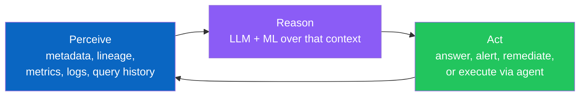
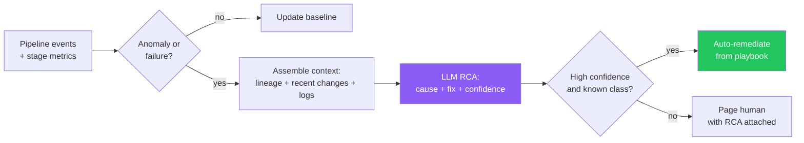
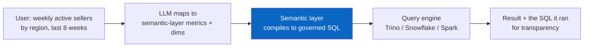
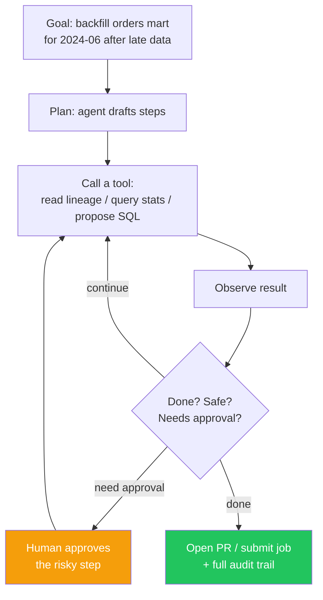
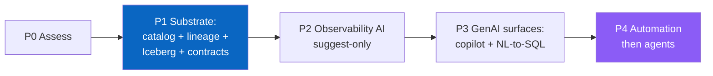

# The Intelligent Data Platform

> Chapter from the **Data Engineering Playbook** — platform-engineering.

## About This Chapter

**What this is.** Both a conceptual map of what an intelligent data platform actually is — a perceive→reason→act loop over a legible metadata substrate, with observability AI, GenAI surfaces, and agents on top — and a phased migration guide for turning an existing "dumb" S3 + Spark + Airflow lake into one.

**Who it's for.** Platform/architecture leads, data/ML engineers, engineering managers/tech leads, and engineers preparing for senior/staff data-engineering interviews.

**What you'll take away.** By the end you'll be able to:
- Place a platform on the 0–4 maturity ladder and explain why intelligence is earned bottom-up, not bolted on as an LLM over an ungoverned lake.
- Build the five-component substrate (metadata-rich table format, technical + business catalog, OpenLineage, contracts, semantic layer + vector store) that every AI surface depends on.
- Stand up the three intelligence pillars — observability AI, GenAI surfaces (metadata copilot, NL-to-SQL through a semantic layer, RAG), and guardrailed agents — and sequence the migration so each phase ships value.

---

A data platform becomes *intelligent* when the platform itself — not just the analysts and ML teams on top of it — can perceive its own state, reason about it, and act on it. The pipelines stop being inert scripts that a human babysits and become a system that explains its own failures, answers questions about its own data in natural language, optimizes its own cost, and increasingly executes routine engineering work through agents. This chapter is two things at once: a **conceptual map** of what an intelligent data platform actually is (past the marketing), and a **migration guide** for taking an existing "dumb" data lake and turning it into one — phase by phase, with the prerequisites named honestly.

---

## TL;DR

- **An intelligent data platform = a conventional data platform (storage + compute + orchestration) + a metadata/semantic substrate + an intelligence layer (observability AI, GenAI interfaces, and agents) that closes the loop from *perceive → reason → act*.** Remove any one of the three and you don't have it.
- **The substrate is the hard part, not the LLM.** GenAI and agents are only as good as the metadata, lineage, contracts, and semantic layer they reason over. A lake with no catalog, no lineage, and no column descriptions cannot be made "intelligent" by bolting an LLM on top — you'll get confident hallucinations. **The 80% of the work is making your platform legible to a machine.**
- **There is a maturity ladder:** (0) scripts you babysit → (1) observable (metrics/lineage exist) → (2) assistive (GenAI answers questions, suggests fixes) → (3) automated (system remediates known issues) → (4) agentic (agents plan and execute multi-step work under guardrails). Skipping rungs fails.
- **GenAI is *served by* the platform** primarily through three surfaces: **NL-to-SQL / conversational analytics**, a **metadata copilot** (discovery, lineage Q&A, impact analysis), and **RAG over your own data + docs**. All three need a **vector layer** and **clean, governed metadata**.
- **Agentic data engineering** = giving an LLM-driven agent **tools** (catalog API, query engine, git, CI, orchestrator) plus **context** (lineage, schemas, runbooks) and a **guardrailed loop** so it can do real work — triage an incident, propose a backfill, write a dbt model, open a PR. The platform's job is to expose safe, typed tools and to contain blast radius.
- **For a data lake specifically**, the switch requires: a **table format with rich metadata** (Iceberg/Delta over bare Parquet), a **technical + business catalog** (Unity Catalog / Glue + OpenMetadata / DataHub), **machine-readable lineage** (OpenLineage), **data contracts**, a **semantic layer**, and an **embeddings/vector store** for unstructured assets. These are the load-bearing prerequisites.
- **Build vs buy:** buy the substrate primitives (catalog, observability, vector DB), build the thin intelligence glue that encodes *your* domain (semantic layer, agent tools, RAG retrieval). Don't build a vector database; do build the retrieval that knows your tables.
- **For the engineer:** the skill that compounds over the next five years is *making systems legible to machines and wiring LLMs to act on them safely* — metadata modeling, retrieval design, tool/function-calling, eval, and guardrail engineering. SQL and Spark remain table stakes.

---

## What "Intelligent" Actually Means (and What It Doesn't)

The phrase is abused. A dashboard with a chatbot stapled to the corner is not an intelligent data platform. To be precise, an intelligent data platform exhibits a **closed control loop** over its own operation and its own data:



Three properties distinguish it from a conventional platform:

1. **Self-describing.** Every asset carries machine-readable metadata: schema, owner, semantics, lineage, freshness, quality, and cost. The platform can answer "what is this column, where did it come from, who depends on it, and is it trustworthy right now?" *without a human in the loop.*
2. **Self-explaining.** When something breaks or drifts, the platform produces a *causal* explanation — not just "job failed," but "job failed because upstream topic `orders.v3` added a non-nullable field, which violated the contract on `silver.orders`, which will null three gold marts."
3. **Self-acting (progressively).** It moves up a ladder from *suggesting* fixes, to *auto-remediating* known classes of problems, to *agents* that plan and execute novel multi-step work under human-approved guardrails.

What it is **not**: it is not "we added a `text-to-sql` box." That's one feature on one surface. Intelligence is a property of the *whole loop*, and the loop is only as strong as the metadata substrate underneath it.

---

## The Maturity Ladder

Most teams want to jump from Level 0 to Level 4. It doesn't work, because each level is the *substrate* for the next. You cannot have an agent safely backfill a table (L4) if you cannot detect that the table is broken (L1) or explain why (L2).

| Level | Name | What the platform can do | What's required to get here |
|---|---|---|---|
| **0** | **Manual** | Pipelines run on schedule; humans read logs, debug, fix | Orchestration (Airflow), compute, storage |
| **1** | **Observable** | Platform *knows its own state*: freshness, volume, schema, lineage, cost are all queryable | Metrics, **OpenLineage**, a catalog, DQ checks emitting events |
| **2** | **Assistive (GenAI)** | Humans ask in natural language: "why is revenue mart stale?", "what feeds `dim_customer`?", "write the SQL for weekly active sellers." Platform answers and *suggests* fixes | Vector layer + RAG over metadata/docs; NL-to-SQL with semantic layer; clean column/table descriptions |
| **3** | **Automated** | Platform *acts* on known problems: auto-scales, auto-compacts, auto-retries with tuned config, quarantines bad partitions, auto-tunes thresholds | A policy engine; remediation playbooks as code; a risk/confidence model (e.g. the LightGBM predictor in [`pipeline-health-monitor`](https://github.com/sharath-dataengineer/pipeline-health-monitor)) |
| **4** | **Agentic** | Agents plan and execute multi-step novel work: triage an incident end-to-end, propose+open a backfill PR, generate a new model from a request, run a cost-optimization sweep | Typed, safe **tools**; rich **context** injection; **guardrails** (approval gates, dry-run, blast-radius limits); **evals** |

> **The single most common failure**: buying an L4 "AI agent for data" while sitting at L0. The agent has nothing legible to reason over, no lineage to traverse, no contracts to check — so it hallucinates plausible-looking SQL against tables it doesn't understand. **Intelligence is earned bottom-up.**

---

## Why This Matters in Production

The scenario that justifies the whole chapter. A 200-person data org running a petabyte-scale lake on S3 + Spark + Airflow. Symptoms:

- An analyst asks "which table has net revenue by region?" and pings four Slack channels because there's no way to find out. **Discovery is tribal knowledge.**
- A gold mart silently produces nulls for nine days because an upstream Kafka topic changed `event_version` and nobody traced the dependency. **No machine-readable lineage; no contracts.**
- A pipeline fails at 2am. The on-call engineer spends 40 minutes reading Spark logs in S3 to discover it was a skewed join. **Triage is manual log archaeology.**
- The EMR bill grows 6% a month and no one can attribute it to a team or a job. **Cost is invisible at decision time.**
- The ML team can't find features, can't trust freshness, and rebuilds the same joins everyone else already wrote. **No semantic layer, no feature reuse.**

An intelligent platform attacks every one of these with the *same* underlying investment — a legible metadata substrate — exposed through different intelligence surfaces:

- Discovery → **semantic search + metadata copilot**: "net revenue by region" returns the governed table, its owner, freshness, and a sample query.
- Silent nulls → **contract enforcement + lineage-aware impact analysis**: the schema change fails the producer's PR, and if it slips through, the platform names every downstream asset at risk.
- 2am triage → **LLM-augmented RCA**: the failure is classified ("skewed join on `customer_id`"), the probable fix is surfaced, and MTTR drops sharply — ~70% in the production case study referenced below. (This is exactly the pattern in [`pipeline-health-monitor`](https://github.com/sharath-dataengineer/pipeline-health-monitor).)
- Cost → **per-job/per-partition attribution + an agent that proposes right-sizing**.
- ML enablement → **a semantic layer + feature catalog** the GenAI surfaces query.

The economic argument: each of these is usually treated as a separate tool purchase. They are actually **one substrate problem** with multiple front-ends. Build the substrate once; light up the surfaces incrementally.

---

## The Architecture

An intelligent data platform is a conventional platform with two additional planes: a **knowledge plane** (the substrate that makes everything legible) and an **intelligence plane** (the AI surfaces and agents). The data plane and control plane are what you already have.


The arrows are the point. **The intelligence plane never touches raw data directly; it reasons over the knowledge plane.** This is what makes it safe, cheap, and accurate: an LLM answering "what feeds `dim_customer`?" reads the lineage graph, not 40 TB of Parquet. An agent proposing a backfill reads the contract and the partition metadata, not every row.

---

## The Substrate: What AI Actually Needs to Be Useful

This is the unglamorous 80%. Skip it and every downstream surface degrades into a hallucination engine. The substrate has five load-bearing components.

### 1. A table format with rich, queryable metadata

Bare Parquet on S3 is opaque — no schema evolution history, no snapshots, no statistics the platform can reason over. **Iceberg or Delta** give you: schema evolution as first-class metadata, snapshot/time-travel (so an agent can *diff* what changed), partition stats, and table properties. See [lakehouse/iceberg](../../lakehouse/iceberg/README.md) and [lakehouse/metadata-layers](../../lakehouse/metadata-layers/README.md).

> Migration reality: moving from Hive/Parquet to Iceberg is itself a project. But it is the *first* prerequisite — an agent cannot ask "what changed in this table between yesterday and today?" if the table has no snapshot history.

### 2. A catalog — technical *and* business

- **Technical catalog** (Glue Data Catalog, Unity Catalog, Iceberg REST catalog): the machine-readable source of truth for tables, schemas, partitions, locations.
- **Business catalog / metadata platform** (OpenMetadata, DataHub, Unity Catalog): owners, descriptions, tags, classifications (PII), glossary terms, SLAs.

The business catalog is where **column descriptions** live — and column descriptions are *the single highest-leverage input to NL-to-SQL quality*. An LLM mapping "revenue" to a column does far better with `net_revenue_usd — net revenue after refunds, in USD, recognized at order completion` than with a bare column name `nr_usd`.

### 3. Machine-readable lineage

[**OpenLineage**](../../observability/lineage/README.md) emitted from Spark/dbt/Airflow gives a column-level dependency graph. This is what powers impact analysis ("if I change this, what breaks?") and RCA ("this broke; what upstream changed?"). Lineage is the agent's map of the world. Without it, an agent reasoning about your platform is navigating blind.

### 4. Data contracts + schema registry

A [data contract](../../data-quality/accuracy/README.md) is a machine-checkable promise about a dataset's schema, semantics, and SLAs. Contracts turn "silent null at 3am" into "failed PR at code-review time." For agents, contracts are the *constraints* that make autonomous action safe: an agent can propose a change and the contract tells it (and the CI gate) whether the change is breaking.

### 5. A semantic layer and a vector store

- **Semantic layer** (dbt Semantic Layer / MetricFlow, Cube, LookML): defines *metrics* (`weekly_active_sellers`, `net_revenue`) once, decoupled from physical tables. This is what lets NL-to-SQL be *correct* rather than *plausible* — the LLM maps language to defined metrics, not to raw columns it guesses at.
- **Vector store** (pgvector, OpenSearch k-NN, Pinecone, Milvus — see [database-types](../../distributed-systems/database-types/README.md)): holds embeddings of table/column descriptions, documentation, runbooks, past incidents, and query history. This is the retrieval index for every RAG-based surface.

> **The litmus test for substrate readiness:** can a new engineer (or an LLM) answer, *for any table*, these five questions using only the platform — what is it, where did it come from, who owns it, is it fresh and correct right now, and what does it cost? If yes, you're ready to light up intelligence. If no, fix that first.

---

## Pillar 1 — Observability AI: The Self-Operating Platform

This is the first intelligence surface to build because it has the clearest ROI and the lowest risk (it observes and suggests before it acts). It is "AIOps for data."

**Capabilities, in order of increasing autonomy:**

1. **Anomaly detection** on freshness, volume, null-rates, and distributions — using auto-calibrated statistical baselines (e.g. mean ± 2σ over a 30-day partition history) rather than hand-set thresholds that rot.
2. **LLM-augmented root-cause analysis**: ingest the failure context (stack trace, recent schema changes, upstream lineage, recent deploys) and have an LLM produce a ranked causal explanation and a suggested fix.
3. **Predictive risk**: an ML model (e.g. LightGBM) that extracts features from in-flight stage metrics to predict failure *before* it happens, so the platform can pre-empt it.
4. **Auto-remediation** of known classes: retry-with-tuned-config on OOM, auto-compact small files, quarantine a bad partition and re-run, scale the cluster for a detected volume spike.



The confidence gate is the whole design. **High-confidence, known-class problems get auto-remediated; everything else pages a human — but with the RCA already attached**, which is where the 70% MTTR reduction comes from. The human starts at "here's the likely cause and fix," not "here's 4 GB of logs."

This is the production pattern documented in [`pipeline-health-monitor`](https://github.com/sharath-dataengineer/pipeline-health-monitor) and extended toward full autonomy in [`autonomous-data-platform`](https://github.com/sharath-dataengineer/autonomous-data-platform).

---

## Pillar 2 — GenAI Surfaces: Serving Humans in Natural Language

Three surfaces, in rough order of value-to-effort:

### A. Metadata copilot (discovery, lineage, impact)

The highest-ROI, lowest-risk GenAI surface — because it's *read-only over metadata*. Users ask:
- "Which table has net revenue by region?" → semantic search over the catalog.
- "What feeds `dim_customer` and who owns it?" → lineage + catalog lookup.
- "If I drop `orders.coupon_code`, what breaks?" → column-level lineage traversal.

Architecture: **RAG over the knowledge plane.** Embed table/column descriptions, docs, and lineage into the vector store; retrieve relevant context; let the LLM compose the answer with citations back to catalog entries. This is exactly the [`metadata-copilot`](https://github.com/sharath-dataengineer/metadata-copilot) pattern.

```python
# Sketch: metadata copilot retrieval (RAG over catalog + lineage)
# The LLM never sees raw data — only governed metadata. Safe and cheap.

def answer_metadata_question(question: str) -> Answer:
    # 1. Embed the question, retrieve the most relevant assets
    q_vec = embed(question)
    assets = vector_store.search(q_vec, top_k=8)          # tables, columns, docs

    # 2. Enrich with structured context the vector store doesn't hold
    for a in assets:
        a.lineage   = lineage_api.upstream_downstream(a.urn)   # OpenLineage graph
        a.freshness = catalog.freshness(a.urn)                 # is it trustworthy now?
        a.owner     = catalog.owner(a.urn)

    # 3. Compose a grounded answer with citations; refuse if context is thin
    return llm.answer(
        question=question,
        context=assets,
        instruction="Answer ONLY from the provided catalog context. "
                    "Cite asset URNs. If the context is insufficient, say so."
    )
```

The `"answer ONLY from provided context… if insufficient, say so"` instruction is not optional — it is the difference between a copilot and a hallucination machine.

### B. NL-to-SQL / conversational analytics

Let users ask questions and get governed answers. The trap: naive NL-to-SQL against raw tables produces *confidently wrong* SQL. The fix is to **route through the semantic layer** so the LLM maps language → *defined metrics/dimensions*, and the semantic layer compiles the metric to correct SQL.



Accuracy hierarchy, best to worst: **(1) LLM → semantic layer metrics** (most reliable) → **(2) LLM → SQL with rich schema + descriptions + few-shot examples in context** → **(3) LLM → SQL over bare table names** (don't ship this). Always return the generated SQL for transparency, and gate writes/expensive scans.

### C. RAG over your own data and documents

For unstructured and semi-structured assets — docs, tickets, contracts, support transcripts, past incident postmortems. Chunk, embed, index in the vector store, retrieve at query time. This is the foundation that also feeds the agents (a triage agent retrieves the relevant past incident; a modeling agent retrieves the relevant dbt conventions doc).

---

## Pillar 3 — Agentic Data Engineering

This is the frontier and the most misunderstood. An **agent** is an LLM given (a) a goal, (b) **tools** it can call, (c) **context** about the world, and (d) a **loop** that lets it observe tool results and decide the next action — all inside **guardrails**. Agentic data engineering means agents do real engineering work, not just answer questions.

### What an agent needs from the platform

An agent is only as capable as the tools you expose and only as safe as the guardrails you wrap them in. The platform's job is **tool engineering**, not prompt engineering.

| The agent needs | The platform provides |
|---|---|
| **Tools** (typed, safe, idempotent) | Catalog API, lineage API, query engine (read-only by default), git/PR API, CI trigger, orchestrator API, cost API — each with a clear schema |
| **Context** | Lineage graph, schemas, contracts, runbooks, conventions docs, recent incidents (via RAG) |
| **Memory** | Conversation + task state; vector store of past actions and outcomes |
| **Guardrails** | Dry-run mode, approval gates on writes, blast-radius limits, cost ceilings, read-only-by-default, full audit log |
| **Evals** | A test suite that scores the agent on known tasks before it touches prod |

### The agent loop



### Realistic agentic use cases, by risk

- **Low risk (ship first):** incident triage agent (read-only RCA + suggested fix), discovery agent (the metadata copilot, agentic), documentation agent (auto-draft table/column descriptions for human review), test-generation agent (propose DQ checks for a new table).
- **Medium risk (with approval gates):** modeling agent (turn a request into a dbt model + tests, open a PR), backfill agent (compute affected partitions, draft the idempotent reload, require approval to run), cost-optimization agent (sweep for oversized clusters/small-file tables, propose changes).
- **High risk (mostly still human-led):** schema migrations, anything that mutates production data without a reversible path, anything touching PII governance.

### MCP and the tool interface

The emerging standard for exposing tools to agents is the **Model Context Protocol (MCP)** — a typed interface that lets an LLM discover and call your platform's capabilities (catalog, lineage, query, orchestration) the same way regardless of the model. Practically: wrap your platform APIs as MCP tools with clear schemas, and any MCP-capable agent can drive your platform safely. The discipline is the same as building a [self-service platform](../../platform-engineering/self-service-platforms/README.md) — a clean, typed, guardrailed API surface — except the consumer is an agent instead of a human.

> **The non-negotiable guardrail principle:** an agent's *default* capability is read-only. Every state-changing action is either (a) a proposal a human approves, or (b) reversible with a one-command rollback (which is exactly why Iceberg/Delta snapshots matter — an agent's write can be rolled back to the prior snapshot). Never give an agent unguarded `DELETE`/`DROP`/`overwrite` on production.

---

## Migration Guide: From a "Dumb" Data Lake to an Intelligent Platform

The phased plan to take an existing S3 + Spark + Airflow lake (Level 0–1) to intelligence. Each phase is independently valuable — you ship value at every step, you don't do a year of substrate work before any payoff.

### Phase 0 — Honest assessment (1–2 weeks)

Run the litmus test from above against a sample of 20 tables. For each, can the platform answer: *what / where-from / who-owns / fresh-and-correct / cost*? Score yourself on the maturity ladder. **You are almost certainly at Level 0–1.** That's fine — it's the normal starting point.

### Phase 1 — Make the lake legible (the substrate; biggest effort, do it incrementally)

Priorities, in order:

1. **Catalog everything.** Stand up Glue/Unity + a metadata platform (OpenMetadata/DataHub). Ingest existing tables. *Backfill column descriptions* — this is tedious but it is the fuel for every GenAI surface. (A documentation agent can draft these for human approval — your first AI win funds the substrate work.)
2. **Emit lineage.** Turn on OpenLineage in Spark/dbt/Airflow. Now you have the dependency graph.
3. **Adopt a metadata-rich table format** where it matters most — migrate high-value Hive/Parquet tables to **Iceberg or Delta** for snapshots, schema-evolution history, and stats. Don't boil the ocean; start with the tables that feed the most downstream assets.
4. **Introduce contracts** on the highest-traffic producer→consumer boundaries first (the ones that cause the 3am incidents).

> Sequencing tip: catalog + lineage first (read-only, low-risk, immediately useful for humans), table-format migration and contracts second (more invasive).

### Phase 2 — Light up observability AI (fast ROI, low risk)

With lineage + metrics flowing, build the anomaly detection + LLM-RCA loop (Pillar 1) in *suggest-only* mode. Measure MTTR before and after. This phase typically pays for the whole program because it directly cuts on-call pain and incident duration.

### Phase 3 — Add the GenAI surfaces (human-facing value)

Stand up the **vector store**, embed your now-rich metadata, and ship the **metadata copilot** first (read-only, safe). Then add **NL-to-SQL through a semantic layer** for the top 10–20 metrics. Discovery and self-serve analytics improve immediately.

### Phase 4 — Introduce automation, then agents (highest value, highest care)

Promote high-confidence observability suggestions to **auto-remediation** (Pillar 1, Level 3). Then introduce **agents** (Pillar 3) starting with read-only triage and documentation agents, graduating to approval-gated modeling/backfill/FinOps agents. Build **evals** before you let any agent near prod.



### What's specifically needed for a data lake (vs a warehouse)

Warehouses (Snowflake/BigQuery) ship with a lot of the substrate built in — a catalog, statistics, often a semantic layer and even native vector + LLM functions. A **bare lake gives you none of it**, so the lake-specific gaps to close are:

- **Table format**: Parquet → Iceberg/Delta (warehouses already have managed storage with metadata).
- **Catalog**: you must run one (Glue/Unity/REST catalog); a warehouse has one natively.
- **Statistics & snapshots**: Iceberg/Delta provide them; bare Parquet doesn't.
- **A query engine for NL-to-SQL**: Trino/Athena/Spark SQL over the lake.
- **Governance**: lake-side access control (Lake Formation / Unity Catalog) so the GenAI surfaces and agents respect row/column security.

The upside of the lake: **open formats + open metadata mean the intelligence layer is portable** and not locked to one vendor's AI features. See [choosing-your-data-platform](../../platform-engineering/choosing-your-data-platform/README.md) for the warehouse-vs-lake tradeoff in depth.

---

## Build vs Buy

| Layer | Default | Why |
|---|---|---|
| Vector database | **Buy / managed** (pgvector, OpenSearch, Pinecone) | A solved problem; don't build a similarity-search engine |
| Catalog + observability platform | **Buy** (Unity/OpenMetadata/DataHub; Monte Carlo for DQ if you don't want to build) | Mature category; integration is the work, not the engine |
| LLM | **Buy / API** (Claude via Bedrock, etc.) | Obviously |
| Semantic layer | **Buy/adopt** (dbt Semantic Layer, Cube) | Standardized; building your own metric engine is a tar pit |
| **Retrieval that knows *your* tables** | **Build** | Nobody else can encode your domain's semantics and lineage |
| **Agent tools / MCP surface for your platform** | **Build** | These wrap *your* APIs and *your* guardrails |
| **Evals for your agents/NL-to-SQL** | **Build** | They encode *your* correctness bar |

The rule: **buy the engines, build the thin glue that encodes your domain.** The defensible, high-value work is the retrieval, the tools, the guardrails, and the evals — not the vector DB.

---

## Anti-Patterns

| Anti-pattern | What goes wrong | Fix |
|---|---|---|
| **LLM on top of an ungoverned lake** | Confident hallucinations; NL-to-SQL returns plausible wrong numbers | Build the substrate first; route NL-to-SQL through a semantic layer |
| **Skipping the maturity ladder** | An L4 agent at an L0 platform has nothing legible to reason over | Earn intelligence bottom-up: observable → assistive → automated → agentic |
| **Agents with unguarded write access** | One bad action drops/overwrites prod with no rollback | Read-only by default; approval gates; rely on Iceberg/Delta snapshots for reversibility |
| **No column/metric descriptions** | NL-to-SQL and copilot quality is capped at "guessing from names" | Backfill descriptions (a doc agent can draft them); define metrics in a semantic layer |
| **RAG without "answer only from context"** | The copilot invents tables and lineage | Strict grounding instruction + citations + "say so if insufficient" |
| **Treating it as a tool purchase** | Five disconnected tools, five bills, no shared substrate | Recognize it's *one* substrate problem with multiple front-ends |
| **No evals for the AI surfaces** | Quality silently regresses on model/prompt/schema changes | Build an eval suite; gate changes on it like any other CI test |
| **Embedding raw rows of sensitive data** | PII leaks into the vector store and into prompts | Embed *metadata and docs*, not raw sensitive rows; respect governance in retrieval |

---

## Decision Guide

| If you... | Then... |
|---|---|
| Can't answer what/where-from/who-owns/fresh/cost for your tables | You're at L0–1. Build substrate (catalog + lineage) before any GenAI |
| Have lineage + metrics but manual triage | Build observability AI (Pillar 1) in suggest-only mode — fastest ROI |
| Have a rich catalog with descriptions | Ship the metadata copilot (RAG) — safe, read-only, high value |
| Want conversational analytics | Build/adopt a semantic layer *first*, then NL-to-SQL through it |
| Want agents to do real work | Build typed tools + guardrails + evals; start read-only, graduate with approval gates |
| Run a bare lake | Prioritize Iceberg/Delta + a catalog + a query engine before intelligence |
| Run a warehouse | Much of the substrate exists; focus on semantic layer + retrieval + governance |

---

## A Learning Roadmap for the Data Engineer

The skills that compound as platforms become intelligent. SQL/Spark/modeling remain table stakes — these are *additive*.

1. **Metadata & semantics modeling** — catalogs, OpenLineage, data contracts, semantic layers (dbt Semantic Layer/MetricFlow). *This is the new core competency.* If you can make a platform legible, you can make it intelligent.
2. **Retrieval engineering (RAG)** — chunking, embeddings, vector stores, hybrid search, grounding/citation discipline, context-window budgeting. See [database-types](../../distributed-systems/database-types/README.md) for the vector-DB landscape.
3. **LLM application patterns** — prompt structure, function/tool calling, structured output, the difference between a chat wrapper and a grounded system.
4. **Agentic patterns** — the perceive-reason-act loop, tool design, MCP, guardrails (approval gates, dry-run, blast-radius), memory.
5. **Evaluation** — how to measure NL-to-SQL accuracy, RCA quality, agent task success; building eval suites and gating on them. *The teams that win at AI are the teams that can measure it.*
6. **AI governance & safety** — PII handling in embeddings and prompts, access control that follows through to the AI surfaces, audit trails for agent actions.
7. **The classic foundation, sharpened** — [idempotency](../../pipeline-patterns/idempotency/README.md) and snapshots become *safety primitives for agents* (reversible actions); [observability](../../observability/monitoring/README.md) becomes the agent's senses; [self-service API design](../../platform-engineering/self-service-platforms/README.md) becomes agent tool design.

> The honest framing for your own positioning: the engineer who thrives isn't the one who memorizes prompt tricks — it's the one who can architect the *substrate* that makes a platform legible to machines, then wire LLMs and agents to act on it *safely*. That's a data-platform-architecture skill with an AI layer, not an AI skill bolted onto a data engineer.

---

## Interview & Architecture-Review Talking Points

- **"What makes a data platform 'intelligent' vs. a platform with a chatbot?"** — A closed perceive→reason→act loop over a *legible metadata substrate*. A chatbot is one surface; intelligence is a property of the whole loop, gated by the quality of the substrate underneath.
- **"Where do you start if leadership wants an AI data platform tomorrow?"** — Assess maturity honestly, then build substrate (catalog + lineage + descriptions) before surfaces. The fastest visible ROI is observability AI (LLM-RCA in suggest-only mode); the safest first GenAI surface is a read-only metadata copilot.
- **"Why does NL-to-SQL fail in practice and how do you fix it?"** — Naive NL→SQL over raw tables produces confidently-wrong queries. Route through a semantic layer so the LLM maps language to *defined metrics*, give it rich column descriptions and few-shot examples, return the generated SQL, and gate expensive/writing queries.
- **"How do you make an agent safe in production?"** — Read-only by default, typed tools, approval gates on state changes, blast-radius limits, reversibility via Iceberg/Delta snapshots, full audit log, and an eval suite gating any change. The agent proposes; the platform constrains.
- **"What's special about doing this on a lake vs a warehouse?"** — A bare lake lacks the built-in substrate (catalog, stats, semantic layer, vector functions) a warehouse ships with. You must add a metadata-rich table format (Iceberg/Delta), a catalog, and a query engine — but you gain portability and avoid vendor lock-in on the AI layer.
- **"Build or buy?"** — Buy the engines (vector DB, catalog, LLM, semantic layer); build the thin glue that encodes your domain (retrieval, agent tools, guardrails, evals). The defensible value is in the glue.

---

## Further Reading

- [Self-Service Data Platforms](../../platform-engineering/self-service-platforms/README.md) — the API-surface discipline that agent tool design extends
- [Choosing Your Data Platform](../../platform-engineering/choosing-your-data-platform/README.md) — warehouse vs lake, and where the substrate already exists
- [Lakehouse Metadata Layers](../../lakehouse/metadata-layers/README.md) and [Apache Iceberg](../../lakehouse/iceberg/README.md) — the metadata-rich table formats the substrate needs
- [Data Lineage](../../observability/lineage/README.md) — OpenLineage, the agent's map of the world
- [Database Types](../../distributed-systems/database-types/README.md) — the vector-database landscape for the retrieval layer
- [Idempotency in Data Pipelines](../../pipeline-patterns/idempotency/README.md) — reversibility as a safety primitive for autonomous action
- [Monitoring & Observability](../../observability/monitoring/README.md) — the signals the intelligence plane perceives
- Companion repos: [`metadata-copilot`](https://github.com/sharath-dataengineer/metadata-copilot) (GenAI metadata surface), [`pipeline-health-monitor`](https://github.com/sharath-dataengineer/pipeline-health-monitor) (observability AI), [`autonomous-data-platform`](https://github.com/sharath-dataengineer/autonomous-data-platform) (the full agentic vision)
