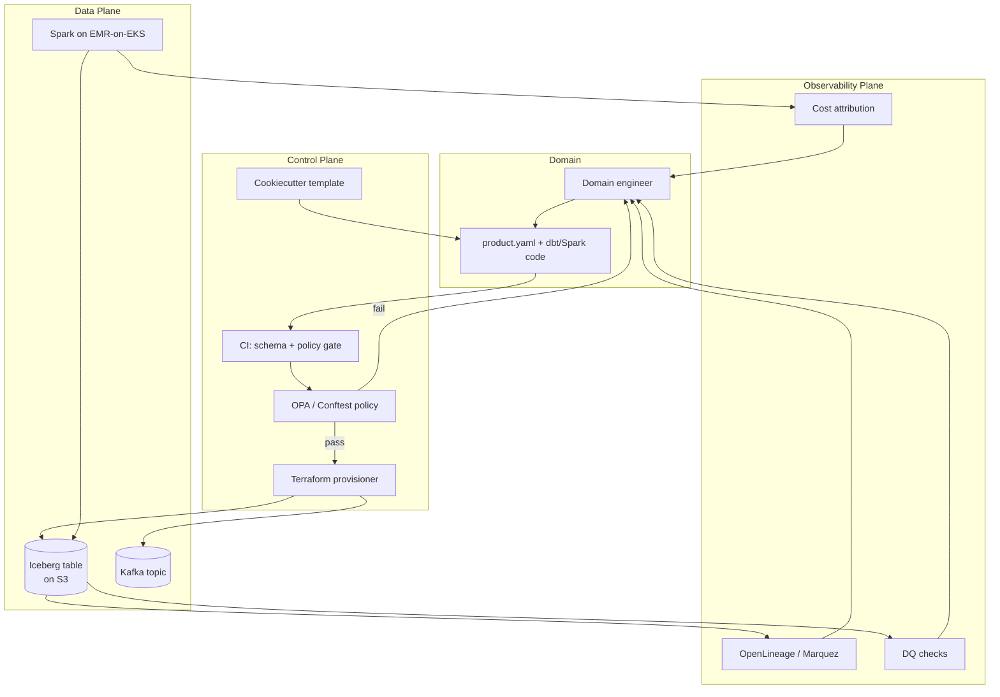

# Self-Service Data Platforms

> Chapter from the **Data Engineering Playbook** — platform-engineering.

## About This Chapter

**What this is.** How to build a self-service data platform — the contract that lets a domain team ship a production data product without filing a ticket. The platform owns the primitives (compute, storage, catalog, CI, observability); domains own the data and SLAs. The hard part is drawing and encoding the line between what is paved (standardized and supported) and what is open (flexible but unsupported).

**Who it's for.** Platform/architecture leads, engineering managers/tech leads, mid-level data engineers, senior/staff data engineers, and engineers preparing for senior/staff data-engineering interviews.

**What you'll take away.** By the end you'll be able to:
- Treat self-service as a declarative API surface (a git-tracked `product.yaml` plus a CI policy gate), and locate an org on the L0–L4 maturity gradient.
- Enforce structural, policy, and schema-compatibility rules at admission time (when a PR is opened, before anything reaches production) with OPA/Conftest (open-source policy-as-code tools), and provision tables, lineage, and cost tags from one file.
- Design multi-tenant isolation (keeping each team's compute, storage, and cost separate) with soft quotas, a hard ceiling, and preemptible burst capacity, plus a named escape hatch and an API-style versioning and deprecation policy.

---

A self-service platform is the contract that lets a domain team ship a production data product — table, stream, pipeline, dashboard — without filing a ticket against the platform team. The platform owns the primitives (compute, storage, catalog, CI, observability); domains own the data and the SLAs. The hard part is not the primitives. It's drawing the line between what is paved and what is open, and encoding that line in code instead of a wiki.

## TL;DR

- Self-service is an API surface, not a portal. The real interface is `git push` against a templated repo, a YAML contract, and a CI gate — the UI is optional sugar on top.
- The platform's job is to make the right thing the easy thing: a templated Iceberg table gets partitioning, compaction, retention, and lineage emission for free; a hand-rolled `s3://` path gets none of it and is unsupported by design.
- Guardrails belong at admission time (CI/policy-as-code), not at runtime incident time. A schema that violates the contract should fail the PR, not page you at 3am.
- Multi-tenancy is the whole game: noisy-neighbor isolation, per-domain cost attribution, and blast-radius containment decide whether self-service scales to 80 teams or collapses into a shared-cluster outage.
- Adoption is a leading indicator of platform health. If domains route around you (shadow EMR clusters, hand-built Airflow), the abstraction is wrong, not the users.
- Version and deprecate the platform like a public API. A breaking change to the table template hits every domain at once; you need staged rollout and a compatibility window measured in quarters, not sprints.

## Why this matters in production

The failure mode that justifies this chapter: a 200-engineer data org where every team builds its own ingestion. Team A writes raw Parquet to `s3://lake/teamA/` with 4 KB files. Team B runs a 60-node EMR cluster 24/7 for a job that needs 20 minutes a day. Team C has no lineage (no record of where data came from or where it flows), so when an upstream Kafka topic changes its `event_version`, three downstream marts silently produce nulls and nobody notices for nine days. The platform team becomes a ticket queue: "please grant access," "please add a partition," "my job is OOMing." Every request is a context switch, and the platform team's roadmap is whatever the loudest domain shouted last.

Self-service inverts this. The platform ships a `data-product` template. A domain engineer runs one command, fills out a `product.yaml`, opens a PR. CI validates the schema against the contract, provisions an Iceberg table with sane defaults, wires OpenLineage emission (automatic data lineage tracking), registers the dataset in the catalog with an owner and a retention policy, and stamps a cost-allocation tag. The domain owns the transformation logic and the freshness SLA. The platform owns the fact that the table is compacted nightly, scanned by the data-quality framework, and discoverable.

The economic argument is concrete. At enterprise scale (hundreds of domains, petabyte lake), the difference between "platform team reviews every table DDL" and "policy-as-code reviews every table DDL" is the difference between a 6-person platform team supporting 12 domains and the same team supporting 120. The platform team's throughput cannot scale linearly with domains; the API surface must.

## How it works

A self-service platform has three planes. The **control plane** is where intent is declared and validated (templates, contracts, CI, policy engine). The **data plane** is where work actually runs (Spark on EMR/EKS, Flink/Kafka, Iceberg on S3). The **observability plane** closes the loop (lineage, freshness, cost) and feeds signals back to both domains and the platform team.



The load-bearing idea is the **declarative contract**. Instead of calling an imperative API step-by-step ("create table, set this property, grant that role"), the domain declares the desired end state in `product.yaml`, and the control plane reconciles reality toward it — the same model Kubernetes uses to manage containers. This matters because it makes the platform idempotent (re-running produces the same result) and auditable: the YAML in git is the source of truth, and drift between git and the live catalog is a detectable, alertable condition.

A useful mental model for where to invest is a maturity gradient:

| Level | What the domain does | What the platform owns | Platform team load |
|-------|----------------------|------------------------|--------------------|
| L0: Tickets | Files a Jira for every table | Manually runs DDL | O(requests) |
| L1: Shared libs | Copies a boilerplate repo | Maintains a Python library | O(support questions) |
| L2: Templates + CI | Forks a template, opens PR | Template + CI gates | O(template changes) |
| L3: Declarative contracts | Edits `product.yaml` | Reconciler + policy engine | O(policy changes) |
| L4: Federated governance | Owns product + SLA | Mesh-wide policy, global lineage | O(platform features) |

Most orgs think they're at L3 and are actually at L1 with a portal bolted on. The tell: if a new table still requires a human approval that isn't encoded as a rule, you're at L0/L1 wearing an L3 costume.

## Deep dive

### The contract is the product, and it must be enforceable

A `product.yaml` that nobody validates is documentation, and documentation rots. The contract is only real if a machine rejects violations. Three classes of rules:

1. **Structural** — does the declared schema parse, do partition columns exist, is the table format allowed? Cheap, run on every PR.
2. **Policy** — is there a named owner, a retention policy, a PII classification on every column, a cost-center tag? These are organizational invariants. Encode them in OPA/Conftest (policy-as-code tools that evaluate rules against structured data) so they fail the PR, not the audit.
3. **Compatibility** — is this schema change backward-compatible with the registered contract version? This is where most platforms cut corners and pay later.

The compatibility check is the subtle one. Iceberg gives you schema evolution by field ID (each column has a stable numeric ID so it can be renamed without breaking readers), so adding a nullable column is safe. But the platform must reject a *type narrowing* (`long` → `int`, which shrinks what values the column can hold) or a *required-column add with no default*, because those break readers. The check is mechanical:

```
allowed:   add optional column, drop column (with deprecation window),
           widen type (int→long, float→double), rename via field-id alias
forbidden: narrow type, change field id, add required col w/o default,
           reorder when consumers pin positions
```

### Multi-tenant isolation: the thing that actually kills self-service

A single shared Spark cluster is the original sin. One domain's skewed join (a join where data is unevenly distributed across partitions, causing some tasks to take much longer than others) with `spark.sql.shuffle.partitions=200` against a 4 TB fact table fills the disk, the YARN/K8s scheduler starves everyone, and a self-service platform becomes a self-service outage. Isolation has three dimensions:

- **Compute isolation.** Per-domain queues (YARN) or namespaces with `ResourceQuota` (EMR-on-EKS / Spark-on-K8s). Cap `spark.executor.instances` and `spark.dynamicAllocation.maxExecutors` per tenant. A runaway job hurts its own quota, not the platform.
- **Storage isolation.** Per-domain S3 prefixes with bucket policies and Lake Formation / catalog grants scoped to the domain's namespace. A domain cannot read another domain's raw zone unless a contract explicitly publishes a product.
- **Cost isolation.** Every job carries a cost-allocation tag derived from `product.yaml`. Spark on EMR-on-EKS gets the tag via the pod template; Athena/Trino queries get it via workgroup. Without this, the platform's AWS bill is a single undifferentiated number and you cannot have the chargeback conversation that drives good behavior.

The hard edge case: **bursty fairness.** Static per-tenant quotas waste capacity (most domains idle most of the time) but protect against noisy neighbors. Pure fair-share maximizes utilization but lets one domain monopolize during a spike. The pattern that works is **soft quotas with a hard ceiling**: each domain gets a guaranteed minimum (`minExecutors`), can burst into shared headroom up to a hard `maxExecutors`, and burst capacity is preemptible (the cluster can reclaim it when another domain needs guaranteed capacity). This is the Kubernetes "guaranteed + burstable" QoS model applied to data compute.

### The golden path vs. the escape hatch

A platform that only supports the paved road loses its most sophisticated users — the ones who hit the 5% of cases the template doesn't cover. A platform with no paved road supports nobody well. The resolution is an explicit, *supported* escape hatch with a clearly worse support contract:

- Paved road (`product.yaml` + template): full support, on-call covers it, auto-upgraded.
- Escape hatch (raw Terraform module + bring-your-own Spark conf): you get the primitives, you own the operations, no auto-upgrade, best-effort support.

The mistake is leaving the escape hatch *implicit* (people just write to S3 directly). Make it a first-class, named tier so you can see who uses it and pull them back onto the paved road when the template catches up.

### Versioning the platform like a public API

The template and the contract schema are versioned artifacts. When you change the default table template — say, switching from Hive-style partitioning (physical folder structure like `year=2024/month=06/`) to Iceberg hidden partitioning with `days(event_ts)` (where partitioning is managed internally so consumers don't need to know the physical layout) — you are making a breaking change against every domain that forks from `template@v1`. You need:

- **Semantic versioning** of the template (`v1`, `v2`) with both available during a migration window.
- **Pinning** — domains pin a template version in `product.yaml` (`platform_version: 2.3`).
- **Staged rollout** — canary the new template on internal/low-stakes domains first.
- **A deprecation clock** — `v1` is supported for N quarters, with automated PRs (similar to how Dependabot opens dependency-bump PRs) bumping domains to `v2`.

Skip this and a platform upgrade becomes a synchronized, org-wide migration that no domain has time for, so they fork the template and the platform's leverage evaporates.

## Worked example

A domain declares a data product. The platform validates, provisions, and wires observability — all from one file.

`product.yaml`:

```yaml
apiVersion: platform.dataeng/v1
kind: DataProduct
metadata:
  name: payments_settled_txns
  domain: payments
  owner: payments-data@company.com
  cost_center: CC-4471
  platform_version: "2.3"
spec:
  table:
    format: iceberg
    catalog: glue
    location: s3://lake-payments/curated/settled_txns
    partitioning:
      - days(settled_ts)         # Iceberg hidden partitioning
    properties:
      write.target-file-size-bytes: 536870912   # 512 MB
      write.metadata.delete-after-commit.enabled: true
      write.metadata.previous-versions-max: 100
    retention:
      snapshot_max_age: 7d
      orphan_file_cleanup: true
  schema:
    - { name: txn_id,      type: string,    nullable: false, pii: false }
    - { name: account_id,  type: string,    nullable: false, pii: true, classification: confidential }
    - { name: amount_cents,type: long,      nullable: false, pii: false }
    - { name: currency,    type: string,    nullable: false, pii: false }
    - { name: settled_ts,  type: timestamp, nullable: false, pii: false }
  sla:
    freshness: { max_lag: 30m, measured_on: settled_ts }
    completeness: { row_count_delta_pct: 5 }
  consumers:
    - finance.revenue_daily
    - risk.fraud_features
```

The CI policy gate (`policy/data_product.rego`) rejects anything that violates an org invariant:

```rego
package dataproduct

# Every column flagged PII must carry a classification.
deny[msg] {
    col := input.spec.schema[_]
    col.pii == true
    not col.classification
    msg := sprintf("column %q is PII but has no classification", [col.name])
}

# Curated products must declare a freshness SLA.
deny[msg] {
    not input.spec.sla.freshness
    msg := "curated data products must declare sla.freshness"
}

# Target file size must be >= 128 MB to avoid small-file proliferation.
deny[msg] {
    input.spec.table.properties["write.target-file-size-bytes"] < 134217728
    msg := "write.target-file-size-bytes must be >= 128 MB"
}

# Owner must be a group alias, not an individual.
deny[msg] {
    not endswith(input.spec.metadata.owner, "@company.com")
    msg := "owner must be a team distribution list"
}
```

On a passing PR, the reconciler provisions the table and emits lineage. The Spark write job inherits platform defaults — the domain never sets these by hand:

```python
# platform-managed SparkSession factory; domains import, never configure.
from platform_sdk import data_product_session

spark = data_product_session("payments_settled_txns")  # loads product.yaml
# Injected automatically by the factory:
#   spark.sql.adaptive.enabled = true
#   spark.sql.adaptive.coalescePartitions.enabled = true
#   spark.sql.adaptive.skewJoin.enabled = true
#   spark.sql.shuffle.partitions = 800        # tuned per data-plane size
#   spark.kubernetes.executor.podTemplateFile = .../payments-quota.yaml
#   spark.openlineage.transport.url = http://marquez.platform/api/v1/lineage
#   cost tag: cost_center=CC-4471 via pod label

(
    spark.read.format("kafka")
        .option("subscribe", "payments.settled.v3")
        .load()
        .transform(domain_business_logic)        # the ONLY code the domain owns
        .writeTo("glue.payments.payments_settled_txns")
        .using("iceberg")
        .createOrReplace()
)
```

Nightly maintenance is platform-owned, not domain-owned, driven by the `retention` block:

```sql
-- Compaction: collapse small files into 512 MB targets
CALL glue.system.rewrite_data_files(
  table => 'payments.payments_settled_txns',
  options => map('target-file-size-bytes','536870912','min-input-files','5')
);

-- Expire snapshots older than the declared retention
CALL glue.system.expire_snapshots(
  table => 'payments.payments_settled_txns',
  older_than => TIMESTAMP '2026-06-11 00:00:00',
  retain_last => 5
);

-- Remove orphaned files left by failed writes
CALL glue.system.remove_orphan_files(table => 'payments.payments_settled_txns');
```

The freshness SLA (`max_lag: 30m`) is checked by the platform's DQ framework, which queries `MAX(settled_ts)` and alerts the *owner group*, not the platform team — closing the feedback loop the observability chapter describes.

## Production patterns

- **YAML-to-infra reconciler over imperative APIs.** Store `product.yaml` in git, reconcile to the catalog/storage/queue. Drift between git and live state is an alert. This gives you a free audit trail and disaster-recovery story (re-apply from git).
- **Platform SDK as the only SparkSession factory.** Domains import `data_product_session(name)` and get AQE (Adaptive Query Execution, which automatically optimizes Spark queries at runtime), skew handling, cost tags, lineage, and quota pod templates for free. They physically cannot mis-tune the cluster because they never see the conf.
- **Hidden partitioning by default.** Template enforces Iceberg `days()`/`hours()` transforms so consumers don't need to know the physical layout and the platform can repartition under them without breaking queries.
- **Per-domain namespaces with `ResourceQuota` + preemptible burst.** Guaranteed minimum executors, hard ceiling, burst into shared headroom that is preemptible. Noisy neighbor contained to its own quota.
- **Cost attribution wired at provisioning, not reconstructed later.** The `cost_center` tag flows from `product.yaml` → pod label → AWS Cost Explorer. Monthly chargeback report is generated, not investigated.
- **Contract-test the platform itself.** A synthetic "canary domain" exercises the full template-to-table path on every platform release. If the golden path breaks for the canary, the release is blocked before it reaches real domains.
- **Deprecation as automated PRs.** When `template@v3` ships, a bot opens a bump PR against every domain pinned to `v2`, with the diff and a migration note. Domains merge on their schedule within the support window.

## Anti-patterns & failure modes

| Anti-pattern | Symptom you'll observe | Fix |
|--------------|------------------------|-----|
| Portal-first, contract-never | Beautiful UI, but tables still created by hand behind it; config drifts from reality | Make `product.yaml` in git the source of truth; UI writes the YAML, nothing else |
| Shared cluster, no quotas | One domain's skewed job triggers org-wide query latency spikes; YARN pending containers climb | Per-domain namespaces + `ResourceQuota`; cap `maxExecutors` per tenant |
| Small-file explosion | `SELECT count(*)` takes minutes; S3 LIST throttling; metadata files in the hundreds of MB | Enforce `target-file-size-bytes >= 128 MB` in policy; platform-owned nightly `rewrite_data_files` |
| Optional governance fields | Half the catalog has no owner; PII columns unclassified; audit finds gaps months later | OPA `deny` rule fails the PR — owner, retention, PII classification are required |
| Escape hatch by default | Most "products" are raw `s3://` writes with no lineage or compaction; platform has no visibility | Name the escape hatch as a worse-SLA tier; instrument it; pull users back when the template catches up |
| Unversioned template | A platform improvement requires a synchronized org-wide migration; domains fork and freeze | SemVer the template, pin per product, support N quarters, automate bump PRs |
| Lineage as an afterthought | Upstream schema change produces silent nulls for days before anyone notices | Inject OpenLineage in the SDK; freshness + completeness checks alert the owner group automatically |
| Platform team as ticket queue | Roadmap is whatever the loudest domain asked for; no time for platform features | Move every recurring approval into policy-as-code; measure load as O(policy changes), not O(requests) |

## Decision guidance

| Situation | Build self-service platform? | Why |
|-----------|------------------------------|-----|
| < 5 domains, < 20 data engineers | No — shared libs + light templates (L1/L2) | Reconciler/policy investment doesn't pay back; the platform team can review by hand |
| 20–100 domains, growing | Yes — declarative contracts (L3) | Platform throughput must decouple from domain count; tickets become the bottleneck |
| Org adopting data mesh | Yes — federated governance (L4) | Mesh requires domains to own products with global policy; self-service is the enabling substrate |
| Single high-stakes pipeline (e.g. regulatory reporting) | No — bespoke, hand-tuned | One pipeline doesn't amortize a platform; over-abstracting adds risk to a critical path |
| Heterogeneous engines (Spark + Flink + Trino + dbt) | Yes, but contract-first | The contract (`product.yaml`) normalizes across engines; without it, each engine becomes its own silo |

Rule of thumb: build the platform when the marginal cost of onboarding domain N+1 by hand exceeds the marginal cost of encoding that onboarding as a rule. That crossover is usually somewhere between 10 and 20 domains.

## Interview & architecture-review talking points

- "Self-service is an API surface, not a UI. The real interface is a git-tracked declarative contract plus a CI policy gate. The portal is optional." This signals you understand that enforceability, not ergonomics, is the hard part.
- "The platform team's load must be O(policy changes), not O(requests). If every new table needs a human approval that isn't a rule, the org hasn't actually built self-service — it's built a ticket queue with extra steps."
- "Multi-tenant isolation is the constraint that decides whether this scales. I'd cap `maxExecutors` per domain namespace, attach cost tags at provisioning time, and make burst capacity preemptible — guaranteed minimum, hard ceiling."
- "I version the template like a public API: SemVer, per-product pinning, staged rollout, automated deprecation PRs. A platform upgrade should never be a synchronized org-wide migration."
- "Adoption is the platform's primary health metric. If domains build shadow EMR clusters, the abstraction is wrong, not the users — I'd treat that as a design signal and study the escape-hatch traffic."
- On trade-offs: "Static quotas waste capacity; fair-share invites noisy neighbors. I run soft quotas with a hard ceiling and preemptible burst — the Kubernetes guaranteed/burstable QoS model applied to data compute."

## Further reading

- [golden-paths](../golden-paths/README.md) — designing the paved road that self-service exposes.
- [developer-experience](../developer-experience/README.md) — the inner-loop ergonomics that decide whether the paved road wins over the escape hatch.
- [observability/monitoring](../../observability/monitoring/README.md) and [observability/lineage](../../observability/lineage/README.md) — closing the feedback loop to domain owners.
- [finops/cost-attribution](../../finops/cost-attribution/README.md) — turning the platform's AWS bill into per-domain chargeback.
- [lakehouse/iceberg](../../lakehouse/iceberg/README.md) — the table format defaults the template should enforce.
- [engineering-leadership/decision-records](../../engineering-leadership/decision-records/README.md) — recording the build-vs-buy and isolation-model decisions.
