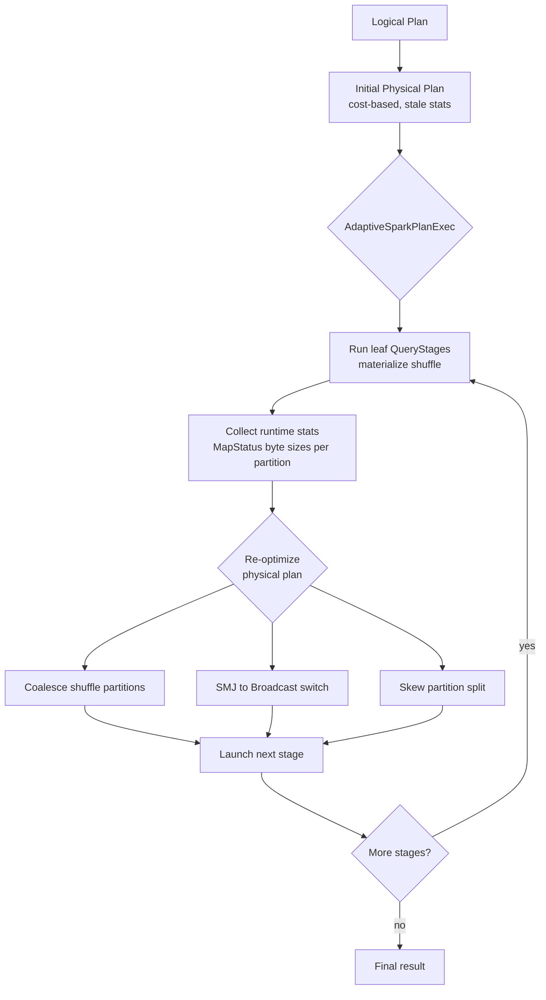

# Adaptive Query Execution (AQE)

> Chapter from the **Data Engineering Playbook** — spark-internals.

## About This Chapter

**What this is.** Adaptive Query Execution (AQE) is Spark 3.x's mechanism for re-optimizing a physical plan (the step-by-step execution strategy Spark builds before running your query) mid-flight using real shuffle statistics. This chapter explains how it works, the three runtime transforms it performs, and how to tune and verify it in production.

**Who it's for.** Mid-level data engineers, data/ML engineers, platform/architecture leads, and engineers preparing for senior/staff data-engineering interviews.

**What you'll take away.** By the end you'll be able to:
- Explain how AQE coalesces (merges) shuffle partitions, switches sort-merge joins to broadcast, and splits skewed join partitions at stage boundaries.
- Tune the knobs that actually move p95 (the 95th-percentile job runtime — a common measure of worst-case performance): `advisoryPartitionSizeInBytes`, the skew factor/threshold pair, `parallelismFirst`, and the broadcast threshold — instead of just flipping `enabled`.
- Recognize AQE's limits — aggregation skew, map-only stages, streaming, driver out-of-memory on the broadcast switch — and verify what it actually did from the executed plan.

---

Spark's cost-based optimizer (CBO — the component that chooses join strategies and execution plans based on estimated data sizes) plans a query *once*, before a single byte moves, using table statistics that are usually stale, missing, or inaccurate. AQE is the mechanism that lets Spark tear up that plan mid-flight and re-optimize using the actual shuffle sizes it just measured. It is the single highest-leverage tuning lever in Spark 3.x for skewed, fan-out, and statistics-poor workloads — and the one most teams misconfigure.

## TL;DR

- AQE re-optimizes the physical plan at **stage boundaries** (the points between shuffle operations where Spark writes data to disk before the next stage reads it) using runtime shuffle statistics (`MapStatus` byte counts — per-partition size measurements collected after each shuffle), not the planner's pre-execution guesses. It is enabled by default since Spark 3.2 (`spark.sql.adaptive.enabled=true`).
- Three transforms do almost all the work: **coalescing post-shuffle partitions** (kills the small-files / 200-empty-task problem), **dynamically switching sort-merge joins to broadcast** (kills unnecessary shuffles), and **skew join splitting** (kills the one-task-runs-for-40-minutes problem).
- AQE only acts at materialization points — it reacts to **exchanges** (shuffle operations). A query with no shuffle (a pure map pipeline) gets zero benefit. The unit of adaptivity is the `QueryStage` (a chunk of the plan that runs as a group before AQE can re-optimize).
- The defaults are conservative. The settings that actually move p95 are `advisoryPartitionSizeInBytes`, the skew `skewedPartitionFactor` / `skewedPartitionThresholdInBytes` pair, and `autoBroadcastJoinThreshold` — not the master `enabled` flag everyone already has on.
- AQE does **not** fix everything: it can't re-pick a bad partition column, can't help streaming, and its broadcast switch can OOM (crash with out-of-memory error) the driver if you raise the threshold without watching driver heap. It complements, not replaces, skew handling and good Catalyst (Spark's query planning engine) plan hygiene.

## Why this matters in production

Here is the concrete failure I have debugged dozens of times. A nightly join of a 4 TB clickstream fact against a dimension table runs as a sort-merge join (SMJ — a join strategy where both sides are sorted and shuffled across the cluster before being merged). The planner estimated the dimension at 1.2 GB (the table stats were computed six months ago when it was small), so it picked SMJ over broadcast. The dimension is now 18 MB after a backfill cleanup. Without AQE, Spark dutifully shuffles 4 TB across the cluster to satisfy a join that could have been a broadcast. The job takes 95 minutes and shuffle spill alerts page the on-call.

A second, more common pattern: the same job emits 200 output files of wildly uneven size because `spark.sql.shuffle.partitions=200` is a static guess. Half the post-shuffle partitions are 4 KB, a few are 9 GB. You get 200 tasks where 196 finish in seconds and 4 run for 40 minutes — classic long-tail straggler (a task that takes much longer than all others, holding back the entire stage). The stage's wall-clock is governed entirely by the largest partition.

AQE addresses both at runtime: it measures that the build side (the smaller table that gets loaded into memory) of the join is actually 18 MB and rewrites SMJ to broadcast hash join (BHJ — a join strategy where the small side is broadcast to every executor, avoiding a full shuffle of the large side); it measures the real post-shuffle partition sizes and coalesces the 200 down to ~30 evenly-sized ~64 MB partitions; and if one partition is still 9 GB, it splits that single skewed partition into sub-partitions handled by parallel tasks. The 95-minute job lands in 12 minutes. None of that required a code change or a re-run of `ANALYZE TABLE`.

## How it works

The core idea: Spark's physical plan is a DAG (directed acyclic graph — a map of steps with dependencies but no cycles) of stages separated by **exchanges** (shuffles). Each exchange is a hard materialization boundary — Spark *must* write map output and record per-partition byte sizes (`MapStatus`) before the reduce side can start. AQE hijacks that boundary. Instead of committing to one final plan, the `AdaptiveSparkPlanExec` node splits the plan into `QueryStage`s, runs the leaf stages (the first independent stages at the start of the plan), reads back their *actual* statistics, and re-optimizes the remaining plan before launching the next stage.



The three runtime rules, in mechanism terms:

**1. Coalesce shuffle partitions.** After a shuffle, AQE knows the true byte size of all `spark.sql.shuffle.partitions` post-shuffle partitions. It greedily merges adjacent small partitions until each merged group reaches `advisoryPartitionSizeInBytes` (default 64 MB). So you set `shuffle.partitions` high (1000–2000) as a *ceiling* and let AQE collapse it down to whatever is right. This is the headline reason you stop hand-tuning `shuffle.partitions`.

**2. Dynamic join switch (SMJ to BHJ).** When the actual size of a join's build side (measured after its child stage materializes) is below `spark.sql.adaptive.autoBroadcastJoinThreshold` (falls back to `spark.sql.autoBroadcastJoinThreshold`, default 10 MB), AQE rewrites the sort-merge join into a broadcast hash join, eliminating the shuffle of the large side entirely.

**3. Skew join split.** A partition is "skewed" if its size is both `> skewedPartitionFactor × median` (default factor 5.0) **and** `> skewedPartitionThresholdInBytes` (default 256 MB). Both conditions must hold — this guards against splitting a uniformly large but un-skewed dataset. AQE splits each skewed partition into `ceil(size / advisoryPartitionSizeInBytes)` sub-partitions and replicates (copies) the matching partition on the other join side so the split halves still join correctly.

The skew detection predicate (the exact formula Spark uses to decide if a partition is skewed), precisely:

```
isSkewed(p) = size(p) > skewedPartitionFactor * median(allPartitionSizes)
              AND size(p) > skewedPartitionThresholdInBytes
numSplits(p) = max(ceil(size(p) / advisoryPartitionSizeInBytes), 1)
```

## Deep dive

**AQE reacts to exchanges, full stop.** This is the single most misunderstood fact. If your stage has no shuffle — `df.withColumn(...).filter(...).write` — there is no `MapStatus`, no statistics to read back, and AQE does nothing. People enable AQE, see no change on a map-only ETL job, and conclude it "doesn't work." It works exactly as designed; there was simply nothing for it to adapt at. The first beneficial reaction can only happen *after* the first shuffle completes.

**Initial partition count matters more than people think.** Set `spark.sql.shuffle.partitions` *higher* than you would without AQE, because coalescing can only merge, never split (skew splitting is a separate path). If you set it to 50 and your data wants 200 fine-grained partitions pre-coalesce, AQE has nothing to work with — it can't manufacture parallelism that the shuffle didn't produce. The idiom is `shuffle.partitions = 1000–2000` as a high ceiling, `advisoryPartitionSizeInBytes = 64–128 MB` as the target, and let coalescing land on the right number.

**`spark.sql.adaptive.coalescePartitions.parallelismFirst`** (default `true` in 3.3+) is a trap for write-heavy jobs. When `true`, AQE prioritizes keeping enough partitions to saturate cores (keep all CPU cores busy) over hitting `advisoryPartitionSizeInBytes`, so you can still get many small partitions and small output files. If your goal is fewer, fatter output files (the usual Iceberg/Delta write case), set this `false` so it actually respects the advisory size and honors `coalescePartitions.minPartitionSize` (default 1 MB).

**The broadcast switch can OOM the driver.** When AQE flips SMJ to BHJ, the build side is collected to the driver (the central Spark process that coordinates the job) and broadcast. The threshold check uses *compressed shuffle bytes*; the broadcast relation is the *deserialized, in-memory* size (the expanded object representation in RAM), which can be several times larger. I have seen a "20 MB" build side balloon to 400 MB on the driver heap because of object overhead and dictionary expansion. Symptom: `java.lang.OutOfMemoryError` on the driver right after a stage boundary, or a long GC pause (garbage collection pause — when the JVM stops to free memory) that looks like a hang. Do not blindly raise `autoBroadcastJoinThreshold` to 200 MB to "force more broadcasts."

**Skew split needs a real shuffle join.** Skew handling in AQE applies to sort-merge and shuffle-hash joins. It does **not** apply to a join that has already been broadcast (there is no shuffle to split), and it does nothing for skew in *aggregations* — a `groupBy` on a hot key (a key value that appears far more often than others) still funnels into one reduce task. For aggregation skew you still need salting (adding a random prefix to hot keys to spread them across partitions) or a two-phase aggregate; see the skew-handling chapter. This is a common review-time mistake: "AQE is on, so skew is handled." Only join skew, only when both threshold conditions trip.

**AQE changes the number of output files non-deterministically.** Because the final partition count depends on *measured runtime sizes*, two runs of the same job over slightly different input can emit different file counts. Downstream consumers that assume a fixed file layout, or tests asserting an exact partition count, will flake (fail intermittently). For deterministic output you pin it with an explicit `.repartition(n)` *after* the AQE-governed stage, or accept the variance and compact downstream.

**Local shuffle reader and the AdaptiveSparkPlan in the UI.** When AQE converts SMJ to BHJ it also enables a *local shuffle reader* (a reader that pulls shuffle data from local disk rather than over the network, saving bandwidth) to avoid an extra network shuffle of the already-shuffled side. In the SQL tab of the Spark UI you will see the plan node `AdaptiveSparkPlan isFinalPlan=true` once it settles; while a query is mid-flight it shows `isFinalPlan=false` and the plan node tree literally changes between stages. Reading that node is how you confirm AQE actually fired — `CustomShuffleReader coalesced` and `skewed=true` annotations are the proof.

**`explain()` lies until the query runs.** Because AQE decisions are runtime, a static `df.explain()` shows the *initial* plan, not the adapted one. To see what AQE actually did, run the query and read the final plan from the UI, or use `df.explain(mode="formatted")` *after* an action has materialized it. Engineers chasing "why is this still a sort-merge join in explain?" are reading the pre-AQE plan.

## Worked example

A realistic configuration block plus the join that exercises all three transforms. This is the profile I run for large lakehouse batch jobs on EMR/Spark 3.4.

```python
from pyspark.sql import SparkSession

spark = (
    SparkSession.builder
    .appName("aqe-clickstream-enrich")
    # --- AQE master switches ---
    .config("spark.sql.adaptive.enabled", "true")
    .config("spark.sql.adaptive.coalescePartitions.enabled", "true")
    .config("spark.sql.adaptive.skewJoin.enabled", "true")
    # --- partition shaping: high ceiling, AQE coalesces down ---
    .config("spark.sql.shuffle.partitions", "2000")
    .config("spark.sql.adaptive.advisoryPartitionSizeInBytes", "128m")
    .config("spark.sql.adaptive.coalescePartitions.parallelismFirst", "false")
    .config("spark.sql.adaptive.coalescePartitions.minPartitionSize", "16m")
    # --- skew detection (defaults shown for clarity; tuned a bit aggressive) ---
    .config("spark.sql.adaptive.skewJoin.skewedPartitionFactor", "5")
    .config("spark.sql.adaptive.skewJoin.skewedPartitionThresholdInBytes", "256m")
    # --- broadcast switch: keep it sane to protect the driver ---
    .config("spark.sql.adaptive.autoBroadcastJoinThreshold", "32m")
    .getOrCreate()
)

fact = spark.read.format("iceberg").load("warehouse.events.clickstream")   # ~4 TB
dim  = spark.read.format("iceberg").load("warehouse.ref.account_dim")        # ~18 MB after cleanup

# user_id is heavily skewed: bot/service accounts dominate a few keys.
enriched = (
    fact.join(dim, on="account_id", how="left")          # SMJ -> BHJ candidate (dim is tiny)
        .groupBy("account_id", "event_date")             # shuffle: coalesce + skew-split here
        .agg({"event_id": "count"})
)

(enriched.write
    .format("iceberg")
    .mode("overwrite")
    .partitionedBy("event_date")
    .save("warehouse.marts.daily_account_activity"))
```

What AQE does at runtime, stage by stage:

| Stage boundary | Measured fact | AQE action | Observable in UI |
| --- | --- | --- | --- |
| After `dim` scan/exchange | build side = 18 MB < 32 MB threshold | SMJ → BroadcastHashJoin; 4 TB side no longer shuffled | join node flips, `LocalShuffleReader` appears |
| After `groupBy` shuffle | 2000 partitions, most < 10 MB | coalesce to ~310 partitions of ~128 MB | `CustomShuffleReader coalesced` |
| Same shuffle, hot `account_id` | one partition = 9 GB > 5× median and > 256 MB | split into ceil(9216/128) ≈ 72 sub-tasks | `CustomShuffleReader skewed=true` |

To verify after the fact, not from the static plan:

```python
enriched.write...   # run the action first
print(enriched._jdf.queryExecution().executedPlan().toString())
# look for: AdaptiveSparkPlan isFinalPlan=true, BroadcastHashJoin, CustomShuffleReader
```

## Production patterns

- **High ceiling, advisory target.** `shuffle.partitions = 1000–2000`, `advisoryPartitionSizeInBytes = 128m`. Stop hand-tuning partition counts per job; let coalescing converge. This alone eliminates most "200 empty tasks" and small-file complaints.
- **`parallelismFirst=false` for write jobs, leave `true` for compute-bound jobs.** Write jobs care about output file size; compute jobs care about core saturation. They are genuinely different objectives — set the flag per job class, not globally.
- **Cap the broadcast threshold and watch driver heap.** Keep `autoBroadcastJoinThreshold` at 32m (not the 100m+ some teams push) and provision driver memory with headroom (`spark.driver.memory=8g` minimum for join-heavy jobs) because the broadcast switch is a driver-memory event.
- **Pair AQE skew split with sane key design.** AQE splits join skew at runtime, but if the *same* hot key shows up in a `groupBy`, AQE won't help. Salt the aggregation. AQE is the safety net, not the primary skew strategy — see the skew-handling chapter.
- **Pin output partitioning explicitly when downstream contracts demand it.** End the job with `.repartition(event_date_col)` or a fixed-N repartition so file layout is deterministic despite AQE's runtime variance.
- **Read the final plan in CI smoke tests.** Assert `isFinalPlan=true` and that the expected join became `BroadcastHashJoin` for representative inputs, so a stats regression that silently turns off broadcast gets caught before it pages anyone.

## Anti-patterns & failure modes

| Anti-pattern | Symptom you observe | Fix |
| --- | --- | --- |
| Setting `shuffle.partitions` low (e.g. 50) expecting AQE to add parallelism | Long-tail tasks, under-coalesced large partitions, no improvement | Set it high (1000–2000); AQE only merges down, never splits up |
| Raising `autoBroadcastJoinThreshold` to 200m to "force broadcasts" | Driver `OutOfMemoryError` / long GC right after a stage boundary | Keep threshold ≤ 32–64m; the in-memory broadcast is several× the compressed bytes |
| Assuming AQE handles aggregation skew | Single reduce task on a `groupBy` runs for 30+ min; skew split never fires | Salt the key / two-phase aggregate; AQE skew applies only to shuffle joins |
| Reading `explain()` and seeing SMJ, concluding AQE failed | Static plan shows sort-merge join | Read the *executed* plan post-action; `explain()` shows the pre-AQE plan |
| `parallelismFirst=true` on a write job | Hundreds of tiny output files despite 128m advisory size | Set `coalescePartitions.parallelismFirst=false` |
| Tests asserting exact output file/partition count | Flaky CI across runs with slightly different input | AQE output count is runtime-dependent; pin with explicit repartition or assert ranges |
| Expecting AQE to help a structured streaming query | No coalescing/skew handling in streaming micro-batches | AQE is batch-only; tune `shuffle.partitions` and key design manually for streaming |

## Decision guidance

| Situation | Use AQE? | Notes |
| --- | --- | --- |
| Batch SQL/DataFrame jobs on Spark 3.2+ | **Yes, always on** | Default-on; the question is tuning the advisory/skew knobs, not whether to enable |
| Statistics are stale / `ANALYZE TABLE` not run | **Yes — primary mitigation** | AQE's whole value is being right when the CBO is wrong |
| Join skew on a few hot keys | **Yes, with `skewJoin.enabled`** | Pair with thresholds tuned to your median partition size |
| Aggregation / `groupBy` skew | **AQE insufficient** | Salt the key; AQE only splits join skew |
| Pure map pipeline, no shuffle | **No effect** | Nothing to adapt; not a knock on AQE |
| Structured Streaming | **Not applicable** | AQE is batch-only; tune statically |
| Tiny jobs (< a few seconds) | **Marginal** | Per-stage re-optimization overhead isn't worth much; harmless to leave on |
| You need deterministic file output | **Yes, but pin output** | Add explicit repartition after the AQE-governed stage |

AQE versus its alternatives is mostly a false choice: it composes with broadcast hints, `repartition`, and `ANALYZE TABLE` rather than replacing them. The principal-level framing is *AQE is a runtime safety net for an optimizer that plans on guesses.* You still want good statistics and good key design; AQE is what saves you on the night the statistics are six months stale and nobody noticed.

## Interview & architecture-review talking points

- "AQE re-optimizes at stage boundaries using real `MapStatus` shuffle byte counts, so it's correcting the CBO precisely where the CBO is weakest — stale or missing statistics." This frames AQE as *complementing* Catalyst, not magic.
- Name the three transforms and their conditions precisely: coalesce (advisory 64–128 MB target), SMJ→BHJ (build side < broadcast threshold, measured at runtime), skew split (`size > 5× median AND > 256 MB`, both required). Knowing the *both-conditions* skew predicate signals you've read the source, not just the docs.
- The driver-OOM risk on the broadcast switch is the detail that separates "I read a blog" from "I've run this in prod." Compressed shuffle bytes vs deserialized broadcast size is the gotcha.
- "AQE doesn't help aggregation skew or map-only stages" — stating the *limits* of a tool is what reviewers trust.
- For a design review: I'd argue for AQE-on with `shuffle.partitions` high, `parallelismFirst=false` for write jobs, capped broadcast threshold, and a CI assertion on the final plan — and I'd explicitly call out that AQE is the runtime backstop while salting and partition-key design remain the first-line defenses.

## Further reading

- skew-handling chapter — salting, two-phase aggregation, and where AQE's skew split stops helping.
- catalyst chapter — the cost-based optimizer AQE corrects at runtime; understand the initial plan before reasoning about adaptation.
- tungsten chapter — the execution engine and memory model underneath; relevant to why broadcast relations cost more heap than their shuffle size suggests.
- lakehouse/iceberg chapter — output file sizing and compaction, the downstream consumer of AQE's coalescing decisions.
