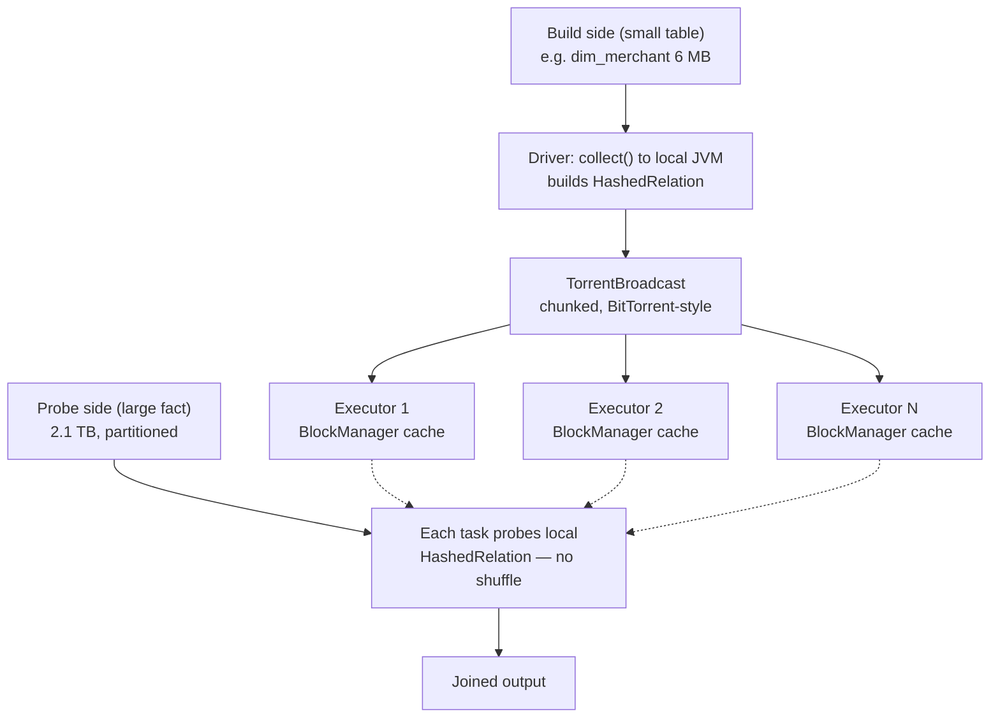

# Broadcast Join

> Chapter from the **Data Engineering Playbook** — spark-internals.

## About This Chapter

**What this is.** A broadcast hash join ships the small side of a join to every executor (worker node) as a hash table (an in-memory lookup structure), eliminating the shuffle (network data transfer) on the large side. This chapter covers how it works through the driver, when Spark picks it, and the sharp edges that make it run out of memory or silently not fire.

**Who it's for.** Mid-level data engineers, data/ML engineers, platform/architecture leads, and engineers preparing for senior/staff data-engineering interviews.

**What you'll take away.** By the end you'll be able to:
- Trace the build/probe data path and explain why the driver heap (the memory available to the Spark driver process) — not the executors — is the broadcast bottleneck.
- Decide when broadcast is correct, account for compressed-on-disk vs deserialized-in-memory size, and apply hints and AQE runtime promotion safely.
- Diagnose the classic failures (driver OOM, `broadcastTimeout`, wrong-side hint on an outer join, broken exchange reuse) from logs and the physical plan.

---

## TL;DR

- A broadcast hash join (`BroadcastHashJoinExec`) ships one side of the join to every executor as a read-only hash table, eliminating the shuffle on the large side. No shuffle means no exchange (no network data movement), no sort, and no skew (data imbalance) on the join key.
- The build side (the small table) is collected to the driver first, serialized (converted into a transmittable format), then pushed to executors via `TorrentBroadcast` (a BitTorrent-style chunked distribution mechanism). The driver heap is the first thing that breaks, not the executors.
- Spark auto-broadcasts a side only when its *estimated* size is below `spark.sql.autoBroadcastJoinThreshold` (default 10 MB). The estimate comes from table statistics, and bad stats are the number one reason broadcasts fire — or fail to fire — when you don't expect.
- AQE (`spark.sql.adaptive.enabled`, which stands for Adaptive Query Execution) changes the game: it can convert a planned sort-merge join into a broadcast join *at runtime* using actual shuffle map-output sizes, governed by `spark.sql.adaptive.autoBroadcastJoinThreshold`.
- The classic failure is `OutOfMemoryError` / `Not enough memory to build and broadcast` on the driver when a "small" dimension turns out to be 400 MB decompressed (uncompressed in memory), or when a `broadcast()` hint forces a side that grew large because a filter didn't push down.
- Broadcast is the highest-leverage join optimization in Spark: a 2 TB fact joined to a 5 MB dimension should *never* shuffle the fact. Getting this right is the difference between a 4-minute job and a 50-minute one.

## Why this matters in production

Here is a concrete example: a daily `transactions` fact table at roughly 2.1 TB / 18 billion rows joined to `dim_merchant` (about 120k rows, 6 MB on disk) to attach merchant category and region before aggregation.

With a default sort-merge join, Spark does this:

1. Hash-partition **both** sides on `merchant_id` across `spark.sql.shuffle.partitions` (200 by default). Hash-partitioning means rows with the same key are sent to the same partition so they can be compared.
2. Write roughly 2.1 TB of fact data to shuffle files on local disk.
3. Pull it back over the network, sort each partition, and merge.

That shuffle alone moves 2 TB across the network twice (map write + reduce read), spills to disk, and — because merchant traffic is power-law distributed (a small number of merchants account for most of the data) — produces a handful of monster partitions where the largest merchant IDs land. One task runs for 40 minutes while 196 others finished in 90 seconds. This is the skew tail (a single slow task caused by uneven data distribution) that dominates wall-clock time.

A broadcast join skips all of it. The 6 MB dimension is broadcast to every executor once; each fact partition probes the in-memory hash table locally. **Zero shuffle on the fact, zero sort, zero skew on the join key.** The same job drops from roughly 50 minutes to roughly 4 minutes, and run-to-run variance collapses because there is no shuffle to spill unpredictably.

The reason this matters beyond raw speed: shuffle is the most expensive and least reliable operation in Spark. It is where you get `FetchFailedException`, executor-loss cascades, and disk-full errors on ephemeral EMR/EKS nodes. Removing a shuffle removes an entire class of incidents.

## How it works

A broadcast hash join has two sides:

- **Build side** — the small one. Collected, hashed into a `HashedRelation` (an in-memory key-value lookup structure), and broadcast.
- **Probe side** — the large one. Streamed through; each row probes the broadcast hash table for matches.

The data path is *not* peer-to-peer between executors. The build side flows **through the driver**:



The decision to broadcast is made by the **planner** in two phases.

**1. Static planning (Catalyst, cost-based).** Catalyst (Spark's query optimizer) compares each side's estimated `sizeInBytes` against `spark.sql.autoBroadcastJoinThreshold`. The estimate comes from:
- Catalog statistics (gathered by running `ANALYZE TABLE ... COMPUTE STATISTICS`), if present and cost-based optimization (CBO) is on.
- Otherwise a heuristic: an un-analyzed relation falls back to `defaultSizeInBytes` (effectively the largest possible number), which means **no auto-broadcast** unless the file-listing size is actually read.

The rule of thumb: a side is auto-broadcast if `min(leftSize, rightSize) <= autoBroadcastJoinThreshold` *and* the join type permits it (you cannot broadcast the preserved side of an outer join — see Deep dive below).

**2. Adaptive re-planning (AQE).** When `spark.sql.adaptive.enabled=true`, Spark first runs the shuffle map stages of a sort-merge join, then reads the **actual** map-output statistics. If a side's real materialized size is under `spark.sql.adaptive.autoBroadcastJoinThreshold`, AQE rewrites the physical plan into a `BroadcastHashJoinExec` for the remaining stages. This is why a job can show a sort-merge join in the planned DAG (the query execution graph) but a broadcast in the executed one. See [AQE](../aqe/README.md).

Cost intuition: a sort-merge join costs roughly `O(shuffle(L) + shuffle(R) + sort)`. A broadcast join costs `O(collect(build) + broadcast(build) × executors + stream(probe))`. Broadcast wins decisively when `build` is small *and* `probe` is large, because you replace a per-row network shuffle of the huge side with a one-time fan-out of the tiny side. The crossover is governed entirely by build-side size — which is exactly what the threshold controls.

## Deep dive

This is where engineers get it wrong. The mechanics have sharp edges.

### The driver is the bottleneck, not the executors

The build side is `collect()`-ed (pulled from all executors into the driver's memory) before broadcast. A 200 MB broadcast can require **several gigabytes** of transient driver heap because:
- The serialized `HashedRelation` is larger than the on-disk Parquet file (Parquet is compressed; the hash table is not).
- The driver holds the deserialized rows *and* the serialized broadcast blocks simultaneously during build.

If your driver is `spark.driver.memory=4g` and you broadcast a 600 MB table, you get:

```
java.lang.OutOfMemoryError: Not enough memory to build and broadcast the table
to all worker nodes. As a workaround, you can either disable broadcast by setting
spark.sql.autoBroadcastJoinThreshold to -1 or increase the spark driver memory by
setting spark.driver.memory to a higher value.
```

There is also a hard guard: `spark.sql.broadcastTimeout` (default 300 seconds). If collecting and broadcasting does not finish in 5 minutes — common when the "small" side is actually a wide join subquery that is slow to materialize — you get `Could not execute broadcast in 300 secs`. The fix is usually *not* raising the timeout; it is recognizing the side is too big to broadcast.

### Statistics lie, and that decides everything

Auto-broadcast hinges on the estimated `sizeInBytes`. Three traps:

1. **Compressed-on-disk vs in-memory.** A 9 MB Parquet file with high-cardinality strings (many unique string values) can be 80 MB as a Java hash table. Spark estimates from the file or stat size, so it broadcasts something that blows the driver.
2. **Stale or missing stats.** Without `ANALYZE TABLE`, the size estimate for a derived relation (a result of a filter or join) is propagated through Catalyst's heuristics and is frequently the maximum possible value, so a genuinely small filtered result *won't* auto-broadcast. You then need an explicit hint.
3. **Filter selectivity is not applied to the size estimate** unless CBO (`spark.sql.cbo.enabled`, which lets Spark use column-level statistics to estimate how much a filter reduces the data) is on with column stats. `WHERE country = 'US'` might cut a table to 8 MB, but Catalyst still sees the full 2 GB and refuses to broadcast.

```sql
-- Make the estimate trustworthy
ANALYZE TABLE dim_merchant COMPUTE STATISTICS;
ANALYZE TABLE dim_merchant COMPUTE STATISTICS FOR ALL COLUMNS;  -- enables CBO selectivity
```

### Join types restrict which side can be broadcast

You can only broadcast the side whose absence-of-match is *safe* to handle by streaming the other side. In a LEFT OUTER join, every row from the left side must appear in the output even if there is no match — so the left side must be streamed, not broadcast.

| Join type            | Broadcastable side(s)              |
|----------------------|------------------------------------|
| `INNER`              | either side                        |
| `LEFT OUTER`         | **right** side only                |
| `RIGHT OUTER`        | **left** side only                 |
| `LEFT SEMI` / `ANTI` | **right** side only                |
| `FULL OUTER`         | neither (cannot broadcast)         |
| `CROSS` / non-equi   | either (`BroadcastNestedLoopJoin`) |

So `big_fact LEFT JOIN small_dim` *can* broadcast `small_dim`, but `small_dim LEFT JOIN big_fact` cannot broadcast `big_fact` even with a hint — the planner silently falls back to sort-merge. Engineers often hint the wrong side and wonder why nothing changed. Check the physical plan (the actual execution plan Spark produces), not your intentions.

### Broadcast hints and precedence

`broadcast(df)` in Python or `/*+ BROADCAST(t) */` in SQL is a directive (a firm instruction to Spark), not a suggestion: it bypasses the threshold check (but **not** the join-type restriction, and not the driver memory limit). When multiple hints conflict, Spark 3.x resolves with precedence `BROADCAST > MERGE > SHUFFLE_HASH > SHUFFLE_REPLICATE_NL`. If both sides of an inner join are hinted `BROADCAST`, Spark broadcasts the smaller one.

A forced broadcast that is too big still runs out of memory on the driver — the hint disables the size *check*, not the size *reality*.

### The shuffle-hash join cousin

When a side is too big to broadcast but still meaningfully smaller than the other, Spark can use `ShuffledHashJoinExec` (shuffle both sides, but build a hash table on the smaller partition instead of sorting). This approach is gated behind `spark.sql.join.preferSortMergeJoin=true` (the default), so you rarely see it unless you flip that flag off. It is the middle ground: cheaper than sort-merge (no sort step), but it still shuffles the big side, so it is not in the same league as broadcast.

### Broadcast reuse

If the same small relation is broadcast in multiple joins within one query, Spark's `ReuseExchange` rule shares a single `BroadcastExchangeExec` across them — you broadcast once and probe many times. You will see `ReusedExchange` nodes in the physical plan. Breaking this (for example by applying a slightly different filter to each usage, or inserting a `cache()` between joins) silently multiplies your broadcast cost.

## Worked example

End-to-end PySpark: the 2 TB fact joined to a small dimension, done right.

```python
from pyspark.sql import SparkSession
from pyspark.sql.functions import broadcast, col

spark = (
    SparkSession.builder
    .appName("txn_enrich")
    # Driver must hold the build side + serialized broadcast blocks
    .config("spark.driver.memory", "8g")
    .config("spark.sql.adaptive.enabled", "true")
    # Auto-broadcast anything Catalyst estimates under 64 MB
    .config("spark.sql.autoBroadcastJoinThreshold", str(64 * 1024 * 1024))
    # AQE runtime promotion threshold (uses real shuffle sizes)
    .config("spark.sql.adaptive.autoBroadcastJoinThreshold", str(64 * 1024 * 1024))
    # Give the broadcast room before it times out under load
    .config("spark.sql.broadcastTimeout", "600")
    .getOrCreate()
)

fact = spark.read.table("lake.transactions")          # ~2.1 TB
dim  = spark.read.table("lake.dim_merchant")          # ~6 MB, 120k rows

# Filter and project the dimension BEFORE the join so the broadcast payload is minimal.
dim_active = dim.where(col("is_active") == True).select(
    "merchant_id", "category", "region"
)

# Explicit hint: do not depend on stats being fresh. This is an INNER join,
# so either side is broadcastable; we force the small one.
enriched = fact.join(
    broadcast(dim_active),
    on="merchant_id",
    how="inner",
)

enriched.explain(mode="formatted")
```

What you want to see in `explain` (the command that prints the physical execution plan):

```
== Physical Plan ==
* BroadcastHashJoin Inner BuildRight (merchant_id = merchant_id)
:- * ColumnarToRow
:  +- FileScan parquet lake.transactions[...]            <- probe side, streamed, NO Exchange
+- BroadcastExchange HashedRelationBroadcastMode, [merchant_id]
   +- * Filter (is_active = true)
      +- FileScan parquet lake.dim_merchant[...]          <- build side, broadcast
```

The key indicator is `BroadcastHashJoin ... BuildRight` with **no `Exchange` (shuffle) node above the fact scan**. If you instead see `SortMergeJoin` with two `Exchange hashpartitioning` children, the broadcast did not fire — check why (size estimate, join type, or a `cache()` that defeated the hint).

SQL form, equivalent:

```sql
SELECT /*+ BROADCAST(d) */
       f.txn_id, f.amount, d.category, d.region
FROM   lake.transactions f
JOIN   (SELECT merchant_id, category, region
        FROM lake.dim_merchant WHERE is_active = true) d
  ON   f.merchant_id = d.merchant_id;
```

Sanity-check the build side before trusting any threshold:

```python
n = dim_active.count()
print(n, "rows")              # if this is in the tens of millions, you are NOT broadcasting
assert n < 5_000_000, "build side too large to broadcast safely"
```

## Production patterns

- **Pre-filter and pre-project the build side.** Broadcast `select(needed_cols).where(...)`, never the raw table. Shrinking 30 columns to 3 can take a 200 MB broadcast under the 64 MB threshold and keep the driver out of the danger zone.
- **Raise the threshold deliberately, not blindly.** The 10 MB default is conservative for modern clusters. On jobs with a 16 GB driver, running `autoBroadcastJoinThreshold` at 64–128 MB is reasonable — pair it with `spark.driver.memory` sized to roughly 4 times the largest broadcast. Set both together or you trade a slow job for an OOM.
- **Trust AQE for the gray zone.** For dimensions that hover near the threshold and vary day to day, keep the static threshold modest and let `spark.sql.adaptive.autoBroadcastJoinThreshold` promote to broadcast using real sizes. This avoids broadcasting a dimension that grew past safe limits overnight.
- **Broadcast small dimensions in a chain once.** When enriching a fact with five dimensions, structure the query so each small dimension is broadcast and reused; verify `ReusedExchange` appears in the plan. Do not `cache()` the fact between joins — it can break exchange reuse and force re-broadcasts.
- **Keep stats fresh as part of the pipeline.** Run `ANALYZE TABLE ... COMPUTE STATISTICS` for dimension tables on the same schedule they are rebuilt. Stale stats are why auto-broadcast silently regresses to sort-merge after a table grows. See [Catalyst](../catalyst/README.md) for how these stats flow into planning.
- **Disable per-job, not globally.** When one stage legitimately needs sort-merge (both sides large), set `spark.sql.autoBroadcastJoinThreshold=-1` only in that job, never as a cluster default — you would kill broadcast everywhere else.

## Anti-patterns & failure modes

| Anti-pattern | Symptom you observe | Fix |
|---|---|---|
| Broadcasting a side that's small *on disk* but huge in memory (wide strings, arrays) | `OutOfMemoryError: Not enough memory to build and broadcast the table` on the **driver** | Project to needed columns; measure deserialized size; lower threshold or use shuffle-hash |
| `broadcast()` hint on the wrong side of an outer join | Hint silently ignored; plan still shows `SortMergeJoin` | Broadcast the *streamed-against* side (right of LEFT OUTER); rewrite join order |
| Relying on auto-broadcast with no `ANALYZE TABLE` | Genuinely small table runs as sort-merge; slow, skewed | Compute stats, or add an explicit `BROADCAST` hint |
| Threshold raised but driver memory not raised | Intermittent driver OOM under concurrency; works in dev, fails in prod | Size `spark.driver.memory` to ~4× largest broadcast; raise both together |
| Broadcast subquery slow to materialize | `Could not execute broadcast in 300 secs` (`broadcastTimeout`) | The side is too big or slow — switch to sort-merge, don't just raise the timeout |
| `cache()` between chained joins | Repeated broadcasts; `ReusedExchange` disappears from plan | Remove the cache or cache after the joins |
| Forcing broadcast to "fix" skew on a *large* table | Driver OOM or 40-minute collect | Not a broadcast case — use salting or AQE skew join (see [skew-handling](../skew-handling/README.md)) |
| Broadcasting both sides of a join | One side demoted to sort-merge, or whole job slows | Broadcast only the smaller side; let the other stream |

The signatures you grep for in driver logs: `Not enough memory to build and broadcast` and `Could not execute broadcast in N secs`. Both point at the build side being too big — different stages of the same root cause.

## Decision guidance

| Scenario | Use |
|---|---|
| Large fact × small dimension (< ~100 MB build side) | **Broadcast hash join** (auto or hint) |
| Both sides large, join key well-distributed | Sort-merge join (default) |
| Both sides large, join key skewed | Sort-merge **+ AQE skew join** or salting — not broadcast |
| Medium side too big to broadcast but much smaller than the other side | Shuffle-hash join (`preferSortMergeJoin=false`) |
| Full outer join | Sort-merge (broadcast not supported) |
| Cross / non-equi join with one tiny side | `BroadcastNestedLoopJoin` |
| Build size unpredictable day to day | Modest static threshold + **AQE runtime promotion** |

Rule to apply in reviews: if one side fits comfortably in driver memory (rule of thumb: deserialized size is less than roughly 25% of `spark.driver.memory` and at most a few hundred MB) and the other side is materially larger, broadcast it. Otherwise the join's cost is dominated by shuffle, and your effort belongs in [partitioning](../partitioning/README.md) and skew handling, not in forcing a broadcast.

## Interview & architecture-review talking points

- "Broadcast eliminates the shuffle on the **large** side, which is the whole point — you move the small side N times instead of moving the huge side twice. The crossover is purely about build-side size." Frames it as a cost trade, not a magic flag.
- "The driver is the bottleneck. The build side is collected to the driver before fan-out, so the broadcast budget is a driver-heap budget. I size `spark.driver.memory` to roughly 4× the largest broadcast." Shows you know *where* it breaks.
- "I don't trust auto-broadcast blindly because it keys off estimated `sizeInBytes`, and compressed-on-disk is not the same as deserialized-in-memory. I either `ANALYZE TABLE` or use an explicit hint, and I always confirm with `explain` that there is no `Exchange` above the fact scan." The senior reflex: verify the plan.
- "With AQE on, the planned and executed plans differ. Spark can promote a sort-merge to a broadcast at runtime using real map-output sizes via `spark.sql.adaptive.autoBroadcastJoinThreshold`. I lean on that for dimensions that drift in size." Connects to [AQE](../aqe/README.md).
- "Join type constrains which side is broadcastable — you cannot broadcast the preserved side of an outer join, so a hint on the wrong side is a no-op." Catches a subtle correctness and performance bug most people miss.
- "Broadcast is not a skew fix for two large tables. If both sides are big and the key is skewed, that is a salting or AQE skew-join problem; forcing a broadcast just moves the OOM to the driver." Judgment about when *not* to reach for it.

## Further reading

- [AQE](../aqe/README.md) — runtime plan re-optimization that promotes joins to broadcast using real sizes.
- [Catalyst](../catalyst/README.md) — how table statistics and the cost model drive the static broadcast decision.
- [Skew Handling](../skew-handling/README.md) — what to do when broadcast is not the answer because both sides are large.
- [Partitioning](../partitioning/README.md) — controlling the shuffle that broadcast lets you avoid.
- [Tungsten](../tungsten/README.md) — the binary memory format the `HashedRelation` and probe path are built on.
