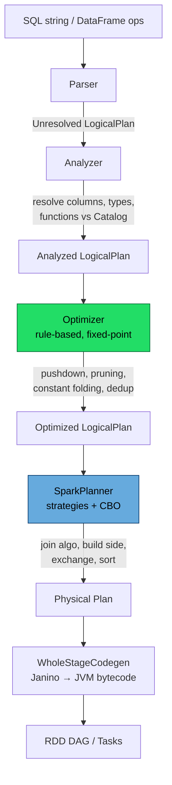

# The Catalyst Optimizer

> Chapter from the **Data Engineering Playbook** — spark-internals.

## About This Chapter

**What this is.** Catalyst is Spark's query compiler — the tree-transformation framework that turns your DataFrame/SQL into a physical plan. This chapter walks its four stages and shows how the optimizer rules that decide your performance actually fire (or get blocked).

**Who it's for.** Data engineers, analytics engineers, data/ML engineers, platform/architecture leads, and engineers preparing for senior/staff data-engineering interviews.

**What you'll take away.** By the end you'll be able to:
- Read `explain(mode="formatted")` and confirm predicate pushdown, column pruning, and partition pruning from `PushedFilters`, `ReadSchema`, and `PartitionFilters`.
- Identify optimization barriers — Python UDFs, non-deterministic functions, `cache()` pinning a wide schema — that silently turn a 70 GB scan into a 4 TB one.
- Use CBO and `ANALYZE TABLE ... COMPUTE STATISTICS FOR COLUMNS` correctly, and know where Catalyst's static planning ends and AQE's runtime re-optimization begins.

---

Catalyst is the query compiler that sits between the DataFrame/SQL you write and the RDD DAG that actually runs. Every `df.filter(...)`, every `spark.sql(...)`, every Iceberg or Delta read goes through it. If you do not understand Catalyst, you are tuning Spark by superstition.

## TL;DR

- Catalyst is a **tree-transformation framework**: a query is a tree of `LogicalPlan`/`Expression` nodes, and optimization is a fixed-point application of rules that rewrite the tree. It is not a black box — `df.explain(True)` shows you all four stages.
- The pipeline is **parsed → analyzed → optimized (RBO) → physical planning (CBO + strategies) → code generation (Tungsten/Janino)**. Most "Spark is slow" tickets are a rule that *could not fire* because the plan shape blocked it.
- The highest-leverage rules are **predicate pushdown, column pruning, partition pruning, and constant folding**. They only work when expressions stay analyzable — a Python UDF or a non-deterministic function is an optimization barrier.
- **Cost-based optimization (CBO)** picks join order and build sides from `ANALYZE TABLE ... COMPUTE STATISTICS`. Without stats Spark falls back to crude size heuristics and routinely picks the wrong build side.
- Catalyst plans **statically, at compile time**. The runtime corrections — coalescing shuffle partitions, flipping to broadcast, splitting skew — are [Adaptive Query Execution](../aqe/README.md), a separate layer that re-optimizes between stages.
- The two failure modes that cost real money: **plans that never replan** (huge analyzed trees from iterative `withColumn` loops) and **stats that lie** (stale or missing, so CBO and [broadcast join](../broadcast-join/README.md) selection go sideways).

## Why this matters in production

A concrete one I have debugged more than once. A nightly job joins a 4 TB fact table against a 12 GB dimension and a 30 MB lookup table, then filters on `event_date >= current_date() - 7`. The job reads the *entire* 4 TB fact every night and takes 90 minutes. The author's mental model: "Spark reads what it needs."

It does not — Catalyst does, *if the plan lets it*. The filter was written after a `selectExpr` that wrapped `event_date` in a Python UDF for "normalization." That UDF is opaque to Catalyst: it cannot push `event_date >= X` through it into the Parquet/Iceberg scan, so partition pruning is dead and you scan everything. Replace the UDF with a native `to_date`/`date_sub` expression and the same job reads 70 GB and finishes in 6 minutes. Nothing about the cluster changed. The *plan* changed because the predicate became pushable.

This is the recurring lesson: your performance is decided in the optimizer, before a single task launches. Knowing which rules exist, and what blocks them, is the difference between a 90-minute job and a 6-minute one.

## How it works

Catalyst models everything as immutable trees. A `LogicalPlan` is a tree of operators (`Filter`, `Project`, `Join`, `Aggregate`, `Relation`); each operator holds a tree of `Expression`s (`GreaterThan`, `Literal`, `AttributeReference`). Optimization = pattern-match a subtree, return a rewritten subtree. Rules are grouped into **batches**, and each batch runs to a **fixed point** (until the tree stops changing) or a max iteration count.



The four stages, and what each actually does:

| Stage | Input | Output | What it decides |
|-------|-------|--------|-----------------|
| **Parser** (ANTLR) | SQL text or DataFrame API calls | Unresolved logical plan | Syntax only; columns are just names |
| **Analyzer** | Unresolved plan + Catalog | Analyzed plan | Resolves `AttributeReference`s, types, function identities, `*` expansion, casts |
| **Optimizer** | Analyzed plan | Optimized logical plan | Rule-based rewrites (RBO): pushdown, pruning, folding, subquery rewrite |
| **Planner** | Optimized logical plan | Physical plan | Strategies + cost model: join algorithm, build side, exchange/shuffle, sort placement |

The optimizer is purely **rule-based (RBO)** and runs to a fixed point. The cost model only enters at **physical planning** — `JoinSelection` uses stats to choose broadcast vs. sort-merge vs. shuffle-hash, and CBO reorders multi-way joins. A useful formula: Catalyst will broadcast a side when its estimated size is below `spark.sql.autoBroadcastJoinThreshold` (default `10MB`, i.e. `10485760`). "Estimated" is the trap — it is `sizeInBytes` from statistics, not the actual on-heap footprint after decompression.

## Deep dive

### Predicate pushdown is a chain of preconditions, not a switch

`PushDownPredicate` walks the tree pushing `Filter` below `Project`, `Join`, and `Aggregate`, and ultimately into the scan via `PushPredicateThroughNonJoin` and the data source's `SupportsPushDownFilters`. Each hop has a precondition:

- **Through a `Project`** — only if the predicate references columns the project produces *and* those columns are not the output of a non-deterministic or non-foldable expression.
- **Into the scan** — only if the data source can express the filter. Parquet/ORC support `=, <, >, IN, IS NULL`; they do **not** support arbitrary UDFs or `LIKE '%x%'` (leading wildcard). Iceberg additionally supports pushing into manifest-level partition predicates, which is why partition pruning on Iceberg is far more effective than on raw Parquet.
- **Across a join** — a predicate on a single side pushes to that side; a predicate spanning both sides becomes a join condition, not a pushdown.

The non-determinism rule is the one people trip on. `rand()`, `current_timestamp()` evaluated per-row, `monotonically_increasing_id()`, and **every Python UDF** are treated as opaque. Catalyst will not reorder around them because doing so could change results. So the moment a UDF touches your filter column upstream of the filter, pushdown stops dead.

```python
# Pushdown DIES here: the UDF wraps the column the filter needs
norm = udf(lambda s: s.strip().lower(), StringType())
df.withColumn("region", norm("region")) \
  .filter(col("region") == "us-west")     # filter is ABOVE an opaque UDF

# Pushdown WORKS: native expression, source-pushable
df.withColumn("region", lower(trim(col("region")))) \
  .filter(col("region") == "us-west")     # pushed into the scan
```

### Column and partition pruning

`ColumnPruning` removes columns no downstream operator needs. With columnar formats this means you literally do not read the bytes. `df.explain()` shows it in the scan's `ReadSchema`. The classic anti-pattern is `select("*")` early followed by selecting two columns at the end — the early `*` does not force a full read because pruning fixes it, **but** wrapping the relation in a UDF, a `cache()`, or a `repartition()` can pin the wider schema in place.

Partition pruning is a special, high-value case. Static partition pruning happens in Catalyst when the predicate is on a partition column with a literal. **Dynamic partition pruning (DPP)**, added in 3.0 and controlled by `spark.sql.optimizer.dynamicPartitionPruning.enabled` (default `true`), is more subtle: when you join a partitioned fact to a filtered dimension, Catalyst injects a subquery that computes the surviving partition keys from the dimension and uses them to prune the fact scan. DPP only fires when the join is a broadcast (or the reuse-exchange path applies) and the fact is partitioned on the join key — get either wrong and you scan the whole fact.

### Constant folding, predicate simplification, and the analysis barrier

`ConstantFolding`, `BooleanSimplification`, `NullPropagation`, and `LikeSimplification` collapse compile-time-evaluable expressions. `WHERE 1=1 AND x > 5` becomes `x > 5`. `coalesce(x, x)` becomes `x`. These matter at scale because they shrink the codegen'd expression tree. A pattern I have actually fixed: a metrics layer programmatically built `WHERE` clauses by string-concatenating dozens of `AND (true)` guards; constant folding handled it, but the *parser* and *analyzer* still had to build and walk a 4,000-node expression tree on every query, adding ~8 seconds of pure driver-side planning before any task ran. The fix was not a Spark config — it was generating fewer nodes.

### Plan-building cost is real: the `withColumn` loop trap

Catalyst trees are immutable; every transformation builds a new tree referencing the old. A loop like this is a footgun:

```python
for c in columns:                      # 300 columns
    df = df.withColumn(c, expr(...))   # each call wraps a new Project node
```

You end up with 300 nested `Project` nodes. The analyzer resolves the *entire* tree on every action, and resolution is roughly quadratic in nesting depth. I have seen this produce 20+ minute `df.count()` calls where execution was instant but **analysis** dominated. The fix is to collapse into a single projection:

```python
df = df.select("*", *[expr(definition).alias(c) for c, definition in cols.items()])
```

One `Project`, one resolution pass. `CollapseProject` in the optimizer merges adjacent projects, but it runs *after* analysis has already paid the cost of building and resolving the deep tree.

### CBO: stats or guesses

Cost-based optimization (`spark.sql.cbo.enabled`, default **false** — you must turn it on) uses table and column statistics to reorder joins and pick build sides. The inputs come from:

```sql
ANALYZE TABLE sales COMPUTE STATISTICS;                          -- row count + table size
ANALYZE TABLE sales COMPUTE STATISTICS FOR COLUMNS region, dt;   -- per-column NDV, min/max, nulls
```

Column stats feed selectivity estimation: a filter `region = 'us-west'` is estimated at `1 / NDV(region)` of rows. Without `FOR COLUMNS` stats, Spark assumes a fixed selectivity and the join-reorder math is garbage. The most common production symptom of missing stats: Spark sort-merge-joins two tables when one was actually 8 MB and should have been broadcast, because `sizeInBytes` defaulted to the conservative `spark.sql.defaultSizeInBytes` (effectively `Long.MaxValue` for an unanalyzed relation), so nothing looked broadcastable. Enable join-reorder explicitly with `spark.sql.cbo.joinReorder.enabled=true`.

This is also where Catalyst's static nature bites: stats are a snapshot. If a partition grew 10× since the last `ANALYZE`, CBO will confidently make the wrong call. This is precisely the gap [AQE](../aqe/README.md) closes by using *actual* runtime shuffle sizes instead of estimates.

## Worked example

End-to-end: read the plan, find the barrier, fix it, confirm the rule fired.

```python
from pyspark.sql import SparkSession
from pyspark.sql.functions import col, lower, trim, to_date, date_sub, current_date

spark = (SparkSession.builder
    .config("spark.sql.cbo.enabled", "true")
    .config("spark.sql.cbo.joinReorder.enabled", "true")
    .config("spark.sql.autoBroadcastJoinThreshold", 10 * 1024 * 1024)  # 10 MB
    .getOrCreate())

fact = spark.read.format("iceberg").load("warehouse.events")     # partitioned by dt
dim  = spark.read.format("iceberg").load("warehouse.regions")    # ~8 MB

result = (fact
    .where(col("dt") >= date_sub(current_date(), 7))             # native -> partition pruning
    .join(dim, "region_id")                                       # small dim -> broadcast
    .where(lower(trim(col("region_name"))) == "us-west")          # native -> pushable
    .select("event_id", "user_id", "region_name", "dt"))          # column pruning

result.explain(mode="formatted")
```

What to look for in `explain` to confirm each rule fired:

```text
== Physical Plan ==
* Project (event_id, user_id, region_name, dt)
+- * BroadcastHashJoin [region_id], BuildRight        <- dim broadcast, CBO/JoinSelection
   :- * Filter (lower(trim(region_name)) = us-west)
   :  +- BatchScan warehouse.events                   <- the scan node...
   :       PushedFilters: [IsNotNull(region_id)]
   :       PartitionFilters: [dt >= 2026-06-11]        <- partition pruning fired
   :       ReadSchema: struct<event_id,user_id,region_id,region_name,dt>  <- column pruning
   +- BroadcastExchange
      +- * Filter ...
         +- BatchScan warehouse.regions
```

The two lines that prove the optimizer did its job: `PartitionFilters: [dt >= ...]` (you are not scanning all of history) and a `ReadSchema` that lists only four columns, not the whole table. If you see `PartitionFilters: []` with a partition predicate present, a barrier (UDF, cache, or a cast Spark could not push) ate your pushdown — go find it.

To force CBO to actually have numbers to reason about:

```sql
ANALYZE TABLE warehouse.regions COMPUTE STATISTICS FOR ALL COLUMNS;
ANALYZE TABLE warehouse.events  COMPUTE STATISTICS FOR COLUMNS region_id, dt;
```

## Production patterns

- **Read `explain(mode="formatted")` into code review.** For any plan-critical job, paste the physical plan in the PR. `PartitionFilters`, `PushedFilters`, and `ReadSchema` are three lines that catch most regressions before they ship.
- **Keep filters expressed in native Catalyst functions** all the way down to the scan. If you must transform a column, do it *after* the filtering column has been used, or push the normalization into the write path so reads stay pushable.
- **Run `ANALYZE TABLE ... COMPUTE STATISTICS FOR COLUMNS`** on dimension and join-key columns as part of the table's maintenance job (alongside [partition](../partitioning/README.md) and compaction maintenance). Stats decay; schedule them.
- **Collapse iterative `withColumn`/`select` loops** into a single projection. If a job's `count()` or `explain()` is slow but execution is fast, suspect analysis cost from a deep tree, not the cluster.
- **Use `spark.sql.optimizer.excludedRules` deliberately, never reflexively.** It exists for working around a specific buggy rule in a specific Spark version; document the rule name and the JIRA when you exclude one.
- **Let DPP do its job:** partition the fact on the join key and keep the dimension broadcastable. DPP turns a full-fact scan into a partition-pruned scan for free, but only when the plan shape cooperates.

## Anti-patterns & failure modes

| Anti-pattern | Symptom you observe | Root cause | Fix |
|---|---|---|---|
| Python UDF upstream of a filter | Full table scan; `PartitionFilters: []`; job time independent of date range | UDF is opaque to Catalyst; pushdown blocked | Replace with native expression, or move UDF below the filter |
| `select("*")` then `cache()` then narrow select | Scan reads all columns; high I/O | `cache()` pins the wide schema; column pruning can't see through it | Project to needed columns before caching |
| 200+ chained `withColumn` calls | `df.count()` takes minutes, execution is instant | Deep nested `Project` tree; quadratic analysis | Single `select` with all expressions |
| CBO on, but no `FOR COLUMNS` stats | Sort-merge join where broadcast was correct; bad join order | Selectivity estimation falls back to defaults | `ANALYZE ... COMPUTE STATISTICS FOR COLUMNS` |
| Leading-wildcard `LIKE '%foo%'` as a "filter" | No `PushedFilters`; full scan | Not expressible to Parquet/ORC source | Add a real partition/bucket predicate; rethink the access pattern |
| Relying on Catalyst for skew/partition sizing | Static plan, then a few tasks run 10× longer | Catalyst plans statically; it cannot see runtime skew | Enable [AQE](../aqe/README.md) and [skew handling](../skew-handling/README.md) |
| `autoBroadcastJoinThreshold` set high to "force broadcasts" | Driver OOM / broadcast timeout | Estimated `sizeInBytes` < threshold but decompressed side blows the driver heap | Trust stats; broadcast small, well-understood dims only |

## Decision guidance

| Situation | Lean on Catalyst (RBO) | Add CBO | Add AQE |
|---|---|---|---|
| Predicate/column/partition pruning | Yes — always on, free | — | — |
| Multi-way join order on stable, analyzed tables | Default heuristics ok | **Yes** — measurable gains with good stats | Complements |
| Tables with stale or no statistics | Heuristics only | Misleading; fix stats first | **Yes** — uses runtime sizes, no stats needed |
| Data skew, post-shuffle partition sizing | Cannot help (static) | Cannot help | **Yes** — this is exactly AQE's job |
| Broadcast vs sort-merge with accurate small-side size | `JoinSelection` via threshold | Better with col stats | AQE can flip to broadcast at runtime |

Rule of thumb: **RBO is non-negotiable and free — make sure nothing blocks it.** Turn **CBO** on when you have invested in keeping statistics fresh on join-heavy workloads. Turn **AQE** on by default in Spark 3.x; it is the runtime safety net for everything Catalyst had to guess at compile time.

## Interview & architecture-review talking points

- "Catalyst optimizes a *static* plan from estimates; AQE re-optimizes from *runtime* facts between stages. They are complementary layers, not alternatives — naming that split is the tell for whether someone actually understands the engine."
- "Most 'Spark is slow' tickets are a rule that couldn't fire. My first move is `explain(mode='formatted')` and I read three lines: `PartitionFilters`, `PushedFilters`, `ReadSchema`. They tell me whether pruning and pushdown happened before I touch a single config."
- "Python UDFs and non-deterministic functions are optimization barriers. A UDF upstream of a filter silently turns a 70 GB scan into a 4 TB scan. The fix is plan shape, not cluster size."
- "CBO without `FOR COLUMNS` statistics is theater — selectivity falls back to defaults and join reorder makes confident wrong choices. Stats are a maintenance task with a decay curve, same as compaction."
- "Deep `withColumn` loops are an analysis-cost problem, not an execution problem. Catalyst trees are immutable and resolution is roughly quadratic in depth; I collapse to a single projection."

## Further reading

- [Adaptive Query Execution](../aqe/README.md) — the runtime re-optimization layer that fixes what Catalyst had to estimate.
- [Broadcast Joins](../broadcast-join/README.md) — how `JoinSelection` and the broadcast threshold interact with Catalyst stats.
- [Partitioning](../partitioning/README.md) — partition pruning and DPP depend on physical layout.
- [Skew Handling](../skew-handling/README.md) — the runtime problem Catalyst's static plan cannot solve.
- [Tungsten](../tungsten/README.md) — whole-stage code generation, the stage after physical planning.
- Armbrust et al., *Spark SQL: Relational Data Processing in Spark* (SIGMOD 2015) — the original Catalyst design paper.
- Apache Spark docs: [SQL Performance Tuning](https://spark.apache.org/docs/latest/sql-performance-tuning.html) and [Cost-Based Optimizer](https://spark.apache.org/docs/latest/sql-ref-syntax-aux-analyze-table.html).
