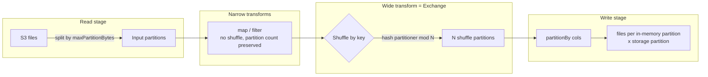

# Partitioning in Spark

> Chapter from the **Data Engineering Playbook** — spark-internals.

## About This Chapter

**What this is.** "Partitioning" in Spark means three different things — runtime task partitions, shuffle partitions, and on-disk storage layout. This chapter separates them and shows how each affects performance, file sizing, and pruning.

**Who it's for.** Data engineers, analytics engineers, data/ML engineers, and platform/architecture leads.

**What you'll take away.** By the end you'll be able to:
- Distinguish runtime, shuffle, and storage partitioning, and pick the right lever for a balance vs. read-optimization problem.
- Prevent the small-files problem with a deliberate write-path `repartition` and async compaction, and choose `repartition` vs `coalesce` correctly.
- Design pruning-friendly layouts (partition columns, DPP, Iceberg/Delta transforms and partition evolution) and verify pruning with `explain("formatted")`.

---

Partitioning is the one Spark concept that lives in three different worlds at once, and engineers conflate them constantly. There is **RDD/DataFrame partitioning** (how the data is split across tasks in memory at runtime), **shuffle partitioning** (how exchange operators redistribute rows by key), and **storage/Hive partitioning** (the physical directory layout on disk, e.g. `dt=2026-06-18/`). They interact, but they are not the same lever, and pulling the wrong one is the difference between a 4-minute job and a 40-minute one.

## TL;DR

- Three distinct partitioning concepts share one word: **runtime task partitions**, **shuffle partitions** (`spark.sql.shuffle.partitions`), and **on-disk storage partitions** (the directory layout). Always say which one you mean.
- Storage partition columns should be **low-to-medium cardinality** and align with how readers filter. `dt` (day) is almost always right; `user_id` is almost always wrong. The goal is partition *pruning*, not infinite subdivision.
- The small-files problem is the most expensive partitioning mistake in practice: each output file is metadata, an open/close, and a task. 200k tiny files in a partition will cripple your metastore listing and your reader before it cripples your compute.
- Target output files of **128 MB–1 GB**. Control them with a deliberate `repartition`/`coalesce` on the *write path*, not by accident.
- AQE (`spark.sql.adaptive.enabled`) coalesces shuffle partitions automatically post-Spark-3.0, so the old "tune `shuffle.partitions` to a magic number" advice is mostly obsolete — but it does nothing for *storage* layout, which you still own.
- Iceberg/Delta hidden partitioning and partition *transforms* (`bucket`, `truncate`, `days`) decouple physical layout from the columns users query, which is the modern answer to most partitioning pain.

## Why this matters in production

A concrete scenario from a clickstream pipeline. The raw events land in S3 partitioned by `event_date`. A downstream job reads 90 days, joins to a `dim_user` table, aggregates by `country`, and writes a daily mart. The job started taking 38 minutes and the cost doubled in a quarter, with no change in data volume per day.

The root cause was three partitioning decisions, none individually catastrophic, compounding:

1. The upstream Kafka→S3 sink wrote one file per micro-batch. At a 1-minute trigger that is **1,440 files per partition per day**, each ~3 MB. Listing 90 days = ~130k objects before a single byte is read.
2. The aggregation shuffled into the default `spark.sql.shuffle.partitions = 200`, regardless of whether the input was 5 GB or 500 GB.
3. The final write did `df.write.partitionBy("country")`, and because the DataFrame had 200 partitions in memory, Spark wrote **200 files per country** — and there are ~200 countries, so ~40,000 output files of a few hundred KB each.

None of this shows up in a code review. It shows up as a slow job, an S3 bill, and an EMR `ListObjects` rate-limit throttle. Partitioning is where logical correctness and physical cost diverge, and the divergence is invisible until it isn't.

## How it works

A Spark DataFrame is a logical plan; at execution it becomes a set of **partitions**, each processed by one **task** on one core. The number of partitions at any stage is determined by the operator that produced it.



The partition count by source:

| Stage | What sets the partition count | Key config |
|---|---|---|
| File read | total bytes ÷ `maxPartitionBytes`, bounded by file/split boundaries | `spark.sql.files.maxPartitionBytes` (default 128 MB) |
| Shuffle (join/agg/window) | fixed N, then AQE may coalesce | `spark.sql.shuffle.partitions` (default 200) |
| Explicit | whatever you ask for | `repartition(n)`, `coalesce(n)`, `repartition(col)` |
| Write | in-memory partitions × distinct storage-partition values | `partitionBy(...)`, plus a pre-write repartition |

**Shuffle hash partitioning** is the mechanical core. For a key `k`, the destination partition is:

```
partitionId = pmod(hash(k), numShufflePartitions)
```

This is why a single hot key (`country = 'US'` with 60% of rows) lands every one of its rows in *one* shuffle partition — the partitioner is deterministic on the key, so one task gets a 30 GB partition while 199 tasks finish in seconds. That is data skew, and it is a *consequence* of how hash partitioning works, not a separate phenomenon. See [skew-handling](../skew-handling/README.md).

**Storage partitioning** is independent of all of this. When you write `partitionBy("dt", "country")`, Spark creates a directory tree `dt=.../country=.../part-*.parquet`. The query optimizer can then *prune* — at plan time it reads the directory names, and a filter `WHERE dt = '2026-06-18'` skips every other directory without opening a file. That pruning is the entire economic justification for storage partitioning.

## Deep dive

### Partition pruning only works if the predicate matches the partition column directly

This is the single most common silent failure. Pruning happens when the filter is on the *partition column*, as a literal or a value Spark can resolve at plan time:

```sql
-- PRUNES: only reads dt=2026-06-18 directory
WHERE dt = '2026-06-18'

-- PRUNES (dynamic partition pruning, DPP, Spark 3.0+): join feeds the filter
WHERE dt IN (SELECT max(dt) FROM control_table)

-- DOES NOT PRUNE: function on the partition column defeats it
WHERE date_trunc('month', to_date(dt)) = '2026-06-01'

-- DOES NOT PRUNE: predicate is on a non-partition column
WHERE country = 'US'   -- if only dt is a partition column
```

The `date_trunc` case is a classic. The partition column `dt` is a string `'2026-06-18'`; the moment you wrap it in `to_date(...)`, Spark can no longer match the predicate against directory names and falls back to a full scan. The fix is to keep partition predicates on the raw partition column, or to add a derived partition column (`mth`) if month-level filtering is common. **Dynamic Partition Pruning** (`spark.sql.optimizer.dynamicPartitionPruning.enabled`, on by default in 3.x) extends pruning to the case where the partition values come from the *other* side of a broadcast join — extremely valuable for star-schema fact tables filtered through a date dimension. See [broadcast-join](../broadcast-join/README.md).

### The small-files problem, quantified

Every Parquet file carries footer metadata, requires an S3 GET + range reads, and becomes at least one read task. The damage is on three axes:

- **Listing**: Hive metastore / S3 `ListObjects` is paginated at 1,000 keys. A table with 5M files spends minutes just enumerating before planning.
- **Task overhead**: ~200 ms of scheduling + JVM warmup per task. 100k files = 100k tasks = pure overhead even at 0 bytes of useful work.
- **Driver memory**: file statuses are held on the driver. Millions of `FileStatus` objects OOM the driver before any executor does work.

The arithmetic that matters: you want roughly `total_data_size / 256 MB` output files. A 50 GB daily partition should be ~200 files, not 40,000. The lever is a **pre-write repartition**:

```python
# 50 GB output, target ~256 MB files => ~200 files
(df
 .repartition(200, "country")          # control in-memory partition count + layout
 .write
 .partitionBy("dt", "country")
 .parquet(path))
```

Without the `repartition`, the number of output files = (in-memory partitions) × (distinct `country` values), which is how you accidentally produce tens of thousands of tiny files.

### `repartition` vs `coalesce` — they are not symmetric

| | `repartition(n)` | `coalesce(n)` |
|---|---|---|
| Triggers shuffle | Yes (full) | No (merges adjacent partitions) |
| Can increase partitions | Yes | No (only decrease) |
| Output size balance | Even | Can be skewed if upstream is uneven |
| Cost | Expensive (network) | Cheap |
| Risk | — | `coalesce(1)` collapses upstream parallelism *backwards* through narrow stages |

The `coalesce(1)` trap: `df.coalesce(1).write(...)` does not just merge at the end — because `coalesce` is a narrow dependency, Spark may run the *entire upstream computation* on a single task to avoid a shuffle. A heavy aggregation that should use 400 cores runs on 1. When you genuinely need one output file, `repartition(1)` is usually safer despite the shuffle, because it isolates the single-partition stage behind an exchange.

### Range partitioning and why `repartitionByRange` exists

Hash partitioning balances by key *count*, not key *size*, and produces no global ordering. `repartitionByRange(n, "ts")` samples the data, computes range boundaries, and assigns rows so partitions are ordered and roughly equal-sized — this is what makes sorted writes (and Z-order-like locality) possible and is the basis of efficient range-pruned reads. The cost is the sampling pass and sensitivity to skewed distributions in the sort key.

### Bucketing — the partitioning you store to avoid shuffles

Bucketing (`bucketBy(n, "user_id")`) hash-partitions data into a *fixed* number of files-per-partition and records it in the table metadata. Two bucketed tables on the same key and bucket count can be joined **shuffle-free** — the data is already co-located. It is powerful for repeated large-table joins on a high-cardinality key, but operationally fragile in plain Hive/Spark (the bucket count is baked in; changing it means a full rewrite; small inserts violate the layout). In practice, Iceberg's `bucket(N, col)` partition transform is a cleaner version of the same idea.

## Worked example

End-to-end: ingest, control file size, write with pruning-friendly layout, and verify pruning.

```python
from pyspark.sql import SparkSession, functions as F

spark = (SparkSession.builder
    .appName("events_mart")
    .config("spark.sql.adaptive.enabled", "true")
    .config("spark.sql.adaptive.coalescePartitions.enabled", "true")
    .config("spark.sql.adaptive.advisoryPartitionSizeInBytes", "256m")
    .config("spark.sql.files.maxPartitionBytes", "256m")
    .config("spark.sql.sources.partitionOverwriteMode", "dynamic")  # only rewrite touched partitions
    .getOrCreate())

raw = spark.read.parquet("s3://lake/raw/events/")

daily = (raw
    .where(F.col("dt") == "2026-06-18")          # prunes at the source
    .withColumn("country", F.coalesce("country", F.lit("UNKNOWN")))
    .groupBy("dt", "country", "device")
    .agg(F.count("*").alias("events"),
         F.approx_count_distinct("user_id").alias("uniq_users")))

# Size the write: aim for ~256 MB files. Estimate ~50 GB => 200 partitions.
# Repartition by the storage partition key so each task writes to ONE country dir.
target_files = 200
(daily
    .repartition(target_files, "country")
    .write
    .mode("overwrite")               # with dynamic mode, only overwrites present dt partitions
    .partitionBy("dt", "country")
    .parquet("s3://lake/marts/events_daily/"))
```

Verify pruning actually happens — never assume, read the plan:

```python
df = spark.read.parquet("s3://lake/marts/events_daily/")
df.where("dt = '2026-06-18' AND country = 'US'").explain("formatted")
# Look for:  PartitionFilters: [isnotnull(dt#..), (dt#.. = 2026-06-18), (country#.. = US)]
# If your filter shows up under "PushedFilters" instead of "PartitionFilters",
# it is NOT pruning — it is reading everything and filtering after.
```

Equivalent Iceberg table with hidden partitioning and a transform — readers filter on `event_ts` directly, never needing to know the physical layout:

```sql
CREATE TABLE lake.events_daily (
  event_ts   TIMESTAMP,
  user_id    BIGINT,
  country    STRING,
  events     BIGINT
) USING iceberg
PARTITIONED BY (days(event_ts), bucket(16, country));

-- The query filters on the raw column; Iceberg derives partition pruning.
SELECT * FROM lake.events_daily
WHERE event_ts >= '2026-06-18' AND event_ts < '2026-06-19';
```

## Production patterns

- **Partition by ingestion/event date, almost always.** `days(event_ts)` or a `dt` string column is the default that satisfies the most common filter (time range) and keeps partition count bounded and predictable.
- **Repartition on the write path to control file size deliberately.** `repartition(n, partition_cols)` before `partitionBy` so each task targets one storage partition and you hit your file-size target. This single pattern prevents the small-files problem.
- **Run compaction as a scheduled job, not inline.** For streaming sinks that must write small files for latency, accept them and run an async compaction job (`OPTIMIZE` in Delta, `rewrite_data_files` in Iceberg) to merge into 256 MB+ files on a cadence. Decouple write latency from read efficiency. See [lakehouse/iceberg](../../lakehouse/iceberg/README.md).
- **Use `partitionOverwriteMode=dynamic`** so a backfill of one day overwrites only that day's directories instead of the entire table — turns a multi-hour full rewrite into a per-partition operation.
- **Prefer Iceberg/Delta partition transforms over raw directory partitioning** when you can. `bucket`, `truncate`, and `days` decouple the physical layout from query columns and support **partition evolution** — you can change the partitioning of a table without rewriting history.
- **Combine a coarse storage partition with file-level data skipping.** Partition by `dt`, then sort/Z-order within the partition by your secondary filter column (e.g. `country`). You get directory pruning *and* Parquet row-group statistics pruning, without exploding directory count.

## Anti-patterns & failure modes

| Anti-pattern | Symptom you observe | Fix |
|---|---|---|
| Partition by high-cardinality column (`user_id`, `uuid`) | Millions of directories, metastore listing takes minutes, driver OOM on planning | Use `bucket(N, user_id)` transform, or partition by a coarse derived key |
| No write-path repartition before `partitionBy` | Tens of thousands of <1 MB files; reads dominated by task overhead | `repartition(n, partition_cols)` before write; schedule compaction |
| `coalesce(1)` on a heavy job | Whole job runs on 1 core; executors idle; massive runtime regression | `repartition(1)` to isolate behind a shuffle, or write many files + compact |
| Function wrapping the partition column in `WHERE` | Full scan despite a "filter"; `explain` shows PushedFilters not PartitionFilters | Filter on the raw partition column; add a derived partition column if needed |
| Over-partitioning by day **and** hour for a low-volume table | 24× the directories, each a few MB; small-files problem with extra steps | Partition by `dt` only; let row-group stats handle intra-day filtering |
| Tuning `spark.sql.shuffle.partitions` to a magic number with AQE on | No effect, or fighting AQE's coalescer | Let AQE coalesce; tune `advisoryPartitionSizeInBytes` instead. See [aqe](../aqe/README.md) |
| Static `overwrite` for a single-day backfill | Entire table wiped and rewritten; hours of compute, history risk | `spark.sql.sources.partitionOverwriteMode=dynamic` |

## Decision guidance

| Situation | Choose |
|---|---|
| Time-series / event data, filtered by time | Storage partition by `dt` / `days(ts)`; nothing fancier 90% of the time |
| Repeated large–large joins on a high-cardinality key | `bucket(N, key)` (Iceberg) or `bucketBy` to eliminate join shuffles |
| Need a global sort or range-pruned reads | `repartitionByRange` + sorted write; or Z-order/clustering in Delta/Iceberg |
| Reducing partition count without a shuffle | `coalesce(n)` — but watch the upstream-parallelism trap |
| Changing partition count or rebalancing skew | `repartition(n)` — pays the shuffle, gets even partitions |
| Shuffle partition sizing for joins/aggs | AQE on + `advisoryPartitionSizeInBytes`; stop hand-tuning `shuffle.partitions` |
| Layout must change as the table grows | Iceberg partition evolution — change spec without rewriting old data |

Rule of thumb: **storage partitioning is a read-optimization decision; runtime/shuffle partitioning is a compute-balance decision.** Don't solve one with the other.

## Interview & architecture-review talking points

- "Which partitioning?" — Establish early that you distinguish runtime task partitions, shuffle partitions, and on-disk layout. Conflating them is the tell of someone who hasn't run this at scale.
- The small-files problem is the partitioning failure that costs the most money, and it is a *write-path* problem solved by a deliberate repartition plus async compaction — not by reader tuning.
- Partition pruning is the entire ROI of storage partitioning, and it is fragile: a function on the partition column silently disables it. I verify with `explain("formatted")` and grep for `PartitionFilters`, never assume.
- Cardinality discipline: a good partition column produces hundreds to low-thousands of partitions over the table's life, each in the 256 MB–1 GB range. `user_id` fails this; `dt` passes it.
- Modern lakehouse formats made most of this a solved problem: hidden partitioning, partition transforms, and partition evolution decouple physical layout from query columns and let layout change without rewrites — which is why I default to Iceberg/Delta over raw Hive directory partitioning for any table expected to evolve.
- AQE changed the playbook: shuffle-partition hand-tuning is largely dead, but AQE does nothing for storage layout — that remains an explicit design decision the engineer owns.

## Further reading

- [Data Skew Handling in Spark](../skew-handling/README.md) — the direct consequence of hash partitioning a hot key
- [Adaptive Query Execution (AQE)](../aqe/README.md) — automatic shuffle-partition coalescing
- [Broadcast Join](../broadcast-join/README.md) — and Dynamic Partition Pruning through a broadcast
- [Catalyst](../catalyst/README.md) — where partition filters are pushed down at plan time
- [Iceberg](../../lakehouse/iceberg/README.md) — partition transforms, hidden partitioning, partition evolution
- [Cost Optimization](../../finops/cost-optimization/README.md) — the bill that small files and missed pruning generate
- Apache Spark SQL Performance Tuning guide — [spark.apache.org/docs/latest/sql-performance-tuning.html](https://spark.apache.org/docs/latest/sql-performance-tuning.html)
- Iceberg partitioning & hidden partitioning — [iceberg.apache.org/docs/latest/partitioning](https://iceberg.apache.org/docs/latest/partitioning/)
