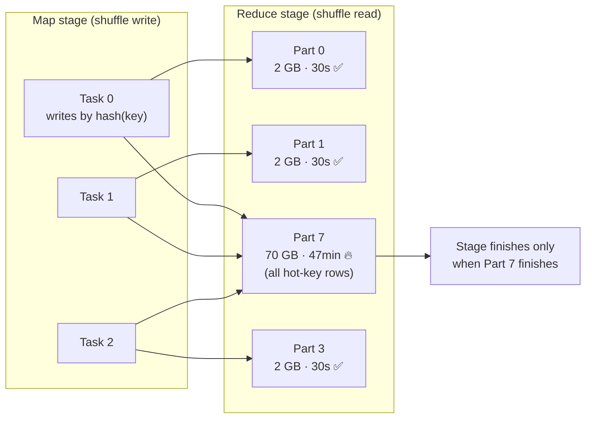

# Data Skew Handling in Spark

> Chapter from the **Data Engineering Playbook** — spark-internals.

A single straggler task that runs for 47 minutes while 1,999 of its 2,000 siblings finished in 30 seconds is not a tuning problem — it is a data-distribution problem wearing a performance costume. This chapter is about recognizing that, and fixing the distribution rather than throwing executors at it.

## TL;DR

- **Skew is a property of your key distribution, not your cluster.** Adding executors makes a skewed job *more expensive* without making it faster, because the bottleneck is one partition pinned to one core.
- **AQE skew join (`spark.sql.adaptive.skewJoin.enabled`) handles the common case for free** — it splits oversized shuffle partitions at runtime. Learn its thresholds (`skewedPartitionFactor`, `skewedPartitionThresholdInBytes`) before reaching for anything custom.
- **Salting is the escape hatch when AQE can't help** — `groupBy`/`reduceByKey` aggregations, skewed windows, and `Stream-stream` joins. Salting trades a wider shuffle and a second aggregation pass for balanced tasks.
- **Diagnose with the max/median task-duration ratio and the max/median shuffle-read-bytes ratio in the Spark UI.** A ratio above ~5x on the slowest stage is your signal; the offending stage's `Summary Metrics` table is the smoking gun.
- **The most common production own-goal is `null` keys colliding into one partition.** A 200M-row table with 30% null `customer_id` will route 60M rows to a single reducer on any join or aggregation by that key.
- **Skew handling is a layered decision:** filter/broadcast first, let AQE try second, salt the residual hot keys third, and only redesign the data model when the same key is hot across many jobs.

## Why this matters in production

The scenario I see most often: a nightly Iceberg merge that joins a 4 TB `events` fact against a `dim_account` dimension on `account_id`. The job has run in 22 minutes for a year. One morning it takes 2h40m and nearly misses the 6am SLA that feeds the exec dashboard.

Nothing about the cluster changed. What changed is that a single enterprise account — a payments processor reselling our API — generated 380M of the day's 1.1B events. On the shuffle that feeds the join, every row with that `account_id` hashes to the same partition. One reduce task now reads ~70 GB and spills repeatedly; the other 1,999 tasks read ~2 GB each and sit idle waiting for it.

The cost signature is brutal and counterintuitive:

- **Wall-clock time** is dominated by one task, so the stage is as slow as its single worst partition.
- **Cluster cost** *rises* if you autoscale, because you pay for 200 idle executors waiting on one busy core.
- **Reliability** degrades: the hot task is the one that OOMs, spills to disk, or hits `spark.network.timeout` and gets killed, taking the whole stage down on retry.

Skew is the difference between a pipeline that scales linearly with data and one that falls off a cliff the day a single customer, country, or `event_type` gets disproportionately large. At Spark's level of abstraction, a partition is the unit of parallelism *and* the unit of memory pressure — so an imbalanced partition is simultaneously a latency, cost, and OOM problem.

## How it works

To handle skew you need a precise mental model of where it bites. Skew only matters at **wide transformations** — operations that shuffle data so that all rows sharing a key land in the same partition. Narrow transformations (`map`, `filter`, `select`) never introduce skew because each input partition maps to one output partition independently.

The shuffle assigns a key to a reduce partition by `partitionId = hash(key) % numPartitions`. If one key has 100x the rows of the median key, its partition has ~100x the data, and that partition is processed by exactly one task on one core.



A quick way to quantify how bad it is. Define the **skew factor** of a stage as:

```
skew_factor = max_partition_bytes / median_partition_bytes
```

In a perfectly balanced stage this is ~1.0. AQE's default trigger is `skewedPartitionFactor = 5.0` *and* an absolute floor of `skewedPartitionThresholdInBytes = 256MB`. A partition is considered skewed only if it exceeds **both**: it is more than 5x the median partition size **and** larger than 256 MB. That second condition is the one people forget — on a small job with a 200 MB hot partition, AQE will not split it no matter how lopsided the ratio is.

### What AQE actually does

When `spark.sql.adaptive.enabled=true` and `spark.sql.adaptive.skewJoin.enabled=true`, Spark computes shuffle-partition sizes from the map-output statistics *after the map stage completes but before the reduce stage starts*. For a sort-merge join, it identifies skewed partitions on either side and **splits each skewed partition into multiple sub-partitions** of roughly `advisoryPartitionSizeInBytes` (default 64 MB) each. The matching partition on the other side of the join is **replicated** to each split so the join stays correct.

```
Before:  left[P7]=70GB  ⋈  right[P7]=12MB     → 1 task, 70GB
After:   left[P7] split into 8 × ~8GB
         right[P7] replicated 8×              → 8 parallel tasks
```

This is why AQE skew handling only works for **joins**: it relies on being able to replicate the small side. It does **nothing** for `groupBy` aggregations, `distinct`, `Window`, or `repartition(col)` — there is no "other side" to replicate, so a hot key in an aggregation still funnels to one task. That gap is exactly where salting earns its keep.

### Salting: the manual fix

Salting breaks one hot key into N synthetic keys so the shuffle spreads it across N partitions, then reassembles the result. For an aggregation:

```
hot_key  →  (hot_key, salt=0..N-1)   # N partitions instead of 1
partial_agg per salted key  →  final_agg by stripping the salt
```

For a join, you salt the skewed (large) side with a random salt and **explode** the small side across all salt values so every salted large-side row finds its match. The cost is a wider shuffle (N× the rows for the exploded side) plus a second aggregation pass, which is why you salt *only* the known hot keys, not the whole column.

## Deep dive

This is where the real distinctions live — the things that separate a one-line config change from a 3am incident.

### AQE skew join silently no-ops more often than people expect

The three conditions that must *all* hold for AQE to split a partition:

1. `spark.sql.adaptive.enabled = true` (master switch; off by default before Spark 3.2, **on** by default 3.2+).
2. `spark.sql.adaptive.skewJoin.enabled = true`.
3. The join is a **shuffle** sort-merge or shuffle-hash join. If the join was already converted to a **broadcast** join, there is no shuffle and nothing to split — and that's usually fine, because a broadcast join has no reduce-side skew at all.

The trap: AQE skew splitting is **disabled for the streaming side of joins**, and it does not apply across an `Exchange` that was reused (`ReuseExchange`). It also can't help if your skew is *upstream* of the join — e.g. a skewed `repartition(account_id)` you wrote by hand before the join. In the Spark UI, confirm AQE fired by looking for `AQEShuffleRead` nodes with `skewed=true` and a partition count higher than `spark.sql.shuffle.partitions`. If you don't see that node, AQE did not split anything regardless of your configs.

### Null and sentinel keys are the silent killer

`hash(null)` in Spark maps to a single deterministic value (0 under the default Murmur3 hashing for the null-bucket), so **every null key lands in the same partition**. The same happens with sentinel values teams use instead of null: `-1`, `0`, `'UNKNOWN'`, `'N/A'`, the empty string. I have debugged a "skewed join" that turned out to be 44% empty-string `device_id` rows from a misconfigured mobile SDK.

The fix for nulls in a join is almost always correct *and* faster: nulls never match anything in an inner join, so filter them out before the shuffle.

```python
# A null key cannot satisfy an inner equi-join, so shuffling it is pure waste.
fact.filter(F.col("account_id").isNotNull()).join(dim, "account_id", "inner")
```

For aggregations where nulls are meaningful, isolate them: aggregate the null group separately (it's a single trivial `count`/`sum`) and `union` it back, keeping the hot null key out of the salted path entirely.

### Salting math and the `N` you should pick

The salt cardinality `N` should make the hot partition roughly the size of the median partition:

```
N ≈ ceil(hot_key_row_count / median_partition_row_count)
```

Over-salting is not free: for a join, the small side is exploded N×, so `N=64` on a join means 64× the small-side shuffle volume for those keys. The sweet spot is usually `N` between 8 and 64. Pick it from data, not vibes — run an approximate frequency count first:

```python
# Find the keys worth salting; everything else stays on the fast path.
hot = (df.groupBy("account_id").count()
         .orderBy(F.desc("count"))
         .limit(20))
```

### Spill is the second-order disaster

When the hot partition exceeds executor memory, Spark spills the sort buffer and hash map to local disk. The Spark UI shows `Shuffle Spill (Memory)` and `Shuffle Spill (Disk)` ballooning on exactly one task. Spill turns an O(n) task into something dominated by disk I/O and can cascade into `No space left on device` on the executor's local volume — which on EMR/EC2 means a lost executor and a stage retry that re-runs the *entire* skewed shuffle. Skew and spill compound: fixing skew usually fixes the spill for free.

### `salting` interacts badly with `repartition` you didn't ask for

A subtle one: if you salt, then call `.repartition(col)` or rely on an output `partitionedBy(col)` write, you can re-collapse the salt and undo your work. Keep the salt column live through every shuffle boundary until the final aggregation, and strip it only at the last `groupBy`.

## Worked example

End-to-end: a skewed aggregation that AQE cannot help (it's a `groupBy`, not a join), fixed with two-phase salting. Computing daily revenue per `account_id` over a fact where one account dominates.

```python
from pyspark.sql import SparkSession, functions as F

spark = (SparkSession.builder
    .appName("revenue-by-account")
    # AQE on — it will NOT fix this groupBy, but leave it on; it helps coalesce
    .config("spark.sql.adaptive.enabled", "true")
    .config("spark.sql.adaptive.coalescePartitions.enabled", "true")
    .config("spark.sql.adaptive.skewJoin.enabled", "true")
    .config("spark.sql.shuffle.partitions", "2000")
    .getOrCreate())

events = spark.read.format("iceberg").load("prod.events").where("dt = '2026-06-17'")

# ---- 1. Identify hot keys (cheap approximate pass, not a full sort) ----
N = 32  # salt cardinality for hot keys; derived from the freq scan below
counts = events.groupBy("account_id").count()
median = counts.approxQuantile("count", [0.5], 0.01)[0]
hot_keys = [r.account_id for r in
            counts.where(F.col("count") > 5 * median).select("account_id").collect()]
hot_bcast = spark.sparkContext.broadcast(set(hot_keys))

# ---- 2. Salt ONLY hot keys; cold keys get salt=0 (no fan-out) ----
is_hot = F.udf(lambda k: k in hot_bcast.value, "boolean")
salted = events.withColumn(
    "salt",
    F.when(is_hot("account_id"), (F.rand() * N).cast("int")).otherwise(F.lit(0))
)

# ---- 3. Phase 1: partial aggregate by (account_id, salt) — balanced shuffle ----
partial = (salted
    .groupBy("account_id", "salt")
    .agg(F.sum("revenue").alias("partial_rev")))

# ---- 4. Phase 2: final aggregate by account_id — input is tiny (≤ N rows/key) ----
final = (partial
    .groupBy("account_id")
    .agg(F.sum("partial_rev").alias("revenue")))

final.write.format("iceberg").mode("overwrite").save("prod.daily_revenue_by_account")
```

The phase-1 shuffle is balanced because the hot account's rows are spread across 32 partitions. The phase-2 shuffle is trivial because its input is at most `N` rows per account. For a **join** instead of an aggregation, the salting shape is different — salt the large side with `rand()*N`, and `explode` the small side across `0..N-1`:

```python
salt_range = spark.range(N).withColumnRenamed("id", "salt")  # 0..N-1
small_exploded = small.crossJoin(salt_range)                  # each dim row × N salts
large_salted   = large.withColumn("salt", (F.rand() * N).cast("int"))
joined = large_salted.join(small_exploded, ["account_id", "salt"], "inner").drop("salt")
```

To confirm the fix, compare the slow stage's **Summary Metrics** in the Spark UI before and after — specifically the `Max` vs `75th percentile` of `Shuffle Read Size` and `Duration`. A healthy stage has `Max / Median < 2`.

## Production patterns

- **Filter before you shuffle.** Drop null/sentinel keys and unneeded columns *upstream* of every wide transformation. This is the cheapest skew fix and it's almost always also a correctness or cost win.
- **Let broadcast win when it can.** If the small side fits in `spark.sql.autoBroadcastJoinThreshold` (default 10 MB; raise to 100–200 MB with `broadcast()` hints on healthy executors), the join has no shuffle and therefore no reduce-side skew. This is the first thing to try before salting — see [broadcast-join](../broadcast-join/README.md).
- **Salt only the hot tail, never the whole column.** Blanket salting taxes every key with the fan-out cost while the median key never needed it. Identify hot keys with an approximate frequency scan and broadcast the set.
- **Isolate-and-union the worst offender.** When one key (often null or a single mega-tenant) dominates, process it on its own path and `union` it back. This keeps the salt cardinality low for everything else.
- **Set `advisoryPartitionSizeInBytes` deliberately.** AQE targets this size when splitting and coalescing (default 64 MB). On wide rows or heavy spill, dropping it to 32 MB produces more, smaller, balanced tasks. Tune alongside [aqe](../aqe/README.md).
- **Pre-aggregate skewed dimensions at write time.** If the same key is hot across many jobs, fix it once in the data model rather than in every reader — see [partitioning](../partitioning/README.md) for layout choices that spread hot keys.

## Anti-patterns & failure modes

| Anti-pattern | Symptom you'd observe | Fix |
|---|---|---|
| Throwing more executors at a skewed stage | Stage time flat or worse; 90%+ of executors idle in the UI; cost up | The bottleneck is one partition on one core; rebalance the partition (AQE/salt), don't add cores |
| Leaving null/sentinel keys in the join | One reduce task reads 10–50× the others; `Max` shuffle-read ≫ median | Filter nulls before the shuffle; isolate sentinels |
| Relying on AQE for a `groupBy`/`Window` skew | AQE on but no `AQEShuffleRead skewed=true` node; still one slow task | Salt — AQE skew join only splits joins, not aggregations |
| Salting the entire key column | Shuffle volume explodes; small side fan-out N×; OOM on the explode | Salt only the hot tail; cold keys get salt=0 |
| Raising `spark.executor.memory` to "fix" spill | Spill shrinks then returns next day; bigger heaps, longer GC pauses | Memory masks skew temporarily; fix the distribution |
| `repartition(col)` to "balance" a skewed column | The repartition stage *is* the new skewed stage | Repartitioning by a skewed column reproduces the skew; use `repartition(N)` (round-robin) or salt |
| Tiny `autoBroadcastJoinThreshold` left at 10 MB | A 40 MB dim that should broadcast goes to a shuffle join and skews | Raise the threshold or add an explicit `broadcast()` hint |

The signature failure narrative to recognize instantly: **one task in `Running` for far longer than the rest, climbing `Shuffle Spill (Disk)`, then a `FetchFailed` / executor lost, then a full stage retry.** That's skew + spill + retry, almost never a "flaky cluster."

## Decision guidance

| Situation | Use | Why |
|---|---|---|
| Small side fits in ~100–200 MB | Broadcast join | No shuffle → no reduce-side skew at all |
| Skewed **sort-merge join**, Spark 3.2+ | AQE skew join (default on) | Free, runtime-adaptive, no code change |
| Skewed **aggregation / window / distinct** | Two-phase salting | AQE can't split these; salt spreads the hot key |
| One dominant key (mega-tenant, null) | Isolate-and-union | Keeps salt cardinality low; null is filterable in joins |
| Same key hot across many jobs | Fix the data model / layout | Stop paying the tax per-reader; bucket or pre-aggregate |
| Streaming-side skew | Manual salting / state partitioning | AQE skew split is disabled on the streaming side |

Rule of thumb on ordering: **broadcast → AQE → salt → redesign.** Escalate only when the cheaper layer demonstrably doesn't move the `Max/Median` ratio.

## Interview & architecture-review talking points

- **"How do you detect skew?"** Not "the job is slow." I open the slowest stage's Summary Metrics and compare `Max` vs `Median` for `Duration` and `Shuffle Read Size`. A ratio above ~5x on a stage that should be balanced is the diagnosis; I then `groupBy(key).count().orderBy(desc)` to name the offending key — and check whether it's null/sentinel first.
- **"When does AQE not save you?"** Aggregations, windows, distinct, streaming-side joins, and partitions below the 256 MB absolute floor. AQE skew join only splits *joins* because it depends on replicating the small side. Anyone who says "just turn AQE on" hasn't hit a skewed `groupBy`.
- **"Why not just add executors?"** Because parallelism is bounded by partition count, and the hot partition is a single unit of work on a single core. More executors raise cost and leave the critical path untouched — the stage finishes when its worst partition finishes.
- **"What's the cost of salting?"** A wider shuffle and a second aggregation pass, plus N× fan-out of the small side on a salted join. So I salt only the hot tail and size `N` to bring the hot partition down to median size — not a fixed magic number.
- **"When do you stop tuning and change the model?"** When the same key is hot across multiple jobs. At that point per-job salting is duplicated effort and a maintenance hazard; I bucket the table or pre-aggregate the hot dimension once at write time.

## Further reading

In this repo:

- [aqe](../aqe/README.md) — Adaptive Query Execution, the runtime engine behind automatic skew-join splitting and partition coalescing.
- [broadcast-join](../broadcast-join/README.md) — the first-line skew avoidance when the small side fits in memory.
- [partitioning](../partitioning/README.md) — partition layout and bucketing choices that prevent skew at the source.
- [catalyst](../catalyst/README.md) — how the optimizer decides join strategies that AQE then adapts at runtime.
- [tungsten](../tungsten/README.md) — the memory/spill machinery that turns a skewed task into an OOM.

External:

- Apache Spark — [Adaptive Query Execution / Optimizing Skew Join](https://spark.apache.org/docs/latest/sql-performance-tuning.html#optimizing-skew-join).
- Zaharia et al., *Resilient Distributed Datasets: A Fault-Tolerant Abstraction for In-Memory Cluster Computing*, NSDI 2012 — the partition-as-unit-of-parallelism model that explains why skew bites.
