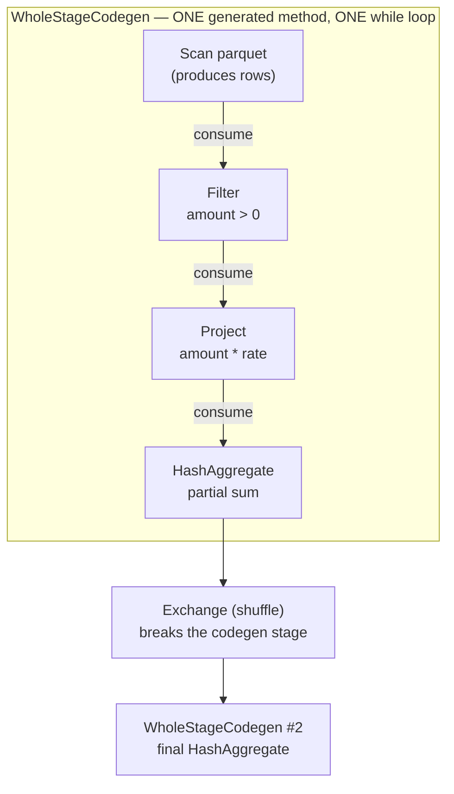

# Project Tungsten: Binary Memory, Whole-Stage Codegen, and the CPU-Bound Era of Spark

> Chapter from the **Data Engineering Playbook** — spark-internals.

## TL;DR

- Tungsten is the execution-engine rewrite (Spark 1.4–2.0) that moved Spark from a JVM-object, iterator-per-row model to **off-heap binary rows** (`UnsafeRow`) and **whole-stage code generation** (WSCG). The premise: once shuffle and I/O were optimized, the bottleneck became the CPU — branch misprediction, virtual dispatch, and GC, not the disk.
- `UnsafeRow` stores a row as a flat byte buffer (null-bitset + fixed-length region + variable-length region) so Spark can compare, hash, and copy rows without ever deserializing into JVM objects. This is what makes sort and hash-aggregate operate at near-`memcpy` speeds.
- Whole-stage codegen **collapses an entire pipeline of operators into a single generated Java method** with a tight `while` loop, eliminating the per-row virtual `next()/hasNext()` calls of the Volcano iterator model. You see it as `WholeStageCodegen` boxes and a `*(n)` prefix in `df.explain()`.
- The `TungstenAggregate` (`HashAggregateExec`) uses an off-heap `BytesToBytesMap` and falls back to a sort-based aggregate under memory pressure — the fallback is a real, observable cliff in production.
- Codegen is not free: methods over **8KB bytecode** stop being JIT-compiled by HotSpot, the **64KB method limit** forces a fallback to the interpreted path, and very wide schemas (hundreds of columns) routinely defeat it. Knowing *when codegen silently turns off* is the senior skill.
- You rarely toggle Tungsten directly. You manage it through `spark.sql.codegen.wholeStage`, `spark.sql.codegen.maxFields`, off-heap memory (`spark.memory.offHeap.*`), and by writing queries that don't blow the method-size limits.

## Why this matters in production

Around 2014, the Databricks team made an uncomfortable observation: the standard advice to optimize Spark jobs assumed I/O and network were the bottleneck, but on a large fraction of real workloads, **the CPU was idle waiting on cache misses and the disk was not the constraint** — modern NVMe and 10GbE had outrun the JVM's ability to push rows through a chain of boxed objects. Every row was a `GenericRow` of `java.lang.Object`; every operator was a Scala iterator calling `next()` on its child; every `Long` was a heap allocation feeding the garbage collector.

Here is the scenario that makes it concrete. You run a `GROUP BY` aggregation over 2 billion rows of clickstream. Without Tungsten, each row materializes as a JVM object, the aggregation hash map keys on boxed `Tuple`s, and the GC spends 30–40% of executor wall-clock time scanning a heap full of short-lived `Long` and `UTF8String` wrappers. You see it in the Spark UI as **"GC Time" approaching "Task Time"** and in GC logs as relentless young-gen collections. Adding executors barely helps — you're not I/O bound, you're allocation bound.

Tungsten attacks this at three levels:

1. **Memory:** store the row as raw bytes off-heap so there are no JVM objects to allocate or collect.
2. **Cache:** lay out data so the hot path is sequential and cache-line friendly, and use `sun.misc.Unsafe` for direct memory access.
3. **CPU:** generate code at runtime so the JIT sees a flat loop it can inline and vectorize, instead of a megamorphic chain of `Iterator.next()` calls.

The payoff on that aggregation is often **2–10×** on CPU-bound stages and a collapse of GC time to single digits. If you've ever wondered why a Spark 2.x job crushed the equivalent Spark 1.3 job on identical hardware, this is most of the answer. It pairs directly with [Catalyst](../catalyst/) — Catalyst decides *what* the plan is; Tungsten decides *how fast the bytes move through it*.

## How it works

Tungsten has two load-bearing pieces: the binary row format and whole-stage codegen.

### The `UnsafeRow` binary format

An `UnsafeRow` is a contiguous byte region with three parts:

```
+-------------------+------------------------+--------------------------+
|  Null bit set     |  Fixed-length values   |  Variable-length values  |
|  (8-byte aligned) |  (8 bytes per field)   |  (strings, arrays, ...)  |
+-------------------+------------------------+--------------------------+
```

- The **null bit set** is one bit per field, 8-byte aligned. Checking nullability is a bit test, not a method call.
- The **fixed-length region** stores every field in exactly 8 bytes. Primitives (`long`, `double`, `int` widened to 8) sit here directly. For variable-length types (`String`, `binary`, `array`, `map`, `struct`), this slot holds an **offset+length pointer** (high 32 bits = offset, low 32 bits = length) into the variable region.
- The **variable-length region** holds the actual bytes of strings (`UTF8String`), nested structs, and arrays, appended sequentially.

Because everything is 8-byte aligned and offsets are relative, Spark can:

- **Compare** two rows for sort by comparing prefix bytes (radix/prefix sort on the 8-byte sort-key prefix — see [skew-handling](../skew-handling/) for why this matters under skew).
- **Hash** a row by hashing the byte range directly (Murmur3 over the buffer).
- **Copy/spill** a row with a single `Platform.copyMemory` — no field-by-field serialization.

The practical consequence: sort, hash-aggregate, and shuffle all operate on opaque byte ranges. There is no per-field boxing on the hot path.

### Whole-stage code generation (WSCG)

The classic "Volcano" model executes a query as a tree of iterators, each calling `next()` on its child. For a `Filter → Project → Aggregate` chain over a billion rows, that's billions of polymorphic virtual calls — the CPU can't predict the branch targets, the JIT can't inline across the iterator boundary, and you pay a function-call overhead per row per operator.

WSCG fuses a chain of operators **into a single generated Java function** with a flat loop. Operators implement the `CodegenSupport` trait and contribute fragments via a producer/consumer protocol: a parent operator calls `produce()` on its child, the child generates a loop that calls back into the parent's `consume()` to emit the per-row logic inline.



Key rule: a codegen stage is **bounded by operators that break pipelining** — most importantly `Exchange` (shuffle) and sort. Inside a stage you get one method; at each shuffle boundary a new stage (and new generated method) begins. That's why `explain()` shows multiple `WholeStageCodegen` blocks numbered `*(1)`, `*(2)`, etc.

The generated code for the chain above is roughly:

```java
// conceptual — actual generated code is uglier
while (scan_input.hasNext()) {
  InternalRow row = scan_input.next();
  long amount = row.getLong(2);
  if (!(amount > 0)) continue;              // Filter, inlined
  double rate = row.getDouble(5);
  double revenue = amount * rate;           // Project, inlined
  long key = row.getLong(0);
  agg_hashMap.merge(key, revenue);          // partial Aggregate, inlined
}
```

One loop, no virtual dispatch, fully JIT-inlineable. The `continue` for the filter is a single predictable branch.

## Deep dive — the parts engineers get wrong

### 1. Codegen silently falls back, and you won't notice unless you look

There are several hard limits that turn codegen off **per stage, at runtime, without an error**:

- **The 64KB JVM method-size limit.** Generated methods cannot exceed 64KB of bytecode. Wide queries — hundreds of projected columns, deeply nested `CASE WHEN`, large `IN` lists — blow past this. Spark catches the `CompileException` / `JaninoRuntimeException` and falls back to the interpreted code path for that whole stage. You'll see a warning like `Whole-stage codegen disabled for this plan ... grows beyond 64 KB` in the executor logs, then your "fast" stage runs 3–5× slower with no other signal.
- **`spark.sql.codegen.maxFields` (default 100).** If a schema has more than this many fields, WSCG is disabled for that operator. This is the silent killer for very wide tables (think 300-column denormalized marts). The fix is often to project down *before* the wide operation, not after.
- **The 8KB JIT threshold.** HotSpot's `-XX:-DontCompileHugeMethods` default refuses to JIT methods over 8000 bytes of bytecode. A generated method can be valid (< 64KB) but too big to JIT — so it runs interpreted, which can be *slower than no codegen at all*. This is the subtle one: codegen "worked" but the JIT punted.

The senior move: when a CPU-bound stage is mysteriously slow, run `df.explain("codegen")` (Spark 3.0+) or check for the absence of `*` prefixes in `explain()`. No `*` means no codegen on that operator.

### 2. Off-heap memory is opt-in and separate from execution memory

People conflate "Tungsten uses off-heap" with "Spark runs off-heap by default." It does not. By default Tungsten's binary buffers live in **on-heap** memory managed by the unified `MemoryManager`. True off-heap (`sun.misc.Unsafe.allocateMemory`) only kicks in when you set:

```
spark.memory.offHeap.enabled  true
spark.memory.offHeap.size     <bytes>   # e.g. 4g — NOT a fraction, an absolute size
```

Off-heap helps because it removes the binary buffers from GC's reach entirely and reduces heap pressure, but it is **not** counted in `spark.executor.memory` — it's additive. A common OOM-at-the-container-level failure is enabling 8g off-heap on executors sized for 16g heap inside a 16g YARN/K8s container, and getting killed with exit 137 (`Container killed ... exceeded physical memory`). Off-heap size must be budgeted into the container request alongside heap + overhead.

### 3. `TungstenAggregate` and the sort-fallback cliff

`HashAggregateExec` (the operator labeled `HashAggregate`/`TungstenAggregate`) builds an off-heap `BytesToBytesMap` keyed by the grouping columns. When that map can't grow within the task's execution-memory share, it **spills and switches to a sort-based aggregate** (`ObjectHashAggregateExec` / `SortAggregateExec`). This is correct but slow — you pay a full sort. In the UI it shows up as **spill (memory)** and **spill (disk)** on the aggregate task and a sudden tail-latency blowup on a few tasks.

Triggers and mitigations:
- High-cardinality grouping keys (millions of distinct groups per partition) overflow the map → repartition by the grouping key first so each task sees fewer distinct groups.
- `collect_list` / `collect_set` / `percentile` are **typed imperative aggregates** that don't use the binary hash map at all — they route to `ObjectHashAggregateExec` and are far heavier. Watch for these in plans.

### 4. Codegen interacts with the row format — and UDFs break the chain

A Scala/Python UDF is a black box to the code generator. When a stage hits a UDF, Spark must **deserialize the `UnsafeRow` into JVM objects**, call your function, and re-serialize. That serialize/deserialize boundary defeats the entire point of Tungsten for that operator. A PySpark UDF is worse: it ships rows out to a Python worker process (until Arrow-based pandas UDFs, which at least batch and zero-copy via Arrow). Rule of thumb: **every plain UDF is a Tungsten off-ramp.** Prefer built-in expressions (which are codegen-aware via `Expression.doGenCode`) or `pandas_udf` with Arrow.

### 5. Vectorized Parquet reader is part of the same story

The `VectorizedParquetRecordReader` (`spark.sql.parquet.enableVectorizedReader`, default `true`) reads Parquet into `ColumnarBatch` / `ColumnVector` (off-heap column buffers) and feeds them into codegen in batches of `spark.sql.parquet.columnarReaderBatchSize` (default 4096) rows. This is columnar-in, row-codegen-out, and it's why scan stages are so fast. Reading complex nested types or certain decimal layouts can disable the vectorized path and fall back to row-by-row — another silent slowdown to watch for.

## Worked example

Demonstrating codegen presence, the wide-schema fallback, and the UDF off-ramp.

```python
from pyspark.sql import SparkSession
from pyspark.sql import functions as F

spark = (
    SparkSession.builder
    .appName("tungsten-demo")
    .config("spark.memory.offHeap.enabled", "true")
    .config("spark.memory.offHeap.size", "2g")          # absolute, budget into container
    .config("spark.sql.codegen.wholeStage", "true")     # default true; shown for clarity
    .config("spark.sql.codegen.maxFields", "100")       # WSCG off above this many fields
    .getOrCreate()
)

events = spark.range(0, 2_000_000_000).select(
    (F.col("id") % 1000).alias("user_id"),
    (F.rand() * 100).alias("amount"),
    F.lit(0.85).alias("rate"),
)

agg = (
    events
    .filter(F.col("amount") > 0)
    .withColumn("revenue", F.col("amount") * F.col("rate"))
    .groupBy("user_id")
    .agg(F.sum("revenue").alias("total_revenue"))
)

# Inspect the physical plan. The `*(n)` prefix == this operator is inside a
# whole-stage-codegen block n.
agg.explain()
```

Expected plan (note the `*` markers and the `Exchange` that splits the two codegen stages):

```
== Physical Plan ==
*(2) HashAggregate(keys=[user_id], functions=[sum(revenue)])
+- Exchange hashpartitioning(user_id, 200)
   +- *(1) HashAggregate(keys=[user_id], functions=[partial_sum(revenue)])
      +- *(1) Project [(id % 1000) AS user_id, ((rand() * 100) * 0.85) AS revenue]
         +- *(1) Filter ((rand() * 100) > 0.0)
            +- *(1) Range (0, 2000000000, step=1, splits=...)
```

`*(1)` fuses Range → Filter → Project → partial HashAggregate into one generated method; the shuffle breaks it; `*(2)` is the final aggregate. Everything is codegen — good.

Now the UDF off-ramp. Replace the arithmetic with a Python UDF and watch the `*` disappear from that operator:

```python
@F.udf("double")
def apply_rate(amount, rate):
    return amount * rate                      # opaque to codegen

bad = (
    events
    .withColumn("revenue", apply_rate(F.col("amount"), F.col("rate")))
    .groupBy("user_id").agg(F.sum("revenue"))
)
bad.explain()
# The Project around the UDF will NOT carry a `*` prefix: BatchEvalPython +
# serialize/deserialize to a Python worker. Tungsten is bypassed there.
```

To confirm the wide-schema fallback, generate a 150-column projection and you'll see the warning `... grows beyond 64 KB` (or operators losing their `*` once you exceed `maxFields=100`). Confirm the fix by projecting only needed columns before the aggregate.

## Production patterns

- **Keep `df.explain()` in your review loop, reading for the `*` prefix.** A CPU-bound stage with no `*` is your first hypothesis for a regression. In Spark 3.x, `df.explain("formatted")` and `explain("codegen")` give per-operator detail.
- **Project narrow, early.** Push column pruning ahead of joins/aggregates so wide-schema fallbacks (`maxFields`, 64KB) never trigger. Selecting 12 columns out of 300 before a `groupBy` is the difference between codegen on and off.
- **Budget off-heap into the container, not the heap.** `executor memory request = spark.executor.memory + spark.executor.memoryOverhead + spark.memory.offHeap.size`. On Kubernetes/YARN, exit 137 with off-heap enabled almost always means you forgot the additive term.
- **Replace UDFs with native expressions or Arrow `pandas_udf`.** Native expressions stay inside codegen; pandas UDFs at least batch via Arrow and avoid per-row Python round-trips. Audit plans for `BatchEvalPython` / `ArrowEvalPython`.
- **Watch aggregate spill metrics.** Spill (memory)/(disk) on `HashAggregate` tasks signals the `BytesToBytesMap` overflowed into the sort fallback. Pre-shuffle on the grouping key to bound distinct-group count per task.
- **Prefer typed built-ins over `collect_list`/`percentile` where possible.** Those route to `ObjectHashAggregate` and skip the fast binary map.
- **Raise `spark.sql.parquet.columnarReaderBatchSize` cautiously** for very narrow scans, and confirm the vectorized reader is actually engaged (no row-by-row fallback for exotic nested types).

## Anti-patterns & failure modes

| Anti-pattern | Symptom you observe | Fix |
|---|---|---|
| Wide projection before aggregate (300+ cols) | Executor log `Whole-stage codegen ... grows beyond 64 KB`; stage 3–5× slower; no `*` in plan | Project to needed columns first; check `spark.sql.codegen.maxFields` |
| Generated method valid but > 8KB | Codegen "on" yet slow; method runs interpreted | Simplify expressions / split query; the method is too big for HotSpot JIT |
| Plain Python/Scala UDF in hot path | `BatchEvalPython`/`Project` without `*`; high serde + Python-worker time | Native expression or Arrow `pandas_udf` |
| Off-heap enabled, container not resized | Exit 137 / `Container killed ... exceeded physical memory` | Add `spark.memory.offHeap.size` to container memory request |
| High-cardinality `groupBy` | Aggregate spill (memory/disk); a few straggler tasks dominate | Repartition by grouping key; reduce distinct groups per task |
| `collect_list`/`percentile` at scale | `ObjectHashAggregate` in plan; heavy GC despite Tungsten | Reframe with windowing or approximate aggregates (`approx_percentile`) |
| Exotic nested Parquet types | Vectorized reader silently off; slow scan | Flatten schema or accept the row reader; verify with `enableVectorizedReader` metrics |

## Decision guidance

| Situation | Lean on | Why |
|---|---|---|
| CPU-bound aggregation/projection, plain types | Default Tungsten + WSCG, on-heap | The common case; codegen + binary rows do the work for free |
| GC dominating task time, large executors | Enable off-heap (`spark.memory.offHeap.*`) | Moves binary buffers out of GC's reach; budget the container |
| Wide schema (>100 fields) on hot operator | Project narrow first; possibly accept codegen off | `maxFields`/64KB will disable WSCG anyway; narrow the data |
| Need custom per-row logic | Native expression > Arrow pandas_udf > plain UDF | Each step down is a bigger Tungsten off-ramp |
| Very high cardinality group-by | Pre-shuffle / repartition by key | Keeps `BytesToBytesMap` from spilling to sort fallback |
| Tiny datasets / interactive | Don't overthink it | Codegen compile time can exceed run time on trivial data |

Tungsten is not a feature you "adopt" — it's the engine. The decision is always *how to write the query so Tungsten stays engaged.*

## Interview & architecture-review talking points

- "Tungsten moved Spark from an allocation-bound to a CPU-instruction-bound profile. The two levers are `UnsafeRow` (binary, off-heap-capable, sort/hash on raw bytes) and whole-stage codegen (collapse the operator chain into one JIT-friendly loop)."
- "I read physical plans for the `*` prefix. No `*` on a CPU-bound stage is my first regression hypothesis — usually the 64KB method limit, the 100-field `maxFields` cap, or a UDF breaking the chain."
- "Off-heap is opt-in and *additive* to executor memory. The classic mistake is enabling it without resizing the container, then debugging exit-137 kills."
- "Every plain UDF is a Tungsten off-ramp: it deserializes `UnsafeRow` to JVM objects, and in PySpark ships rows to a Python worker. I push teams toward native expressions or Arrow pandas UDFs."
- "The aggregate sort-fallback is a real cliff. `HashAggregate` spill metrics mean the binary map overflowed; the answer is reducing distinct-group count per task, not just more memory."
- This complements [Catalyst](../catalyst/) (logical/physical planning), [AQE](../aqe/) (runtime re-planning), and [broadcast-join](../broadcast-join/) (which join strategy feeds the codegen stages).

## Further reading

- Sibling chapters: [Catalyst optimizer](../catalyst/) · [Adaptive Query Execution](../aqe/) · [Broadcast joins](../broadcast-join/) · [Partitioning](../partitioning/) · [Skew handling](../skew-handling/)
- Databricks engineering blog — ["Project Tungsten: Bringing Apache Spark Closer to Bare Metal"](https://www.databricks.com/blog/2015/04/28/project-tungsten-bringing-spark-closer-to-bare-metal.html)
- Databricks engineering blog — ["Apache Spark as a Compiler: Joining a Billion Rows per Second on a Laptop"](https://www.databricks.com/blog/2016/05/23/apache-spark-as-a-compiler-joining-a-billion-rows-per-second-on-a-laptop.html) (the whole-stage codegen write-up)
- Neumann, T. (2011). *Efficiently Compiling Efficient Query Plans for Modern Hardware*, VLDB — the produce/consume codegen model Spark borrows from.
